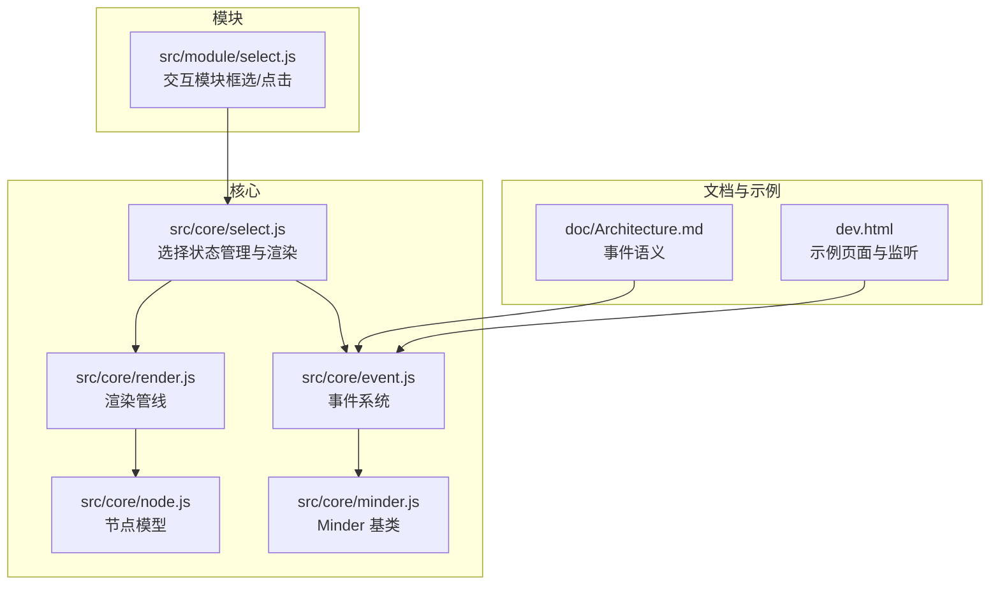
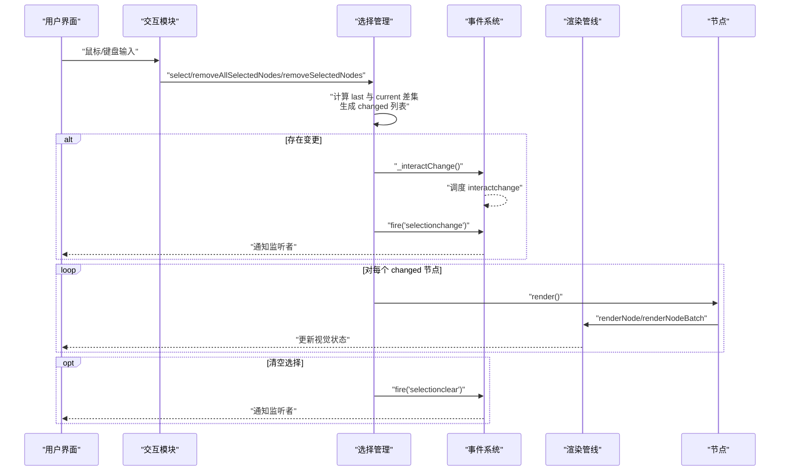
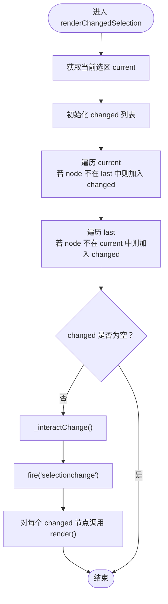
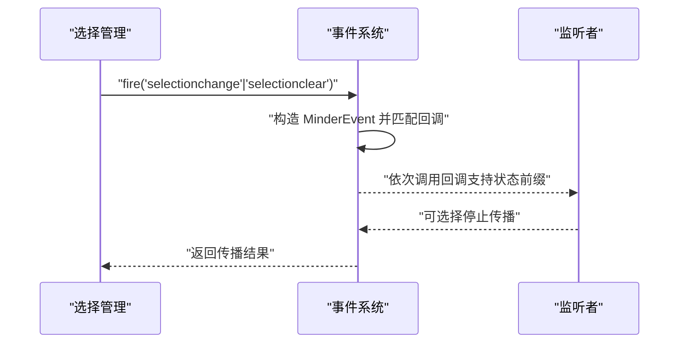
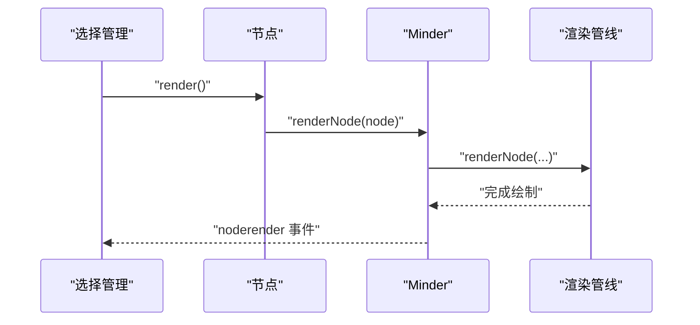
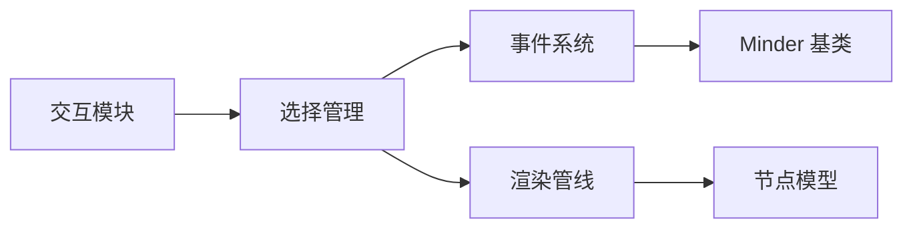

# 选择状态同步

<cite>
**本文引用的文件**
- [src/core/select.js](file://src/core/select.js)
- [src/core/event.js](file://src/core/event.js)
- [src/core/render.js](file://src/core/render.js)
- [src/module/select.js](file://src/module/select.js)
- [src/core/node.js](file://src/core/node.js)
- [src/core/minder.js](file://src/core/minder.js)
- [doc/Architecture.md](file://doc/Architecture.md)
- [dev.html](file://dev.html)
</cite>

## 目录
1. [引言](#引言)
2. [项目结构](#项目结构)
3. [核心组件](#核心组件)
4. [架构总览](#架构总览)
5. [详细组件分析](#详细组件分析)
6. [依赖关系分析](#依赖关系分析)
7. [性能考量](#性能考量)
8. [故障排查指南](#故障排查指南)
9. [结论](#结论)
10. [附录](#附录)

## 引言
本文件围绕“节点选择状态变更同步机制”展开，重点解释选择状态变化后的渲染更新与事件通知流程。我们将深入解析 renderChangedSelection 方法的实现逻辑，阐明其如何通过比较变更前后的选区（last 与 current），利用 indexOf 判断节点的新增或移除，生成 changed 节点列表；随后触发 _interactChange() 以调度 interactchange 事件，并 fire('selectionchange') 通知所有监听者选区已变更；同时在清空选择时 fire('selectionclear') 通知相关模块。此外，我们将结合事件系统说明 selectionchange 和 selectionclear 的传播机制与监听方式，并给出针对选择状态不同步、重复渲染导致性能下降等问题的优化建议（如节流、精确比对）。

## 项目结构
本仓库采用模块化组织，选择状态相关的核心逻辑分布在以下文件：
- 选择状态管理与渲染：src/core/select.js
- 事件系统与交互事件调度：src/core/event.js
- 渲染管线与节点渲染：src/core/render.js
- 用户交互模块（框选、点击切换等）：src/module/select.js
- 节点模型与工具：src/core/node.js、src/core/minder.js
- 架构文档与事件语义说明：doc/Architecture.md
- 示例页面与事件监听演示：dev.html

图表来源
- [src/core/select.js](file://src/core/select.js#L1-L146)
- [src/core/event.js](file://src/core/event.js#L1-L270)
- [src/core/render.js](file://src/core/render.js#L1-L261)
- [src/module/select.js](file://src/module/select.js#L1-L184)
- [src/core/node.js](file://src/core/node.js#L1-L200)
- [src/core/minder.js](file://src/core/minder.js#L1-L41)
- [doc/Architecture.md](file://doc/Architecture.md#L414-L438)
- [dev.html](file://dev.html#L188-L200)

章节来源
- [src/core/select.js](file://src/core/select.js#L1-L146)
- [src/core/event.js](file://src/core/event.js#L1-L270)
- [src/core/render.js](file://src/core/render.js#L1-L261)
- [src/module/select.js](file://src/module/select.js#L1-L184)
- [src/core/node.js](file://src/core/node.js#L1-L200)
- [src/core/minder.js](file://src/core/minder.js#L1-L41)
- [doc/Architecture.md](file://doc/Architecture.md#L414-L438)
- [dev.html](file://dev.html#L188-L200)

## 核心组件
- 选择状态管理与渲染：负责维护当前选区、计算变更、触发渲染与事件通知。
- 事件系统：统一的事件注册、分发与传播机制，支持 before/pre/execute/after 生命周期以及状态前缀回调。
- 渲染管线：将节点渲染为图形元素，支持批量渲染与逐节点渲染。
- 交互模块：响应鼠标/键盘输入，驱动选择状态变更。
- 节点模型：提供 isSelected 等辅助方法，便于模块间协作。

章节来源
- [src/core/select.js](file://src/core/select.js#L1-L146)
- [src/core/event.js](file://src/core/event.js#L133-L266)
- [src/core/render.js](file://src/core/render.js#L165-L219)
- [src/module/select.js](file://src/module/select.js#L111-L181)
- [src/core/node.js](file://src/core/node.js#L139-L144)

## 架构总览
选择状态变更的端到端流程如下：
- 用户交互（模块）改变选区（增删节点）
- 选择管理模块计算 last 与 current 的差集，得到 changed 列表
- 若存在变更，触发 _interactChange() 以调度 interactchange 事件
- 触发 selectionchange 事件，通知所有监听者
- 对 changed 中的节点调用 render()，触发渲染更新
- 清空选择时触发 selectionclear 事件

图表来源
- [src/module/select.js](file://src/module/select.js#L111-L181)
- [src/core/select.js](file://src/core/select.js#L17-L40)
- [src/core/event.js](file://src/core/event.js#L184-L192)
- [src/core/render.js](file://src/core/render.js#L165-L219)
- [src/core/node.js](file://src/core/node.js#L226-L239)

## 详细组件分析

### renderChangedSelection 方法实现逻辑
renderChangedSelection 是选择状态变更同步的核心方法，其职责包括：
- 获取当前选区 current
- 与上次选区 last 比较，分别找出新增与移除的节点，合并为 changed 列表
- 若 changed 非空：
  - 调用 _interactChange() 触发交互事件
  - fire('selectionchange') 通知所有监听者
- 对 changed 中的每个节点调用 render()，触发渲染更新

图表来源
- [src/core/select.js](file://src/core/select.js#L17-L40)

章节来源
- [src/core/select.js](file://src/core/select.js#L17-L40)

### 事件系统与 selectionchange/selectionclear 的传播机制
事件系统提供统一的 on/off/fire 接口，并支持：
- 事件生命周期：before、pre、execute、after
- 状态前缀回调：例如 normal.keydown
- 事件传播控制：stopPropagation、stopPropagationImmediately
- 交互事件去抖：_interactChange() 通过定时器对连续交互事件进行稀释

selectionchange 与 selectionclear 的传播路径：
- selectionchange：由 renderChangedSelection 在存在变更时触发
- selectionclear：由 removeAllSelectedNodes 在清空选区时触发
- 两者均通过 fire(type) 分发，事件系统根据类型与状态匹配回调

图表来源
- [src/core/event.js](file://src/core/event.js#L194-L266)
- [src/core/select.js](file://src/core/select.js#L48-L54)

章节来源
- [src/core/event.js](file://src/core/event.js#L133-L266)
- [src/core/select.js](file://src/core/select.js#L33-L40)
- [src/core/select.js](file://src/core/select.js#L48-L54)

### 交互模块对选择状态的影响
交互模块（框选、点击、快捷键）直接驱动选择状态变更：
- 框选：计算选中范围并调用 select(selectedNodes, true)
- 点击：根据是否按住修饰键决定单选、多选或切换
- 快捷键：如 Ctrl+A 全选

这些操作最终都会调用选择管理模块的 select/removeSelectedNodes/removeAllSelectedNodes，从而触发 renderChangedSelection。

章节来源
- [src/module/select.js](file://src/module/select.js#L111-L181)
- [src/core/select.js](file://src/core/select.js#L69-L81)
- [src/core/select.js](file://src/core/select.js#L55-L68)
- [src/core/select.js](file://src/core/select.js#L48-L54)

### 渲染更新与视觉状态
渲染管线负责将节点渲染为图形元素：
- renderNode/renderNodeBatch：创建/更新渲染图形，合并内容盒，触发 noderender 事件
- 节点 render()：委托到 Minder.renderNode，逐节点渲染
- 选择状态变更后，对 changed 节点调用 render()，即可更新视觉状态（如高亮边框）

图表来源
- [src/core/render.js](file://src/core/render.js#L165-L219)
- [src/core/node.js](file://src/core/node.js#L226-L239)

章节来源
- [src/core/render.js](file://src/core/render.js#L165-L219)
- [src/core/node.js](file://src/core/node.js#L226-L239)

### 选择状态不同步与重复渲染问题
- 问题表现：频繁交互导致 selectionchange 事件过于密集，渲染更新重复执行，造成性能下降
- 解决思路：
  - 交互事件去抖：事件系统内部对 interactchange 已有去抖策略（_interactChange），可复用该机制减少高频事件
  - 精确比对：renderChangedSelection 已通过 last/current 差集生成 changed 列表，避免对未变化节点重复渲染
  - 节流：对可能引发大量 selectionchange 的场景（如拖动框选），可在监听侧使用节流或防抖，降低 UI 更新频率

章节来源
- [src/core/event.js](file://src/core/event.js#L184-L192)
- [src/core/select.js](file://src/core/select.js#L17-L40)

### 事件监听示例与最佳实践
- 监听 selectionchange：在示例页面中展示了如何监听 selectionchange 并据此更新按钮状态
- 监听 selectionclear：当清空选择时，可通过 fire('selectionclear') 通知相关模块进行清理
- 最佳实践：
  - 在监听回调中避免长耗时操作，必要时使用 requestAnimationFrame 或 setTimeout
  - 对批量选择变更（如框选）采用节流策略，减少 UI 更新次数
  - 使用状态前缀事件（如 normal.keydown）精准绑定特定状态下的行为

章节来源
- [dev.html](file://dev.html#L188-L200)
- [src/core/event.js](file://src/core/event.js#L232-L266)
- [src/core/select.js](file://src/core/select.js#L48-L54)

## 依赖关系分析
- 选择管理模块依赖事件系统与渲染管线，用于事件通知与渲染更新
- 交互模块依赖选择管理模块，驱动选区变更
- 渲染管线依赖节点模型，将节点转换为图形元素
- 事件系统依赖 Minder 基类，提供统一的事件接口

图表来源
- [src/module/select.js](file://src/module/select.js#L111-L181)
- [src/core/select.js](file://src/core/select.js#L17-L40)
- [src/core/event.js](file://src/core/event.js#L133-L266)
- [src/core/render.js](file://src/core/render.js#L165-L219)
- [src/core/node.js](file://src/core/node.js#L1-L200)
- [src/core/minder.js](file://src/core/minder.js#L1-L41)

章节来源
- [src/module/select.js](file://src/module/select.js#L111-L181)
- [src/core/select.js](file://src/core/select.js#L17-L40)
- [src/core/event.js](file://src/core/event.js#L133-L266)
- [src/core/render.js](file://src/core/render.js#L165-L219)
- [src/core/node.js](file://src/core/node.js#L1-L200)
- [src/core/minder.js](file://src/core/minder.js#L1-L41)

## 性能考量
- 交互事件去抖：事件系统内部对 interactchange 已有去抖策略，可有效缓解高频交互带来的性能压力
- 精准渲染：renderChangedSelection 仅对 changed 节点调用 render()，避免对未变化节点重复渲染
- 批量渲染：在需要时使用 renderNodeBatch 可减少多次 DOM 操作
- 监听侧节流：对可能引发大量 selectionchange 的场景，在监听回调中使用节流或防抖，降低 UI 更新频率

章节来源
- [src/core/event.js](file://src/core/event.js#L184-L192)
- [src/core/select.js](file://src/core/select.js#L17-L40)
- [src/core/render.js](file://src/core/render.js#L86-L163)

## 故障排查指南
- 选择状态不同步：
  - 确认交互模块是否正确调用了 select/removeSelectedNodes/removeAllSelectedNodes
  - 检查 renderChangedSelection 是否被调用，以及 last/current 是否正确传递
- 事件未触发：
  - 确认是否监听了正确的事件类型（selectionchange/selectionclear）
  - 检查事件系统是否正确注册回调，注意状态前缀事件的命名规范
- 渲染未更新：
  - 确认 changed 列表非空，且对每个节点都调用了 render()
  - 检查渲染管线是否正常工作，节点是否处于附加状态

章节来源
- [src/module/select.js](file://src/module/select.js#L111-L181)
- [src/core/select.js](file://src/core/select.js#L17-L40)
- [src/core/event.js](file://src/core/event.js#L194-L266)
- [src/core/render.js](file://src/core/render.js#L165-L219)

## 结论
选择状态变更同步机制通过“精确比对 + 事件通知 + 渲染更新”的闭环实现，确保 UI 与数据保持一致。renderChangedSelection 以最小代价识别变更节点，事件系统提供稳定的传播通道，渲染管线保障视觉状态及时更新。结合事件系统的去抖策略与监听侧的节流/防抖，可有效解决高频交互导致的性能问题。

## 附录
- 事件语义参考：selectionchange 与 selectionclear 的触发时机与参数说明见架构文档
- 示例页面展示了 selectionchange 的监听与 UI 状态更新

章节来源
- [doc/Architecture.md](file://doc/Architecture.md#L414-L438)
- [dev.html](file://dev.html#L188-L200)