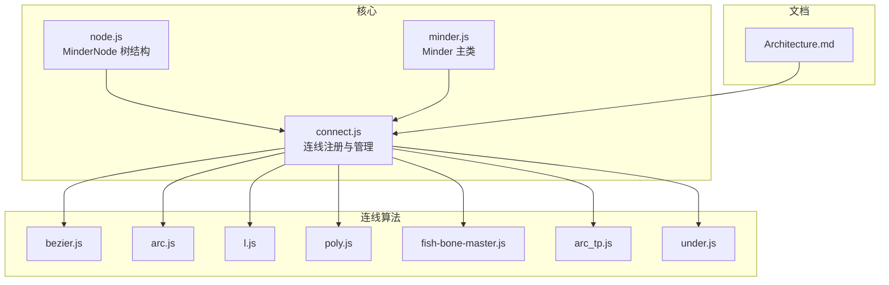
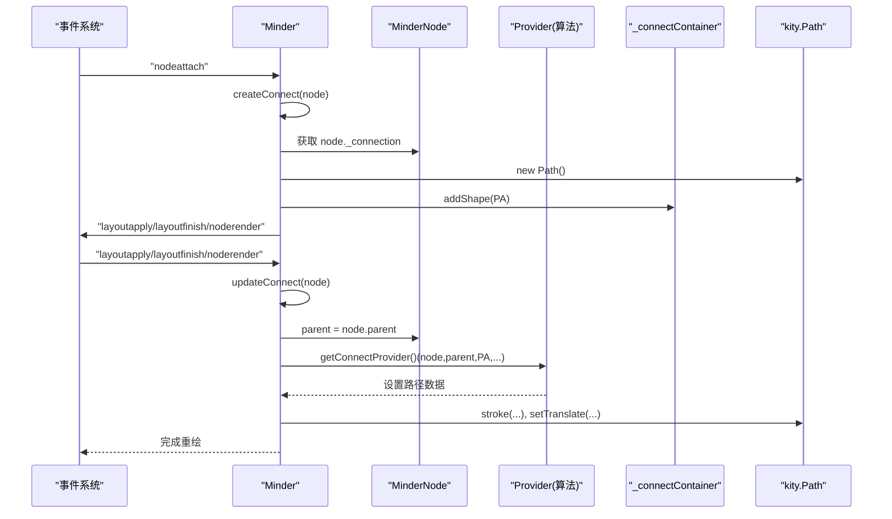
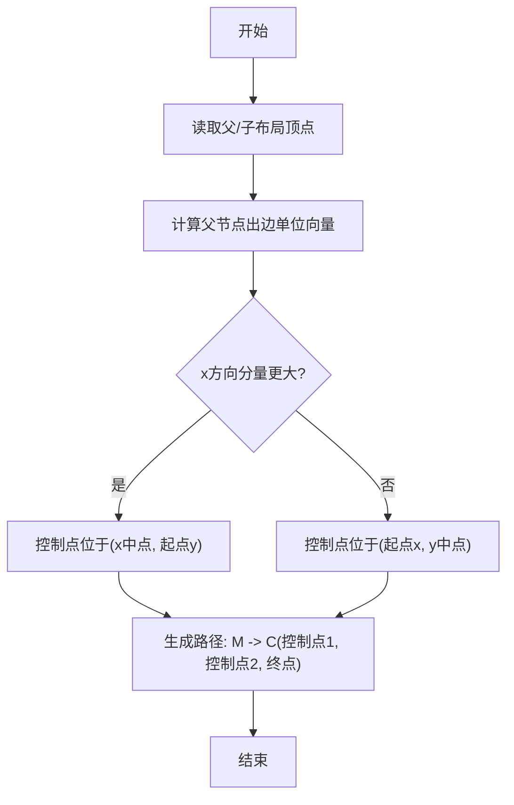
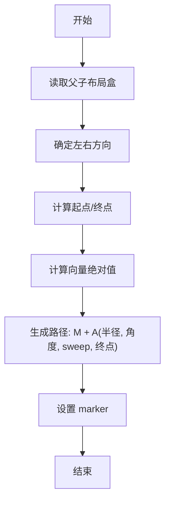
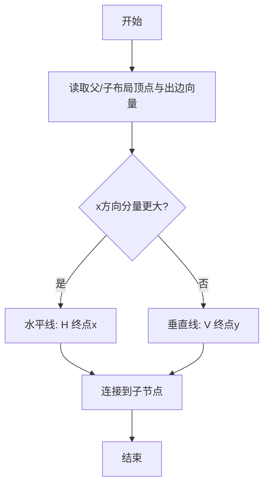
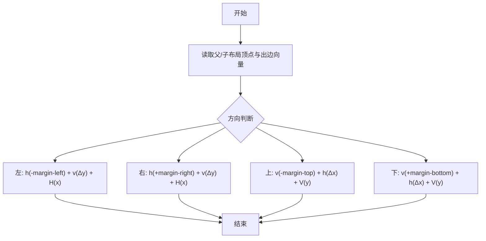
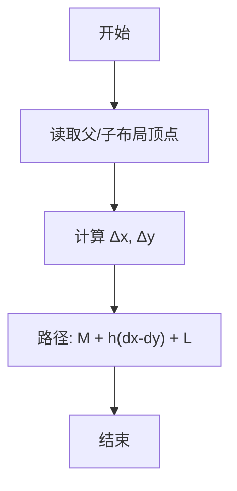
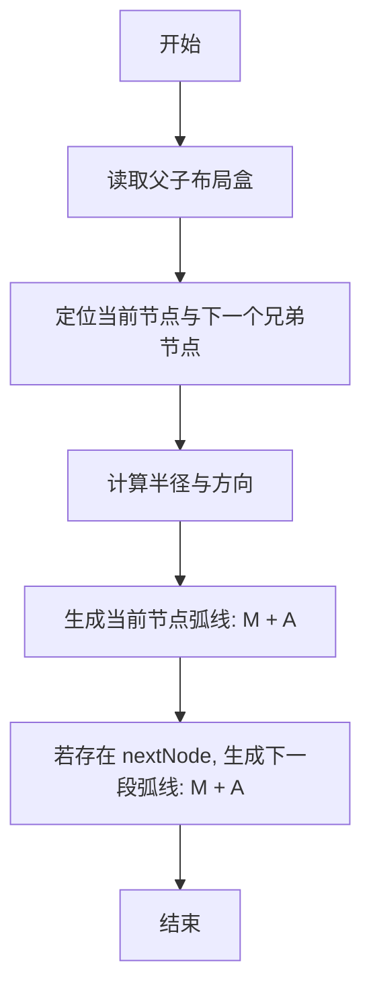
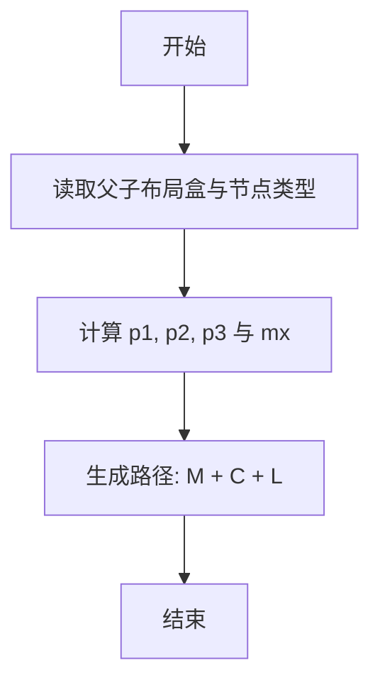
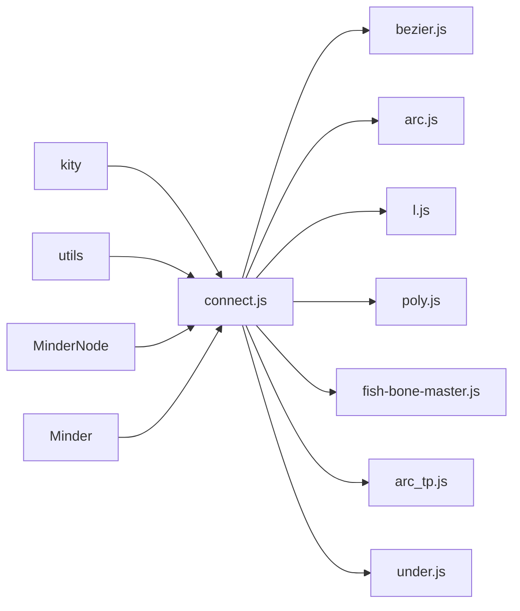

# 父子连线

<cite>
**本文引用的文件**
- [src/core/connect.js](file://src/core/connect.js)
- [src/connect/bezier.js](file://src/connect/bezier.js)
- [src/connect/arc.js](file://src/connect/arc.js)
- [src/connect/l.js](file://src/connect/l.js)
- [src/connect/poly.js](file://src/connect/poly.js)
- [src/connect/fish-bone-master.js](file://src/connect/fish-bone-master.js)
- [src/connect/arc_tp.js](file://src/connect/arc_tp.js)
- [src/connect/under.js](file://src/connect/under.js)
- [src/core/node.js](file://src/core/node.js)
- [src/core/minder.js](file://src/core/minder.js)
- [doc/Architecture.md](file://doc/Architecture.md)
</cite>

## 目录
1. [简介](#简介)
2. [项目结构](#项目结构)
3. [核心组件](#核心组件)
4. [架构总览](#架构总览)
5. [详细组件分析](#详细组件分析)
6. [依赖分析](#依赖分析)
7. [性能考虑](#性能考虑)
8. [故障排查指南](#故障排查指南)
9. [结论](#结论)

## 简介
本文围绕父子连线系统，系统讲解如何通过核心模块统一管理父子连线的创建、更新与销毁，并通过注册机制将多种连线算法（贝塞尔曲线、圆弧、直线、折线、鱼骨主线、天盘圆弧、下划线）接入到渲染管线中。同时结合架构文档，解释 v2 数据模型中父子连线如何隐式存在于树结构中，无需在 connections 字段中显式定义，以及在节点移动或布局变化时如何自动重绘。

## 项目结构
父子连线相关的核心代码位于以下位置：
- 核心管理：src/core/connect.js
- 连线算法：src/connect/*.js
- 节点与树结构：src/core/node.js
- 主类入口：src/core/minder.js
- 架构说明：doc/Architecture.md

图表来源
- [src/core/connect.js](file://src/core/connect.js#L1-L126)
- [src/connect/bezier.js](file://src/connect/bezier.js#L1-L42)
- [src/connect/arc.js](file://src/connect/arc.js#L1-L49)
- [src/connect/l.js](file://src/connect/l.js#L1-L34)
- [src/connect/poly.js](file://src/connect/poly.js#L1-L63)
- [src/connect/fish-bone-master.js](file://src/connect/fish-bone-master.js#L1-L33)
- [src/connect/arc_tp.js](file://src/connect/arc_tp.js#L1-L85)
- [src/connect/under.js](file://src/connect/under.js#L1-L50)
- [src/core/node.js](file://src/core/node.js#L1-L407)
- [src/core/minder.js](file://src/core/minder.js#L1-L41)
- [doc/Architecture.md](file://doc/Architecture.md#L1-L722)

章节来源
- [src/core/connect.js](file://src/core/connect.js#L1-L126)
- [src/core/node.js](file://src/core/node.js#L1-L407)
- [src/core/minder.js](file://src/core/minder.js#L1-L41)
- [doc/Architecture.md](file://doc/Architecture.md#L1-L722)

## 核心组件
- 连线注册与调度：通过 register(name, provider) 将不同连线算法注册为 provider，MinderNode 通过 getConnectProvider() 获取对应算法，Minder 在 createConnect/updateConnect/removeConnect 中统一管理连线生命周期。
- 连接容器：模块初始化时创建 _connectContainer，所有连线作为 kity.Path 添加到该组中，确保渲染层级一致。
- 节点与树：MinderNode 维护父子关系，父子连线的起点/终点来自父/子节点的布局顶点或边界盒，算法根据方向与样式参数生成路径数据。

章节来源
- [src/core/connect.js](file://src/core/connect.js#L1-L126)
- [src/core/node.js](file://src/core/node.js#L1-L407)

## 架构总览
父子连线的调用链如下：
- 事件驱动：nodeattach、nodedetach、layoutapply、layoutfinish、noderender 等事件触发 updateConnect。
- 算法选择：根据节点 data.connect 或默认类型选择 provider。
- 路径生成：provider 读取父/子节点布局信息，计算路径数据并设置到 kity.Path。
- 渲染层级：所有连线统一挂载到 _connectContainer，保证层级一致。

图表来源
- [src/core/connect.js](file://src/core/connect.js#L52-L123)

章节来源
- [src/core/connect.js](file://src/core/connect.js#L52-L123)

## 详细组件分析

### 核心管理：src/core/connect.js
- 注册机制：register(name, provider) 将算法注册为 provider，支持默认类型 default。
- 节点接口：
  - getConnect(): 读取节点 data.connect，默认为 'default'。
  - getConnectProvider(): 返回对应 provider，不存在时回退到 'default'。
  - getConnection(): 返回节点缓存的连线对象。
- Minder 生命周期：
  - createConnect(node): 仅非根节点创建连线，加入 _connectContainer，并立即 updateConnect。
  - removeConnect(node): 递归移除节点及其子树的连线。
  - updateConnect(node): 根据父节点是否折叠决定可见性；读取样式 connect-color/connect-width；调用 provider 生成路径；根据线宽奇偶设置像素对齐位移。
- 模块集成：
  - init: 创建 _connectContainer 并置于渲染容器顶部，确保连线在节点之上。
  - events: 监听 nodeattach/nodedetach/layoutapply/layoutfinish/noderender，自动创建/更新/销毁连线。

章节来源
- [src/core/connect.js](file://src/core/connect.js#L1-L126)

### 算法实现与原理

#### 贝塞尔曲线（src/connect/bezier.js）
- 方向判断：根据父节点出边方向向量的 x/y 绝对值大小，决定控制点在水平还是垂直方向居中。
- 控制点：在中点处设置控制点，形成平滑曲线，避免尖锐转折。
- 路径：M 起点 + C(控制点1, 控制点2, 终点)。

图表来源
- [src/connect/bezier.js](file://src/connect/bezier.js#L1-L42)

章节来源
- [src/connect/bezier.js](file://src/connect/bezier.js#L1-L42)

#### 圆弧（src/connect/arc.js）
- 方向与半径：根据左右方向选择端点，计算向量绝对值作为圆弧半径。
- 路径：M 起点 + A(rx, ry, angle, largeArc, sweep, end)。
- 标记：使用 marker 圆点作为箭头末端，颜色随节点样式变化。

图表来源
- [src/connect/arc.js](file://src/connect/arc.js#L1-L49)

章节来源
- [src/connect/arc.js](file://src/connect/arc.js#L1-L49)

#### 直线（src/connect/l.js）
- 方向优先：优先沿 x 方向绘制水平线，否则沿 y 方向绘制垂直线，最后连接到子节点。
- 路径：M 起点 + H 或 V + L 终点。

图表来源
- [src/connect/l.js](file://src/connect/l.js#L1-L34)

章节来源
- [src/connect/l.js](file://src/connect/l.js#L1-L34)

#### 折线（src/connect/poly.js）
- 方向与边距：根据出边方向与正负，分别使用父节点的 margin-left/top/bottom/right，形成直角转折。
- 路径：M 起点 + h/v/H/V + L 终点。

图表来源
- [src/connect/poly.js](file://src/connect/poly.js#L1-L63)

章节来源
- [src/connect/poly.js](file://src/connect/poly.js#L1-L63)

#### 鱼骨主线（src/connect/fish-bone-master.js）
- 几何：先水平走 dx - dy，再直线到子节点，形成鱼骨主干的斜切效果。
- 路径：M 起点 + h(dx-dy) + L 终点。

图表来源
- [src/connect/fish-bone-master.js](file://src/connect/fish-bone-master.js#L1-L33)

章节来源
- [src/connect/fish-bone-master.js](file://src/connect/fish-bone-master.js#L1-L33)

#### 天盘圆弧（src/connect/arc_tp.js）
- 特殊性：天盘模板需要连接相邻节点，因此会同时更新当前节点与下一个兄弟节点的连线，避免视觉断线。
- 路径：M + A(半径, 半径, 0, 0, 1, end)，并处理 nextNode 的二次 A。

图表来源
- [src/connect/arc_tp.js](file://src/connect/arc_tp.js#L1-L85)

章节来源
- [src/connect/arc_tp.js](file://src/connect/arc_tp.js#L1-L85)

#### 下划线（src/connect/under.js）
- 用途：在节点下方绘制曲线连接，适合强调或装饰性连线。
- 路径：M + C(控制点) + L，控制点位于起点与中间点之间，形成柔和曲线。

图表来源
- [src/connect/under.js](file://src/connect/under.js#L1-L50)

章节来源
- [src/connect/under.js](file://src/connect/under.js#L1-L50)

### v2 数据模型与父子连线
- v2 数据结构中，父子连线隐式存在于树结构中，无需在 connections 字段中显式定义。连线类型可通过模板或节点 data.connect 指定。
- 模板示例：天盘模板通过 getConnect 返回 'arc_tp'，从而在该模板下使用圆弧连线。

章节来源
- [doc/Architecture.md](file://doc/Architecture.md#L1-L722)
- [src/template/tianpan.js](file://src/template/tianpan.js#L1-L29)

## 依赖分析
- connect.js 依赖 kity 与 utils，扩展 MinderNode 与 Minder，注册 _connectProviders，管理 _connectContainer。
- 各算法模块依赖 connect.js 的 register 接口，读取节点布局信息（布局顶点、布局盒、向量、样式）生成路径数据。
- 节点树结构由 MinderNode 维护，父子关系决定连线方向；Minder 统一调度事件与渲染。

图表来源
- [src/core/connect.js](file://src/core/connect.js#L1-L126)
- [src/connect/bezier.js](file://src/connect/bezier.js#L1-L42)
- [src/connect/arc.js](file://src/connect/arc.js#L1-L49)
- [src/connect/l.js](file://src/connect/l.js#L1-L34)
- [src/connect/poly.js](file://src/connect/poly.js#L1-L63)
- [src/connect/fish-bone-master.js](file://src/connect/fish-bone-master.js#L1-L33)
- [src/connect/arc_tp.js](file://src/connect/arc_tp.js#L1-L85)
- [src/connect/under.js](file://src/connect/under.js#L1-L50)
- [src/core/node.js](file://src/core/node.js#L1-L407)
- [src/core/minder.js](file://src/core/minder.js#L1-L41)

章节来源
- [src/core/connect.js](file://src/core/connect.js#L1-L126)
- [src/core/node.js](file://src/core/node.js#L1-L407)
- [src/core/minder.js](file://src/core/minder.js#L1-L41)

## 性能考虑
- 选择轻量算法：在大规模节点场景下，优先使用直线（l.js）或折线（poly.js）等简单路径指令，减少贝塞尔曲线的控制点计算与路径复杂度。
- 局部重绘：利用事件驱动的 updateConnect，在布局应用、布局完成、节点渲染等时机触发，避免全量重绘。
- 像素对齐：根据线宽奇偶设置 setTranslate(0.5,0.5) 或 (0,0)，减少抗锯齿导致的模糊，提升视觉清晰度。
- 天盘模板优化：arc_tp.js 会同时更新相邻节点连线，注意在大量兄弟节点时的批量更新成本，必要时可限制更新范围。

## 故障排查指南
- 连线不显示：检查父节点是否折叠（collapsed），折叠时会 setVisible(false)；确认节点 data.connect 是否正确，或回退到默认类型。
- 连线样式异常：检查节点样式 connect-color 与 connect-width 是否设置，updateConnect 会据此设置 stroke。
- 路径错误：核对算法选择是否符合布局方向（如贝塞尔/折线的方向判断），或节点样式边距（poly.js）是否合理。
- 事件未触发：确认模块事件绑定是否生效（nodeattach/nodedetach/layoutapply/layoutfinish/noderender），以及 _connectContainer 是否正确挂载到渲染容器。

章节来源
- [src/core/connect.js](file://src/core/connect.js#L52-L123)

## 结论
父子连线系统通过统一的注册与调度机制，将多种连线算法无缝接入渲染管线。核心模块负责生命周期管理与事件驱动重绘，算法模块专注于路径生成与几何计算。v2 数据模型让父子连线隐式存在于树结构中，无需显式 connections 字段，配合模板可灵活切换连线类型。在大规模场景下，建议优先采用轻量算法并结合局部重绘策略，以获得更好的性能与体验。