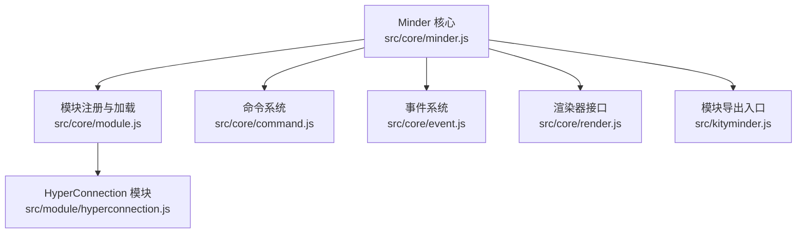
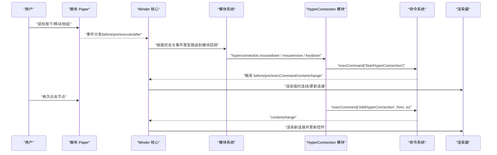
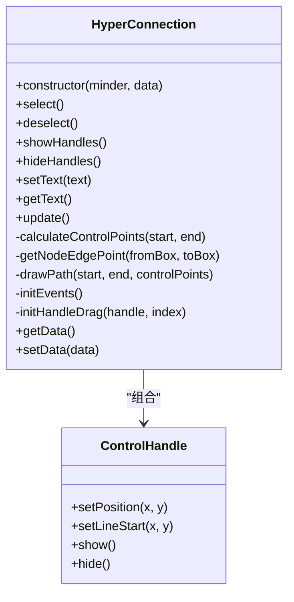
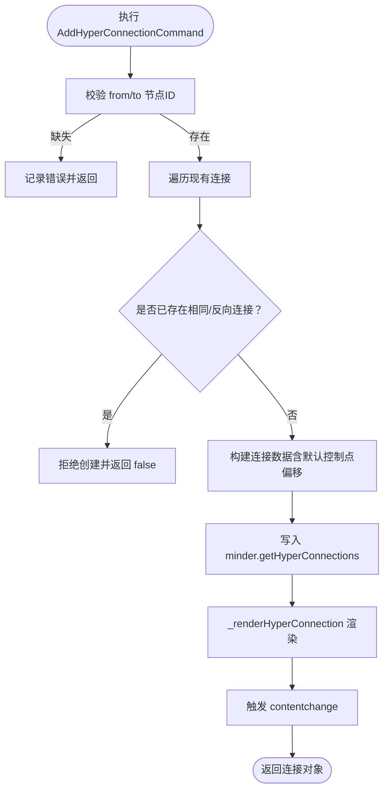
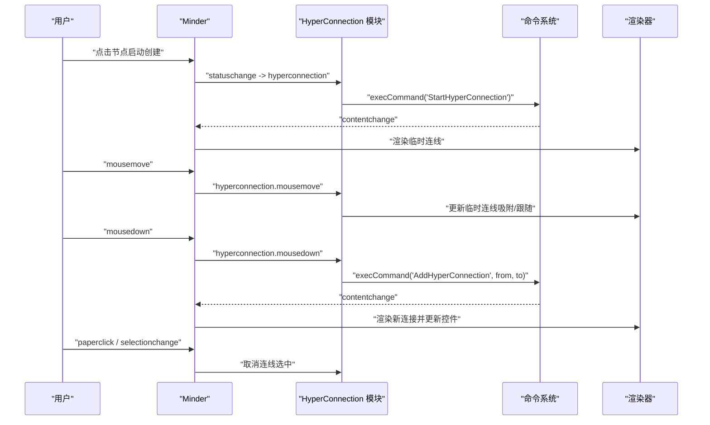
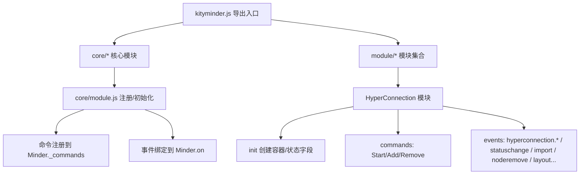
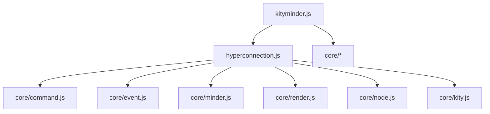

# 交互操作

<cite>
**本文引用的文件**
- [src/module/hyperconnection.js](file://src/module/hyperconnection.js)
- [src/core/command.js](file://src/core/command.js)
- [src/core/event.js](file://src/core/event.js)
- [src/core/minder.js](file://src/core/minder.js)
- [src/core/render.js](file://src/core/render.js)
- [src/core/module.js](file://src/core/module.js)
- [src/kityminder.js](file://src/kityminder.js)
</cite>

## 目录
1. [简介](#简介)
2. [项目结构](#项目结构)
3. [核心组件](#核心组件)
4. [架构总览](#架构总览)
5. [详细组件分析](#详细组件分析)
6. [依赖分析](#依赖分析)
7. [性能考虑](#性能考虑)
8. [故障排查指南](#故障排查指南)
9. [结论](#结论)
10. [附录](#附录)

## 简介
本文件围绕“自由关联线”交互机制进行深入解析，重点基于 src/module/hyperconnection.js 中的命令系统与事件处理逻辑，系统阐述以下三类核心命令的工作流程：
- StartHyperConnectionCommand：进入“创建模式”，准备从选中节点开始拖拽创建连接。
- AddHyperConnectionCommand：处理从源节点到目标节点的连接创建，包含重复连接检测与渲染。
- RemoveHyperConnectionCommand：删除指定连接并触发内容变更事件。

同时，文档将梳理交互事件流，包括 mousedown 触发控制点拖拽、mousemove 实时更新贝塞尔控制点偏移、mouseup 完成拖拽并触发 contentchange，以及 paperclick 和 selectionchange 导致选中状态取消的逻辑；解释临时连线 TempConnection 在拖拽过程中的可视化表现，以及控制点手柄 ControlHandle 如何提供直观的曲线调整体验。最后说明这些交互功能如何通过 kityminder.js 的模块加载机制注册到核心系统，并与其他模块（如节点选择、快捷键）协同工作，给出交互设计最佳实践与性能优化建议。

## 项目结构
本项目采用模块化组织方式，核心能力由 core 层提供，模块由 module 层扩展。hyperconnection 模块位于 src/module/hyperconnection.js，负责自由关联线的创建、渲染与交互；命令系统位于 core/command.js，事件系统位于 core/event.js；模块注册与加载位于 core/module.js，最终通过 kityminder.js 将所有模块打包导出。

图表来源
- [src/kityminder.js](file://src/kityminder.js#L1-L107)
- [src/core/module.js](file://src/core/module.js#L1-L151)
- [src/core/minder.js](file://src/core/minder.js#L1-L41)
- [src/core/command.js](file://src/core/command.js#L1-L169)
- [src/core/event.js](file://src/core/event.js#L1-L270)
- [src/core/render.js](file://src/core/render.js#L1-L261)
- [src/module/hyperconnection.js](file://src/module/hyperconnection.js#L1-L975)

章节来源
- [src/kityminder.js](file://src/kityminder.js#L1-L107)
- [src/core/module.js](file://src/core/module.js#L1-L151)
- [src/core/minder.js](file://src/core/minder.js#L1-L41)
- [src/core/command.js](file://src/core/command.js#L1-L169)
- [src/core/event.js](file://src/core/event.js#L1-L270)
- [src/core/render.js](file://src/core/render.js#L1-L261)
- [src/module/hyperconnection.js](file://src/module/hyperconnection.js#L1-L975)

## 核心组件
- 命令系统 Command：提供命令的查询、执行与状态管理，统一触发 contentchange 事件。
- 事件系统 MinderEvent：封装 DOM 与 kity 事件，提供坐标、命中节点等工具方法。
- HyperConnection 渲染器：负责绘制与更新自由关联线，包含控制点手柄、箭头标记、文字标签与事件绑定。
- TempConnection 临时连线：拖拽过程中的可视化预览，支持跟随鼠标或吸附到目标节点。
- ControlHandle 控制点手柄：提供可视化的控制点拖拽交互。
- 三大命令：
  - StartHyperConnectionCommand：进入 hyperconnection 模式，创建临时连线。
  - AddHyperConnectionCommand：创建连接并渲染，检测重复连接。
  - RemoveHyperConnectionCommand：删除连接并触发内容变更。

章节来源
- [src/core/command.js](file://src/core/command.js#L1-L169)
- [src/core/event.js](file://src/core/event.js#L1-L270)
- [src/module/hyperconnection.js](file://src/module/hyperconnection.js#L1-L975)

## 架构总览
下图展示从用户交互到命令执行再到渲染更新的整体流程，以及模块注册与加载的关键路径。

图表来源
- [src/core/event.js](file://src/core/event.js#L144-L231)
- [src/core/module.js](file://src/core/module.js#L83-L118)
- [src/core/command.js](file://src/core/command.js#L118-L166)
- [src/module/hyperconnection.js](file://src/module/hyperconnection.js#L570-L975)

## 详细组件分析

### 命令系统与事件处理
- 命令系统 Command 提供 execute/queryState/isContentChanged 等标准接口，Minder.execCommand 统一调度命令执行，触发 before/pre/execCommand/contentchange 等阶段事件。
- 事件系统 MinderEvent 包装原生 DOM 事件，提供 getPosition/getTargetNode 等能力，并支持状态前缀事件（如 statuschange）与模块级事件（如 hyperconnection.mousemove）。

章节来源
- [src/core/command.js](file://src/core/command.js#L1-L169)
- [src/core/event.js](file://src/core/event.js#L1-L270)

### HyperConnection 渲染器与交互
- HyperConnection 负责：
  - 绘制连线路径（三次贝塞尔）、箭头标记、文字标签。
  - 控制点手柄 ControlHandle 的创建与显示/隐藏。
  - 透明热区 hitArea 提升点击命中率。
  - 事件绑定：点击/双击选中、控制点拖拽、画布点击与选择变更取消选中。
- 控制点拖拽：
  - 使用 document 级别 mousemove/mouseup 处理拖拽，避免鼠标移出元素导致拖拽中断。
  - 拖拽过程中仅更新对应控制点偏移，调用 update 重新计算路径与手柄位置。
  - 拖拽结束触发 contentchange，通知核心系统更新与撤销栈。

图表来源
- [src/module/hyperconnection.js](file://src/module/hyperconnection.js#L169-L567)

章节来源
- [src/module/hyperconnection.js](file://src/module/hyperconnection.js#L169-L567)

### 临时连线 TempConnection 与控制点手柄
- TempConnection 在 hyperconnection 模式下创建，用于拖拽过程中的可视化预览：
  - 跟随鼠标绘制虚线贝塞尔曲线。
  - 当悬停到目标节点时，吸附到节点边缘绘制曲线。
  - 不响应鼠标事件，避免遮挡真实节点。
- ControlHandle 提供两个控制点手柄，拖拽时实时更新对应控制点偏移，提升曲线编辑体验。

章节来源
- [src/module/hyperconnection.js](file://src/module/hyperconnection.js#L82-L164)
- [src/module/hyperconnection.js](file://src/module/hyperconnection.js#L291-L347)

### 三大命令工作流程

#### StartHyperConnectionCommand：进入创建模式
- 条件：必须选中一个节点。
- 行为：
  - 保存源节点到 minder._connectionSourceNode。
  - 创建临时连线 TempConnection 并添加到渲染容器。
  - 设置状态为 'hyperconnection'，光标切换为十字准星。
- 结果：进入拖拽创建模式，等待用户选择目标节点。

章节来源
- [src/module/hyperconnection.js](file://src/module/hyperconnection.js#L570-L597)

#### AddHyperConnectionCommand：创建连接（含重复检测）
- 参数：fromNode、toNode、connectionData（可选文本、类型、颜色、线宽、控制点偏移）。
- 重复检测：
  - 遍历现有连接，检查是否存在相同方向或反向连接（A→B 或 B→A），若存在则拒绝创建。
- 数据构建：
  - 生成唯一 id，设置 from/to、text/type/color/strokeWidth，默认控制点偏移为 {x:0,y:0}。
- 渲染与通知：
  - 将连接加入 minder.getHyperConnections。
  - 调用 _renderHyperConnection 渲染。
  - 触发 contentchange。
- 返回值：返回新建连接对象或 false（重复时）。

图表来源
- [src/module/hyperconnection.js](file://src/module/hyperconnection.js#L600-L671)

章节来源
- [src/module/hyperconnection.js](file://src/module/hyperconnection.js#L600-L671)

#### RemoveHyperConnectionCommand：删除连接与撤销
- 行为：
  - 在 minder.getHyperConnections 中查找匹配 id 的连接并移除。
  - 通过 _removeHyperConnectionShape 移除对应渲染图形。
  - 触发 contentchange。
- 注意：该命令不维护撤销栈，若需可撤销删除，应在上层包装命令或使用撤销框架。

章节来源
- [src/module/hyperconnection.js](file://src/module/hyperconnection.js#L673-L696)

### 交互事件流与状态切换
- hyperconnection 模式下的关键事件：
  - mousemove：更新临时连线，支持吸附到目标节点或跟随鼠标。
  - mousedown：阻止事件传播，保存源/目标节点，调用 AddHyperConnection 命令创建连接，清理临时状态并退出模式。
  - keydown：ESC 取消模式。
- 其他取消选中逻辑：
  - paperclick：取消当前连线选中。
  - selectionchange：当节点选择发生变化时取消连线选中。

图表来源
- [src/module/hyperconnection.js](file://src/module/hyperconnection.js#L852-L975)
- [src/core/command.js](file://src/core/command.js#L118-L166)
- [src/core/event.js](file://src/core/event.js#L144-L231)

章节来源
- [src/module/hyperconnection.js](file://src/module/hyperconnection.js#L852-L975)
- [src/core/command.js](file://src/core/command.js#L118-L166)
- [src/core/event.js](file://src/core/event.js#L144-L231)

### 模块加载与注册机制
- kityminder.js 将核心类与模块按序导入，确保依赖顺序正确。
- core/module.js 提供模块注册 register 与初始化 _initModules：
  - 将模块的 commands 注册到 Minder._commands。
  - 将模块的 events 绑定到 Minder.on。
  - 合并模块的渲染器类到 Minder._rendererClasses。
- hyperconnection 模块通过 Module.register('HyperConnection', {...}) 注册命令与事件，并在 init 中创建超连接容器。

图表来源
- [src/kityminder.js](file://src/kityminder.js#L1-L107)
- [src/core/module.js](file://src/core/module.js#L1-L151)
- [src/module/hyperconnection.js](file://src/module/hyperconnection.js#L770-L975)

章节来源
- [src/kityminder.js](file://src/kityminder.js#L1-L107)
- [src/core/module.js](file://src/core/module.js#L1-L151)
- [src/module/hyperconnection.js](file://src/module/hyperconnection.js#L770-L975)

## 依赖分析
- 模块耦合与协作：
  - hyperconnection 模块依赖 core/command、core/event、core/minder、core/render、core/node、core/kity。
  - 通过 core/module 的注册机制，命令与事件被注入到 Minder 生命周期中。
- 外部依赖与集成点：
  - kityminder.js 作为统一导出入口，串联所有模块。
  - 事件系统支持状态前缀事件，便于模块按状态隔离处理。
- 潜在循环依赖：
  - 模块间通过 define 与 require 解耦，未发现直接循环依赖迹象。

图表来源
- [src/module/hyperconnection.js](file://src/module/hyperconnection.js#L1-L120)
- [src/kityminder.js](file://src/kityminder.js#L1-L107)

章节来源
- [src/module/hyperconnection.js](file://src/module/hyperconnection.js#L1-L120)
- [src/kityminder.js](file://src/kityminder.js#L1-L107)

## 性能考虑
- 节点更新节流：在 hyperconnection 模块中，针对节点布局应用事件使用 requestAnimationFrame 或定时器进行节流，避免频繁更新导致卡顿。
- 临时连线不参与命中测试：TempConnection 设置 pointer-events 为 none，减少事件计算开销。
- 控制点拖拽使用 document 级事件：避免鼠标移出元素导致的事件丢失，同时只更新当前控制点偏移，降低重绘范围。
- 批量更新策略：命令执行后统一触发 contentchange，由核心系统集中处理后续渲染与撤销栈更新。

章节来源
- [src/module/hyperconnection.js](file://src/module/hyperconnection.js#L800-L875)
- [src/module/hyperconnection.js](file://src/module/hyperconnection.js#L88-L110)
- [src/core/command.js](file://src/core/command.js#L140-L166)

## 故障排查指南
- 无法进入创建模式
  - 症状：点击启动无反应。
  - 排查：确认是否选中了节点；检查 queryState 返回状态；确认模块已注册。
- 重复连接被拒绝
  - 症状：拖拽到目标节点后无连接创建。
  - 排查：检查现有连接列表是否已有相同/反向连接；确认 AddHyperConnectionCommand 的重复检测逻辑。
- 控制点拖拽无效
  - 症状：拖拽无效果或仅部分生效。
  - 排查：确认 isDragging 状态与 draggingHandleIndex 是否一致；检查 mousemove/mouseup 事件是否被其他模块拦截。
- 临时连线未清理
  - 症状：退出模式后仍残留临时连线。
  - 排查：确认 statuschange 回调中延时清理逻辑是否执行；检查 setStatus('normal') 是否被其他模块覆盖。
- 选中状态冲突
  - 症状：点击画布或节点选择变化时连线未取消选中。
  - 排查：确认 paperclick 与 selectionchange 事件是否触发；检查 HyperConnection.initEvents 中的取消逻辑。

章节来源
- [src/module/hyperconnection.js](file://src/module/hyperconnection.js#L570-L671)
- [src/module/hyperconnection.js](file://src/module/hyperconnection.js#L852-L975)
- [src/core/event.js](file://src/core/event.js#L144-L231)

## 结论
hyperconnection 模块通过清晰的命令系统与事件驱动，实现了自由关联线的创建、编辑与删除。Start/ Add/ Remove 三大命令分别承担“进入模式”“创建连接”“删除连接”的职责；HyperConnection 渲染器与 ControlHandle 提供直观的曲线编辑体验；TempConnection 在拖拽过程中提供良好的视觉反馈。模块通过 core/module.js 的注册机制无缝接入 Minder 核心，配合事件系统与渲染器，形成完整的交互闭环。遵循本文最佳实践与性能建议，可在复杂场景下保持流畅的用户体验。

## 附录
- 交互设计最佳实践
  - 明确状态机：hyperconnection 模式下优先处理拖拽与创建，避免与其他模块状态冲突。
  - 事件传播控制：在关键回调中使用 stopPropagation/ preventDefault，确保状态切换与创建流程的原子性。
  - 可访问性：为临时连线与控制点提供合适的视觉反馈与可达性提示。
  - 边界情况处理：跨图连接、重复连接、节点删除联动清理等场景应有明确的策略与提示。
- 性能优化建议
  - 使用节流/防抖减少高频事件（mousemove/layoutapply）的更新频率。
  - 将临时连线设置为非命中元素，避免事件计算开销。
  - 控制点拖拽仅更新受影响的连接与手柄，避免全量重绘。
  - 在批量操作（导入/布局）后统一触发 contentchange，减少多次重绘。