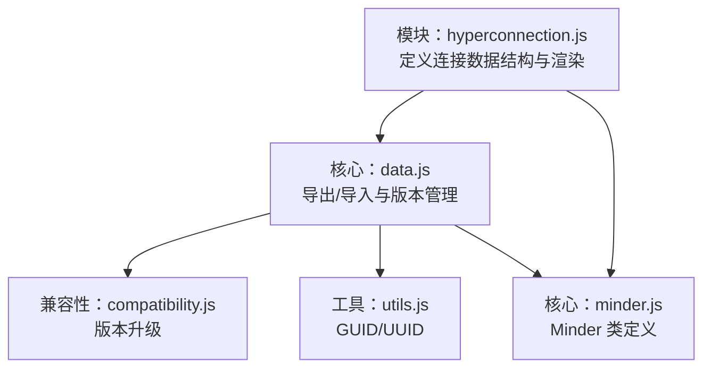
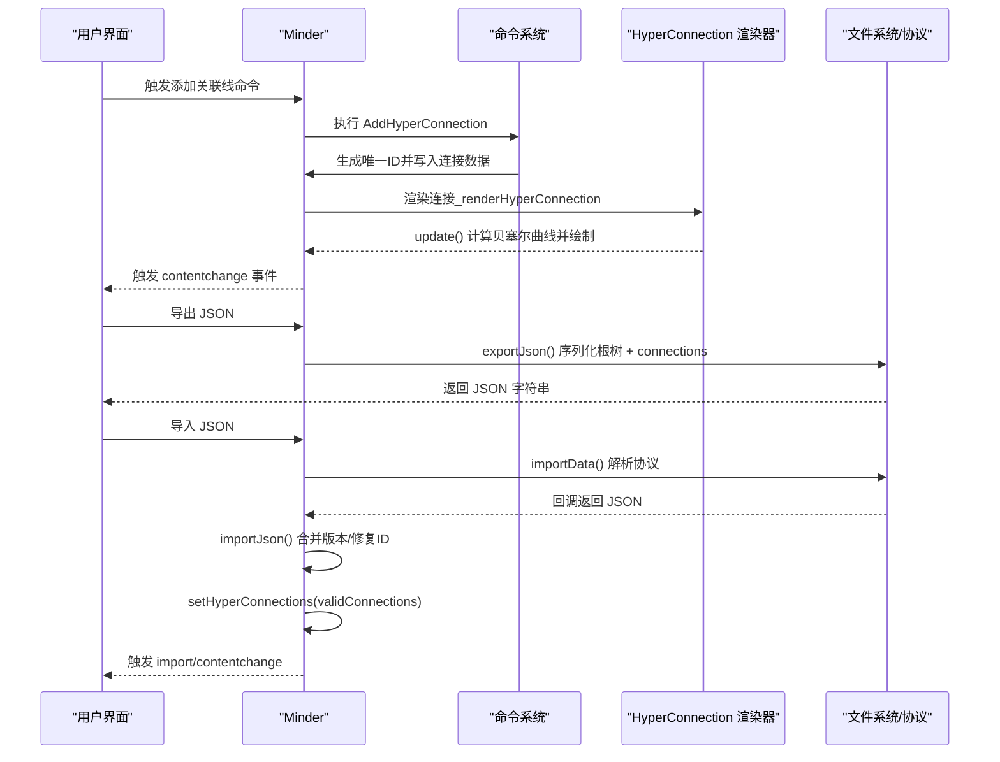
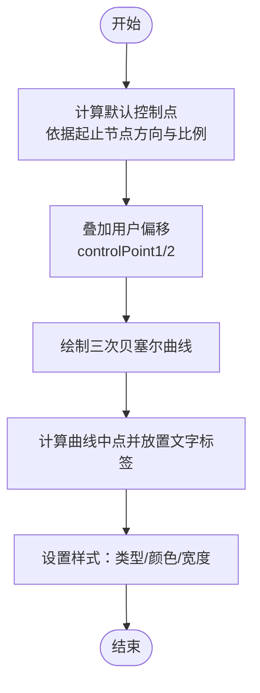
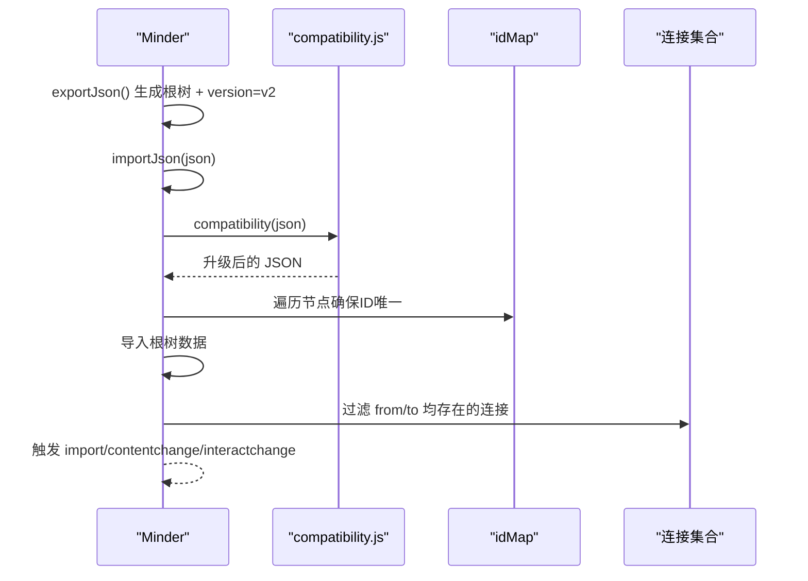
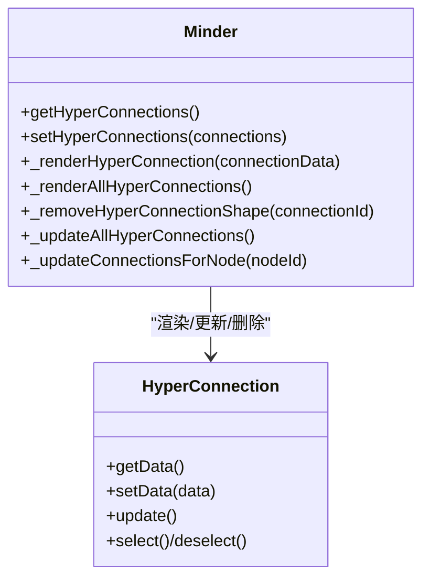
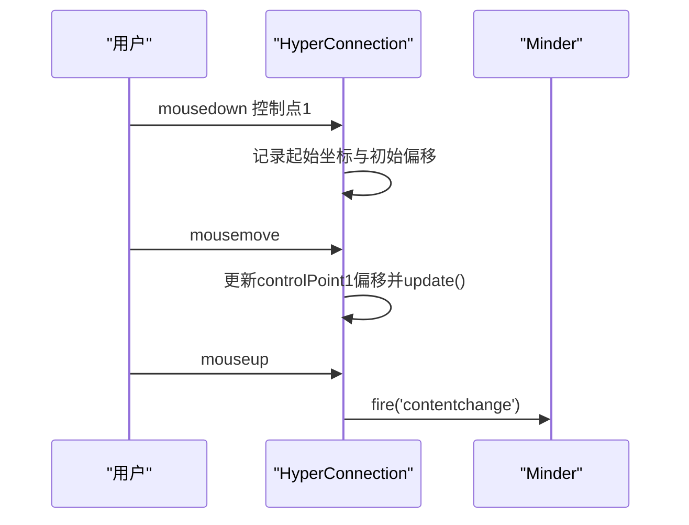
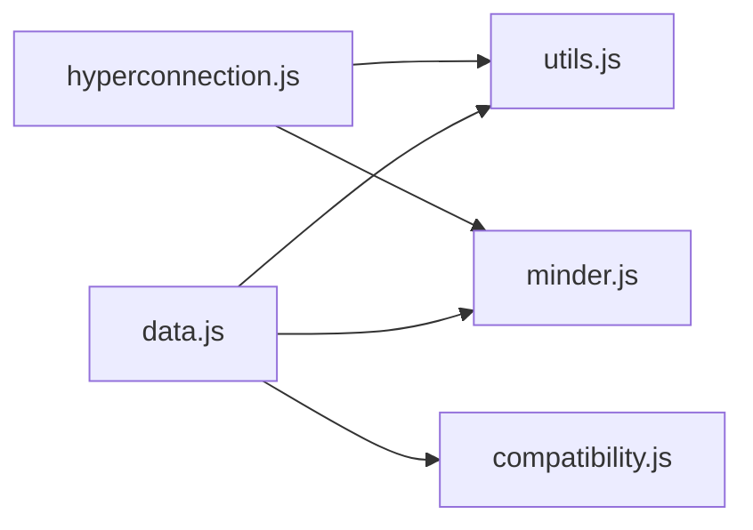

# 数据模型

<cite>
**本文引用的文件**
- [src/module/hyperconnection.js](file://src/module/hyperconnection.js)
- [src/core/data.js](file://src/core/data.js)
- [src/core/minder.js](file://src/core/minder.js)
- [src/core/compatibility.js](file://src/core/compatibility.js)
- [src/core/utils.js](file://src/core/utils.js)
</cite>

## 目录
1. [简介](#简介)
2. [项目结构](#项目结构)
3. [核心组件](#核心组件)
4. [架构总览](#架构总览)
5. [详细组件分析](#详细组件分析)
6. [依赖关系分析](#依赖关系分析)
7. [性能考量](#性能考量)
8. [故障排查指南](#故障排查指南)
9. [结论](#结论)
10. [附录](#附录)

## 简介
本文件围绕“自由关联线”数据模型展开，基于以下两个关键文件：
- 数据结构定义与渲染：src/module/hyperconnection.js
- 导入导出与版本管理：src/core/data.js

重点解释 connections 数组中每个连接对象的字段语义、贝塞尔控制点对曲线的影响、以及在 exportJson/importJson 中的序列化/反序列化流程；并说明数据模型与核心系统的集成方式（Minder 类的 _getHyperConnections/setHyperConnections 方法），以及数据变更触发 contentchange 事件的机制。最后给出最佳实践建议，涵盖数据完整性、大规模连接性能优化与自定义扩展字段注意事项。

## 项目结构
与“自由关联线”数据模型直接相关的文件组织如下：
- 模块实现：src/module/hyperconnection.js
- 核心数据协议与导入导出：src/core/data.js
- 核心类入口：src/core/minder.js
- 兼容性处理：src/core/compatibility.js
- 工具函数（GUID/UUID）：src/core/utils.js

图表来源
- [src/module/hyperconnection.js](file://src/module/hyperconnection.js#L1-L120)
- [src/core/data.js](file://src/core/data.js#L50-L120)
- [src/core/minder.js](file://src/core/minder.js#L1-L41)
- [src/core/compatibility.js](file://src/core/compatibility.js#L1-L30)
- [src/core/utils.js](file://src/core/utils.js#L1-L20)

章节来源
- [src/module/hyperconnection.js](file://src/module/hyperconnection.js#L1-L120)
- [src/core/data.js](file://src/core/data.js#L50-L120)
- [src/core/minder.js](file://src/core/minder.js#L1-L41)

## 核心组件
- 连接数据结构（connections 数组中的元素）
  - id：唯一标识符，用于区分不同连接
  - from/to：起止节点 ID，用于定位连接两端
  - text：连线上的说明文本（可选）
  - type：连线类型，支持 arrow/line/dashed
  - color/strokeWidth：连线颜色与宽度（可选）
  - controlPoint1/controlPoint2：两个贝塞尔控制点的偏移量，决定曲线形状
- 渲染与交互
  - HyperConnection 类负责根据数据绘制三次贝塞尔曲线、箭头标记、文字标签与控制点手柄
  - 控制点拖拽更新数据并触发 contentchange 事件
- 核心集成
  - Minder 类提供 getHyperConnections/setHyperConnections 管理连接集合
  - 导入导出时，连接数据随根树一起序列化/反序列化

章节来源
- [src/module/hyperconnection.js](file://src/module/hyperconnection.js#L17-L30)
- [src/module/hyperconnection.js](file://src/module/hyperconnection.js#L405-L500)
- [src/module/hyperconnection.js](file://src/module/hyperconnection.js#L701-L767)
- [src/core/data.js](file://src/core/data.js#L56-L90)

## 架构总览
下面以序列图展示“添加/编辑/渲染/持久化”的完整流程，映射到实际代码位置。

图表来源
- [src/module/hyperconnection.js](file://src/module/hyperconnection.js#L600-L671)
- [src/module/hyperconnection.js](file://src/module/hyperconnection.js#L701-L767)
- [src/core/data.js](file://src/core/data.js#L56-L90)
- [src/core/data.js](file://src/core/data.js#L234-L308)

## 详细组件分析

### 连接数据结构字段详解
- id：唯一标识符
  - 生成：添加连接时使用工具函数生成全局唯一 ID
  - 用途：用于渲染容器中的形状 ID 前缀、删除/更新定位
- from/to：节点 ID
  - 来源：来自选中节点的数据 ID
  - 作用：定位连接两端节点，渲染时通过 Minder 查询节点布局
- text：说明文本
  - 渲染：在曲线上方居中显示
  - 交互：双击可触发自定义事件
- type：连线类型
  - 支持：arrow/line/dashed
  - 影响：箭头标记、虚线样式等
- color/strokeWidth：视觉样式
  - 影响：描边颜色与宽度
- controlPoint1/controlPoint2：贝塞尔控制点偏移
  - 默认：根据起止节点方向自动计算默认控制点
  - 用户：拖拽控制点手柄更新偏移
  - 影响：曲线弯曲程度与方向

章节来源
- [src/module/hyperconnection.js](file://src/module/hyperconnection.js#L17-L30)
- [src/module/hyperconnection.js](file://src/module/hyperconnection.js#L461-L500)
- [src/module/hyperconnection.js](file://src/module/hyperconnection.js#L543-L558)
- [src/module/hyperconnection.js](file://src/module/hyperconnection.js#L274-L347)

### 贝塞尔曲线与控制点算法
- 默认控制点计算
  - 根据水平/垂直主方向，计算默认控制点位置，限制控制线长度不超过连线长度的一定比例，避免过长影响交互
- 用户偏移叠加
  - 将用户拖拽产生的偏移量叠加到默认控制点上，形成最终控制点
- 曲线绘制
  - 使用三次贝塞尔曲线连接起点、终点与两个控制点
  - 文字标签位于曲线中点附近

图表来源
- [src/module/hyperconnection.js](file://src/module/hyperconnection.js#L461-L500)
- [src/module/hyperconnection.js](file://src/module/hyperconnection.js#L543-L558)
- [src/module/hyperconnection.js](file://src/module/hyperconnection.js#L436-L447)

章节来源
- [src/module/hyperconnection.js](file://src/module/hyperconnection.js#L461-L500)
- [src/module/hyperconnection.js](file://src/module/hyperconnection.js#L543-L558)
- [src/module/hyperconnection.js](file://src/module/hyperconnection.js#L436-L447)

### 导入导出与版本管理
- 导出（exportJson）
  - 导出根树数据，同时输出版本号（v2）
  - 若根树节点缺少 ID，导出会自动补全并回写节点数据
  - 若存在连接集合，一并导出到 connections 字段
- 导入（importJson）
  - 触发 preimport 事件
  - 清空当前根节点子树
  - 执行兼容性处理（版本升级）
  - 递归遍历节点数据，确保 ID 唯一性（若冲突则重新生成）
  - 导入根树数据
  - 设置模板与主题
  - 导入连接数据：仅保留 from/to 均存在于 idMap 中的有效连接
  - 最终触发 import/contentchange/interactchange 事件
- 版本管理
  - 导出时固定版本号为 v2
  - 导入时通过兼容性模块根据版本号进行升级处理

图表来源
- [src/core/data.js](file://src/core/data.js#L56-L90)
- [src/core/data.js](file://src/core/data.js#L234-L308)
- [src/core/compatibility.js](file://src/core/compatibility.js#L1-L30)

章节来源
- [src/core/data.js](file://src/core/data.js#L56-L90)
- [src/core/data.js](file://src/core/data.js#L234-L308)
- [src/core/compatibility.js](file://src/core/compatibility.js#L1-L30)

### 数据模型与核心系统的集成
- Minder 扩展方法
  - getHyperConnections：懒初始化并返回连接数组
  - setHyperConnections：设置连接数组并重新渲染全部连接
  - _renderHyperConnection/_renderAllHyperConnections/_removeHyperConnectionShape：连接渲染管线
  - _updateAllHyperConnections/_updateConnectionsForNode：节点布局变化时的更新节流
- 事件驱动
  - 控制点拖拽结束、删除连接、新增连接均会触发 contentchange
  - 导入完成后触发 import 与 contentchange

图表来源
- [src/module/hyperconnection.js](file://src/module/hyperconnection.js#L701-L767)
- [src/module/hyperconnection.js](file://src/module/hyperconnection.js#L559-L567)

章节来源
- [src/module/hyperconnection.js](file://src/module/hyperconnection.js#L701-L767)
- [src/module/hyperconnection.js](file://src/module/hyperconnection.js#L559-L567)

### 控制点拖拽与事件传播
- 拖拽流程
  - 记录起始坐标与初始控制点偏移
  - 文档级 mousemove 更新控制点偏移并重绘
  - mouseup 结束拖拽，触发 contentchange
- 事件传播
  - 在 hyperconnection 模式下，mousedown 阻止事件传播，确保状态稳定
  - statuschange 与布局事件联动，实现拖拽过程中的实时更新

图表来源
- [src/module/hyperconnection.js](file://src/module/hyperconnection.js#L291-L347)
- [src/module/hyperconnection.js](file://src/module/hyperconnection.js#L924-L971)

章节来源
- [src/module/hyperconnection.js](file://src/module/hyperconnection.js#L291-L347)
- [src/module/hyperconnection.js](file://src/module/hyperconnection.js#L924-L971)

## 依赖关系分析
- 模块耦合
  - hyperconnection.js 依赖 utils（GUID/UUID）、Minder/MinderNode/Command/Module/Renderer
  - data.js 依赖 utils、Minder、MinderNode、MinderEvent、compatibility、Promise
- 外部依赖
  - 兼容性处理：根据版本号进行节点结构升级
  - 工具函数：GUID 用于生成连接 ID；clone/compare 等辅助

图表来源
- [src/module/hyperconnection.js](file://src/module/hyperconnection.js#L8-L16)
- [src/core/data.js](file://src/core/data.js#L1-L10)
- [src/core/compatibility.js](file://src/core/compatibility.js#L1-L30)
- [src/core/utils.js](file://src/core/utils.js#L1-L20)

章节来源
- [src/module/hyperconnection.js](file://src/module/hyperconnection.js#L8-L16)
- [src/core/data.js](file://src/core/data.js#L1-L10)
- [src/core/compatibility.js](file://src/core/compatibility.js#L1-L30)
- [src/core/utils.js](file://src/core/utils.js#L1-L20)

## 性能考量
- 渲染节流
  - 节点布局应用时使用 requestAnimationFrame 节流，避免频繁更新导致卡顿
- 大规模连接场景
  - 仅在必要时更新受影响的连接（按节点 ID 缓存节流）
  - 控制点拖拽结束后再触发 contentchange，减少事件风暴
- 建议
  - 对于大量连接，尽量避免频繁重排；合并多次变更后再触发刷新
  - 文本标签与控制点手柄数量有限，通常不会成为瓶颈

章节来源
- [src/module/hyperconnection.js](file://src/module/hyperconnection.js#L800-L825)

## 故障排查指南
- 导入后连接消失
  - 检查 from/to 是否存在于 idMap 中；无效连接会被过滤
  - 确认节点 ID 是否在导入前已唯一化
- 连接无法拖拽或样式异常
  - 确认 type/color/strokeWidth 是否正确设置
  - 检查控制点是否被意外重置
- 事件未触发
  - 确认拖拽结束后是否触发 contentchange
  - 导入完成后应触发 import/contentchange

章节来源
- [src/core/data.js](file://src/core/data.js#L277-L290)
- [src/module/hyperconnection.js](file://src/module/hyperconnection.js#L342-L347)

## 结论
自由关联线数据模型以简洁的连接对象为核心，结合贝塞尔曲线与控制点实现灵活的可视化表达。通过 Minder 的统一管理与事件驱动机制，实现了从创建、编辑到持久化的完整闭环。导入导出流程中，v2 版本号与 ID 唯一性保障了数据一致性；无效连接的过滤策略与节流更新提升了稳定性与性能。

## 附录

### 字段定义一览
- id：连接唯一标识
- from/to：起止节点 ID
- text：说明文本
- type：连线类型（arrow/line/dashed）
- color/strokeWidth：视觉样式
- controlPoint1/controlPoint2：贝塞尔控制点偏移

章节来源
- [src/module/hyperconnection.js](file://src/module/hyperconnection.js#L17-L30)

### 最佳实践建议
- 数据完整性
  - 导出前确保节点 ID 唯一；导入时依赖兼容性与 idMap 修复
  - 保持 from/to 与节点 ID 一致，避免无效连接
- 大规模连接优化
  - 合并布局与渲染更新，利用节流机制降低重绘频率
  - 避免频繁触发 contentchange，集中提交变更
- 自定义扩展字段
  - 可在连接对象上添加业务自定义字段，但需注意导入导出时的序列化/反序列化策略
  - 建议在业务层自行维护扩展字段的迁移与兼容

章节来源
- [src/core/data.js](file://src/core/data.js#L56-L90)
- [src/core/data.js](file://src/core/data.js#L234-L308)
- [src/module/hyperconnection.js](file://src/module/hyperconnection.js#L701-L767)