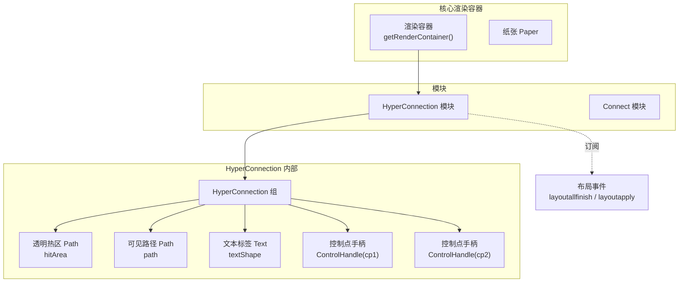
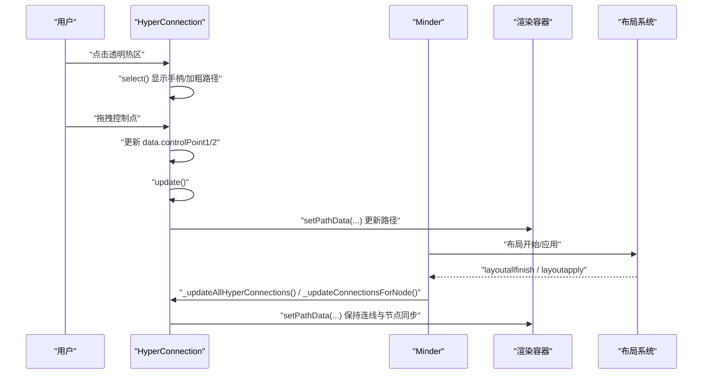
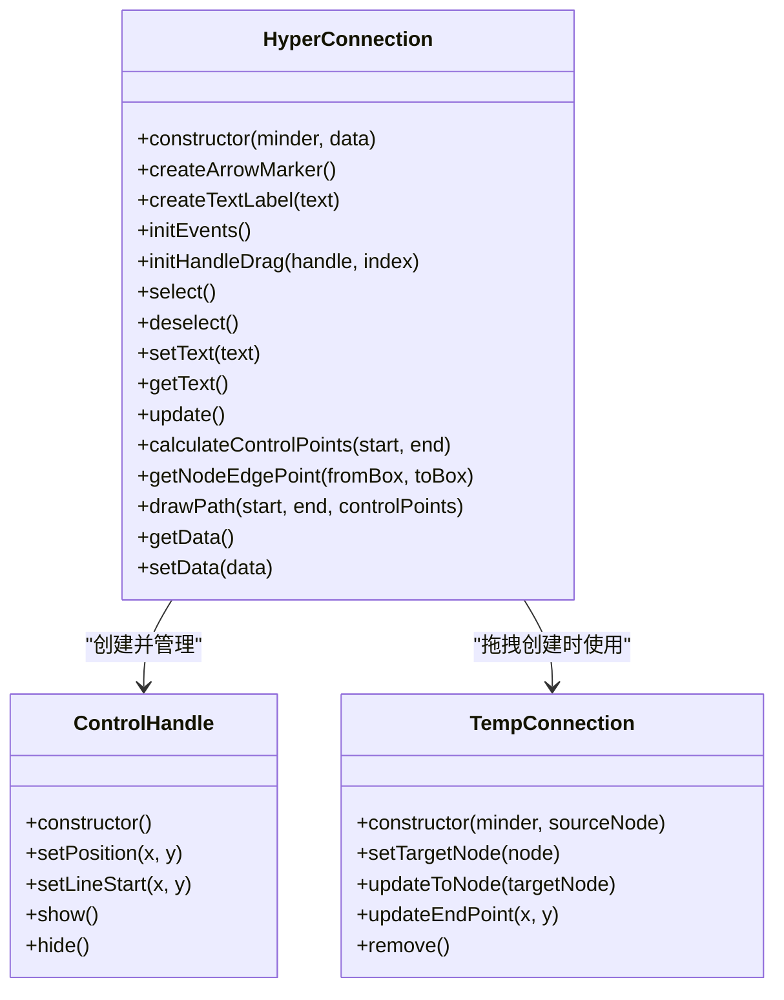
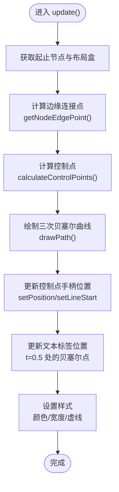
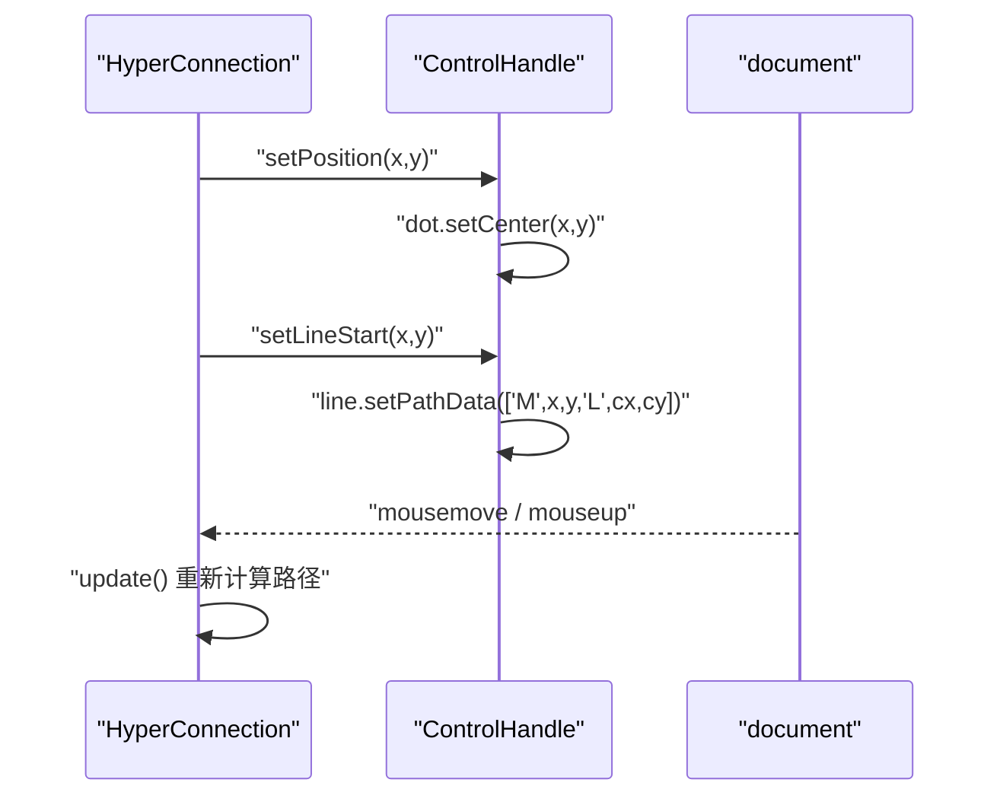
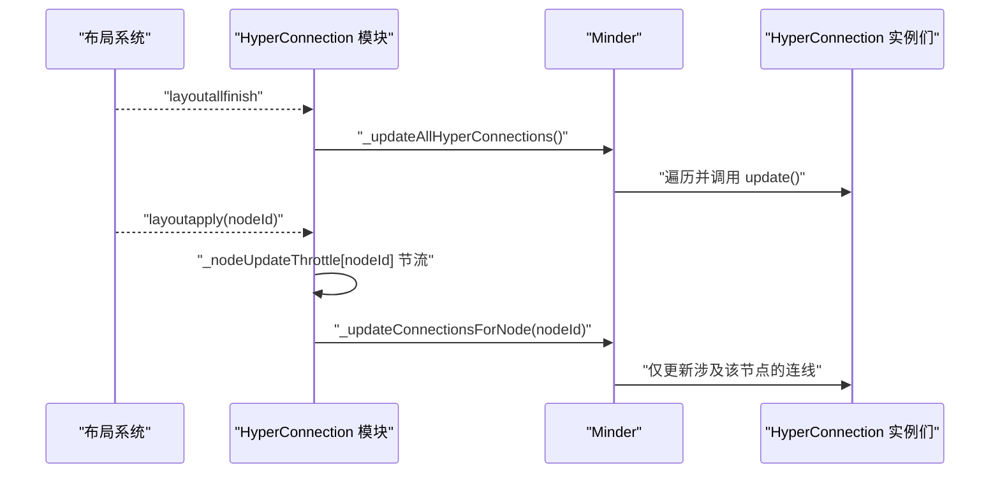
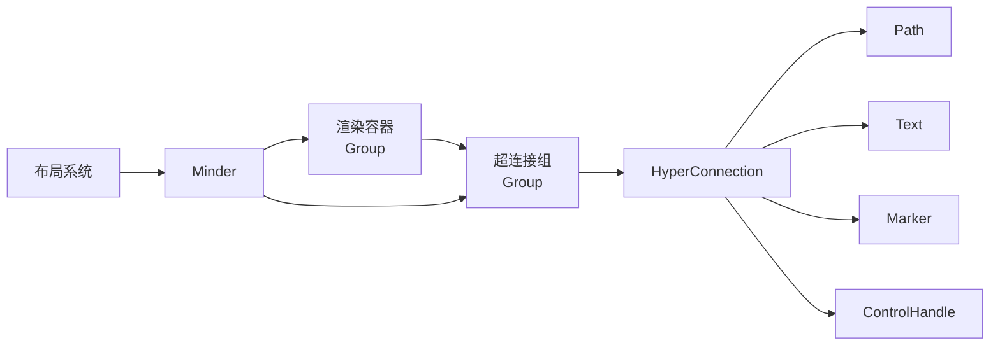

# 渲染机制

<cite>
**本文引用的文件**
- [src/module/hyperconnection.js](file://src/module/hyperconnection.js)
- [src/core/paper.js](file://src/core/paper.js)
- [src/core/render.js](file://src/core/render.js)
- [src/core/layout.js](file://src/core/layout.js)
- [src/connect/bezier.js](file://src/connect/bezier.js)
</cite>

## 目录
1. [简介](#简介)
2. [项目结构](#项目结构)
3. [核心组件](#核心组件)
4. [架构总览](#架构总览)
5. [详细组件分析](#详细组件分析)
6. [依赖关系分析](#依赖关系分析)
7. [性能考量](#性能考量)
8. [故障排查指南](#故障排查指南)
9. [结论](#结论)

## 简介
本文件深入剖析自由关联线的渲染机制，围绕 src/module/hyperconnection.js 中的 HyperConnection 类展开，系统讲解：
- 可视化组件构成：透明点击热区 hitArea 的设计与交互体验提升；可见路径 path 的样式与类型（实线、虚线、带箭头）；文本标签 textShape 的展示与事件绑定。
- 贝塞尔曲线渲染原理：getNodeEdgePoint 如何计算节点边缘连接点；calculateControlPoints 如何结合默认控制点与用户偏移生成最终控制点；drawPath 如何使用三次贝塞尔曲线（C 命令）绘制平滑连线。
- 控制点手柄 ControlHandle 的渲染细节：圆点 dot 与连接线 line 的样式设计；setPosition 与 setLineStart 如何实现手柄的动态更新。
- 渲染与布局系统的协同：通过监听 'layoutallfinish' 与 'layoutapply' 事件，调用 _updateAllHyperConnections 与 _updateConnectionsForNode，确保连线随节点位置变化实时更新。
- 性能优化建议：在大量连接场景下的渲染效率提升策略与 SVG 元素复用最佳实践。

## 项目结构
本项目采用模块化组织，自由关联线模块位于 src/module/hyperconnection.js，负责：
- 渲染器 HyperConnection：管理连线的几何计算、路径绘制、手柄交互与文本标签。
- 命令系统：StartHyperConnection、AddHyperConnection、RemoveHyperConnection，支撑拖拽创建、添加与删除。
- 渲染容器：在 Minder 实例中创建独立的超连接组，置于普通连线之上，保证层级正确。
- 事件驱动：订阅布局事件，实现连线与节点同步更新。

图表来源
- [src/module/hyperconnection.js](file://src/module/hyperconnection.js#L773-L825)
- [src/core/paper.js](file://src/core/paper.js#L64-L75)
- [src/core/render.js](file://src/core/render.js#L130-L199)

章节来源
- [src/module/hyperconnection.js](file://src/module/hyperconnection.js#L773-L825)
- [src/core/paper.js](file://src/core/paper.js#L64-L75)
- [src/core/render.js](file://src/core/render.js#L130-L199)

## 核心组件
- HyperConnection：自由关联线渲染器，负责路径计算、样式设置、文本标签与控制点手柄的管理，并绑定交互事件。
- ControlHandle：控制点手柄，包含圆点 dot 与连接线 line，用于拖拽调整贝塞尔控制点。
- TempConnection：临时连线，拖拽创建过程中的预览路径。
- 命令系统：StartHyperConnection、AddHyperConnection、RemoveHyperConnection，封装状态切换、数据持久化与渲染更新。
- 渲染容器：在 Minder 实例中创建超连接组，统一管理所有 HyperConnection 实例。

章节来源
- [src/module/hyperconnection.js](file://src/module/hyperconnection.js#L32-L80)
- [src/module/hyperconnection.js](file://src/module/hyperconnection.js#L168-L566)
- [src/module/hyperconnection.js](file://src/module/hyperconnection.js#L571-L670)
- [src/module/hyperconnection.js](file://src/module/hyperconnection.js#L773-L825)

## 架构总览
HyperConnection 的渲染流程与事件驱动如下：
- 初始化阶段：创建透明热区、可见路径、箭头标记、文本标签与两个控制点手柄，绑定点击/双击/拖拽事件，首次 update。
- 交互阶段：拖拽控制点更新数据，触发 update；点击热区选中连线；双击热区触发自定义事件。
- 布局阶段：订阅 'layoutallfinish' 与 'layoutapply'，批量或按节点节流更新所有连线。
- 命令阶段：通过命令系统添加/删除连线，触发渲染与数据变更事件。

图表来源
- [src/module/hyperconnection.js](file://src/module/hyperconnection.js#L252-L288)
- [src/module/hyperconnection.js](file://src/module/hyperconnection.js#L291-L346)
- [src/module/hyperconnection.js](file://src/module/hyperconnection.js#L404-L458)
- [src/module/hyperconnection.js](file://src/module/hyperconnection.js#L795-L825)
- [src/core/layout.js](file://src/core/layout.js#L452-L523)

章节来源
- [src/module/hyperconnection.js](file://src/module/hyperconnection.js#L252-L288)
- [src/module/hyperconnection.js](file://src/module/hyperconnection.js#L291-L346)
- [src/module/hyperconnection.js](file://src/module/hyperconnection.js#L404-L458)
- [src/module/hyperconnection.js](file://src/module/hyperconnection.js#L795-L825)
- [src/core/layout.js](file://src/core/layout.js#L452-L523)

## 详细组件分析

### HyperConnection 类与可视化组件
- 透明点击热区（hitArea）
  - 使用 kity.Path，stroke 为透明色且笔触宽度为 12px，填充 none，线帽与线连接为 round，提升点击命中率。
  - 与可见路径 path 共享相同的路径数据，确保点击区域与可视路径一致。
- 可见路径（path）
  - 使用 kity.Path，根据 data.type 渲染为 solid 或 dashed；根据 data.color 与 data.strokeWidth 设置描边。
  - 当 type 为 'arrow' 时，创建箭头标记并设置到路径末端。
- 文本标签（textShape）
  - 使用 kity.Text，内容来自 data.text；双击触发 minder.fire('hyperconnectiondblclick')，便于应用层处理编辑等操作。
- 控制点手柄（ControlHandle）
  - 圆点 dot：半径 6，白色填充，蓝色描边，cursor 为 move。
  - 连接线 line：从锚点到控制点，初始路径数据为两条同端点的线段，setPosition 与 setLineStart 动态更新。
  - 手柄默认隐藏，选中连线时显示，拖拽结束时隐藏（非拖拽状态下）。

图表来源
- [src/module/hyperconnection.js](file://src/module/hyperconnection.js#L32-L80)
- [src/module/hyperconnection.js](file://src/module/hyperconnection.js#L168-L566)
- [src/module/hyperconnection.js](file://src/module/hyperconnection.js#L82-L165)

章节来源
- [src/module/hyperconnection.js](file://src/module/hyperconnection.js#L168-L566)
- [src/module/hyperconnection.js](file://src/module/hyperconnection.js#L32-L80)
- [src/module/hyperconnection.js](file://src/module/hyperconnection.js#L82-L165)

### 贝塞尔曲线渲染原理
- getNodeEdgePoint
  - 输入两个节点的布局盒（fromBox、toBox），计算从起点到终点的方向向量。
  - 根据方向与节点宽高比判断应取左右或上下边缘的中心点作为连接点，避免连线从节点内部斜穿。
- calculateControlPoints
  - 默认控制点：根据 dx/dy 的绝对值大小，决定水平或垂直方向为主，控制线长度不超过连线长度的 1/4，避免过长影响双击。
  - 用户偏移：读取 data.controlPoint1 与 data.controlPoint2，叠加到默认控制点，形成最终控制点坐标。
- drawPath
  - 使用三次贝塞尔曲线（C 命令）：M 起点 + C 控制点1 + 控制点2 + 终点。
  - 同时更新透明热区与可见路径的路径数据，保证点击与视觉一致。

图表来源
- [src/module/hyperconnection.js](file://src/module/hyperconnection.js#L404-L458)
- [src/module/hyperconnection.js](file://src/module/hyperconnection.js#L461-L498)
- [src/module/hyperconnection.js](file://src/module/hyperconnection.js#L501-L541)
- [src/module/hyperconnection.js](file://src/module/hyperconnection.js#L543-L557)

章节来源
- [src/module/hyperconnection.js](file://src/module/hyperconnection.js#L404-L458)
- [src/module/hyperconnection.js](file://src/module/hyperconnection.js#L461-L498)
- [src/module/hyperconnection.js](file://src/module/hyperconnection.js#L501-L541)
- [src/module/hyperconnection.js](file://src/module/hyperconnection.js#L543-L557)

### 控制点手柄 ControlHandle 的渲染细节
- 圆点 dot：半径 6，白色填充，蓝色描边，cursor 设为 move，增强拖拽反馈。
- 连接线 line：初始路径为两条同端点的线段，setPosition 将圆点移动到目标位置，setLineStart 以锚点为起点绘制到控制点。
- 显隐控制：选中连线时显示，拖拽结束后隐藏（非拖拽状态）；双击热区触发自定义事件，不影响手柄显隐。

图表来源
- [src/module/hyperconnection.js](file://src/module/hyperconnection.js#L32-L80)
- [src/module/hyperconnection.js](file://src/module/hyperconnection.js#L291-L346)

章节来源
- [src/module/hyperconnection.js](file://src/module/hyperconnection.js#L32-L80)
- [src/module/hyperconnection.js](file://src/module/hyperconnection.js#L291-L346)

### 渲染与布局系统的协同机制
- 布局完成事件：订阅 'layoutallfinish'，调用 _updateAllHyperConnections，遍历所有 HyperConnection 实例，逐个 update，确保连线与节点最终位置一致。
- 布局应用事件：订阅 'layoutapply'，对单个节点进行节流更新。使用 _nodeUpdateThrottle 与 requestAnimationFrame 或 setTimeout 节流，避免频繁重绘。
- 导入与删除：导入数据后重新渲染超连接；节点删除时移除相关超连接，避免悬挂引用。

图表来源
- [src/module/hyperconnection.js](file://src/module/hyperconnection.js#L795-L825)
- [src/module/hyperconnection.js](file://src/module/hyperconnection.js#L747-L766)
- [src/core/layout.js](file://src/core/layout.js#L452-L523)

章节来源
- [src/module/hyperconnection.js](file://src/module/hyperconnection.js#L795-L825)
- [src/module/hyperconnection.js](file://src/module/hyperconnection.js#L747-L766)
- [src/core/layout.js](file://src/core/layout.js#L452-L523)

### 与普通连线的对比与参考
- 普通连线（Connect 模块）使用折线或特定连接方式，路径数据由连接提供者生成并设置到连接路径。
- 自由关联线（HyperConnection）使用三次贝塞尔曲线，支持用户拖拽控制点，路径更平滑，适合跨节点的自由连接。

章节来源
- [src/connect/bezier.js](file://src/connect/bezier.js#L1-L42)
- [src/core/connect.js](file://src/core/connect.js#L44-L126)

## 依赖关系分析
- HyperConnection 依赖 kity 的 Group、Path、Text、Circle、Marker 等图形对象，以及 Minder 的节点查询与渲染容器。
- 渲染容器由 Minder 的 _addRenderContainer 创建，HyperConnection 模块在其上创建独立的超连接组，保证层级顺序。
- 布局系统通过事件通知模块进行更新，模块内部使用节流策略降低更新频率。

图表来源
- [src/module/hyperconnection.js](file://src/module/hyperconnection.js#L773-L825)
- [src/core/paper.js](file://src/core/paper.js#L38-L75)
- [src/core/layout.js](file://src/core/layout.js#L452-L523)

章节来源
- [src/module/hyperconnection.js](file://src/module/hyperconnection.js#L773-L825)
- [src/core/paper.js](file://src/core/paper.js#L38-L75)
- [src/core/layout.js](file://src/core/layout.js#L452-L523)

## 性能考量
- 节流更新
  - 对单节点布局应用事件使用 _nodeUpdateThrottle 与 requestAnimationFrame 或 setTimeout 节流，避免高频更新导致掉帧。
- 批量更新
  - 布局完成后使用 _updateAllHyperConnections 批量更新，减少多次遍历的开销。
- 路径数据复用
  - 透明热区与可见路径共享同一组路径数据，避免重复计算与渲染。
- SVG 元素复用
  - 控制点手柄与文本标签在生命周期内复用，避免频繁创建销毁；在删除或导入时统一清理与重建。
- 大量连接场景建议
  - 合理限制同时拖拽的连接数量，必要时禁用动画或降低刷新频率。
  - 对于极大规模图，考虑分批渲染或虚拟化策略，仅渲染可视区域内的连接。

章节来源
- [src/module/hyperconnection.js](file://src/module/hyperconnection.js#L795-L825)
- [src/module/hyperconnection.js](file://src/module/hyperconnection.js#L747-L766)

## 故障排查指南
- 点击无效或难以命中
  - 检查透明热区 hitArea 是否与可见路径 path 共享路径数据；确认 stroke 宽度与线型设置正确。
- 路径不随节点移动
  - 确认已订阅 'layoutallfinish' 与 'layoutapply' 事件；检查 _updateAllHyperConnections 与 _updateConnectionsForNode 是否被调用。
- 文本标签不显示或位置异常
  - 确认 data.text 是否存在；检查 update 中对 t=0.5 的贝塞尔点计算与文本位置设置。
- 控制点拖拽无反应
  - 检查 initHandleDrag 的 mousedown/mousemove/mouseup 事件绑定；确认 isDragging 状态与 draggingHandleIndex 的记录。
- 删除节点后出现悬挂连接
  - 确认 'noderemove' 事件中已移除相关连接并重新渲染。

章节来源
- [src/module/hyperconnection.js](file://src/module/hyperconnection.js#L252-L288)
- [src/module/hyperconnection.js](file://src/module/hyperconnection.js#L291-L346)
- [src/module/hyperconnection.js](file://src/module/hyperconnection.js#L404-L458)
- [src/module/hyperconnection.js](file://src/module/hyperconnection.js#L827-L851)

## 结论
HyperConnection 通过透明热区、可见路径、箭头标记、文本标签与控制点手柄的组合，实现了高可用的自由关联线渲染与交互。其贝塞尔曲线计算与控制点拖拽提供了灵活的视觉表达，配合布局事件的节流与批量更新策略，在保证交互流畅的同时兼顾了性能。在大量连接场景下，建议进一步采用节流、批量更新与元素复用等策略，持续优化渲染效率与用户体验。