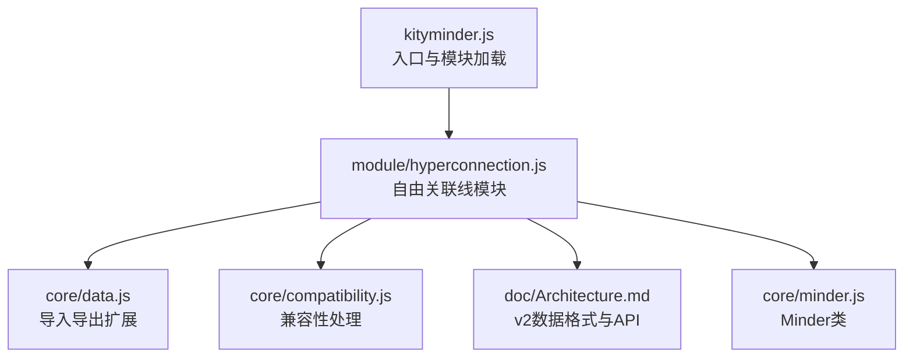
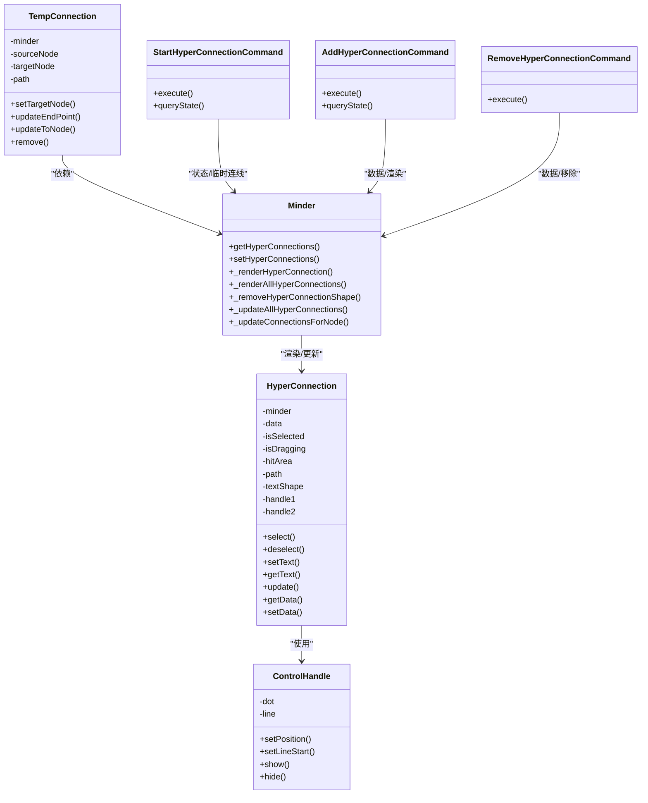
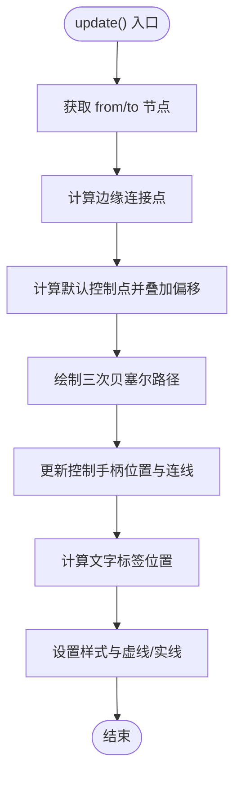
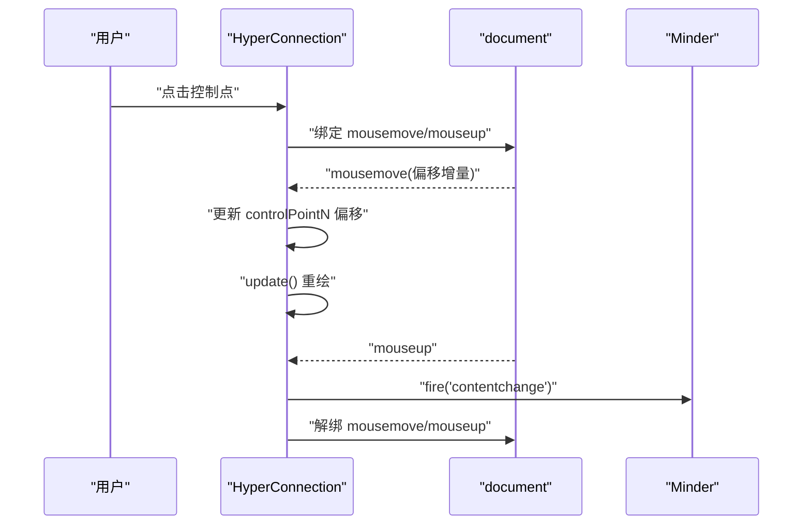
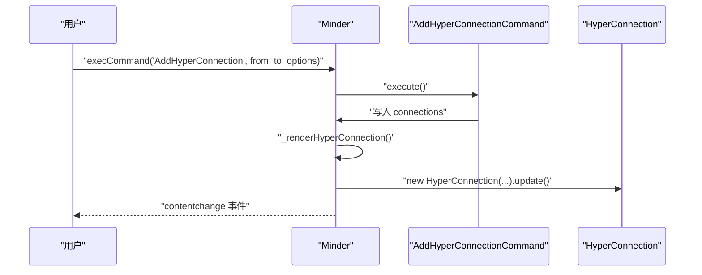
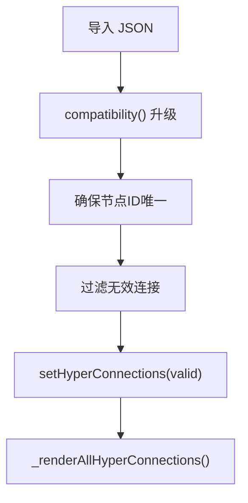
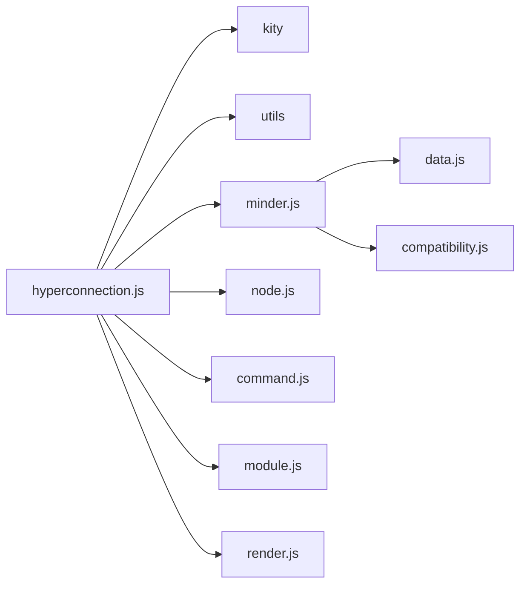

# 自由关联线

<cite>
**本文引用的文件**
- [src/module/hyperconnection.js](file://src/module/hyperconnection.js)
- [doc/Architecture.md](file://doc/Architecture.md)
- [src/core/data.js](file://src/core/data.js)
- [src/kityminder.js](file://src/kityminder.js)
- [src/core/minder.js](file://src/core/minder.js)
- [src/core/compatibility.js](file://src/core/compatibility.js)
</cite>

## 目录
1. [简介](#简介)
2. [项目结构](#项目结构)
3. [核心组件](#核心组件)
4. [架构总览](#架构总览)
5. [详细组件分析](#详细组件分析)
6. [依赖分析](#依赖分析)
7. [性能考虑](#性能考虑)
8. [故障排查指南](#故障排查指南)
9. [结论](#结论)
10. [附录](#附录)

## 简介
自由关联线（HyperConnection）是突破树形结构限制、连接任意两个节点的高级特性。它通过贝塞尔曲线绘制，支持拖拽控制点微调曲线形状，提供宽泛的点击热区提升交互体验，并通过命令系统实现可撤销操作。本文围绕 src/module/hyperconnection.js 的类结构、数据模型、渲染机制、事件处理、版本兼容策略、与核心系统的集成方式进行系统化解析，并给出使用示例与性能建议。

## 项目结构
自由关联线功能位于模块目录中，核心入口与模块注册机制由 kityminder.js 负责，数据导入导出在 core/data.js 中扩展，架构说明与 v2 数据格式在 Architecture.md 中定义。

图表来源
- [src/kityminder.js](file://src/kityminder.js#L45-L69)
- [src/module/hyperconnection.js](file://src/module/hyperconnection.js#L772-L975)
- [src/core/data.js](file://src/core/data.js#L56-L90)
- [src/core/compatibility.js](file://src/core/compatibility.js#L1-L92)
- [doc/Architecture.md](file://doc/Architecture.md#L592-L722)
- [src/core/minder.js](file://src/core/minder.js#L1-L41)

章节来源
- [src/kityminder.js](file://src/kityminder.js#L45-L69)
- [src/module/hyperconnection.js](file://src/module/hyperconnection.js#L772-L975)
- [src/core/data.js](file://src/core/data.js#L56-L90)
- [src/core/compatibility.js](file://src/core/compatibility.js#L1-L92)
- [doc/Architecture.md](file://doc/Architecture.md#L592-L722)
- [src/core/minder.js](file://src/core/minder.js#L1-L41)

## 核心组件
- HyperConnection：继承 kity.Group 的渲染器，负责连线的绘制、选中态、控制点手柄、文字标签、事件绑定与更新。
- TempConnection：拖拽创建过程中的临时连线，提供虚线预览与节点吸附。
- ControlHandle：控制点手柄，包含圆点与连接线，支持拖拽调整曲线。
- 命令体系：StartHyperConnectionCommand、AddHyperConnectionCommand、RemoveHyperConnectionCommand，封装可撤销操作。
- Minder 扩展：在 Minder 上挂载超连接数据与渲染方法，统一管理容器与更新。
- 数据模型：connections 数组中的每条记录包含 id、from、to、text、type、color、strokeWidth 以及控制点偏移量 controlPoint1/controlPoint2。

章节来源
- [src/module/hyperconnection.js](file://src/module/hyperconnection.js#L32-L209)
- [src/module/hyperconnection.js](file://src/module/hyperconnection.js#L82-L164)
- [src/module/hyperconnection.js](file://src/module/hyperconnection.js#L169-L567)
- [src/module/hyperconnection.js](file://src/module/hyperconnection.js#L572-L696)
- [src/module/hyperconnection.js](file://src/module/hyperconnection.js#L701-L767)

## 架构总览
自由关联线模块通过模块注册机制接入 Minder，使用独立的渲染容器承载连线，配合命令系统实现可撤销操作；数据层面通过 v2 格式统一存储与导入导出。

图表来源
- [src/module/hyperconnection.js](file://src/module/hyperconnection.js#L169-L567)
- [src/module/hyperconnection.js](file://src/module/hyperconnection.js#L82-L164)
- [src/module/hyperconnection.js](file://src/module/hyperconnection.js#L572-L696)
- [src/module/hyperconnection.js](file://src/module/hyperconnection.js#L701-L767)

## 详细组件分析

### 类结构设计
- HyperConnection 继承 kity.Group，内部组合：
  - hitArea：透明路径，提供宽泛点击热区；
  - path：可见连线，支持实线/虚线与箭头标记；
  - textShape：可双击编辑的文字标签；
  - handle1/handle2：控制点手柄，支持拖拽调整曲线。
- TempConnection 继承 kity.Group，用于拖拽创建过程中的预览连线，临时不参与鼠标事件。
- ControlHandle 继承 kity.Group，包含圆点与连接线，隐藏时仅显示圆点，拖拽时显示连接线。

章节来源
- [src/module/hyperconnection.js](file://src/module/hyperconnection.js#L32-L209)
- [src/module/hyperconnection.js](file://src/module/hyperconnection.js#L82-L164)
- [src/module/hyperconnection.js](file://src/module/hyperconnection.js#L169-L210)

### 数据模型与字段语义
- connections 数组中每条记录包含：
  - id：连接唯一标识；
  - from/to：起止节点 ID；
  - text：连线上文字说明；
  - type：连线类型（arrow/line/dashed）；
  - color/strokeWidth：颜色与线宽；
  - controlPoint1/controlPoint2：贝塞尔控制点偏移量（相对默认位置）。
- v2 数据格式在 Architecture.md 中定义，包含 version 字段与 connections 字段，支持自动升级与兼容处理。

章节来源
- [src/module/hyperconnection.js](file://src/module/hyperconnection.js#L17-L30)
- [doc/Architecture.md](file://doc/Architecture.md#L608-L643)

### 渲染机制
- 通过 getNodeEdgePoint 计算节点边缘连接点，避免连线从节点内部穿过；
- calculateControlPoints 计算默认控制点并叠加用户偏移；
- drawPath 使用三次贝塞尔曲线绘制路径，同时同步 hitArea 与 path；
- 选中态时加粗描边并显示控制手柄；文字标签位于曲线中点附近。

图表来源
- [src/module/hyperconnection.js](file://src/module/hyperconnection.js#L405-L559)
- [src/module/hyperconnection.js](file://src/module/hyperconnection.js#L501-L541)
- [src/module/hyperconnection.js](file://src/module/hyperconnection.js#L461-L499)

章节来源
- [src/module/hyperconnection.js](file://src/module/hyperconnection.js#L405-L559)

### 事件处理逻辑
- 点击热区 click：选中当前连线；
- 双击热区：触发 hyperconnectiondblclick 自定义事件；
- 控制点拖拽：mousedown 记录起始位置与偏移，document mousemove 更新偏移并重绘，mouseup 触发 contentchange；
- 画布点击 paperclick 与 selectionchange：取消选中；
- 模块事件：
  - layoutallfinish：更新所有超连接；
  - layoutapply：节点布局应用时节流更新；
  - import：导入完成后重新渲染；
  - noderemove：节点删除时移除相关超连接；
  - statuschange：进入/离开 hyperconnection 状态时更新光标与清理临时状态；
  - hyperconnection.mousedown：在拖拽创建模式下阻止事件传播，保存源/目标节点并执行 AddHyperConnection 命令；
  - hyperconnection.mousemove：节点悬停吸附与临时连线更新；
  - hyperconnection.keydown：ESC 取消创建。

图表来源
- [src/module/hyperconnection.js](file://src/module/hyperconnection.js#L291-L347)

章节来源
- [src/module/hyperconnection.js](file://src/module/hyperconnection.js#L252-L289)
- [src/module/hyperconnection.js](file://src/module/hyperconnection.js#L291-L347)
- [src/module/hyperconnection.js](file://src/module/hyperconnection.js#L800-L975)

### 命令系统与可撤销操作
- StartHyperConnectionCommand：进入 hyperconnection 状态，创建 TempConnection，设置光标为十字准星；
- AddHyperConnectionCommand：校验节点 ID、去重、生成连接、写入 connections 并渲染，触发 contentchange；
- RemoveHyperConnectionCommand：根据 id 删除连接并移除对应渲染形状，触发 contentchange；
- 命令 queryState 控制执行条件，支持普通模式与拖拽创建两种路径。

图表来源
- [src/module/hyperconnection.js](file://src/module/hyperconnection.js#L572-L696)
- [src/module/hyperconnection.js](file://src/module/hyperconnection.js#L715-L738)

章节来源
- [src/module/hyperconnection.js](file://src/module/hyperconnection.js#L572-L696)
- [src/module/hyperconnection.js](file://src/module/hyperconnection.js#L715-L738)

### 版本兼容性处理策略（v1→v2）
- 导出：统一使用 version: "2"，connections 字段保留（即使为空）；
- 导入：通过 compatibility 链处理旧版本，data.js 中确保节点 ID 唯一性，过滤无效连接；
- v2 数据格式：在 Architecture.md 中定义，包含 connections 字段与控制点偏移量；
- 与模块加载集成：kityminder.js 中显式引入 hyperconnection 模块，确保模块可用。

图表来源
- [src/core/data.js](file://src/core/data.js#L234-L308)
- [src/core/data.js](file://src/core/data.js#L277-L290)
- [src/core/compatibility.js](file://src/core/compatibility.js#L1-L92)
- [src/module/hyperconnection.js](file://src/module/hyperconnection.js#L728-L738)

章节来源
- [src/core/data.js](file://src/core/data.js#L56-L90)
- [src/core/data.js](file://src/core/data.js#L234-L308)
- [src/core/data.js](file://src/core/data.js#L277-L290)
- [src/core/compatibility.js](file://src/core/compatibility.js#L1-L92)
- [src/kityminder.js](file://src/kityminder.js#L45-L69)
- [doc/Architecture.md](file://doc/Architecture.md#L645-L662)

### 与核心系统的集成
- 模块注册：Module.register('HyperConnection', {...}) 创建独立渲染容器，放置于普通连线之上；
- Minder 扩展：在 Minder 上挂载 get/setHyperConnections、渲染与更新方法；
- 事件联动：模块事件与 Minder 事件协同，保证布局变化、节点删除、导入完成后的正确刷新；
- 入口加载：kityminder.js 中 require('./module/hyperconnection')，确保模块被加载。

章节来源
- [src/module/hyperconnection.js](file://src/module/hyperconnection.js#L772-L975)
- [src/module/hyperconnection.js](file://src/module/hyperconnection.js#L701-L767)
- [src/kityminder.js](file://src/kityminder.js#L45-L69)

## 依赖分析
- 模块内依赖：kity、utils、Minder、MinderNode、Command、Module、Renderer；
- 与核心系统耦合点：
  - 渲染容器：HyperConnection 容器位于普通连线之上；
  - 事件系统：模块事件与 Minder 事件相互触发；
  - 数据层：connections 存储于 Minder 实例，导入导出统一处理；
  - 命令系统：命令封装可撤销操作，触发 contentchange。

图表来源
- [src/module/hyperconnection.js](file://src/module/hyperconnection.js#L8-L16)
- [src/core/data.js](file://src/core/data.js#L1-L20)
- [src/core/compatibility.js](file://src/core/compatibility.js#L1-L20)

章节来源
- [src/module/hyperconnection.js](file://src/module/hyperconnection.js#L8-L16)
- [src/core/data.js](file://src/core/data.js#L1-L20)
- [src/core/compatibility.js](file://src/core/compatibility.js#L1-L20)

## 性能考虑
- 节点布局更新节流：layoutapply 事件中使用 requestAnimationFrame 或定时器对同一节点的更新进行节流，避免频繁重绘；
- 临时连线不参与鼠标事件：TempConnection 将 pointer-events 设置为 none，减少事件竞争；
- 控制点拖拽采用 document 级别事件：避免频繁绑定/解绑 DOM 事件；
- 大量自由关联线场景建议：
  - 合理控制 connections 数量，必要时分批渲染；
  - 在布局动画期间可暂时禁用动态更新；
  - 使用虚拟滚动或裁剪策略减少不可见连线的绘制；
  - 避免在高频拖拽中频繁触发 contentchange，可在拖拽结束后统一提交。

章节来源
- [src/module/hyperconnection.js](file://src/module/hyperconnection.js#L800-L825)
- [src/module/hyperconnection.js](file://src/module/hyperconnection.js#L95-L103)

## 故障排查指南
- 无法创建连接：
  - 确认源节点与目标节点均存在且 ID 唯一；
  - 检查命令 queryState 是否允许执行；
  - 拖拽模式下注意 hyperconnection.mousedown 事件是否被正确阻止传播。
- 连接不显示或错位：
  - 检查节点是否已渲染，from/to ID 是否有效；
  - 观察 layoutallfinish 与 layoutapply 事件是否触发；
  - 确认 _renderAllHyperConnections 是否被调用。
- 控制点无法拖拽：
  - 检查 HyperConnection 是否处于选中态；
  - 确认 document mousemove/mouseup 事件是否绑定成功；
  - 注意 isDragging 状态与 draggingHandleIndex 的一致性。
- 导入后连接丢失：
  - 检查 data.js 中对无效连接的过滤逻辑；
  - 确认 connections 字段是否存在于导入数据中。

章节来源
- [src/module/hyperconnection.js](file://src/module/hyperconnection.js#L572-L696)
- [src/module/hyperconnection.js](file://src/module/hyperconnection.js#L728-L767)
- [src/core/data.js](file://src/core/data.js#L277-L290)

## 结论
自由关联线通过清晰的类结构、完善的命令系统与事件机制，实现了跨节点的灵活连接与交互。其 v2 数据格式与导入导出扩展确保了版本演进与兼容性。在大规模场景下，应重视节流与渲染优化，以维持流畅的用户体验。

## 附录
- 使用示例（基于 Architecture.md 的 API 说明）：
  - 添加关联线：调用 AddHyperConnection 命令，传入起止节点与可选样式；
  - 删除关联线：调用 RemoveHyperConnection 命令，传入连接 id；
  - 获取/设置关联线：通过 Minder.getHyperConnections()/setHyperConnections；
  - 导入/导出：使用 data.js 的 importJson/exportJson，自动处理 connections 字段。
- 性能建议：
  - 大脑图节点数量较多时，适当降低动态更新频率；
  - 控制手柄拖拽结束后再触发批量更新；
  - 对不可见区域的连线进行裁剪或延迟渲染。

章节来源
- [doc/Architecture.md](file://doc/Architecture.md#L663-L681)
- [src/core/data.js](file://src/core/data.js#L56-L90)
- [src/core/data.js](file://src/core/data.js#L234-L308)