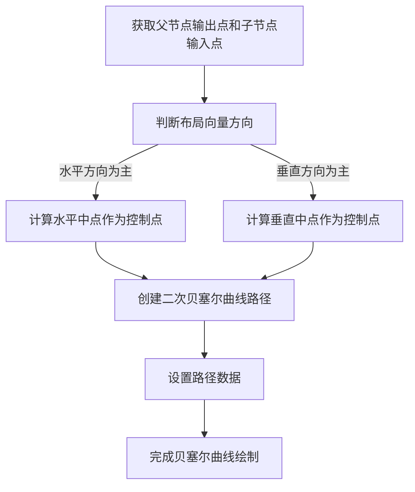
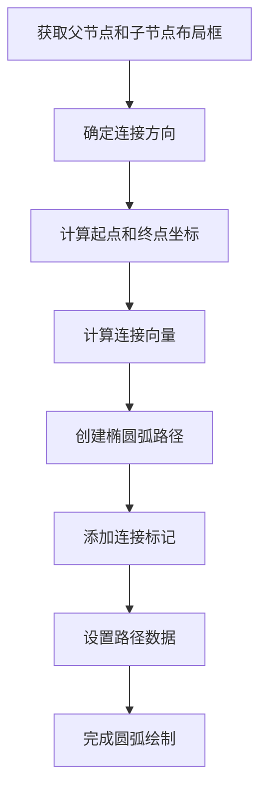
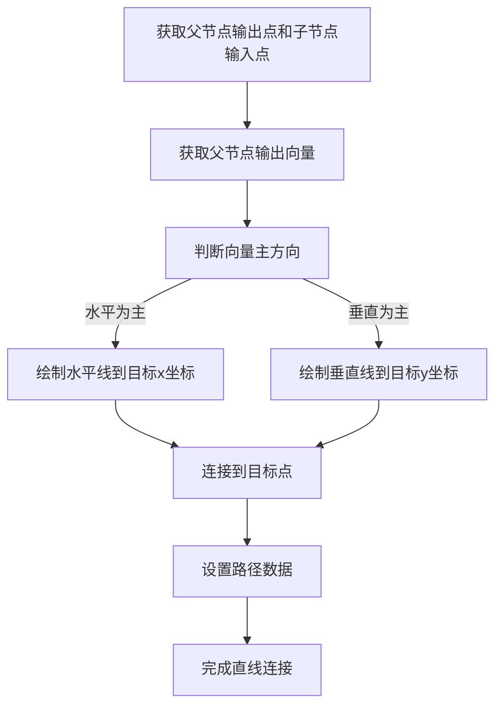
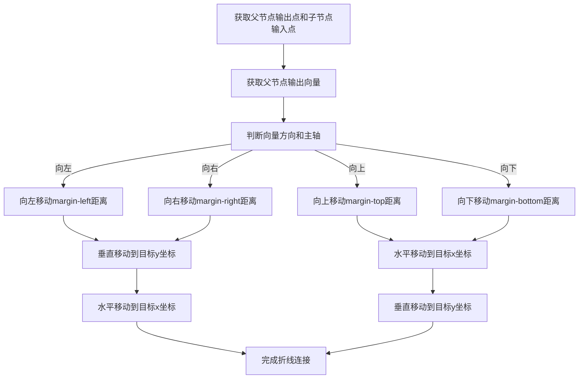
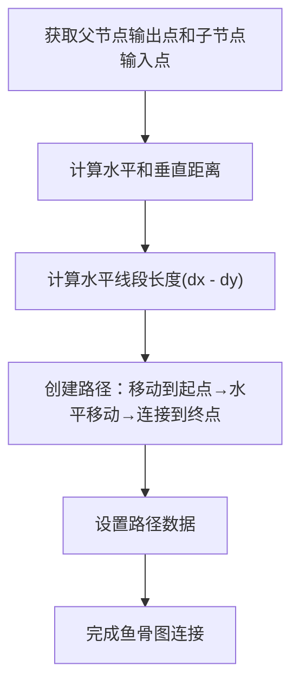
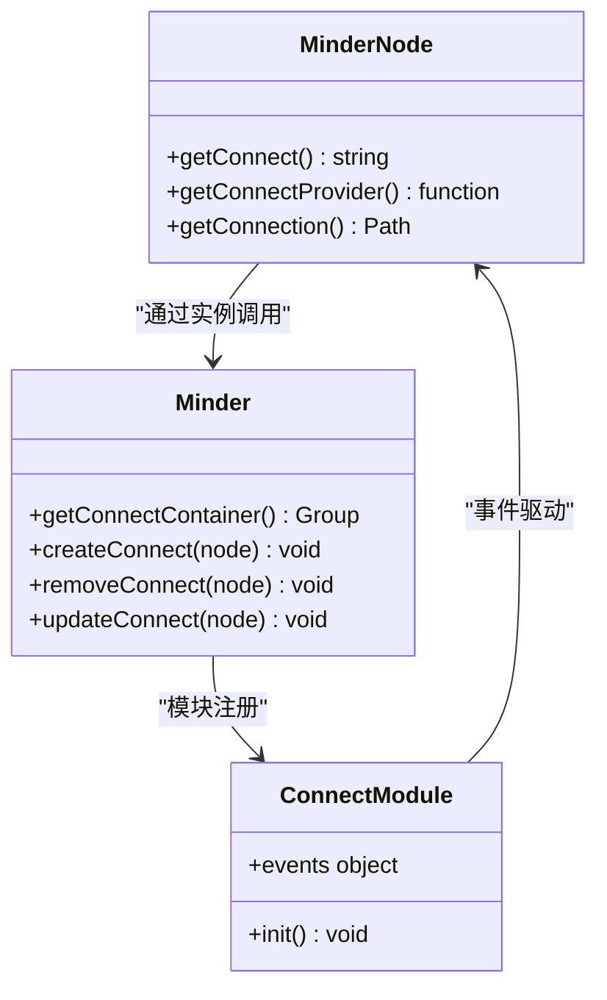
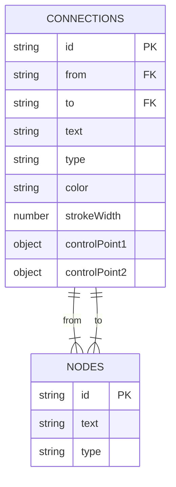
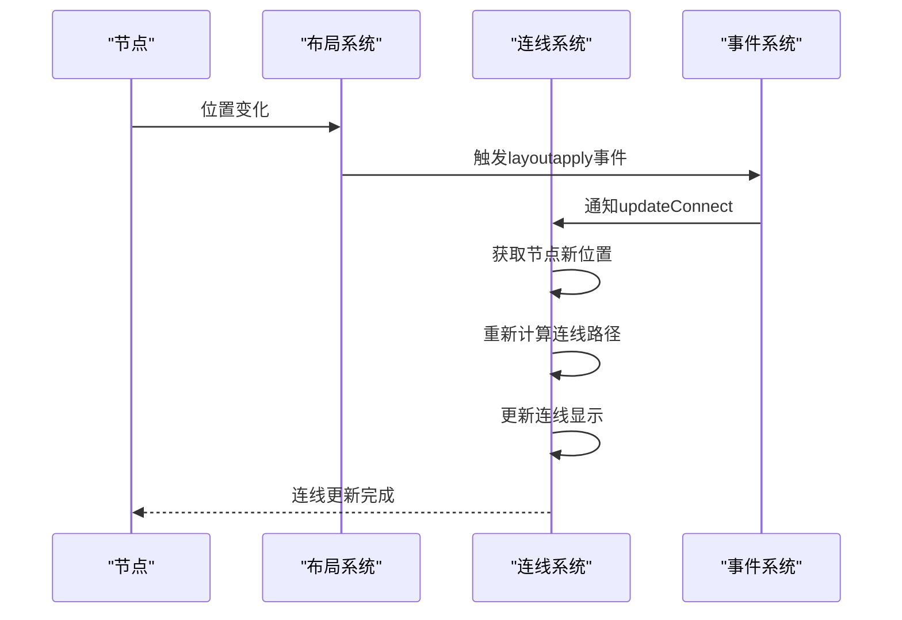

# 连线系统

<cite>
**本文档引用的文件**  
- [bezier.js](file://src/connect/bezier.js)
- [arc.js](file://src/connect/arc.js)
- [l.js](file://src/connect/l.js)
- [poly.js](file://src/connect/poly.js)
- [fish-bone-master.js](file://src/connect/fish-bone-master.js)
- [under.js](file://src/connect/under.js)
- [arc_tp.js](file://src/connect/arc_tp.js)
- [connect.js](file://src/core/connect.js)
- [hyperconnection.js](file://src/module/hyperconnection.js)
- [Architecture.md](file://doc/Architecture.md)
- [node.js](file://src/core/node.js)
- [layout.js](file://src/core/layout.js)
</cite>

## 目录
1. [引言](#引言)
2. [连线算法实现细节](#连线算法实现细节)
   1. [贝塞尔曲线连线](#贝塞尔曲线连线)
   2. [圆弧连线](#圆弧连线)
   3. [直线连接](#直线连接)
   4. [折线连接](#折线连接)
   5. [鱼骨图主线连接](#鱼骨图主线连接)
   6. [下划线连接](#下划线连接)
   7. [天盘圆弧连线](#天盘圆弧连线)
3. [连线管理核心机制](#连线管理核心机制)
4. [自由关联线系统](#自由关联线系统)
5. [连线响应机制](#连线响应机制)
6. [性能优化建议](#性能优化建议)
7. [总结](#总结)

## 引言

连线系统是思维导图可视化的重要组成部分，负责在节点之间建立视觉连接，表达层级关系和逻辑关联。本系统实现了多种连线算法，包括贝塞尔曲线、圆弧、直线、折线等，满足不同布局和美学需求。通过统一的管理机制，系统能够高效地创建、更新和销毁连线，并响应节点移动和布局变化。

**本文档引用的文件**  
- [Architecture.md](file://doc/Architecture.md#L1-L722)

## 连线算法实现细节

### 贝塞尔曲线连线

贝塞尔曲线连线通过二次贝塞尔曲线实现平滑过渡效果。算法根据父节点和子节点的布局向量方向决定控制点的计算方式：当水平方向变化较大时，使用水平中点作为控制点；当垂直方向变化较大时，使用垂直中点作为控制点。这种自适应的控制点计算方式确保了曲线在不同布局方向上都能保持良好的视觉效果。

**Diagram sources**  
- [bezier.js](file://src/connect/bezier.js#L14-L42)

**本文档引用的文件**  
- [bezier.js](file://src/connect/bezier.js#L1-L42)

### 圆弧连线

圆弧连线使用SVG的椭圆弧命令（A）实现圆形连接效果。算法首先确定连接方向（左或右），然后计算起点和终点坐标。通过计算两点间的向量，确定弧线的半径和旋转角度。该算法还实现了连接标记（marker），在弧线终点显示圆形标记，增强视觉指示效果。

**Diagram sources**  
- [arc.js](file://src/connect/arc.js#L23-L49)

**本文档引用的文件**  
- [arc.js](file://src/connect/arc.js#L1-L49)

### 直线连接

直线连接是最简单的连线类型，通过水平线（H）或垂直线（V）命令实现"L"形连接。算法根据父节点的输出向量方向选择水平或垂直连接方式。当水平方向变化较大时，先绘制水平线再连接到目标点；当垂直方向变化较大时，先绘制垂直线再连接到目标点。这种实现方式简洁高效，适合紧凑布局。

**Diagram sources**  
- [l.js](file://src/connect/l.js#L14-L34)

**本文档引用的文件**  
- [l.js](file://src/connect/l.js#L1-L34)

### 折线连接

折线连接实现了直角转折的连接效果，支持四个方向的连接。算法根据父节点输出向量的方向和正负值确定连接方向（左、右、上、下），并使用父节点的边距样式作为转折距离。通过水平相对移动（h）、垂直移动（v）和绝对定位（H、V）命令组合，创建具有直角转折的路径。

**Diagram sources**  
- [poly.js](file://src/connect/poly.js#L14-L63)

**本文档引用的文件**  
- [poly.js](file://src/connect/poly.js#L1-L63)

### 鱼骨图主线连接

鱼骨图主线连接是为鱼骨图布局设计的特殊几何算法。算法计算父节点输出点和子节点输入点之间的水平和垂直距离，然后创建一个水平线段，其长度为水平距离减去垂直距离，最后连接到目标点。这种特殊的几何计算方式形成了鱼骨图特有的斜线连接效果。

**Diagram sources**  
- [fish-bone-master.js](file://src/connect/fish-bone-master.js#L14-L33)

**本文档引用的文件**  
- [fish-bone-master.js](file://src/connect/fish-bone-master.js#L1-L33)

### 下划线连接

下划线连接实现了从父节点到子节点的曲线连接，特别适用于子节点在父节点下方的布局。算法根据连接方向（左或右）确定起点和控制点位置，使用二次贝塞尔曲线创建平滑的下划线效果。连接的y坐标基于子节点底部和父节点中心位置计算，确保连接线位于节点下方。

**本文档引用的文件**  
- [under.js](file://src/connect/under.js#L1-L50)

### 天盘圆弧连线

天盘圆弧连线是为天盘布局设计的特殊圆弧连接算法。与普通圆弧连线不同，该算法不仅连接当前节点和父节点，还需要渲染当前节点与下一个节点的连接，防止样式上的断线。算法计算相邻节点间的距离作为弧线半径，并为下一个节点的连接线进行同样的处理，确保连接的连续性。

**本文档引用的文件**  
- [arc_tp.js](file://src/connect/arc_tp.js#L1-L85)

## 连线管理核心机制

连线系统的核心管理机制由`src/core/connect.js`文件实现，通过注册模式统一管理所有连线类型的渲染、更新和销毁。系统定义了`_connectProviders`对象存储各种连线提供方，并通过`register`函数注册新的连线类型。

**Diagram sources**  
- [connect.js](file://src/core/connect.js#L1-L126)

**本文档引用的文件**  
- [connect.js](file://src/core/connect.js#L1-L126)

系统通过模块化设计实现了完整的生命周期管理：
1. **初始化**：创建连线容器组并添加到渲染容器中
2. **创建**：为节点创建连线对象并添加到容器中
3. **更新**：根据节点位置和样式更新连线路径和外观
4. **销毁**：移除节点及其子树的所有连线

事件系统在`Module.register`中定义，监听`nodeattach`、`nodedetach`、`layoutapply`等事件，自动触发相应的连线操作，确保连线与节点状态保持同步。

## 自由关联线系统

自由关联线系统允许在任意两个节点之间建立关联连接，不受树形结构限制。该系统在v2版本的数据结构中引入了`connections`字段，用于存储自由关联线数据。每个关联线包含起始节点ID、目标节点ID、连线类型、颜色、线宽以及贝塞尔控制点偏移量等信息。

**Diagram sources**  
- [Architecture.md](file://doc/Architecture.md#L608-L644)
- [hyperconnection.js](file://src/module/hyperconnection.js#L1-L974)

**本文档引用的文件**  
- [Architecture.md](file://doc/Architecture.md#L598-L644)
- [hyperconnection.js](file://src/module/hyperconnection.js#L1-L974)

系统支持三种连线类型：箭头、直线和虚线，并允许在连线上显示文字说明。特别的是，系统实现了贝塞尔控制点拖拽功能，用户可以通过拖动控制手柄实时调整曲线形状，调整结果会自动保存到控制点偏移量中。

## 连线响应机制

连线系统通过事件驱动机制响应节点移动和布局变化。当节点位置发生变化时，系统会触发`layoutapply`、`layoutfinish`或`noderender`事件，进而调用`updateConnect`方法重新计算和绘制连线。

**Diagram sources**  
- [connect.js](file://src/core/connect.js#L113-L121)
- [layout.js](file://src/core/layout.js#L417-L436)

**本文档引用的文件**  
- [connect.js](file://src/core/connect.js#L113-L121)
- [layout.js](file://src/core/layout.js#L391-L436)

系统通过`getLayoutVertexIn`和`getLayoutVertexOut`方法获取节点在布局变换后的实际位置，确保连线始终连接到节点的正确位置。这些方法结合了节点的局部变换矩阵和全局布局变换矩阵，能够准确计算出节点在画布上的最终坐标。

## 性能优化建议

在处理大量连线时，可以采取以下性能优化措施：

1. **批量更新**：避免频繁调用单个节点的更新方法，尽量使用批量更新机制
2. **节流处理**：对频繁触发的更新操作进行节流，减少不必要的重绘
3. **简化路径**：在节点密集区域使用更简单的连线类型（如直线）
4. **延迟渲染**：对于不可见区域的节点连线，可以延迟渲染
5. **缓存计算结果**：缓存节点位置和连线路径的计算结果，避免重复计算

当节点数量超过200个时，系统会自动关闭布局动画，以提高性能。这种智能的性能调节机制确保了系统在不同规模数据下的流畅运行。

**本文档引用的文件**  
- [layout.js](file://src/core/layout.js#L458-L459)

## 总结

连线系统通过多种算法实现了丰富的视觉效果，从简单的直线连接到复杂的贝塞尔曲线，满足了不同场景的需求。系统采用模块化设计，通过统一的管理机制实现了高效的连线创建、更新和销毁。自由关联线系统的引入扩展了思维导图的表达能力，允许用户在任意节点间建立关联。事件驱动的响应机制确保了连线与节点状态的同步，而智能的性能优化策略保证了系统在大规模数据下的流畅运行。

**本文档引用的文件**  
- [Architecture.md](file://doc/Architecture.md#L1-L722)
- [connect.js](file://src/core/connect.js#L1-L126)