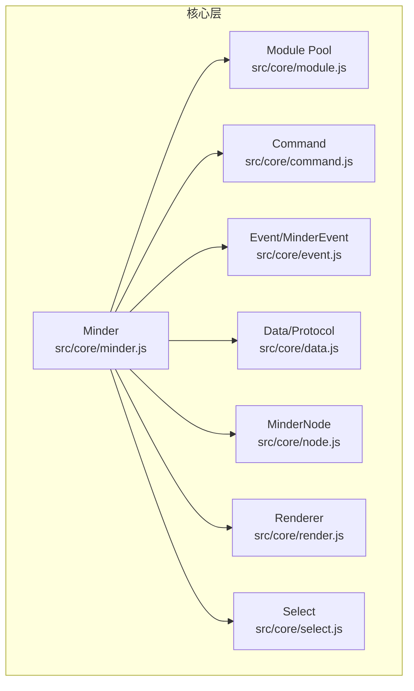
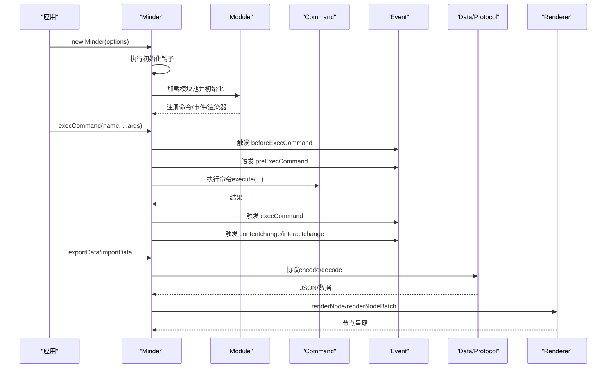
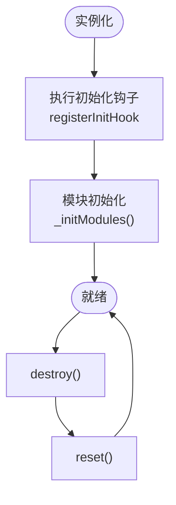
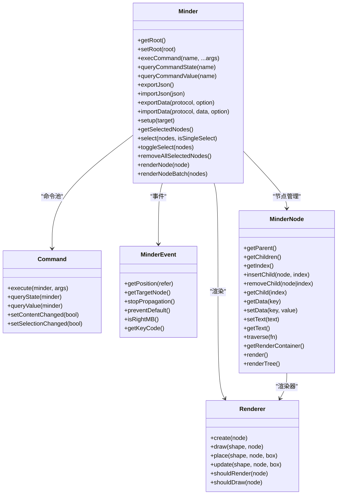
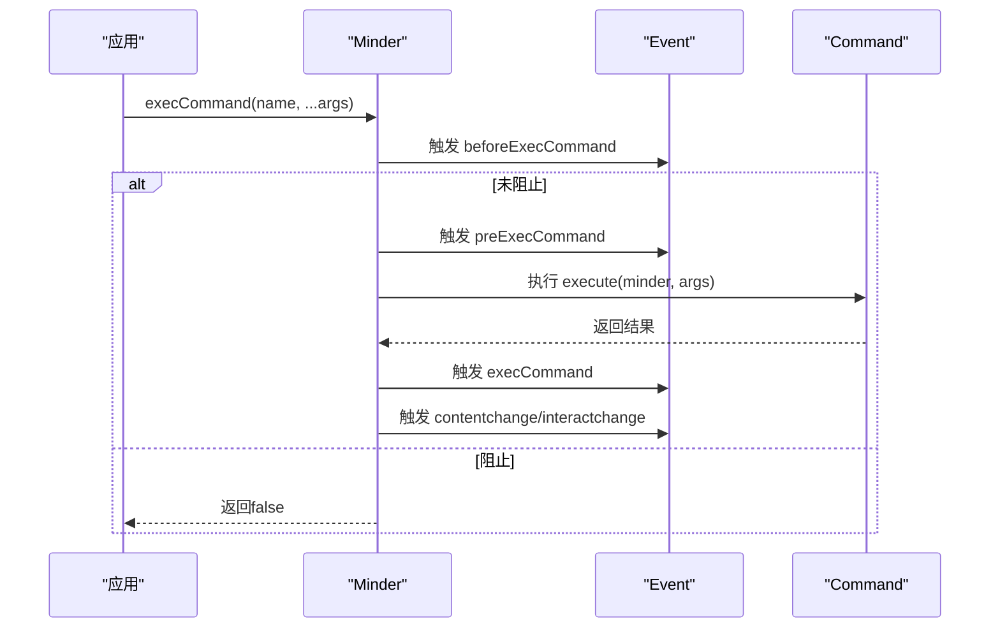
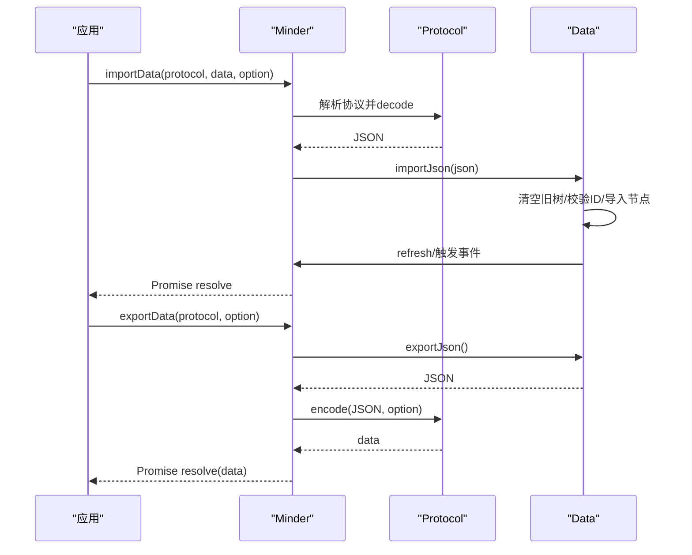
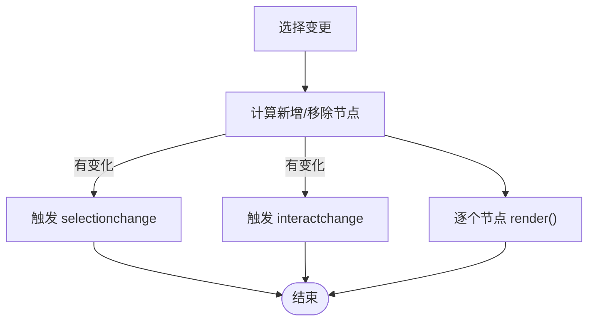
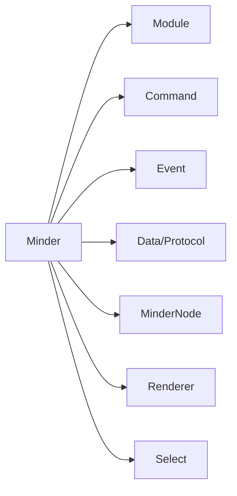

# Minder类

<cite>
**本文引用的文件**
- [minder.js](file://src/core/minder.js)
- [module.js](file://src/core/module.js)
- [command.js](file://src/core/command.js)
- [event.js](file://src/core/event.js)
- [data.js](file://src/core/data.js)
- [node.js](file://src/core/node.js)
- [render.js](file://src/core/render.js)
- [select.js](file://src/core/select.js)
- [Architecture.md](file://doc/Architecture.md)
- [expose-kityminder.js](file://src/expose-kityminder.js)
- [example.html](file://example.html)
</cite>

## 目录
1. [简介](#简介)
2. [项目结构](#项目结构)
3. [核心组件](#核心组件)
4. [架构总览](#架构总览)
5. [详细组件分析](#详细组件分析)
6. [依赖分析](#依赖分析)
7. [性能考虑](#性能考虑)
8. [故障排查指南](#故障排查指南)
9. [结论](#结论)
10. [附录](#附录)

## 简介
Minder类是KityMinder的核心控制器，负责承载整个思维导图的生命周期、模块装配、命令执行、事件分发、数据导入导出、节点选择与渲染等关键职责。它通过模块系统注入功能模块，通过命令系统统一调度业务操作，通过事件系统串联交互与状态变更，通过渲染系统驱动节点呈现。本文将系统性梳理Minder类的生命周期、配置与初始化参数、公开接口、内部架构与协作关系，并结合Architecture.md中的代码示例说明其实际应用。

## 项目结构
围绕Minder类的关键文件分布如下：
- 核心控制器：src/core/minder.js
- 模块系统：src/core/module.js
- 命令系统：src/core/command.js
- 事件系统：src/core/event.js
- 数据导入导出：src/core/data.js
- 节点模型：src/core/node.js
- 渲染系统：src/core/render.js
- 选择管理：src/core/select.js
- 文档说明：doc/Architecture.md
- 外部暴露：src/expose-kityminder.js
- 使用示例：example.html

图表来源
- [minder.js](file://src/core/minder.js#L1-L41)
- [module.js](file://src/core/module.js#L1-L151)
- [command.js](file://src/core/command.js#L1-L169)
- [event.js](file://src/core/event.js#L1-L270)
- [data.js](file://src/core/data.js#L1-L416)
- [node.js](file://src/core/node.js#L1-L407)
- [render.js](file://src/core/render.js#L1-L261)
- [select.js](file://src/core/select.js#L1-L146)

章节来源
- [minder.js](file://src/core/minder.js#L1-L41)
- [module.js](file://src/core/module.js#L1-L151)
- [command.js](file://src/core/command.js#L1-L169)
- [event.js](file://src/core/event.js#L1-L270)
- [data.js](file://src/core/data.js#L1-L416)
- [node.js](file://src/core/node.js#L1-L407)
- [render.js](file://src/core/render.js#L1-L261)
- [select.js](file://src/core/select.js#L1-L146)
- [Architecture.md](file://doc/Architecture.md#L140-L376)

## 核心组件
- Minder：思维导图主控制器，负责生命周期、模块装配、命令执行、事件分发、数据导入导出、节点选择与渲染。
- MinderNode：节点模型，提供树遍历、数据存取、渲染容器访问等能力。
- Command：命令抽象，定义命令的执行、回退、状态查询与值查询。
- Module：模块注册与生命周期管理，负责命令注册、事件绑定、渲染器注册、快捷键等。
- Event/MinderEvent：事件封装与分发，支持冒泡、停止传播、坐标获取、命中节点等。
- Data/Protocol：数据协议注册与导入导出，支持JSON、Markdown、Text、SVG、PNG等协议。
- Renderer：渲染器抽象，按节点分段渲染，支持延迟盒、绘制与定位。
- Select：选区管理，提供多选、单选、切换、清空、祖先节点筛选等。

章节来源
- [minder.js](file://src/core/minder.js#L1-L41)
- [node.js](file://src/core/node.js#L1-L407)
- [command.js](file://src/core/command.js#L1-L169)
- [module.js](file://src/core/module.js#L1-L151)
- [event.js](file://src/core/event.js#L1-L270)
- [data.js](file://src/core/data.js#L1-L416)
- [render.js](file://src/core/render.js#L1-L261)
- [select.js](file://src/core/select.js#L1-L146)
- [Architecture.md](file://doc/Architecture.md#L140-L376)

## 架构总览
Minder类通过以下路径完成初始化与运行：
- 构造函数接收options，执行初始化钩子（init hooks），随后触发finishInitHook事件。
- 初始化阶段注册模块池中的模块，构建命令池、事件绑定、渲染器注册、快捷键等。
- 运行阶段通过execCommand统一调度命令，触发before/pre/exec/contentchange/interactchange等事件。
- 数据层面通过data.js提供的协议系统完成导入导出，支持JSON、Markdown、Text、SVG、PNG等。
- 选择与渲染通过select.js与render.js协同，实现节点选区变化与批量渲染。

图表来源
- [minder.js](file://src/core/minder.js#L1-L41)
- [module.js](file://src/core/module.js#L1-L151)
- [command.js](file://src/core/command.js#L58-L169)
- [event.js](file://src/core/event.js#L129-L269)
- [data.js](file://src/core/data.js#L309-L416)
- [render.js](file://src/core/render.js#L85-L224)

章节来源
- [minder.js](file://src/core/minder.js#L1-L41)
- [module.js](file://src/core/module.js#L1-L151)
- [command.js](file://src/core/command.js#L58-L169)
- [event.js](file://src/core/event.js#L129-L269)
- [data.js](file://src/core/data.js#L309-L416)
- [render.js](file://src/core/render.js#L85-L224)

## 详细组件分析

### 生命周期管理
- 实例化：Minder构造函数接收options，复制一份私有_options，依次执行已注册的初始化钩子，最后触发finishInitHook事件。
- 初始化：模块系统在初始化钩子中调用_initModules，构建命令池、事件绑定、渲染器注册、快捷键等。
- 销毁：destroy方法重置事件、清空根节点、逐个调用模块的destroy回调，完成资源回收。
- 重置：reset方法清空根节点并逐个调用模块的reset回调，恢复到初始状态。

图表来源
- [minder.js](file://src/core/minder.js#L1-L41)
- [module.js](file://src/core/module.js#L13-L151)

章节来源
- [minder.js](file://src/core/minder.js#L1-L41)
- [module.js](file://src/core/module.js#L13-L151)

### 配置选项与初始化参数
- 构造函数参数：Minder构造函数接收options对象，内部将其浅拷贝到内部_options，供模块初始化与后续使用。
- 模块选择：模块系统根据_options.modules决定加载哪些模块；若未指定则加载模块池中的全部模块。
- 默认选项：模块可通过defaultOptions向Minder注册默认配置，Minder在模块初始化时合并到全局配置。
- 外部暴露：expose-kityminder.js将Minder挂载到window.kityminder，便于外部直接使用。

章节来源
- [minder.js](file://src/core/minder.js#L1-L41)
- [module.js](file://src/core/module.js#L18-L118)
- [expose-kityminder.js](file://src/expose-kityminder.js#L1-L3)

### 公开接口
- 根节点与节点管理
  - getRoot()：获取根节点
  - setRoot(root)：设置根节点
  - getAllNode()：遍历整棵树获取节点列表
  - getNodeById(id)/getNodesById(ids)：按ID获取节点
  - createNode(textOrData, parent, index)：创建节点并插入
  - appendNode/removeNode/attachNode/detachNode：节点增删与挂载
  - getMinderTitle()：获取根节点文本作为标题
- 命令系统
  - execCommand(name, ...args)：执行命令，触发before/pre/exec/contentchange/interactchange事件
  - queryCommandState(name)：查询命令状态（-1不可用/0可用/1已执行）
  - queryCommandValue(name)：查询命令当前值
- 事件系统
  - on/off/fire：事件订阅、取消与触发
  - dispatchKeyEvent：派发键盘事件
  - 事件类型：交互事件、命令事件、选择/内容/交互状态事件、模块自定义事件
- 数据导入导出
  - exportJson()/exportNode(node)：导出整树或指定节点
  - importJson(json)/importNode(node, json)/importData(protocol, data, option)：导入整树或指定节点，支持协议解码
  - exportData(protocol, option)：按协议导出
  - setup(target)：自动识别并导入指定元素中的数据
- 节点选择
  - getSelectedNodes()/getSelectedNode()：获取选中节点
  - select(nodes, isSingleSelect)/selectById(ids, isSingleSelect)：添加选中
  - toggleSelect(node)：切换选中
  - removeAllSelectedNodes()/removeSelectedNodes(nodes)/clearSelect()：清空或移除选中
  - getSelectedAncestors(includeRoot)：获取选区祖先节点
- 渲染
  - renderNode(node)/renderNodeBatch(nodes)：按节点或批量渲染
  - MinderNode.render()/renderTree()：节点渲染入口

章节来源
- [Architecture.md](file://doc/Architecture.md#L314-L373)
- [command.js](file://src/core/command.js#L58-L169)
- [event.js](file://src/core/event.js#L129-L269)
- [data.js](file://src/core/data.js#L30-L416)
- [node.js](file://src/core/node.js#L316-L407)
- [select.js](file://src/core/select.js#L1-L146)
- [render.js](file://src/core/render.js#L85-L224)

### 内部架构与协作关系
- 模块系统：模块注册池通过register注册，Minder在初始化钩子中加载模块，构建命令池、事件绑定、渲染器注册、快捷键等。
- 命令系统：命令通过模块注册到Minder的命令池，execCommand统一调度，支持状态查询与值查询，触发命令事件链。
- 事件系统：MinderEvent封装事件，支持坐标、命中节点、阻止传播等；Minder内部绑定纸面与窗口事件，派发before/pre/after系列事件。
- 数据系统：协议注册与解码/编码，importData先解码为JSON，再importJson覆盖当前树；exportData按协议导出。
- 选择系统：维护_selectedNodes，提供多选、单选、切换、清空与祖先节点筛选，变更时触发selectionchange与interactchange。
- 渲染系统：按节点分段渲染，支持延迟盒、绘制与定位，批量渲染提升性能。

图表来源
- [minder.js](file://src/core/minder.js#L1-L41)
- [command.js](file://src/core/command.js#L1-L169)
- [event.js](file://src/core/event.js#L1-L270)
- [node.js](file://src/core/node.js#L1-L407)
- [render.js](file://src/core/render.js#L1-L261)

章节来源
- [module.js](file://src/core/module.js#L1-L151)
- [command.js](file://src/core/command.js#L58-L169)
- [event.js](file://src/core/event.js#L129-L269)
- [data.js](file://src/core/data.js#L30-L416)
- [node.js](file://src/core/node.js#L1-L407)
- [render.js](file://src/core/render.js#L85-L224)
- [select.js](file://src/core/select.js#L1-L146)

### 命令执行流程

图表来源
- [command.js](file://src/core/command.js#L118-L169)
- [event.js](file://src/core/event.js#L162-L193)

章节来源
- [command.js](file://src/core/command.js#L118-L169)
- [event.js](file://src/core/event.js#L162-L193)

### 数据导入导出流程

图表来源
- [data.js](file://src/core/data.js#L309-L416)

章节来源
- [data.js](file://src/core/data.js#L309-L416)

### 节点选择与渲染流程

图表来源
- [select.js](file://src/core/select.js#L13-L40)
- [render.js](file://src/core/render.js#L223-L261)

章节来源
- [select.js](file://src/core/select.js#L13-L40)
- [render.js](file://src/core/render.js#L223-L261)

## 依赖分析
- Minder对模块系统的依赖：通过registerInitHook与_module池加载模块，构建命令池、事件绑定、渲染器注册。
- Minder对命令系统的依赖：通过命令池统一调度命令，支持状态查询与值查询。
- Minder对事件系统的依赖：事件分发贯穿交互、命令、选择、内容与交互状态。
- Minder对数据系统的依赖：协议注册与导入导出，支持多格式数据交换。
- Minder对节点系统的依赖：节点树管理、数据存取、渲染容器访问。
- Minder对渲染系统的依赖：按节点分段渲染，批量渲染优化性能。
- Minder对选择系统的依赖：维护选区，触发选区变化事件。

图表来源
- [minder.js](file://src/core/minder.js#L1-L41)
- [module.js](file://src/core/module.js#L1-L151)
- [command.js](file://src/core/command.js#L1-L169)
- [event.js](file://src/core/event.js#L1-L270)
- [data.js](file://src/core/data.js#L1-L416)
- [node.js](file://src/core/node.js#L1-L407)
- [render.js](file://src/core/render.js#L1-L261)
- [select.js](file://src/core/select.js#L1-L146)

章节来源
- [minder.js](file://src/core/minder.js#L1-L41)
- [module.js](file://src/core/module.js#L1-L151)
- [command.js](file://src/core/command.js#L1-L169)
- [event.js](file://src/core/event.js#L1-L270)
- [data.js](file://src/core/data.js#L1-L416)
- [node.js](file://src/core/node.js#L1-L407)
- [render.js](file://src/core/render.js#L1-L261)
- [select.js](file://src/core/select.js#L1-L146)

## 性能考虑
- 渲染批处理：renderNodeBatch按渲染器顺序批量渲染，减少重复创建与绘制，提升大节点树渲染效率。
- 事件稀释：interactchange采用定时器去抖，避免高频交互事件导致的频繁刷新。
- 动画优化：节点数超过阈值时自动关闭布局动画，保证性能。
- 选择变更：仅对发生变化的节点触发渲染，降低不必要的重绘。
- 数据导入：ID冲突检测与修复在导入前完成，避免后续渲染异常。

[本节为通用性能建议，不直接分析具体文件]

## 故障排查指南
- 命令不可执行：检查queryCommandState返回值，确认命令是否已注册且状态允许。
- 事件未触发：确认事件类型大小写与拼写，确保模块正确绑定事件或Minder已绑定纸面事件。
- 导入失败：检查协议是否注册、数据格式是否符合协议要求、ID冲突是否被正确修复。
- 选择异常：确认选择API调用顺序与参数类型，检查选区祖先计算逻辑。
- 渲染不生效：确认节点已attach到渲染容器，渲染器shouldRender/shouldDraw返回正确值。

章节来源
- [command.js](file://src/core/command.js#L58-L169)
- [event.js](file://src/core/event.js#L129-L269)
- [data.js](file://src/core/data.js#L309-L416)
- [select.js](file://src/core/select.js#L1-L146)
- [render.js](file://src/core/render.js#L85-L224)

## 结论
Minder类作为KityMinder的核心控制器，通过模块化、命令化、事件化与渲染化的架构设计，实现了思维导图的完整生命周期管理与功能扩展。其公开接口覆盖根节点管理、命令执行、事件分发、数据导入导出、节点选择与渲染等关键领域，配合模块系统与协议体系，能够灵活适配多样化的应用场景。理解其初始化流程、命令执行链路与事件传播机制，有助于高效使用与扩展Minder类。

[本节为总结性内容，不直接分析具体文件]

## 附录
- 使用示例：example.html展示了如何创建Minder实例、自动导入数据、禁用与切换手绘模式等典型用法。
- 文档说明：Architecture.md提供了Minder类的公开接口、事件机制与模块化设计的权威说明。

章节来源
- [example.html](file://example.html#L1-L66)
- [Architecture.md](file://doc/Architecture.md#L140-L376)