# 事件处理

<cite>
**本文档引用的文件**   
- [minder.js](file://src\core\minder.js)
- [event.js](file://src\core\event.js)
- [module.js](file://src\core\module.js)
- [data.js](file://src\core\data.js)
- [render.js](file://src\core\render.js)
- [select.js](file://src\core\select.js)
- [layout.js](file://src\core\layout.js)
- [status.js](file://src\core\status.js)
- [text.js](file://src\module\text.js)
- [select.js](file://src\module\select.js)
- [keynav.js](file://src\module\keynav.js)
- [view.js](file://src\module\view.js)
- [Architecture.md](file://doc\Architecture.md)
</cite>

## 目录
1. [引言](#引言)
2. [事件系统架构](#事件系统架构)
3. [核心事件机制](#核心事件机制)
4. [事件生命周期](#事件生命周期)
5. [重要内置事件](#重要内置事件)
6. [事件性能与内存管理](#事件性能与内存管理)
7. [事件调试技巧](#事件调试技巧)
8. [事件使用最佳实践](#事件使用最佳实践)
9. [总结](#总结)

## 引言

KityMinder 是一个功能强大的脑图编辑器，其事件处理机制是整个系统的核心组成部分。本文档系统性地阐述 Minder 类的事件处理机制，详细说明其基于观察者模式的事件系统实现。我们将深入探讨事件的触发（fire）和监听（on）机制，展示如何通过事件实现组件间的松耦合通信。文档将描述核心事件的生命周期，包括事件冒泡、阻止默认行为等特性，并列举重要的内置事件如 'contentchange'、'selectionchange'、'layout' 等，提供实际使用场景示例。此外，我们还将说明事件系统的性能特征和内存管理策略，避免常见的内存泄漏问题，提供事件调试技巧，并给出事件使用最佳实践。

## 事件系统架构

KityMinder 的事件系统基于经典的观察者模式（Observer Pattern）实现，为整个应用提供了灵活、解耦的通信机制。该系统允许不同的模块和组件在不直接依赖彼此的情况下进行交互，极大地提高了代码的可维护性和可扩展性。

事件系统的核心由 `Minder` 类和 `MinderEvent` 类构成。`Minder` 类作为事件的中心枢纽，负责管理所有事件的监听和触发。它通过 `_eventCallbacks` 对象来存储所有注册的事件监听器，该对象以事件类型为键，以监听器函数数组为值。这种数据结构使得事件的分发和管理变得高效且有序。

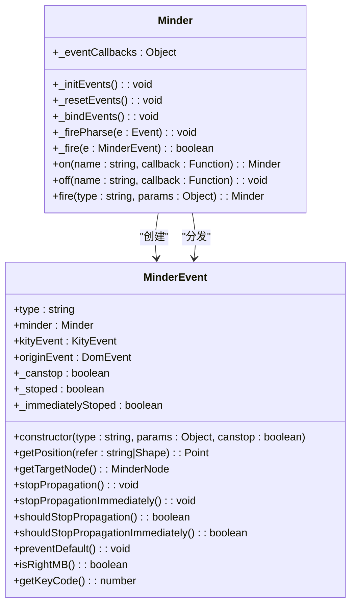

**图示来源**
- [minder.js](file://src\core\minder.js)
- [event.js](file://src\core\event.js)

**事件系统架构**
- **事件中心**：`Minder` 类作为事件中心，统一管理所有事件的注册、触发和分发。
- **事件对象**：`MinderEvent` 类封装了事件的所有信息，包括事件类型、源事件、坐标信息等。
- **事件分发**：通过 `_firePharse` 方法，将原生 DOM 事件转换为 `MinderEvent` 并进行分发。
- **状态感知**：事件系统支持状态感知，可以根据当前编辑器状态（如 `normal`、`readonly`）触发不同的事件处理器。

**事件系统组件关系**
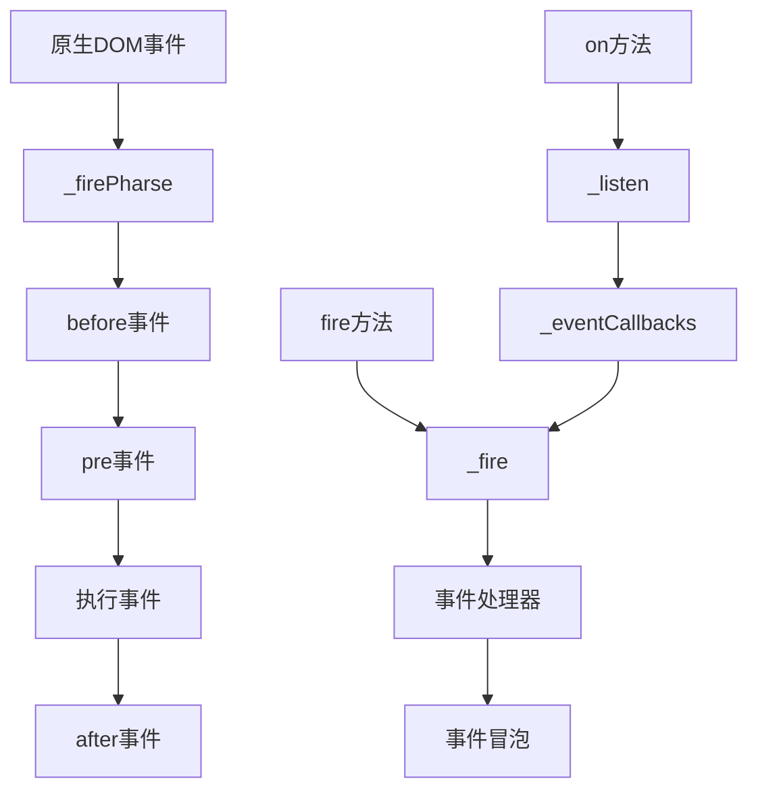

**图示来源**
- [event.js](file://src\core\event.js#L162-L182)

## 核心事件机制

KityMinder 的事件处理机制围绕 `on`（监听）和 `fire`（触发）两个核心方法构建，实现了完整的观察者模式。这种机制允许任何组件在不直接引用其他组件的情况下进行通信，从而实现了高度的松耦合。

### 事件监听（on）

`on` 方法用于注册事件监听器，其核心实现位于 `event.js` 文件中。该方法支持多种事件类型的同时注册，通过空格分隔的字符串形式传入。例如，`minder.on('click dblclick', handler)` 可以同时监听点击和双击事件。

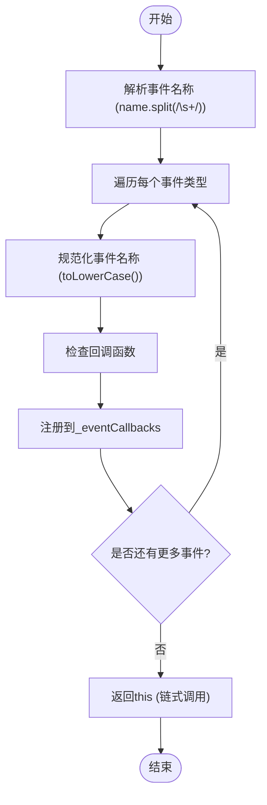

**事件监听流程**
- **名称解析**：将传入的事件名称字符串按空格分割，支持批量注册。
- **名称规范化**：将事件名称转换为小写，确保事件匹配的一致性。
- **回调注册**：将监听器函数添加到 `_eventCallbacks` 对象对应的事件队列中。
- **链式调用**：返回 `this` 对象，支持链式调用。

**事件监听代码路径**
**核心组件来源**
- [event.js](file://src\core\event.js#L232-L237)

### 事件触发（fire）

`fire` 方法用于触发指定类型的事件，是事件系统中另一个核心机制。当某个状态改变或用户交互发生时，组件可以通过 `fire` 方法通知所有监听器。

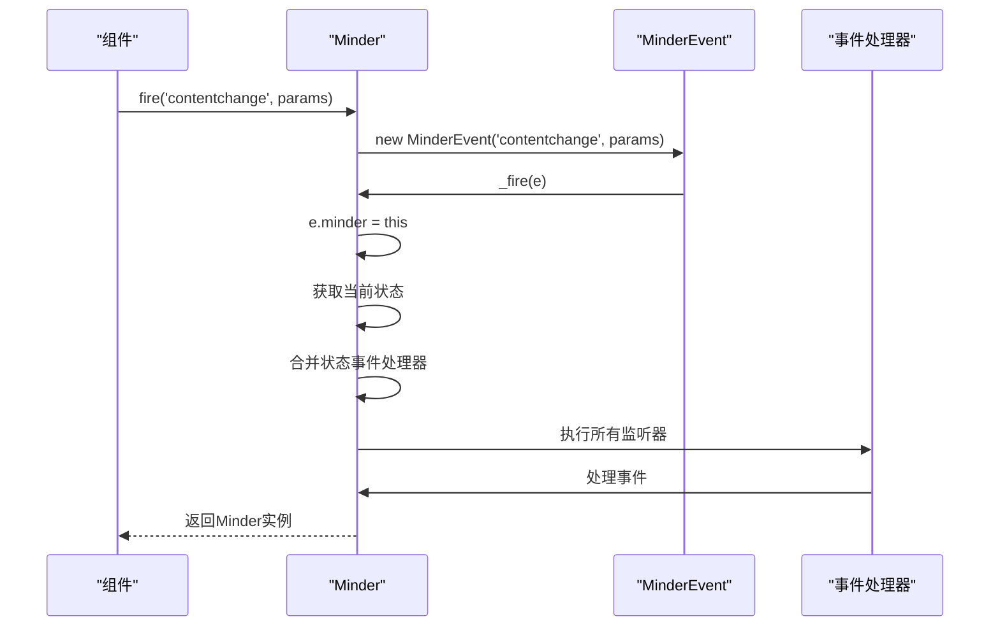

**事件触发流程**
- **事件创建**：使用 `new MinderEvent(type, params)` 创建事件对象。
- **事件分发**：调用 `_fire` 方法分发事件。
- **上下文设置**：将 `minder` 属性设置为当前实例，便于处理器访问。
- **状态处理**：根据当前编辑器状态合并相应的事件处理器。
- **处理器执行**：按顺序执行所有注册的监听器函数。

**事件触发代码路径**
**核心组件来源**
- [event.js](file://src\core\event.js#L261-L264)

### 事件冒泡与阻止

KityMinder 的事件系统支持事件冒泡机制，允许事件在处理过程中被停止传播。这通过 `stopPropagation` 和 `stopPropagationImmediately` 两个方法实现。

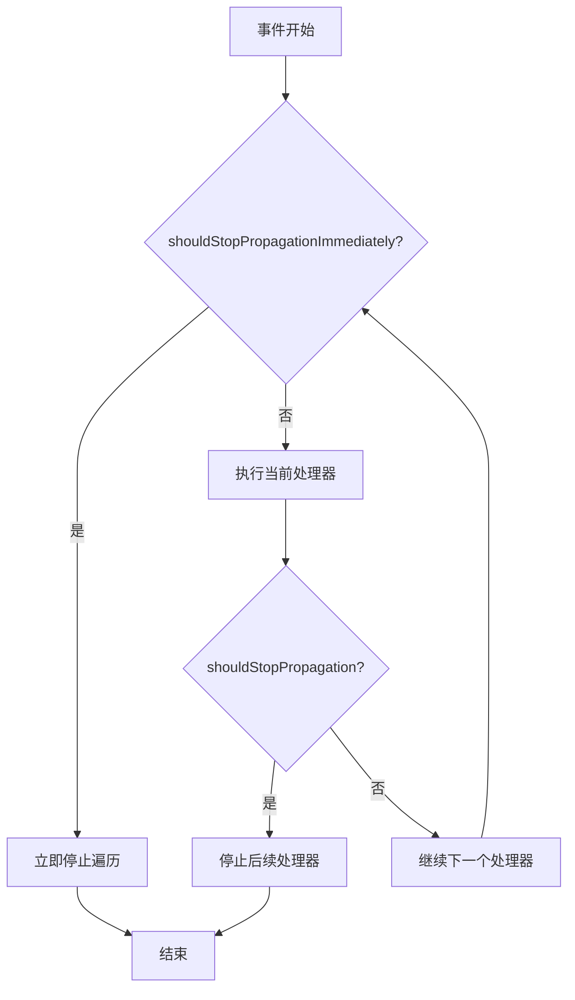

**事件冒泡控制**
- **立即停止**：`stopPropagationImmediately` 会立即中断所有后续处理器的执行。
- **常规停止**：`stopPropagation` 会阻止后续处理器执行，但当前处理器会继续完成。
- **条件检查**：`shouldStopPropagation` 和 `shouldStopPropagationImmediately` 用于检查是否需要停止传播。

**事件冒泡代码路径**
**核心组件来源**
- [event.js](file://src\core\event.js#L223-L227)

## 事件生命周期

KityMinder 的事件系统具有完整的生命周期管理，从事件的创建、分发到最终的处理，每个阶段都有明确的职责和控制机制。理解事件的生命周期对于正确使用事件系统至关重要。

### 事件创建与初始化

事件的生命周期始于 `MinderEvent` 类的构造函数。当调用 `fire` 方法时，会创建一个新的 `MinderEvent` 实例，并初始化其基本属性。

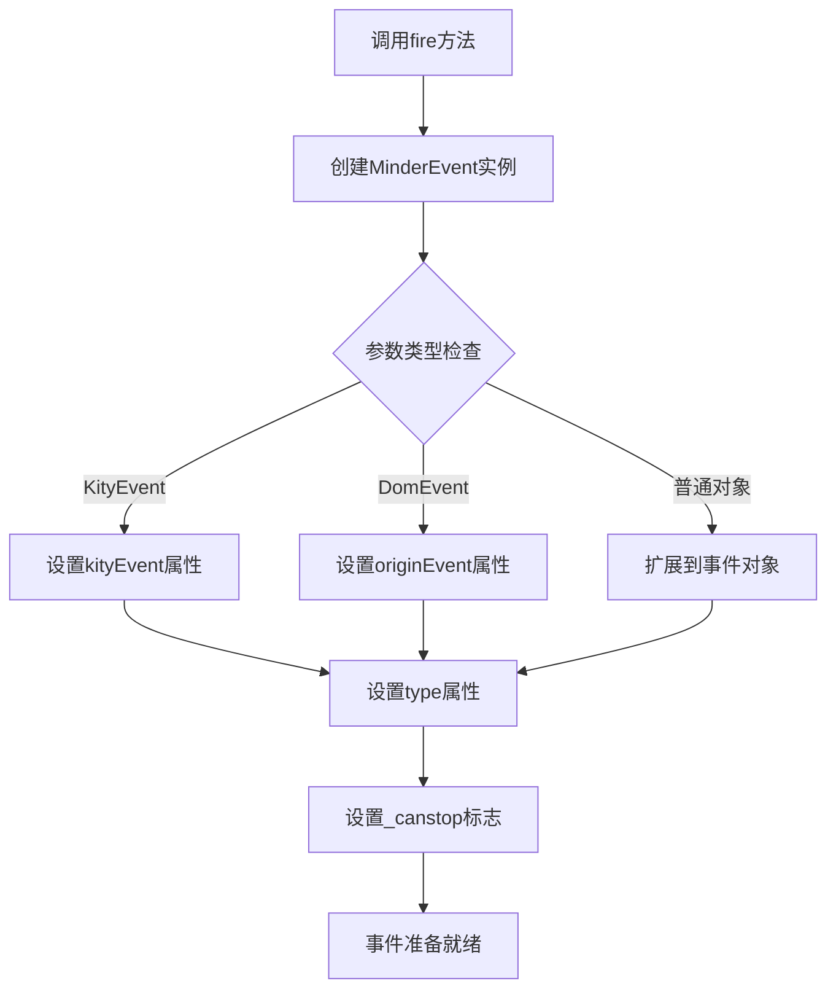

**事件创建流程**
- **参数处理**：根据传入参数的类型，设置 `kityEvent` 或 `originEvent` 属性。
- **属性扩展**：将自定义参数合并到事件对象中。
- **类型设置**：设置事件的 `type` 属性，标识事件类型。
- **冒泡控制**：根据 `canstop` 参数设置 `_canstop` 标志，决定是否允许事件冒泡。

**事件创建代码路径**
**核心组件来源**
- [event.js](file://src\core\event.js#L11-L45)

### 事件分发与处理

事件分发是生命周期中的核心阶段，由 `_fire` 方法负责。该方法会根据当前编辑器状态，合并相应的事件处理器，并按顺序执行。

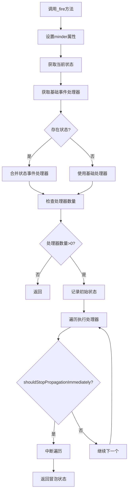

**事件分发关键特性**
- **状态感知**：支持状态前缀的事件处理器，如 `normal.click`、`readonly.click`。
- **处理器合并**：将基础事件处理器和状态特定处理器合并执行。
- **状态监控**：在执行过程中监控状态变化，确保事件处理的正确性。
- **冒泡控制**：根据处理器的调用情况决定是否阻止事件冒泡。

**事件分发代码路径**
**核心组件来源**
- [event.js](file://src\core\event.js#L199-L230)

### 事件销毁与清理

虽然事件对象本身是临时的，但事件系统的内存管理主要体现在监听器的清理上。`off` 方法提供了移除事件监听器的机制，防止内存泄漏。

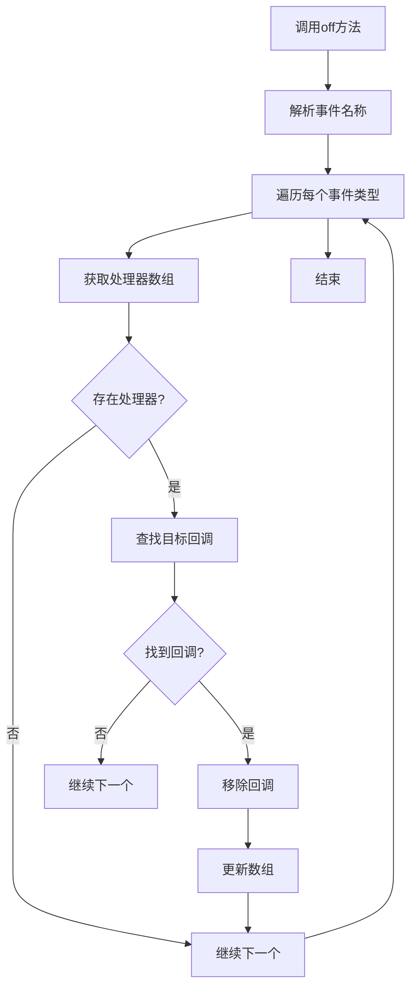

**事件清理流程**
- **名称解析**：与 `on` 方法类似，支持批量移除事件监听器。
- **回调查找**：在处理器数组中查找指定的回调函数。
- **数组更新**：使用 `splice` 方法移除找到的回调函数。
- **内存释放**：移除对回调函数的引用，允许垃圾回收。

**事件清理代码路径**
**核心组件来源**
- [event.js](file://src\core\event.js#L240-L259)

## 重要内置事件

KityMinder 定义了一系列重要的内置事件，这些事件构成了系统功能的基础。理解这些事件的用途和触发时机对于开发和调试至关重要。

### 内容变更事件（contentchange）

`contentchange` 事件是 KityMinder 中最重要的事件之一，表示脑图内容发生了变化。该事件通常在执行修改内容的命令后触发。

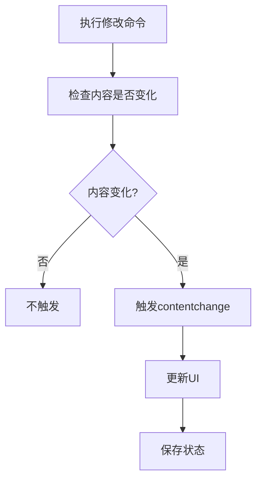

**contentchange 事件特性**
- **触发时机**：在顶级命令执行后，如果内容发生变化则触发。
- **使用场景**：自动保存、状态同步、UI 更新等。
- **相关代码**：在 `command.js` 中，当命令执行导致内容变化时会触发此事件。

**contentchange 事件代码路径**
**核心组件来源**
- [data.js](file://src\core\data.js#L301-L303)
- [command.js](file://src\core\command.js#L150-L151)

### 选择变更事件（selectionchange）

`selectionchange` 事件表示用户选择的节点发生了变化。该事件在选择状态改变时触发，是实现选择相关功能的基础。

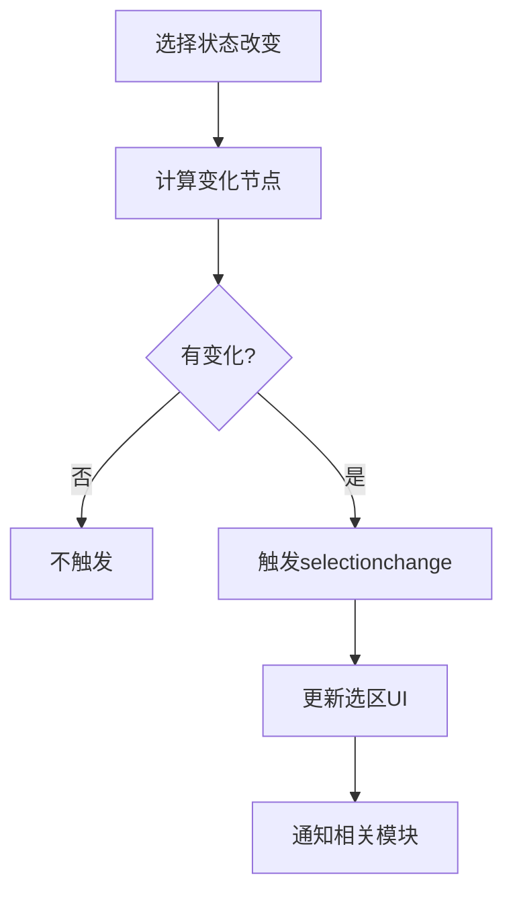

**selectionchange 事件特性**
- **触发时机**：在顶级命令执行后，如果选择状态发生变化则触发。
- **事件参数**：包含 `currentSelection`、`additionNodes`、`removalNodes` 等信息。
- **使用场景**：工具栏更新、快捷键启用/禁用、上下文菜单等。

**selectionchange 事件代码路径**
**核心组件来源**
- [select.js](file://src\core\select.js#L35-L36)
- [Architecture.md](file://doc\Architecture.md#L414-L418)

### 布局事件（layout）

`layout` 事件表示脑图的布局发生了变化。该事件在布局计算完成后触发，是实现布局相关功能的关键。

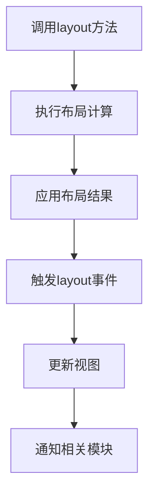

**layout 事件特性**
- **触发时机**：在 `layout()` 方法执行完成后触发。
- **使用场景**：视图调整、动画控制、布局后处理等。
- **相关事件**：还包含 `layoutallfinish`、`layoutapply`、`layoutfinish` 等子事件。

**layout 事件代码路径**
**核心组件来源**
- [layout.js](file://src\core\layout.js#L435-L436)
- [layout.js](file://src\core\layout.js#L430-L432)

### 状态变更事件（statuschange）

`statuschange` 事件表示编辑器的状态发生了变化。KityMinder 支持多种状态，如 `normal`、`readonly` 等。

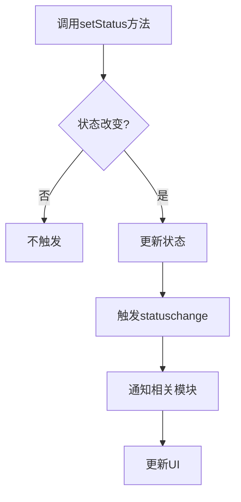

**statuschange 事件特性**
- **触发时机**：在 `setStatus()` 方法被调用且状态实际改变时触发。
- **事件参数**：包含 `lastStatus` 和 `currentStatus`，便于比较状态变化。
- **使用场景**：UI 状态切换、功能启用/禁用、权限控制等。

**statuschange 事件代码路径**
**核心组件来源**
- [status.js](file://src\core\status.js#L34-L37)

### 交互事件（interactchange）

`interactchange` 事件表示用户与脑图发生了交互。该事件具有防抖（debounce）特性，避免频繁触发。

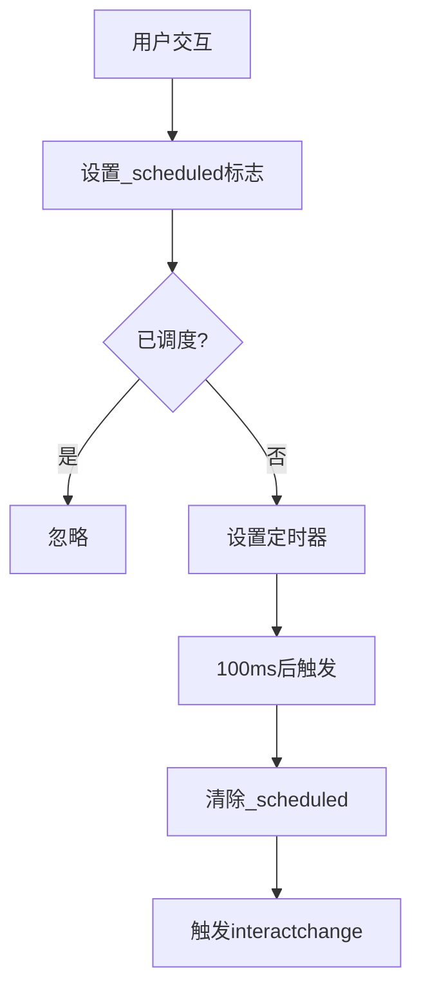

**interactchange 事件特性**
- **触发时机**：在鼠标、键盘、触摸操作后发生，并且会进行防抖处理。
- **防抖机制**：使用 `setTimeout` 实现，确保短时间内只触发一次。
- **使用场景**：性能敏感的操作、状态同步、自动保存等。

**interactchange 事件代码路径**
**核心组件来源**
- [event.js](file://src\core\event.js#L184-L192)
- [Architecture.md](file://doc\Architecture.md#L428-L429)

## 事件性能与内存管理

KityMinder 的事件系统在设计时充分考虑了性能和内存管理，避免了常见的性能瓶颈和内存泄漏问题。

### 事件处理器管理

事件系统通过 `_eventCallbacks` 对象高效管理所有事件处理器。该对象以事件类型为键，以处理器数组为值，实现了 O(1) 的查找复杂度。

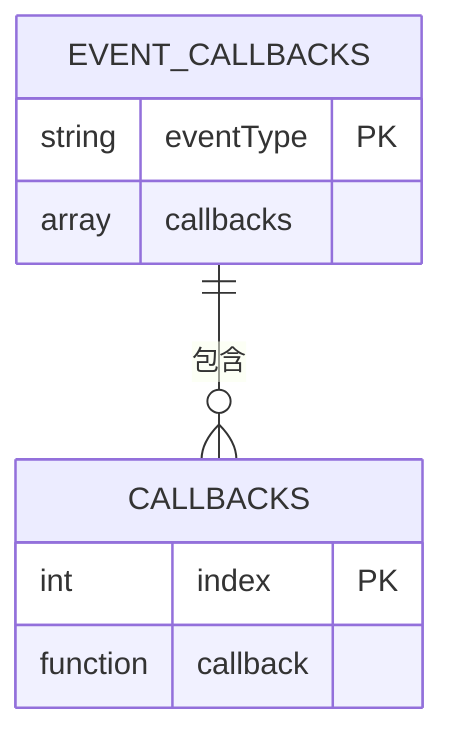

**处理器管理策略**
- **哈希查找**：使用对象属性作为哈希表，实现快速查找。
- **数组存储**：同一事件类型的处理器存储在数组中，按注册顺序执行。
- **状态合并**：支持状态前缀的处理器，通过数组合并实现。

**处理器管理代码路径**
**核心组件来源**
- [event.js](file://src\core\event.js#L209-L213)

### 内存泄漏预防

事件系统通过 `off` 方法和 `destroy` 方法有效防止内存泄漏。当组件被销毁时，必须及时清理所有事件监听器。

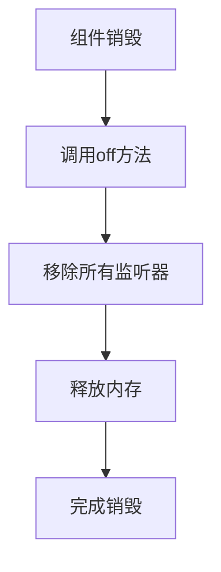

**内存管理最佳实践**
- **及时清理**：在组件销毁时，使用 `off` 方法移除所有事件监听器。
- **避免闭包**：谨慎使用闭包，防止意外的引用保持。
- **使用弱引用**：在可能的情况下，考虑使用弱引用机制。

**内存管理代码路径**
**核心组件来源**
- [module.js](file://src\core\module.js#L131-L137)
- [event.js](file://src\core\event.js#L240-L259)

## 事件调试技巧

有效的事件调试技巧可以帮助开发者快速定位和解决事件处理中的问题。

### 事件监听器检查

可以通过直接访问 `_eventCallbacks` 对象来检查当前注册的所有事件监听器。

```javascript
// 检查所有事件监听器
console.log(minder._eventCallbacks);

// 检查特定事件的监听器
console.log(minder._eventCallbacks['contentchange']);
```

### 事件触发跟踪

使用浏览器的事件监听器断点功能，可以跟踪特定事件的触发和处理过程。

```javascript
// 临时添加调试监听器
minder.on('contentchange', function(e) {
    console.log('Content changed:', e);
    console.trace(); // 输出调用栈
});
```

### 状态感知调试

由于事件系统支持状态感知，调试时需要特别注意当前编辑器状态。

```javascript
// 检查当前状态
console.log('Current status:', minder.getStatus());

// 调试状态相关事件
minder.on('normal.contentchange', function(e) {
    console.log('Normal mode content change');
});

minder.on('readonly.contentchange', function(e) {
    console.log('Readonly mode content change');
});
```

## 事件使用最佳实践

遵循以下最佳实践可以确保事件系统的高效、可靠使用。

### 事件命名规范

- **使用小写**：所有事件名称应使用小写字母。
- **使用连字符**：复合事件名称使用连字符分隔，如 `content-change`。
- **避免冲突**：避免使用与 DOM 事件同名的自定义事件。

### 监听器管理

- **及时清理**：在组件销毁时，务必使用 `off` 方法移除所有事件监听器。
- **避免重复**：避免对同一事件注册相同的监听器多次。
- **使用命名函数**：使用命名函数而非匿名函数，便于调试和移除。

### 异步事件处理

- **避免阻塞**：长时间运行的操作应使用异步处理，避免阻塞事件循环。
- **使用防抖**：对于频繁触发的事件，使用防抖机制减少处理频率。
- **错误处理**：在事件处理器中添加适当的错误处理机制。

## 总结

KityMinder 的事件处理机制是一个精心设计的观察者模式实现，为整个应用提供了灵活、解耦的通信机制。通过 `on` 和 `fire` 两个核心方法，实现了组件间的松耦合通信。事件系统具有完整的生命周期管理，支持事件冒泡和阻止，默认行为等特性。重要的内置事件如 `contentchange`、`selectionchange`、`layout` 等构成了系统功能的基础。事件系统在性能和内存管理方面也做了充分考虑，避免了常见的性能瓶颈和内存泄漏问题。通过遵循最佳实践，开发者可以高效、可靠地使用事件系统，构建出功能强大、性能优良的脑图应用。