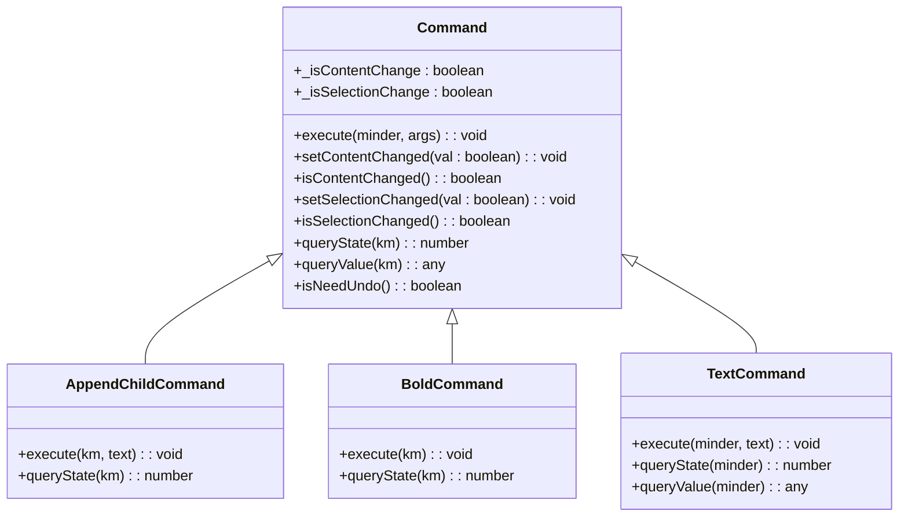
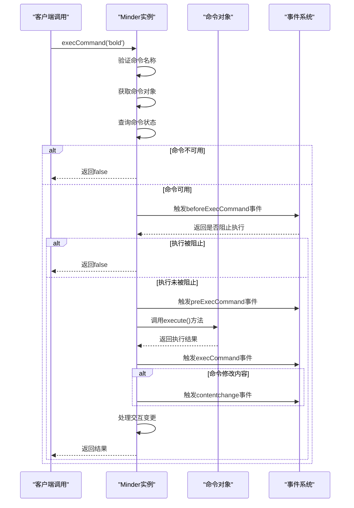
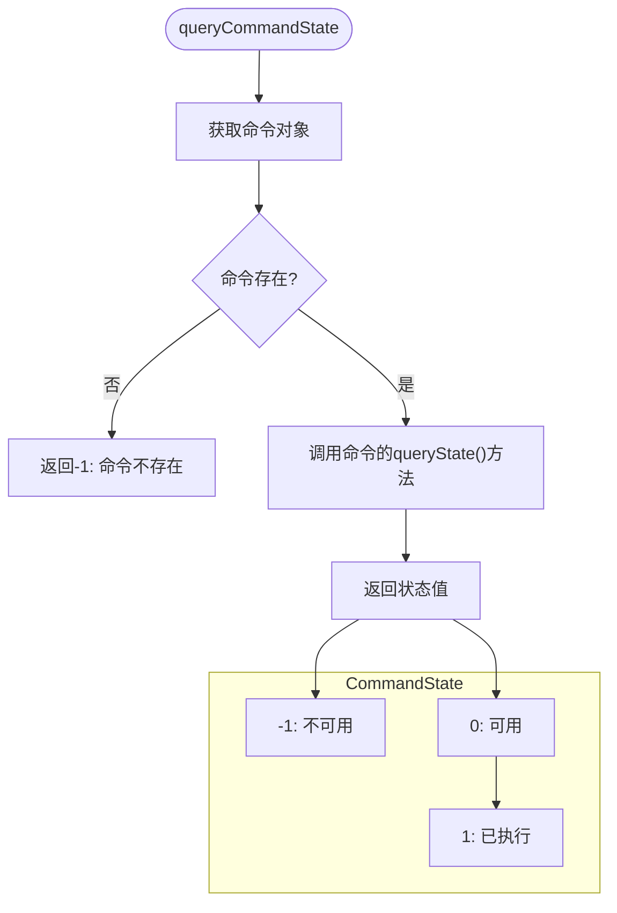
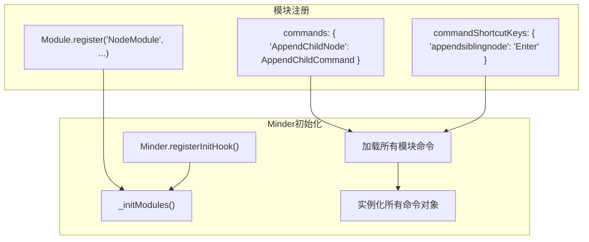
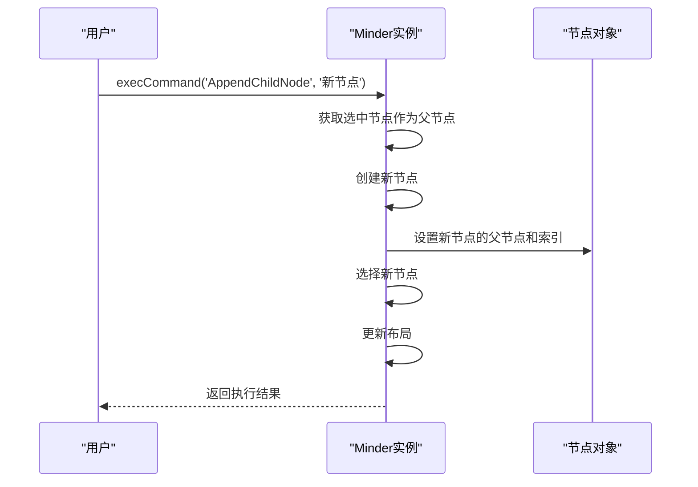
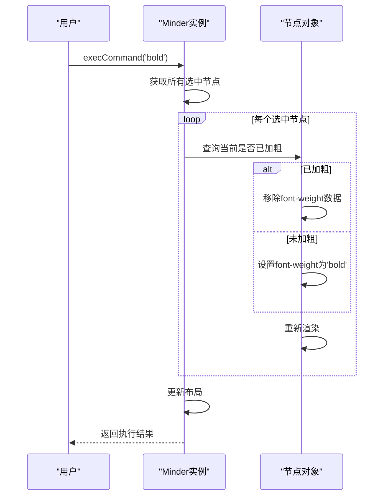
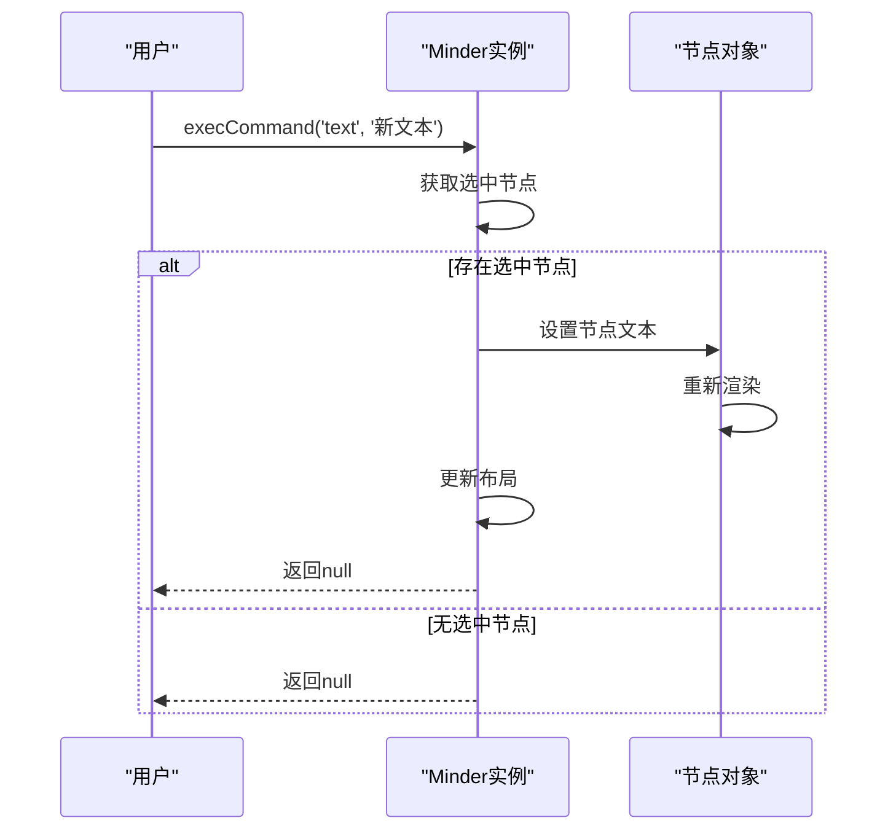

# 命令执行

<cite>
**本文档引用的文件**   
- [command.js](file://src/core/command.js)
- [minder.js](file://src/core/minder.js)
- [module.js](file://src/core/module.js)
- [event.js](file://src/core/event.js)
- [node.js](file://src/module/node.js)
- [text.js](file://src/module/text.js)
- [basestyle.js](file://src/module/basestyle.js)
- [font.js](file://src/module/font.js)
- [Architecture.md](file://doc/Architecture.md)
</cite>

## 目录
1. [命令系统概述](#命令系统概述)
2. [Command类结构与设计模式](#command类结构与设计模式)
3. [execCommand()方法工作原理](#execcommand方法工作原理)
4. [queryCommandState()状态查询机制](#querycommandstate状态查询机制)
5. [命令注册与模块化管理](#命令注册与模块化管理)
6. [具体命令实现示例](#具体命令实现示例)
7. [命令堆栈与撤销重做机制](#命令堆栈与撤销重做机制)
8. [自定义命令开发指南](#自定义命令开发指南)
9. [常见问题与调试技巧](#常见问题与调试技巧)
10. [性能优化建议](#性能优化建议)

## 命令系统概述

KityMinder的命令执行系统采用命令模式（Command Pattern）设计，将用户操作封装为可执行、可查询、可撤销的命令对象。该系统通过Minder类的execCommand()和queryCommandState()等方法提供统一的接口，实现了思维导图操作的标准化和可扩展性。

命令系统的核心目标是将用户界面操作与底层数据修改解耦，使得各种编辑功能（如添加节点、修改样式等）能够以一致的方式被调用、查询状态和管理执行历史。这种设计不仅提高了代码的可维护性，还为实现撤销/重做功能提供了基础支持。

**Section sources**
- [command.js](file://src/core/command.js#L1-L169)
- [Architecture.md](file://doc/Architecture.md#L140-L196)

## Command类结构与设计模式

Command类是命令模式的核心实现，定义了所有命令的基本结构和行为规范。每个具体的命令都继承自Command基类，必须实现execute()方法来定义具体的执行逻辑。



**Diagram sources**
- [command.js](file://src/core/command.js#L15-L52)
- [node.js](file://src/module/node.js#L19-L41)
- [basestyle.js](file://src/module/basestyle.js#L45-L71)
- [text.js](file://src/module/text.js#L245-L262)

**Section sources**
- [command.js](file://src/core/command.js#L15-L52)
- [Architecture.md](file://doc/Architecture.md#L145-L168)

## execCommand()方法工作原理

execCommand()方法是命令执行系统的入口点，负责协调命令的查找、状态验证、执行和事件通知全过程。该方法采用防御性编程策略，确保只有在命令存在且可用的情况下才会执行。



**Diagram sources**
- [command.js](file://src/core/command.js#L118-L165)
- [event.js](file://src/core/event.js#L10-L127)

**Section sources**
- [command.js](file://src/core/command.js#L118-L165)

## queryCommandState()状态查询机制

queryCommandState()方法用于查询指定命令的当前状态，返回值表示命令的可用性。该机制通过命令对象的queryState()方法实现，允许每个命令根据当前编辑环境动态决定其状态。



**Diagram sources**
- [command.js](file://src/core/command.js#L87-L89)
- [node.js](file://src/module/node.js#L37-L40)
- [basestyle.js](file://src/module/basestyle.js#L62-L71)

**Section sources**
- [command.js](file://src/core/command.js#L73-L89)
- [Architecture.md](file://doc/Architecture.md#L177-L184)

## 命令注册与模块化管理

命令系统采用模块化设计，通过Module.register()方法将命令注册到Minder实例中。每个模块可以注册多个命令，并通过_initModules()方法在Minder初始化时统一加载。



**Diagram sources**
- [module.js](file://src/core/module.js#L9-L117)
- [node.js](file://src/module/node.js#L133-L149)

**Section sources**
- [module.js](file://src/core/module.js#L1-L151)
- [node.js](file://src/module/node.js#L133-L150)

## 具体命令实现示例

### 节点操作命令

节点操作命令如'AppendChildNode'、'AppendSiblingNode'等，用于管理思维导图的结构。这些命令通过Minder的节点创建和选择机制实现。



**Diagram sources**
- [node.js](file://src/module/node.js#L21-L36)

### 样式操作命令

样式操作命令如'bold'、'forecolor'等，用于修改节点的视觉表现。这些命令通过设置节点的数据属性来实现样式变更。



**Diagram sources**
- [basestyle.js](file://src/module/basestyle.js#L48-L61)
- [font.js](file://src/module/font.js#L49-L54)

### 文本操作命令

文本操作命令如'text'，用于修改节点的文本内容。该命令直接操作节点的文本属性，并触发相应的渲染更新。



**Diagram sources**
- [text.js](file://src/module/text.js#L247-L253)

**Section sources**
- [node.js](file://src/module/node.js#L19-L70)
- [basestyle.js](file://src/module/basestyle.js#L45-L71)
- [font.js](file://src/module/font.js#L47-L157)
- [text.js](file://src/module/text.js#L245-L262)

## 命令堆栈与撤销重做机制

虽然当前代码中未直接显示撤销重做实现，但命令系统的设计为该功能提供了基础支持。通过isNeedUndo()方法和命令执行事件，可以构建命令历史记录机制。

```mermaid
flowchart LR
A[命令执行] --> B{isNeedUndo()}
B --> |true| C[记录到命令堆栈]
B --> |false| D[不记录]
C --> E[支持撤销操作]
E --> F[执行revert()方法]
F --> G[从堆栈移除]
G --> H[支持重做操作]
```

**Diagram sources**
- [command.js](file://src/core/command.js#L49-L51)

**Section sources**
- [command.js](file://src/core/command.js#L49-L51)
- [Architecture.md](file://doc/Architecture.md#L174-L175)

## 自定义命令开发指南

开发自定义命令需要遵循特定的结构和规范。首先定义命令类，继承自Command基类，然后在模块中注册该命令。

```mermaid
flowchart TD
A[创建命令类] --> B[继承Command基类]
B --> C[实现execute()方法]
C --> D[实现queryState()方法]
D --> E[可选: 实现queryValue()]
E --> F[可选: 设置内容变更标志]
F --> G[在模块中注册命令]
G --> H[通过execCommand()调用]
```

**Section sources**
- [Architecture.md](file://doc/Architecture.md#L150-L168)

## 常见问题与调试技巧

### 命令执行失败

命令执行失败通常由以下原因导致：
- 命令名称错误或不存在
- 当前状态下命令不可用（queryState()返回-1）
- 缺少必要的参数
- 执行过程中抛出异常

调试时应首先检查命令名称的正确性，然后验证当前编辑状态是否满足命令执行条件。

### 命令状态显示异常

命令状态显示异常可能源于queryState()方法的逻辑错误。应确保该方法正确反映了命令的可用性条件，如选中节点的存在与否、节点类型限制等。

**Section sources**
- [command.js](file://src/core/command.js#L133-L135)
- [node.js](file://src/module/node.js#L37-L40)

## 性能优化建议

1. **避免重复查询**：在复杂的状态查询逻辑中，缓存查询结果以减少重复计算
2. **批量操作**：对于涉及多个节点的操作，尽量在单个命令执行中完成，减少布局更新次数
3. **事件节流**：对于频繁触发的交互变更，使用setTimeout进行节流处理
4. **延迟执行**：对于非关键操作，考虑使用异步方式执行，避免阻塞主线程

**Section sources**
- [event.js](file://src/core/event.js#L187-L192)
- [node.js](file://src/module/node.js#L35-L36)