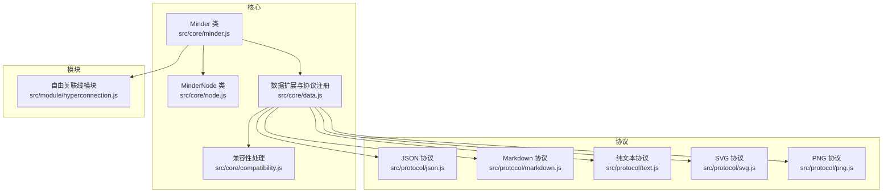
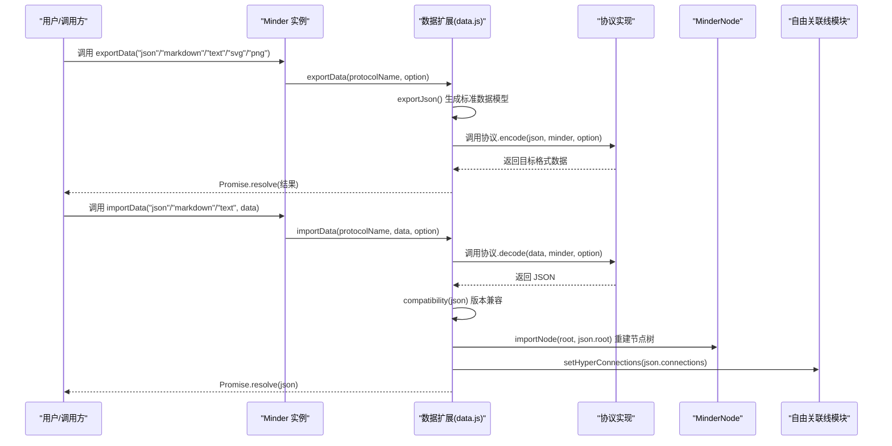
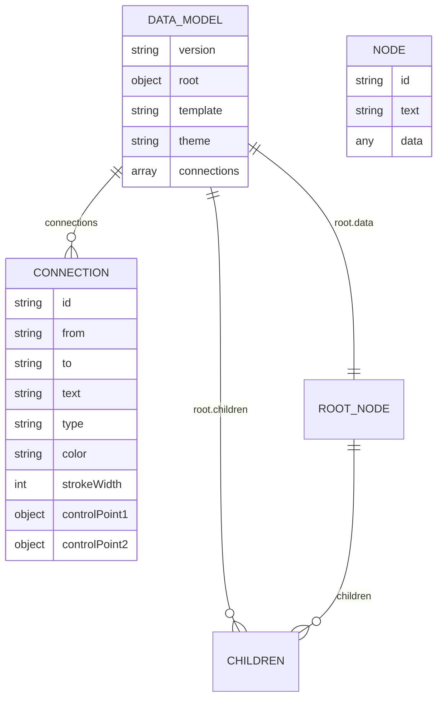
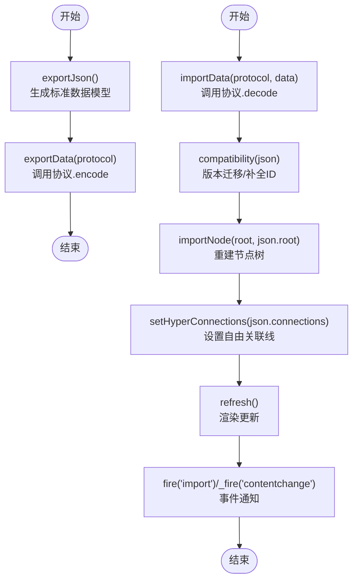
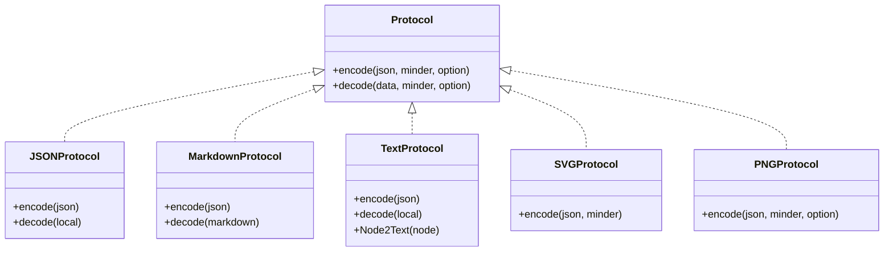
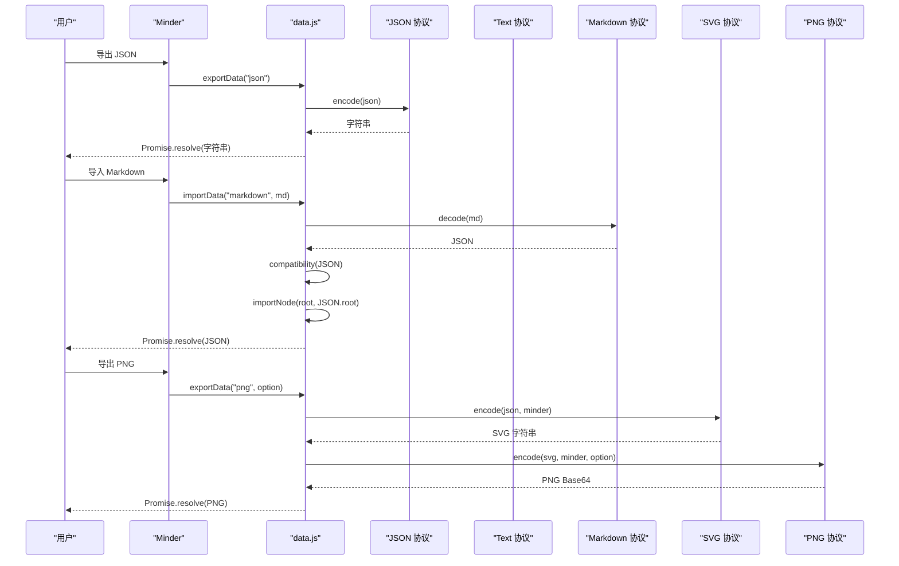
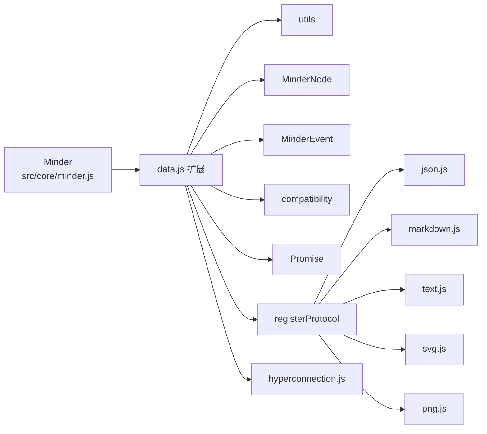

# 数据操作

<cite>
**本文引用的文件列表**
- [src/core/minder.js](file://src/core/minder.js)
- [src/core/data.js](file://src/core/data.js)
- [src/core/node.js](file://src/core/node.js)
- [src/core/compatibility.js](file://src/core/compatibility.js)
- [src/protocol/json.js](file://src/protocol/json.js)
- [src/protocol/markdown.js](file://src/protocol/markdown.js)
- [src/protocol/text.js](file://src/protocol/text.js)
- [src/protocol/png.js](file://src/protocol/png.js)
- [src/protocol/svg.js](file://src/protocol/svg.js)
- [src/module/hyperconnection.js](file://src/module/hyperconnection.js)
- [doc/Architecture.md](file://doc/Architecture.md)
- [dev.html](file://dev.html)
- [README.md](file://README.md)
</cite>

## 目录
1. [简介](#简介)
2. [项目结构](#项目结构)
3. [核心组件](#核心组件)
4. [架构总览](#架构总览)
5. [详细组件分析](#详细组件分析)
6. [依赖关系分析](#依赖关系分析)
7. [性能考量](#性能考量)
8. [故障排查指南](#故障排查指南)
9. [结论](#结论)
10. [附录](#附录)

## 简介
本章节聚焦于 KityMinder Core 的数据操作能力，系统讲解 Minder 类的导出与导入机制，阐明思维导图数据模型的结构（版本信息、根节点、模板/主题、自由关联线等），并深入解析协议系统（Protocol）如何与 Minder 协作完成多格式数据转换。文档还提供 JSON、Markdown、纯文本、SVG、PNG 等格式的序列化与反序列化流程示例，说明数据验证与错误处理策略，并给出大数据量处理与格式兼容性的最佳实践建议。

## 项目结构
围绕“数据操作”的核心目录与文件如下：
- 核心类与数据模型：src/core/minder.js、src/core/node.js、src/core/data.js、src/core/compatibility.js
- 协议实现：src/protocol/json.js、src/protocol/markdown.js、src/protocol/text.js、src/protocol/svg.js、src/protocol/png.js
- 自由关联线：src/module/hyperconnection.js
- 架构与数据模型说明：doc/Architecture.md
- 示例页面：dev.html
- 项目说明：README.md

图表来源
- [src/core/minder.js](file://src/core/minder.js#L1-L41)
- [src/core/data.js](file://src/core/data.js#L1-L416)
- [src/core/node.js](file://src/core/node.js#L1-L407)
- [src/core/compatibility.js](file://src/core/compatibility.js#L1-L92)
- [src/protocol/json.js](file://src/protocol/json.js#L1-L18)
- [src/protocol/markdown.js](file://src/protocol/markdown.js#L1-L158)
- [src/protocol/text.js](file://src/protocol/text.js#L1-L238)
- [src/protocol/svg.js](file://src/protocol/svg.js#L1-L244)
- [src/protocol/png.js](file://src/protocol/png.js#L1-L289)
- [src/module/hyperconnection.js](file://src/module/hyperconnection.js#L1-L755)

章节来源
- [src/core/minder.js](file://src/core/minder.js#L1-L41)
- [src/core/data.js](file://src/core/data.js#L1-L416)
- [src/core/node.js](file://src/core/node.js#L1-L407)
- [src/core/compatibility.js](file://src/core/compatibility.js#L1-L92)
- [src/protocol/json.js](file://src/protocol/json.js#L1-L18)
- [src/protocol/markdown.js](file://src/protocol/markdown.js#L1-L158)
- [src/protocol/text.js](file://src/protocol/text.js#L1-L238)
- [src/protocol/svg.js](file://src/protocol/svg.js#L1-L244)
- [src/protocol/png.js](file://src/protocol/png.js#L1-L289)
- [src/module/hyperconnection.js](file://src/module/hyperconnection.js#L1-L755)
- [doc/Architecture.md](file://doc/Architecture.md#L598-L682)
- [dev.html](file://dev.html#L1-L200)
- [README.md](file://README.md#L1-L89)

## 核心组件
- Minder 类：对外暴露的唯一全局入口，负责初始化钩子与版本号管理。
- 数据扩展（data.js）：在 Minder 上扩展导入导出能力，包括 exportJson/importJson、exportData/importData/decodeData、setup 自动导入、以及协议注册与调用。
- MinderNode 类：节点数据结构与树操作（创建、插入、删除、遍历、克隆等）。
- 兼容性处理（compatibility.js）：对历史版本数据进行迁移与规范化。
- 协议系统：以插件形式注册多种数据协议（JSON、Markdown、纯文本、SVG、PNG），统一 encode/decode 接口。
- 自由关联线（hyperconnection.js）：支持任意节点间的自由连接，导入导出时与数据模型合并。

章节来源
- [src/core/minder.js](file://src/core/minder.js#L1-L41)
- [src/core/data.js](file://src/core/data.js#L1-L416)
- [src/core/node.js](file://src/core/node.js#L1-L407)
- [src/core/compatibility.js](file://src/core/compatibility.js#L1-L92)
- [src/protocol/json.js](file://src/protocol/json.js#L1-L18)
- [src/protocol/markdown.js](file://src/protocol/markdown.js#L1-L158)
- [src/protocol/text.js](file://src/protocol/text.js#L1-L238)
- [src/protocol/svg.js](file://src/protocol/svg.js#L1-L244)
- [src/protocol/png.js](file://src/protocol/png.js#L1-L289)
- [src/module/hyperconnection.js](file://src/module/hyperconnection.js#L1-L755)

## 架构总览
Minder 的数据操作遵循“协议驱动 + 核心扩展”的设计：
- Minder 通过 data.js 扩展出 exportJson/importJson/importData/decodeData/exportData 等方法。
- 导出路径：exportJson 生成标准数据模型；exportData 基于已生成的 JSON，按指定协议调用对应协议的 encode。
- 导入路径：importData 先调用协议 decode 解析为 JSON，再调用 importJson 完成节点重建与渲染；decodeData 仅解析为 JSON，不覆盖当前实例。
- 兼容性：importJson 在导入前对 JSON 进行版本兼容处理，确保 ID 唯一、模板/主题恢复、自由关联线校验与设置。
- 协议注册：各协议通过 data.registerProtocol 注册，Minder 在运行时动态查找并调用。

图表来源
- [src/core/data.js](file://src/core/data.js#L310-L415)
- [src/protocol/json.js](file://src/protocol/json.js#L1-L18)
- [src/protocol/markdown.js](file://src/protocol/markdown.js#L144-L158)
- [src/protocol/text.js](file://src/protocol/text.js#L196-L238)
- [src/protocol/svg.js](file://src/protocol/svg.js#L213-L244)
- [src/protocol/png.js](file://src/protocol/png.js#L281-L289)
- [src/core/compatibility.js](file://src/core/compatibility.js#L1-L92)
- [src/core/node.js](file://src/core/node.js#L316-L407)
- [src/module/hyperconnection.js](file://src/module/hyperconnection.js#L701-L755)

## 详细组件分析

### 数据模型与版本信息
- 数据模型结构要点
  - 版本字段：version，用于标识数据格式版本，便于兼容性处理。
  - 根节点：root，包含 data（节点数据）与 children（子节点数组）。
  - 模板与主题：template、theme，分别表示模板名称与主题名称。
  - 自由关联线：connections，数组，每项包含 from、to、text、type、color、strokeWidth、controlPoint1、controlPoint2 等字段。
- 版本演进与兼容
  - compatibility.js 会根据 version 字段进行多阶段升级，确保旧数据能被正确迁移到新格式。
  - 导出时强制使用 version: "2"，导入时若缺少 ID 会自动补全，重复 ID 会重新生成，无效关联线会被过滤。
- 自由关联线
  - hyperconnection.js 提供 Add/Remove 命令，setHyperConnections/getHyperConnections 与渲染更新逻辑，配合 data.js 的导入导出完成完整闭环。

图表来源
- [doc/Architecture.md](file://doc/Architecture.md#L598-L682)
- [src/core/compatibility.js](file://src/core/compatibility.js#L1-L92)
- [src/core/data.js](file://src/core/data.js#L56-L107)
- [src/module/hyperconnection.js](file://src/module/hyperconnection.js#L1-L200)

章节来源
- [doc/Architecture.md](file://doc/Architecture.md#L598-L682)
- [src/core/compatibility.js](file://src/core/compatibility.js#L1-L92)
- [src/core/data.js](file://src/core/data.js#L56-L107)
- [src/module/hyperconnection.js](file://src/module/hyperconnection.js#L1-L200)

### Minder 类与数据扩展（data.js）
- 导出能力
  - exportJson：递归导出整棵树，确保每个节点拥有唯一 ID，补充 version、template、theme，以及 connections。
  - exportData：基于 exportJson 生成的标准 JSON，调用指定协议的 encode 输出目标格式。
- 导入能力
  - importData：调用协议 decode 得到 JSON，执行 compatibility，确保 ID 唯一与模板/主题恢复，重建节点树，设置自由关联线，最后 fire 事件并刷新。
  - decodeData：仅解析为 JSON，不覆盖当前实例。
  - setup：从 DOM 中读取 minder-data-type 与文本内容，自动渲染并导入。
- 节点与树操作
  - importNode/exportNode：递归导入/导出单个节点树片段。
  - Text2Children：将纯文本大纲批量转换为节点树（按缩进层级）。

图表来源
- [src/core/data.js](file://src/core/data.js#L56-L107)
- [src/core/data.js](file://src/core/data.js#L181-L223)
- [src/core/data.js](file://src/core/data.js#L225-L308)
- [src/core/data.js](file://src/core/data.js#L310-L415)

章节来源
- [src/core/data.js](file://src/core/data.js#L34-L47)
- [src/core/data.js](file://src/core/data.js#L56-L107)
- [src/core/data.js](file://src/core/data.js#L181-L223)
- [src/core/data.js](file://src/core/data.js#L225-L308)
- [src/core/data.js](file://src/core/data.js#L310-L415)

### 协议系统与实现差异
- 协议注册与调用
  - data.registerProtocol(name, protocol)：将协议注册到全局表，Minder 在运行时通过名称查找并调用 encode/decode。
  - Minder.exportData/importData/decodeData 在调用前均会检查协议是否存在且具备对应方法，否则拒绝并返回错误。
- JSON 协议
  - encode：将 JSON 对象 stringify。
  - decode：将字符串 parse 为 JSON。
- Markdown 协议
  - encode：将树结构转换为 Markdown 标题层级与备注块。
  - decode：解析 Markdown 标题层级，构建树结构，处理备注块与代码块。
- 纯文本协议
  - encode：按制表符缩进输出节点文本，处理换行转义。
  - decode：按缩进层级解析，构建父子关系。
- SVG 协议
  - encode：获取渲染容器边界，生成 SVG 字符串，清理 transform 并修正坐标。
- PNG 协议
  - encode：先导出 SVG，再绘制到 Canvas，按需加载节点图片，最终生成 PNG Base64。对跨域图片做降级处理（仍导出但不含图片）。

图表来源
- [src/protocol/json.js](file://src/protocol/json.js#L1-L18)
- [src/protocol/markdown.js](file://src/protocol/markdown.js#L144-L158)
- [src/protocol/text.js](file://src/protocol/text.js#L196-L238)
- [src/protocol/svg.js](file://src/protocol/svg.js#L213-L244)
- [src/protocol/png.js](file://src/protocol/png.js#L281-L289)

章节来源
- [src/protocol/json.js](file://src/protocol/json.js#L1-L18)
- [src/protocol/markdown.js](file://src/protocol/markdown.js#L1-L158)
- [src/protocol/text.js](file://src/protocol/text.js#L1-L238)
- [src/protocol/svg.js](file://src/protocol/svg.js#L1-L244)
- [src/protocol/png.js](file://src/protocol/png.js#L1-L289)

### 数据导入导出流程详解
- JSON 导出/导入
  - 导出：exportJson 生成包含 version、root、template、theme、connections 的对象，随后 exportData 调用 JSON 协议 encode 输出字符串。
  - 导入：importData 调用 JSON 协议 decode 得到 JSON，compatibility 迁移版本，importNode 重建树，setHyperConnections 设置关联线。
- Markdown 导出/导入
  - 导出：encode 将树转换为标题层级与备注块，逐行输出。
  - 导入：decode 解析标题层级，构建父子关系，处理备注块与代码块，最终得到 JSON。
- 纯文本导出/导入
  - 导出：encode 以制表符缩进输出节点文本，处理换行转义。
  - 导入：decode 依据缩进层级解析，构建父子关系，异常时抛出“无效本地格式”错误。
- SVG/PNG 导出
  - SVG：获取渲染容器边界，生成 SVG 字符串，清理 transform，修正坐标与字体，处理特殊字符。
  - PNG：先导出 SVG，再绘制到 Canvas，按需加载节点图片，生成 PNG Base64；跨域图片降级处理。

图表来源
- [src/core/data.js](file://src/core/data.js#L310-L415)
- [src/protocol/json.js](file://src/protocol/json.js#L1-L18)
- [src/protocol/markdown.js](file://src/protocol/markdown.js#L1-L158)
- [src/protocol/text.js](file://src/protocol/text.js#L1-L238)
- [src/protocol/svg.js](file://src/protocol/svg.js#L213-L244)
- [src/protocol/png.js](file://src/protocol/png.js#L184-L280)

章节来源
- [src/core/data.js](file://src/core/data.js#L310-L415)
- [src/protocol/json.js](file://src/protocol/json.js#L1-L18)
- [src/protocol/markdown.js](file://src/protocol/markdown.js#L1-L158)
- [src/protocol/text.js](file://src/protocol/text.js#L1-L238)
- [src/protocol/svg.js](file://src/protocol/svg.js#L1-L244)
- [src/protocol/png.js](file://src/protocol/png.js#L1-L289)

### 数据验证与错误处理
- 导入前验证
  - 协议有效性：importData/decodeData 在调用前检查协议是否存在且具备 decode 方法，否则 reject 错误。
  - JSON 有效性：importData/decodeData 在调用协议 decode 后得到 JSON，再进入 compatibility。
- ID 唯一性与补全
  - importJson 在导入前扫描整棵树，为缺失 ID 的节点生成唯一 ID，并对冲突 ID 重新生成，保证导入后树结构一致。
- 关联线校验
  - 仅保留 from/to 引用的节点 ID 存在的连接，过滤无效连接，避免破坏渲染。
- 导出前事件
  - exportData 在导出前触发 beforeexport 事件，携带 json、protocolName、protocol 参数，便于外部拦截或记录。
- 导入后事件
  - importData 导入完成后触发 import、contentchange、interactchange 系列事件，通知上层状态变更。
- 错误处理示例
  - 协议不支持：reject('Not supported protocol: ...')
  - 无效本地格式（纯文本）：抛出“无效本地格式”错误
  - PNG 跨域图片：alert 提示并降级导出（仍返回 PNG）

章节来源
- [src/core/data.js](file://src/core/data.js#L310-L415)
- [src/core/data.js](file://src/core/data.js#L225-L308)
- [src/protocol/text.js](file://src/protocol/text.js#L162-L194)
- [src/protocol/png.js](file://src/protocol/png.js#L231-L280)

### 典型使用场景与示例
- 在页面中直接嵌入 JSON 数据并自动导入
  - 使用 script 标签，type 为 application/kityminder，minder-data-type 为 json，内部放置标准数据模型，调用 setup 即可自动渲染与导入。
- 导出为多种格式
  - 导出 JSON：调用 exportJson 或 exportData("json")。
  - 导出 Markdown：调用 exportData("markdown")。
  - 导出纯文本：调用 exportData("text")。
  - 导出 SVG/PNG：调用 exportData("svg"/"png")，可传入尺寸等选项。
- 导入数据
  - 导入 JSON：importData("json", data)。
  - 导入 Markdown：importData("markdown", md)。
  - 导入纯文本：importData("text", text)。
- 仅解析为 JSON（不覆盖当前实例）
  - decodeData("json"/"markdown"/"text", data) 返回 JSON，便于预览或二次处理。

章节来源
- [dev.html](file://dev.html#L84-L143)
- [src/core/data.js](file://src/core/data.js#L310-L415)

## 依赖关系分析
- Minder 依赖 data.js 扩展出的导入导出 API。
- data.js 依赖 utils、node、event、compatibility、promise 等模块。
- 协议实现依赖 data.registerProtocol 进行注册，并在运行时被 data.js 调用。
- hyperconnection.js 与 data.js 协作，将 connections 字段纳入导入导出流程。

图表来源
- [src/core/minder.js](file://src/core/minder.js#L1-L41)
- [src/core/data.js](file://src/core/data.js#L1-L416)
- [src/protocol/json.js](file://src/protocol/json.js#L1-L18)
- [src/protocol/markdown.js](file://src/protocol/markdown.js#L1-L158)
- [src/protocol/text.js](file://src/protocol/text.js#L1-L238)
- [src/protocol/svg.js](file://src/protocol/svg.js#L1-L244)
- [src/protocol/png.js](file://src/protocol/png.js#L1-L289)
- [src/module/hyperconnection.js](file://src/module/hyperconnection.js#L1-L755)

章节来源
- [src/core/minder.js](file://src/core/minder.js#L1-L41)
- [src/core/data.js](file://src/core/data.js#L1-L416)
- [src/protocol/json.js](file://src/protocol/json.js#L1-L18)
- [src/protocol/markdown.js](file://src/protocol/markdown.js#L1-L158)
- [src/protocol/text.js](file://src/protocol/text.js#L1-L238)
- [src/protocol/svg.js](file://src/protocol/svg.js#L1-L244)
- [src/protocol/png.js](file://src/protocol/png.js#L1-L289)
- [src/module/hyperconnection.js](file://src/module/hyperconnection.js#L1-L755)

## 性能考量
- 大数据量处理
  - exportJson/exportData 会遍历整棵树，复杂度 O(N)，其中 N 为节点总数。对于超大节点树，建议分批导出或按需导出可见区域。
  - PNG 导出涉及 SVG 渲染与 Canvas 绘制，且可能异步加载节点图片，耗时较长。建议在后台线程或空闲时段触发，或限制导出范围。
- 渲染与事件
  - 导入完成后会触发多次事件与 refresh，频繁导入/导出可能造成重绘压力。可在批量操作时暂时屏蔽事件或延后刷新。
- 跨域图片
  - PNG 导出对跨域图片做降级处理，避免阻塞导出流程。建议在导入前替换跨域图片为同源资源，或使用代理服务。

[本节为通用指导，无需列出具体文件来源]

## 故障排查指南
- “不支持的协议”
  - 现象：调用 exportData/importData/decodeData 抛出错误。
  - 排查：确认协议名称拼写正确，且该协议已通过 data.registerProtocol 注册并具备对应方法。
- “无效本地格式（纯文本）”
  - 现象：导入纯文本时报错。
  - 排查：检查缩进层级是否连续，首行是否为空树，父子层级是否严格递增。
- “跨域图片导致 PNG 导出失败”
  - 现象：导出 PNG 成功但节点图片缺失。
  - 排查：确认图片 URL 是否跨域；若跨域，替换为同源或代理地址后重试。
- “导入后节点 ID 冲突或丢失”
  - 现象：导入后出现重复 ID 或节点丢失。
  - 排查：确认输入 JSON 的节点 ID 是否唯一；若缺失，importJson 会自动补全并去重。
- “导入后自由关联线未显示”
  - 现象：导入 JSON 含 connections，但未渲染。
  - 排查：确认 from/to 引用的节点 ID 存在；无效连接会被过滤。

章节来源
- [src/core/data.js](file://src/core/data.js#L310-L415)
- [src/protocol/text.js](file://src/protocol/text.js#L162-L194)
- [src/protocol/png.js](file://src/protocol/png.js#L231-L280)

## 结论
KityMinder 的数据操作以协议为中心，Minder 通过 data.js 扩展统一的导出/导入接口，兼容性处理保障了历史数据的平滑迁移，自由关联线模块完善了数据模型的表达能力。通过合理选择导出格式、优化大数据量处理策略与规范错误处理，可以在保证数据完整性的同时获得良好的用户体验。

[本节为总结性内容，无需列出具体文件来源]

## 附录
- 版本信息与数据模型参考：参见 Architecture 文档中的数据结构与版本说明。
- 示例页面：dev.html 展示了 setup 自动导入与导出 JSON 的使用方式。
- 项目说明：README.md 提供了技术栈与浏览器兼容性信息。

章节来源
- [doc/Architecture.md](file://doc/Architecture.md#L598-L682)
- [dev.html](file://dev.html#L1-L200)
- [README.md](file://README.md#L1-L89)