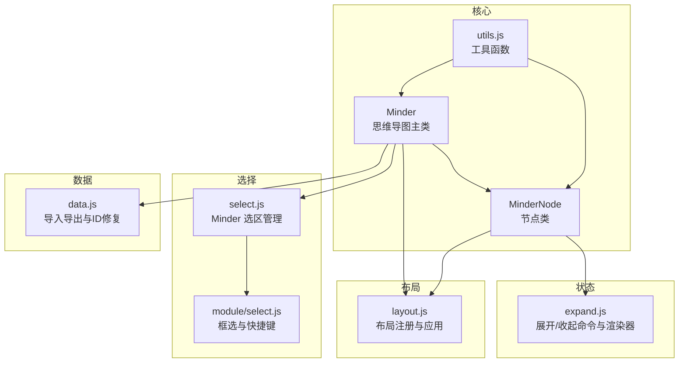
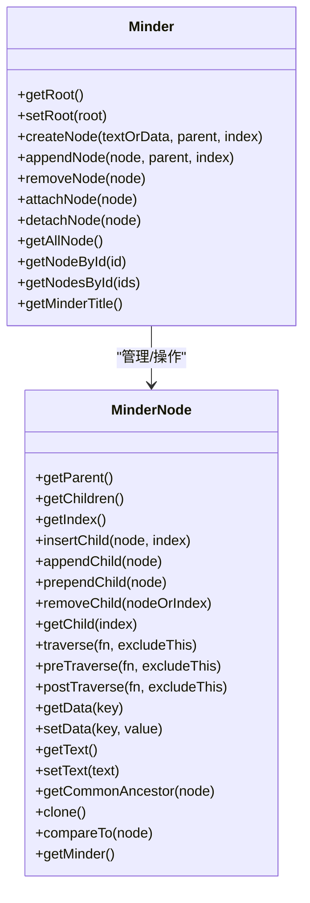
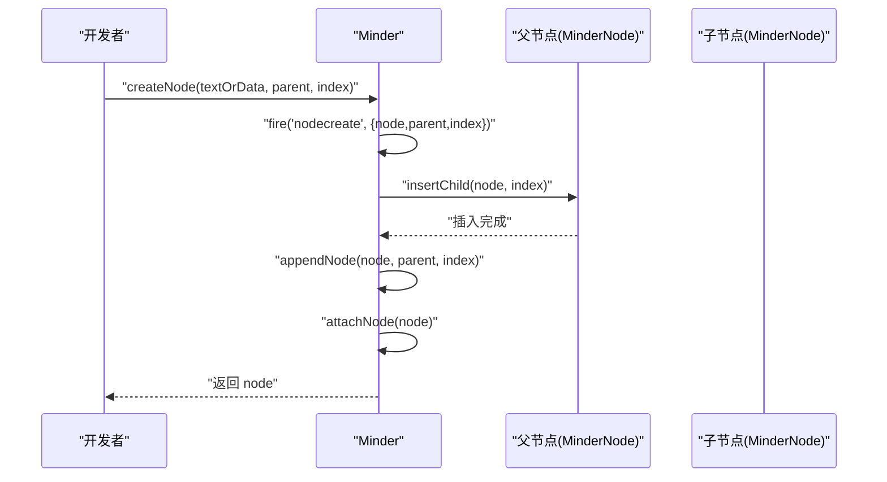
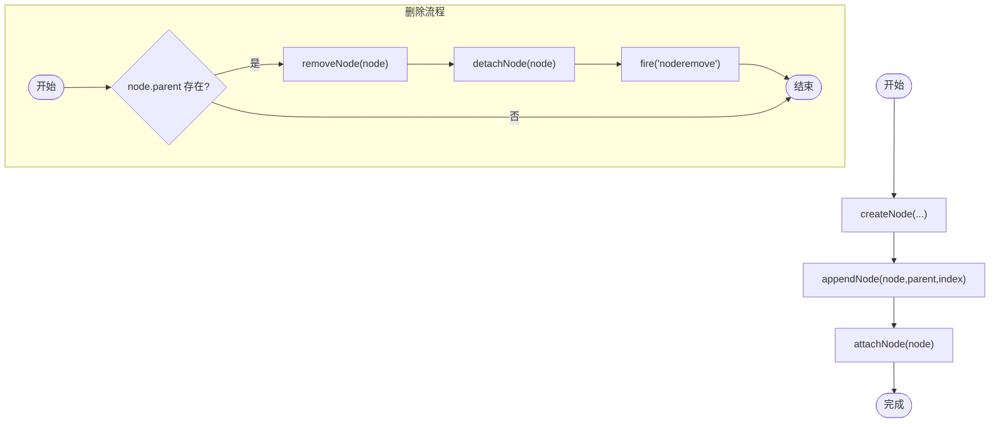
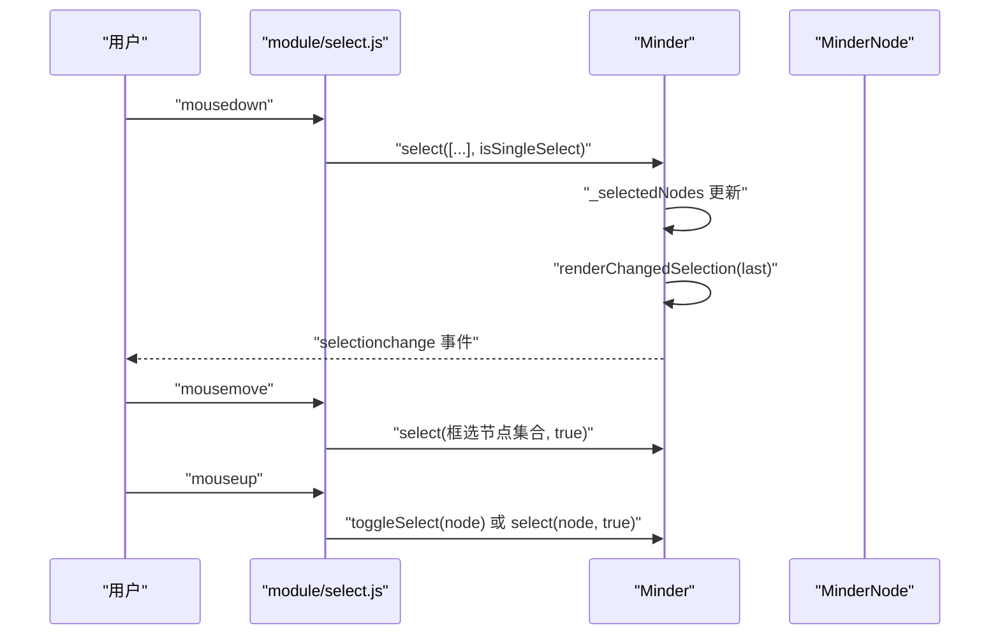
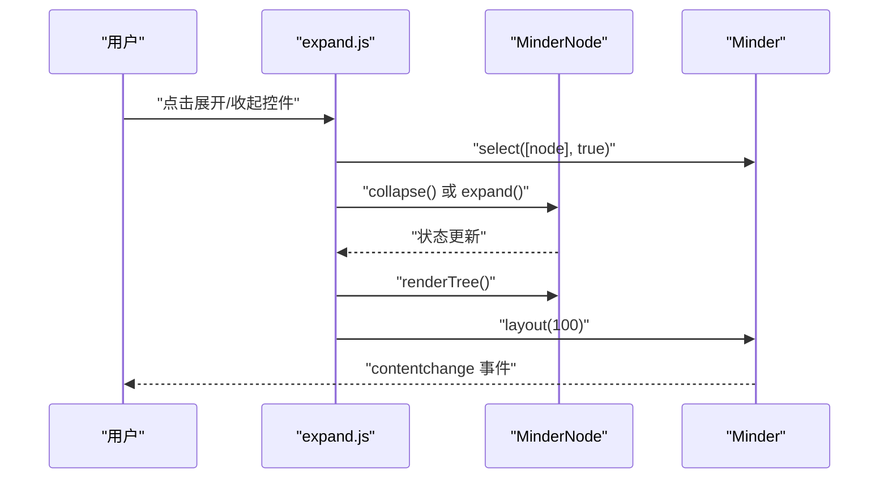
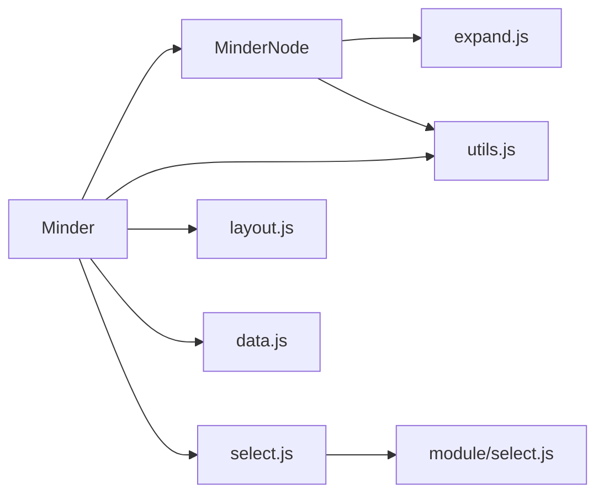

# 节点管理

<cite>
**本文引用的文件列表**
- [minder.js](file://src/core/minder.js)
- [node.js](file://src/core/node.js)
- [select.js](file://src/core/select.js)
- [module/select.js](file://src/module/select.js)
- [data.js](file://src/core/data.js)
- [utils.js](file://src/core/utils.js)
- [layout.js](file://src/core/layout.js)
- [expand.js](file://src/module/expand.js)
- [node-module.js](file://src/module/node.js)
- [Architecture.md](file://doc/Architecture.md)
</cite>

## 目录
1. [简介](#简介)
2. [项目结构](#项目结构)
3. [核心组件](#核心组件)
4. [架构总览](#架构总览)
5. [详细组件分析](#详细组件分析)
6. [依赖关系分析](#依赖关系分析)
7. [性能考量](#性能考量)
8. [故障排查指南](#故障排查指南)
9. [结论](#结论)
10. [附录](#附录)

## 简介
本章节围绕 Minder 类的节点管理能力，系统阐述其如何通过 getRoot()、createNode()/appendNode()、removeNode() 等方法管理思维导图的节点树结构；解释 MinderNode 类与 Minder 类的协作关系，说明节点的创建、插入、删除、遍历、选择与状态管理（选中、聚焦、展开/收起）的实现机制；并结合代码路径示例，给出常见操作的使用方式与最佳实践，同时提供性能优化建议与常见问题的排查思路。

## 项目结构
- 核心类与模块分布：
  - 核心类：Minder（思维导图主类）、MinderNode（节点类）
  - 节点管理：Minder 提供节点树的增删改查与渲染挂载/卸载
  - 选择机制：Minder 内置选区管理，配合模块实现框选与快捷键
  - 状态管理：展开/收起状态由扩展模块提供命令与渲染器
  - 布局系统：MinderNode 与 Minder 共同驱动布局计算与应用
  - 数据导入导出：提供 ID 一致性校验与修复，避免父子关系异常

图表来源
- [minder.js](file://src/core/minder.js#L1-L41)
- [node.js](file://src/core/node.js#L1-L120)
- [select.js](file://src/core/select.js#L1-L146)
- [module/select.js](file://src/module/select.js#L1-L184)
- [expand.js](file://src/module/expand.js#L1-L120)
- [layout.js](file://src/core/layout.js#L1-L120)
- [data.js](file://src/core/data.js#L1-L120)
- [utils.js](file://src/core/utils.js#L1-L66)

章节来源
- [minder.js](file://src/core/minder.js#L1-L41)
- [node.js](file://src/core/node.js#L1-L120)
- [select.js](file://src/core/select.js#L1-L146)
- [module/select.js](file://src/module/select.js#L1-L184)
- [expand.js](file://src/module/expand.js#L1-L120)
- [layout.js](file://src/core/layout.js#L1-L120)
- [data.js](file://src/core/data.js#L1-L120)
- [utils.js](file://src/core/utils.js#L1-L66)

## 核心组件
- Minder 类
  - 负责节点树的根节点管理、节点创建/附加/移除、全量节点检索、标题获取等
  - 关键方法：getRoot()、setRoot()、createNode()、appendNode()、removeNode()、attachNode()、detachNode()、getAllNode()、getNodeById()/getNodesById()
- MinderNode 类
  - 负责节点树结构与数据存取，提供遍历、父子关系、兄弟关系、公共祖先、克隆、比较等能力
  - 关键方法：getParent()、getChildren()、getIndex()、insertChild()、appendChild()、prependChild()、removeChild()、getChild()、traverse()/preTraverse()/postTraverse()、getData()/setData()、getText()/setText()、getCommonAncestor()、clone()、compareTo()、getMinder()

章节来源
- [minder.js](file://src/core/minder.js#L1-L41)
- [node.js](file://src/core/node.js#L1-L283)

## 架构总览
Minder 与 MinderNode 的协作关系：
- Minder 持有根节点引用，负责节点树的生命周期管理（创建、附加到渲染容器、移除、从渲染容器卸载）
- MinderNode 维护父子关系与兄弟关系，提供树遍历与数据存取
- 选择机制通过 Minder 的选区管理与模块交互实现
- 展开/收起状态通过扩展模块命令与渲染器实现
- 布局系统通过 MinderNode 的布局属性与 Minder 的布局流程统一驱动

图表来源
- [minder.js](file://src/core/minder.js#L316-L404)
- [node.js](file://src/core/node.js#L1-L283)

## 详细组件分析

### Minder 与 MinderNode 的协作关系
- 根节点管理
  - Minder.setRoot(root) 将根节点绑定到 Minder 实例，并设置 root.minder 指向当前 Minder
  - Minder.getRoot() 返回当前根节点
- 节点创建与插入
  - Minder.createNode(textOrData, parent, index) 创建新节点并触发 nodecreate 事件，随后调用 appendNode 完成插入与附加
  - Minder.appendNode(node, parent, index) 将节点插入父节点 children 中，并将节点及其子树附加到渲染容器
  - MinderNode.insertChild(node, index) 实际维护父子关系与兄弟顺序
- 节点删除
  - Minder.removeNode(node) 若节点存在父节点，则从父节点移除并从渲染容器卸载，同时触发 noderemove 事件
- 遍历与查询
  - Minder.getAllNode() 基于根节点遍历全树
  - Minder.getNodeById()/getNodesById() 基于全树扫描匹配节点 ID
  - MinderNode.traverse()/preTraverse()/postTraverse() 提供多种遍历策略

图表来源
- [minder.js](file://src/core/minder.js#L350-L365)
- [node.js](file://src/core/node.js#L199-L210)

章节来源
- [minder.js](file://src/core/minder.js#L316-L404)
- [node.js](file://src/core/node.js#L199-L231)

### 节点创建、插入、删除与遍历
- 创建节点
  - 使用 Minder.createNode() 创建节点，可传入文本或数据对象
  - 事件：nodecreate 触发后执行插入与附加
- 插入节点
  - appendNode() 将节点插入父节点指定索引位置
  - insertChild() 维护父子关系与兄弟顺序
- 删除节点
  - removeNode() 仅当节点存在父节点时执行删除与卸载
  - detachNode() 从渲染容器移除节点及其子树
- 遍历
  - traverse()/preTraverse()/postTraverse() 支持先序/后序/后序遍历
  - getAllNode() 返回全树节点数组

图表来源
- [minder.js](file://src/core/minder.js#L350-L375)
- [node.js](file://src/core/node.js#L199-L231)

章节来源
- [minder.js](file://src/core/minder.js#L350-L375)
- [node.js](file://src/core/node.js#L167-L185)

### 节点选择机制（选中、多选、框选）
- 选区管理
  - Minder 内置 _selectedNodes 数组，提供 getSelectedNodes()/getSelectedNode()、removeAllSelectedNodes()、removeSelectedNodes()、select()、toggleSelect()、selectById()、getSelectedAncestors() 等
  - renderChangedSelection(last) 计算变化并触发 selectionchange 事件，随后逐个节点 render()
- 模块交互
  - module/select.js 实现鼠标框选矩形绘制、框选节点计算与应用、键盘全选、多选/单选切换
  - 通过 mousedown/mousemove/mouseup 事件链路，结合状态机与阈值判断，实现框选与单选/多选
- 选择状态
  - MinderNode.isSelected() 基于 Minder 的选区判断当前节点是否被选中

图表来源
- [select.js](file://src/core/select.js#L41-L137)
- [module/select.js](file://src/module/select.js#L110-L184)
- [node.js](file://src/core/node.js#L280-L283)

章节来源
- [select.js](file://src/core/select.js#L1-L146)
- [module/select.js](file://src/module/select.js#L1-L184)
- [node.js](file://src/core/node.js#L280-L283)

### 节点状态管理（展开/收起、渲染可见性）
- 状态存储
  - 通过 MinderNode.setData()/getData() 存储展开状态键值，提供 expand()/collapse()/isExpanded()/isCollapsed() 方法
- 命令与渲染
  - Expand 命令：展开到当前节点或仅父级，Collapse 命令：收起当前节点子树
  - Expander 渲染器：在节点旁绘制展开/收起控件，根据父节点展开状态决定可见性
  - 事件：layoutapply/beforerender 控制渲染容器可见性与控件更新
- 快捷键
  - '/' 键切换当前选中节点的展开/收起状态
  - Alt+数字键展开到指定层级

图表来源
- [expand.js](file://src/module/expand.js#L129-L214)
- [layout.js](file://src/core/layout.js#L389-L436)

章节来源
- [expand.js](file://src/module/expand.js#L1-L214)
- [layout.js](file://src/core/layout.js#L389-L436)

### 节点遍历与查找
- 遍历
  - MinderNode.preTraverse()/postTraverse()/traverse() 支持先序/后序/后序遍历，常用于渲染树、统计复杂度、克隆等
  - Minder.getAllNode() 基于根节点遍历全树，返回节点数组
- 查找
  - Minder.getNodeById()/getNodesById() 基于全树扫描匹配节点 ID
  - MinderNode.getCommonAncestor() 计算两个或多个节点的公共祖先
  - Minder.getSelectedAncestors(includeRoot) 基于拓扑排序与祖先判定，返回选区中“最顶层”的祖先集合

章节来源
- [node.js](file://src/core/node.js#L167-L185)
- [minder.js](file://src/core/minder.js#L327-L348)
- [select.js](file://src/core/select.js#L104-L137)

### 节点层次操作示例（代码路径）
以下为常见操作的代码路径示例，便于开发者定位实现细节：
- 获取根节点
  - [getRoot()](file://src/core/minder.js#L318-L320)
- 创建并插入节点
  - [createNode()](file://src/core/minder.js#L350-L359)
  - [appendNode()](file://src/core/minder.js#L361-L365)
  - [insertChild()](file://src/core/node.js#L199-L210)
- 删除节点
  - [removeNode()](file://src/core/minder.js#L367-L375)
  - [removeChild()](file://src/core/node.js#L220-L231)
- 遍历与查询
  - [traverse()/preTraverse()/postTraverse()](file://src/core/node.js#L167-L185)
  - [getAllNode()](file://src/core/minder.js#L327-L333)
  - [getNodeById()/getNodesById()](file://src/core/minder.js#L335-L348)
- 选择与多选
  - [select()/toggleSelect()/selectById()](file://src/core/select.js#L69-L87)
  - [框选实现](file://src/module/select.js#L110-L184)
- 展开/收起
  - [expand()/collapse()/isExpanded()/isCollapsed()](file://src/module/expand.js#L17-L50)
  - [命令与快捷键](file://src/module/expand.js#L62-L127)
- 布局与渲染
  - [Minder.layout()](file://src/core/layout.js#L391-L436)
  - [applyLayoutResult()](file://src/core/layout.js#L444-L519)

章节来源
- [minder.js](file://src/core/minder.js#L318-L375)
- [node.js](file://src/core/node.js#L167-L231)
- [select.js](file://src/core/select.js#L69-L137)
- [module/select.js](file://src/module/select.js#L110-L184)
- [expand.js](file://src/module/expand.js#L17-L127)
- [layout.js](file://src/core/layout.js#L391-L519)

## 依赖关系分析
- Minder 依赖 MinderNode 进行节点树操作
- 选择模块依赖 Minder 的选区管理与渲染容器
- 展开模块依赖 MinderNode 的状态数据与 Minder 的布局刷新
- 数据模块依赖 utils 的 ID 生成与全树扫描
- 布局模块依赖 MinderNode 的布局属性与矩阵变换

图表来源
- [minder.js](file://src/core/minder.js#L316-L404)
- [node.js](file://src/core/node.js#L1-L120)
- [select.js](file://src/core/select.js#L1-L146)
- [module/select.js](file://src/module/select.js#L1-L184)
- [expand.js](file://src/module/expand.js#L1-L120)
- [layout.js](file://src/core/layout.js#L1-L120)
- [data.js](file://src/core/data.js#L1-L120)
- [utils.js](file://src/core/utils.js#L1-L66)

章节来源
- [minder.js](file://src/core/minder.js#L316-L404)
- [node.js](file://src/core/node.js#L1-L120)
- [select.js](file://src/core/select.js#L1-L146)
- [module/select.js](file://src/module/select.js#L1-L184)
- [expand.js](file://src/module/expand.js#L1-L120)
- [layout.js](file://src/core/layout.js#L1-L120)
- [data.js](file://src/core/data.js#L1-L120)
- [utils.js](file://src/core/utils.js#L1-L66)

## 性能考量
- 批量操作建议
  - 使用 Minder.createNode() 与 appendNode() 一次性插入，减少多次 attach/detach 的开销
  - 批量删除时优先从底层向上删除，降低渲染容器频繁变更带来的重绘成本
- 布局动画与复杂度
  - Minder.layout() 在节点复杂度超过阈值时自动关闭动画，避免大规模节点导致卡顿
  - applyLayoutResult() 会根据节点数量动态调整动画时长，必要时降级为同步更新
- 选择与渲染
  - 选择变化通过 renderChangedSelection() 仅对变化节点触发 render()，避免全量重绘
- 导入导出
  - data.js 在导入时对 ID 冲突进行修复，避免父子关系异常导致的渲染错误

章节来源
- [layout.js](file://src/core/layout.js#L444-L519)
- [data.js](file://src/core/data.js#L249-L291)
- [select.js](file://src/core/select.js#L17-L40)

## 故障排查指南
- 节点 ID 冲突
  - 现象：导入数据后出现重复 ID 导致节点错乱
  - 处理：data.js 在 importJson() 中对 ID 冲突进行检查与重生成，确保唯一性
  - 参考路径：[ID 冲突修复](file://src/core/data.js#L249-L291)
- 父子关系异常
  - 现象：节点插入后未正确显示或渲染异常
  - 处理：确认父节点 insertChild() 成功，且 appendNode() 后 attachNode() 已执行；检查 removeNode() 是否在父节点存在时才执行
  - 参考路径：[appendNode/removeNode/attachNode/detachNode](file://src/core/minder.js#L361-L398)
- 展开/收起不可见
  - 现象：子节点不显示或控件不出现
  - 处理：检查父节点是否 isExpanded()；ExpanderRenderer 仅在父节点展开且存在子节点时显示；确认 befroreRender 事件未阻止渲染
  - 参考路径：[展开/收起状态与渲染](file://src/module/expand.js#L176-L204)
- 选择无效或多选异常
  - 现象：框选无效或切换选中状态异常
  - 处理：确认 module/select.js 的事件链路正常；检查 isShortcutKey() 判断与状态机阈值；使用 toggleSelect() 切换单个节点
  - 参考路径：[框选与切换](file://src/module/select.js#L110-L184)
- 遍历效率低
  - 现象：全树遍历耗时较长
  - 处理：尽量使用 traverse()/preTraverse()/postTraverse() 的 excludeThis 参数减少重复处理；必要时缓存中间结果
  - 参考路径：[遍历方法](file://src/core/node.js#L167-L185)

章节来源
- [data.js](file://src/core/data.js#L249-L291)
- [minder.js](file://src/core/minder.js#L361-L398)
- [expand.js](file://src/module/expand.js#L176-L204)
- [module/select.js](file://src/module/select.js#L110-L184)
- [node.js](file://src/core/node.js#L167-L185)

## 结论
Minder 与 MinderNode 通过清晰的职责划分实现了对思维导图节点树的高效管理：Minder 负责根节点与生命周期管理，MinderNode 负责树结构与数据存取；选择与状态模块进一步增强了交互体验；布局与渲染模块保障了大规模节点场景下的性能与稳定性。遵循本文提供的操作路径与最佳实践，可有效避免常见问题并提升开发效率。

## 附录
- 相关文档与架构说明
  - [Architecture.md](file://doc/Architecture.md#L256-L311)