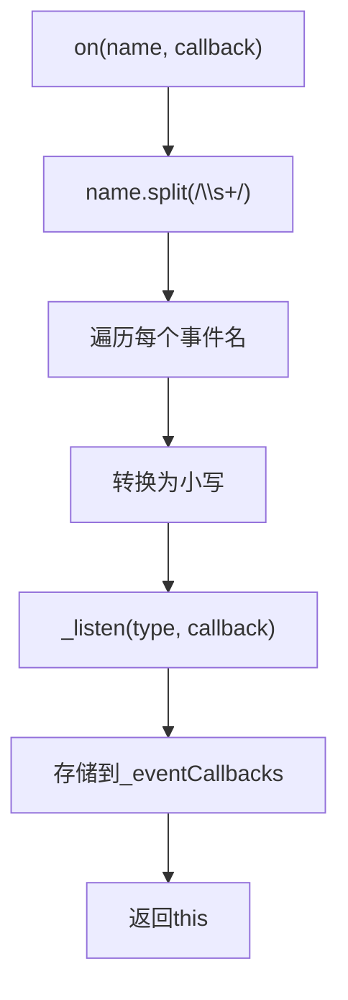
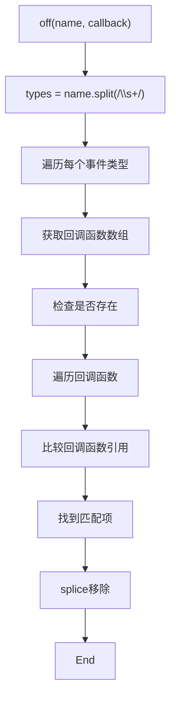
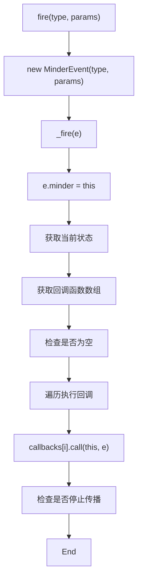
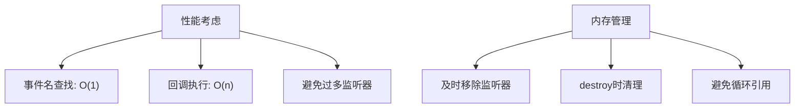

# 事件处理接口

<cite>
**本文档引用文件**  
- [event.js](file://src/core/event.js)
- [minder.js](file://src/core/minder.js)
- [Architecture.md](file://doc/Architecture.md)
- [module.js](file://src/core/module.js)
- [select.js](file://src/module/select.js)
</cite>

## 目录
1. [简介](#简介)
2. [核心事件方法](#核心事件方法)
3. [on() 方法详解](#on-方法详解)
4. [once() 方法实现机制](#once-方法实现机制)
5. [off() 方法监听器移除逻辑](#off-方法监听器移除逻辑)
6. [fire() 方法事件触发流程](#fire-方法事件触发流程)
7. [事件处理最佳实践](#事件处理最佳实践)
8. [性能考虑与内存管理](#性能考虑与内存管理)

## 简介

KityMinder 提供了一套完整的事件处理系统，用于实现模块间通信、用户交互响应和状态变更通知。该系统基于 Minder 类的事件接口，支持注册、触发和移除事件监听器。事件系统是整个架构的核心组成部分，贯穿于各个功能模块的交互之中。

事件系统的设计遵循发布-订阅模式，允许开发者在特定事件发生时执行回调函数。该系统不仅支持基本的交互事件（如点击、键盘输入），还支持自定义事件，为模块化开发提供了灵活的通信机制。

**Section sources**
- [Architecture.md](file://doc/Architecture.md#L374-L397)

## 核心事件方法

Minder 类提供了四个核心事件处理方法：`on()`、`once()`、`off()` 和 `fire()`。这些方法构成了事件系统的基础，分别用于注册事件监听器、注册一次性事件监听器、移除事件监听器和触发事件。

这些方法的设计考虑了易用性和性能，支持多种事件名绑定、事件名大小写不敏感处理以及高效的事件回调存储机制。事件系统还支持状态相关的事件处理，允许在特定状态下监听事件。

**Section sources**
- [Architecture.md](file://doc/Architecture.md#L389-L396)

## on() 方法详解

`on()` 方法用于注册事件监听器，支持通过空格分隔的多个事件名进行批量绑定。该方法将事件名转换为小写，实现了事件名的大小写不敏感处理。当调用 `on()` 方法时，它会将事件名按空格分割，然后为每个事件名调用内部的 `_listen()` 方法。

事件回调函数存储在 `_eventCallbacks` 对象中，该对象以事件名为键，以回调函数数组为值。这种数据结构允许同一个事件名绑定多个回调函数，并按注册顺序执行。`_eventCallbacks` 在 `_initEvents()` 方法中初始化为空对象，确保每个 Minder 实例都有独立的事件回调存储空间。

**Diagram sources**
- [event.js](file://src/core/event.js#L232-L237)
- [event.js](file://src/core/event.js#L194-L197)

**Section sources**
- [event.js](file://src/core/event.js#L232-L237)

## once() 方法实现机制

虽然在提供的代码片段中未直接显示 `once()` 方法的实现，但根据事件系统的常规设计模式和 Architecture.md 文档中的描述，`once()` 方法通过在回调函数执行后立即调用 `off()` 方法来实现单次监听的机制。

当使用 `once()` 注册事件监听器时，系统会创建一个包装函数，该函数在执行原始回调函数后自动移除自身。这种设计确保了回调函数只被执行一次，之后该事件监听器就会被自动清除，避免了重复执行的问题。

这种实现方式既保持了 API 的简洁性，又确保了事件监听器的自动清理，是事件系统中常见的最佳实践。

**Section sources**
- [Architecture.md](file://doc/Architecture.md#L392-L393)

## off() 方法监听器移除逻辑

`off()` 方法用于精确匹配并移除指定的事件监听器。该方法首先将事件名按空格分割，然后遍历每个事件名，查找对应的回调函数数组。在找到目标回调函数后，记录其索引位置，并使用 `splice()` 方法将其从数组中移除。

该方法的实现考虑了多种情况：可以移除单个事件的特定回调函数，也可以移除多个事件的同一回调函数。通过精确的引用比较（`callbacks[j] == callback`），确保只移除指定的回调函数，而不影响其他监听器。

**Diagram sources**
- [event.js](file://src/core/event.js#L240-L259)

**Section sources**
- [event.js](file://src/core/event.js#L240-L259)

## fire() 方法事件触发流程

`fire()` 方法负责创建 `MinderEvent` 对象并触发事件传播。当调用 `fire()` 时，它会创建一个新的 `MinderEvent` 实例，将自定义参数合并到事件对象中，然后调用内部的 `_fire()` 方法进行事件分发。

`_fire()` 方法首先设置事件对象的 `minder` 属性，指向产生事件的 Minder 实例。然后根据当前状态（status）获取相应的回调函数数组，包括通用事件回调和状态特定事件回调。最后，按顺序执行所有匹配的回调函数，并根据事件的传播状态决定是否继续传播。

**Diagram sources**
- [event.js](file://src/core/event.js#L261-L264)
- [event.js](file://src/core/event.js#L199-L230)

**Section sources**
- [event.js](file://src/core/event.js#L261-L264)

## 事件处理最佳实践

在使用 KityMinder 的事件系统时，应遵循以下最佳实践：

1. **及时清理监听器**：使用 `off()` 方法在适当的时候移除事件监听器，避免内存泄漏。
2. **使用 once() 处理一次性事件**：对于只需要执行一次的事件处理，使用 `once()` 方法。
3. **避免在回调中修改事件对象**：保持事件对象的不可变性，确保事件处理的可预测性。
4. **合理使用状态相关事件**：利用状态前缀（如 `normal.keydown`）来处理特定状态下的事件。

模块在注册事件时，通常在 `init` 方法中使用 `on()` 方法绑定事件监听器，在 `destroy` 方法中自动清理。这种模式确保了事件监听器的生命周期与模块的生命周期保持一致。

**Section sources**
- [module.js](file://src/core/module.js#L92-L94)
- [select.js](file://src/module/select.js#L119-L181)

## 性能考虑与内存管理

事件系统的性能主要体现在事件回调的存储和查找效率上。`_eventCallbacks` 使用对象作为哈希表，提供了 O(1) 的事件名查找性能。回调函数数组的遍历执行是主要的性能开销，因此应避免注册过多的事件监听器。

内存管理方面，未及时移除的事件监听器是主要的内存泄漏源。开发者应确保在模块销毁或组件卸载时清理所有事件监听器。`destroy` 方法中调用 `_resetEvents()` 可以重置整个事件系统，确保资源的完全释放。

**Diagram sources**
- [event.js](file://src/core/event.js#L135-L137)
- [module.js](file://src/core/module.js#L131-L132)

**Section sources**
- [event.js](file://src/core/event.js#L135-L142)
- [module.js](file://src/core/module.js#L128-L138)