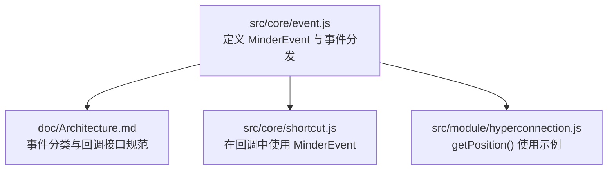
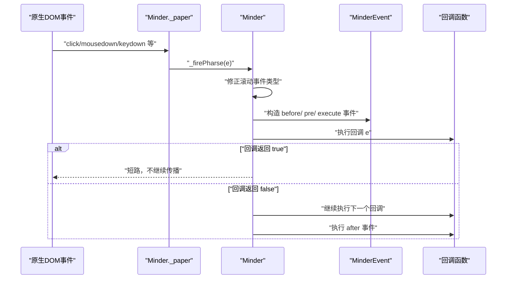
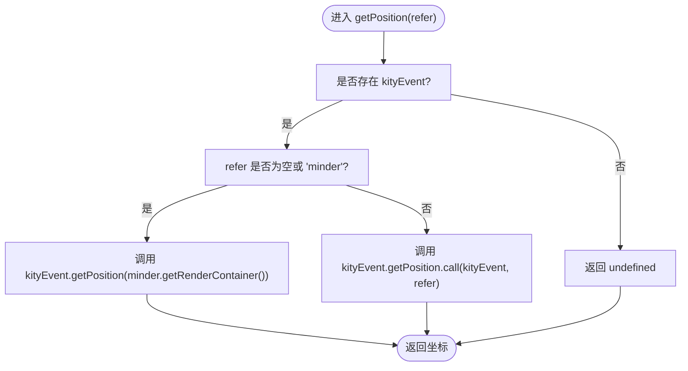
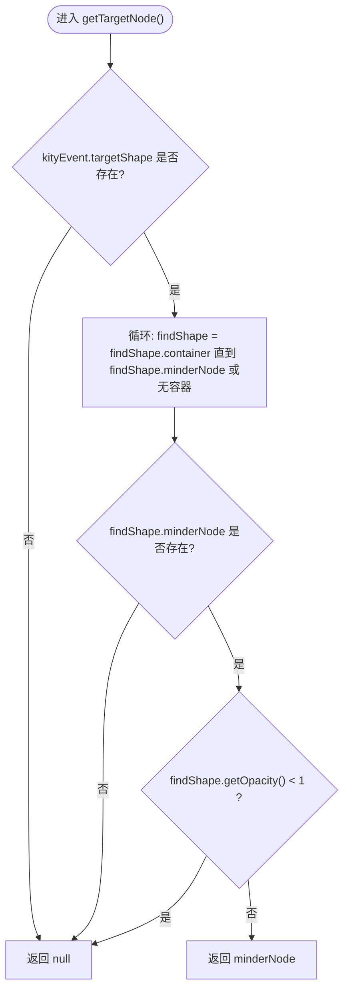
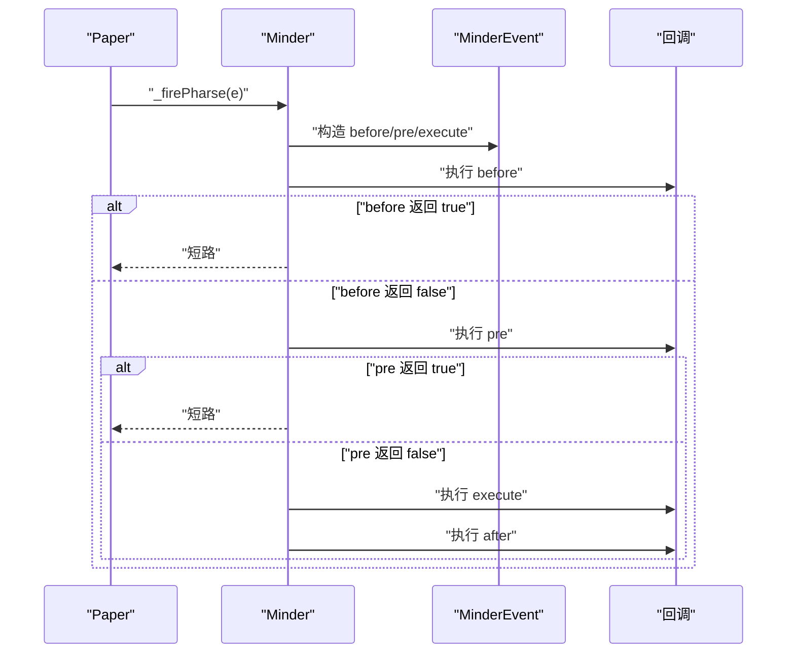
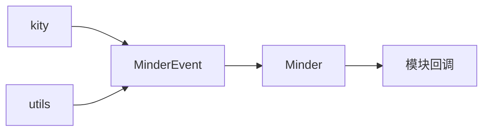

# 事件对象结构

<cite>
**本文引用的文件**
- [src/core/event.js](file://src/core/event.js)
- [doc/Architecture.md](file://doc/Architecture.md)
- [src/core/shortcut.js](file://src/core/shortcut.js)
- [src/module/hyperconnection.js](file://src/module/hyperconnection.js)
</cite>

## 目录
1. [引言](#引言)
2. [项目结构](#项目结构)
3. [核心组件](#核心组件)
4. [架构总览](#架构总览)
5. [详细组件分析](#详细组件分析)
6. [依赖分析](#依赖分析)
7. [性能考虑](#性能考虑)
8. [故障排查指南](#故障排查指南)
9. [结论](#结论)
10. [附录](#附录)

## 引言
本文件围绕事件对象 MinderEvent 的结构与行为进行全面解析，重点说明：
- type 属性作为事件类型标识的核心作用
- kityEvent 属性在派生自 Kity 图形库事件时的引用关系
- originEvent 属性在源自原生 DOM 事件（如 click、keydown）时的指向作用
- getPosition() 方法如何根据不同的参照系（screen、minder 或指定 Shape）计算事件坐标，特别是与 Kity 事件系统的集成方式
- getTargetNode() 方法通过遍历 kityEvent.targetShape 及其容器定位命中节点的算法逻辑，包括对透明度判断的处理
- stopPropagation() 与 stopPropagationImmediately() 在事件冒泡控制上的区别，以及 preventDefault() 对原生事件的阻止机制
- 结合 Architecture.md 中回调函数接口说明与 event.js 的源码实现，给出在事件处理函数中安全使用这些属性与方法的实践建议

## 项目结构
与事件对象直接相关的核心文件位于 src/core 目录，其中 event.js 定义了 MinderEvent 类及其事件分发流程，Architecture.md 提供了事件分类与回调接口规范，shortcut.js 展示了如何在回调中使用 MinderEvent 的便捷方法（如 isShortcutKey、preventDefault），hyperconnection.js 则给出了 getPosition() 在交互中的典型用法示例。

图表来源
- [src/core/event.js](file://src/core/event.js#L1-L269)
- [doc/Architecture.md](file://doc/Architecture.md#L378-L412)
- [src/core/shortcut.js](file://src/core/shortcut.js#L1-L154)
- [src/module/hyperconnection.js](file://src/module/hyperconnection.js#L880-L908)

章节来源
- [src/core/event.js](file://src/core/event.js#L1-L269)
- [doc/Architecture.md](file://doc/Architecture.md#L378-L412)

## 核心组件
- MinderEvent：事件数据载体，封装 type、kityEvent、originEvent，并提供 getPosition()、getTargetNode()、stopPropagation()、stopPropagationImmediately()、shouldStopPropagation()、shouldStopPropagationImmediately()、preventDefault()、isRightMB()、getKeyCode() 等方法
- Minder 事件分发：绑定纸面与窗口事件，构造 before/pre/execute/after 系列事件，维护回调队列并按状态与停止策略执行

章节来源
- [src/core/event.js](file://src/core/event.js#L1-L269)

## 架构总览
Minder 将原生 DOM 事件转换为 MinderEvent，并按阶段触发 before、pre、execute 三个阶段事件，随后根据返回值决定是否继续传播与是否触发 after 事件。模块可通过 on/off/fire 管理事件回调，回调函数接收唯一的 e 参数，即 MinderEvent 实例。

图表来源
- [src/core/event.js](file://src/core/event.js#L144-L182)
- [src/core/event.js](file://src/core/event.js#L194-L231)

章节来源
- [src/core/event.js](file://src/core/event.js#L144-L182)
- [src/core/event.js](file://src/core/event.js#L194-L231)

## 详细组件分析

### MinderEvent 类与属性
- type：事件类型字符串，如 click、keydown、contentchange 等，用于区分事件类别
- kityEvent：当事件来源于 Kity 图形事件时，指向原始 Kity 事件对象
- originEvent：当事件来源于原生 DOM 事件时，指向原始 DOM 事件对象
- minder：在 _fire 中注入，指向触发事件的 Minder 实例

章节来源
- [src/core/event.js](file://src/core/event.js#L11-L45)
- [src/core/event.js](file://src/core/event.js#L200-L207)

### type 属性与事件类型标识
- 作用：标识事件类别，驱动回调匹配与阶段化处理
- 用法：Minder._fire 中按 e.type 与状态拼接回调集合，确保同一事件在不同状态下可有不同的处理逻辑

章节来源
- [src/core/event.js](file://src/core/event.js#L194-L214)

### kityEvent 与 originEvent 的引用关系
- 来源判定：构造函数中通过参数形态识别事件来源
  - 若参数具备 getType 且类型为 ShapeEvent，则认为来自 Kity 事件，设置 kityEvent，并从其提取 originEvent
  - 若参数具备 target 与 preventDefault，则认为来自原生 DOM 事件，设置 originEvent
  - 否则将参数扩展到 MinderEvent 实例
- 影响：决定 getPosition() 是否可用、是否能通过 getTargetNode() 定位节点、是否能调用 preventDefault()

章节来源
- [src/core/event.js](file://src/core/event.js#L11-L35)

### getPosition() 坐标计算与参照系
- 参照系：
  - "screen"：以浏览器屏幕为参照坐标系（需通过外部手段转换）
  - "minder"：默认，以脑图画布容器为参照坐标系
  - 指定 kity.Shape：以该图形为参照坐标系
- 与 Kity 事件系统集成：
  - 当 refer 为 "minder" 或未提供时，调用 kityEvent.getPosition(this.minder.getRenderContainer())
  - 当 refer 为 kity.Shape 时，调用 kityEvent.getPosition.call(kityEvent, refer)
- 实际用法示例：模块在处理鼠标移动时，使用 getPosition(minder.getRenderContainer()) 计算临时连线吸附位置

图表来源
- [src/core/event.js](file://src/core/event.js#L60-L66)
- [src/module/hyperconnection.js](file://src/module/hyperconnection.js#L880-L908)

章节来源
- [src/core/event.js](file://src/core/event.js#L60-L66)
- [src/module/hyperconnection.js](file://src/module/hyperconnection.js#L880-L908)

### getTargetNode() 命中节点定位算法
- 算法步骤：
  - 从 kityEvent.targetShape 开始
  - 循环向上遍历 container，直到找到 minderNode 或无容器
  - 若找到 minderNode，但该 shape 的透明度小于 1，则返回 null，避免命中半透明区域
  - 否则返回 minderNode 或 null
- 作用：在鼠标事件中快速定位命中的脑图节点，支持透明度遮挡判断

图表来源
- [src/core/event.js](file://src/core/event.js#L75-L84)

章节来源
- [src/core/event.js](file://src/core/event.js#L75-L84)

### stopPropagation() 与 stopPropagationImmediately() 的区别
- stopPropagation()：标记事件应停止传播，但允许继续执行当前回调队列中剩余回调
- stopPropagationImmediately()：同时标记立即停止传播，中断回调队列的后续执行
- 应用场景：在某些交互中，仅阻止后续回调处理，而在另一些情况下需要彻底中断传播链

章节来源
- [src/core/event.js](file://src/core/event.js#L93-L108)

### preventDefault() 与原生事件阻止
- 机制：当 originEvent 存在时，调用 originEvent.preventDefault() 阻止原生默认行为
- 典型用途：在快捷键处理中调用 e.preventDefault() 防止浏览器默认快捷键行为（如复制粘贴）

章节来源
- [src/core/event.js](file://src/core/event.js#L109-L111)
- [src/core/shortcut.js](file://src/core/shortcut.js#L84-L94)

### isRightMB() 与 getKeyCode() 的辅助能力
- isRightMB()：判断是否为右键，兼容 which/button
- getKeyCode()：统一从 originEvent 获取 keyCode/which

章节来源
- [src/core/event.js](file://src/core/event.js#L112-L126)

### 事件分发与回调执行流程
- 事件绑定：Minder._bindEvents 绑定 paper 与 window 事件，统一交由 _firePharse 处理
- 阶段化触发：before -> pre -> execute，若任一阶段返回 true 则短路，否则继续执行 after
- 回调管理：on/off/_listen/_fire 维护回调队列，支持按状态与事件类型匹配

图表来源
- [src/core/event.js](file://src/core/event.js#L144-L182)
- [src/core/event.js](file://src/core/event.js#L194-L231)

章节来源
- [src/core/event.js](file://src/core/event.js#L144-L182)
- [src/core/event.js](file://src/core/event.js#L194-L231)

## 依赖分析
- MinderEvent 依赖 kity 与 utils，构造时扩展参数，提供坐标与命中节点能力
- Minder 依赖 MinderEvent 完成事件分发，内部维护回调队列，按状态与停止策略执行
- 业务模块通过 Minder.on 注册回调，使用 MinderEvent 的方法实现复杂交互逻辑

图表来源
- [src/core/event.js](file://src/core/event.js#L1-L20)
- [src/core/event.js](file://src/core/event.js#L133-L169)

章节来源
- [src/core/event.js](file://src/core/event.js#L1-L20)
- [src/core/event.js](file://src/core/event.js#L133-L169)

## 性能考虑
- getPosition() 与 getTargetNode() 均依赖 Kity 事件系统，计算成本较低
- stopPropagation()/stopPropagationImmediately() 可减少不必要的回调执行，降低整体处理时间
- 避免在高频事件（如 mousemove）中进行昂贵操作，必要时配合节流/防抖

## 故障排查指南
- 无法获取坐标：确认事件来源是否为 Kity 事件（kityEvent 是否存在），否则 getPosition() 会返回 undefined
- 命中节点为空：检查目标 shape 的透明度是否小于 1，半透明区域会被视为未命中
- 事件未停止传播：确认是否调用了 stopPropagation() 或 stopPropagationImmediately()，并确保回调返回值符合预期
- 原生行为未阻止：确认 originEvent 是否存在，且在合适时机调用 preventDefault()

章节来源
- [src/core/event.js](file://src/core/event.js#L60-L66)
- [src/core/event.js](file://src/core/event.js#L75-L84)
- [src/core/event.js](file://src/core/event.js#L93-L111)

## 结论
MinderEvent 作为事件数据载体，通过 type、kityEvent、originEvent 三要素清晰地区分事件来源与上下文，并提供 getPosition()、getTargetNode()、stopPropagation()、preventDefault() 等关键方法，支撑了从交互到命令执行的完整事件链路。结合 Architecture.md 的回调接口与 event.js 的实现，开发者可以在模块回调中安全、高效地使用这些能力，构建复杂的交互逻辑。

## 附录
- 事件分类与回调接口参考：Architecture.md
- 快捷键处理示例：shortcut.js 中的 isShortcutKey 与 preventDefault 使用
- 坐标计算示例：hyperconnection.js 中 getPosition(minder.getRenderContainer()) 的使用

章节来源
- [doc/Architecture.md](file://doc/Architecture.md#L378-L412)
- [src/core/shortcut.js](file://src/core/shortcut.js#L62-L94)
- [src/module/hyperconnection.js](file://src/module/hyperconnection.js#L880-L908)