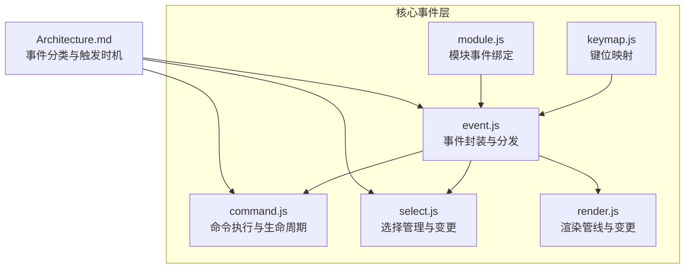
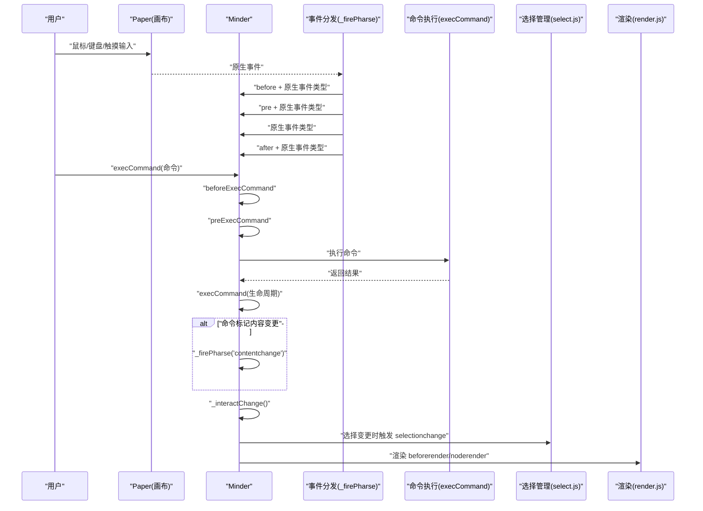
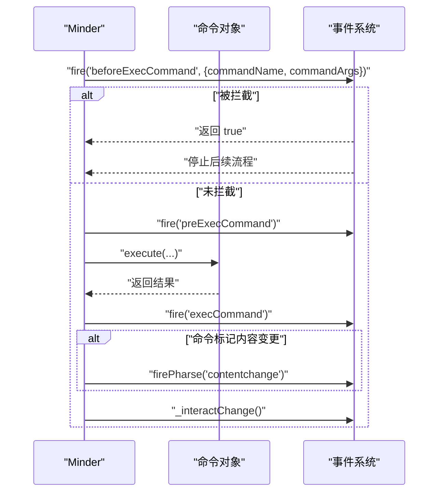
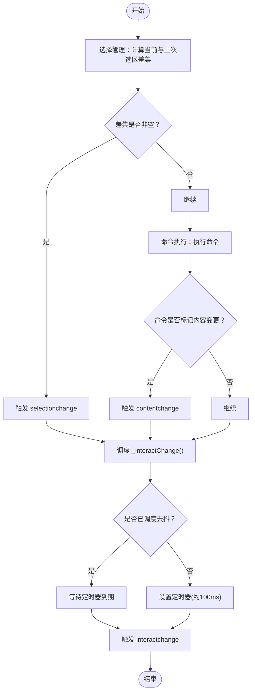
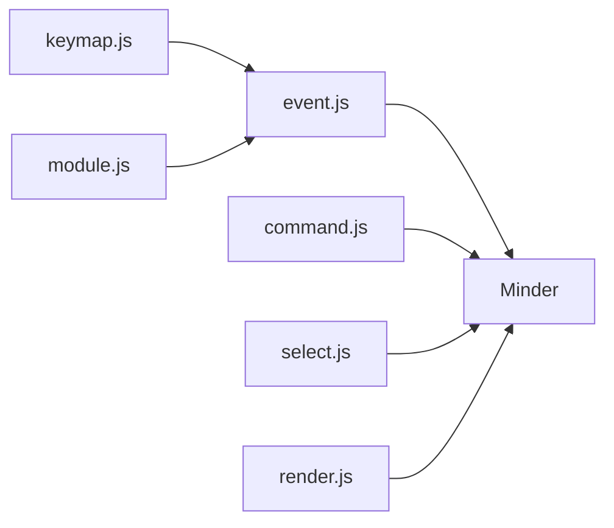

# 事件类型分类

<cite>
**本文引用的文件**
- [Architecture.md](file://doc/Architecture.md)
- [event.js](file://src/core/event.js)
- [command.js](file://src/core/command.js)
- [select.js](file://src/core/select.js)
- [module.js](file://src/core/module.js)
- [keymap.js](file://src/core/keymap.js)
- [render.js](file://src/core/render.js)
</cite>

## 目录
1. [引言](#引言)
2. [项目结构](#项目结构)
3. [核心组件](#核心组件)
4. [架构总览](#架构总览)
5. [详细组件分析](#详细组件分析)
6. [依赖分析](#依赖分析)
7. [性能考虑](#性能考虑)
8. [故障排查指南](#故障排查指南)
9. [结论](#结论)

## 引言
本文件系统性梳理 KityMinder 中的事件类型分类与工作机制，围绕三类事件展开：
- 交互事件：鼠标、键盘、触摸等用户输入事件，作为用户操作输入的载体
- 命令事件：命令执行生命周期钩子，包括拦截、预处理、后处理
- 状态变更事件：内容、选择、交互状态的变更事件，驱动渲染与布局更新

同时结合 Architecture.md 的事件分类说明与 event.js 的实现，阐明事件与 Minder 核心功能（命令执行、选择管理、布局更新）的关联，并给出监听与处理的路径指引。

## 项目结构
KityMinder 的事件系统主要分布在核心模块中：
- 事件系统与分发：src/core/event.js
- 命令执行与生命周期：src/core/command.js
- 选择管理与变更：src/core/select.js
- 模块事件绑定：src/core/module.js
- 键位映射与交互：src/core/keymap.js
- 渲染管线与变更：src/core/render.js
- 事件分类与触发时机：doc/Architecture.md

图表来源
- [event.js](file://src/core/event.js#L144-L192)
- [command.js](file://src/core/command.js#L118-L166)
- [select.js](file://src/core/select.js#L17-L40)
- [render.js](file://src/core/render.js#L90-L163)
- [keymap.js](file://src/core/keymap.js#L1-L76)
- [module.js](file://src/core/module.js#L83-L95)
- [Architecture.md](file://doc/Architecture.md#L376-L431)

章节来源
- [Architecture.md](file://doc/Architecture.md#L376-L431)
- [event.js](file://src/core/event.js#L144-L192)

## 核心组件
- 事件封装与分发：MinderEvent 封装原生事件，提供坐标、命中节点、阻止传播等能力；Minder 统一绑定画布与窗口事件，分发 before/pre/execute/after 生命周期事件。
- 命令执行：Minder.execCommand 触发 beforeExecCommand/preExecCommand/execCommand 生命周期，根据命令是否标记内容变更触发 contentchange，并统一调度 interactchange。
- 选择管理：选择变更时计算差集，触发 selectionchange，并调度 interactchange。
- 渲染管线：渲染前 fire beforerender，渲染后 fire noderender，驱动布局与连线更新。
- 模块事件：模块在 events 字段声明事件处理器，由 module.js 在加载模块时绑定到 Minder 实例。

章节来源
- [event.js](file://src/core/event.js#L1-L112)
- [command.js](file://src/core/command.js#L118-L166)
- [select.js](file://src/core/select.js#L17-L40)
- [render.js](file://src/core/render.js#L90-L163)
- [module.js](file://src/core/module.js#L83-L95)

## 架构总览
事件分类与触发时机（来自 Architecture.md）：
- 交互事件：click、dblclick、mousedown、mousemove、mouseup、keydown、keyup、keypress、touchstart、touchend、touchmove
- 命令事件：beforeExecCommand、preExecCommand、execCommand
- 状态变更事件：selectionchange、contentchange、interactchange
- 模块事件：模块自定义事件（与上述不同名）

事件触发时机要点：
- 命令事件仅在顶级命令执行时触发（命令内部再次执行命令不重复触发）
- contentchange 在顶级命令后查询内容是否变化，若变化则触发
- selectionchange 在顶级命令后查询选区是否变化，若变化则触发
- interactchange 在所有鼠标、键盘、触摸操作后发生，并进行稀释；手动触发不会被稀释

图表来源
- [event.js](file://src/core/event.js#L144-L192)
- [command.js](file://src/core/command.js#L118-L166)
- [select.js](file://src/core/select.js#L17-L40)
- [render.js](file://src/core/render.js#L90-L163)
- [Architecture.md](file://doc/Architecture.md#L376-L431)

## 详细组件分析

### 交互事件（鼠标/键盘/触摸）
交互事件是用户输入的直接载体，KityMinder 通过画布绑定多种原生事件，并统一转换为 before/pre/execute/after 生命周期事件，以便模块按需拦截与处理。

- 事件绑定与分发
  - 画布事件绑定：点击、双击、鼠标按下/移动/抬起、滚轮、触摸开始/移动/结束、拖拽进入/离开/放置、窗口 resize 等
  - 分发流程：DOMMouseScroll 统一转 mousewheel；构造 before/pre/execute/after 事件并依次触发
  - 传播控制：MinderEvent 支持 stopPropagation/stopPropagationImmediately，可在 before/pre 阶段阻断后续处理

- 事件对象能力
  - 坐标获取：getPosition(refer) 支持屏幕/画布/图形等坐标系
  - 命中节点：getTargetNode() 获取事件命中的节点
  - 右键判断：isRightMB() 判断右键
  - 键码获取：getKeyCode() 获取按键码

- 典型应用场景
  - 模块在 events 中监听 click/dblclick/mousedown 等，结合 getPosition()/getTargetNode() 实现节点选择、拖拽、右键菜单等
  - 键盘事件通过 dispatchKeyEvent 分发，模块可监听 keydown/keyup/keypress

章节来源
- [event.js](file://src/core/event.js#L144-L192)
- [event.js](file://src/core/event.js#L1-L112)
- [module.js](file://src/core/module.js#L83-L95)
- [Architecture.md](file://doc/Architecture.md#L376-L409)

### 命令事件（beforeExecCommand、preExecCommand、execCommand）
命令事件是命令执行的生命周期钩子，贯穿命令的“拦截—预处理—执行—后处理”全过程。

- 生命周期触发顺序
  - beforeExecCommand：允许拦截命令执行（返回 true 可阻止后续处理）
  - preExecCommand：预处理阶段，可进行前置校验或准备
  - execCommand：命令真正执行阶段，命令对象的 execute() 被调用
  - contentchange：若命令标记内容变更，则在命令完成后触发
  - interactchange：命令完成后统一调度交互状态稀释

- 命令对象与变更标记
  - 命令类可通过 setContentChanged()/setSelectionChanged() 标记是否影响内容/选区
  - Minder.execCommand 会根据命令的标记决定是否触发 contentchange

- 典型使用场景
  - beforeExecCommand：权限校验、输入合法性检查、状态前置判断
  - preExecCommand：准备数据、记录快照、初始化状态
  - execCommand：执行命令的核心逻辑
  - contentchange：刷新渲染、更新历史栈、触发布局更新

图表来源
- [command.js](file://src/core/command.js#L118-L166)
- [event.js](file://src/core/event.js#L144-L192)

章节来源
- [command.js](file://src/core/command.js#L118-L166)
- [Architecture.md](file://doc/Architecture.md#L420-L431)

### 状态变更事件（contentchange、selectionchange、interactchange）
状态变更事件用于驱动 UI 与布局的更新，确保界面与数据保持一致。

- contentchange
  - 触发条件：顶级命令执行后，若命令标记内容变更，则触发
  - 业务意义：通知渲染系统更新节点内容、布局、连线等
  - 触发位置：命令执行成功后，根据命令标记调用 firePharse('contentchange')

- selectionchange
  - 触发条件：选择集合发生变化（差集非空）
  - 触发位置：选择管理模块在 renderChangedSelection() 中计算差集后触发
  - 业务意义：更新工具栏状态、同步外部 UI、触发节点渲染

- interactchange
  - 触发条件：所有鼠标、键盘、触摸操作后发生，并进行稀释（定时去抖）
  - 触发位置：事件分发与命令执行均会调度 _interactChange()
  - 业务意义：统一触发布局更新、状态同步、性能优化（避免频繁触发）

图表来源
- [select.js](file://src/core/select.js#L17-L40)
- [command.js](file://src/core/command.js#L140-L166)
- [event.js](file://src/core/event.js#L184-L192)

章节来源
- [select.js](file://src/core/select.js#L17-L40)
- [command.js](file://src/core/command.js#L140-L166)
- [event.js](file://src/core/event.js#L184-L192)
- [Architecture.md](file://doc/Architecture.md#L420-L431)

### 事件监听与处理方式（代码路径指引）
- 监听事件
  - on(event, callback)：注册事件监听器
  - off(event, callback)：取消事件监听
  - once(event, callback)：一次性监听（由模块事件系统提供）
- 事件回调参数
  - 交互事件：回调参数 e 为 MinderEvent，包含 getPosition()/getTargetNode() 等能力
  - 命令事件：e.commandName/e.commandArgs 可获取命令信息
  - selectionchange：e.currentSelection/e.additionNodes/e.removalNodes
- 模块事件绑定
  - 模块在 events 字段声明事件处理器，由 module.js 在加载模块时绑定到 Minder 实例

章节来源
- [event.js](file://src/core/event.js#L232-L266)
- [module.js](file://src/core/module.js#L83-L95)
- [Architecture.md](file://doc/Architecture.md#L388-L419)

## 依赖分析
事件系统各模块的耦合关系如下：
- event.js 依赖 Minder、kity/utils，负责事件封装与分发
- command.js 依赖 Minder/MinderNode/MinderEvent，负责命令生命周期与 contentchange/interactchange 调度
- select.js 依赖 Minder/MinderNode，负责选择变更与 selectionchange/interactchange 调度
- render.js 依赖 Minder/MinderNode，负责渲染前后事件 beforerender/noderender
- keymap.js 依赖 utils，提供键位映射与交互辅助
- module.js 依赖 utils，负责模块事件绑定

图表来源
- [event.js](file://src/core/event.js#L144-L192)
- [command.js](file://src/core/command.js#L118-L166)
- [select.js](file://src/core/select.js#L17-L40)
- [render.js](file://src/core/render.js#L90-L163)
- [module.js](file://src/core/module.js#L83-L95)
- [keymap.js](file://src/core/keymap.js#L1-L76)

章节来源
- [event.js](file://src/core/event.js#L144-L192)
- [command.js](file://src/core/command.js#L118-L166)
- [select.js](file://src/core/select.js#L17-L40)
- [render.js](file://src/core/render.js#L90-L163)
- [module.js](file://src/core/module.js#L83-L95)
- [keymap.js](file://src/core/keymap.js#L1-L76)

## 性能考虑
- 交互事件稀释：interactchange 采用定时器去抖（约100ms），避免高频交互导致的重复触发
- 渲染批处理：渲染管线按渲染器阶段批量处理节点，减少重复绘制
- 选择变更最小化：仅在差集非空时触发 selectionchange，降低不必要的渲染
- 命令变更标记：通过命令对象的变更标记精确触发 contentchange，避免无关刷新

章节来源
- [event.js](file://src/core/event.js#L184-L192)
- [render.js](file://src/core/render.js#L90-L163)
- [select.js](file://src/core/select.js#L17-L40)
- [command.js](file://src/core/command.js#L140-L166)

## 故障排查指南
- 事件未触发
  - 检查是否正确使用 on/off/once 注册与注销
  - 确认事件类型大小写与绑定一致（事件名会小写化）
- 事件被拦截
  - 在 beforeExecCommand 或 before 原生事件中返回 true 会阻止后续处理
  - 检查 stopPropagation/stopPropagationImmediately 是否被调用
- 选择变更未生效
  - 确认选择集合确实发生变化（差集非空）
  - 检查是否在渲染过程中隐藏了节点导致命中失败
- contentchange 未触发
  - 确认命令是否标记内容变更
  - 确认是否在顶级命令执行后触发（命令内再次执行命令不会重复触发）
- interactchange 触发过于频繁
  - 交互事件本身会触发去抖，若手动触发请避免重复调度

章节来源
- [event.js](file://src/core/event.js#L232-L266)
- [event.js](file://src/core/event.js#L93-L112)
- [select.js](file://src/core/select.js#L17-L40)
- [command.js](file://src/core/command.js#L140-L166)
- [Architecture.md](file://doc/Architecture.md#L420-L431)

## 结论
KityMinder 的事件体系以“交互事件—命令事件—状态变更事件”为主线，形成清晰的输入—执行—输出闭环：
- 交互事件统一封装并分发生命周期事件，模块可按需拦截与处理
- 命令事件提供严格的生命周期钩子，保证命令执行的可控性与可观测性
- 状态变更事件驱动渲染与布局更新，配合稀释策略提升性能
结合 Architecture.md 的分类与 event.js/command.js/select.js 的实现，开发者可准确把握事件的触发时机与处理路径，构建稳定高效的交互与渲染链路。