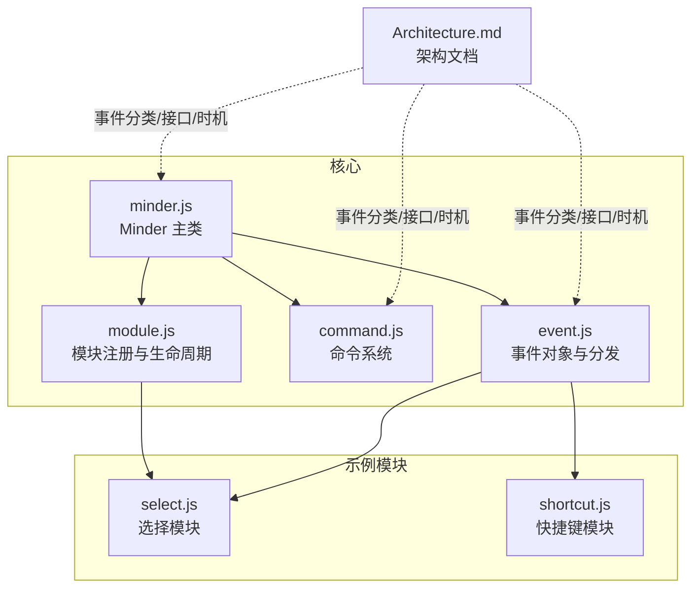
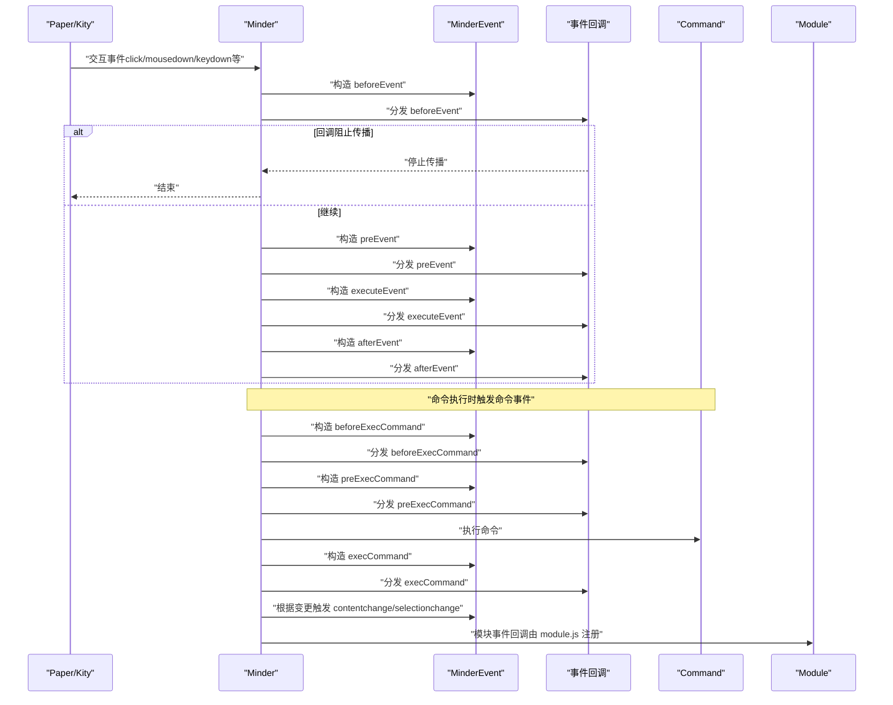
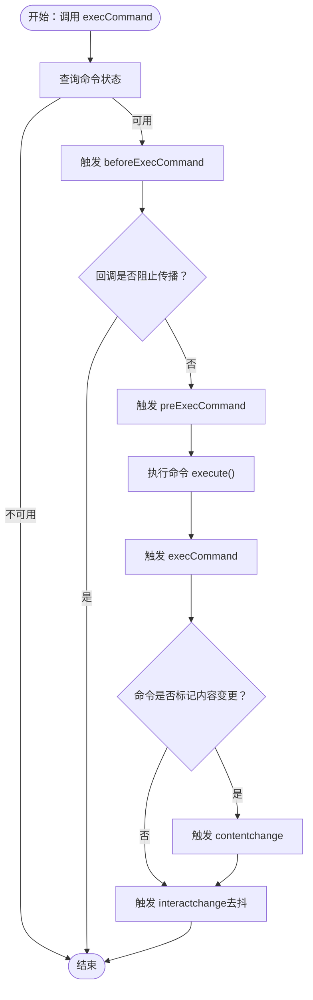
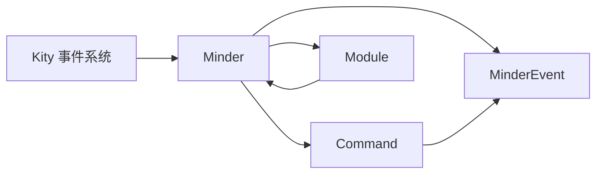

# 事件系统

<cite>
**本文引用的文件**
- [event.js](file://src/core/event.js)
- [minder.js](file://src/core/minder.js)
- [command.js](file://src/core/command.js)
- [module.js](file://src/core/module.js)
- [Architecture.md](file://doc/Architecture.md)
- [select.js](file://src/module/select.js)
- [shortcut.js](file://src/core/shortcut.js)
</cite>

## 目录
1. [引言](#引言)
2. [项目结构](#项目结构)
3. [核心组件](#核心组件)
4. [架构总览](#架构总览)
5. [详细组件分析](#详细组件分析)
6. [依赖分析](#依赖分析)
7. [性能考虑](#性能考虑)
8. [故障排查指南](#故障排查指南)
9. [结论](#结论)
10. [附录](#附录)

## 引言
本文件系统性梳理事件系统的设计与实现，重点解释其作为交互与状态变更通知机制的角色。文档覆盖事件分类（交互事件、命令事件、状态变更事件）、事件处理接口（on/once/off/fire）、事件对象（MinderEvent）的结构与方法、事件触发时机（命令事件仅在顶级命令执行时触发，contentchange/selectionchange在命令执行后根据变更情况触发），并通过 Architecture.md 中的代码示例说明事件系统与 Minder、Command、Module 的关联。

## 项目结构
事件系统位于核心层，围绕 Minder 类构建，通过模块化机制与命令系统协同工作。关键文件与职责如下：
- src/core/event.js：事件对象 MinderEvent 的定义、Minder 的事件绑定与分发、交互事件的三段式触发流程（before/pre/after）。
- src/core/minder.js：Minder 主类，提供构造与初始化钩子，承载事件系统入口。
- src/core/command.js：命令基类与命令执行流程，负责在命令执行前后触发事件并判定 contentchange/selectionchange。
- src/core/module.js：模块注册与生命周期，模块通过 events 字段订阅 Minder 事件。
- doc/Architecture.md：官方架构文档，给出事件分类、接口与触发时机的权威说明。
- src/module/select.js：选择模块示例，展示如何在事件回调中使用 MinderEvent 的方法（如 getTargetNode、getPosition）。
- src/core/shortcut.js：快捷键模块，展示如何在事件回调中判断快捷键组合。

图表来源
- [event.js](file://src/core/event.js#L1-L269)
- [minder.js](file://src/core/minder.js#L1-L41)
- [command.js](file://src/core/command.js#L1-L169)
- [module.js](file://src/core/module.js#L1-L151)
- [select.js](file://src/module/select.js#L1-L184)
- [shortcut.js](file://src/core/shortcut.js#L44-L88)
- [Architecture.md](file://doc/Architecture.md#L378-L430)

章节来源
- [event.js](file://src/core/event.js#L1-L269)
- [minder.js](file://src/core/minder.js#L1-L41)
- [command.js](file://src/core/command.js#L1-L169)
- [module.js](file://src/core/module.js#L1-L151)
- [Architecture.md](file://doc/Architecture.md#L378-L430)

## 核心组件
- MinderEvent：封装事件类型、来源事件（kityEvent/originEvent）、坐标与命中节点信息，并提供停止传播、阻止默认行为、判断右键、获取按键码等能力。
- Minder：负责事件绑定（纸面与窗口）、交互事件三段式触发（before/pre/after）、模块事件回调分发、事件注册/注销与主动触发。
- Command：命令基类，提供执行、状态查询、值查询与撤销能力；在命令执行前后触发命令事件，并根据是否内容/选区变更触发 contentchange/selectionchange。
- Module：模块注册与生命周期，模块通过 events 字段订阅 Minder 事件，模块初始化时将事件处理器绑定到 Minder。

章节来源
- [event.js](file://src/core/event.js#L1-L127)
- [event.js](file://src/core/event.js#L133-L266)
- [command.js](file://src/core/command.js#L1-L169)
- [module.js](file://src/core/module.js#L1-L151)

## 架构总览
事件系统围绕 Minder 的事件绑定与分发展开，交互事件通过 before/pre/after 三段式触发，命令事件在命令执行前后触发，状态变更事件在命令执行后根据变更情况触发。模块通过 events 字段订阅 Minder 事件，形成松耦合的扩展机制。

图表来源
- [event.js](file://src/core/event.js#L144-L192)
- [event.js](file://src/core/event.js#L162-L182)
- [command.js](file://src/core/command.js#L118-L165)
- [module.js](file://src/core/module.js#L83-L118)

## 详细组件分析

### 事件对象 MinderEvent
- 结构要点
  - type：事件类型（如 click、keydown、contentchange、selectionchange、before/after 前缀等）
  - kityEvent：若事件源自 Kity 形状事件，指向原始 Kity 事件
  - originEvent：若事件源自原生 DOM 事件，指向原始 DOM 事件
  - minder：事件产生时绑定到事件对象上的 Minder 实例
- 常用方法
  - getPosition(refer)：获取事件坐标，支持 screen/minder/指定形状坐标系
  - getTargetNode()：获取鼠标事件命中的节点
  - stopPropagation()/shouldStopPropagation()：阻止后续回调继续执行
  - stopPropagationImmediately()/shouldStopPropagationImmediately()：立即阻止传播
  - preventDefault()：阻止默认行为（针对原生事件）
  - isRightMB()：判断是否右键
  - getKeyCode()：获取按键码
- 与快捷键扩展
  - 通过扩展 MinderEvent 提供 isShortcutKey(keyCombine)，用于快捷键匹配

章节来源
- [event.js](file://src/core/event.js#L1-L127)
- [shortcut.js](file://src/core/shortcut.js#L44-L88)

### 事件处理接口
- on(name, callback)：注册事件回调，支持空格分隔的多事件名
- off(name, callback)：注销指定事件回调
- fire(type, params)：主动触发事件，params 合并到事件对象
- 分发策略
  - 事件名统一转小写
  - 若 Minder 处于状态，会同时匹配“状态.事件名”
  - 回调按注册顺序依次执行，遇到立即停止传播则中断

章节来源
- [event.js](file://src/core/event.js#L194-L266)

### 交互事件与触发时机
- 交互事件类型：click、dblclick、mousedown、mousemove、mouseup、keydown、keyup、keypress、touchstart、touchend、touchmove、mousewheel/DOMMouseScroll、resize 等
- 触发流程（三段式）
  - beforeX：允许回调阻止传播，阻止则不继续
  - preX：允许回调阻止传播，阻止则不继续
  - X：执行事件
  - afterX：事件完成后触发（不参与阻止传播）
- DOMMouseScroll 自动转换为 mousewheel 并注入 wheelDelta/wheelDeltaX/Y
- 交互变更事件（interactchange）
  - 通过内部调度在交互结束后触发，带去抖延迟

章节来源
- [event.js](file://src/core/event.js#L144-L192)
- [event.js](file://src/core/event.js#L162-L182)

### 命令事件与触发时机
- 命令事件类型：beforeExecCommand、preExecCommand、execCommand
- 触发时机
  - 仅在顶级命令执行时触发（嵌套命令不重复触发）
  - beforeExecCommand：进入命令执行前触发
  - preExecCommand：命令执行前触发
  - execCommand：命令执行后触发
  - contentchange/selectionchange：在命令执行后根据是否发生内容/选区变更触发
- 事件参数
  - e.commandName：命令名称
  - e.commandArgs：命令参数列表
  - e.command：命令对象

章节来源
- [command.js](file://src/core/command.js#L118-L165)
- [Architecture.md](file://doc/Architecture.md#L420-L429)

### 状态变更事件
- contentchange：命令执行后，若命令标记为内容变更，则触发
- selectionchange：命令执行后，若命令标记为选区变更，则触发
- interactchange：所有交互（鼠标/键盘/触摸）后触发，带去抖；可通过手动触发绕过去抖

章节来源
- [command.js](file://src/core/command.js#L140-L159)
- [event.js](file://src/core/event.js#L184-L192)
- [Architecture.md](file://doc/Architecture.md#L420-L429)

### 事件与模块的集成
- 模块通过 events 字段注册事件处理器，Minder 在初始化阶段将模块事件绑定到自身
- 模块可在事件回调中使用 MinderEvent 的方法（如 getTargetNode、getPosition、isShortcutKey）

章节来源
- [module.js](file://src/core/module.js#L83-L118)
- [select.js](file://src/module/select.js#L119-L181)
- [shortcut.js](file://src/core/shortcut.js#L44-L88)

### 事件触发时机流程图（命令执行）

图表来源
- [command.js](file://src/core/command.js#L118-L165)
- [event.js](file://src/core/event.js#L184-L192)

### 事件对象与方法使用示例（来自模块）
- 选择模块在事件回调中使用：
  - getTargetNode() 获取命中节点
  - getPosition() 获取坐标
  - isShortcutKey() 判断快捷键
- 快捷键模块在事件回调中使用：
  - isShortcutKey() 判断组合键

章节来源
- [select.js](file://src/module/select.js#L119-L181)
- [shortcut.js](file://src/core/shortcut.js#L44-L88)

## 依赖分析
- MinderEvent 依赖 Minder、Kity 事件系统，提供事件对象的统一抽象
- Minder 依赖 Paper/Kity 事件系统，负责事件绑定与分发
- Command 依赖 MinderEvent，负责在命令执行前后触发事件并判定变更
- Module 依赖 Minder，负责模块生命周期与事件订阅

图表来源
- [event.js](file://src/core/event.js#L144-L192)
- [command.js](file://src/core/command.js#L118-L165)
- [module.js](file://src/core/module.js#L83-L118)

章节来源
- [event.js](file://src/core/event.js#L133-L266)
- [command.js](file://src/core/command.js#L1-L169)
- [module.js](file://src/core/module.js#L1-L151)

## 性能考虑
- 交互事件去抖：interactchange 事件通过定时器去抖，避免频繁触发导致的性能问题
- 事件回调顺序：回调按注册顺序执行，建议减少回调内的重计算与重绘
- 命令事件仅在顶级命令执行时触发：避免嵌套命令重复触发带来的开销
- 事件对象复用：MinderEvent 在构造时合并参数，尽量避免在回调中频繁创建新对象

## 故障排查指南
- 事件未触发
  - 检查事件名大小写与拼写，Minder 会统一转小写
  - 确认模块是否正确注册 events，确保模块初始化完成
- 事件被提前阻止
  - 回调中调用 stopPropagation 或 stopPropagationImmediately 将阻止后续回调执行
  - 检查 before/pre 阶段是否返回或调用阻止传播
- 坐标获取异常
  - getPosition() 需要有效的 kityEvent 或 refer 参数
  - 确保在正确的坐标系（screen/minder/形状）下调用
- 快捷键判断失败
  - 确保使用 MinderEvent 的 isShortcutKey()，并传入正确的组合键字符串
- 命令事件未触发
  - 确认命令状态可用（queryCommandState 返回非禁用）
  - 确认未在嵌套命令中误判为顶级命令

章节来源
- [event.js](file://src/core/event.js#L194-L266)
- [command.js](file://src/core/command.js#L118-L165)
- [shortcut.js](file://src/core/shortcut.js#L44-L88)

## 结论
事件系统通过 MinderEvent 统一事件抽象，结合 Minder 的事件绑定与分发机制，为交互事件、命令事件与状态变更事件提供了清晰的触发与处理路径。命令系统在执行前后触发命令事件，并根据内容/选区变更触发相应的状态事件，模块通过 events 字段订阅这些事件，形成松耦合的扩展体系。开发者应遵循事件触发时机与接口约定，合理使用事件对象方法，以获得稳定高效的交互体验。

## 附录
- 事件分类与接口（摘自架构文档）
  - 交互事件：click、dblclick、mousedown、mousemove、mouseup、keydown、keyup、keypress、touchstart、touchend、touchmove
  - 命令事件：beforeExecCommand、preExecCommand、execCommand
  - 状态变更事件：contentchange、selectionchange、interactchange
  - 模块事件：模块自行触发与上述不同名的事件
  - 接口：on(event, callback)、off(event, callback)、fire(event, params)

章节来源
- [Architecture.md](file://doc/Architecture.md#L378-L430)