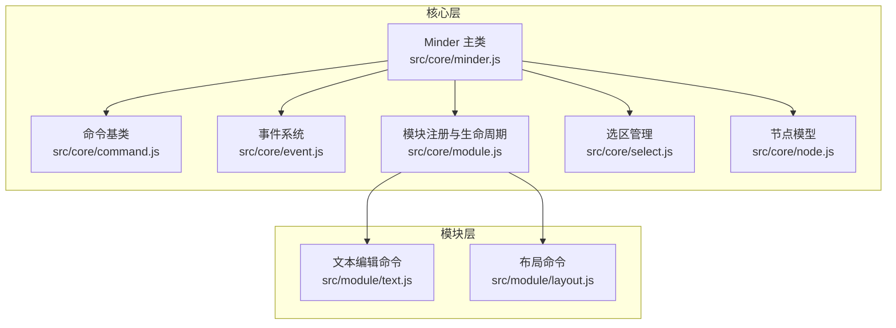
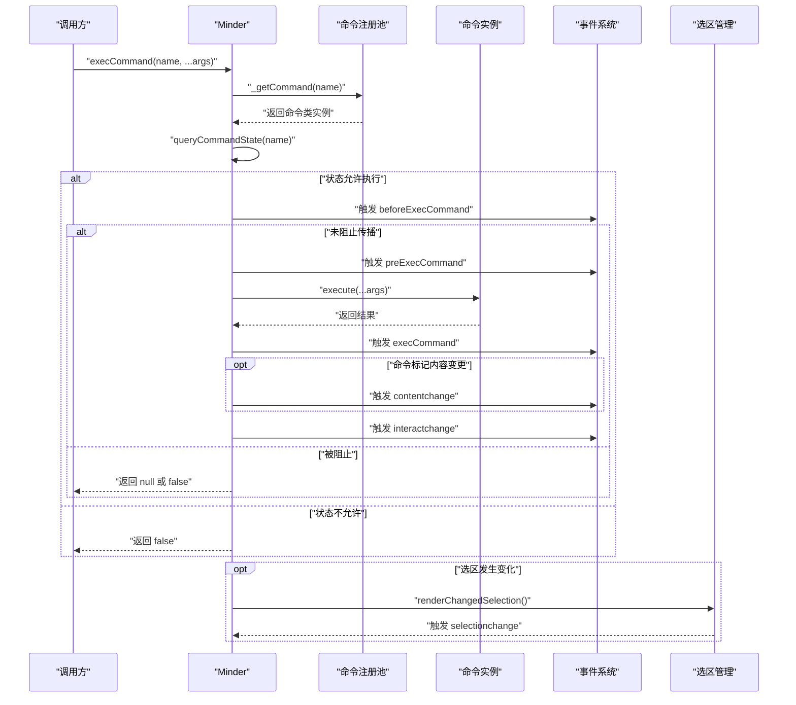
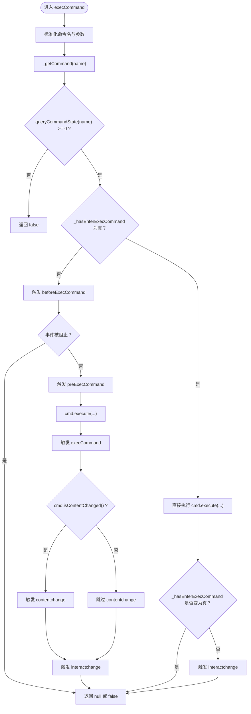
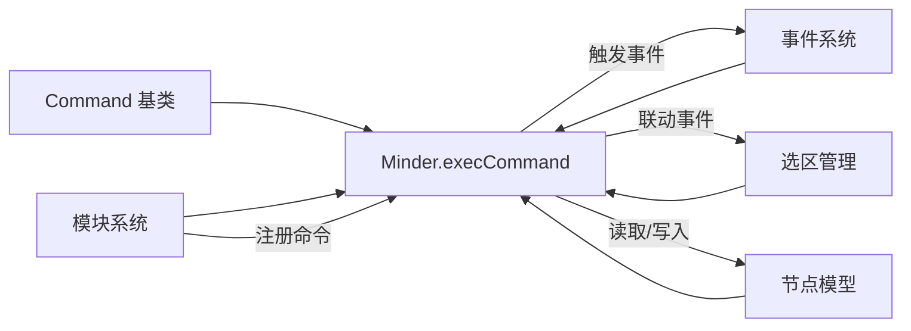

# 命令执行机制

<cite>
**本文引用的文件**
- [doc/Architecture.md](file://doc/Architecture.md)
- [src/core/command.js](file://src/core/command.js)
- [src/core/event.js](file://src/core/event.js)
- [src/core/module.js](file://src/core/module.js)
- [src/core/minder.js](file://src/core/minder.js)
- [src/core/select.js](file://src/core/select.js)
- [src/core/node.js](file://src/core/node.js)
- [src/module/text.js](file://src/module/text.js)
- [src/module/layout.js](file://src/module/layout.js)
</cite>

## 目录
1. [引言](#引言)
2. [项目结构](#项目结构)
3. [核心组件](#核心组件)
4. [架构总览](#架构总览)
5. [详细组件分析](#详细组件分析)
6. [依赖分析](#依赖分析)
7. [性能考虑](#性能考虑)
8. [故障排查指南](#故障排查指南)
9. [结论](#结论)
10. [附录](#附录)

## 引言
本文件围绕 KityMinder 的命令执行机制展开，系统性阐述从调用 execCommand() 开始，到命令实例获取、状态校验、事件触发、命令执行、返回值处理，以及防重进入与嵌套执行的完整流程。同时结合 Architecture.md 中对 Minder 类公开接口与事件系统的说明，解释命令执行与 contentchange、selectionchange、interactchange 之间的联动关系，并给出节点编辑、布局切换等典型命令的执行路径与返回值处理策略。

## 项目结构
KityMinder 的命令执行涉及核心层与模块层协同：
- 核心层提供命令基类、Minder 主类、事件系统、模块注册与生命周期管理。
- 模块层提供具体命令实现（如文本编辑、布局切换等），并通过模块注册进入命令池。

图表来源
- [src/core/command.js](file://src/core/command.js#L1-L169)
- [src/core/minder.js](file://src/core/minder.js#L1-L41)
- [src/core/event.js](file://src/core/event.js#L1-L270)
- [src/core/module.js](file://src/core/module.js#L1-L151)
- [src/core/select.js](file://src/core/select.js#L1-L45)
- [src/core/node.js](file://src/core/node.js#L1-L200)
- [src/module/text.js](file://src/module/text.js#L1-L289)
- [src/module/layout.js](file://src/module/layout.js#L1-L92)

章节来源
- [doc/Architecture.md](file://doc/Architecture.md#L308-L431)
- [src/core/command.js](file://src/core/command.js#L1-L169)
- [src/core/module.js](file://src/core/module.js#L1-L151)

## 核心组件
- 命令基类 Command：定义命令的执行、状态查询、值查询、是否需要撤销等约定，提供 isContentChanged()/isSelectionChanged() 等标记。
- Minder.execCommand()：统一的命令入口，负责命令实例获取、状态校验、事件分发、执行与联动事件触发。
- 事件系统 MinderEvent：封装事件对象，支持阻止传播、获取坐标、命中节点等能力；提供 _fire/_interactChange 等内部机制。
- 模块系统 Module：负责命令注册、事件绑定、渲染器注册等，将模块命令注入 Minder 的命令池。
- 选区管理：在选区变化时触发交互事件与 selectionchange 事件，影响命令执行后的联动。

章节来源
- [src/core/command.js](file://src/core/command.js#L1-L169)
- [src/core/event.js](file://src/core/event.js#L1-L270)
- [src/core/module.js](file://src/core/module.js#L1-L151)
- [src/core/select.js](file://src/core/select.js#L1-L45)

## 架构总览
命令执行的总体流程如下：

图表来源
- [src/core/command.js](file://src/core/command.js#L118-L169)
- [src/core/event.js](file://src/core/event.js#L162-L231)
- [src/core/select.js](file://src/core/select.js#L1-L45)

## 详细组件分析

### Minder.execCommand() 执行流程
- 输入参数标准化：将命令名转为小写，提取参数数组。
- 命令实例获取：通过 _getCommand(name) 从命令池中取得命令类实例。
- 状态校验：调用 queryCommandState(name) 判断命令是否可用；若不可用直接返回 false。
- 防重进入与嵌套执行：
  - 首次进入时设置 _hasEnterExecCommand 标志，触发 beforeExecCommand；若未阻止传播，继续触发 preExecCommand。
  - 执行命令 cmd.execute(...) 并记录返回值；随后触发 execCommand。
  - 若命令标记内容变更（isContentChanged()），触发 contentchange；最后触发 interactchange。
  - 退出时清除 _hasEnterExecCommand 标志。
  - 若在已有执行上下文中再次调用 execCommand，直接执行命令并按需触发 interactchange，避免重复触发顶层事件。
- 返回值处理：若命令返回 undefined，统一转换为 null；否则返回命令返回值。

图表来源
- [src/core/command.js](file://src/core/command.js#L118-L169)

章节来源
- [src/core/command.js](file://src/core/command.js#L118-L169)

### 命令状态查询与值查询
- queryCommandState(name)：通过 _queryCommand(name, 'State', args) 调用命令的 queryState，返回 -1/0/1 表示禁用/可用/已执行。
- queryCommandValue(name)：通过 _queryCommand(name, 'Value', args) 调用命令的 queryValue，返回命令相关值（如当前布局名、节点文本等）。

章节来源
- [src/core/command.js](file://src/core/command.js#L73-L106)

### 事件系统与联动
- 事件对象 MinderEvent：支持阻止传播、获取坐标、命中节点等能力。
- 交互事件分发：_firePharse 将原始交互事件包装为 before/pre/execute/after 系列事件，统一触发。
- 交互变更稀释：_interactChange 通过定时器对交互事件进行稀释，避免频繁触发；命令手动触发时不稀释。
- 顶层命令事件：beforeExecCommand、preExecCommand、execCommand 在顶级命令执行时触发，且仅在顶级命令触发（命令内部再调用命令不重复触发）。
- 内容变更与选区变更：contentchange 在顶级命令后根据 isContentChanged() 触发；selectionchange 在选区变化时触发。

章节来源
- [src/core/event.js](file://src/core/event.js#L1-L270)
- [doc/Architecture.md](file://doc/Architecture.md#L374-L431)

### 模块注册与命令池
- 模块注册：Module.register(name, module) 将模块登记到模块池。
- 初始化阶段：Minder 初始化钩子中调用 _initModules()，遍历模块，将 commands 注入 Minder 的 _commands 命令池（键名小写化）。
- 事件绑定：模块 events 字段中的事件回调通过 on() 绑定到 Minder 实例。
- 渲染器注册：模块 renderers 字段注册渲染器类，供节点渲染使用。

章节来源
- [src/core/module.js](file://src/core/module.js#L1-L151)

### 防重进入机制与嵌套执行
- 标志位：_hasEnterExecCommand 用于判断是否已在命令执行上下文中。
- 首次进入：设置标志位，触发 beforeExecCommand；若未阻止，触发 preExecCommand，执行命令，触发 execCommand，随后根据内容变更与交互变更触发 contentchange 与 interactchange。
- 嵌套执行：若在已有执行上下文中再次调用 execCommand，直接执行命令；当标志位退出为真时，再触发一次 interactchange，确保外部观察者收到最终交互信号。

章节来源
- [src/core/command.js](file://src/core/command.js#L137-L165)

### 选区变化与 selectionchange
- 选区变化检测：renderChangedSelection() 比较前后选区差异，若存在变化则触发 interactchange 与 selectionchange。
- selectionchange 事件携带 currentSelection/additionNodes/removalNodes 等信息，便于 UI 同步。

章节来源
- [src/core/select.js](file://src/core/select.js#L1-L45)
- [doc/Architecture.md](file://doc/Architecture.md#L414-L429)

### 命令返回值处理机制
- execCommand 返回值：若命令返回 undefined，统一转换为 null；否则返回命令返回值。
- 典型命令返回值：
  - 文本编辑命令：返回当前节点文本或空值。
  - 布局切换命令：返回当前节点布局名或空值。
  - 其他命令：根据具体实现返回相应值（如布尔、字符串、对象等）。

章节来源
- [src/core/command.js](file://src/core/command.js#L163-L165)
- [src/module/text.js](file://src/module/text.js#L245-L262)
- [src/module/layout.js](file://src/module/layout.js#L25-L45)

### 实际命令示例

#### 节点编辑命令（文本编辑）
- 命令类：TextCommand（位于模块 text.js）
- 执行流程：
  - 选中单个节点时，queryState 返回可用；否则禁用。
  - 执行时设置节点文本、渲染节点、触发布局更新。
  - 返回值：queryValue 返回当前节点文本。
- 事件联动：
  - 若命令标记内容变更，将触发 contentchange。
  - 交互结束后触发 interactchange。

章节来源
- [src/module/text.js](file://src/module/text.js#L245-L262)
- [src/core/command.js](file://src/core/command.js#L149-L151)

#### 布局切换命令（布局模块）
- 命令类：LayoutCommand（位于模块 layout.js）
- 执行流程：
  - 选中有布局节点时，queryState 返回可用；否则禁用。
  - 执行时对选中节点应用布局名称；queryValue 返回首个选中节点的布局名。
- 事件联动：
  - 若命令标记内容变更，将触发 contentchange。
  - 交互结束后触发 interactchange。

章节来源
- [src/module/layout.js](file://src/module/layout.js#L25-L45)
- [src/core/command.js](file://src/core/command.js#L149-L151)

## 依赖分析
- Minder 依赖命令基类、事件系统、模块系统、选区管理与节点模型。
- 命令基类通过 kity.extendClass 将 _getCommand、_queryCommand、queryCommandState、queryCommandValue、execCommand 等方法挂载到 Minder。
- 模块系统在初始化时将各模块的 commands 注入 Minder 的命令池，形成命令名到命令实例的映射。
- 事件系统提供统一的事件分发与稀释机制，支撑命令执行前后与交互后的事件触发。

图表来源
- [src/core/command.js](file://src/core/command.js#L58-L169)
- [src/core/event.js](file://src/core/event.js#L133-L231)
- [src/core/module.js](file://src/core/module.js#L83-L118)
- [src/core/select.js](file://src/core/select.js#L1-L45)
- [src/core/node.js](file://src/core/node.js#L1-L200)

章节来源
- [src/core/command.js](file://src/core/command.js#L58-L169)
- [src/core/module.js](file://src/core/module.js#L83-L118)
- [src/core/event.js](file://src/core/event.js#L133-L231)

## 性能考虑
- 事件稀释：_interactChange 通过定时器对交互事件进行稀释，减少高频交互导致的重复渲染与事件风暴。
- 命令执行上下文：防重进入机制避免在命令执行过程中重复触发顶层事件，降低不必要的事件链路开销。
- 选区变化检测：仅在选区确实发生变化时触发 selectionchange，避免无意义的 UI 更新。
- 布局与渲染：命令执行后按需触发布局与渲染，避免全局刷新。

[本节为通用建议，无需特定文件来源]

## 故障排查指南
- 命令未执行：
  - 检查命令名大小写与注册是否一致（模块注册时键名小写化）。
  - 检查 queryCommandState 返回值，确认命令处于可用状态。
- 事件未触发：
  - 确认是否在顶层命令执行上下文中（命令内部再调用命令不会重复触发顶层事件）。
  - 检查 beforeExecCommand 是否被阻止传播。
- 未触发 contentchange：
  - 确认命令是否标记内容变更（isContentChanged()）。
- 未触发 selectionchange：
  - 确认选区确实发生变化（renderChangedSelection）。
- 交互事件过于频繁：
  - 确认 _interactChange 的稀释机制生效；若需立即触发，可手动调用。

章节来源
- [src/core/command.js](file://src/core/command.js#L118-L169)
- [src/core/event.js](file://src/core/event.js#L184-L192)
- [src/core/select.js](file://src/core/select.js#L1-L45)

## 结论
KityMinder 的命令执行机制以 Minder.execCommand() 为核心，通过命令基类约定、模块注册注入、事件系统分发与稀释、选区变化检测等机制，构建了清晰、可控、可扩展的命令执行链路。防重进入与嵌套执行处理保证了命令执行的稳定性，而 contentchange、selectionchange、interactchange 的联动则确保了 UI 与数据状态的一致性。典型命令（如文本编辑、布局切换）遵循统一的执行与返回值处理规范，便于扩展与维护。

[本节为总结，无需特定文件来源]

## 附录
- Minder 公开接口要点（摘自 Architecture.md）：
  - execCommand(name, ...args)：执行指定命令。
  - queryCommandState(name)：查询命令状态。
  - queryCommandValue(name)：查询命令当前值。
  - 事件：beforeExecCommand、preExecCommand、execCommand、contentchange、selectionchange、interactchange 等。

章节来源
- [doc/Architecture.md](file://doc/Architecture.md#L324-L431)