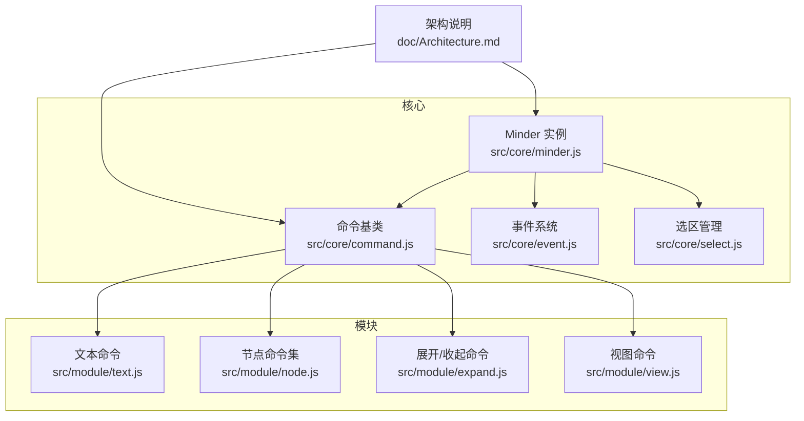
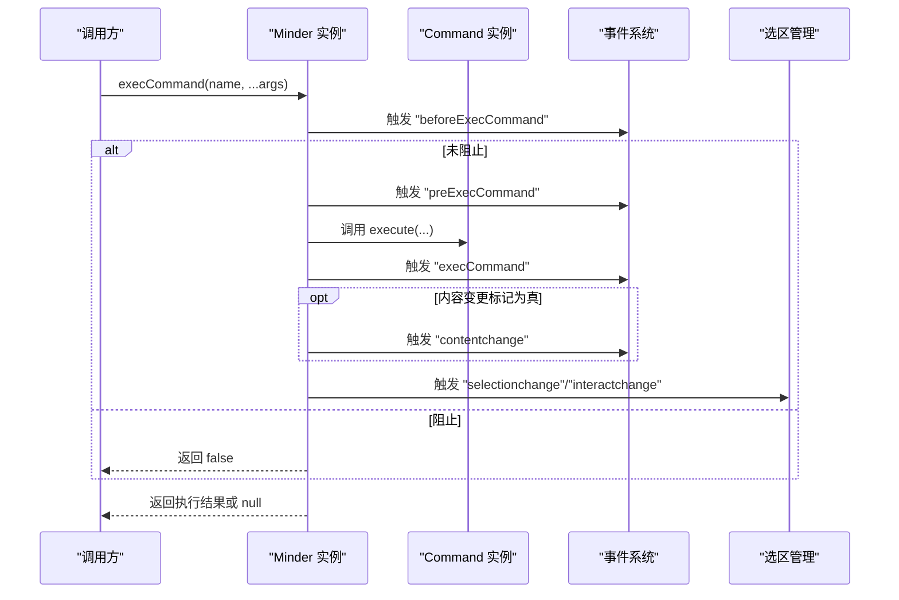
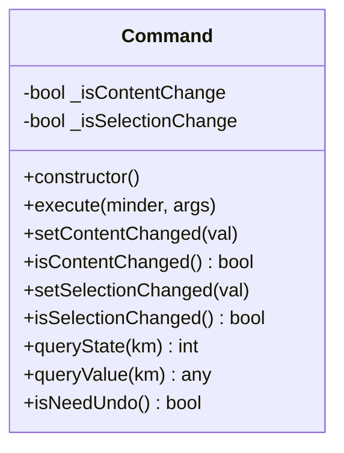
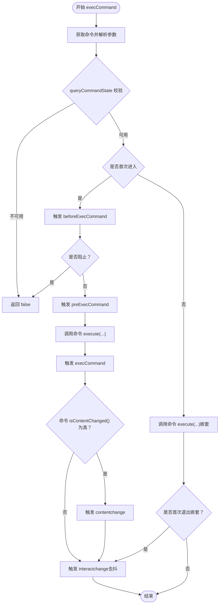
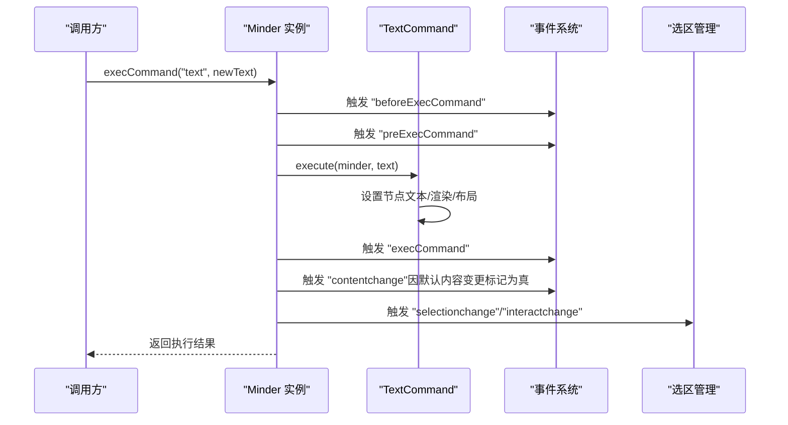
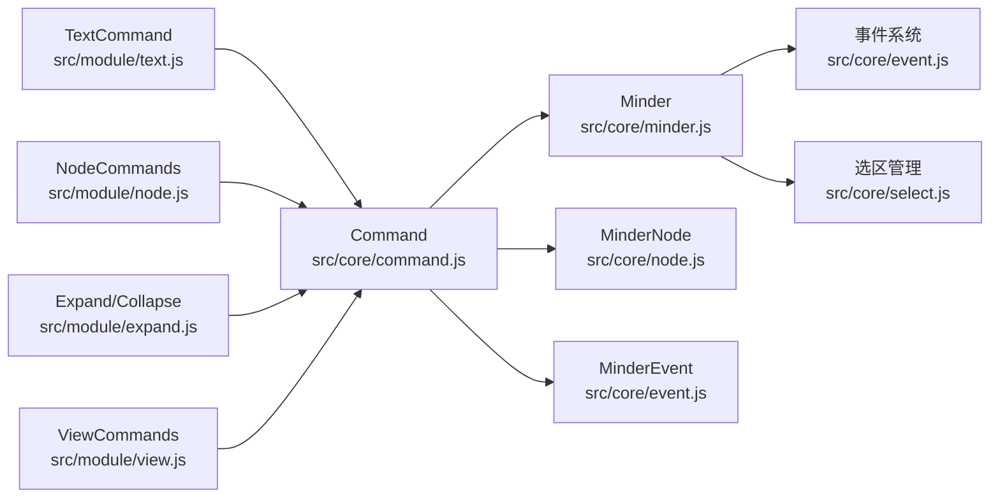

# 命令生命周期

<cite>
**本文引用的文件**
- [doc/Architecture.md](file://doc/Architecture.md)
- [src/core/command.js](file://src/core/command.js)
- [src/core/event.js](file://src/core/event.js)
- [src/core/minder.js](file://src/core/minder.js)
- [src/core/select.js](file://src/core/select.js)
- [src/module/text.js](file://src/module/text.js)
- [src/module/node.js](file://src/module/node.js)
- [src/module/expand.js](file://src/module/expand.js)
- [src/module/view.js](file://src/module/view.js)
</cite>

## 目录
1. [引言](#引言)
2. [项目结构](#项目结构)
3. [核心组件](#核心组件)
4. [架构总览](#架构总览)
5. [详细组件分析](#详细组件分析)
6. [依赖分析](#依赖分析)
7. [性能考量](#性能考量)
8. [故障排查指南](#故障排查指南)
9. [结论](#结论)

## 引言
本篇文档围绕命令的完整生命周期展开，系统阐述从命令创建、执行、状态管理到事件触发与撤销栈联动的全过程。重点解析 Command 基类的构造初始化逻辑、内容变更标记与选区变更标记的默认行为，以及 setContentChanged()/isContentChanged()、setSelectionChanged()/isSelectionChanged() 在事务管理中的作用与影响。同时结合 Architecture.md 中对 Command 的定义，阐明命令生命周期与 Minder 实例事件流（beforeExecCommand、execCommand、contentchange 等）的集成方式，并通过真实案例说明修改节点文本的命令如何正确设置变更标记，以及这些标记如何影响撤销栈与界面更新。

## 项目结构
围绕命令生命周期的关键文件分布如下：
- 命令基类与执行流程：src/core/command.js
- 事件系统与交互事件传播：src/core/event.js
- 选区变更与 selectionchange 事件：src/core/select.js
- 文本编辑命令示例：src/module/text.js
- 节点增删改命令示例：src/module/node.js
- 展开/收起命令与 contentchange 触发：src/module/expand.js
- 视图命令与 contentchange 控制：src/module/view.js
- 架构说明与事件触发时机：doc/Architecture.md

图表来源
- [src/core/command.js](file://src/core/command.js#L1-L169)
- [src/core/event.js](file://src/core/event.js#L1-L270)
- [src/core/select.js](file://src/core/select.js#L1-L79)
- [src/module/text.js](file://src/module/text.js#L245-L289)
- [src/module/node.js](file://src/module/node.js#L1-L150)
- [src/module/expand.js](file://src/module/expand.js#L1-L294)
- [src/module/view.js](file://src/module/view.js#L214-L397)
- [doc/Architecture.md](file://doc/Architecture.md#L374-L431)

章节来源
- [doc/Architecture.md](file://doc/Architecture.md#L144-L197)
- [src/core/command.js](file://src/core/command.js#L1-L169)

## 核心组件
- Command 基类：定义命令的执行骨架、状态查询、值查询、撤销能力，以及内容/选区变更标记的设置与查询。
- Minder.execCommand：统一调度命令执行，串联 beforeExecCommand、preExecCommand、execCommand 三个阶段事件，并根据变更标记触发 contentchange、selectionchange 与 interactchange。
- 事件系统：负责事件分发、传播控制与去抖触发（interactchange）。
- 选区管理：在选区发生变化时触发 selectionchange 与 interactchange。
- 典型命令模块：文本编辑、节点增删改、展开/收起、视图移动等，均通过 Command 基类实现。

章节来源
- [src/core/command.js](file://src/core/command.js#L1-L169)
- [src/core/event.js](file://src/core/event.js#L1-L270)
- [src/core/select.js](file://src/core/select.js#L1-L79)
- [doc/Architecture.md](file://doc/Architecture.md#L374-L431)

## 架构总览
命令生命周期与 Minder 事件流的集成关系如下：

图表来源
- [src/core/command.js](file://src/core/command.js#L118-L166)
- [src/core/event.js](file://src/core/event.js#L162-L231)
- [src/core/select.js](file://src/core/select.js#L1-L79)
- [doc/Architecture.md](file://doc/Architecture.md#L374-L431)

## 详细组件分析

### Command 基类与构造初始化
- 构造函数初始化
  - 内容变更标记默认为真，表示命令通常会改变内容。
  - 选区变更标记默认为假，表示命令通常不改变选区。
- 变更标记 API
  - setContentChanged(bool)：显式设置内容变更标记。
  - isContentChanged()：查询内容变更标记。
  - setSelectionChanged(bool)：显式设置选区变更标记。
  - isSelectionChanged()：查询选区变更标记。
- 注意：当前 isSelectionChanged() 返回的是内容变更标记，而非选区变更标记，这在后续分析中需特别留意。

图表来源
- [src/core/command.js](file://src/core/command.js#L1-L57)

章节来源
- [src/core/command.js](file://src/core/command.js#L1-L57)

### Minder.execCommand 的执行流程与事件集成
- 参数解析与命令获取
  - 将命令名转为小写，提取参数数组。
- 状态校验
  - 通过 queryCommandState 校验命令可用性，不可用则返回 false。
- 事件触发序列
  - 未进入 execCommand 时，先触发 beforeExecCommand；若未阻止，再触发 preExecCommand。
  - 调用命令 execute(...) 并记录返回值。
  - 触发 execCommand。
  - 若命令 isContentChanged() 为真，触发 contentchange。
  - 触发 interactchange（去抖）。
- 嵌套命令
  - 使用内部标志避免递归触发顶层事件；嵌套命令仅执行 execute 并在必要时触发 interactchange。

图表来源
- [src/core/command.js](file://src/core/command.js#L118-L166)
- [src/core/event.js](file://src/core/event.js#L162-L231)

章节来源
- [src/core/command.js](file://src/core/command.js#L118-L166)
- [doc/Architecture.md](file://doc/Architecture.md#L374-L431)

### 事件系统与交互事件传播
- 事件分发与传播
  - _firePharse 将原生事件转换为 MinderEvent，并依次触发 beforeX、preX、X、afterX 系列事件。
  - 通过 stopPropagation/stopPropagationImmediately 控制传播。
- interactchange 去抖
  - _interactChange 使用定时器对交互事件进行去抖，避免频繁触发。
- selectionchange 与 contentchange
  - selectionchange 由选区管理在选区变化时触发。
  - contentchange 由命令执行后根据 isContentChanged() 触发。

章节来源
- [src/core/event.js](file://src/core/event.js#L162-L231)
- [src/core/select.js](file://src/core/select.js#L1-L79)
- [doc/Architecture.md](file://doc/Architecture.md#L374-L431)

### 选区变更与 selectionchange 事件
- 选区变更检测
  - renderChangedSelection 比较前后选区差异，若存在变化则触发 selectionchange。
- selectionchange 事件参数
  - currentSelection、additionNodes、removalNodes 等由架构文档定义。

章节来源
- [src/core/select.js](file://src/core/select.js#L1-L79)
- [doc/Architecture.md](file://doc/Architecture.md#L414-L429)

### 文本编辑命令：修改节点文本的生命周期
- 命令定义
  - TextCommand 继承 Command，执行时设置节点文本、渲染节点并布局。
- 变更标记
  - 该命令未显式设置内容/选区变更标记，因此默认行为遵循基类初始化：
    - 内容变更标记默认为真，会触发 contentchange。
    - 选区变更标记默认为假，不会触发 selectionchange。
- 案例要点
  - 若希望避免触发 contentchange，可在命令执行前显式调用 setContentChanged(false)。
  - 若命令仅改变选区而不改变内容，应设置 setSelectionChanged(true)，但注意当前 isSelectionChanged() 返回的是内容变更标记，需谨慎使用。

图表来源
- [src/module/text.js](file://src/module/text.js#L245-L289)
- [src/core/command.js](file://src/core/command.js#L118-L166)
- [src/core/event.js](file://src/core/event.js#L162-L231)
- [src/core/select.js](file://src/core/select.js#L1-L79)

章节来源
- [src/module/text.js](file://src/module/text.js#L245-L289)
- [src/core/command.js](file://src/core/command.js#L1-L57)

### 节点增删改命令：撤销栈与界面更新
- 增加/删除/调整节点的命令均继承 Command，执行时会渲染节点、布局或调整选区。
- 撤销能力
  - 基类默认 isNeedUndo() 为真，表示命令可撤销；若命令不可撤销，应在子类中覆盖该方法。
- 界面更新
  - 命令执行后会触发 contentchange（若内容变更标记为真）与 interactchange，驱动渲染与布局。

章节来源
- [src/module/node.js](file://src/module/node.js#L1-L150)
- [src/core/command.js](file://src/core/command.js#L49-L57)

### 展开/收起命令：contentchange 的显式触发
- 交互层触发
  - 在展开/收起控件点击或快捷键触发时，会显式 fire('contentchange')，确保界面更新与撤销栈记录。
- 命令层行为
  - 命令执行后同样受 isContentChanged() 影响是否触发 contentchange。

章节来源
- [src/module/expand.js](file://src/module/expand.js#L140-L160)
- [src/module/expand.js](file://src/module/expand.js#L228-L242)

### 视图命令：contentchange 的抑制
- 视图移动/相机定位命令在执行后显式 setContentChanged(false)，以避免将视图移动误判为内容变更。
- 这体现了“变更标记”的语义化使用：仅当确实改变了内容或选区时才触发对应事件。

章节来源
- [src/module/view.js](file://src/module/view.js#L214-L230)

## 依赖分析
- 命令基类依赖
  - Command 依赖 Minder、MinderNode、MinderEvent 与 utils。
- Minder 依赖
  - Minder 通过扩展方法挂载命令查询与执行逻辑，并与事件系统协作。
- 事件系统
  - 事件系统负责事件分发、传播控制与去抖，为命令生命周期提供统一的事件通道。
- 选区管理
  - 选区变化时触发 selectionchange 与 interactchange，与命令生命周期形成互补。

图表来源
- [src/core/command.js](file://src/core/command.js#L1-L169)
- [src/core/event.js](file://src/core/event.js#L1-L270)
- [src/core/select.js](file://src/core/select.js#L1-L79)
- [src/module/text.js](file://src/module/text.js#L245-L289)
- [src/module/node.js](file://src/module/node.js#L1-L150)
- [src/module/expand.js](file://src/module/expand.js#L1-L294)
- [src/module/view.js](file://src/module/view.js#L214-L397)

章节来源
- [src/core/command.js](file://src/core/command.js#L1-L169)
- [src/core/event.js](file://src/core/event.js#L1-L270)
- [src/core/select.js](file://src/core/select.js#L1-L79)

## 性能考量
- 事件去抖：interactchange 通过定时器去抖，减少高频交互事件对渲染与布局的影响。
- 嵌套命令：execCommand 对嵌套场景进行保护，避免重复触发顶层事件，降低不必要的事件风暴。
- 变更标记：合理设置内容/选区变更标记，有助于减少无关事件触发，提升性能与一致性。

## 故障排查指南
- 命令未触发 contentchange
  - 检查命令是否显式 setContentChanged(false)。
  - 确认 isContentChanged() 的返回值是否符合预期。
- 命令错误地触发 selectionchange
  - 注意 isSelectionChanged() 当前返回内容变更标记，若命令仅改变选区，请谨慎使用 setSelectionChanged。
- 命令执行后未触发撤销
  - 检查命令是否覆盖 isNeedUndo() 并返回 false。
- 事件被提前阻止
  - 检查 beforeExecCommand 是否被阻止（stopPropagationImmediately）。

章节来源
- [src/core/command.js](file://src/core/command.js#L1-L57)
- [src/core/command.js](file://src/core/command.js#L118-L166)
- [src/core/event.js](file://src/core/event.js#L162-L231)

## 结论
命令生命周期以 Command 基类为核心，通过 Minder.execCommand 将命令执行与事件系统紧密耦合。内容变更标记与选区变更标记在事务管理中扮演关键角色：前者决定是否触发 contentchange，后者决定是否触发 selectionchange。实践中应根据命令的实际行为合理设置变更标记，避免误触发事件，确保撤销栈与界面更新的一致性。通过文本编辑、节点增删改、展开/收起与视图命令等典型场景，可以有效验证与巩固对命令生命周期的理解与应用。