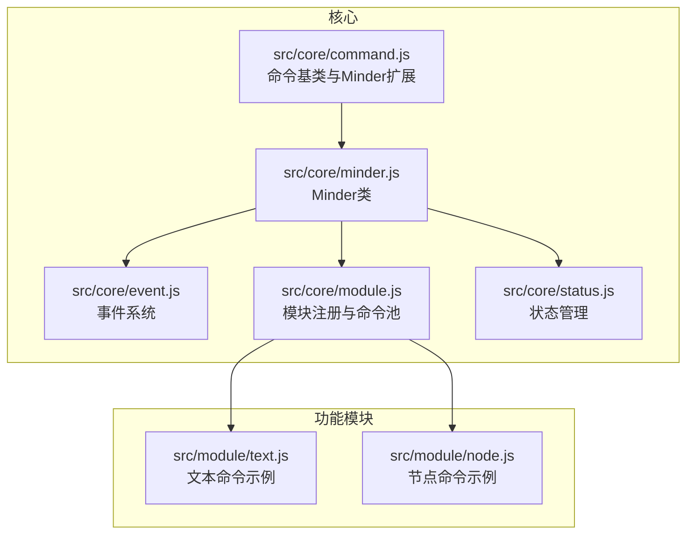
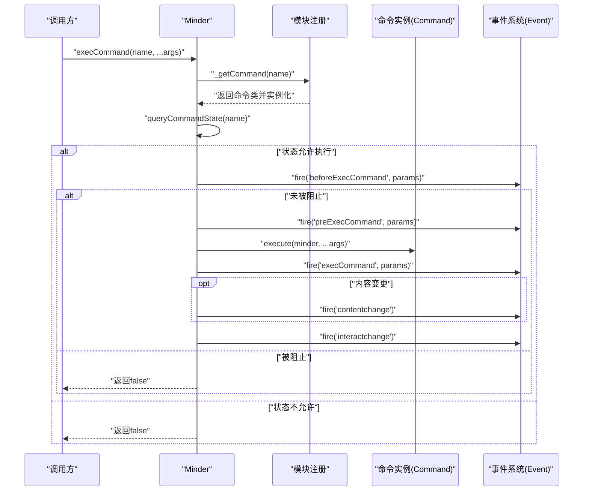
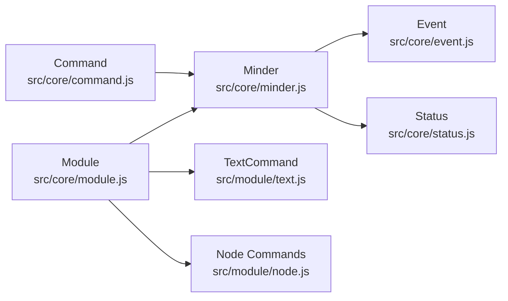

# 命令系统

<cite>
**本文引用的文件**
- [Architecture.md](file://doc/Architecture.md)
- [command.js](file://src/core/command.js)
- [module.js](file://src/core/module.js)
- [minder.js](file://src/core/minder.js)
- [event.js](file://src/core/event.js)
- [status.js](file://src/core/status.js)
- [text.js](file://src/module/text.js)
- [node.js](file://src/module/node.js)
</cite>

## 目录
1. [引言](#引言)
2. [项目结构](#项目结构)
3. [核心组件](#核心组件)
4. [架构总览](#架构总览)
5. [详细组件分析](#详细组件分析)
6. [依赖分析](#依赖分析)
7. [性能考虑](#性能考虑)
8. [故障排查指南](#故障排查指南)
9. [结论](#结论)

## 引言
本章节围绕命令系统展开，系统性阐述命令作为“可撤销操作”的基础设计，重点包括：
- Command 基类的 execute() 与 revert() 机制
- 如何通过继承 Command 创建自定义命令
- 命令状态管理：queryState() 返回 -1（不可执行）、0（可执行）、1（已执行）的逻辑
- 命令内容变更标记 setContentChanged()/isContentChanged() 与选区变更标记 setSelectionChanged()/isSelectionChanged() 的机制
- 命令执行流程：execCommand() 如何实例化命令并执行，以及命令执行后如何触发 beforeExecCommand、preExecCommand、execCommand、contentchange、interactchange 等事件
- 结合 Architecture.md 中的代码示例，说明命令系统与 Minder、Event 等系统的关联

## 项目结构
命令系统位于核心模块中，围绕 Command 基类、Minder 的命令注册与执行、事件系统联动以及模块化命令注册展开。下图给出与命令系统直接相关的文件与职责概览：

图表来源
- [command.js](file://src/core/command.js#L1-L169)
- [module.js](file://src/core/module.js#L1-L151)
- [minder.js](file://src/core/minder.js#L1-L41)
- [event.js](file://src/core/event.js#L1-L270)
- [status.js](file://src/core/status.js#L1-L60)
- [text.js](file://src/module/text.js#L1-L289)
- [node.js](file://src/module/node.js#L1-L150)

章节来源
- [command.js](file://src/core/command.js#L1-L169)
- [module.js](file://src/core/module.js#L1-L151)
- [minder.js](file://src/core/minder.js#L1-L41)
- [event.js](file://src/core/event.js#L1-L270)
- [status.js](file://src/core/status.js#L1-L60)
- [text.js](file://src/module/text.js#L1-L289)
- [node.js](file://src/module/node.js#L1-L150)

## 核心组件
- 命令基类 Command：定义命令的统一接口，包括 execute()、revert()、queryState()、queryValue()、isContentChanged()/setContentChanged()、isSelectionChanged()/setSelectionChanged() 等。同时提供状态常量 STATE_NORMAL、STATE_ACTIVE、STATE_DISABLED。
- Minder：扩展命令查询与执行能力，提供 queryCommandState()、queryCommandValue()、execCommand()，并在执行前后触发事件。
- 事件系统 Event：提供 MinderEvent，支持事件传播控制、停止传播、阻止默认行为等，命令执行链路中通过事件钩子实现拦截与扩展。
- 模块系统 Module：负责模块初始化、命令注册到 Minder 的命令池，形成“模块 -> 命令类 -> 命令实例”的注册链路。
- 状态管理 Status：提供状态切换与回滚能力，事件系统在触发时会结合当前状态分发事件。

章节来源
- [command.js](file://src/core/command.js#L1-L169)
- [minder.js](file://src/core/minder.js#L1-L41)
- [event.js](file://src/core/event.js#L1-L270)
- [module.js](file://src/core/module.js#L1-L151)
- [status.js](file://src/core/status.js#L1-L60)

## 架构总览
命令系统围绕“模块注册命令 -> Minder持有命令池 -> 执行命令触发事件 -> 更新内容/选区 -> 触发contentchange/interactchange”的闭环工作。下图展示命令执行的关键路径与事件流：

图表来源
- [command.js](file://src/core/command.js#L118-L166)
- [module.js](file://src/core/module.js#L83-L117)
- [event.js](file://src/core/event.js#L162-L192)

章节来源
- [command.js](file://src/core/command.js#L118-L166)
- [module.js](file://src/core/module.js#L83-L117)
- [event.js](file://src/core/event.js#L162-L192)

## 详细组件分析

### 命令基类 Command
- execute(minder, ...args)：命令的核心执行逻辑，必须由子类实现。revert(minder)：可选的撤销逻辑，若不实现则视为不可撤销。
- queryState(minder)：返回命令状态，-1 表示不可执行，0 表示可执行，1 表示已执行（由 Minder 的查询方法转换为 0/1）。默认返回 0。
- queryValue(minder)：返回命令的当前值（如进度、当前选区信息等），默认返回 0。
- isContentChanged()/setContentChanged(bool)：标记命令是否对内容产生影响，默认 true。
- isSelectionChanged()/setSelectionChanged(bool)：标记命令是否对选区产生影响，默认 false。
- isNeedUndo()：默认返回 true，表示命令需要纳入撤销管理。

注意：在 SelectionChanged 的实现中存在一处逻辑错误，isSelectionChanged() 返回的是内容变更标记而非选区变更标记，应修正为返回内部的选区变更标记。

章节来源
- [command.js](file://src/core/command.js#L1-L57)
- [command.js](file://src/core/command.js#L33-L40)

### Minder 的命令查询与执行
- queryCommandState(name)：通过内部 _queryCommand(name, 'State', args) 查询命令状态，返回 -1/0/1。
- queryCommandValue(name)：通过内部 _queryCommand(name, 'Value', args) 查询命令值。
- execCommand(name, ...args)：核心执行入口，包含以下关键步骤：
  - 解析命令名并实例化命令
  - 若首次进入执行，先触发 beforeExecCommand；若未被阻止，继续触发 preExecCommand
  - 调用命令 execute() 并触发 execCommand
  - 若命令标记内容变更，触发 contentchange
  - 最终触发 interactchange
  - 返回命令执行结果或 null

章节来源
- [command.js](file://src/core/command.js#L58-L166)

### 模块注册与命令池
- 模块通过 Module.register(name, moduleFn) 注册，Minder 初始化时遍历模块池，调用模块的 init 并收集 commands。
- 将每个命令类 new 出实例，放入 Minder 的 _commands 命令池，键名为小写命令名，便于 execCommand() 通过 _getCommand(name) 获取。

章节来源
- [module.js](file://src/core/module.js#L1-L151)

### 事件系统与命令执行链
- 事件系统提供 MinderEvent，支持 stopPropagation()/shouldStopPropagation() 等，命令执行链路中可通过 beforeExecCommand/preExecCommand 阻止后续执行。
- MinderEvent 的 fire 流程会根据事件类型构造 before/ pre/ execute/ after 系列事件，并在交互事件后触发 interactchange。

章节来源
- [event.js](file://src/core/event.js#L1-L270)

### 状态管理与事件分发
- 状态管理提供 setStatus()/getStatus()/rollbackStatus()，事件系统在 _fire 时会将事件回调按“全局回调 + 状态.事件类型”两类合并，便于按状态分发事件。

章节来源
- [status.js](file://src/core/status.js#L1-L60)
- [event.js](file://src/core/event.js#L194-L231)

### 自定义命令示例与最佳实践
- 文本命令示例：在模块 text.js 中定义 TextCommand，覆盖 execute() 设置节点文本并触发布局；queryState() 仅在单选节点时可执行；queryValue() 返回当前节点文本。
- 节点命令示例：在模块 node.js 中定义 AppendChildCommand、AppendSiblingCommand、RemoveNodeCommand、AppendParentCommand，均覆盖 execute() 与 queryState()，确保在满足前置条件时才可执行。

章节来源
- [text.js](file://src/module/text.js#L245-L262)
- [node.js](file://src/module/node.js#L11-L100)

### 命令状态管理详解
- 状态含义
  - -1：命令不存在或当前不可用（不可执行）
  - 0：命令可用（可执行）
  - 1：命令当前可用并且已经执行过（由 Minder 的查询方法转换为 0/1）
- queryState() 的返回值在 Minder 中被标准化为非负数，-1 会被视为不可执行；0/1 会被视为可执行（1 通常用于 UI 状态反馈，但不影响执行）。
- 命令自身可返回 -1/0/1，Minder 的查询方法会将其转换为布尔可执行性判断。

章节来源
- [command.js](file://src/core/command.js#L73-L106)
- [command.js](file://src/core/command.js#L41-L47)

### 命令内容与选区变更标记
- 内容变更标记：isContentChanged()/setContentChanged(bool)。默认 true，表示命令会对内容产生影响。若为 true，execCommand() 会在执行后触发 contentchange。
- 选区变更标记：isSelectionChanged()/setSelectionChanged(bool)。默认 false，表示命令不会改变选区。若为 true，可在业务层配合 selectionchange 事件使用。
- 注意：在 isSelectionChanged() 的实现中存在一处逻辑错误，应返回内部的选区变更标记而非内容变更标记。

章节来源
- [command.js](file://src/core/command.js#L25-L40)

### 命令执行流程与事件触发
- 执行入口：execCommand(name, ...args)
- 关键事件：
  - beforeExecCommand：首次进入执行时触发，可阻止后续执行
  - preExecCommand：未被阻止时触发
  - execCommand：执行命令后触发
  - contentchange：当命令标记内容变更时触发
  - interactchange：在交互事件后触发，用于 UI 状态刷新
- 事件参数包含 command、commandName、commandArgs，便于监听者获取上下文。

章节来源
- [command.js](file://src/core/command.js#L118-L166)
- [event.js](file://src/core/event.js#L162-L192)

### 与 Architecture.md 的对照与应用
- Architecture.md 明确了命令定义结构、命令状态语义、模块注册方式与事件分类，与源码实现一一对应。
- 文档示例展示了如何定义命令类、如何在模块中注册命令，以及命令与事件系统的协作方式。

章节来源
- [Architecture.md](file://doc/Architecture.md#L145-L251)

## 依赖分析
命令系统各组件之间的依赖关系如下：

图表来源
- [command.js](file://src/core/command.js#L1-L169)
- [module.js](file://src/core/module.js#L1-L151)
- [minder.js](file://src/core/minder.js#L1-L41)
- [event.js](file://src/core/event.js#L1-L270)
- [status.js](file://src/core/status.js#L1-L60)
- [text.js](file://src/module/text.js#L1-L289)
- [node.js](file://src/module/node.js#L1-L150)

章节来源
- [command.js](file://src/core/command.js#L1-L169)
- [module.js](file://src/core/module.js#L1-L151)
- [minder.js](file://src/core/minder.js#L1-L41)
- [event.js](file://src/core/event.js#L1-L270)
- [status.js](file://src/core/status.js#L1-L60)
- [text.js](file://src/module/text.js#L1-L289)
- [node.js](file://src/module/node.js#L1-L150)

## 性能考虑
- 命令执行链路中涉及多次事件触发，建议在高频命令（如批量节点操作）中谨慎使用 contentchange/interactchange 的触发频率，必要时在命令内部合并变更。
- 事件传播控制：利用 beforeExecCommand/preExecCommand 的阻止能力，避免不必要的命令执行与渲染。
- 选区与内容变更标记：合理设置 isContentChanged()/isSelectionChanged()，减少不必要的 contentchange/selectionchange 事件处理。

## 故障排查指南
- 命令无法执行
  - 检查 queryState() 返回值是否为 -1（命令不存在或不可用）
  - 确认模块是否正确注册命令类并实例化到 Minder 的命令池
- 事件未触发
  - 确认 beforeExecCommand/preExecCommand 是否被阻止
  - 检查 contentchange 是否因 isContentChanged() 为 false 而未触发
- 选区变更未生效
  - 确认 isSelectionChanged() 是否被设置为 true
  - 检查 selectionchange 事件监听是否正确绑定
- 选区变更标记逻辑错误
  - 检查 isSelectionChanged() 的实现，确保返回内部的选区变更标记

章节来源
- [command.js](file://src/core/command.js#L118-L166)
- [module.js](file://src/core/module.js#L83-L117)
- [event.js](file://src/core/event.js#L162-L192)

## 结论
命令系统以 Command 基类为核心，通过模块化注册形成命令池，Minder 在执行命令时严格遵循“查询状态 -> 触发 before/pre -> 执行 -> 触发 exec/contentchange/interactchange”的事件链路，既保证了可撤销操作的基础能力，又提供了灵活的扩展点。开发者只需继承 Command 并实现 execute()/queryState()，即可快速构建可撤销的业务命令，并通过事件系统与 UI、渲染、布局等模块协同工作。