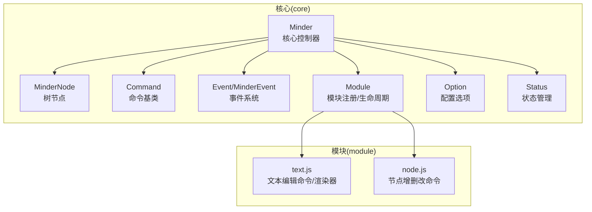
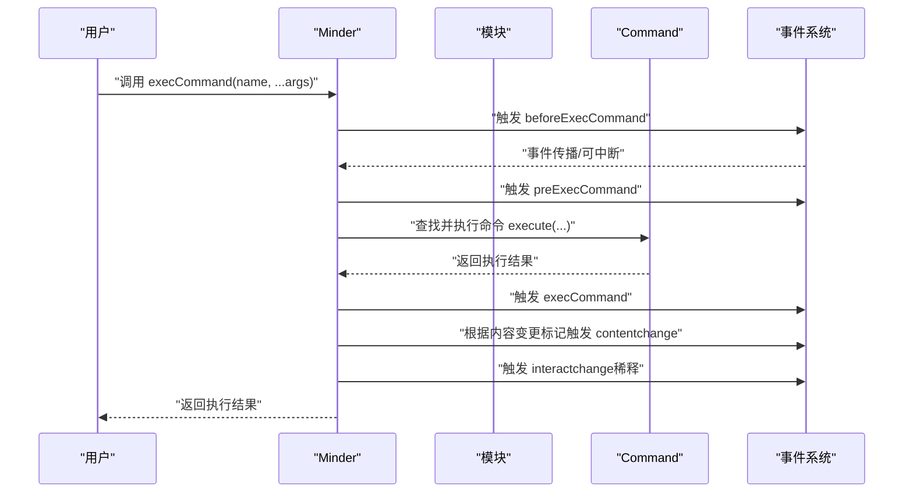
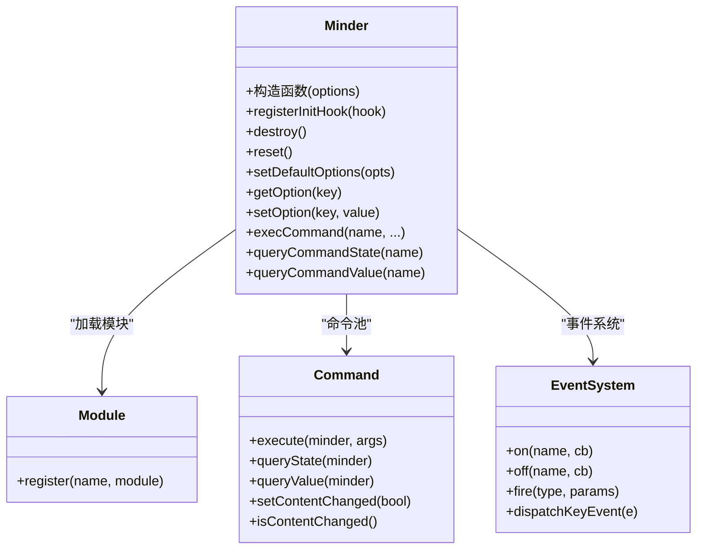
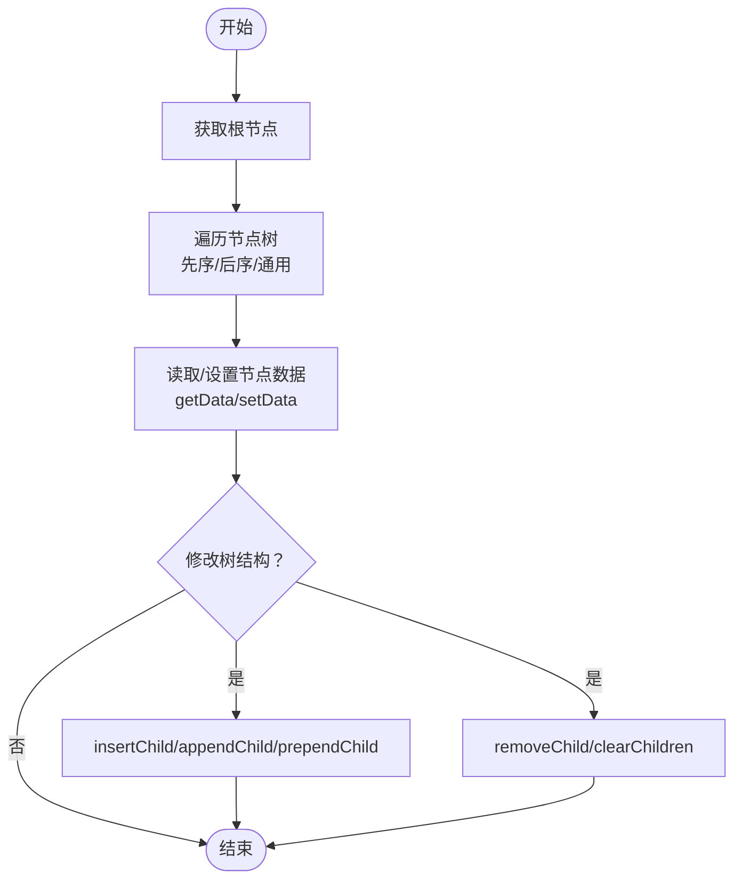
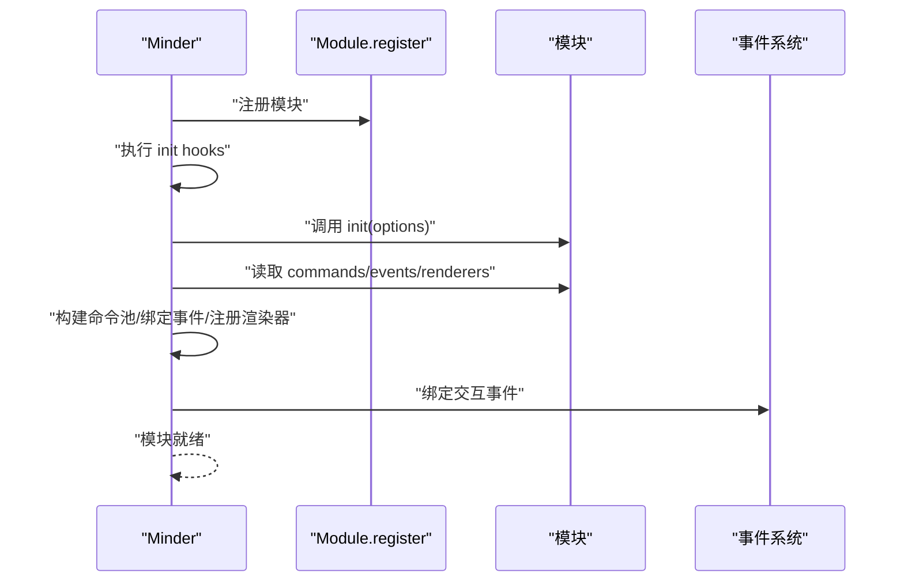
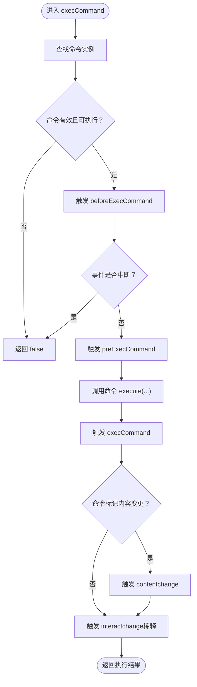
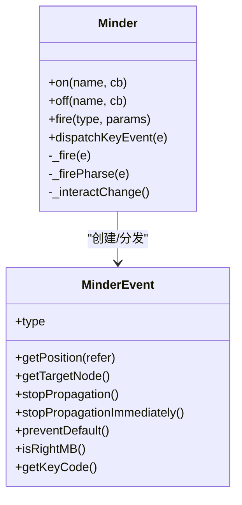
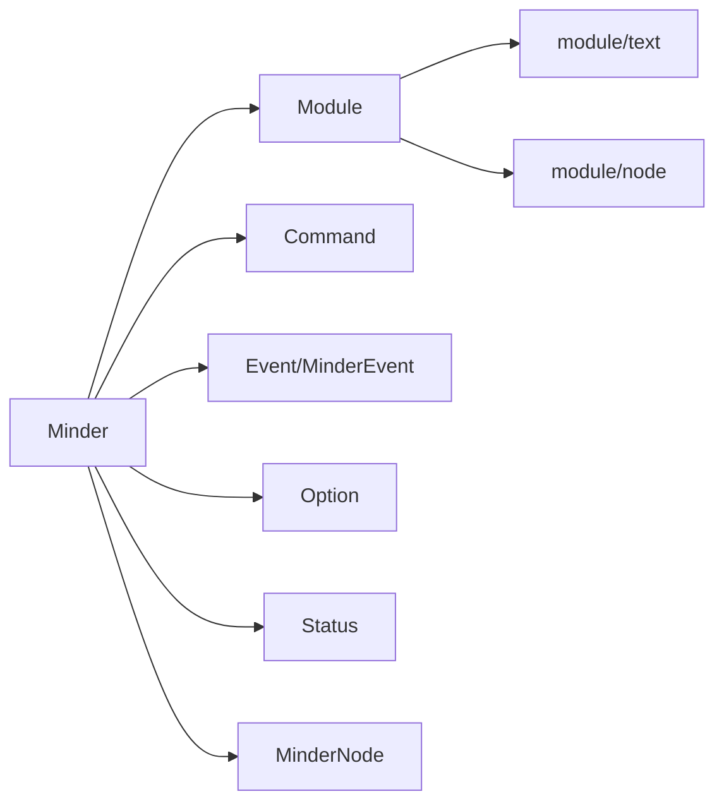

# 核心概念

<cite>
**本文引用的文件**
- [doc/Architecture.md](file://doc/Architecture.md)
- [src/core/minder.js](file://src/core/minder.js)
- [src/core/module.js](file://src/core/module.js)
- [src/core/command.js](file://src/core/command.js)
- [src/core/event.js](file://src/core/event.js)
- [src/core/node.js](file://src/core/node.js)
- [src/core/option.js](file://src/core/option.js)
- [src/core/status.js](file://src/core/status.js)
- [src/module/text.js](file://src/module/text.js)
- [src/module/node.js](file://src/module/node.js)
</cite>

## 目录
1. [引言](#引言)
2. [项目结构](#项目结构)
3. [核心组件](#核心组件)
4. [架构总览](#架构总览)
5. [详细组件分析](#详细组件分析)
6. [依赖分析](#依赖分析)
7. [性能考虑](#性能考虑)
8. [故障排查指南](#故障排查指南)
9. [结论](#结论)

## 引言
本文件围绕 TyMinder Core 的核心概念进行系统化梳理，重点阐释以下主题：
- Minder 类作为核心控制器的角色、生命周期与配置选项
- MinderNode 类的树形数据结构、数据存取方法与树遍历接口
- 模块化架构与 Module.register 的机制，以及模块生命周期（init/destroy/reset）
- 命令模式的设计，包括 Command 基类的 execute/revert、状态查询与内容变更标记
- 事件系统，涵盖事件分类、事件处理接口与事件对象结构

本文结合 Architecture.md 中的官方说明与各核心文件的实现细节，帮助读者从整体到局部理解 TyMinder 的运行机制与扩展方式。

## 项目结构
TyMinder Core 的源码采用分层与模块化组织：
- core 层：核心运行时与基础设施（Minder、MinderNode、Command、Event、Module、Option、Status 等）
- module 层：功能模块（如 text、node、layout、select 等），通过 Module.register 注册
- protocol/template/theme/connect/layout 等目录分别提供数据协议、模板、主题、连线与布局算法

图表来源
- [src/core/minder.js](file://src/core/minder.js#L1-L41)
- [src/core/node.js](file://src/core/node.js#L1-L120)
- [src/core/command.js](file://src/core/command.js#L1-L60)
- [src/core/event.js](file://src/core/event.js#L1-L60)
- [src/core/module.js](file://src/core/module.js#L1-L40)
- [src/core/option.js](file://src/core/option.js#L1-L34)
- [src/core/status.js](file://src/core/status.js#L1-L40)
- [src/module/text.js](file://src/module/text.js#L240-L289)
- [src/module/node.js](file://src/module/node.js#L1-L60)

章节来源
- [doc/Architecture.md](file://doc/Architecture.md#L1-L120)

## 核心组件
本节概述核心组件职责与关键能力：
- Minder：全局控制器，负责模块加载、命令执行、事件分发、状态与配置管理
- MinderNode：树节点，提供树遍历、数据存取、渲染容器访问与节点关系维护
- Command：命令抽象基类，定义执行/撤销、状态查询、变更标记等
- Event/MinderEvent：事件系统，统一事件生命周期与事件对象扩展
- Module：模块注册与生命周期管理，负责模块初始化、命令注册、事件绑定与渲染器注册
- Option/Status：配置与状态管理，提供默认配置合并、选项读取与状态切换

章节来源
- [src/core/minder.js](file://src/core/minder.js#L1-L41)
- [src/core/node.js](file://src/core/node.js#L1-L120)
- [src/core/command.js](file://src/core/command.js#L1-L60)
- [src/core/event.js](file://src/core/event.js#L1-L60)
- [src/core/module.js](file://src/core/module.js#L1-L40)
- [src/core/option.js](file://src/core/option.js#L1-L34)
- [src/core/status.js](file://src/core/status.js#L1-L40)

## 架构总览
Minder 作为核心控制器贯穿整个系统：
- 初始化阶段：通过注册的 init hooks 完成模块初始化与命令池构建
- 运行阶段：通过 execCommand 统一调度命令，触发命令事件与内容变更事件
- 生命周期：destroy/reset 分别用于卸载与重置模块资源
- 事件系统：统一捕获与分发交互事件、命令事件与状态变更事件

图表来源
- [src/core/command.js](file://src/core/command.js#L118-L166)
- [src/core/event.js](file://src/core/event.js#L162-L192)

章节来源
- [doc/Architecture.md](file://doc/Architecture.md#L370-L430)
- [src/core/command.js](file://src/core/command.js#L118-L166)
- [src/core/event.js](file://src/core/event.js#L162-L192)

## 详细组件分析

### Minder 类：核心控制器与生命周期
- 角色定位
  - 作为全局控制器，承载模块注册、命令池、事件系统、状态与配置管理
  - 通过 init hooks 在实例化时执行模块初始化流程
- 生命周期
  - 构造函数：合并用户选项，执行 init hooks，完成后触发 finishInitHook
  - destroy：清理事件、清空树、逐模块调用 destroy
  - reset：清空树、逐模块调用 reset
- 配置选项
  - 通过 setDefaultOptions 设置默认配置，getOption/getOption/setOption 提供读取与覆盖
  - 模块可通过 defaultOptions 合并到全局默认配置中

图表来源
- [src/core/minder.js](file://src/core/minder.js#L1-L41)
- [src/core/module.js](file://src/core/module.js#L1-L40)
- [src/core/command.js](file://src/core/command.js#L1-L60)
- [src/core/option.js](file://src/core/option.js#L1-L34)
- [src/core/status.js](file://src/core/status.js#L1-L40)

章节来源
- [src/core/minder.js](file://src/core/minder.js#L1-L41)
- [src/core/option.js](file://src/core/option.js#L1-L34)
- [src/core/status.js](file://src/core/status.js#L1-L60)
- [src/core/module.js](file://src/core/module.js#L1-L151)

### MinderNode 类：树形数据结构与遍历接口
- 数据结构
  - 维护父子关系与兄弟链表，提供根节点、深度、复杂度、类型等辅助信息
  - 数据存储在 data 字段，支持 getData/setData 读写
  - 渲染容器 rc 为 Kity.Group，提供 getRenderContainer 访问
- 树遍历
  - 提供先序/后序/通用遍历方法，支持排除当前节点
  - 提供插入、删除、追加、前置等子节点操作
- 关联与比较
  - 提供公共祖先、包含判断、克隆、结构与数据对比等工具方法

图表来源
- [src/core/node.js](file://src/core/node.js#L129-L243)
- [src/core/node.js](file://src/core/node.js#L163-L239)

章节来源
- [doc/Architecture.md](file://doc/Architecture.md#L256-L311)
- [src/core/node.js](file://src/core/node.js#L1-L283)

### 模块化架构与 Module.register 机制
- 模块注册
  - 通过 Module.register(name, module) 将模块注册到模块池
  - Minder 在初始化时扫描模块池，按需加载模块
- 模块生命周期
  - init：模块初始化，接收最终配置
  - commands：注册命令类，Minder 统一构建命令实例并放入命令池
  - events：绑定事件回调，统一由 Minder 的事件系统处理
  - renderers：注册渲染器类型，按需挂接到节点渲染管线
  - destroy/reset：模块资源回收与重置
- 快捷键
  - 模块可声明命令快捷键，Minder 统一收集并注册

图表来源
- [src/core/module.js](file://src/core/module.js#L1-L151)
- [src/module/text.js](file://src/module/text.js#L278-L289)
- [src/module/node.js](file://src/module/node.js#L133-L150)

章节来源
- [doc/Architecture.md](file://doc/Architecture.md#L198-L251)
- [src/core/module.js](file://src/core/module.js#L1-L151)

### 命令模式设计：Command 基类与执行流程
- 命令基类
  - execute：命令执行入口，必须实现
  - revert：撤销入口，可缺省
  - queryState/queryValue：查询命令状态与结果值
  - isContentChanged/isSelectionChanged：标记命令对内容/选区的影响
- 执行流程
  - execCommand 统一入口，触发 before/pre/exec 命令事件
  - 若命令标记内容变更，则触发 contentchange
  - 最终触发 interactchange（带稀释）

图表来源
- [src/core/command.js](file://src/core/command.js#L118-L166)

章节来源
- [doc/Architecture.md](file://doc/Architecture.md#L145-L197)
- [src/core/command.js](file://src/core/command.js#L1-L169)

### 事件系统：分类、接口与事件对象
- 事件分类
  - 交互事件：click、dblclick、mousedown、mousemove、mouseup、keydown、keyup、keypress、touchstart、touchend、touchmove 等
  - 命令事件：beforecommand、precommand、aftercommand（对应 beforeExecCommand、preExecCommand、execCommand）
  - 状态变更事件：selectionchange、contentchange、interactchange
  - 模块事件：模块自定义事件名
- 事件接口
  - on/once/off：注册、一次性与注销事件监听
  - fire：触发事件，合并自定义参数到事件对象
  - dispatchKeyEvent：派发键盘事件
- 事件对象 MinderEvent
  - 扩展原生事件，提供 getPosition、getTargetNode、stopPropagation、preventDefault、isRightMB、getKeyCode 等能力
  - 支持事件传播控制与立即停止

图表来源
- [src/core/event.js](file://src/core/event.js#L1-L120)
- [src/core/event.js](file://src/core/event.js#L194-L266)

章节来源
- [doc/Architecture.md](file://doc/Architecture.md#L374-L430)
- [src/core/event.js](file://src/core/event.js#L1-L270)

## 依赖分析
- 组件耦合
  - Minder 依赖 Module、Command、Event、Option、Status、Node 等核心模块
  - Module 通过 Minder 的 init hooks 注入命令、事件与渲染器
  - Command 与 MinderEvent 协作，形成命令执行与事件驱动的闭环
- 外部依赖
  - Kity 图形库用于渲染与事件坐标转换
  - Utils 提供工具函数（extend、keys、clone、comparePlainObject 等）

图表来源
- [src/core/minder.js](file://src/core/minder.js#L1-L41)
- [src/core/module.js](file://src/core/module.js#L1-L151)
- [src/core/command.js](file://src/core/command.js#L1-L60)
- [src/core/event.js](file://src/core/event.js#L1-L60)
- [src/core/option.js](file://src/core/option.js#L1-L34)
- [src/core/status.js](file://src/core/status.js#L1-L40)
- [src/core/node.js](file://src/core/node.js#L1-L120)
- [src/module/text.js](file://src/module/text.js#L240-L289)
- [src/module/node.js](file://src/module/node.js#L1-L60)

章节来源
- [src/core/minder.js](file://src/core/minder.js#L1-L41)
- [src/core/module.js](file://src/core/module.js#L1-L151)
- [src/core/command.js](file://src/core/command.js#L1-L60)
- [src/core/event.js](file://src/core/event.js#L1-L60)
- [src/core/option.js](file://src/core/option.js#L1-L34)
- [src/core/status.js](file://src/core/status.js#L1-L40)
- [src/core/node.js](file://src/core/node.js#L1-L120)

## 性能考虑
- 事件稀释：interactchange 通过定时器进行稀释，避免高频交互事件导致的过度重绘
- 布局动画：当节点数量超过阈值时自动关闭动画，保证大图性能
- 选择与渲染：批量操作时尽量减少重复渲染与布局调用次数
- 模块化加载：仅加载所需模块，避免不必要的初始化成本

## 故障排查指南
- 命令不可执行
  - 检查 queryCommandState 返回值，确认命令状态是否为可执行
  - 确认命令实例存在于命令池中
- 事件未触发
  - 确认事件名大小写与绑定一致（内部统一转小写）
  - 检查事件是否被 stopPropagation 或立即停止
- 内容变更未生效
  - 确认命令是否标记内容变更（isContentChanged）
  - 检查 contentchange 是否被其他逻辑拦截
- 模块未加载
  - 确认模块是否通过 Module.register 注册
  - 检查 Minder 初始化时的模块加载顺序与配置

章节来源
- [src/core/command.js](file://src/core/command.js#L87-L166)
- [src/core/event.js](file://src/core/event.js#L194-L266)
- [src/core/module.js](file://src/core/module.js#L1-L151)

## 结论
TyMinder Core 通过清晰的分层与模块化设计，将核心控制器（Minder）、树节点（MinderNode）、命令（Command）、事件（Event）与模块（Module）有机整合。Minder 作为中枢，统一管理模块生命周期、命令执行与事件分发；MinderNode 提供稳定的树结构与数据存取接口；Command 与事件系统共同构成可扩展、可观测的交互与变更机制。依托 Architecture.md 的规范与各核心文件的实现，开发者可以快速理解并扩展 TyMinder 的功能边界。