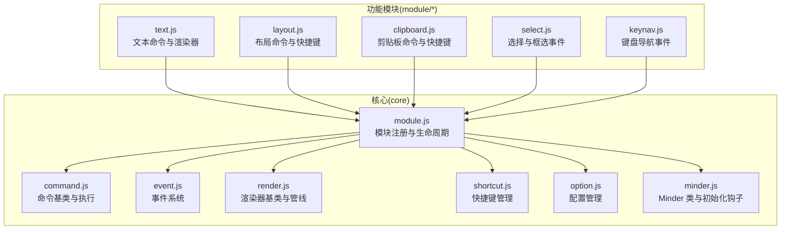
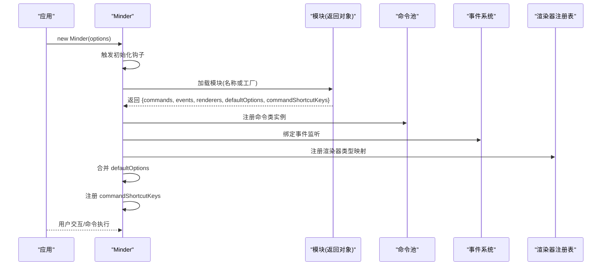
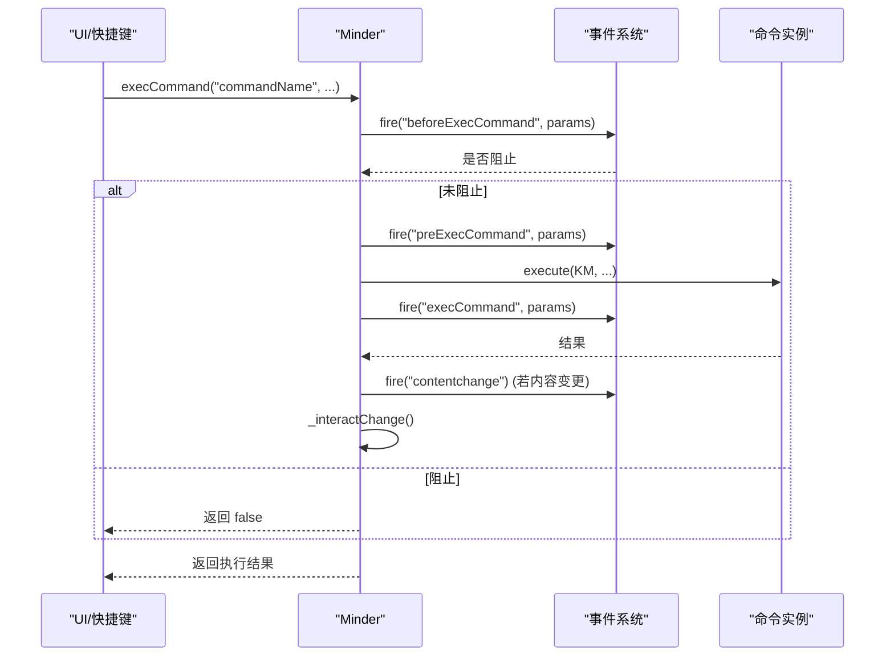
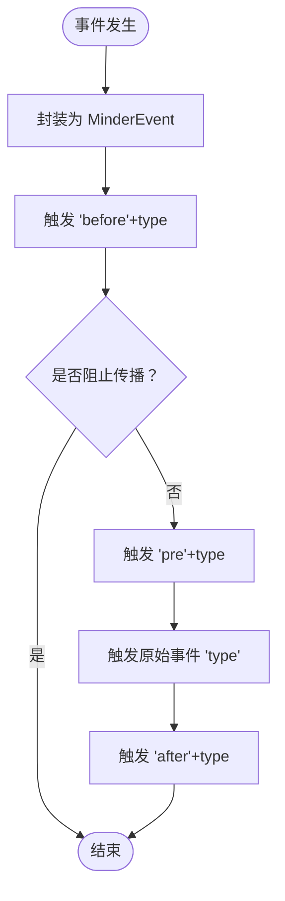
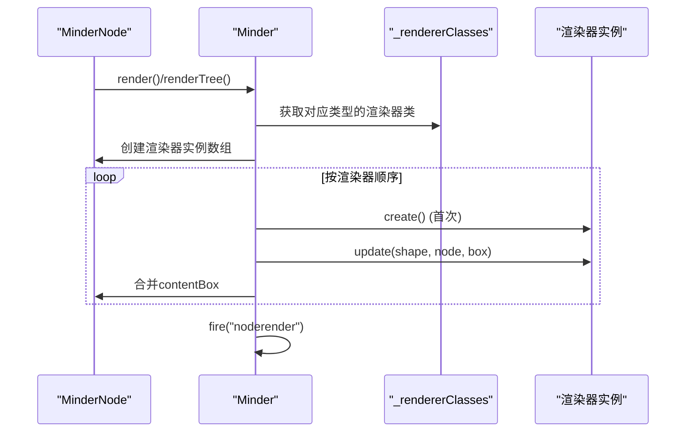
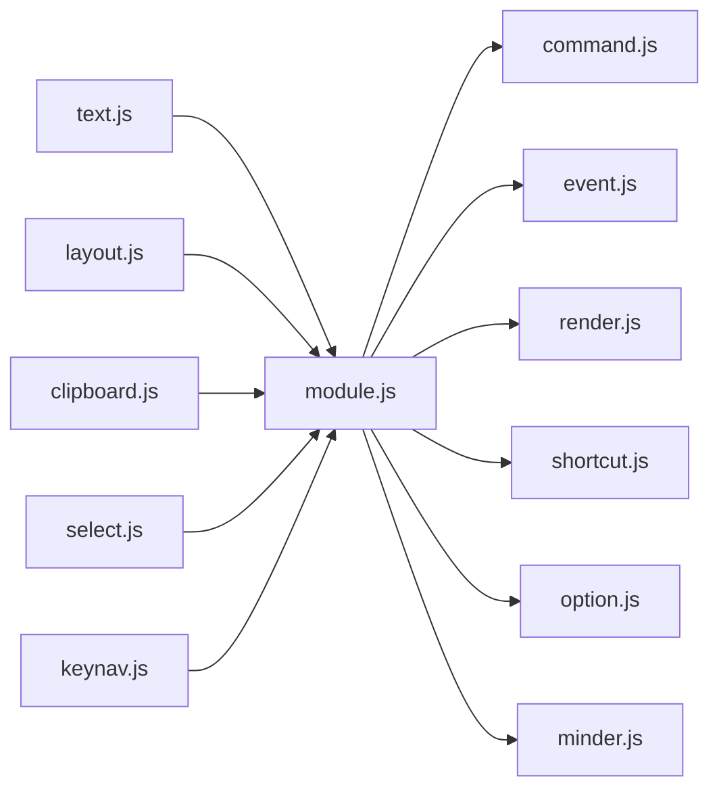

# 模块功能集成

<cite>
**本文引用的文件**
- [module.js](file://src/core/module.js)
- [command.js](file://src/core/command.js)
- [event.js](file://src/core/event.js)
- [render.js](file://src/core/render.js)
- [shortcut.js](file://src/core/shortcut.js)
- [option.js](file://src/core/option.js)
- [minder.js](file://src/core/minder.js)
- [text.js](file://src/module/text.js)
- [keynav.js](file://src/module/keynav.js)
- [layout.js](file://src/module/layout.js)
- [clipboard.js](file://src/module/clipboard.js)
- [select.js](file://src/module/select.js)
- [Architecture.md](file://doc/Architecture.md)
</cite>

## 目录
1. [引言](#引言)
2. [项目结构](#项目结构)
3. [核心组件](#核心组件)
4. [架构总览](#架构总览)
5. [详细组件分析](#详细组件分析)
6. [依赖分析](#依赖分析)
7. [性能考虑](#性能考虑)
8. [故障排查指南](#故障排查指南)
9. [结论](#结论)

## 引言
本文件围绕模块功能集成展开，系统性阐述模块如何通过 commands、events、renderers 等属性与核心系统集成，包括：
- 命令注册与执行机制（命令池、状态查询、撤销触发）
- 事件绑定与传播（事件分发、拦截、状态感知）
- 渲染器注册与节点渲染管线
- defaultOptions 配置管理
- commandShortcutKeys 快捷键注册
结合 Architecture.md 中的模块定义结构，说明这些集成点如何共同构建模块的功能完整性。

## 项目结构
- 核心运行时位于 src/core，包含模块注册与生命周期、命令、事件、渲染、快捷键、选项等基础设施
- 功能模块位于 src/module，每个模块以 Module.register(...) 的形式对外暴露 commands、events、renderers、defaultOptions、commandShortcutKeys 等集成点
- 文档 Architecture.md 提供模块定义规范与架构说明

图表来源
- [module.js](file://src/core/module.js#L1-L151)
- [command.js](file://src/core/command.js#L1-L169)
- [event.js](file://src/core/event.js#L1-L270)
- [render.js](file://src/core/render.js#L1-L261)
- [shortcut.js](file://src/core/shortcut.js#L1-L154)
- [option.js](file://src/core/option.js#L1-L34)
- [minder.js](file://src/core/minder.js#L1-L41)
- [text.js](file://src/module/text.js#L1-L289)
- [layout.js](file://src/module/layout.js#L1-L92)
- [clipboard.js](file://src/module/clipboard.js#L1-L172)
- [select.js](file://src/module/select.js#L1-L184)
- [keynav.js](file://src/module/keynav.js#L1-L171)

章节来源
- [module.js](file://src/core/module.js#L1-L151)
- [Architecture.md](file://doc/Architecture.md#L198-L251)

## 核心组件
- 模块注册与生命周期：负责收集模块、注册命令、绑定事件、注册渲染器、应用默认配置、注册快捷键
- 命令系统：Command 基类与 Minder.execCommand/queryCommandState 等接口，统一命令执行与状态查询
- 事件系统：MinderEvent 封装事件，Minder 统一绑定与分发，支持 before/pre/执行/after 阶段
- 渲染系统：Renderer 抽象，MinderNode 渲染管线，按节点与渲染器顺序批量更新
- 快捷键系统：基于 MinderEvent 的组合键匹配，统一注册与触发命令
- 配置系统：defaultOptions 与 getOption/setOption

章节来源
- [module.js](file://src/core/module.js#L1-L151)
- [command.js](file://src/core/command.js#L1-L169)
- [event.js](file://src/core/event.js#L1-L270)
- [render.js](file://src/core/render.js#L1-L261)
- [shortcut.js](file://src/core/shortcut.js#L1-L154)
- [option.js](file://src/core/option.js#L1-L34)

## 架构总览
模块通过 Module.register(...) 返回对象，核心在 Minder 初始化阶段集中消费以下集成点：
- commands：命令类集合，注册到 Minder._commands
- events：事件监听映射，通过 Minder.on(type, handler) 绑定
- renderers：渲染器类型到类数组映射，按节点类型分组注册
- defaultOptions：默认配置合并到 Minder._defaultOptions
- commandShortcutKeys：命令到快捷键映射，通过 addCommandShortcutKeys 注册

图表来源
- [module.js](file://src/core/module.js#L1-L151)
- [command.js](file://src/core/command.js#L118-L166)
- [event.js](file://src/core/event.js#L133-L266)
- [render.js](file://src/core/render.js#L60-L224)
- [shortcut.js](file://src/core/shortcut.js#L111-L138)

## 详细组件分析

### 命令注册与执行（commands）
- 注册机制：模块返回对象的 commands 字段为命令名到命令类的映射，Minder 在初始化时遍历并实例化，统一注册到 Minder._commands
- 执行流程：Minder.execCommand(name, ...args) 会触发 before/pre/execCommand 事件，执行命令后根据命令是否改变内容触发 contentchange，并触发 interactchange
- 状态查询：Minder.queryCommandState(name) 通过命令的 queryState 返回状态码，用于 UI 状态控制

图表来源
- [command.js](file://src/core/command.js#L118-L166)
- [event.js](file://src/core/event.js#L162-L192)

章节来源
- [module.js](file://src/core/module.js#L83-L88)
- [command.js](file://src/core/command.js#L1-L169)
- [Architecture.md](file://doc/Architecture.md#L140-L197)

### 事件绑定与传播（events）
- 绑定方式：模块返回对象的 events 字段为事件名到回调的映射，Minder 在初始化时通过 Minder.on(type, handler) 绑定
- 事件分发：Minder._firePharse 将原生事件包装为 MinderEvent，并依次触发 before、pre、执行、after 阶段事件
- 状态感知：事件回调可通过 this.getStatus() 区分状态，事件存储采用状态前缀的命名空间

图表来源
- [event.js](file://src/core/event.js#L162-L192)
- [event.js](file://src/core/event.js#L194-L266)

章节来源
- [module.js](file://src/core/module.js#L90-L95)
- [event.js](file://src/core/event.js#L1-L270)
- [Architecture.md](file://doc/Architecture.md#L374-L431)

### 渲染器注册与节点渲染（renderers）
- 注册流程：模块返回对象的 renderers 字段为渲染器类型到类数组的映射，Minder 在初始化时合并到 Minder._rendererClasses[type]
- 渲染管线：MinderNode 渲染时，按注册顺序创建渲染器实例，依次执行 create/update/place，图形按需显示或隐藏，最后触发 noderender 事件
- 节点批渲染：Minder.renderNodeBatch 会按渲染器序列批量更新，合并 contentBox，提升性能

图表来源
- [render.js](file://src/core/render.js#L60-L224)

章节来源
- [module.js](file://src/core/module.js#L97-L111)
- [render.js](file://src/core/render.js#L1-L261)
- [text.js](file://src/module/text.js#L278-L288)

### defaultOptions 配置管理
- 合并策略：模块返回对象的 defaultOptions 与 Minder._defaultOptions 合并，最终通过 getOption(key) 读取
- 优先级：实例化时传入的 options 会覆盖默认配置

章节来源
- [module.js](file://src/core/module.js#L49-L51)
- [option.js](file://src/core/option.js#L1-L34)

### commandShortcutKeys 快捷键注册
- 注册方式：模块返回对象的 commandShortcutKeys 为命令名到快捷键字符串的映射，Minder.addCommandShortcutKeys 会将其转换为 addShortcut 绑定
- 触发条件：快捷键按下时，先查询命令状态（非禁用），再执行命令

章节来源
- [module.js](file://src/core/module.js#L113-L116)
- [shortcut.js](file://src/core/shortcut.js#L111-L138)
- [layout.js](file://src/module/layout.js#L87-L90)
- [clipboard.js](file://src/module/clipboard.js#L163-L169)

### 关键模块示例

#### 文本模块（text）
- 命令：提供文本编辑命令，更新节点文本并触发布局
- 渲染器：TextRenderer 在 center 区域渲染文本，兼容多浏览器字体对齐
- 集成点：commands、renderers

章节来源
- [text.js](file://src/module/text.js#L245-L288)

#### 键盘导航模块（keynav）
- 事件：监听键盘事件，计算节点间最近邻关系，实现方向键导航
- 集成点：events

章节来源
- [keynav.js](file://src/module/keynav.js#L151-L170)

#### 布局模块（layout）
- 命令：设置/重设节点布局
- 快捷键：重设布局命令绑定快捷键
- 集成点：commands、commandShortcutKeys

章节来源
- [layout.js](file://src/module/layout.js#L1-L92)

#### 剪贴板模块（clipboard）
- 命令：复制、剪切、粘贴
- 快捷键：复制/剪切/粘贴绑定快捷键
- 集成点：commands、commandShortcutKeys

章节来源
- [clipboard.js](file://src/module/clipboard.js#L1-L172)

#### 选择模块（select）
- 事件：鼠标事件驱动单选、多选、框选
- 集成点：events

章节来源
- [select.js](file://src/module/select.js#L1-L184)

## 依赖分析
- 模块与核心耦合：模块通过 Module.register(...) 与核心解耦，核心仅依赖模块返回对象的约定字段
- 命令依赖：命令类依赖 Command 基类，Minder.execCommand 统一调度
- 事件依赖：事件系统为模块提供统一的事件通道，支持状态前缀
- 渲染依赖：渲染器依赖 Renderer 抽象，MinderNode 渲染管线统一管理
- 快捷键依赖：快捷键系统依赖 MinderEvent 的组合键匹配能力

图表来源
- [module.js](file://src/core/module.js#L1-L151)
- [command.js](file://src/core/command.js#L1-L169)
- [event.js](file://src/core/event.js#L1-L270)
- [render.js](file://src/core/render.js#L1-L261)
- [shortcut.js](file://src/core/shortcut.js#L1-L154)
- [option.js](file://src/core/option.js#L1-L34)
- [minder.js](file://src/core/minder.js#L1-L41)
- [text.js](file://src/module/text.js#L1-L289)
- [layout.js](file://src/module/layout.js#L1-L92)
- [clipboard.js](file://src/module/clipboard.js#L1-L172)
- [select.js](file://src/module/select.js#L1-L184)
- [keynav.js](file://src/module/keynav.js#L1-L171)

## 性能考虑
- 渲染批处理：Minder.renderNodeBatch 按渲染器序列批量更新，减少重复计算与 DOM 操作
- 渲染器缓存：TextRenderer 通过哈希缓存文本盒，避免重复测量
- 事件稀释：interactchange 采用定时器去抖，降低高频交互事件的处理压力
- 选择计算：框选时仅对可见节点进行相交检测，避免对折叠节点的无效计算

章节来源
- [render.js](file://src/core/render.js#L85-L164)
- [text.js](file://src/module/text.js#L210-L235)
- [event.js](file://src/core/event.js#L184-L192)
- [select.js](file://src/module/select.js#L83-L96)

## 故障排查指南
- 命令未生效
  - 检查命令是否正确注册到 Minder._commands
  - 确认命令状态 queryState 返回非禁用值
  - 确认命令执行后是否触发 contentchange
  章节来源
  - [module.js](file://src/core/module.js#L83-L88)
  - [command.js](file://src/core/command.js#L118-L166)

- 事件未触发
  - 检查模块 events 映射是否正确绑定
  - 确认事件类型大小写与状态前缀
  章节来源
  - [module.js](file://src/core/module.js#L90-L95)
  - [event.js](file://src/core/event.js#L194-L266)

- 渲染异常
  - 检查 renderers 注册类型是否与节点区域一致
  - 确认 shouldRender/shouldDraw 返回合理值
  章节来源
  - [module.js](file://src/core/module.js#L97-L111)
  - [render.js](file://src/core/render.js#L1-L84)

- 快捷键无效
  - 检查 commandShortcutKeys 是否正确注册
  - 确认 addCommandShortcutKeys 已被调用
  章节来源
  - [module.js](file://src/core/module.js#L113-L116)
  - [shortcut.js](file://src/core/shortcut.js#L111-L138)

## 结论
模块功能集成通过标准化的集成点（commands、events、renderers、defaultOptions、commandShortcutKeys）与核心系统解耦协作，形成清晰的职责边界与扩展路径。命令执行、事件传播、渲染管线与快捷键管理共同构成模块化能力的核心支撑，确保功能模块可插拔、可组合、可维护。