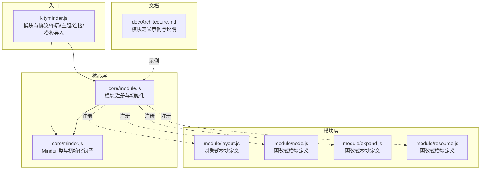
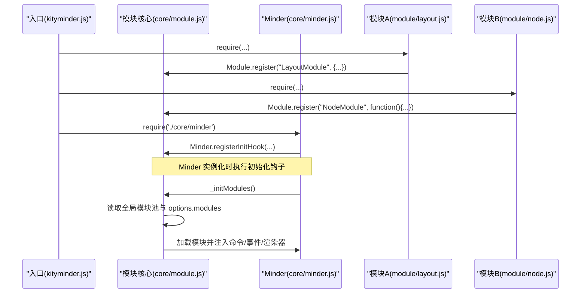
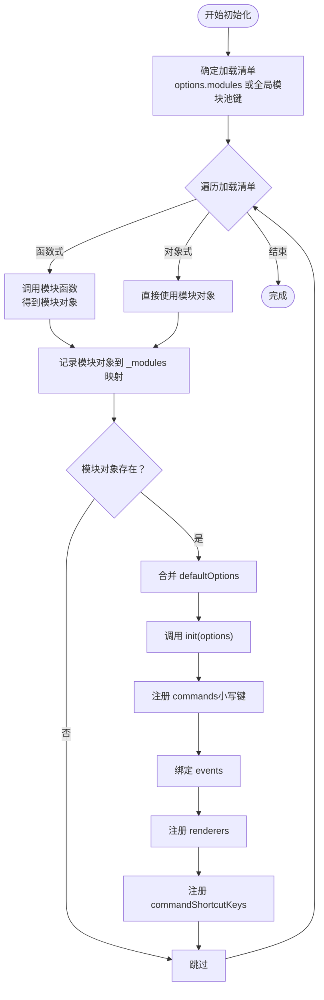
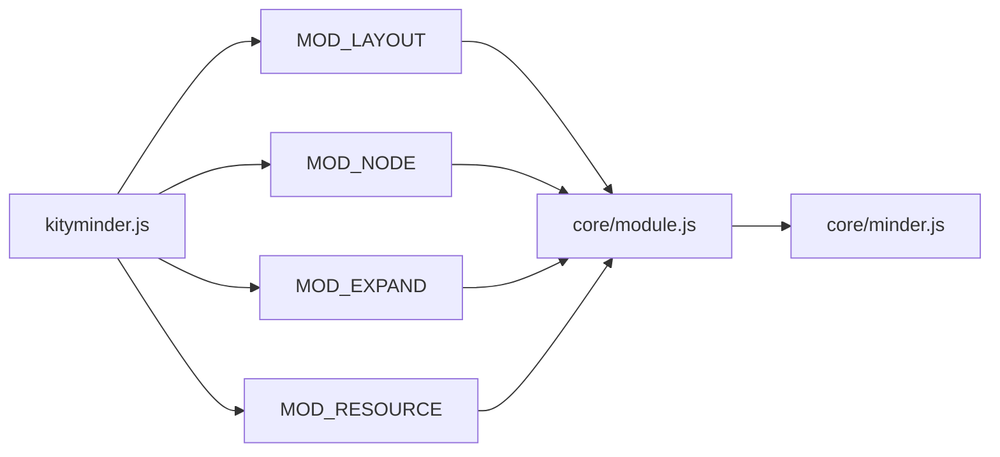

# 模块注册机制

<cite>
**本文引用的文件**
- [src/core/module.js](file://src/core/module.js)
- [src/core/minder.js](file://src/core/minder.js)
- [src/kityminder.js](file://src/kityminder.js)
- [src/module/layout.js](file://src/module/layout.js)
- [src/module/node.js](file://src/module/node.js)
- [src/module/expand.js](file://src/module/expand.js)
- [src/module/resource.js](file://src/module/resource.js)
- [doc/Architecture.md](file://doc/Architecture.md)
</cite>

## 目录
1. [引言](#引言)
2. [项目结构](#项目结构)
3. [核心组件](#核心组件)
4. [架构总览](#架构总览)
5. [详细组件分析](#详细组件分析)
6. [依赖分析](#依赖分析)
7. [性能考虑](#性能考虑)
8. [故障排查指南](#故障排查指南)
9. [结论](#结论)

## 引言
本文件围绕模块注册机制展开，重点解释 Module.register() 如何将模块注册到全局模块池，exports.register 函数如何通过名称映射存储模块定义，以及模块加载顺序如何受 Minder 实例 options.modules 配置控制。同时结合 Architecture.md 中的模块定义示例，说明函数式与对象式两种模块定义方式的处理机制，并建立模块注册与 Minder 初始化流程的关联。

## 项目结构
KityMinder 的模块注册与加载分布在核心层与模块层：
- 核心层负责模块注册与生命周期管理：src/core/module.js
- 核心类 Minder 负责初始化钩子与实例化流程：src/core/minder.js
- 入口聚合导出：src/kityminder.js
- 模块示例：src/module/layout.js、src/module/node.js、src/module/expand.js、src/module/resource.js
- 架构说明：doc/Architecture.md

图表来源
- [src/core/module.js](file://src/core/module.js#L1-L151)
- [src/core/minder.js](file://src/core/minder.js#L1-L41)
- [src/kityminder.js](file://src/kityminder.js#L1-L107)
- [src/module/layout.js](file://src/module/layout.js#L1-L92)
- [src/module/node.js](file://src/module/node.js#L1-L150)
- [src/module/expand.js](file://src/module/expand.js#L1-L200)
- [src/module/resource.js](file://src/module/resource.js#L1-L14)
- [doc/Architecture.md](file://doc/Architecture.md#L198-L255)

章节来源
- [src/core/module.js](file://src/core/module.js#L1-L151)
- [src/core/minder.js](file://src/core/minder.js#L1-L41)
- [src/kityminder.js](file://src/kityminder.js#L1-L107)
- [doc/Architecture.md](file://doc/Architecture.md#L198-L255)

## 核心组件
- 模块注册与初始化：在 core/module.js 中，通过 exports.register(name, module) 将模块注册到全局模块池；随后通过 Minder.registerInitHook 注册初始化钩子，在 Minder 实例构造时触发模块初始化流程。
- Minder 初始化：core/minder.js 定义了 Minder 类与初始化钩子注册机制，实例化时依次执行已注册的初始化钩子。
- 模块定义示例：Architecture.md 展示了函数式与对象式两种模块定义方式；实际模块文件中既有函数式（返回模块对象）也有对象式（直接导出模块对象）。

章节来源
- [src/core/module.js](file://src/core/module.js#L1-L151)
- [src/core/minder.js](file://src/core/minder.js#L1-L41)
- [doc/Architecture.md](file://doc/Architecture.md#L198-L255)

## 架构总览
模块注册与加载的关键流程如下：
- 模块在各自文件中通过 Module.register(...) 注册到全局模块池。
- 入口文件 src/kityminder.js 通过 require 一系列模块文件，从而触发模块注册。
- Minder 在构造时执行初始化钩子，进入模块初始化阶段，根据 options.modules 或全局模块池决定加载顺序与集合。

图表来源
- [src/kityminder.js](file://src/kityminder.js#L1-L107)
- [src/core/module.js](file://src/core/module.js#L1-L151)
- [src/core/minder.js](file://src/core/minder.js#L1-L41)
- [src/module/layout.js](file://src/module/layout.js#L1-L92)
- [src/module/node.js](file://src/module/node.js#L1-L150)

## 详细组件分析

### exports.register 与全局模块池
- 作用：将模块定义以名称映射存储到全局模块池，供后续初始化流程使用。
- 存储结构：内部维护一个模块池字典，键为模块名称，值为模块定义（函数或对象）。
- 关联：Minder 通过注册初始化钩子，在实例化时触发模块初始化流程。

章节来源
- [src/core/module.js](file://src/core/module.js#L1-L151)

### 模块加载顺序与 options.modules
- 顺序来源：Minder 在初始化时，会读取 this._options.modules；若未提供，则使用全局模块池的所有模块键作为默认顺序。
- 影响范围：该顺序决定了模块初始化的先后，从而影响命令注册、事件绑定、渲染器注册等的生效顺序。

章节来源
- [src/core/module.js](file://src/core/module.js#L1-L151)

### 函数式与对象式两种定义方式
- 函数式模块定义：模块导出函数，返回模块对象。初始化时会调用该函数，得到模块对象后进行后续处理。
- 对象式模块定义：模块直接导出模块对象。初始化时直接使用该对象。
- 共同点：两者均通过 Module.register(...) 注册到全局模块池，初始化流程一致。

章节来源
- [src/module/layout.js](file://src/module/layout.js#L1-L92)
- [src/module/node.js](file://src/module/node.js#L1-L150)
- [src/module/expand.js](file://src/module/expand.js#L1-L200)
- [src/module/resource.js](file://src/module/resource.js#L1-L14)
- [doc/Architecture.md](file://doc/Architecture.md#L198-L255)

### 模块初始化流程（_initModules）
- 读取模块池与加载清单：从全局模块池与 options.modules 中确定加载顺序与集合。
- 执行模块初始化：
  - 若模块定义为函数：调用函数并以 Minder 实例为上下文，得到模块对象。
  - 若模块定义为对象：直接使用该对象。
- 注入能力：
  - defaultOptions：合并到 Minder 默认配置。
  - init：在 Minder 实例化时调用，传入最终配置。
  - commands：注册命令，统一转为小写键。
  - events：绑定事件。
  - renderers：注册渲染器类型。
  - commandShortcutKeys：注册快捷键。
- 生命周期：destroy/reset 时遍历已加载模块并调用对应方法。

图表来源
- [src/core/module.js](file://src/core/module.js#L1-L151)

章节来源
- [src/core/module.js](file://src/core/module.js#L1-L151)

### 与 Minder 初始化流程的关联
- Minder 在构造时执行已注册的初始化钩子，确保模块初始化在 Minder 实例化之后进行。
- 模块初始化发生在 Minder 实例化之后，因此模块内的 init 可以安全地访问 Minder 实例与最终配置。

章节来源
- [src/core/minder.js](file://src/core/minder.js#L1-L41)
- [src/core/module.js](file://src/core/module.js#L1-L151)

### 实际用法示例（来自 Architecture.md 与模块文件）
- 函数式模块定义（返回模块对象）：参见 Architecture.md 中的示例，以及模块文件中的函数式定义。
- 对象式模块定义：参见模块文件中的对象式定义。

章节来源
- [doc/Architecture.md](file://doc/Architecture.md#L198-L255)
- [src/module/layout.js](file://src/module/layout.js#L1-L92)
- [src/module/node.js](file://src/module/node.js#L1-L150)
- [src/module/expand.js](file://src/module/expand.js#L1-L200)
- [src/module/resource.js](file://src/module/resource.js#L1-L14)

## 依赖分析
- 模块注册依赖：
  - core/module.js 依赖 core/minder 以注册初始化钩子。
  - 模块文件通过 require('./core/module') 进行注册。
- 入口依赖：
  - kityminder.js 通过 require 导入所有模块文件，从而触发模块注册。
- 初始化依赖：
  - Minder 构造时执行初始化钩子，进而调用模块初始化流程。

图表来源
- [src/kityminder.js](file://src/kityminder.js#L1-L107)
- [src/core/module.js](file://src/core/module.js#L1-L151)
- [src/core/minder.js](file://src/core/minder.js#L1-L41)
- [src/module/layout.js](file://src/module/layout.js#L1-L92)
- [src/module/node.js](file://src/module/node.js#L1-L150)
- [src/module/expand.js](file://src/module/expand.js#L1-L200)
- [src/module/resource.js](file://src/module/resource.js#L1-L14)

章节来源
- [src/kityminder.js](file://src/kityminder.js#L1-L107)
- [src/core/module.js](file://src/core/module.js#L1-L151)
- [src/core/minder.js](file://src/core/minder.js#L1-L41)

## 性能考虑
- 模块加载顺序可控：通过 options.modules 可以减少不必要的模块加载，降低初始化成本。
- 命令与事件注册：模块初始化时批量注册命令与事件，避免重复扫描。
- 渲染器注册：按类型聚合，减少渲染阶段的查找成本。

## 故障排查指南
- 模块未生效
  - 检查模块是否通过 Module.register(...) 注册到全局模块池。
  - 确认入口文件是否 require 了该模块文件。
  - 确认 Minder 实例化时 options.modules 中是否包含该模块名。
- 模块初始化失败
  - 检查模块定义是否为函数式或对象式之一，确保返回正确的模块对象。
  - 确认模块对象中 defaultOptions/init/commands/events/renderers/commandShortcutKeys 等字段是否正确配置。
- 事件/命令未触发
  - 检查 events/commands 是否正确注册，注意命令键名会被转换为小写。
  - 确认模块初始化顺序是否正确，避免依赖未就绪。

章节来源
- [src/core/module.js](file://src/core/module.js#L1-L151)
- [src/core/minder.js](file://src/core/minder.js#L1-L41)

## 结论
- Module.register() 通过名称映射将模块注册到全局模块池，为后续初始化提供基础。
- exports.register 的实现简洁高效，仅需将模块定义存入池中。
- 模块加载顺序由 Minder 实例的 options.modules 控制，未提供时默认按全局模块池键顺序加载。
- 函数式与对象式两种定义方式在初始化流程中被同等处理，均由 Module.register(...) 注册，随后在 Minder 初始化钩子中统一执行。
- 通过入口文件的 require 机制，模块注册与 Minder 初始化形成清晰的依赖链路，确保模块能力在实例化后及时注入。