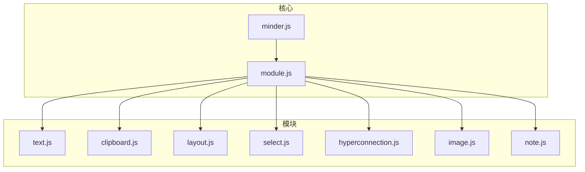
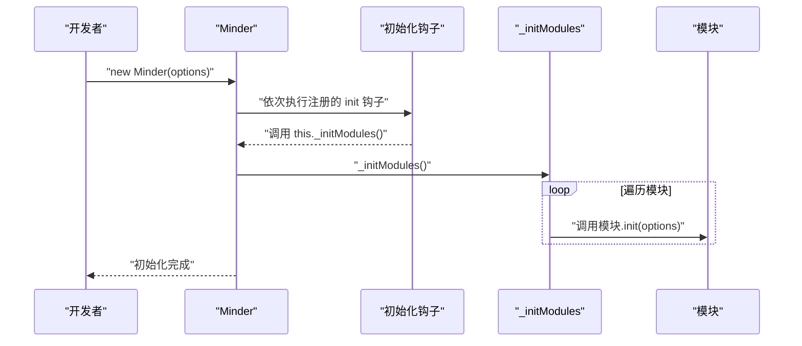
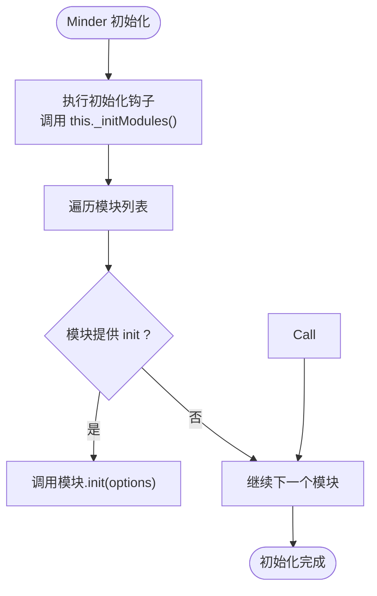
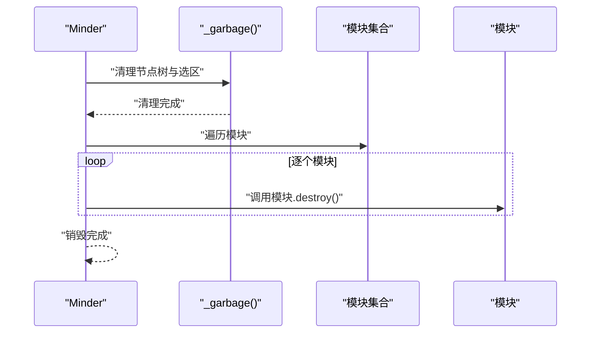
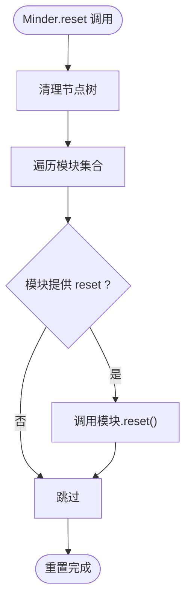
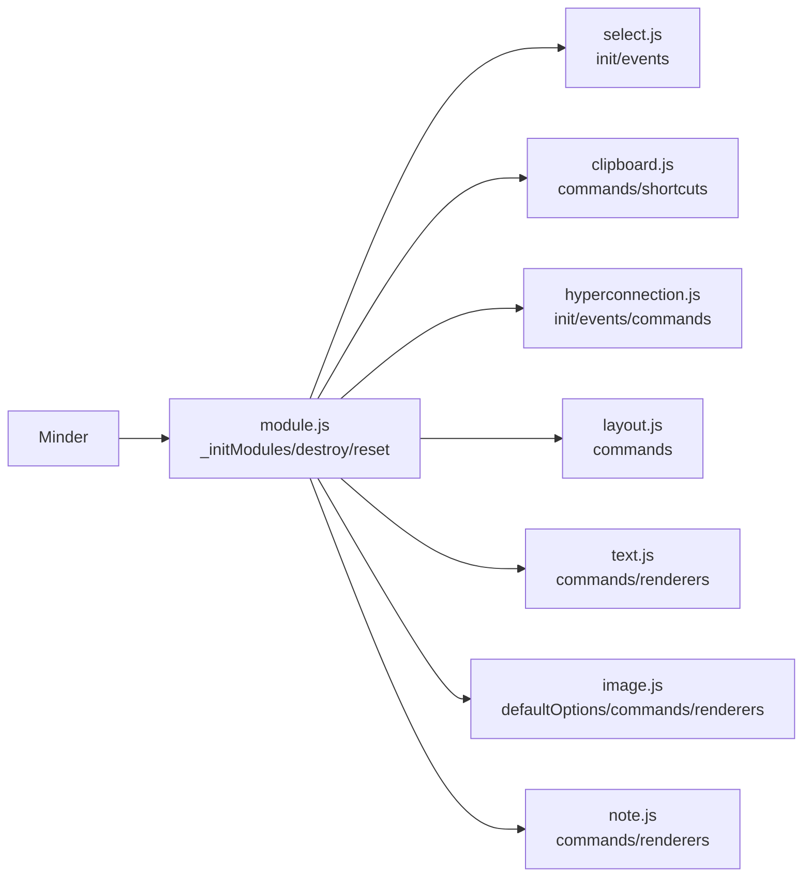

# 模块生命周期

<cite>
**本文引用的文件**
- [module.js](file://src/core/module.js)
- [minder.js](file://src/core/minder.js)
- [Architecture.md](file://doc/Architecture.md)
- [text.js](file://src/module/text.js)
- [clipboard.js](file://src/module/clipboard.js)
- [layout.js](file://src/module/layout.js)
- [select.js](file://src/module/select.js)
- [hyperconnection.js](file://src/module/hyperconnection.js)
- [image.js](file://src/module/image.js)
- [note.js](file://src/module/note.js)
</cite>

## 目录
1. [简介](#简介)
2. [项目结构](#项目结构)
3. [核心组件](#核心组件)
4. [架构总览](#架构总览)
5. [详细组件分析](#详细组件分析)
6. [依赖分析](#依赖分析)
7. [性能考虑](#性能考虑)
8. [故障排查指南](#故障排查指南)
9. [结论](#结论)

## 简介
本篇文档围绕模块生命周期展开，系统讲解 init、destroy、reset 三类生命周期回调的执行时机与应用场景。基于 module.js 的实现，阐明 Minder 初始化时如何调用模块的 init 方法，销毁时如何通过 destroy 回收资源，以及重置时 reset 如何清理状态。结合 Architecture.md 中的模块定义示例，展示这些回调在实际模块中的使用模式，帮助模块正确管理自身状态与资源。

## 项目结构
- 核心运行时位于 src/core，其中 module.js 负责模块注册与生命周期管理，minder.js 提供初始化钩子机制。
- 模块位于 src/module，每个模块以 Module.register(...) 方式注册，可提供 init、destroy、reset、commands、events、renderers 等能力。
- Architecture.md 提供模块定义规范与生命周期说明，是理解模块回调语义的重要参考。

图表来源
- [module.js](file://src/core/module.js#L1-L151)
- [minder.js](file://src/core/minder.js#L1-L41)
- [text.js](file://src/module/text.js#L278-L289)
- [clipboard.js](file://src/module/clipboard.js#L1-L172)
- [layout.js](file://src/module/layout.js#L76-L92)
- [select.js](file://src/module/select.js#L11-L184)
- [hyperconnection.js](file://src/module/hyperconnection.js#L772-L800)
- [image.js](file://src/module/image.js#L134-L147)
- [note.js](file://src/module/note.js#L107-L116)

章节来源
- [module.js](file://src/core/module.js#L1-L151)
- [minder.js](file://src/core/minder.js#L1-L41)
- [Architecture.md](file://doc/Architecture.md#L198-L251)

## 核心组件
- 模块注册与生命周期管理：module.js 提供 register、_initModules、destroy、reset 等关键逻辑。
- 初始化钩子：minder.js 提供 registerInitHook 与构造函数中的初始化流程，确保模块在 Minder 实例化时被加载。
- 模块定义规范：Architecture.md 明确模块可提供的 init、destroy、reset 等回调，以及命令、事件、渲染器等能力。

章节来源
- [module.js](file://src/core/module.js#L1-L151)
- [minder.js](file://src/core/minder.js#L1-L41)
- [Architecture.md](file://doc/Architecture.md#L198-L251)

## 架构总览
Minder 初始化时，先执行注册的 init 钩子，随后调用 _initModules，逐个加载模块并调用其 init 回调。销毁时调用 destroy，逐个模块调用 destroy 回调进行资源回收。重置时调用 reset，逐个模块调用 reset 回调清理状态。

图表来源
- [minder.js](file://src/core/minder.js#L1-L41)
- [module.js](file://src/core/module.js#L13-L20)
- [module.js](file://src/core/module.js#L20-L118)

## 详细组件分析

### 初始化阶段：init 回调
- 执行时机：Minder 实例化后，注册的初始化钩子会调用 Minder 的 _initModules，逐个模块调用其 init 回调。
- 参数：init 接收 Minder 的最终配置对象，模块可据此设置默认选项、绑定事件、注册命令等。
- 典型用途：
  - 设置 defaultOptions，供全局默认值生效。
  - 绑定事件处理器，如框选模块在 init 中监听窗口鼠标事件。
  - 创建渲染容器、状态缓存等一次性资源。
- 示例模块：
  - 框选模块：在 init 中为 window 绑定 mouseup 事件，用于结束框选。
  - 超连接模块：在 init 中创建超连接容器，准备渲染环境。
  - 文本模块：在 Module.register 返回对象中提供 commands、renderers 等，init 通常用于事件绑定或状态初始化。

图表来源
- [module.js](file://src/core/module.js#L13-L20)
- [module.js](file://src/core/module.js#L20-L118)
- [select.js](file://src/module/select.js#L114-L118)
- [hyperconnection.js](file://src/module/hyperconnection.js#L774-L787)

章节来源
- [module.js](file://src/core/module.js#L20-L118)
- [select.js](file://src/module/select.js#L114-L118)
- [hyperconnection.js](file://src/module/hyperconnection.js#L774-L787)
- [text.js](file://src/module/text.js#L278-L289)
- [Architecture.md](file://doc/Architecture.md#L204-L249)

### 销毁阶段：destroy 回调
- 执行时机：Minder.destroy 被调用时，先重置事件与清理节点树，再逐个模块调用其 destroy 回调。
- 资源回收：模块应在 destroy 中释放事件监听、DOM 引用、定时器、渲染容器等资源，避免内存泄漏。
- 典型用途：
  - 解绑全局事件（如 window、document）。
  - 移除渲染容器或图形元素。
  - 清空内部状态缓存。
- 示例模块：
  - 超连接模块：在 destroy 中可移除临时连线、控制点手柄等图形对象，确保渲染容器被清理。
  - 文本模块：若模块持有外部资源（如字体兼容性数据），可在 destroy 中释放。
  - 剪贴板模块：在 destroy 中解绑原生 clipboard 事件或清理内部状态。

图表来源
- [module.js](file://src/core/module.js#L120-L151)
- [hyperconnection.js](file://src/module/hyperconnection.js#L774-L800)
- [clipboard.js](file://src/module/clipboard.js#L1-L172)

章节来源
- [module.js](file://src/core/module.js#L120-L151)
- [hyperconnection.js](file://src/module/hyperconnection.js#L774-L800)
- [clipboard.js](file://src/module/clipboard.js#L1-L172)

### 重置阶段：reset 回调
- 执行时机：Minder.reset 被调用时，先清理节点树，再逐个模块调用其 reset 回调。
- 清理逻辑：模块应将自身状态恢复到初始状态，如清空内部缓存、重置 UI 状态、取消选中等，但不移除模块本身。
- 典型用途：
  - 清空临时状态（如拖拽过程中的中间态）。
  - 重置 UI 交互状态（如取消框选、取消超连接创建模式）。
  - 清理模块内部的临时数据结构。
- 示例模块：
  - 超连接模块：在 reset 中取消临时连线、清除拖拽状态、重置容器状态。
  - 布局模块：reset 命令会重置节点布局偏移，reset 回调可用于同步模块内部状态。
  - 选择模块：reset 回调可确保框选状态被清理。

图表来源
- [module.js](file://src/core/module.js#L140-L149)
- [hyperconnection.js](file://src/module/hyperconnection.js#L774-L800)
- [layout.js](file://src/module/layout.js#L48-L74)

章节来源
- [module.js](file://src/core/module.js#L140-L149)
- [hyperconnection.js](file://src/module/hyperconnection.js#L774-L800)
- [layout.js](file://src/module/layout.js#L48-L74)

### 生命周期在实际模块中的使用模式
- 文本模块（text.js）
  - 通过 Module.register 注册模块，返回 commands、renderers 等。
  - 该模块未显式提供 init/destroy/reset，说明其生命周期主要由 Minder 的命令与渲染系统驱动。
  - 章节来源
    - [text.js](file://src/module/text.js#L278-L289)

- 框选模块（select.js）
  - 提供 init：在初始化时为 window 绑定 mouseup 事件，确保框选结束后能正确清理状态。
  - 提供 events：处理 mousedown/mousemove/mouseup 等交互事件，实现框选逻辑。
  - 章节来源
    - [select.js](file://src/module/select.js#L114-L118)
    - [select.js](file://src/module/select.js#L119-L183)

- 剪贴板模块（clipboard.js）
  - 提供 commands：copy/cut/paste 命令。
  - 提供 commandShortcutKeys：绑定快捷键。
  - 提供 clipBoardEvents：在支持原生 clipboard 事件时绑定 copy/cut/paste 事件。
  - 章节来源
    - [clipboard.js](file://src/module/clipboard.js#L143-L171)
    - [clipboard.js](file://src/module/clipboard.js#L157-L171)

- 超连接模块（hyperconnection.js）
  - 提供 init：创建超连接容器、初始化拖拽状态与节流器。
  - 提供 events：在布局完成后更新所有超连接。
  - 提供 commands：StartHyperConnection、AddHyperConnection、RemoveHyperConnection。
  - 章节来源
    - [hyperconnection.js](file://src/module/hyperconnection.js#L774-L800)
    - [hyperconnection.js](file://src/module/hyperconnection.js#L789-L799)

- 布局模块（layout.js）
  - 提供 commands：layout、resetlayout。
  - reset 回调：reset 命令会重置节点布局偏移，模块内部状态需与之保持一致。
  - 章节来源
    - [layout.js](file://src/module/layout.js#L48-L74)
    - [layout.js](file://src/module/layout.js#L76-L92)

- 图像模块（image.js）
  - 提供 defaultOptions：maxImageWidth/maxImageHeight。
  - 提供 commands：image。
  - 提供 renderers：top。
  - 章节来源
    - [image.js](file://src/module/image.js#L134-L147)

- 备注模块（note.js）
  - 提供 commands：note。
  - 提供 renderers：right。
  - 章节来源
    - [note.js](file://src/module/note.js#L107-L116)

## 依赖分析
- 模块与 Minder 的耦合
  - Minder 通过 module.js 的 _initModules 加载模块，调用模块的 init/destroy/reset。
  - 模块通过 Module.register 注册，返回对象包含 defaultOptions、commands、events、renderers、commandShortcutKeys 等。
- 模块间的协作
  - 剪贴板模块与选择模块配合，选择模块负责框选与选区管理，剪贴板模块负责复制/剪切/粘贴命令。
  - 超连接模块与布局模块配合，布局完成后更新超连接位置。
- 外部依赖
  - 模块可依赖 kity、utils、Minder、MinderNode、Command、Renderer 等核心类。

图表来源
- [module.js](file://src/core/module.js#L20-L149)
- [select.js](file://src/module/select.js#L11-L184)
- [clipboard.js](file://src/module/clipboard.js#L1-L172)
- [hyperconnection.js](file://src/module/hyperconnection.js#L769-L800)
- [layout.js](file://src/module/layout.js#L76-L92)
- [text.js](file://src/module/text.js#L278-L289)
- [image.js](file://src/module/image.js#L134-L147)
- [note.js](file://src/module/note.js#L107-L116)

章节来源
- [module.js](file://src/core/module.js#L20-L149)
- [select.js](file://src/module/select.js#L11-L184)
- [clipboard.js](file://src/module/clipboard.js#L1-L172)
- [hyperconnection.js](file://src/module/hyperconnection.js#L769-L800)
- [layout.js](file://src/module/layout.js#L76-L92)
- [text.js](file://src/module/text.js#L278-L289)
- [image.js](file://src/module/image.js#L134-L147)
- [note.js](file://src/module/note.js#L107-L116)

## 性能考虑
- 初始化阶段
  - init 中避免昂贵操作，尽量延迟到首次使用时再创建资源。
  - 合理使用事件委托与节流，减少全局事件数量。
- 销毁阶段
  - destroy 必须彻底解绑事件与移除 DOM/图形对象，防止内存泄漏。
  - 清理定时器与异步任务，确保无悬挂引用。
- 重置阶段
  - reset 应快速恢复到干净状态，避免重建昂贵资源。
  - 对于需要重绘的场景，尽量批量更新，减少多次重排重绘。

## 故障排查指南
- 问题：模块未生效或行为异常
  - 检查模块是否通过 Module.register 正确注册，返回对象是否包含所需字段。
  - 章节来源
    - [Architecture.md](file://doc/Architecture.md#L204-L249)

- 问题：销毁后仍有内存占用
  - 确认模块是否在 destroy 中解绑全局事件、移除图形对象、清空内部缓存。
  - 章节来源
    - [module.js](file://src/core/module.js#L128-L138)
    - [hyperconnection.js](file://src/module/hyperconnection.js#L774-L800)

- 问题：重置后状态残留
  - 确认模块是否在 reset 中清理临时状态与 UI 状态。
  - 章节来源
    - [module.js](file://src/core/module.js#L140-L149)
    - [hyperconnection.js](file://src/module/hyperconnection.js#L774-L800)

- 问题：初始化顺序导致依赖缺失
  - 确保模块依赖的其他模块已在 Minder 初始化前注册，避免在 init 中访问尚未加载的资源。
  - 章节来源
    - [module.js](file://src/core/module.js#L13-L20)
    - [minder.js](file://src/core/minder.js#L1-L41)

## 结论
模块生命周期的 init、destroy、reset 三者分别对应“加载与准备”、“资源回收”、“状态清理”的职责边界。通过 module.js 的统一调度，Minder 在初始化、销毁、重置时分别调用各模块的生命周期回调，确保模块能够正确管理自身状态与资源。结合 Architecture.md 的模块定义规范，开发者可以在模块中合理使用这些回调，构建健壮、可维护的模块体系。