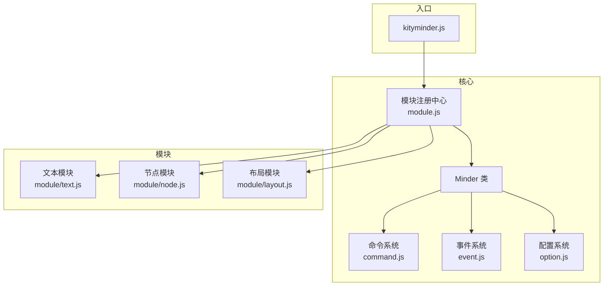
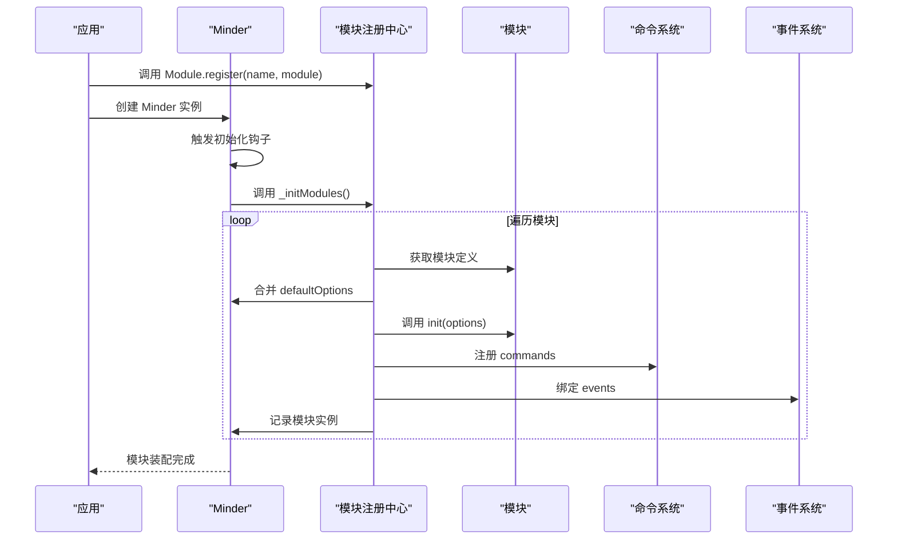
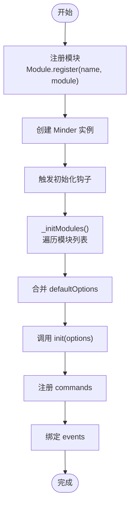
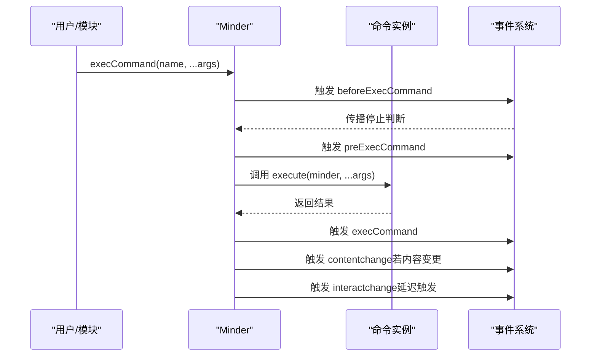
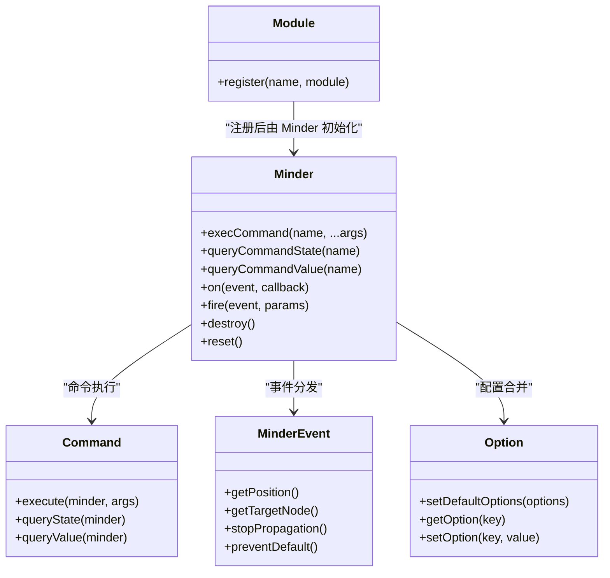

# 模块系统

<cite>
**本文引用的文件**
- [src/core/module.js](file://src/core/module.js)
- [src/core/minder.js](file://src/core/minder.js)
- [src/core/command.js](file://src/core/command.js)
- [src/core/event.js](file://src/core/event.js)
- [src/core/option.js](file://src/core/option.js)
- [src/core/theme.js](file://src/core/theme.js)
- [src/kityminder.js](file://src/kityminder.js)
- [src/module/text.js](file://src/module/text.js)
- [src/module/node.js](file://src/module/node.js)
- [src/module/layout.js](file://src/module/layout.js)
- [doc/Architecture.md](file://doc/Architecture.md)
</cite>

## 目录
1. [引言](#引言)
2. [项目结构](#项目结构)
3. [核心组件](#核心组件)
4. [架构总览](#架构总览)
5. [详细组件分析](#详细组件分析)
6. [依赖分析](#依赖分析)
7. [性能考虑](#性能考虑)
8. [故障排查指南](#故障排查指南)
9. [结论](#结论)
10. [附录](#附录)

## 引言
本文件系统性阐述 KityMinder 的模块系统，重点解释 Module.register() 的注册机制、模块定义结构与生命周期回调（init、destroy、reset）、配置项管理（defaultOptions）、命令注册（commands）、事件处理（events）机制，以及模块间依赖与加载顺序保障。文档同时结合 Architecture.md 中的代码示例，建立模块系统与 Minder、Command、Event 等核心系统的关联，帮助读者从整体到细节全面理解模块化扩展架构。

## 项目结构
模块系统位于核心层，围绕 Minder 类构建，通过模块注册中心统一管理模块的加载、初始化、销毁与重置。入口文件会集中引入各模块，确保模块在 Minder 初始化阶段被正确装配。

图表来源
- [src/kityminder.js](file://src/kityminder.js#L1-L107)
- [src/core/module.js](file://src/core/module.js#L1-L151)
- [src/core/minder.js](file://src/core/minder.js#L1-L41)
- [src/core/command.js](file://src/core/command.js#L1-L169)
- [src/core/event.js](file://src/core/event.js#L1-L270)
- [src/core/option.js](file://src/core/option.js#L1-L34)
- [src/module/text.js](file://src/module/text.js#L1-L289)
- [src/module/node.js](file://src/module/node.js#L1-L150)
- [src/module/layout.js](file://src/module/layout.js#L1-L92)

章节来源
- [src/kityminder.js](file://src/kityminder.js#L1-L107)
- [src/core/module.js](file://src/core/module.js#L1-L151)

## 核心组件
- 模块注册中心：提供 Module.register(name, module) 注册能力，并在 Minder 初始化钩子中触发模块初始化流程。
- Minder 生命周期：通过 init、destroy、reset 三个生命周期回调，分别在模块加载、实例销毁、实例重置时执行模块的对应方法。
- 命令系统：模块通过 commands 字典注册命令，Minder 在模块初始化时将命令实例化并注入到 Minder 的命令池中。
- 事件系统：模块通过 events 字典注册事件监听，Minder 在模块初始化时统一绑定到 Minder 实例上。
- 配置系统：模块通过 defaultOptions 提供默认配置，Minder 在模块初始化时合并到默认配置中，最终生效于模块初始化回调。

章节来源
- [src/core/module.js](file://src/core/module.js#L1-L151)
- [src/core/minder.js](file://src/core/minder.js#L1-L41)
- [src/core/command.js](file://src/core/command.js#L1-L169)
- [src/core/event.js](file://src/core/event.js#L1-L270)
- [src/core/option.js](file://src/core/option.js#L1-L34)

## 架构总览
模块系统围绕 Minder 的初始化钩子展开，形成“注册—初始化—装配—运行—回收”的闭环。模块定义结构包含 defaultOptions、init、commands、events、destroy、reset 等字段，Minder 在初始化阶段按顺序处理这些字段，确保模块间依赖与加载顺序可控。

图表来源
- [src/core/module.js](file://src/core/module.js#L1-L151)
- [src/core/minder.js](file://src/core/minder.js#L1-L41)
- [src/core/command.js](file://src/core/command.js#L1-L169)
- [src/core/event.js](file://src/core/event.js#L1-L270)

## 详细组件分析

### 模块注册与初始化流程
- 注册机制：Module.register(name, module) 将模块注册到全局模块池中，模块可以是对象或返回对象的工厂函数。
- 初始化钩子：Minder 在构造函数中注册初始化钩子，实例化完成后统一调用 _initModules()。
- 加载顺序：Minder._initModules() 会根据 Minder.options.modules 或模块池的 keys 决定加载顺序，逐个执行模块的初始化逻辑。

图表来源
- [src/core/module.js](file://src/core/module.js#L1-L151)
- [src/core/minder.js](file://src/core/minder.js#L1-L41)

章节来源
- [src/core/module.js](file://src/core/module.js#L1-L151)
- [src/core/minder.js](file://src/core/minder.js#L1-L41)

### 模块定义结构与生命周期
- 结构字段
  - defaultOptions：模块默认配置，合并到 Minder 默认配置中。
  - init：模块初始化回调，接收最终配置 options。
  - commands：命令字典，键为命令名，值为命令类，Minder 初始化时实例化并注册。
  - events：事件字典，键为事件名，值为回调，Minder 初始化时统一绑定。
  - destroy：模块销毁回调，Minder.destroy() 时依次调用。
  - reset：模块重置回调，Minder.reset() 时依次调用。
- 生命周期执行时机
  - init：在模块装配阶段调用，确保模块在可用状态下完成自身初始化。
  - destroy：在 Minder.destroy() 时调用，模块负责释放自身资源。
  - reset：在 Minder.reset() 时调用，模块负责恢复到初始状态。

章节来源
- [src/core/module.js](file://src/core/module.js#L1-L151)
- [doc/Architecture.md](file://doc/Architecture.md#L198-L255)

### 配置项管理（defaultOptions）
- 合并策略：模块的 defaultOptions 会在模块初始化前合并到 Minder 的默认配置中，最终生效于模块 init 回调。
- 读取策略：Minder.getOption(key) 会优先返回用户显式设置的 _options[key]，否则回退到 _defaultOptions[key]。

章节来源
- [src/core/module.js](file://src/core/module.js#L49-L51)
- [src/core/option.js](file://src/core/option.js#L1-L34)

### 命令注册（commands）
- 注册方式：模块通过 commands 字典注册命令类，键为命令名（小写），值为命令类。
- 执行流程：Minder.execCommand(name, ...args) 会触发 before/pre/exec/contentchange/interactchange 等事件，命令执行后根据命令的变更标志触发相应事件。

图表来源
- [src/core/command.js](file://src/core/command.js#L1-L169)
- [src/core/event.js](file://src/core/event.js#L1-L270)

章节来源
- [src/core/command.js](file://src/core/command.js#L1-L169)

### 事件处理（events）
- 事件绑定：模块通过 events 字典注册事件监听，Minder 在模块初始化时统一绑定到 Minder 实例上。
- 事件分类：交互事件、命令事件、选择/内容/交互状态事件、模块自定义事件。
- 事件传播：事件系统支持阻止传播、立即阻止、按键码获取、坐标获取等能力。

章节来源
- [src/core/module.js](file://src/core/module.js#L90-L95)
- [src/core/event.js](file://src/core/event.js#L1-L270)
- [doc/Architecture.md](file://doc/Architecture.md#L378-L429)

### 模块间依赖与加载顺序
- 显式顺序：Minder.options.modules 可指定模块加载顺序，未指定时按模块池 keys 的顺序加载。
- 入口依赖：入口文件 kityminder.js 按既定顺序 require 各模块，确保模块在 Minder 初始化前已就绪。
- 依赖约束：模块内部可通过命令与事件与其他模块协作，但模块注册本身不直接声明依赖，顺序主要由入口与 options.modules 控制。

章节来源
- [src/core/module.js](file://src/core/module.js#L21-L23)
- [src/kityminder.js](file://src/kityminder.js#L1-L107)

### 典型模块示例与实践

#### 文本模块（text）
- 功能：提供文本渲染器与文本命令，注册命令名为 text，渲染器类型为 center。
- 关联：通过 Module.register 注册，命令与渲染器均在此模块中定义。

章节来源
- [src/module/text.js](file://src/module/text.js#L1-L289)

#### 节点模块（node）
- 功能：提供节点增删改相关的命令（AppendChildNode、AppendSiblingNode、RemoveNode、AppendParentNode），并绑定快捷键。
- 关联：通过 Module.register('NodeModule', factory) 形式注册，命令字典与快捷键配置在此模块中定义。

章节来源
- [src/module/node.js](file://src/module/node.js#L1-L150)

#### 布局模块（layout）
- 功能：提供布局切换与重置命令，支持上下文菜单与快捷键。
- 关联：通过 Module.register('LayoutModule', ...) 形式注册，命令字典与快捷键配置在此模块中定义。

章节来源
- [src/module/layout.js](file://src/module/layout.js#L1-L92)

## 依赖分析
模块系统与核心系统的耦合关系如下：

图表来源
- [src/core/module.js](file://src/core/module.js#L1-L151)
- [src/core/minder.js](file://src/core/minder.js#L1-L41)
- [src/core/command.js](file://src/core/command.js#L1-L169)
- [src/core/event.js](file://src/core/event.js#L1-L270)
- [src/core/option.js](file://src/core/option.js#L1-L34)

章节来源
- [src/core/module.js](file://src/core/module.js#L1-L151)
- [src/core/minder.js](file://src/core/minder.js#L1-L41)
- [src/core/command.js](file://src/core/command.js#L1-L169)
- [src/core/event.js](file://src/core/event.js#L1-L270)
- [src/core/option.js](file://src/core/option.js#L1-L34)

## 性能考虑
- 模块数量与初始化成本：模块越多，初始化阶段的命令注册、事件绑定、渲染器收集成本越高。建议仅启用必要模块或通过 options.modules 精确控制加载顺序。
- 事件风暴：高频交互事件（如 mousemove、touchmove）经事件系统稀释后触发，避免过度重绘；命令执行后的内容变更与交互变更事件也会进行节流处理。
- 布局与渲染：模块在执行命令时可能触发布局与渲染，应避免在同一帧内频繁触发，必要时合并命令或延后执行。

## 故障排查指南
- 模块未生效
  - 检查模块是否通过 Module.register 正确注册。
  - 检查 Minder.options.modules 是否包含该模块名，或是否遗漏入口文件中的 require。
- 命令无法执行
  - 检查命令是否在模块的 commands 字典中注册，键名是否为小写。
  - 检查命令的 queryState 返回值是否允许执行。
- 事件未触发
  - 检查模块 events 字典中的事件名是否正确，回调是否绑定到 Minder 实例。
  - 检查事件是否被中途阻止传播。
- 配置未生效
  - 检查 defaultOptions 是否在模块初始化前合并，最终生效于 init 回调。
  - 检查用户设置的 _options 是否覆盖了默认配置。

章节来源
- [src/core/module.js](file://src/core/module.js#L49-L51)
- [src/core/command.js](file://src/core/command.js#L1-L169)
- [src/core/event.js](file://src/core/event.js#L1-L270)
- [src/core/option.js](file://src/core/option.js#L1-L34)

## 结论
模块系统通过统一的注册与初始化机制，将命令、事件、配置、渲染器等能力以模块形式解耦，既保证了扩展性，又确保了加载顺序与生命周期的一致性。结合命令与事件系统，模块间可通过命令与事件实现松耦合通信。通过合理使用 defaultOptions、commands、events、destroy、reset 等字段，开发者可以快速构建可插拔的功能模块，并在 Minder 的生命周期中安全地完成资源的申请与回收。

## 附录
- 模块定义结构参考：Architecture.md 中的 Module 章节，包含 defaultOptions、init、commands、events、destroy、reset 的定义与说明。
- 主题系统：主题注册与查询由 Theme 模块提供，与模块系统协同工作，用于样式层面的扩展。

章节来源
- [doc/Architecture.md](file://doc/Architecture.md#L198-L255)
- [src/core/theme.js](file://src/core/theme.js#L1-L51)