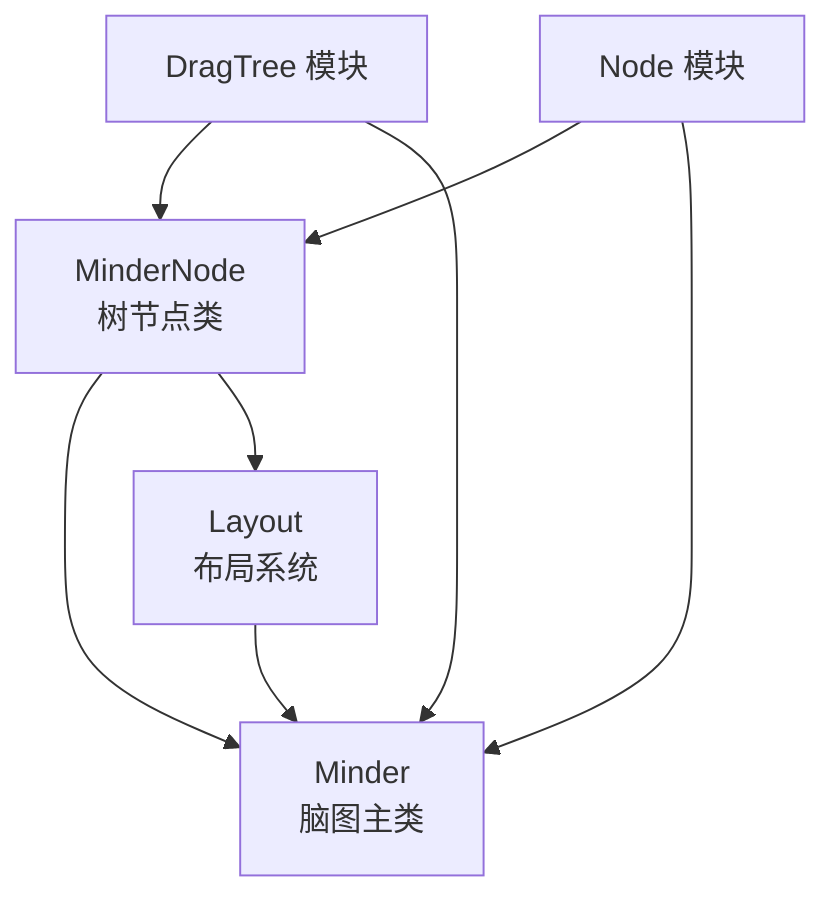
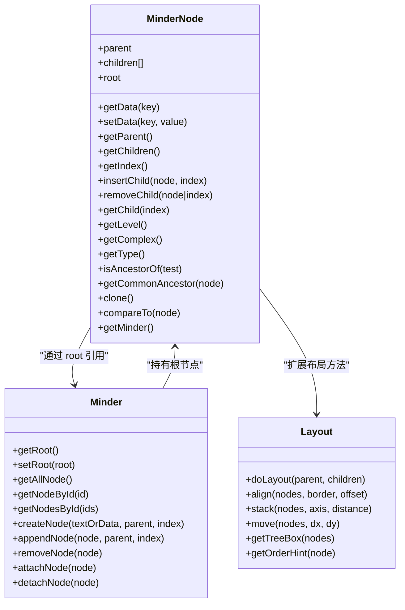
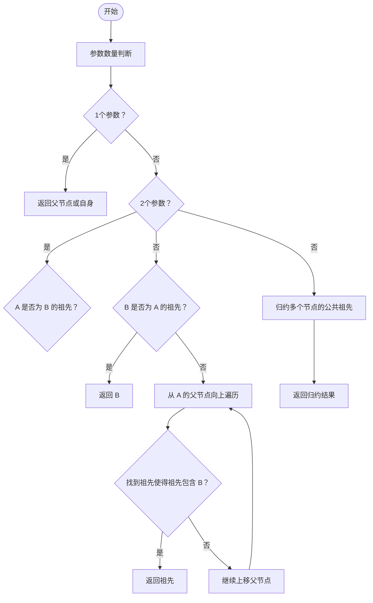
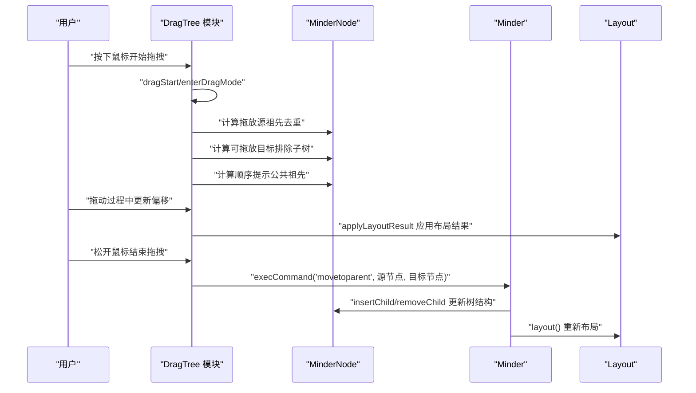
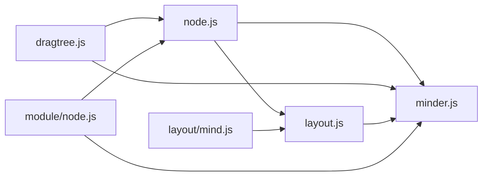

# 树形结构操作

<cite>
**本文引用的文件**
- [src/core/node.js](file://src/core/node.js)
- [doc/Architecture.md](file://doc/Architecture.md)
- [src/module/dragtree.js](file://src/module/dragtree.js)
- [src/core/layout.js](file://src/core/layout.js)
- [src/layout/mind.js](file://src/layout/mind.js)
- [src/module/node.js](file://src/module/node.js)
- [src/core/minder.js](file://src/core/minder.js)
</cite>

## 目录
1. [引言](#引言)
2. [项目结构](#项目结构)
3. [核心组件](#核心组件)
4. [架构总览](#架构总览)
5. [详细组件分析](#详细组件分析)
6. [依赖分析](#依赖分析)
7. [性能考虑](#性能考虑)
8. [故障排查指南](#故障排查指南)
9. [结论](#结论)

## 引言
本篇文档围绕 MinderNode 类的树形结构操作进行系统化梳理，重点解释其作为思维导图基础数据结构的实现机制，涵盖父子关系管理（parent 指针、children 数组、root 引用）、树遍历接口（getParent、getChildren、getIndex、insertChild、removeChild、getChild）、辅助方法（getLevel、getComplex、getType）、高级树操作（isAncestorOf、getCommonAncestor）以及在节点拖拽、布局计算等场景中的实际应用，并建立与 Minder、Layout 系统的关联。

## 项目结构
- 核心节点类 MinderNode 定义于核心模块，提供树结构与数据存取能力。
- 拖拽树节点模块通过 MinderNode 的父子关系与布局信息实现拖放交互。
- 布局系统通过 MinderNode 的布局变换矩阵与盒模型参与整体布局计算。
- Architecture.md 提供了高层架构说明，明确了 MinderNode 的职责边界与对外接口。

图表来源
- [src/core/node.js](file://src/core/node.js#L1-L283)
- [src/core/layout.js](file://src/core/layout.js#L1-L120)
- [src/module/dragtree.js](file://src/module/dragtree.js#L1-L120)
- [src/module/node.js](file://src/module/node.js#L1-L150)
- [src/core/minder.js](file://src/core/minder.js#L1-L41)

章节来源
- [doc/Architecture.md](file://doc/Architecture.md#L256-L311)

## 核心组件
- MinderNode：树节点类，负责维护父子关系、子节点数组、根节点引用、数据存储、渲染容器、树遍历、克隆与比较、祖先判定与公共祖先查找等。
- Minder：脑图主类，持有根节点，提供节点创建、附加/分离渲染容器、遍历节点集合等能力。
- Layout：布局系统基类，提供布局注册、对齐、堆叠、移动、树盒计算等通用能力，并扩展 MinderNode 以支持布局变换与盒模型。
- DragTree 模块：基于 MinderNode 的拖拽交互，利用父子关系与布局盒信息实现拖放目标判定与顺序提示。
- Node 模块：基于 MinderNode 的节点增删改命令，体现树结构在交互中的使用。

章节来源
- [src/core/node.js](file://src/core/node.js#L1-L283)
- [src/core/minder.js](file://src/core/minder.js#L1-L41)
- [src/core/layout.js](file://src/core/layout.js#L1-L120)
- [src/module/dragtree.js](file://src/module/dragtree.js#L1-L120)
- [src/module/node.js](file://src/module/node.js#L1-L150)

## 架构总览
MinderNode 作为树节点，向上通过 parent 指针与 root 引用维护树结构；向下通过 children 数组承载子节点；通过 Minder 的 setRoot/getRoot 将根节点与 Minder 实例绑定，从而在节点上调用 getMinder 获取所属 Minder。布局系统通过扩展 MinderNode 的布局变换矩阵与盒模型参与布局计算；拖拽模块通过 MinderNode 的布局盒与父子关系实现拖放交互。

图表来源
- [src/core/node.js](file://src/core/node.js#L1-L283)
- [src/core/minder.js](file://src/core/minder.js#L1-L41)
- [src/core/layout.js](file://src/core/layout.js#L1-L120)

## 详细组件分析

### MinderNode 树关系与数据结构
- 父子关系管理
  - parent 指针指向父节点，root 引用指向整棵树的根节点。
  - children 数组维护子节点顺序。
- 数据与渲染
  - data 字段保存节点数据（含 id、created 等）。
  - rc（渲染容器）为 Kity.Group，用于图形绘制。
- 关键方法路径
  - 构造初始化：[构造函数](file://src/core/node.js#L19-L40)
  - 根/叶判断：[isRoot](file://src/core/node.js#L48-L52)、[isLeaf](file://src/core/node.js#L54-L59)
  - 根节点获取：[getRoot](file://src/core/node.js#L61-L66)
  - 父子关系与索引：[getParent](file://src/core/node.js#L68-L73)、[getChildren](file://src/core/node.js#L191-L193)、[getIndex](file://src/core/node.js#L195-L197)
  - 插入/移除子节点：[insertChild](file://src/core/node.js#L199-L210)、[appendChild](file://src/core/node.js#L212-L214)、[prependChild](file://src/core/node.js#L216-L218)、[removeChild](file://src/core/node.js#L220-L231)、[clearChildren](file://src/core/node.js#L233-L235)、[getChild](file://src/core/node.js#L237-L239)
  - 渲染容器：[getRenderContainer](file://src/core/node.js#L241-L243)
  - 数据存取：[getData](file://src/core/node.js#L130-L132)、[setData](file://src/core/node.js#L134-L145)、[setText](file://src/core/node.js#L147-L161)、[getText](file://src/core/node.js#L163-L169)

复杂度与一致性
- 插入/移除子节点的时间复杂度为 O(n)（splice 操作），索引查询为 O(1)。
- insertChild 会同步更新 node.root 与 node.parent，确保树结构一致性。

章节来源
- [src/core/node.js](file://src/core/node.js#L1-L283)

### 树遍历接口
- 先序遍历：[preTraverse](file://src/core/node.js#L163-L173)
- 后序遍历：[postTraverse](file://src/core/node.js#L175-L185)
- 便捷遍历：[traverse](file://src/core/node.js#L187-L189)（默认后序）
- 使用场景
  - 布局系统在计算树盒时使用遍历：[getTreeBox](file://src/core/layout.js#L141-L163)
  - Mind 模块在拖拽模块中使用遍历进行渲染容器的附加/分离：[TreeDragger._fadeDragSources](file://src/module/dragtree.js#L202-L214)

复杂度
- 遍历复杂度为 O(N)，N 为子树节点数量。

章节来源
- [src/core/node.js](file://src/core/node.js#L163-L189)
- [src/core/layout.js](file://src/core/layout.js#L141-L163)
- [src/module/dragtree.js](file://src/module/dragtree.js#L202-L214)

### 辅助方法：层级、复杂度、类型
- 层级：[getLevel](file://src/core/node.js#L85-L96)
  - 用途：确定节点在树中的深度，用于类型分级与布局策略选择。
- 复杂度：[getComplex](file://src/core/node.js#L98-L107)
  - 用途：统计子树节点总数，用于布局动画阈值判断（如复杂度>200 时关闭动画）。
- 类型：[getType](file://src/core/node.js#L110-L115)
  - 用途：根据层级映射为 root/main/sub 三类，用于样式与布局差异化。

章节来源
- [src/core/node.js](file://src/core/node.js#L85-L115)
- [src/core/layout.js](file://src/core/layout.js#L458-L460)

### 高级树操作：祖先判定与公共祖先
- 祖先判定：[isAncestorOf](file://src/core/node.js#L118-L128)
  - 用途：判断当前节点是否为测试节点的祖先，用于拖拽目标限制与选择集合的祖先去重。
- 公共祖先：[getCommonAncestor](file://src/core/node.js#L245-L247) 与静态方法 [MinderNode.getCommonAncestor](file://src/core/node.js#L285-L314)
  - 用途：在多节点拖拽时计算公共祖先，决定可插入的兄弟节点范围与顺序提示区域。
- 在拖拽模块中的应用：
  - 计算拖放源（祖先去重）：[TreeDragger._calcDragSources](file://src/module/dragtree.js#L199-L200)
  - 计算公共祖先以生成顺序提示：[TreeDragger._calcOrderHints](file://src/module/dragtree.js#L247-L267)
  - 节点删除命令中使用公共祖先定位回退选择：[RemoveNodeCommand.execute](file://src/module/node.js#L81-L94)

算法流程（公共祖先）

图表来源
- [src/core/node.js](file://src/core/node.js#L285-L314)
- [src/module/dragtree.js](file://src/module/dragtree.js#L247-L267)
- [src/module/node.js](file://src/module/node.js#L81-L94)

章节来源
- [src/core/node.js](file://src/core/node.js#L118-L128)
- [src/core/node.js](file://src/core/node.js#L245-L314)
- [src/module/dragtree.js](file://src/module/dragtree.js#L199-L267)
- [src/module/node.js](file://src/module/node.js#L81-L94)

### 与 Minder、Layout 的集成
- Minder 与节点的关系
  - Minder 通过 setRoot/getRoot 绑定根节点，并在节点创建/移除时维护渲染容器的附加/分离：[setRoot](file://src/core/node.js#L316-L325)、[attachNode](file://src/core/node.js#L377-L387)、[detachNode](file://src/core/node.js#L389-L398)。
  - Minder 提供 createNode/appendNode/removeNode 等高层封装，底层委托 MinderNode 的 insertChild/removeChild 等方法。
- 布局系统与节点的关系
  - 布局系统扩展 MinderNode，提供布局名称、布局实例、布局变换矩阵、全局布局变换、布局盒、布局偏移等能力：[MinderNode 布局扩展](file://src/core/layout.js#L196-L384)。
  - Minder.layout 驱动布局计算，遍历节点并调用具体布局算法：[Minder.layout](file://src/core/layout.js#L391-L436)。
  - 思维导图布局 mind.js 将子节点分为左右两组并分别应用左右布局：[mind.js](file://src/layout/mind.js#L1-L62)。

序列图：拖拽节点到目标节点

图表来源
- [src/module/dragtree.js](file://src/module/dragtree.js#L1-L171)
- [src/core/layout.js](file://src/core/layout.js#L391-L436)
- [src/module/node.js](file://src/module/node.js#L1-L150)
- [src/core/node.js](file://src/core/node.js#L199-L231)

章节来源
- [src/core/node.js](file://src/core/node.js#L316-L387)
- [src/core/layout.js](file://src/core/layout.js#L196-L384)
- [src/layout/mind.js](file://src/layout/mind.js#L1-L62)
- [src/module/dragtree.js](file://src/module/dragtree.js#L1-L171)
- [src/module/node.js](file://src/module/node.js#L1-L150)

## 依赖分析
- MinderNode 依赖
  - kity/utils：图形与工具函数。
  - Minder：通过 root 引用与 Minder 绑定。
- Minder 依赖
  - node.js：持有根节点。
  - layout.js：布局系统。
  - module/*：节点操作、拖拽等模块。
- 布局系统依赖
  - MinderNode：扩展布局方法。
  - Minder：提供布局实例管理与布局驱动。
- 拖拽模块依赖
  - MinderNode：父子关系、布局盒、公共祖先。
  - Minder：状态管理、布局应用。

图表来源
- [src/core/node.js](file://src/core/node.js#L1-L283)
- [src/core/minder.js](file://src/core/minder.js#L1-L41)
- [src/core/layout.js](file://src/core/layout.js#L1-L120)
- [src/layout/mind.js](file://src/layout/mind.js#L1-L62)
- [src/module/dragtree.js](file://src/module/dragtree.js#L1-L120)
- [src/module/node.js](file://src/module/node.js#L1-L150)

章节来源
- [src/core/node.js](file://src/core/node.js#L1-L283)
- [src/core/minder.js](file://src/core/minder.js#L1-L41)
- [src/core/layout.js](file://src/core/layout.js#L1-L120)
- [src/layout/mind.js](file://src/layout/mind.js#L1-L62)
- [src/module/dragtree.js](file://src/module/dragtree.js#L1-L120)
- [src/module/node.js](file://src/module/node.js#L1-L150)

## 性能考虑
- 遍历与复杂度
  - getComplex 使用后序遍历统计节点数，复杂度 O(N)。
  - 布局系统在节点数超过阈值（如 200）时关闭动画，避免大规模动画带来的性能问题：[applyLayoutResult 中的复杂度判断](file://src/core/layout.js#L458-L460)。
- 插入/移除子节点
  - insertChild/removeChild 基于数组 splice，时间复杂度 O(n)；若频繁变更顺序，建议批量操作或使用更高效的数据结构。
- 布局盒计算
  - getTreeBox 递归合并子树盒，复杂度 O(N)；在展开/收起频繁的场景下，可考虑缓存策略减少重复计算。

[本节为通用性能讨论，不直接分析具体文件]

## 故障排查指南
- 拖拽目标不可达
  - 检查拖拽模块的目标计算逻辑，确认是否排除了子树：[TreeDragger._calcDropTargets](file://src/module/dragtree.js#L226-L245)。
- 顺序提示不正确
  - 检查公共祖先计算与兄弟节点顺序提示生成：[TreeDragger._calcOrderHints](file://src/module/dragtree.js#L247-L267)。
- 删除节点后选区异常
  - 检查删除命令中对公共祖先与回退选择的处理：[RemoveNodeCommand.execute](file://src/module/node.js#L81-L94)。
- 布局错位或闪烁
  - 检查布局应用阶段的矩阵更新与动画时序：[applyLayoutResult](file://src/core/layout.js#L444-L519)。

章节来源
- [src/module/dragtree.js](file://src/module/dragtree.js#L226-L267)
- [src/module/node.js](file://src/module/node.js#L81-L94)
- [src/core/layout.js](file://src/core/layout.js#L444-L519)

## 结论
MinderNode 以 parent/children/root 为核心，提供完备的树关系维护与遍历能力，并通过 Minder 与 Layout 系统实现与渲染、布局的无缝集成。isAncestorOf 与 getCommonAncestor 等高级算法在拖拽交互中发挥关键作用，支撑多节点拖拽、顺序提示与目标限制等复杂交互。配合布局系统，MinderNode 在节点拖拽、布局计算、渲染更新等方面形成清晰的职责边界与协作关系。