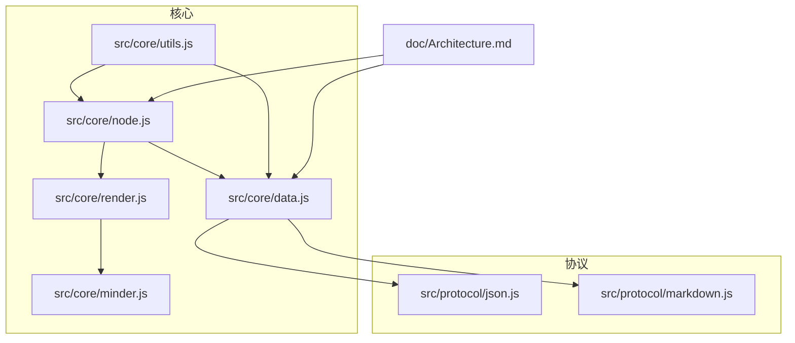
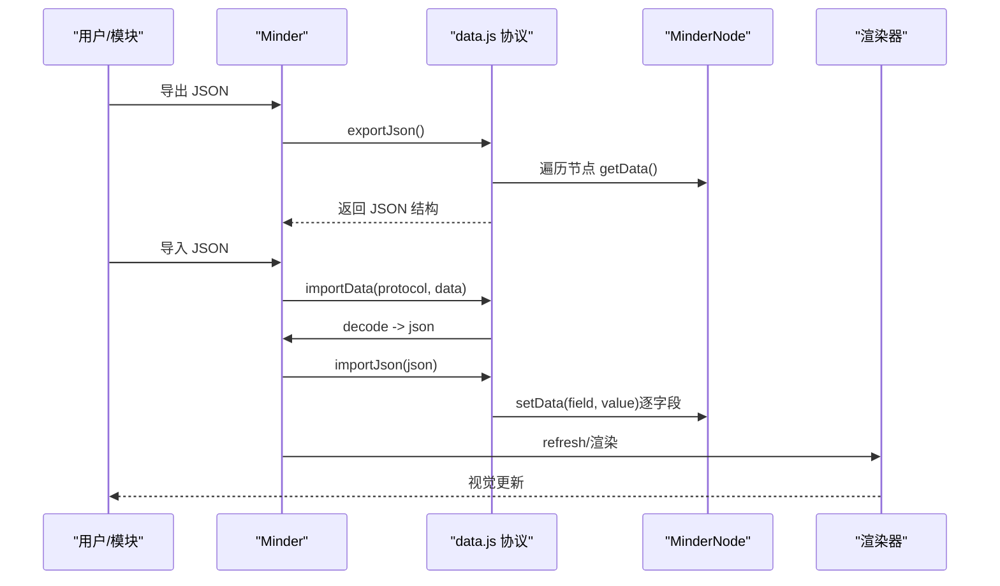
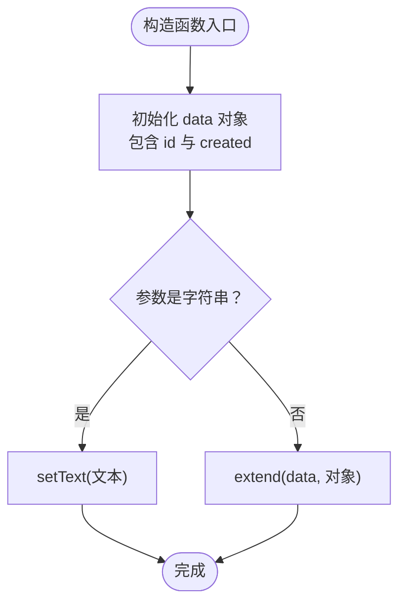
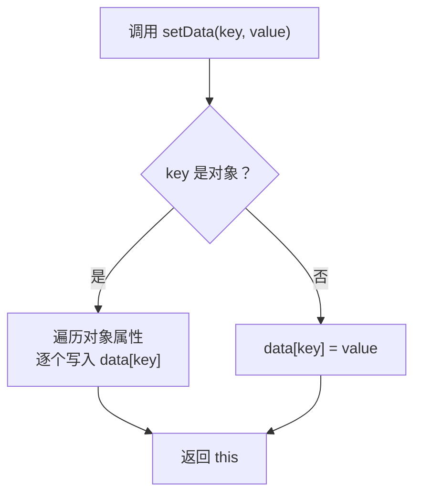
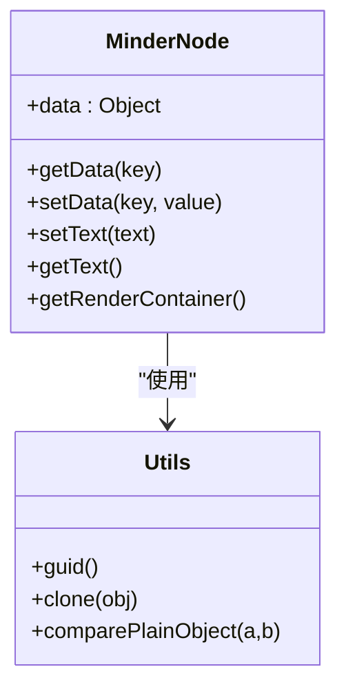
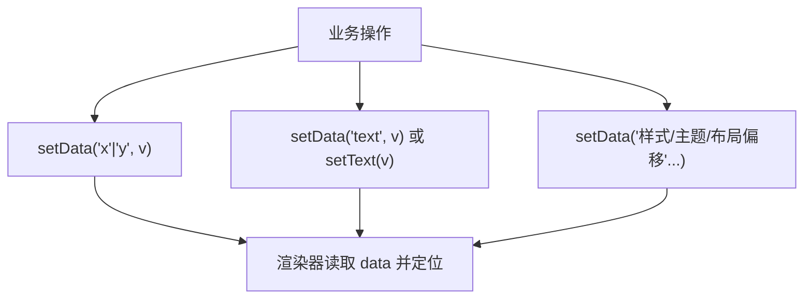
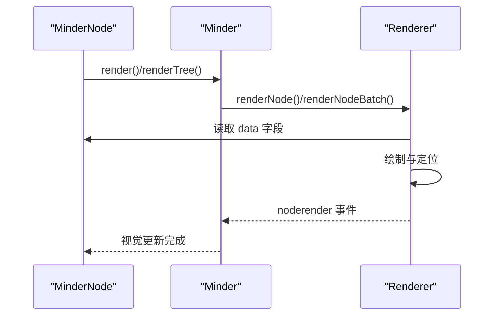
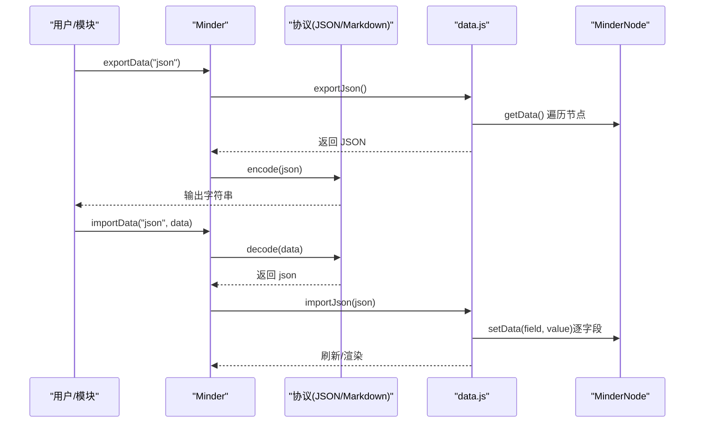
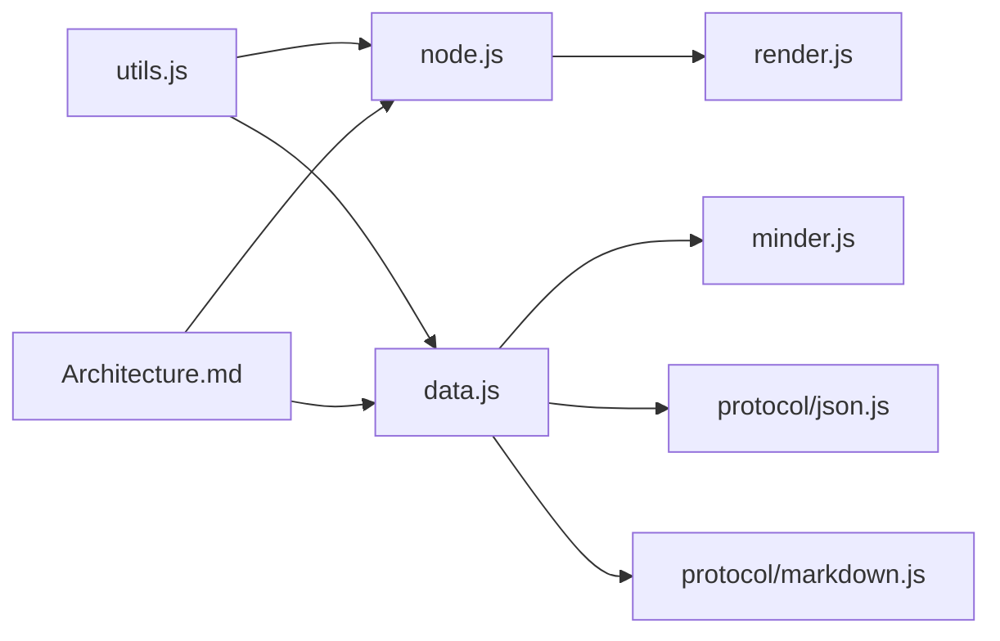

# 节点数据管理

<cite>
**本文引用的文件**
- [src/core/node.js](file://src/core/node.js)
- [src/core/data.js](file://src/core/data.js)
- [src/core/render.js](file://src/core/render.js)
- [src/core/utils.js](file://src/core/utils.js)
- [src/core/minder.js](file://src/core/minder.js)
- [src/protocol/json.js](file://src/protocol/json.js)
- [src/protocol/markdown.js](file://src/protocol/markdown.js)
- [doc/Architecture.md](file://doc/Architecture.md)
</cite>

## 目录
1. [引言](#引言)
2. [项目结构](#项目结构)
3. [核心组件](#核心组件)
4. [架构总览](#架构总览)
5. [详细组件分析](#详细组件分析)
6. [依赖分析](#依赖分析)
7. [性能考虑](#性能考虑)
8. [故障排查指南](#故障排查指南)
9. [结论](#结论)
10. [附录](#附录)

## 引言
本文件围绕 MinderNode 类的数据管理机制展开，系统讲解其基于 data 对象的数据存取体系，深入解析 getData() 与 setData() 的实现原理与使用模式，涵盖单字段获取、全量数据获取、批量数据设置等场景；同时说明节点核心属性（如 id、text、created）的初始化与管理方式，以及通过 setData() 管理节点坐标（x、y）、文本内容及其他扩展属性的实践方法。文档还将阐述数据变更的传播机制及其与渲染系统的联动关系，并结合 Architecture.md 中关于公开字段的说明，解释数据模型如何支持主题、样式等扩展功能，最后说明其在数据导入导出（JSON/Markdown）过程中的序列化行为。

## 项目结构
本仓库采用模块化组织，核心与数据导入导出、渲染、协议等模块分层清晰。与本主题直接相关的文件包括：
- 节点类与数据存取：src/core/node.js
- 数据导入导出与协议：src/core/data.js、src/protocol/json.js、src/protocol/markdown.js
- 渲染联动：src/core/render.js
- 工具函数：src/core/utils.js
- 核心类 Minder：src/core/minder.js
- 架构说明：doc/Architecture.md

图表来源
- [src/core/node.js](file://src/core/node.js#L1-L283)
- [src/core/data.js](file://src/core/data.js#L31-L416)
- [src/core/render.js](file://src/core/render.js#L1-L261)
- [src/core/utils.js](file://src/core/utils.js#L1-L66)
- [src/core/minder.js](file://src/core/minder.js#L1-L41)
- [src/protocol/json.js](file://src/protocol/json.js#L1-L18)
- [src/protocol/markdown.js](file://src/protocol/markdown.js#L1-L158)
- [doc/Architecture.md](file://doc/Architecture.md#L256-L311)

章节来源
- [src/core/node.js](file://src/core/node.js#L1-L283)
- [src/core/data.js](file://src/core/data.js#L31-L416)
- [src/core/render.js](file://src/core/render.js#L1-L261)
- [src/core/utils.js](file://src/core/utils.js#L1-L66)
- [src/core/minder.js](file://src/core/minder.js#L1-L41)
- [src/protocol/json.js](file://src/protocol/json.js#L1-L18)
- [src/protocol/markdown.js](file://src/protocol/markdown.js#L1-L158)
- [doc/Architecture.md](file://doc/Architecture.md#L256-L311)

## 核心组件
- MinderNode：负责节点树关系与数据存取，维护 data 对象，提供 getData()/setData()、文本读写、坐标读写、克隆比较、渲染容器访问等能力。
- Minder：承载脑图实例，提供节点创建、附加/分离、刷新、导入导出等高层操作。
- 数据协议：通过 data.js 中的协议注册与编解码，支持 JSON、Markdown 等格式。
- 渲染器：根据节点 data 字段驱动图形绘制与定位，实现数据到视觉的映射。
- 工具函数：提供 guid、clone、comparePlainObject 等通用能力，支撑节点初始化与一致性校验。

章节来源
- [src/core/node.js](file://src/core/node.js#L1-L283)
- [src/core/data.js](file://src/core/data.js#L31-L416)
- [src/core/render.js](file://src/core/render.js#L1-L261)
- [src/core/utils.js](file://src/core/utils.js#L1-L66)
- [doc/Architecture.md](file://doc/Architecture.md#L256-L311)

## 架构总览
MinderNode 的数据模型以 data 对象为核心，所有公开字段均存储于此，既保证了渲染与模块读取的一致性，也确保了导入导出时的完整性。Minder 在导入导出时通过协议将 data 对象序列化/反序列化，渲染器根据 data 字段决定绘制与定位。事件系统贯穿导入导出前后，确保数据变更后的刷新与联动。

图表来源
- [src/core/data.js](file://src/core/data.js#L50-L117)
- [src/core/data.js](file://src/core/data.js#L181-L223)
- [src/core/data.js](file://src/core/data.js#L225-L308)
- [src/core/render.js](file://src/core/render.js#L165-L219)
- [src/core/node.js](file://src/core/node.js#L130-L145)

## 详细组件分析

### MinderNode 数据模型与初始化
- 初始化时，data 对象包含 id 与 created 两个核心字段，id 由工具函数生成，created 为时间戳，确保每个节点具备唯一标识与创建时间。
- 构造函数支持两种初始化方式：字符串（作为初始文本）或对象（直接合并到 data）。
- 渲染容器 rc 与 minderNode 关联，便于渲染器访问节点。

图表来源
- [src/core/node.js](file://src/core/node.js#L19-L40)
- [src/core/utils.js](file://src/core/utils.js#L13-L15)

章节来源
- [src/core/node.js](file://src/core/node.js#L19-L40)
- [src/core/utils.js](file://src/core/utils.js#L13-L15)

### getData() 与 setData() 的实现与使用模式
- 单字段获取：getData(key) 在 key 存在时返回对应值，否则返回 data 对象本身（全量获取）。
- 单字段设置：setData(key, value) 将值写入 data[key]。
- 批量设置：setData(map) 会遍历对象的所有自有属性，逐个写入 data，实现一次性批量赋值。
- 返回 this：setData() 返回节点实例，便于链式调用。

图表来源
- [src/core/node.js](file://src/core/node.js#L134-L145)

章节来源
- [src/core/node.js](file://src/core/node.js#L130-L145)

### 节点核心属性：id、text、created 的管理
- id：构造时自动生成，保证唯一性；在导出时若缺失会回填并同步到 data。
- text：通过 setText()/getText() 读写，内部映射到 data.text。
- created：构造时记录时间戳，可用于排序、统计等场景。

图表来源
- [src/core/node.js](file://src/core/node.js#L19-L40)
- [src/core/node.js](file://src/core/node.js#L147-L162)
- [src/core/utils.js](file://src/core/utils.js#L13-L15)
- [src/core/utils.js](file://src/core/utils.js#L31-L33)

章节来源
- [src/core/node.js](file://src/core/node.js#L19-L40)
- [src/core/node.js](file://src/core/node.js#L147-L162)
- [src/core/utils.js](file://src/core/utils.js#L13-L15)
- [src/core/utils.js](file://src/core/utils.js#L31-L33)

### 通过 setData() 管理坐标与扩展属性
- 坐标管理：公开字段支持 x、y，可通过 setData("x", v)、setData("y", v) 设置节点位置；渲染器据此定位节点图形。
- 文本内容：setData("text", v) 与 setText()/getText() 等价，统一写入 data.text。
- 扩展属性：除公开字段外，data 对象还可承载其他业务属性，如样式、主题、布局偏移等，均可通过 setData() 写入并在渲染时读取。

图表来源
- [doc/Architecture.md](file://doc/Architecture.md#L288-L301)
- [src/core/node.js](file://src/core/node.js#L130-L145)
- [src/core/node.js](file://src/core/node.js#L147-L162)

章节来源
- [doc/Architecture.md](file://doc/Architecture.md#L288-L301)
- [src/core/node.js](file://src/core/node.js#L130-L145)
- [src/core/node.js](file://src/core/node.js#L147-L162)

### 数据变更传播与渲染联动
- 渲染流程：MinderNode.render()/renderTree() 触发 Minder 的渲染器批处理，渲染器遍历节点，根据 data 字段绘制与定位。
- 事件联动：导入导出前后会触发事件（如 beforeimport、import、contentchange、noderender 等），驱动刷新与联动。
- 一致性保障：utils.clone 与 utils.comparePlainObject 用于克隆与比较，确保数据一致性与变更检测。

图表来源
- [src/core/render.js](file://src/core/render.js#L165-L219)
- [src/core/render.js](file://src/core/render.js#L225-L259)
- [src/core/utils.js](file://src/core/utils.js#L31-L33)
- [src/core/utils.js](file://src/core/utils.js#L35-L37)

章节来源
- [src/core/render.js](file://src/core/render.js#L165-L219)
- [src/core/render.js](file://src/core/render.js#L225-L259)
- [src/core/utils.js](file://src/core/utils.js#L31-L33)
- [src/core/utils.js](file://src/core/utils.js#L35-L37)

### 导入导出与序列化行为
- JSON 导出：exportJson() 递归遍历节点，使用 node.getData() 获取 data，并在必要时补全 id，最终输出包含 root、version、template、theme、connections 的结构。
- JSON 导入：importJson() 先清理旧节点，再通过 importNode() 逐字段 setData()，确保每个节点都有唯一 id；随后应用模板与主题，导入自由关联线。
- 协议注册：data.js 中注册协议，json.js 与 markdown.js 分别提供 encode/decode，Minder 通过 importData()/exportData() 与协议协作。
- Markdown 导出/导入：协议将树形结构转换为 Markdown 标题层级，备注以特定标记包裹；导入时解析标题层级与备注，重建节点树。

图表来源
- [src/core/data.js](file://src/core/data.js#L50-L117)
- [src/core/data.js](file://src/core/data.js#L181-L223)
- [src/core/data.js](file://src/core/data.js#L225-L308)
- [src/protocol/json.js](file://src/protocol/json.js#L1-L18)
- [src/protocol/markdown.js](file://src/protocol/markdown.js#L1-L158)

章节来源
- [src/core/data.js](file://src/core/data.js#L50-L117)
- [src/core/data.js](file://src/core/data.js#L181-L223)
- [src/core/data.js](file://src/core/data.js#L225-L308)
- [src/protocol/json.js](file://src/protocol/json.js#L1-L18)
- [src/protocol/markdown.js](file://src/protocol/markdown.js#L1-L158)

## 依赖分析
- MinderNode 依赖 utils 提供的 guid、clone、comparePlainObject 等工具。
- Minder 通过 data.js 提供的协议与导入导出能力，协调节点树的重建与刷新。
- 渲染器依赖 MinderNode 的 data 字段进行绘制与定位，形成“数据驱动渲染”的闭环。
- Architecture.md 明确了公开字段（x、y、text 等）的存在与用途，确保模块间约定一致。

图表来源
- [src/core/utils.js](file://src/core/utils.js#L1-L66)
- [src/core/node.js](file://src/core/node.js#L1-L283)
- [src/core/data.js](file://src/core/data.js#L31-L416)
- [src/core/render.js](file://src/core/render.js#L1-L261)
- [src/core/minder.js](file://src/core/minder.js#L1-L41)
- [src/protocol/json.js](file://src/protocol/json.js#L1-L18)
- [src/protocol/markdown.js](file://src/protocol/markdown.js#L1-L158)
- [doc/Architecture.md](file://doc/Architecture.md#L256-L311)

章节来源
- [src/core/utils.js](file://src/core/utils.js#L1-L66)
- [src/core/node.js](file://src/core/node.js#L1-L283)
- [src/core/data.js](file://src/core/data.js#L31-L416)
- [src/core/render.js](file://src/core/render.js#L1-L261)
- [src/core/minder.js](file://src/core/minder.js#L1-L41)
- [src/protocol/json.js](file://src/protocol/json.js#L1-L18)
- [src/protocol/markdown.js](file://src/protocol/markdown.js#L1-L158)
- [doc/Architecture.md](file://doc/Architecture.md#L256-L311)

## 性能考虑
- 批量渲染：Minder 的 renderNodeBatch() 通过统一遍历与延迟盒计算，减少重复绘制与 DOM 操作。
- 数据克隆与比较：clone 与 comparePlainObject 用于深拷贝与一致性判断，避免不必要的渲染与事件触发。
- 导入导出优化：在导入前清理旧节点，确保内存与渲染效率；协议解码与编码采用 Promise 流程，避免阻塞主线程。

[本节为通用性能建议，不直接分析具体文件]

## 故障排查指南
- 导入后节点位置异常：检查是否通过 setData("x"/"y") 设置了坐标，或布局模块是否覆盖了坐标；确认渲染器是否正确读取 data。
- 文本未更新：确认使用 setText() 或 setData("text", ...)，并触发渲染刷新。
- 导入后缺少 id：确认导出时是否补全 id，或导入时是否自动生成并回填。
- Markdown 导入备注丢失：检查备注标记与代码块识别逻辑，确保备注在正确范围内。

章节来源
- [src/core/node.js](file://src/core/node.js#L130-L162)
- [src/core/data.js](file://src/core/data.js#L50-L117)
- [src/core/data.js](file://src/core/data.js#L181-L223)
- [src/core/data.js](file://src/core/data.js#L225-L308)
- [src/protocol/markdown.js](file://src/protocol/markdown.js#L1-L158)

## 结论
MinderNode 的数据管理以 data 对象为中心，通过 getData()/setData() 提供统一的读写接口，支持单字段、全量与批量设置。核心属性（id、text、created）在初始化阶段完成，配合工具函数确保唯一性与一致性。公开字段（x、y、text）与扩展属性均可通过 setData() 管理，渲染器据此进行绘制与定位。导入导出通过协议与 data.js 协作，确保数据的完整序列化与反序列化。整体架构清晰、职责分明，便于扩展主题、样式等高级功能。

[本节为总结性内容，不直接分析具体文件]

## 附录
- 公开字段与用途（来自 Architecture.md）：x、y 用于节点坐标；text 用于节点文本；data 对象承载所有公开字段，导出/保存时保留。
- 布局与样式扩展：可通过 setData 写入布局偏移、样式信息等，渲染器按需读取。

章节来源
- [doc/Architecture.md](file://doc/Architecture.md#L288-L301)