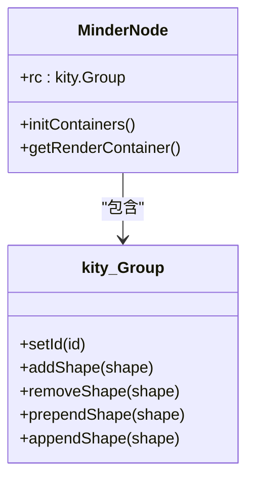
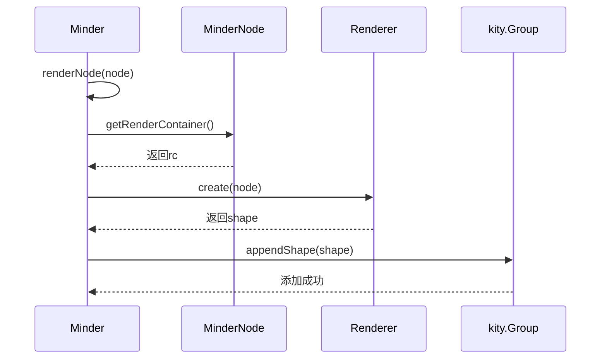
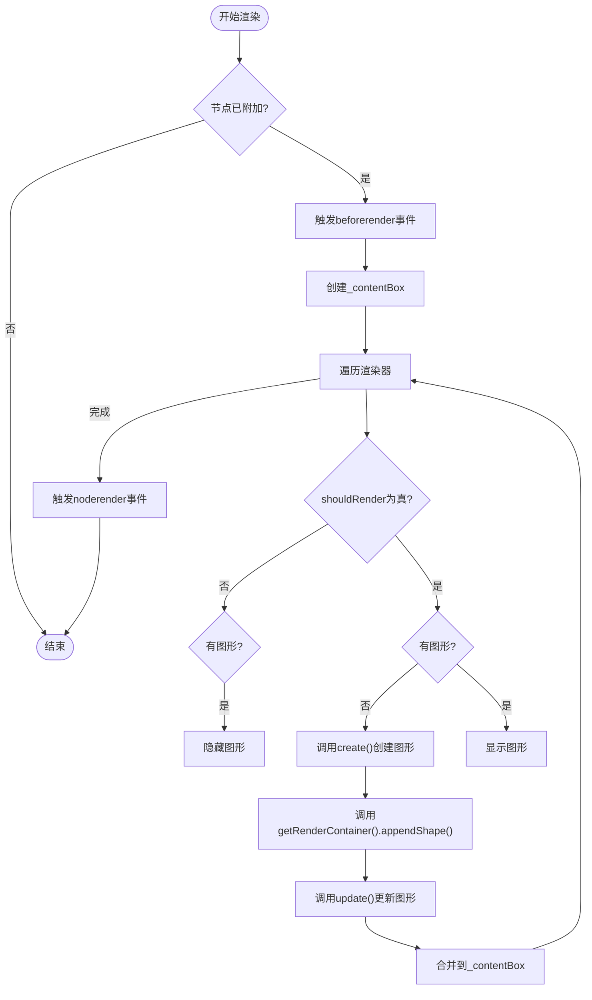

# 节点渲染容器

<cite>
**本文档引用的文件**  
- [node.js](file://src/core/node.js)
- [render.js](file://src/core/render.js)
- [paper.js](file://src/core/paper.js)
- [Architecture.md](file://doc/Architecture.md)
- [text.js](file://src/module/text.js)
- [outline.js](file://src/module/outline.js)
- [image.js](file://src/module/image.js)
</cite>

## 目录
1. [引言](#引言)
2. [渲染容器的创建与初始化](#渲染容器的创建与初始化)
3. [getRenderContainer() 方法设计与实现](#getrendercontainer-方法设计与实现)
4. [渲染容器与Kity图形库的集成机制](#渲染容器与kity图形库的集成机制)
5. [minderNode引用的建立与作用](#mindernode引用的建立与作用)
6. [渲染容器的附加与脱离管理](#渲染容器的附加与脱离管理)
7. [渲染容器与布局系统的协同工作](#渲染容器与布局系统的协同工作)
8. [总结](#总结)

## 引言

在KityMinder脑图系统中，节点渲染容器是连接数据模型与图形界面的核心桥梁。每个`MinderNode`实例都拥有一个独立的渲染容器（`rc`），该容器作为Kity图形库中的`Group`实例，负责承载节点的所有可视化元素。通过`getRenderContainer()`方法，系统能够获取并操作该容器，实现节点图形的动态渲染、布局调整和交互响应。本文档将深入解析渲染容器的设计原理、实现机制及其在整个系统架构中的关键作用。

**Section sources**
- [node.js](file://src/core/node.js#L11-L407)
- [Architecture.md](file://doc/Architecture.md#L256-L306)

## 渲染容器的创建与初始化

### initContainers方法的实现

`MinderNode`类在构造函数中调用`initContainers()`方法，用于初始化其渲染容器。该方法的核心逻辑是创建一个`kity.Group`实例，并将其赋值给节点的`rc`属性。`kity.Group`是Kity图形库中的容器类，能够容纳多个图形元素（如文本、矩形、路径等），并支持统一的变换操作（如平移、旋转、缩放）。



**Diagram sources**
- [node.js](file://src/core/node.js#L42-L45)

### 渲染容器的唯一标识

在创建`kity.Group`实例时，系统会调用`utils.uuid('minder_node')`生成一个唯一的ID，并通过`setId()`方法设置。这一设计确保了每个节点的渲染容器在SVG画布中具有唯一性，便于后续的DOM操作和事件绑定。同时，该ID也作为调试和性能分析的重要标识。

**Section sources**
- [node.js](file://src/core/node.js#L43)

## getRenderContainer() 方法设计与实现

### 方法定义与功能

`getRenderContainer()`是`MinderNode`类的核心方法之一，其定义如下：

```javascript
getRenderContainer: function() {
    return this.rc;
}
```

该方法的作用是返回当前节点的渲染容器实例。它提供了一个统一的接口，使得其他模块（如渲染器、布局器、事件处理器）能够安全地访问和操作节点的图形内容，而无需直接操作`rc`属性。

### 设计优势

1. **封装性**：通过方法访问而非直接属性访问，增强了代码的封装性和可维护性。
2. **扩展性**：未来可以在该方法中添加额外的逻辑（如容器的懒加载、状态检查等），而不会影响调用方。
3. **一致性**：遵循了KityMinder的API设计规范，与其他`getXXX()`方法保持一致。

**Section sources**
- [node.js](file://src/core/node.js#L241-L243)

## 渲染容器与Kity图形库的集成机制

### addShape() 方法的使用

渲染容器通过`addShape()`方法将节点的图形元素添加到画布中。在`render.js`文件中，`renderNode`和`renderNodeBatch`函数负责调用渲染器的`create()`方法创建图形，并通过`getRenderContainer().appendShape()`或`prependShape()`将其添加到容器中。



**Diagram sources**
- [render.js](file://src/core/render.js#L135-L140)
- [node.js](file://src/core/node.js#L242)

### 渲染流程

1. **创建渲染器**：系统根据注册的渲染器类，为节点创建相应的渲染器实例。
2. **创建图形**：调用渲染器的`create()`方法生成具体的图形对象（如`kity.Text`、`kity.Rect`）。
3. **添加到容器**：通过`getRenderContainer()`获取容器，并使用`appendShape()`或`prependShape()`将图形添加进去。
4. **更新位置**：调用`place()`方法根据节点的布局信息调整图形的位置。

**Section sources**
- [render.js](file://src/core/render.js#L134-L140)

## minderNode引用的建立与作用

### 引用的建立

在`initContainers()`方法中，除了创建`kity.Group`实例外，还通过`this.rc.minderNode = this`建立了从渲染容器到`MinderNode`实例的反向引用。这一设计使得图形元素能够直接访问其对应的数据模型。

```javascript
initContainers: function() {
    this.rc = new kity.Group().setId(utils.uuid('minder_node'));
    this.rc.minderNode = this; // 建立反向引用
}
```

### 事件处理中的应用

当用户与节点图形交互时（如点击、双击），事件处理器可以通过`event.target.minderNode`直接获取到对应的`MinderNode`实例，从而执行相应的业务逻辑（如编辑文本、展开/收起子节点）。

### 图形-数据映射

该引用机制实现了图形与数据的双向绑定。一方面，数据的变化可以通过`render()`方法更新图形；另一方面，图形的交互也可以通过`minderNode`引用修改数据，确保了系统状态的一致性。

**Section sources**
- [node.js](file://src/core/node.js#L44)

## 渲染容器的附加与脱离管理

### attachNode 与 detachNode 方法

`Minder`类提供了`attachNode()`和`detachNode()`方法，用于管理节点渲染容器的生命周期。当节点被添加到脑图中时，`attachNode()`会将其渲染容器添加到主渲染容器（`_rc`）中；当节点被移除时，`detachNode()`则会将其从主容器中移除。

```javascript
attachNode: function(node) {
    var rc = this.getRenderContainer();
    node.traverse(function(current) {
        current.attached = true;
        rc.addShape(current.getRenderContainer());
    });
    rc.addShape(node.getRenderContainer());
    this.fire('nodeattach', { node: node });
},

detachNode: function(node) {
    var rc = this.getRenderContainer();
    node.traverse(function(current) {
        current.attached = false;
        rc.removeShape(current.getRenderContainer());
    });
    this.fire('nodedetach', { node: node });
}
```

### 事件驱动的管理

这两个方法在执行时会触发`nodeattach`和`nodedetach`事件，允许其他模块监听并响应节点的附加与脱离操作。例如，布局模块可以在节点附加后重新计算布局，连接线模块可以更新连接关系。

**Section sources**
- [node.js](file://src/core/node.js#L377-L398)

## 渲染容器与布局系统的协同工作

### 布局计算与图形更新

渲染容器与布局系统紧密协作。布局模块计算出每个节点的位置后，会通过`render()`方法触发图形更新。`getRenderContainer()`返回的容器会根据新的位置信息进行平移变换，从而实现节点的重新定位。

### 内容盒（Content Box）的计算

每个节点都有一个`_contentBox`属性，用于存储其内容区域的边界框。渲染器在`update()`方法中会计算并返回这个边界框，供布局系统参考。`getRenderBox()`方法则结合`getRenderContainer()`和`Matrix.getCTM()`，将内容盒转换为画布坐标系下的绝对位置。



**Diagram sources**
- [render.js](file://src/core/render.js#L178-L219)

**Section sources**
- [render.js](file://src/core/render.js#L248-L257)

## 总结

节点渲染容器是KityMinder系统中不可或缺的核心组件。它通过`initContainers()`方法创建，由`getRenderContainer()`方法提供访问接口，并与Kity图形库深度集成，实现了高效的SVG图形渲染。通过`minderNode`引用，容器与数据模型建立了紧密的联系，支持了丰富的交互功能。`attachNode()`和`detachNode()`方法则确保了容器生命周期的正确管理。最终，渲染容器与布局系统协同工作，共同构建了一个高性能、可扩展的脑图编辑器。