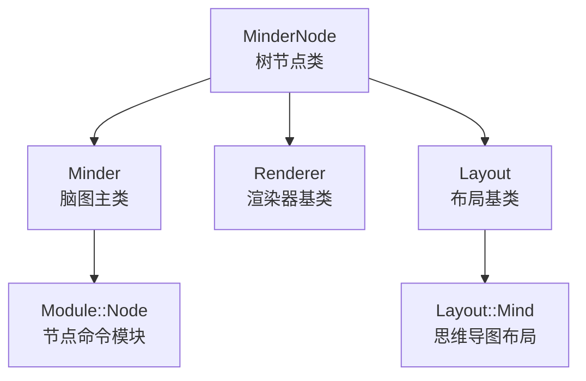
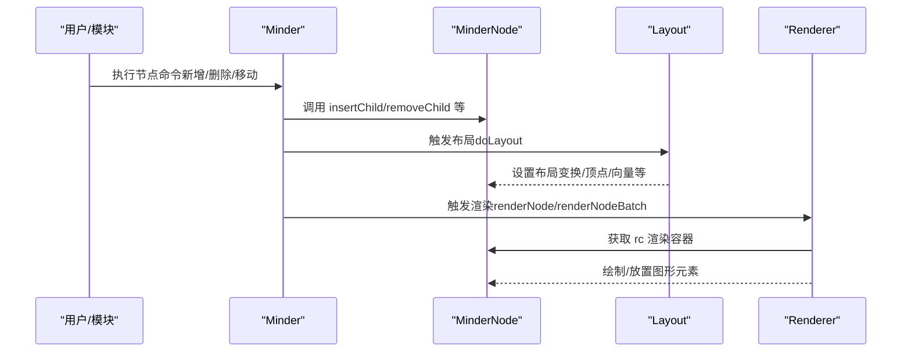
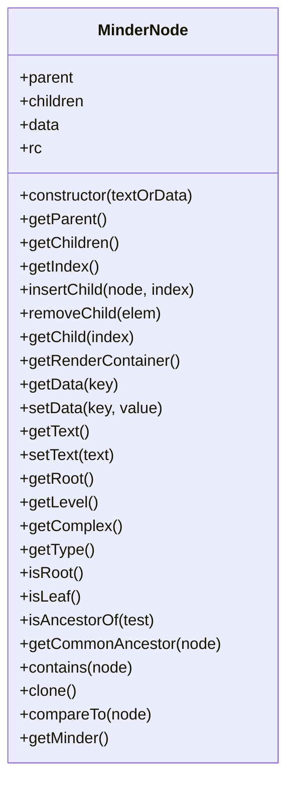
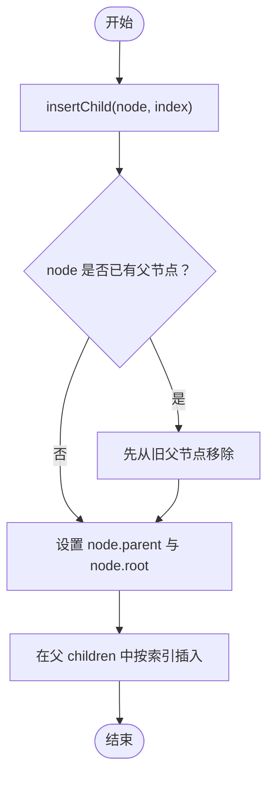
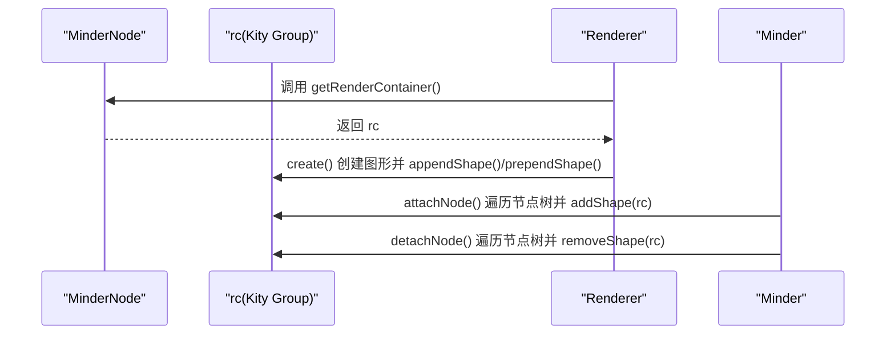
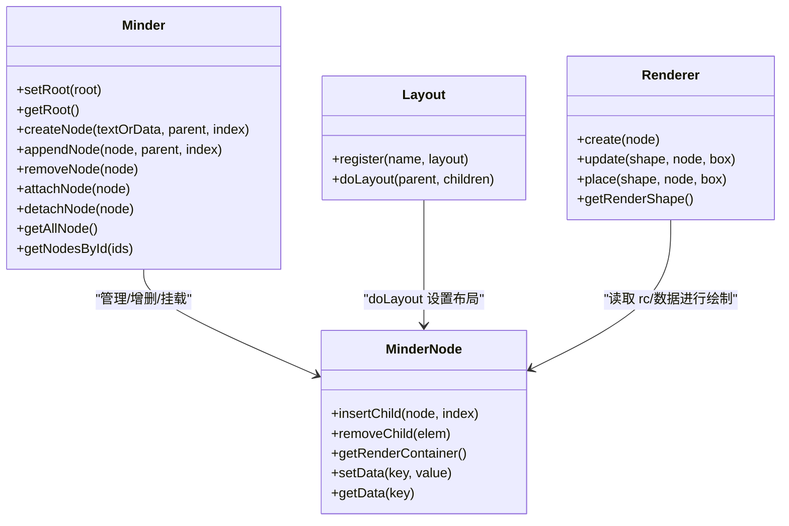
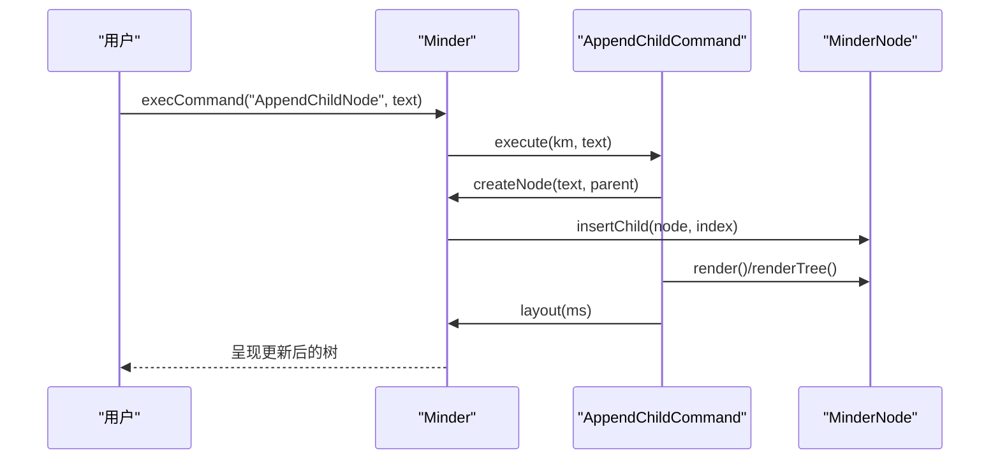
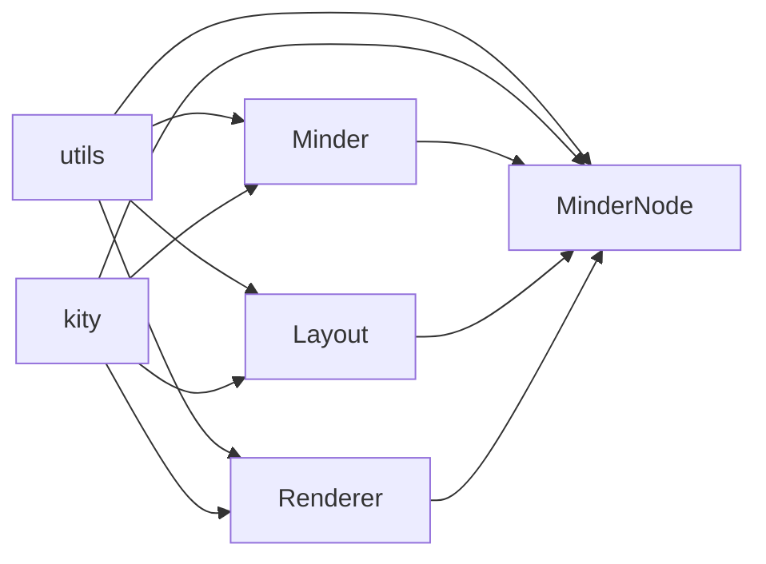

# 节点系统

<cite>
**本文引用的文件**
- [src/core/node.js](file://src/core/node.js)
- [doc/Architecture.md](file://doc/Architecture.md)
- [src/core/render.js](file://src/core/render.js)
- [src/core/layout.js](file://src/core/layout.js)
- [src/core/minder.js](file://src/core/minder.js)
- [src/module/node.js](file://src/module/node.js)
- [src/layout/mind.js](file://src/layout/mind.js)
</cite>

## 目录
1. [引言](#引言)
2. [项目结构](#项目结构)
3. [核心组件](#核心组件)
4. [架构总览](#架构总览)
5. [详细组件分析](#详细组件分析)
6. [依赖分析](#依赖分析)
7. [性能考虑](#性能考虑)
8. [故障排查指南](#故障排查指南)
9. [结论](#结论)

## 引言
本篇文档围绕 MinderNode 类展开，系统性阐述其作为思维导图树形结构基础的角色与实现细节。重点覆盖：
- 树形数据结构：父节点、子节点、根节点的指针管理与一致性维护
- 树遍历接口：getParent、getChildren、getIndex、insertChild、removeChild、getChild 等
- 数据存取机制：getData、setData、setText、getText 的工作原理与典型属性（如 text、x、y）
- 渲染容器：getRenderContainer() 与 Kity 图形库的集成方式
- 与 Minder、Layout、Render 等系统的关联与协作流程

## 项目结构
与节点系统直接相关的核心文件分布如下：
- 核心节点类：src/core/node.js
- 渲染器基类：src/core/render.js
- 布局基类与节点布局扩展：src/core/layout.js、src/layout/mind.js
- 脑图主类与节点操作：src/core/minder.js、src/module/node.js
- 架构说明文档：doc/Architecture.md

图表来源
- [src/core/node.js](file://src/core/node.js#L1-L282)
- [src/core/minder.js](file://src/core/minder.js#L1-L41)
- [src/core/render.js](file://src/core/render.js#L1-L200)
- [src/core/layout.js](file://src/core/layout.js#L1-L200)
- [src/layout/mind.js](file://src/layout/mind.js#L1-L62)
- [src/module/node.js](file://src/module/node.js#L1-L150)

章节来源
- [doc/Architecture.md](file://doc/Architecture.md#L256-L311)

## 核心组件
- MinderNode：树节点实体，维护父子关系、数据存储、渲染容器、遍历与克隆能力
- Minder：脑图主类，负责根节点管理、节点增删挂载、布局与渲染调度
- Renderer：渲染器抽象，面向节点分段渲染（中心、左右上下、轮廓等）
- Layout：布局基类，定义 doLayout 等接口，MinderNode 在其上扩展布局相关能力
- Module::Node：节点命令模块，封装新增、删除、同级/子级插入等常用操作

章节来源
- [src/core/node.js](file://src/core/node.js#L1-L282)
- [src/core/minder.js](file://src/core/minder.js#L1-L41)
- [src/core/render.js](file://src/core/render.js#L1-L200)
- [src/core/layout.js](file://src/core/layout.js#L1-L200)
- [src/module/node.js](file://src/module/node.js#L1-L150)

## 架构总览
MinderNode 位于“数据-布局-渲染”链路的底层，向上承接 Minder 的节点管理与命令执行，向下对接 Layout 的布局计算与 Renderer 的图形绘制。其渲染容器 rc 与 Kity Group 关联，使得节点树与图形层解耦，便于批量更新与事件驱动。

图表来源
- [src/module/node.js](file://src/module/node.js#L1-L150)
- [src/core/layout.js](file://src/core/layout.js#L1-L200)
- [src/core/render.js](file://src/core/render.js#L1-L200)
- [src/core/node.js](file://src/core/node.js#L1-L282)

## 详细组件分析

### MinderNode 树形数据结构与指针管理
- 结构字段
  - parent：父节点引用，根节点 root 指向自身
  - children：子节点数组
  - data：节点数据字典，包含 id、created 等基础信息，支持动态扩展
  - rc：渲染容器（Kity Group），每个节点拥有独立的图形容器
- 指针一致性
  - 插入子节点时，若目标节点已有父节点，先解除其与旧父节点的关系
  - 新子节点的 parent 与 root 被正确设置，保持整棵子树的根一致
  - 删除子节点时，重置 removed.child.parent 为 null，并将其 root 回退为自身

图表来源
- [src/core/node.js](file://src/core/node.js#L1-L282)

章节来源
- [src/core/node.js](file://src/core/node.js#L1-L282)

### 树遍历接口与使用场景
- getParent/getChildren/getIndex
  - getParent：获取父节点引用
  - getChildren：获取子节点数组
  - getIndex：获取在父节点 children 中的索引，无父节点返回 -1
- 插入与删除
  - insertChild(node, index)：在指定位置插入子节点，支持尾插/头插（prependChild/appendChild）
  - removeChild(elem)：支持按节点或索引删除，删除后重置 removed.parent 与 removed.root
- 遍历
  - preTraverse/postTraverse/traverse：先序/后序/后序别名遍历，支持 excludeThis 控制是否包含当前节点
- 其他辅助
  - getSiblings：获取兄弟节点集合
  - getLevel：计算深度
  - getComplex：统计子树节点总数
  - getType：根据层级映射为 root/main/sub
  - isRoot/isLeaf：判断根/叶
  - isAncestorOf：判断祖先关系
  - contains：判断包含关系
  - getCommonAncestor：求公共祖先（支持多节点）

图表来源
- [src/core/node.js](file://src/core/node.js#L199-L210)

章节来源
- [src/core/node.js](file://src/core/node.js#L163-L239)

### 数据存取机制：getData/setData 与典型属性
- getData(key)：返回 data[key] 或整个 data 对象
- setData(key, value)：支持对象批量设置，返回 this 以支持链式调用
- 文本与坐标
  - setText/getText：便捷设置/获取 text 属性
  - 通过 setData/setData 设置/获取 x、y 坐标（布局系统通常将布局结果写入节点数据或变换矩阵）
- 典型用途
  - 文本编辑：模块通过 setData('text', ...) 更新节点文本
  - 布局定位：布局算法将计算结果写入节点数据或布局变换，渲染器据此绘制

章节来源
- [src/core/node.js](file://src/core/node.js#L129-L161)
- [doc/Architecture.md](file://doc/Architecture.md#L282-L306)

### 渲染容器与 Kity 集成：getRenderContainer()
- 初始化容器
  - initContainers：创建 Kity Group 并设置唯一 id，同时将 rc.minderNode 指回节点自身
- 获取容器
  - getRenderContainer：返回 rc，供渲染器统一管理图形元素的挂载与移除
- 与渲染器协作
  - Renderer 在首次渲染时创建图形并 append/prepend 到 rc
  - Minder.attachNode/detachNode 通过 rc.addShape/removeShape 将节点树整体接入/移出画布

图表来源
- [src/core/node.js](file://src/core/node.js#L41-L45)
- [src/core/render.js](file://src/core/render.js#L130-L200)
- [src/core/minder.js](file://src/core/minder.js#L1-L41)

章节来源
- [src/core/node.js](file://src/core/node.js#L41-L45)
- [src/core/render.js](file://src/core/render.js#L130-L200)
- [src/core/minder.js](file://src/core/minder.js#L1-L41)

### 与 Minder、Layout、Render 的系统关联
- 与 Minder 的关联
  - Minder.setRoot/getRoot：根节点管理
  - Minder.createNode/appendNode/removeNode：节点创建、挂载与移除
  - Minder.attachNode/detachNode：将节点树批量加入/移出渲染容器
  - Minder.getAllNode/getNodesById：节点检索与遍历
- 与 Layout 的关联
  - Layout.register/doLayout：布局算法注册与执行
  - MinderNode 在其上扩展布局相关能力（如布局变换、顶点、向量等）
  - 布局完成后，节点数据/变换决定渲染器绘制位置
- 与 Render 的关联
  - Renderer 抽象定义 create/update/place 等阶段
  - MinderNode 的 rc 作为渲染图形的挂载点
  - Renderer.renderNodeBatch/单节点渲染流程，按顺序创建/更新各段图形

图表来源
- [src/core/minder.js](file://src/core/minder.js#L1-L41)
- [src/core/node.js](file://src/core/node.js#L1-L282)
- [src/core/layout.js](file://src/core/layout.js#L1-L200)
- [src/core/render.js](file://src/core/render.js#L1-L200)

章节来源
- [src/core/minder.js](file://src/core/minder.js#L1-L41)
- [src/core/layout.js](file://src/core/layout.js#L1-L200)
- [src/core/render.js](file://src/core/render.js#L1-L200)
- [src/core/node.js](file://src/core/node.js#L1-L282)

### 与节点命令模块的结合：实际应用示例
- 新增子节点：AppendChildCommand
  - 选择父节点 -> createNode -> appendNode -> 选中新节点 -> 展开/渲染 -> 布局
- 新增兄弟节点：AppendSiblingCommand
  - 获取兄弟节点与父节点 -> createNode -> appendNode -> 复制全局布局变换 -> 渲染 -> 布局
- 删除节点：RemoveNodeCommand
  - 计算公共祖先 -> 逐个移除 -> 选择回退节点 -> 布局
- 合并/提升：AppendParentCommand
  - 将多个相邻节点提升为同一父节点 -> 重新布局

图表来源
- [src/module/node.js](file://src/module/node.js#L1-L150)
- [src/core/minder.js](file://src/core/minder.js#L1-L41)
- [src/core/node.js](file://src/core/node.js#L199-L210)

章节来源
- [src/module/node.js](file://src/module/node.js#L1-L150)

## 依赖分析
- 内部依赖
  - MinderNode 依赖 utils（guid、extend、clone、comparePlainObject）、kity（Group、Matrix、Box、Point、Vector）
  - Minder 依赖 kity、utils，并扩展 MinderNode 的根节点与节点管理能力
  - Renderer 依赖 kity、MinderNode，提供渲染器注册与批量渲染
  - Layout 依赖 utils、Minder、MinderNode、MinderEvent、Command
- 外部依赖
  - Kity 图形库：提供 Group、Box、Matrix、Point、Vector 等图形与几何能力
- 潜在循环依赖
  - node.js 与 minder.js 通过扩展方式相互绑定（MinderNode 扩展 Minder 的根节点与节点管理），属于弱耦合扩展，不构成循环

图表来源
- [src/core/node.js](file://src/core/node.js#L1-L282)
- [src/core/minder.js](file://src/core/minder.js#L1-L41)
- [src/core/render.js](file://src/core/render.js#L1-L200)
- [src/core/layout.js](file://src/core/layout.js#L1-L200)

章节来源
- [src/core/node.js](file://src/core/node.js#L1-L282)
- [src/core/minder.js](file://src/core/minder.js#L1-L41)
- [src/core/render.js](file://src/core/render.js#L1-L200)
- [src/core/layout.js](file://src/core/layout.js#L1-L200)

## 性能考虑
- 遍历与克隆
  - traverse/postTraverse 会对整棵子树进行遍历，复杂度 O(n)，适合批量更新
  - clone 递归复制子树，注意大体量树的内存占用
- 布局与渲染
  - Layout.doLayout 需要对子节点进行几何计算，建议在节点数量较多时启用节流/批处理
  - Renderer.renderNodeBatch 通过分段渲染与延迟盒计算减少重复测量
- 指针维护
  - insertChild/removeChild 会更新 parent/root 与 children 数组，避免频繁拆分/重组可降低开销

## 故障排查指南
- 插入节点后坐标异常
  - 检查是否在插入后及时调用布局（如 minder.layout(ms)）
  - 确认布局算法是否正确设置节点的布局变换与顶点
- 删除节点后选区错乱
  - 使用 MinderNode.getCommonAncestor 计算公共祖先，确保选择回退节点合理
- 渲染容器未显示
  - 确认 attachNode 已将节点树加入渲染容器，或 Renderer.create 是否成功创建图形
- 文本/坐标未生效
  - 确认 setData('text'|'x'|'y') 后触发了必要的 render/layout 流程

章节来源
- [src/module/node.js](file://src/module/node.js#L70-L150)
- [src/core/render.js](file://src/core/render.js#L130-L200)
- [src/core/layout.js](file://src/core/layout.js#L1-L200)

## 结论
MinderNode 作为思维导图树形结构的基石，提供了完善的树指针管理、灵活的数据存取与渲染容器集成。通过与 Minder、Layout、Render 的协同，实现了从节点增删改到布局计算再到图形绘制的完整闭环。理解其遍历接口、数据存取与渲染容器机制，有助于高效扩展节点行为与优化性能表现。