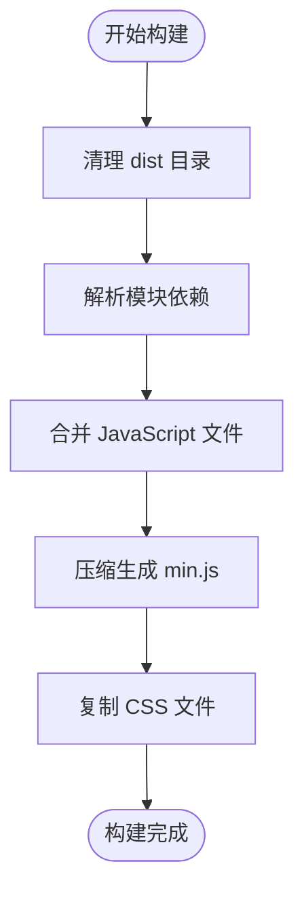

# 贡献指南

<cite>
**本文档引用的文件**  
- [README.md](file://README.md)
- [Gruntfile.js](file://Gruntfile.js)
- [.jshintrc](file://.jshintrc)
- [.jscsrc](file://.jscsrc)
- [.jsbeautifyrc](file://.jsbeautifyrc)
- [package.json](file://package.json)
- [doc/Architecture.md](file://doc/Architecture.md)
- [src/kityminder.js](file://src/kityminder.js)
- [src/expose-kityminder.js](file://src/expose-kityminder.js)
</cite>

## 目录
1. [简介](#简介)
2. [环境搭建](#环境搭建)
3. [代码规范](#代码规范)
4. [构建与测试流程](#构建与测试流程)
5. [提交规范](#提交规范)
6. [版本发布流程](#版本发布流程)
7. [代码质量与稳定性](#代码质量与稳定性)

## 简介

TyMinder Core 是基于百度 FEX 团队开发的 KityMinder Core 修改而来的脑图可视化与编辑工具核心库。该项目支持丰富的脑图功能，包括自动布局、节点编辑、自由关联线、多种主题与模板等。本贡献指南旨在为开发者提供清晰的开发流程、代码规范和贡献标准，确保项目代码的一致性与稳定性。

**Section sources**  
- [README.md](file://README.md#L1-L89)

## 环境搭建

为确保顺利参与项目开发，请按照以下步骤配置开发环境：

1. 安装 [Node.js](https://nodejs.org/)（建议使用 LTS 版本）
2. 安装 [Bower](http://bower.io/#install-bower)（用于前端依赖管理）
3. 克隆项目仓库并进入项目目录
4. 安装项目依赖：
   ```bash
   npm install
   ```
5. 启动开发服务器：
   ```bash
   npm run dev
   ```
6. 在浏览器中打开 `dev.html` 或 `example.html` 查看运行效果

项目使用 SeaJS 进行模块管理，Kity 作为 SVG 图形引擎，支持主流 HTML5 浏览器（Chrome、Firefox、Safari、Edge、IE10+）。

**Section sources**  
- [README.md](file://README.md#L50-L66)
- [package.json](file://package.json#L23-L24)

## 代码规范

### JavaScript 编码风格

本项目遵循百度 FEX 团队的 JavaScript 编码规范，具体规则由 `.jscsrc` 和 `.jshintrc` 文件定义。所有代码必须通过 JSHint 和 JSCS 检查。

#### 缩进与空格
- 使用 **4 个空格**进行缩进（禁止使用 Tab）
- 二元运算符前后必须有空格（如 `a + b`）
- 关键字后必须有空格（如 `if`, `for`, `while`）
- 函数参数小括号前不得有空格（如 `function()`）

#### 引号与字符串
- 字符串统一使用 **单引号** `'`
- 禁止使用多行字符串

#### 括号与大括号
- 大括号前必须有空格（如 `if (condition) {`）
- 小括号内不得有空格（如 `function(arg)`）
- 块状代码必须使用大括号包裹

#### 行长度与换行
- 每行不得超过 **120 个字符**
- 操作符（如 `+`, `==`, `&&`）不得放在行首，应放在上一行末尾

#### 其他规则
- 禁止行尾空格
- 逗号和分号前不得有空格
- 一元运算符与操作数之间不得有空格（如 `++i`, `!flag`）

**Section sources**  
- [.jscsrc](file://.jscsrc#L1-L103)
- [.jshintrc](file://.jshintrc#L1-L15)

### 命名约定

- 变量和函数名使用 **驼峰命名法**（camelCase）
- 构造函数和类名使用 **帕斯卡命名法**（PascalCase）
- 常量使用 **全大写加下划线**（如 `MAX_DEPTH`）
- 私有成员以 `_` 开头（如 `_privateMethod`）

### 注释要求

- 所有公共类、方法和复杂逻辑必须添加 JSDoc 注释
- 文件头部需包含 `@fileOverview`、`@author` 和 `@copyright`
- 关键逻辑添加行内注释说明意图
- 避免无意义或过时的注释

示例：
```javascript
/**
 * @fileOverview Minder 主类定义
 * @author techird
 * @copyright Baidu FEX, 2014
 */
```

**Section sources**  
- [src/kityminder.js](file://src/kityminder.js#L1-L8)

## 构建与测试流程

项目使用 Grunt 作为构建工具，自动化完成代码检查、合并、压缩等任务。

### Grunt 任务说明

| 任务 | 描述 |
|------|------|
| `build` | 执行完整构建流程：清理、依赖解析、合并、压缩、复制样式文件 |
| `dev` | 启动开发服务器并监听文件变化，自动刷新浏览器 |
| `clean` | 清理 `dist` 目录 |
| `dependence` | 解析模块依赖并合并 JavaScript 文件 |
| `concat` | 合并文件并添加版权头信息 |
| `uglify` | 压缩 JavaScript 文件生成 `.min.js` |
| `copy` | 复制 CSS 文件到 `dist` 目录 |
| `watch` | 监听源文件变化并自动构建 |
| `browserSync` | 启动本地服务器并支持浏览器同步 |

### 构建流程详解

1. **清理**：删除 `dist` 目录下的旧构建文件
2. **依赖解析**：根据 `expose-kityminder.js` 入口文件解析所有模块依赖
3. **合并**：将所有 JavaScript 模块合并为 `kityminder.core.js`
4. **压缩**：使用 UglifyJS 压缩生成 `kityminder.core.min.js`
5. **复制**：将 `kityminder.css` 复制为 `kityminder.core.css`

构建结果输出到 `dist/` 目录，包含：
- `kityminder.core.js`：未压缩的核心库
- `kityminder.core.min.js`：压缩后的核心库
- `kityminder.core.css`：样式文件



**Diagram sources**  
- [Gruntfile.js](file://Gruntfile.js#L110-L114)

**Section sources**  
- [Gruntfile.js](file://Gruntfile.js#L1-L115)

## 提交规范

### Git 提交消息格式

所有提交消息必须遵循 **Conventional Commits** 规范，格式如下：

```
<type>(<scope>): <subject>
<BLANK LINE>
<body>
<BLANK LINE>
<footer>
```

#### 类型（type）
- `feat`：新增功能
- `fix`：修复 bug
- `docs`：文档更新
- `style`：代码格式调整（不影响逻辑）
- `refactor`：代码重构
- `perf`：性能优化
- `test`：测试相关
- `chore`：构建或辅助工具变更

#### 范围（scope）
可选，指明修改的模块，如 `hyperconnection`、`layout`、`theme` 等。

#### 主题（subject）
简短描述修改内容，使用现在时，首字母小写，不加句号。

#### 正文（body）
详细描述修改内容、动机和对比方案。

#### 页脚（footer）
引用相关 issue 或 breaking changes。

示例：
```
feat(hyperconnection): add bezier control point drag support

- 实现关联线贝塞尔控制点拖拽调整功能
- 支持实时预览曲线变化
- 自动保存控制点偏移量

Closes #123
```

**Section sources**  
- [package.json](file://package.json#L54-L57)

## 版本发布流程

1. 确保所有测试通过，代码符合规范
2. 更新 `package.json` 中的版本号
3. 生成构建文件：`npm run build`
4. 提交更改并推送至主分支
5. 创建 Git Tag（格式 `vX.X.X`）
6. 发布到 npm（如适用）
7. 更新 CHANGELOG.md 记录变更

版本号遵循语义化版本规范（SemVer）：
- 主版本号：重大变更，不兼容升级
- 次版本号：新增功能，向后兼容
- 修订号：bug 修复，向后兼容

**Section sources**  
- [package.json](file://package.json#L5-L6)

## 代码质量与稳定性

### 单元测试

- 鼓励为新增功能编写单元测试
- 测试文件命名以 `_test.js` 结尾，存放于对应模块目录
- 使用 Karma + Mocha 作为测试框架（需自行配置）
- 确保关键路径和边界条件得到覆盖

### 代码审查

- 所有 PR 必须经过至少一名核心成员审查
- 审查重点包括：
  - 代码风格是否符合规范
  - 是否有潜在 bug 或性能问题
  - 是否充分测试
  - 文档是否更新
  - 是否遵循模块化设计原则

### 稳定性保障

- 核心模块变更需充分测试
- 保持向后兼容性，避免破坏性变更
- 使用 `json-diff` 库确保数据格式兼容
- 布局算法优化：节点数超过 200 时自动关闭动画
- 提供只读模式支持（`core/readonly.js`）

**Section sources**  
- [doc/Architecture.md](file://doc/Architecture.md#L564-L567)
- [package.json](file://package.json#L36)