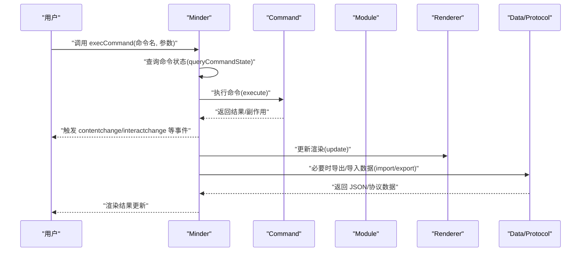
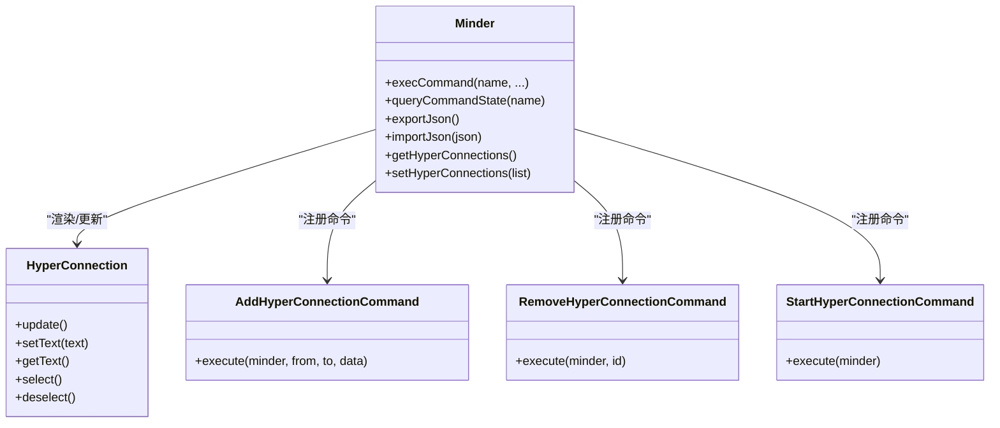
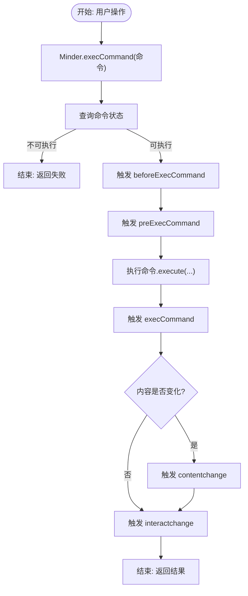
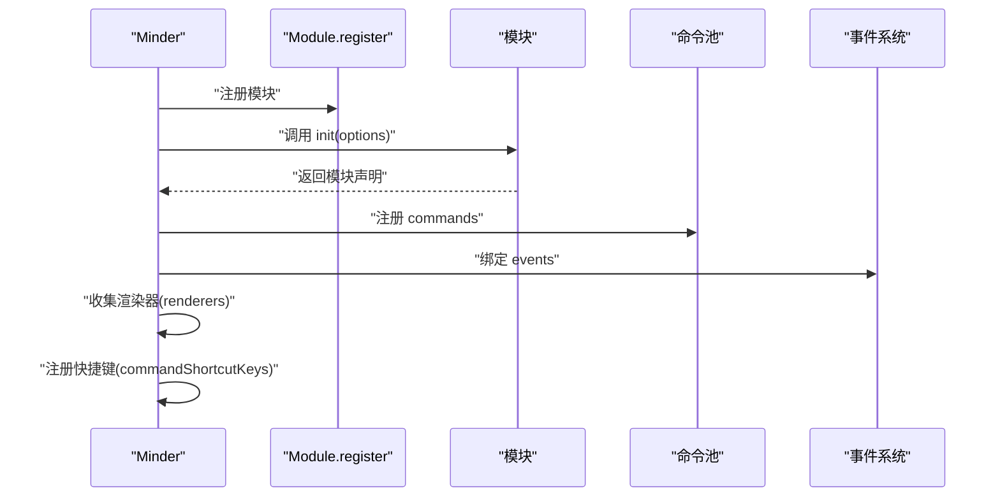
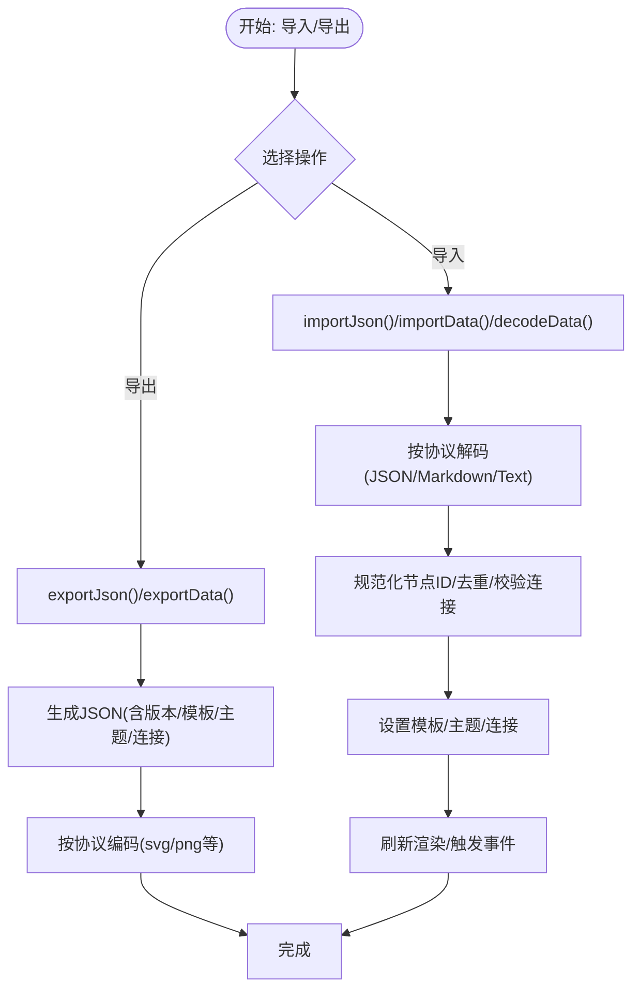
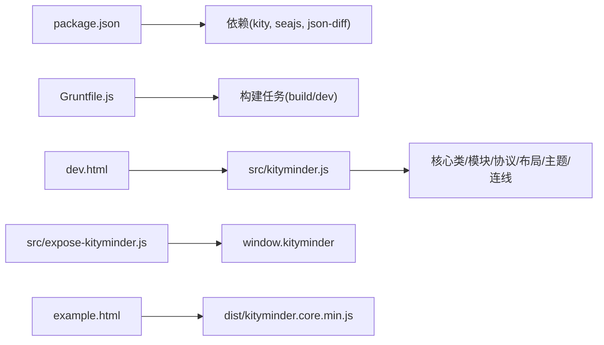

# 项目概述

<cite>
**本文引用的文件**
- [README.md](file://README.md)
- [doc/Architecture.md](file://doc/Architecture.md)
- [package.json](file://package.json)
- [Gruntfile.js](file://Gruntfile.js)
- [src/kityminder.js](file://src/kityminder.js)
- [src/expose-kityminder.js](file://src/expose-kityminder.js)
- [src/core/minder.js](file://src/core/minder.js)
- [src/core/node.js](file://src/core/node.js)
- [src/core/command.js](file://src/core/command.js)
- [src/core/module.js](file://src/core/module.js)
- [src/core/data.js](file://src/core/data.js)
- [src/module/hyperconnection.js](file://src/module/hyperconnection.js)
- [dev.html](file://dev.html)
- [example.html](file://example.html)
</cite>

## 目录
1. [简介](#简介)
2. [项目结构](#项目结构)
3. [核心组件](#核心组件)
4. [架构总览](#架构总览)
5. [详细组件分析](#详细组件分析)
6. [依赖分析](#依赖分析)
7. [性能考虑](#性能考虑)
8. [故障排查指南](#故障排查指南)
9. [结论](#结论)
10. [附录](#附录)

## 简介
TyMinder Core 是基于 KityMinder Core 改进的思维导图核心库，专注于提供高性能、可扩展的 SVG 脑图可视化与编辑能力。项目在保持与原版 KityMinder 核心一致的架构与 API 的同时，重点增强了“自由关联线”能力，允许在任意两个节点之间建立跨层级的连接，从而更好地表达概念间的因果、依赖、参考等关系。项目强调模块化、可扩展性与性能优化，并提供完整的开发与构建流程。

- 项目目标与价值主张
  - 提供轻量、可嵌入的思维导图核心能力，聚焦可视化与编辑。
  - 通过“自由关联线”提升关系表达能力，满足复杂知识结构建模。
  - 保持与 KityMinder 生态一致的模块化与事件模型，便于二次开发与集成。
  - 采用 Kity SVG 图形库与 SeaJS 模块加载器，确保跨浏览器兼容与性能表现。

- 与原版 KityMinder 的关系与改进
  - 关系：TyMinder Core 在原版基础上进行功能增强与模块扩展，保留核心类与命令/模块体系。
  - 主要改进：新增“自由关联线”模块与数据协议扩展，完善数据导入导出与版本兼容策略。

- 技术栈
  - 图形引擎：Kity（基于 SVG）
  - 模块加载：SeaJS
  - 数据格式：JSON（含版本化与扩展字段）
  - 构建工具：Grunt

- 浏览器兼容性
  - 支持 Chrome、Firefox、Safari、Edge 与 IE10+（基于 SVG 技术）

- 设计哲学与架构原则
  - 模块化：通过模块注册与生命周期管理，实现功能解耦与按需加载。
  - 可扩展性：命令系统、事件系统与渲染器扩展点，便于业务定制。
  - 性能优化：布局动画阈值控制、只读模式、增量更新与事件稀释等策略。

- 学习路径建议（面向初学者）
  - 了解核心类与职责：Minder、MinderNode、Command、Module。
  - 掌握命令与事件：如何通过命令驱动状态变更，如何订阅/触发事件。
  - 理解模块机制：模块注册、初始化、命令与事件绑定。
  - 实战示例：参考示例页面与开发页，逐步添加节点、连线与自由关联线。
  - 进阶实践：扩展模块、自定义渲染器、接入第三方存储。

**章节来源**
- file://README.md#L1-L89
- file://doc/Architecture.md#L1-L120

## 项目结构
项目采用按功能域分层的目录组织方式：
- src/core：核心运行时与基础设施（命令、模块、节点、数据、事件、渲染、布局、主题、模板等）
- src/module：功能模块（如节点编辑、布局切换、超连接、剪贴板、样式定制等）
- src/connect：连线算法集合（贝塞尔、圆弧、直线、折线、鱼骨线等）
- src/layout：布局算法集合（思维导图、二叉树、文件树、天盘、鱼骨图等）
- src/protocol：数据协议（JSON、Markdown、文本、SVG、PNG）
- src/template：主题模板集合
- src/theme：主题样式集合
- 根目录：入口与暴露、示例页面、构建脚本与配置

```mermaid
graph TB
subgraph "核心层(core)"
CORE_MINDER["Minder<br/>核心类"]
CORE_NODE["MinderNode<br/>节点类"]
CORE_COMMAND["Command<br/>命令基类"]
CORE_MODULE["Module<br/>模块注册/生命周期"]
CORE_DATA["Data<br/>导入导出/协议"]
end
subgraph "功能模块(module)"
MOD_HYPER["HyperConnection<br/>自由关联线"]
MOD_TEXT["Text<br/>文本编辑"]
MOD_LAYOUT["Layout<br/>布局切换"]
MOD_CLIPBOARD["Clipboard<br/>剪贴板"]
MOD_STYLE["Style<br/>样式定制"]
end
subgraph "连线(connect)"
CON_BEZIER["Bezier"]
CON_ARC["Arc"]
CON_L["L-Line"]
CON_POLY["Poly"]
CON_FISH["FishBone"]
end
subgraph "布局(layout)"
LYT_MIND["Mind"]
LYT_BTREE["BTree"]
LYT_FILETREE["FileTree"]
LYT_TIANPAN["TianPan"]
LYT_FISH_SLAVE["FishBone Slave"]
end
subgraph "协议(protocol)"
PROT_JSON["JSON"]
PROT_MD["Markdown"]
PROT_TEXT["Text"]
PROT_SVG["SVG Export"]
PROT_PNG["PNG Export"]
end
CORE_MINDER --> CORE_COMMAND
CORE_MINDER --> CORE_MODULE
CORE_MINDER --> CORE_DATA
CORE_MINDER --> CORE_NODE
CORE_MINDER --> MOD_HYPER
CORE_MINDER --> MOD_TEXT
CORE_MINDER --> MOD_LAYOUT
CORE_MINDER --> MOD_CLIPBOARD
CORE_MINDER --> MOD_STYLE
CORE_MINDER --> CON_BEZIER
CORE_MINDER --> CON_ARC
CORE_MINDER --> CON_L
CORE_MINDER --> CON_POLY
CORE_MINDER --> CON_FISH
CORE_MINDER --> LYT_MIND
CORE_MINDER --> LYT_BTREE
CORE_MINDER --> LYT_FILETREE
CORE_MINDER --> LYT_TIANPAN
CORE_MINDER --> LYT_FISH_SLAVE
CORE_MINDER --> PROT_JSON
CORE_MINDER --> PROT_MD
CORE_MINDER --> PROT_TEXT
CORE_MINDER --> PROT_SVG
CORE_MINDER --> PROT_PNG
```

**图表来源**
- [doc/Architecture.md](file://doc/Architecture.md#L1-L120)
- [src/kityminder.js](file://src/kityminder.js#L1-L107)

**章节来源**
- file://doc/Architecture.md#L1-L120
- file://src/kityminder.js#L1-L107

## 核心组件
- Minder（核心类）
  - 脑图实例的入口，负责模块初始化、命令执行、事件分发与渲染容器管理。
  - 提供公开接口：getRoot、execCommand、queryCommandState、update、export/import、选择管理等。
  - 版本号与初始化钩子管理。

- MinderNode（节点类）
  - 树节点抽象，提供树遍历、数据存取、渲染容器访问与父子关系管理。
  - 支持克隆、比较、公共祖先查找等实用方法。

- Command（命令基类）
  - 定义命令的执行与回退机制，提供状态查询与值查询接口。
  - Minder 通过统一的命令执行流程触发事件与内容变更通知。

- Module（模块注册与生命周期）
  - 注册模块、初始化模块、收集命令与事件、挂载渲染器、管理快捷键。
  - 提供销毁与重置生命周期钩子。

- Data（数据导入导出与协议）
  - 支持 JSON/协议导入导出，提供 setup 自动导入、exportJson/importJson、decodeData/importData。
  - 数据版本化与兼容处理（v1/v2），支持 connections 字段与节点 ID 规范化。

**章节来源**
- file://src/core/minder.js#L1-L41
- file://src/core/node.js#L1-L120
- file://src/core/command.js#L1-L169
- file://src/core/module.js#L1-L151
- file://src/core/data.js#L1-L120

## 架构总览
TyMinder Core 的系统上下文围绕“命令-模块-节点-渲染”的闭环展开：
- 命令驱动：Minder.execCommand 统一调度，触发 before/pre/exec/contentchange/interactchange 等事件。
- 模块扩展：模块注册后注入命令、事件与渲染器，形成功能插件化。
- 节点树：MinderNode 维护树结构与数据，配合布局与渲染器输出视觉结果。
- 数据协议：通过协议注册机制扩展导入导出能力，支持 JSON、Markdown、文本、SVG、PNG。

**图表来源**
- [src/core/command.js](file://src/core/command.js#L87-L166)
- [src/core/data.js](file://src/core/data.js#L310-L416)
- [src/core/minder.js](file://src/core/minder.js#L1-L41)

**章节来源**
- file://doc/Architecture.md#L370-L430
- file://src/core/command.js#L87-L166
- file://src/core/data.js#L310-L416

## 详细组件分析

### 自由关联线模块（HyperConnection）
- 功能定位
  - 允许在任意两个节点之间建立关联连接，突破树形层级限制，表达跨分支关系。
  - 支持三种连线类型（箭头、直线、虚线）、连线上文字、颜色与线宽自定义。
  - 提供贝塞尔控制点拖拽调整曲线形状，支持自动计算连接点与布局变化后的自动更新。

- 关键实现要点
  - 数据结构：connections 数组，每条连接包含 from/to 节点 ID、文本、类型、颜色、线宽与控制点偏移。
  - 渲染器：HyperConnection 类封装路径绘制、箭头标记、文字标签与控制点手柄。
  - 命令体系：StartHyperConnection、AddHyperConnection、RemoveHyperConnection 三类命令。
  - 事件与交互：点击热区、双击编辑文字、拖拽控制点、选中状态切换、画布点击取消选中。
  - 生命周期：模块初始化创建超连接容器，布局完成后统一更新，节点更新时定向刷新相关连线。

- 数据协议扩展
  - 导出：在 exportJson 中附加 connections 字段（版本 v2）。
  - 导入：兼容 v1 旧格式，自动补全缺失 ID、过滤无效连接、校验节点引用。

**图表来源**
- [src/module/hyperconnection.js](file://src/module/hyperconnection.js#L1-L200)
- [src/module/hyperconnection.js](file://src/module/hyperconnection.js#L569-L768)
- [src/core/data.js](file://src/core/data.js#L50-L120)

**章节来源**
- file://doc/Architecture.md#L594-L722
- file://src/module/hyperconnection.js#L1-L200
- file://src/module/hyperconnection.js#L569-L768
- file://src/core/data.js#L50-L120

### 命令系统与事件机制
- 命令基类
  - 定义 execute/revert/queryState/queryValue/isContentChanged/isSelectionChanged 等接口。
  - Minder.execCommand 统一调度，触发 before/pre/exec 与 contentchange/interactchange 等事件。

- 事件分类
  - 交互事件：click、dblclick、mousedown、mousemove、mouseup、keydown、keyup、keypress、touchstart、touchend、touchmove
  - 命令事件：beforecommand、precommand、aftercommand
  - 交互事件：selectionchange、contentchange、interactchange
  - 模块事件：模块自定义事件

- 事件触发时机
  - 顶级命令执行后触发 contentchange/selectionchange/interactchange
  - 事件对象可携带自定义参数（如 commandName、commandArgs、currentSelection 等）

**图表来源**
- [src/core/command.js](file://src/core/command.js#L87-L166)
- [doc/Architecture.md](file://doc/Architecture.md#L370-L430)

**章节来源**
- file://src/core/command.js#L1-L169
- file://doc/Architecture.md#L370-L430

### 模块化与扩展点
- 模块注册
  - Module.register(name, module) 将模块注册到全局池。
  - Minder 初始化时遍历模块池，执行 init、收集 commands、绑定 events、注册渲染器与快捷键。

- 生命周期
  - init：模块初始化，创建容器、状态与节流器等。
  - destroy/reset：模块销毁与重置，回收资源与清空状态。

- 典型模块
  - HyperConnection：自由关联线容器、命令与事件绑定、布局后更新。
  - Layout：布局切换与模板应用。
  - Text/Style/Clipboard 等：编辑、样式与剪贴板功能。

**图表来源**
- [src/core/module.js](file://src/core/module.js#L1-L151)
- [src/module/hyperconnection.js](file://src/module/hyperconnection.js#L770-L800)

**章节来源**
- file://src/core/module.js#L1-L151
- file://src/module/hyperconnection.js#L770-L800

### 数据导入导出与协议
- 导出
  - exportJson：导出整棵树与模板/主题信息，附加 connections 字段（版本 v2）。
  - exportData：按协议导出（json/text/markdown/svg/png），返回 Promise。

- 导入
  - importJson：删除旧树、规范化节点 ID、导入模板/主题、设置超连接、刷新渲染。
  - importData/decodeData：按协议解析为 JSON，importData 覆盖当前实例，decodeData 返回 JSON。

- 协议注册
  - registerProtocol/getRegisterProtocol：动态注册与获取协议实现。

**图表来源**
- [src/core/data.js](file://src/core/data.js#L50-L120)
- [src/core/data.js](file://src/core/data.js#L225-L308)
- [src/core/data.js](file://src/core/data.js#L310-L416)

**章节来源**
- file://src/core/data.js#L50-L120
- file://src/core/data.js#L225-L308
- file://src/core/data.js#L310-L416

## 依赖分析
- 外部依赖
  - kity：SVG 图形库，提供路径、形状与渲染能力。
  - seajs：模块加载器，支持 SeaJS 规范的模块定义与依赖解析。
  - json-diff：用于数据差异比对（开发辅助）。

- 内部依赖
  - 入口文件 src/kityminder.js 串联核心类、模块、协议、布局、主题与连线。
  - 暴露文件 src/expose-kityminder.js 将 kityminder 暴露到 window 上，便于全局使用。

- 构建与开发
  - Grunt 任务链：clean -> dependence -> concat -> uglify -> copy
  - 开发模式：browserSync + watch，自动刷新 dev.html

**图表来源**
- [package.json](file://package.json#L1-L60)
- [Gruntfile.js](file://Gruntfile.js#L1-L115)
- [src/kityminder.js](file://src/kityminder.js#L1-L107)
- [src/expose-kityminder.js](file://src/expose-kityminder.js#L1-L3)

**章节来源**
- file://package.json#L1-L60
- file://Gruntfile.js#L1-L115
- file://src/kityminder.js#L1-L107
- file://src/expose-kityminder.js#L1-L3

## 性能考虑
- 布局动画优化
  - 当节点数量超过一定阈值时自动关闭动画，避免大规模重排卡顿。
- 事件稀释
  - 交互事件在一定时间窗口内进行去抖，减少频繁触发带来的性能压力。
- 只读模式
  - 提供只读模式，降低编辑场景下的渲染与事件开销。
- 渲染容器管理
  - 通过渲染容器的增删与批量更新，减少不必要的 DOM 操作。

[本节为通用性能建议，无需特定文件引用]

## 故障排查指南
- 常见问题
  - 无法加载模块：检查 SeaJS 配置与入口路径，确认模块已正确注册。
  - 自由关联线无效：确认 from/to 节点 ID 存在且唯一，检查 connections 数据结构。
  - 导入失败：核对数据版本与节点 ID，必要时启用兼容处理。
  - 事件未触发：确认命令状态返回值与事件绑定是否正确。

- 调试建议
  - 使用浏览器开发者工具观察事件流与命令执行轨迹。
  - 在导出/导入前后打印 JSON 结构，核对 connections 与节点 ID。
  - 在 dev.html 中启用日志与断点，逐步定位问题。

**章节来源**
- file://src/core/command.js#L87-L166
- file://src/core/data.js#L225-L308
- file://src/module/hyperconnection.js#L600-L700

## 结论
TyMinder Core 在保留 KityMinder 核心架构优势的同时，通过“自由关联线”等关键增强，显著提升了关系表达能力与实用性。其模块化设计、完善的命令与事件体系、以及对性能与兼容性的重视，使其成为构建各类思维导图应用的理想基础。结合示例页面与开发环境，开发者可快速上手并在此基础上进行二次扩展。

[本节为总结性内容，无需特定文件引用]

## 附录

### 使用示例与学习路径
- 示例页面
  - example.html：最小化示例，展示基础渲染与禁用/手绘模式。
  - dev.html：完整开发示例，包含工具栏、状态提示、导出 JSON、添加自由关联线与编辑连接线文字等。

- 学习路径建议
  - 第一步：阅读 README 与 Architecture 文档，理解项目定位与整体架构。
  - 第二步：打开 example.html 与 dev.html，熟悉入口与基本 API。
  - 第三步：研究 src/core 与 src/module 目录，掌握核心类与模块机制。
  - 第四步：实践自由关联线：选中节点 -> 启动添加模式 -> 选择目标节点 -> 调整控制点 -> 导出/导入验证。
  - 第五步：扩展模块：仿照现有模块编写命令与事件处理，接入自定义渲染器或协议。

**章节来源**
- file://README.md#L29-L89
- file://example.html#L1-L66
- file://dev.html#L1-L248
- file://doc/Architecture.md#L1-L120