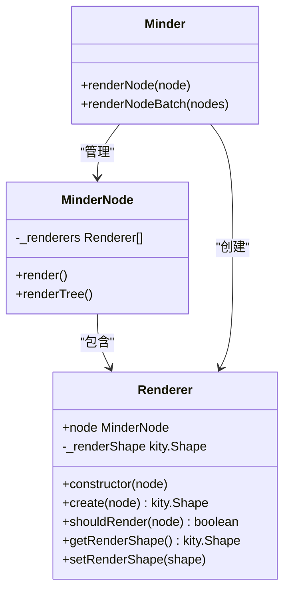
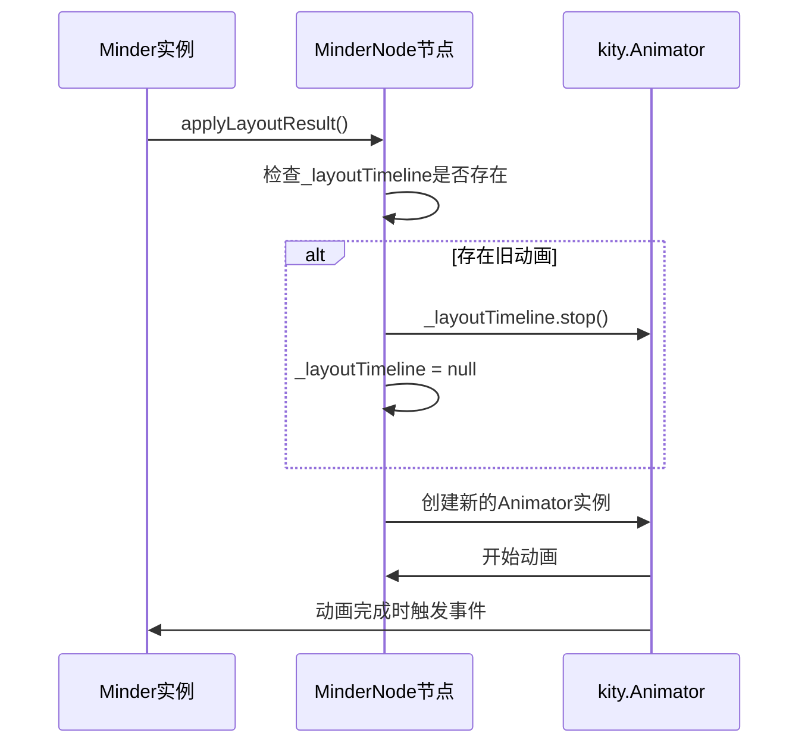
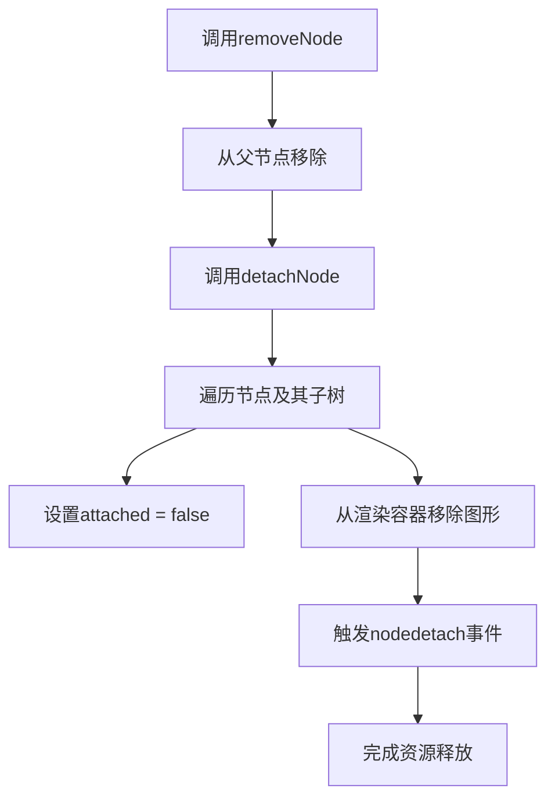

# 内存管理与泄漏防范

<cite>
**本文档引用的文件**
- [render.js](file://src/core/render.js)
- [node.js](file://src/core/node.js)
- [module.js](file://src/core/module.js)
- [layout.js](file://src/core/layout.js)
- [event.js](file://src/core/event.js)
- [paper.js](file://src/core/paper.js)
</cite>

## 目录
1. [引言](#引言)
2. [渲染器实例的生命周期管理](#渲染器实例的生命周期管理)
3. [布局变换与动画时间线的清理](#布局变换与动画时间线的清理)
4. [节点销毁时的资源释放](#节点销毁时的资源释放)
5. [事件监听器的正确管理](#事件监听器的正确管理)
6. [SVG图形的创建与隐藏机制](#svg图形的创建与隐藏机制)
7. [使用开发者工具检测内存泄漏](#使用开发者工具检测内存泄漏)
8. [自定义模块开发中的编码规范](#自定义模块开发中的编码规范)
9. [总结](#总结)

## 引言

kityminder-core 是一个功能强大的脑图编辑器核心库，其内存管理机制对于确保应用性能和稳定性至关重要。本文深入探讨该库中的内存管理最佳实践，重点分析渲染器（Renderer）实例、布局变换矩阵、动画时间线（_layoutTimeline）等对象的生命周期管理。通过理解节点销毁时如何正确清理事件监听器、移除SVG图形和清除定时器，开发者可以有效避免因引用残留导致的内存泄漏问题。

**本文档引用的文件**
- [render.js](file://src/core/render.js)
- [node.js](file://src/core/node.js)
- [module.js](file://src/core/module.js)

## 渲染器实例的生命周期管理

在 kityminder-core 中，`Renderer` 类是负责节点视觉呈现的核心组件。每个渲染器实例都与一个 `MinderNode` 节点相关联，并在节点渲染过程中被创建和管理。

渲染器的生命周期由 `Minder` 实例统一控制。当调用 `renderNode` 或 `renderNodeBatch` 方法时，系统会检查节点是否已存在渲染器实例。如果不存在，则通过 `createRendererForNode` 函数为该节点创建一组渲染器实例，并存储在 `node._renderers` 数组中。这些实例在节点的整个生命周期内被复用，避免了重复创建的开销。

**图表来源**
- [render.js](file://src/core/render.js#L7-L58)
- [node.js](file://src/core/node.js#L240-L247)

**本节来源**
- [render.js](file://src/core/render.js#L60-L221)
- [node.js](file://src/core/node.js#L226-L239)

## 布局变换与动画时间线的清理

布局管理是脑图编辑器的核心功能之一，kityminder-core 通过 `Layout` 类和 `applyLayoutResult` 方法实现复杂的布局计算和动画效果。在此过程中，`_layoutTimeline` 属性用于存储当前正在进行的动画实例。

关键的内存管理实践体现在 `applyLayoutResult` 方法中。在为节点应用新的布局变换之前，系统会检查该节点是否已存在 `_layoutTimeline` 实例。如果存在，则立即调用其 `stop()` 方法停止当前动画，并将引用置为 `null`，从而确保旧的动画实例可以被垃圾回收器正确回收。

**图表来源**
- [layout.js](file://src/core/layout.js#L481-L484)

**本节来源**
- [layout.js](file://src/core/layout.js#L444-L519)

## 节点销毁时的资源释放

当从脑图中移除一个节点时，必须确保其所有关联资源都被正确释放，以防止内存泄漏。kityminder-core 通过 `removeNode` 和 `detachNode` 方法实现了这一过程。

`removeNode` 方法首先从其父节点中移除该节点，然后调用 `detachNode` 方法。`detachNode` 会遍历该节点及其所有子节点，执行两个关键操作：一是将 `current.attached` 标记设置为 `false`，二是从渲染容器中移除对应的 `current.getRenderContainer()`。这确保了所有相关的SVG图形从DOM中被移除，断开了与渲染树的连接。

**图表来源**
- [node.js](file://src/core/node.js#L367-L398)

**本节来源**
- [node.js](file://src/core/node.js#L367-L398)

## 事件监听器的正确管理

kityminder-core 使用一个基于 `MinderEvent` 的事件系统来处理用户交互和内部状态变化。事件监听器的管理是内存安全的关键。

事件系统通过 `_eventCallbacks` 对象存储所有注册的回调函数。`on` 方法用于添加监听器，而 `off` 方法则用于移除。`off` 方法的实现非常严谨：它会遍历所有事件类型，查找并移除与指定回调函数完全匹配的引用。这种精确的移除机制确保了当一个模块或组件被销毁时，其注册的所有事件监听器都能被彻底清理，不会留下任何悬挂的引用。

**本节来源**
- [event.js](file://src/core/event.js#L232-L259)

## SVG图形的创建与隐藏机制

`Renderer` 类通过 `getRenderShape()` 和 `setRenderShape()` 方法管理其对应的SVG图形。在 `renderNode` 方法中，系统会根据 `shouldRender` 的返回值来决定图形的可见性。

当 `shouldRender` 返回 `true` 时，如果 `getRenderShape()` 返回 `null`，则会调用 `create` 方法创建新的图形，并通过 `setVisible(true)` 将其显示。如果 `shouldRender` 返回 `false` 但图形已存在，则调用 `setVisible(false)` 将其隐藏，而不是直接销毁。这种“隐藏而非销毁”的策略平衡了性能和内存使用，避免了频繁创建和销毁DOM元素的开销。只有在节点被完全移除时，其对应的SVG容器才会通过 `detachNode` 被彻底从DOM中移除。

**本节来源**
- [render.js](file://src/core/render.js#L134-L153)

## 使用开发者工具检测内存泄漏

检测 kityminder-core 应用中的内存泄漏，推荐使用 Chrome DevTools 的 Memory 面板。具体步骤如下：
1. 在操作前拍摄一个堆快照（Heap Snapshot）。
2. 执行可能引发内存泄漏的操作，如创建、删除大量节点。
3. 再次拍摄堆快照。
4. 比较两个快照，重点关注 `Renderer`、`MinderNode` 和 `kity.Shape` 等对象的实例数量。
5. 如果这些对象的数量在删除节点后没有相应减少，则可能存在内存泄漏。

此外，可以使用 Performance 面板记录一段时间内的内存使用情况，观察是否存在内存使用量持续增长的趋势。

## 自定义模块开发中的编码规范

在开发自定义模块时，应遵循以下内存管理编码规范：
1. **实现 destroy 方法**：如果模块注册了事件监听器或创建了定时器，必须实现 `destroy` 方法，在其中调用 `off` 移除所有事件监听器，并清除所有定时器。
2. **避免闭包引用**：谨慎使用闭包，确保不会意外地持有对 `Minder` 或 `MinderNode` 实例的长期引用。
3. **清理自定义属性**：如果在节点或渲染器上添加了自定义属性，应在模块销毁或节点移除时将其清理。
4. **遵循“谁创建，谁销毁”原则**：对于手动创建的 `kity.Shape` 或其他资源，必须确保有对应的清理逻辑。

**本节来源**
- [module.js](file://src/core/module.js#L128-L138)

## 总结

kityminder-core 的内存管理设计体现了对性能和稳定性的高度重视。通过精心管理渲染器实例、及时清理动画时间线、在节点销毁时彻底释放SVG资源以及正确处理事件监听器，该库有效地防止了常见的内存泄漏问题。开发者在使用或扩展此库时，应深刻理解这些机制，并在自定义代码中遵循相同的最佳实践，以确保构建出高效、可靠的脑图应用。