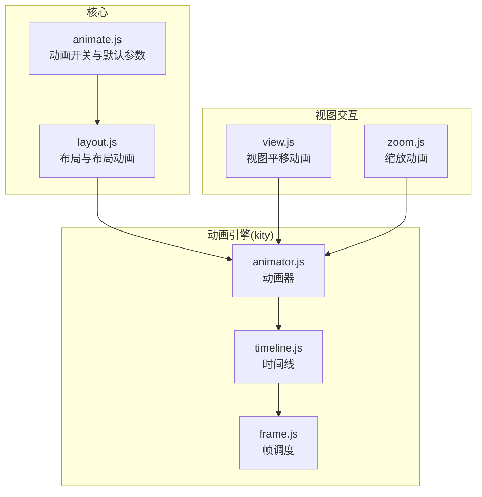
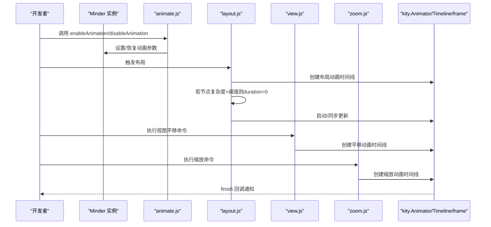
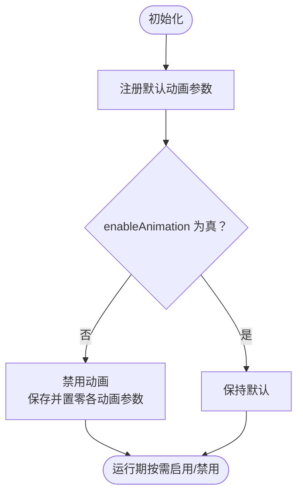
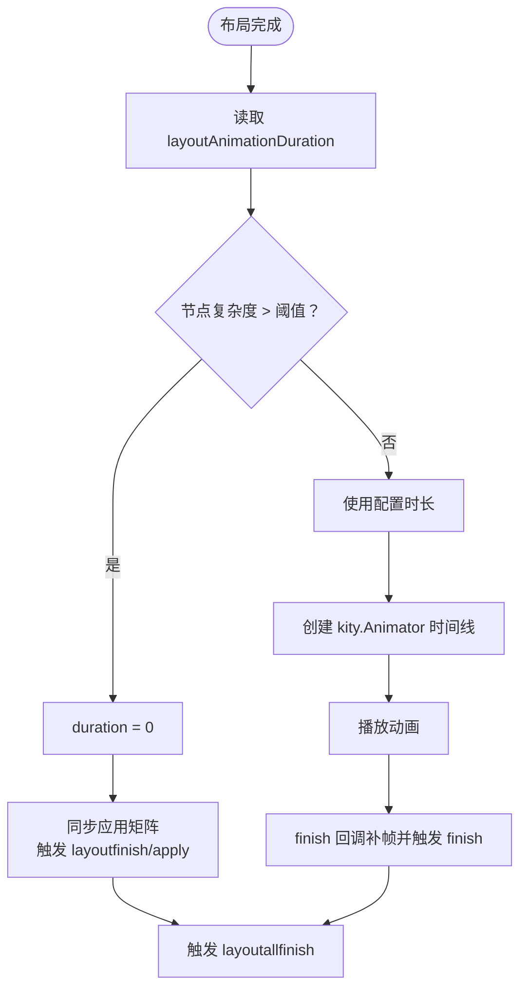
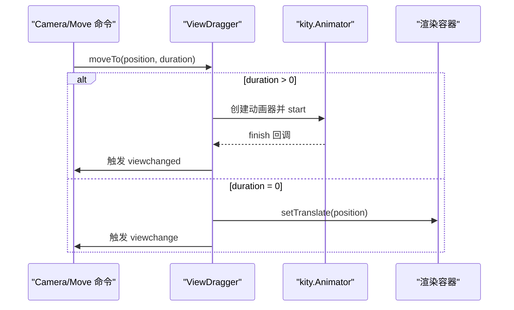
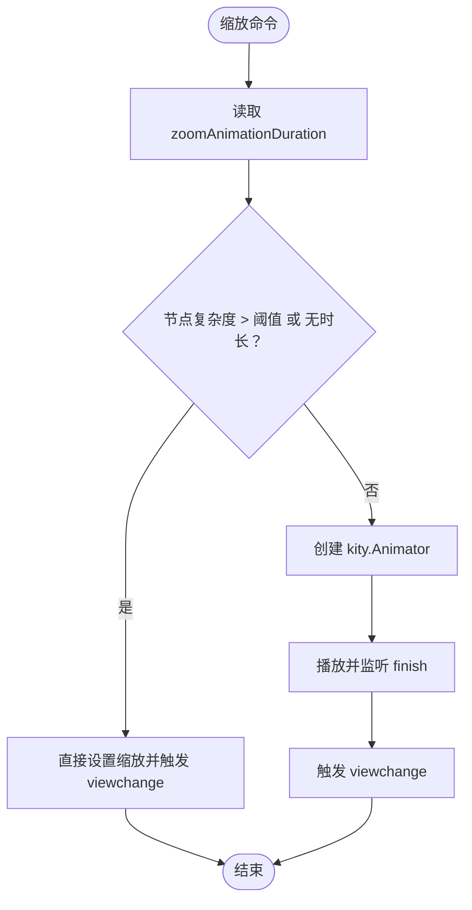
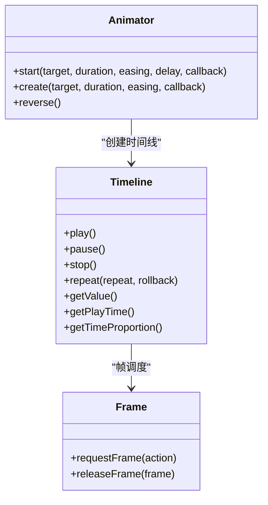
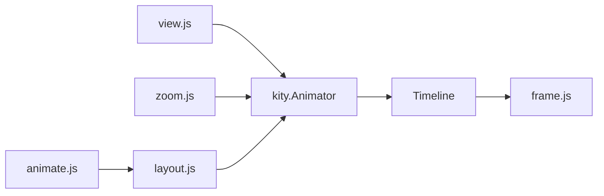

# 动画控制优化

<cite>
**本文引用的文件列表**
- [animate.js](file://src/core/animate.js)
- [layout.js](file://src/core/layout.js)
- [view.js](file://src/module/view.js)
- [zoom.js](file://src/module/zoom.js)
- [animator.js](file://node_modules/kity/src/animate/animator.js)
- [timeline.js](file://node_modules/kity/src/animate/timeline.js)
- [frame.js](file://node_modules/kity/src/animate/frame.js)
</cite>

## 目录
1. [引言](#引言)
2. [项目结构](#项目结构)
3. [核心组件](#核心组件)
4. [架构总览](#架构总览)
5. [详细组件分析](#详细组件分析)
6. [依赖关系分析](#依赖关系分析)
7. [性能考量](#性能考量)
8. [故障排查指南](#故障排查指南)
9. [结论](#结论)

## 引言
本文件系统性阐述动画系统的性能优化机制，围绕以下目标展开：
- 基于 animate.js 中的 enableAnimation 和 disableAnimation 方法，说明如何动态控制动画开关以适配不同性能需求；
- 结合 layout.js 中“当节点数超过阈值时自动将布局动画时长设为 0”的策略，分析动画对大规模思维导图的性能影响；
- 解释 kity.Animator 在动画中的应用，确保动画流畅性；
- 提供在低性能设备上的自动降级方案，并指导开发者如何配置 viewAnimationDuration、zoomAnimationDuration 等参数以平衡体验与性能。

## 项目结构
动画相关的核心代码分布在如下模块：
- 核心动画控制：src/core/animate.js
- 布局与动画：src/core/layout.js
- 视图平移动画：src/module/view.js
- 缩放动画：src/module/zoom.js
- 动画引擎（kity）：node_modules/kity/src/animate/animator.js、timeline.js、frame.js

图表来源
- [animate.js](file://src/core/animate.js#L1-L43)
- [layout.js](file://src/core/layout.js#L390-L520)
- [view.js](file://src/module/view.js#L37-L70)
- [zoom.js](file://src/module/zoom.js#L45-L73)
- [animator.js](file://node_modules/kity/src/animate/animator.js#L105-L176)
- [timeline.js](file://node_modules/kity/src/animate/timeline.js#L157-L204)
- [frame.js](file://node_modules/kity/src/animate/frame.js#L95-L124)

章节来源
- [animate.js](file://src/core/animate.js#L1-L43)
- [layout.js](file://src/core/layout.js#L390-L520)
- [view.js](file://src/module/view.js#L37-L70)
- [zoom.js](file://src/module/zoom.js#L45-L73)
- [animator.js](file://node_modules/kity/src/animate/animator.js#L105-L176)
- [timeline.js](file://node_modules/kity/src/animate/timeline.js#L157-L204)
- [frame.js](file://node_modules/kity/src/animate/frame.js#L95-L124)

## 核心组件
- 动画开关与默认参数：在初始化阶段注册默认动画参数，并根据 enableAnimation 决定是否禁用动画。启用/禁用时保存并恢复各动画参数。
- 布局动画：布局完成后，根据节点复杂度阈值自动降级为同步更新，避免大规模节点动画带来的卡顿。
- 视图平移动画：视图平移采用 kity.Animator，支持缓动与回调，保证平滑过渡。
- 缩放动画：缩放同样使用 kity.Animator，且在复杂度高或无时长时直接同步更新。
- 动画引擎：kity.Animator 负责创建时间线，Timeline 负责驱动帧循环，frame.js 将其封装为 requestAnimationFrame 的兼容实现。

章节来源
- [animate.js](file://src/core/animate.js#L12-L42)
- [layout.js](file://src/core/layout.js#L458-L519)
- [view.js](file://src/module/view.js#L37-L70)
- [zoom.js](file://src/module/zoom.js#L45-L73)
- [animator.js](file://node_modules/kity/src/animate/animator.js#L105-L176)
- [timeline.js](file://node_modules/kity/src/animate/timeline.js#L157-L204)
- [frame.js](file://node_modules/kity/src/animate/frame.js#L95-L124)

## 架构总览
动画系统通过“参数控制 + 自动降级 + 引擎驱动”的方式实现：
- 参数控制：enableAnimation、layoutAnimationDuration、viewAnimationDuration、zoomAnimationDuration；
- 自动降级：当节点复杂度超过阈值时，布局动画直接同步更新；
- 引擎驱动：kity.Animator + Timeline + frame.js，统一使用 requestAnimationFrame 驱动帧循环。

图表来源
- [animate.js](file://src/core/animate.js#L20-L42)
- [layout.js](file://src/core/layout.js#L458-L519)
- [view.js](file://src/module/view.js#L37-L70)
- [zoom.js](file://src/module/zoom.js#L45-L73)
- [animator.js](file://node_modules/kity/src/animate/animator.js#L105-L176)
- [timeline.js](file://node_modules/kity/src/animate/timeline.js#L157-L204)
- [frame.js](file://node_modules/kity/src/animate/frame.js#L95-L124)

## 详细组件分析

### 组件A：动画开关与参数控制（animate.js）
- 默认参数：包含 enableAnimation、layoutAnimationDuration、viewAnimationDuration、zoomAnimationDuration；
- 初始化钩子：注册默认参数并在禁用时立即禁用动画；
- 动态开关：
  - enableAnimation：恢复之前保存的参数；
  - disableAnimation：保存当前参数并将各动画参数置零，从而在后续流程中自动降级。

图表来源
- [animate.js](file://src/core/animate.js#L12-L25)
- [animate.js](file://src/core/animate.js#L27-L42)

章节来源
- [animate.js](file://src/core/animate.js#L12-L42)

### 组件B：布局动画与自动降级（layout.js）
- 布局流程：两轮布局计算后，调用 applyLayoutResult 应用结果；
- 自动降级：当节点复杂度超过阈值时，将布局动画时长设为 0，直接同步更新；
- 动画实现：若 duration > 0，则使用 kity.Animator 创建时间线，逐节点插值更新矩阵，并在 finish 后补帧确保最终一致性；
- 事件触发：layoutapply、layoutfinish、layoutallfinish 等事件用于外部监听。

图表来源
- [layout.js](file://src/core/layout.js#L390-L436)
- [layout.js](file://src/core/layout.js#L458-L519)

章节来源
- [layout.js](file://src/core/layout.js#L390-L436)
- [layout.js](file://src/core/layout.js#L458-L519)

### 组件C：视图平移动画（view.js）
- 平移命令：根据 viewAnimationDuration 决定是否使用动画；
- 动画实现：使用 kity.Animator 包装平移过程，设置缓动曲线并监听 finish；
- 无动画路径：直接设置平移并向外触发 viewchange 事件。

图表来源
- [view.js](file://src/module/view.js#L37-L70)

章节来源
- [view.js](file://src/module/view.js#L37-L70)

### 组件D：缩放动画（zoom.js）
- 缩放命令：根据 zoomAnimationDuration 决定是否使用动画；
- 自动降级：当节点复杂度超过阈值或无时长时，直接同步更新；
- 动画实现：使用 kity.Animator 插值缩放值，设置文本渲染策略以提升低倍率下的速度。

图表来源
- [zoom.js](file://src/module/zoom.js#L45-L73)

章节来源
- [zoom.js](file://src/module/zoom.js#L45-L73)

### 组件E：动画引擎（kity.Animator/Timeline/frame）
- Animator：支持两种构造方式，提供 start/create 接口，可传入缓动函数与回调；
- Timeline：负责驱动帧循环，计算当前值并通过 setter 应用到目标；
- Frame：封装 requestAnimationFrame，提供帧调度与释放，具备最小化/切页检测的容错。

图表来源
- [animator.js](file://node_modules/kity/src/animate/animator.js#L105-L176)
- [timeline.js](file://node_modules/kity/src/animate/timeline.js#L157-L204)
- [frame.js](file://node_modules/kity/src/animate/frame.js#L95-L124)

章节来源
- [animator.js](file://node_modules/kity/src/animate/animator.js#L105-L176)
- [timeline.js](file://node_modules/kity/src/animate/timeline.js#L157-L204)
- [frame.js](file://node_modules/kity/src/animate/frame.js#L95-L124)

## 依赖关系分析
- animate.js 与 layout.js：animate.js 控制全局动画参数，layout.js 在 applyLayoutResult 中读取并可能将其置零；
- view.js 与 zoom.js：均依赖 minder.getOption 获取动画时长，并委托 kity.Animator 完成动画；
- kity.Animator/Timeline/frame：作为统一动画引擎，被上述模块复用。

图表来源
- [animate.js](file://src/core/animate.js#L12-L42)
- [layout.js](file://src/core/layout.js#L390-L519)
- [view.js](file://src/module/view.js#L37-L70)
- [zoom.js](file://src/module/zoom.js#L45-L73)
- [animator.js](file://node_modules/kity/src/animate/animator.js#L105-L176)
- [timeline.js](file://node_modules/kity/src/animate/timeline.js#L157-L204)
- [frame.js](file://node_modules/kity/src/animate/frame.js#L95-L124)

章节来源
- [animate.js](file://src/core/animate.js#L12-L42)
- [layout.js](file://src/core/layout.js#L390-L519)
- [view.js](file://src/module/view.js#L37-L70)
- [zoom.js](file://src/module/zoom.js#L45-L73)
- [animator.js](file://node_modules/kity/src/animate/animator.js#L105-L176)
- [timeline.js](file://node_modules/kity/src/animate/timeline.js#L157-L204)
- [frame.js](file://node_modules/kity/src/animate/frame.js#L95-L124)

## 性能考量
- 动画开关策略
  - 在低端设备或内存紧张场景，建议在初始化时将 enableAnimation 设为 false，或在运行期调用 disableAnimation 关闭所有动画；
  - 需要恢复时调用 enableAnimation，系统会恢复之前保存的参数。
- 大规模节点降级
  - 布局阶段当节点复杂度超过阈值时，自动将布局动画时长置零，直接同步更新，避免动画带来的额外开销；
  - 视图平移与缩放在复杂度高或无时长时也采取同步更新策略。
- requestAnimationFrame 与帧调度
  - kity 的帧调度通过 requestAnimationFrame 实现，具备最小化/切页检测的容错，减少无效渲染；
  - 动画过程中会停止旧时间线并创建新时间线，避免并发动画叠加导致的抖动与卡顿。
- 参数配置建议
  - viewAnimationDuration：在低端设备上可设为较小值或 0，以降低平移动画成本；
  - zoomAnimationDuration：在大规模节点场景建议设为 0，避免缩放动画带来的额外计算；
  - layoutAnimationDuration：在大规模节点场景建议设为 0，或根据设备性能逐步下调。

章节来源
- [animate.js](file://src/core/animate.js#L12-L42)
- [layout.js](file://src/core/layout.js#L458-L519)
- [view.js](file://src/module/view.js#L37-L70)
- [zoom.js](file://src/module/zoom.js#L45-L73)
- [frame.js](file://node_modules/kity/src/animate/frame.js#L142-L166)

## 故障排查指南
- 症状：布局完成后节点位置不稳定或闪烁
  - 可能原因：动画 finish 回调后仍存在丢帧风险，系统在 finish 后补帧以确保最终一致；
  - 处理：确认布局流程中是否正确监听 finish 事件并执行后续逻辑。
- 症状：低端设备上布局卡顿严重
  - 可能原因：节点复杂度过高，布局动画未降级；
  - 处理：检查节点复杂度阈值与布局动画时长配置，必要时在初始化阶段禁用动画或降低时长。
- 症状：视图平移或缩放无动画但无响应
  - 可能原因：duration 为 0 或复杂度超过阈值；
  - 处理：确认 viewAnimationDuration/zoomAnimationDuration 配置，或在初始化阶段禁用动画。

章节来源
- [layout.js](file://src/core/layout.js#L486-L519)
- [view.js](file://src/module/view.js#L37-L70)
- [zoom.js](file://src/module/zoom.js#L45-L73)

## 结论
本动画系统通过“参数控制 + 自动降级 + 引擎驱动”实现了对大规模思维导图的性能优化：
- 动态开关 enableAnimation 可在运行期灵活控制动画；
- 布局阶段针对大规模节点自动降级，避免动画带来的额外开销；
- kity.Animator/Timeline/frame 提供稳定的帧调度与缓动支持；
- 开发者可通过合理配置 viewAnimationDuration、zoomAnimationDuration、layoutAnimationDuration，在不同设备与场景下取得最佳体验与性能平衡。