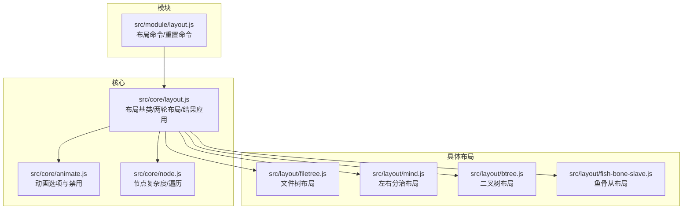
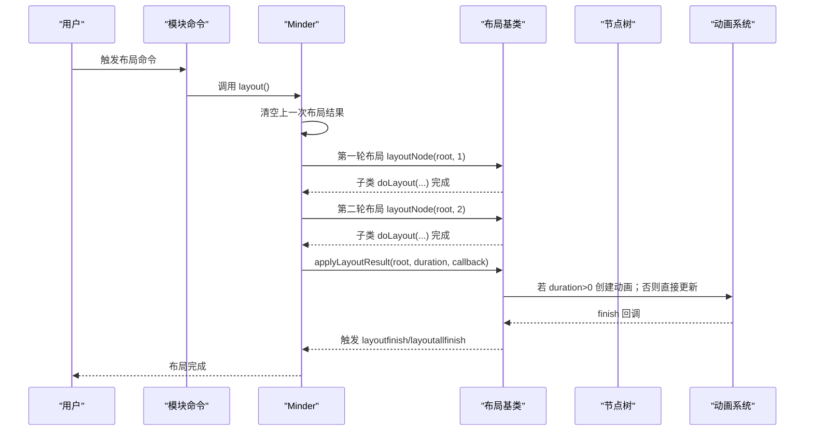
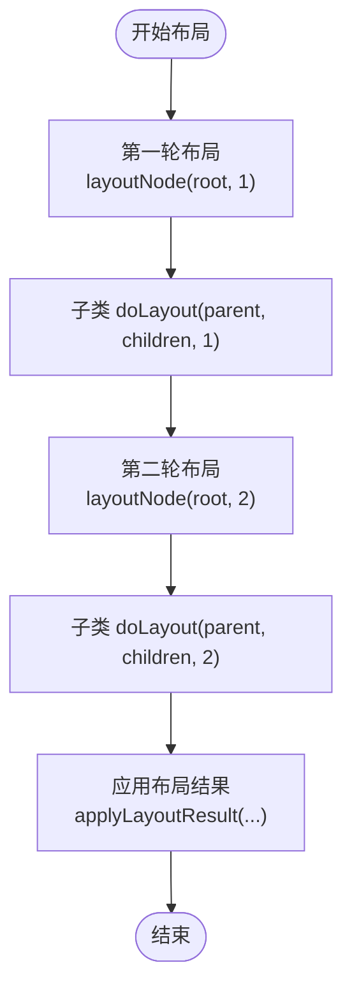
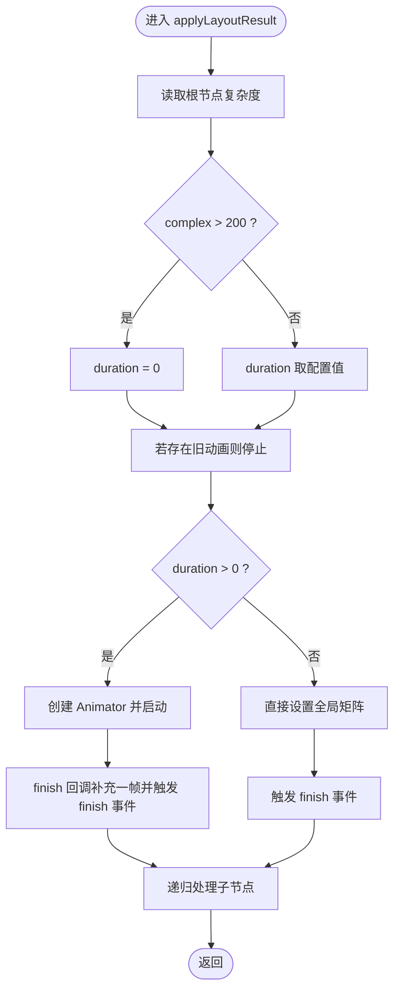
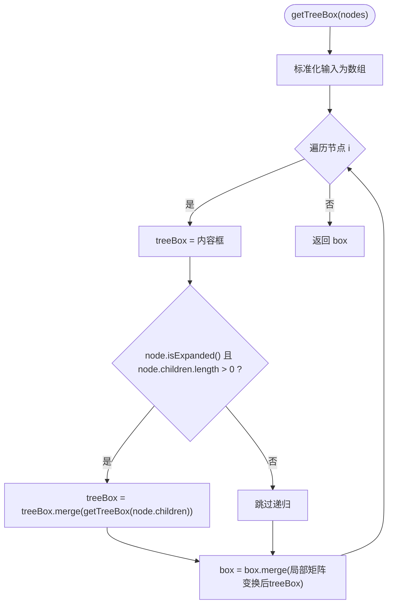
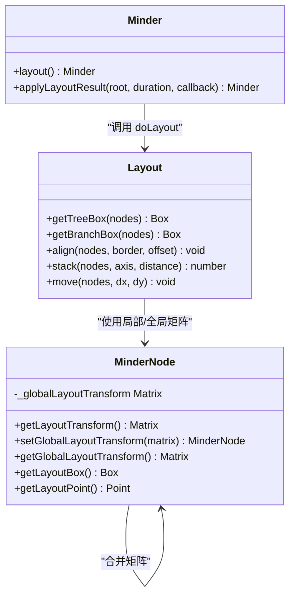
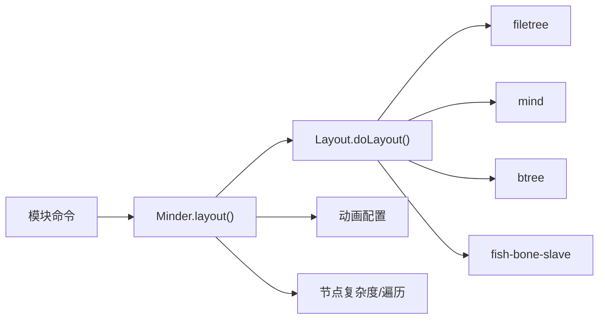

# 布局计算优化

<cite>
**本文引用的文件**
- [src/core/layout.js](file://src/core/layout.js)
- [src/core/animate.js](file://src/core/animate.js)
- [src/core/node.js](file://src/core/node.js)
- [src/layout/filetree.js](file://src/layout/filetree.js)
- [src/layout/mind.js](file://src/layout/mind.js)
- [src/layout/btree.js](file://src/layout/btree.js)
- [src/layout/fish-bone-slave.js](file://src/layout/fish-bone-slave.js)
- [src/module/layout.js](file://src/module/layout.js)
</cite>

## 目录
1. [引言](#引言)
2. [项目结构](#项目结构)
3. [核心组件](#核心组件)
4. [架构总览](#架构总览)
5. [详细组件分析](#详细组件分析)
6. [依赖关系分析](#依赖关系分析)
7. [性能考量](#性能考量)
8. [故障排查指南](#故障排查指南)
9. [结论](#结论)
10. [附录](#附录)

## 引言
本文件聚焦于布局系统在 doLayout 算法上的两轮布局机制、applyLayoutResult 的动画控制策略、getTreeBox/getBranchBox 的递归计算与剪枝优化、布局变换矩阵的合并与缓存机制，以及自定义布局算法的时间复杂度控制建议。目标是帮助开发者在大规模思维导图场景下实现高性能、流畅的布局体验。

## 项目结构
布局系统由“核心布局框架”“具体布局算法”“模块与命令”三部分组成：
- 核心布局框架：提供通用布局抽象、工具方法、两轮布局调度与结果应用流程。
- 具体布局算法：如文件树、左右分治、鱼骨等，复用核心框架提供的工具方法。
- 模块与命令：对外暴露布局切换与重置能力，并触发核心布局流程。

图表来源
- [src/core/layout.js](file://src/core/layout.js#L1-L524)
- [src/core/animate.js](file://src/core/animate.js#L1-L43)
- [src/core/node.js](file://src/core/node.js#L95-L110)
- [src/layout/filetree.js](file://src/layout/filetree.js#L1-L89)
- [src/layout/mind.js](file://src/layout/mind.js#L1-L62)
- [src/layout/btree.js](file://src/layout/btree.js#L1-L41)
- [src/layout/fish-bone-slave.js](file://src/layout/fish-bone-slave.js#L44-L72)
- [src/module/layout.js](file://src/module/layout.js#L1-L92)

章节来源
- [src/core/layout.js](file://src/core/layout.js#L1-L524)
- [src/module/layout.js](file://src/module/layout.js#L1-L92)

## 核心组件
- 布局基类与工具方法
  - 提供 doLayout 抽象接口，子类需实现。
  - 提供 align、stack、move 等常用布局工具。
  - 提供 getBranchBox、getTreeBox 用于计算节点或子树的包围盒。
- 两轮布局调度
  - 在 Minder.layout 中先进行第一轮布局，再进行第二轮布局，确保依赖关系在第二轮得到修正。
- 结果应用与动画控制
  - applyLayoutResult 将每节点的局部布局变换合并为全局变换，并按复杂度阈值动态关闭动画，避免卡顿。

章节来源
- [src/core/layout.js](file://src/core/layout.js#L1-L168)
- [src/core/layout.js](file://src/core/layout.js#L391-L520)

## 架构总览
下面的序列图展示了从用户触发到布局完成的端到端流程，包括两轮布局与动画应用的关键步骤。

图表来源
- [src/module/layout.js](file://src/module/layout.js#L25-L45)
- [src/core/layout.js](file://src/core/layout.js#L391-L520)
- [src/core/animate.js](file://src/core/animate.js#L12-L17)

## 详细组件分析

### 两轮布局机制与必要性
- 两轮布局的设计目的
  - 第一轮：计算初步布局，建立局部变换。
  - 第二轮：利用第一轮输出的几何信息（如 getTreeBox、getLayoutBox），对节点进行二次调整（例如微调对齐、向量修正等）。
- 实现要点
  - Minder.layout 中分别调用两次 layoutNode(root, 1) 与 layoutNode(root, 2)。
  - 子类布局算法可读取 round 参数，在第二轮执行特定逻辑（如某些布局算法在 round==2 时进行微调）。

图表来源
- [src/core/layout.js](file://src/core/layout.js#L391-L436)
- [src/layout/filetree.js](file://src/layout/filetree.js#L13-L20)
- [src/layout/fish-bone-slave.js](file://src/layout/fish-bone-slave.js#L62-L71)

章节来源
- [src/core/layout.js](file://src/core/layout.js#L391-L436)
- [src/layout/filetree.js](file://src/layout/filetree.js#L13-L20)
- [src/layout/fish-bone-slave.js](file://src/layout/fish-bone-slave.js#L62-L71)

### applyLayoutResult 的动画控制与复杂度阈值
- 复杂度阈值
  - 通过节点根的复杂度（子树节点数量）决定是否启用动画。当复杂度超过阈值时，强制 duration=0，避免大量节点动画导致卡顿。
- 动画生命周期
  - 若存在旧动画，先停止旧动画并释放 timeline。
  - 若 duration>0，创建 Animator 并在 finish 后补充一帧，保证最终状态一致。
  - 若 duration==0，直接设置全局矩阵并触发 finish 事件。
- 事件与回调
  - 每个节点应用完成后触发 layoutfinish；全部节点完成后触发 layoutallfinish。

图表来源
- [src/core/layout.js](file://src/core/layout.js#L444-L519)
- [src/core/animate.js](file://src/core/animate.js#L12-L17)
- [src/core/node.js](file://src/core/node.js#L95-L110)

章节来源
- [src/core/layout.js](file://src/core/layout.js#L444-L519)
- [src/core/animate.js](file://src/core/animate.js#L12-L17)
- [src/core/node.js](file://src/core/node.js#L95-L110)

### getTreeBox 与 getBranchBox 的递归计算与剪枝优化
- getBranchBox
  - 针对一组节点，将每个节点的内容框经其局部布局变换映射后合并，得到分支整体包围盒。
- getTreeBox
  - 针对单个节点或节点数组，递归合并其内容框与子树包围盒；仅在节点展开且存在子节点时才递归计算子树包围盒，从而实现“展开才递归”的剪枝。
- 性能影响
  - 递归深度与节点数线性相关；通过 isExpanded 剪枝显著降低大体量收起节点的计算成本。

图表来源
- [src/core/layout.js](file://src/core/layout.js#L141-L163)

章节来源
- [src/core/layout.js](file://src/core/layout.js#L121-L163)

### 布局变换矩阵的合并与缓存机制
- 局部到全局的矩阵传递
  - 每个节点维护局部布局变换；在应用阶段，将父节点的全局矩阵与当前节点的局部矩阵合并，得到当前节点的全局矩阵。
- 缓存与渲染
  - 节点维护 _globalLayoutTransform 缓存，避免重复计算；同时通过渲染容器设置矩阵，减少重复绘制。
- 精度与稳定性
  - 在应用阶段对平移分量进行四舍五入，减少浮点误差累积。

图表来源
- [src/core/layout.js](file://src/core/layout.js#L237-L384)
- [src/core/layout.js](file://src/core/layout.js#L391-L520)

章节来源
- [src/core/layout.js](file://src/core/layout.js#L237-L384)
- [src/core/layout.js](file://src/core/layout.js#L391-L520)

### 自定义布局算法的时间复杂度控制建议
- 避免 O(n^2) 或更高复杂度
  - 不要在单次 doLayout 中对所有节点进行双重遍历或相互比较；尽量将比较/查找操作限制在 O(n log n) 或 O(n)。
- 使用工具方法提升效率
  - 优先使用 getTreeBox/getBranchBox 进行包围盒计算，避免重复计算；在需要时配合 align/stack/move 快速定位。
- 两轮布局的正确使用
  - 在第二轮 round==2 中只做必要的微调，避免重复计算已在第一轮完成的工作。
- 剪枝与懒计算
  - 对于收起的节点，不要进行布局计算；仅在展开时递归计算子树。
- 动画与复杂度权衡
  - 当复杂度超过阈值时，交由 applyLayoutResult 关闭动画，确保交互流畅。

章节来源
- [src/core/layout.js](file://src/core/layout.js#L121-L163)
- [src/core/layout.js](file://src/core/layout.js#L391-L436)
- [src/core/layout.js](file://src/core/layout.js#L444-L519)

### 典型布局算法示例与优化点
- 文件树布局（filetree）
  - 使用 align/stack 对齐与堆叠；在 dir>0 时向下排列，在 dir<0 时向上排列；通过 getTreeBox 计算子树高度以确定偏移。
- 左右分治布局（mind）
  - 将子节点分为左右两组，分别委托左右布局实例计算，最后在父节点设置出边向量。
- 二叉树布局（btree）
  - 针对四个方向注册布局，内部通过轴向与方向参数控制布局方向与向量。
- 鱼骨从布局（fish-bone-slave）
  - 在第二轮 round==2 时对齐子节点的垂直位置，减少视觉错位。

章节来源
- [src/layout/filetree.js](file://src/layout/filetree.js#L13-L52)
- [src/layout/mind.js](file://src/layout/mind.js#L9-L29)
- [src/layout/btree.js](file://src/layout/btree.js#L1-L41)
- [src/layout/fish-bone-slave.js](file://src/layout/fish-bone-slave.js#L44-L71)

## 依赖关系分析
- 模块命令依赖核心布局
  - 布局命令调用 node.layout(name)，最终触发 Minder.layout()。
- 核心布局依赖动画与节点
  - 读取动画配置与禁用策略；使用节点复杂度进行阈值判断；使用节点矩阵与包围盒工具。
- 具体布局依赖核心工具
  - 所有布局算法均基于 Layout 抽象，复用 getTreeBox/getBranchBox/align/stack/move 等工具。

图表来源
- [src/module/layout.js](file://src/module/layout.js#L25-L45)
- [src/core/layout.js](file://src/core/layout.js#L391-L520)
- [src/core/animate.js](file://src/core/animate.js#L12-L17)
- [src/core/node.js](file://src/core/node.js#L95-L110)

章节来源
- [src/module/layout.js](file://src/module/layout.js#L1-L92)
- [src/core/layout.js](file://src/core/layout.js#L391-L520)
- [src/core/animate.js](file://src/core/animate.js#L12-L17)
- [src/core/node.js](file://src/core/node.js#L95-L110)

## 性能考量
- 两轮布局
  - 通过两次布局分离“初算”和“微调”，避免一次性计算带来的不一致与额外代价。
- 剪枝优化
  - 仅在节点展开时递归计算子树包围盒，显著降低收起节点的计算开销。
- 动画阈值
  - 复杂度阈值（>200）自动关闭动画，避免大规模节点动画造成的卡顿。
- 矩阵合并与缓存
  - 局部矩阵与父矩阵合并，避免重复计算；节点缓存全局矩阵，减少渲染抖动。
- 工具方法复用
  - 使用 getTreeBox/getBranchBox/align/stack/move 等工具，统一计算路径，减少重复实现。

[本节为通用性能讨论，不直接分析具体文件]

## 故障排查指南
- 布局卡顿
  - 检查复杂度是否超过阈值；确认动画是否被自动关闭。
  - 排查是否存在不必要的 O(n^2) 循环或重复计算。
- 布局错位
  - 确认第二轮 round 是否正确使用；检查 getTreeBox 的递归条件与 isExpanded 剪枝是否生效。
- 动画异常
  - 检查动画配置项与禁用策略；确认旧动画是否被正确停止，新动画是否在 finish 后补充一帧。

章节来源
- [src/core/layout.js](file://src/core/layout.js#L444-L519)
- [src/core/animate.js](file://src/core/animate.js#L12-L17)
- [src/core/layout.js](file://src/core/layout.js#L141-L163)

## 结论
通过两轮布局、递归剪枝、复杂度阈值下的动画关闭、矩阵合并与缓存，以及工具方法的统一使用，布局系统在大规模节点场景下实现了稳定与高效的性能表现。开发者在实现自定义布局时应遵循时间复杂度控制原则，充分利用现有工具与两轮布局机制，确保交互流畅与视觉一致。

[本节为总结性内容，不直接分析具体文件]

## 附录
- 关键 API 与职责
  - doLayout：子类实现布局算法。
  - getTreeBox/getBranchBox：计算包围盒，支持剪枝。
  - align/stack/move：快速对齐与堆叠。
  - applyLayoutResult：合并矩阵、应用动画、触发事件。
  - getComplex：计算子树节点数量，作为复杂度阈值依据。

章节来源
- [src/core/layout.js](file://src/core/layout.js#L1-L168)
- [src/core/layout.js](file://src/core/layout.js#L391-L520)
- [src/core/node.js](file://src/core/node.js#L95-L110)