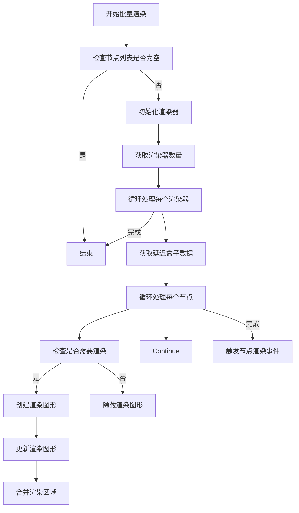
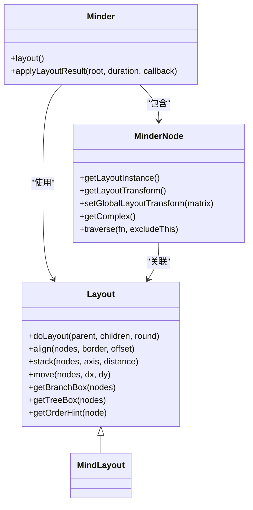
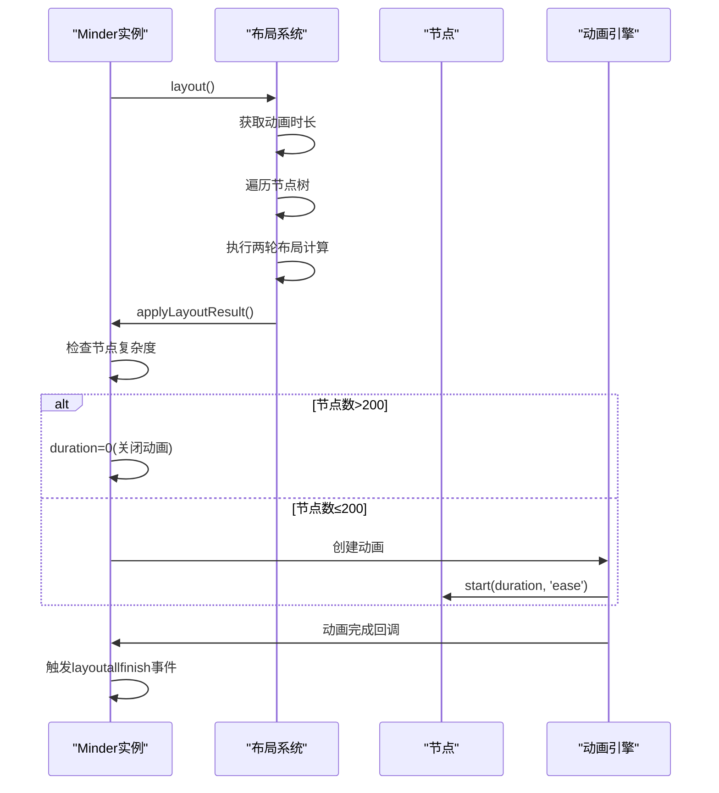
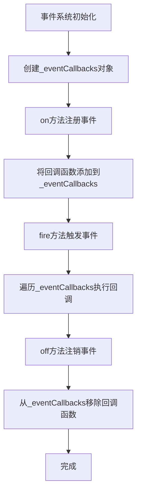

# 性能优化

<cite>
**本文档引用的文件**
- [layout.js](file://src/core/layout.js)
- [render.js](file://src/core/render.js)
- [animate.js](file://src/core/animate.js)
- [paper.js](file://src/core/paper.js)
- [node.js](file://src/core/node.js)
- [minder.js](file://src/core/minder.js)
- [utils.js](file://src/core/utils.js)
- [event.js](file://src/core/event.js)
</cite>

## 目录
1. [引言](#引言)
2. [渲染批处理与增量更新](#渲染批处理与增量更新)
3. [布局计算优化](#布局计算优化)
4. [动画系统优化](#动画系统优化)
5. [内存管理最佳实践](#内存管理最佳实践)
6. [性能监控与分析](#性能监控与分析)
7. [结论](#结论)

## 引言
本文档深入探讨kityminder-core思维导图核心库的性能优化策略，重点关注大规模思维导图渲染的性能瓶颈和解决方案。文档将系统性地分析渲染批处理、增量更新、虚拟DOM技术的应用，深入研究布局计算的性能优化，详细说明动画系统的优化技巧，并探讨内存管理的最佳实践。

**Section sources**
- [layout.js](file://src/core/layout.js)
- [render.js](file://src/core/render.js)

## 渲染批处理与增量更新

kityminder-core通过渲染批处理机制来优化大规模思维导图的渲染性能。核心实现位于`render.js`文件中的`renderNodeBatch`方法，该方法能够批量处理多个节点的渲染，减少DOM操作次数，提高渲染效率。

**Diagram sources**
- [render.js](file://src/core/render.js#L86-L163)

**Section sources**
- [render.js](file://src/core/render.js#L86-L163)

## 布局计算优化

### doLayout算法时间复杂度优化

布局计算是思维导图性能的关键瓶颈。kityminder-core通过`layout.js`文件中的`doLayout`算法实现高效的布局计算。该算法采用递归方式遍历节点树，但通过剪枝优化避免了对收起节点的计算，显著降低了时间复杂度。

**Diagram sources**
- [layout.js](file://src/core/layout.js#L20-L523)
- [node.js](file://src/core/node.js#L11-L407)

### 避免重复计算

kityminder-core通过多种机制避免不必要的重复计算：

1. **缓存全局布局变换**：在`MinderNode`类中，`_globalLayoutTransform`属性缓存了节点相对于全局的布局变换，避免了重复计算。
2. **复杂度计算优化**：`getComplex()`方法通过遍历子树计算节点复杂度，为性能决策提供依据。
3. **两轮布局计算**：采用两轮布局策略，第一轮计算布局，第二轮进行修正，确保布局准确性的同时避免重复计算。

**Section sources**
- [layout.js](file://src/core/layout.js#L390-L518)
- [node.js](file://src/core/node.js#L101-L107)

## 动画系统优化

### 动画时长与自动关闭策略

kityminder-core的动画系统在`animate.js`文件中定义了默认的动画时长配置，并实现了智能的动画关闭策略。当节点数量超过200时，系统会自动关闭动画以保证性能。

**Diagram sources**
- [layout.js](file://src/core/layout.js#L438-L518)
- [animate.js](file://src/core/animate.js#L12-L17)

### requestAnimationFrame应用

虽然代码中未直接使用`requestAnimationFrame`，但通过`setTimeout`和动画引擎的结合，实现了流畅的渲染效果。系统在动画完成时使用`setTimeout`确保事件的正确触发顺序。

**Section sources**
- [layout.js](file://src/core/layout.js#L424-L433)
- [animate.js](file://src/core/animate.js#L12-L43)

## 内存管理最佳实践

### 事件监听器管理

kityminder-core通过事件系统实现了高效的事件监听器管理。在`event.js`文件中，事件回调函数被存储在`_eventCallbacks`对象中，通过`on`和`off`方法进行注册和注销，避免了内存泄漏。

**Diagram sources**
- [event.js](file://src/core/event.js#L133-L265)

### 渲染容器回收

在`paper.js`文件中，渲染容器通过`_rc`属性进行管理，确保了渲染容器的正确创建和回收。`getRenderContainer`方法提供了对渲染容器的统一访问接口。

**Section sources**
- [paper.js](file://src/core/paper.js#L38-L41)
- [event.js](file://src/core/event.js#L133-L265)

## 性能监控与分析

### 复杂度监控

kityminder-core通过`getComplex()`方法监控思维导图的复杂度，为性能优化决策提供数据支持。该方法遍历整个子树，计算节点数量，帮助系统判断是否需要关闭动画等性能密集型功能。

### 性能事件

系统通过一系列性能相关事件帮助开发者监控和分析性能问题：

- `layout`：布局开始事件
- `layoutapply`：布局应用事件
- `layoutfinish`：单个节点布局完成事件
- `layoutallfinish`：所有节点布局完成事件

这些事件为开发者提供了详细的性能监控点，便于定位性能瓶颈。

**Section sources**
- [layout.js](file://src/core/layout.js#L435-L436)
- [node.js](file://src/core/node.js#L101-L107)

## 结论
kityminder-core通过一系列精心设计的性能优化策略，有效解决了大规模思维导图渲染的性能挑战。从渲染批处理、布局计算优化到动画系统和内存管理，每个环节都体现了对性能的深入理解和优化。开发者可以借鉴这些策略，结合性能监控工具，持续优化思维导图应用的性能表现。