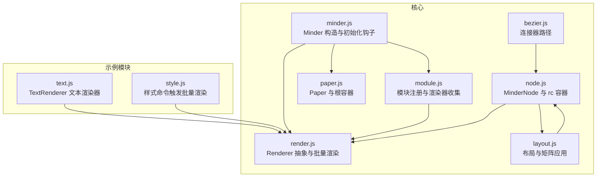
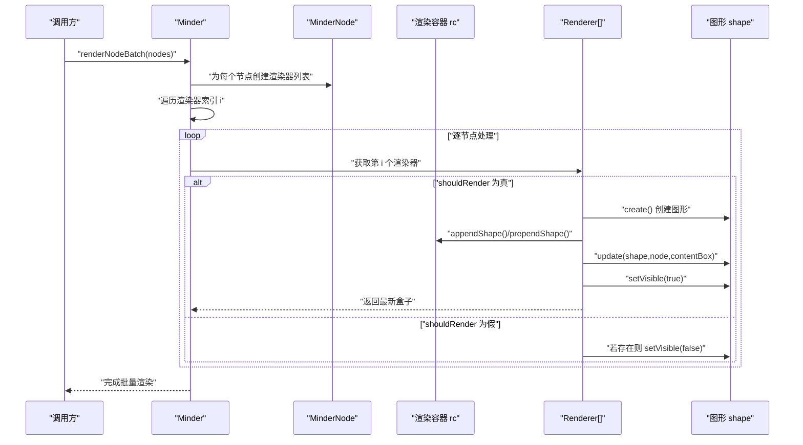
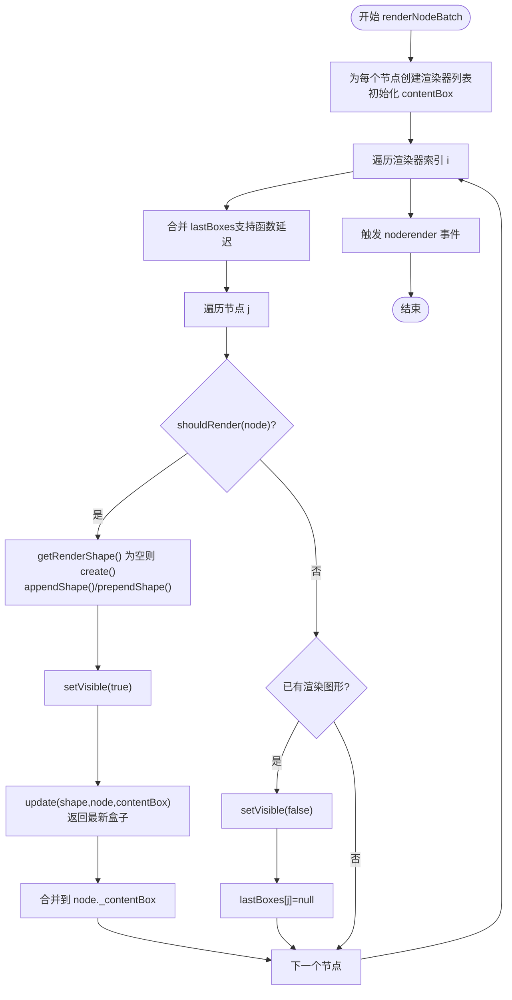
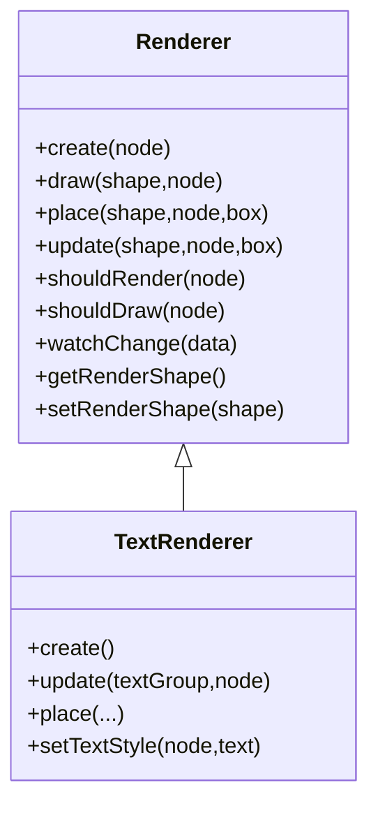
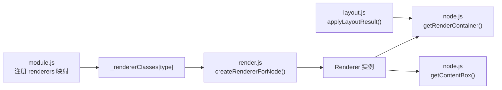

# 渲染优化

<cite>
**本文引用的文件列表**
- [render.js](file://src/core/render.js)
- [node.js](file://src/core/node.js)
- [paper.js](file://src/core/paper.js)
- [minder.js](file://src/core/minder.js)
- [module.js](file://src/core/module.js)
- [text.js](file://src/module/text.js)
- [style.js](file://src/module/style.js)
- [layout.js](file://src/core/layout.js)
- [bezier.js](file://src/connect/bezier.js)
</cite>

## 目录
1. [引言](#引言)
2. [项目结构](#项目结构)
3. [核心组件](#核心组件)
4. [架构总览](#架构总览)
5. [详细组件分析](#详细组件分析)
6. [依赖关系分析](#依赖关系分析)
7. [性能考量](#性能考量)
8. [故障排查指南](#故障排查指南)
9. [结论](#结论)
10. [附录](#附录)

## 引言
本篇文档聚焦于渲染优化，围绕 render.js 中的批量渲染机制展开，深入剖析渲染器（Renderer）生命周期与 shouldRender 条件判断对性能的影响；解释渲染批处理如何通过合并盒子计算与延迟更新提升大规模节点渲染效率；探讨渲染容器的复用与隐藏策略（setVisible）在性能上的优势；并结合代码路径示例，指导如何自定义高效渲染器，避免不必要的图形创建与销毁；最后提供监控渲染性能的方法与优化建议。

## 项目结构
渲染相关的核心代码集中在 core 与 module 目录：
- 核心渲染框架：src/core/render.js 定义 Renderer 抽象类与 Minder 的批量渲染扩展
- 节点与容器：src/core/node.js 提供节点容器 rc 与渲染盒 contentBox
- 渲染画布：src/core/paper.js 初始化 Paper 与根渲染容器
- 模块注册：src/core/module.js 将各模块的渲染器注册到 Minder
- 示例渲染器：src/module/text.js 提供文本渲染器 TextRenderer
- 样式命令：src/module/style.js 展示如何触发批量渲染
- 布局与矩阵：src/core/layout.js 提供布局变换与全局矩阵应用
- 连接线：src/connect/bezier.js 展示连接器路径生成

图表来源
- [render.js](file://src/core/render.js#L1-L261)
- [node.js](file://src/core/node.js#L1-L407)
- [paper.js](file://src/core/paper.js#L1-L76)
- [minder.js](file://src/core/minder.js#L1-L41)
- [module.js](file://src/core/module.js#L1-L151)
- [text.js](file://src/module/text.js#L1-L289)
- [style.js](file://src/module/style.js#L1-L114)
- [layout.js](file://src/core/layout.js#L1-L524)
- [bezier.js](file://src/connect/bezier.js#L1-L42)

章节来源
- [render.js](file://src/core/render.js#L1-L261)
- [node.js](file://src/core/node.js#L1-L407)
- [paper.js](file://src/core/paper.js#L1-L76)
- [minder.js](file://src/core/minder.js#L1-L41)
- [module.js](file://src/core/module.js#L1-L151)

## 核心组件
- Renderer 抽象类：定义 create/draw/place/update/shouldRender 等接口，统一渲染器生命周期
- Minder 扩展：renderNodeBatch 与 renderNode 实现批量与单节点渲染
- MinderNode：持有渲染容器 rc 与 contentBox，提供渲染盒查询
- Paper：初始化渲染画布与根容器
- 模块注册：将各模块的渲染器按位置（center/left/right/top/bottom/outline/outside）收集
- 示例渲染器：TextRenderer 展示如何实现 create/update/place 并返回盒子

章节来源
- [render.js](file://src/core/render.js#L1-L261)
- [node.js](file://src/core/node.js#L1-L407)
- [paper.js](file://src/core/paper.js#L1-L76)
- [module.js](file://src/core/module.js#L1-L151)
- [text.js](file://src/module/text.js#L1-L289)

## 架构总览
渲染流程从 Minder 发起，根据节点集合选择 renderNode 或 renderNodeBatch；每个节点按注册顺序实例化多个 Renderer；渲染器负责图形创建、绘制与定位；最终通过 setVisible 控制显隐；布局阶段应用全局矩阵，完成最终定位。

图表来源
- [render.js](file://src/core/render.js#L85-L219)
- [node.js](file://src/core/node.js#L241-L243)

## 详细组件分析

### 渲染器生命周期与 shouldRender 条件判断
- 生命周期方法
  - create：首次创建渲染图形
  - draw：基于节点数据绘制图形内容
  - place：根据 contentBox 定位图形
  - update：组合 draw 与 place，并返回盒子
  - shouldRender：决定当前上下文是否渲染该渲染器
- 性能影响
  - shouldRender 可用于按需跳过渲染，减少图形创建与 DOM 操作
  - shouldDraw 与 watchChange 可用于细粒度控制绘制与变更检测
- 代码路径
  - [Renderer.update](file://src/core/render.js#L38-L41)
  - [Renderer.shouldRender](file://src/core/render.js#L16-L18)
  - [Renderer.watchChange](file://src/core/render.js#L20-L32)

章节来源
- [render.js](file://src/core/render.js#L1-L58)

### 批量渲染 renderNodeBatch 的工作机制
- 关键点
  - 预先为每个节点创建渲染器列表，保证所有节点同一索引的渲染器数量一致
  - 按渲染器索引分层处理，先合并 lastBoxes，再逐节点执行 shouldRender 判定
  - 对未创建的图形进行 create，并在 rc 中 append/prepend；强制 setVisible(true)
  - 对不应渲染但已创建的图形 setVisible(false)，并清空 lastBoxes
  - 最终触发 noderender 事件
- 盒子合并与延迟更新
  - lastBoxes 支持函数延迟求值，避免重复计算
  - update 返回盒子后合并到 node._contentBox，供后续渲染器使用
- 代码路径
  - [renderNodeBatch 主循环](file://src/core/render.js#L85-L163)
  - [renderNode 单节点版本](file://src/core/render.js#L165-L219)

图表来源
- [render.js](file://src/core/render.js#L85-L163)

章节来源
- [render.js](file://src/core/render.js#L85-L219)

### 渲染容器复用与隐藏策略（setVisible）
- 复用策略
  - 渲染器图形仅在首次缺失时创建，后续复用，避免频繁销毁与重建
  - 通过 appendShape/prependShape 控制层级，bringToBack 决定前置/后置
- 隐藏策略
  - shouldRender 为假时，setVisible(false) 并将 lastBoxes 置空，避免无效绘制
- 代码路径
  - [appendShape/prependShape 使用](file://src/core/render.js#L136-L141)
  - [setVisible(true/false)](file://src/core/render.js#L144-L153)

章节来源
- [render.js](file://src/core/render.js#L130-L156)

### 自定义高效渲染器的最佳实践
- 接口实现
  - create：只创建一次，返回可复用的图形容器
  - update：先 draw 再 place，返回盒子或延迟盒子函数
  - place：仅做定位，避免重复计算
- 盒子缓存
  - 缓存上次盒子与哈希，命中则返回延迟盒子，避免重复测量
- 条件渲染
  - shouldRender：根据节点状态或上下文决定是否渲染
  - shouldDraw/watchChange：按数据变化决定是否重绘
- 代码路径
  - [TextRenderer.create/update/place](file://src/module/text.js#L129-L243)

图表来源
- [render.js](file://src/core/render.js#L1-L58)
- [text.js](file://src/module/text.js#L129-L243)

章节来源
- [render.js](file://src/core/render.js#L1-L58)
- [text.js](file://src/module/text.js#L129-L243)

### 渲染与布局的协同
- 布局阶段应用全局矩阵，使节点整体平移/旋转生效
- applyLayoutResult 在复杂度高时关闭动画，减少重绘压力
- 代码路径
  - [applyLayoutResult 动画与同步切换](file://src/core/layout.js#L444-L519)
  - [setGlobalLayoutTransform](file://src/core/layout.js#L287-L290)

章节来源
- [layout.js](file://src/core/layout.js#L287-L290)
- [layout.js](file://src/core/layout.js#L444-L519)

### 连接器与渲染的关系
- 连接器根据布局顶点与方向生成路径，不影响节点渲染，但与布局矩阵共同决定连线端点
- 代码路径
  - [bezier 连接器](file://src/connect/bezier.js#L14-L41)

章节来源
- [bezier.js](file://src/connect/bezier.js#L14-L41)

## 依赖关系分析
- 模块注册将各模块的渲染器按位置类型收集到 Minder._rendererClasses
- Minder.renderNodeBatch 依据该映射为每个节点创建渲染器实例
- 渲染器依赖节点的 rc 容器与 contentBox，以及布局提供的全局矩阵

图表来源
- [module.js](file://src/core/module.js#L97-L111)
- [render.js](file://src/core/render.js#L60-L83)
- [node.js](file://src/core/node.js#L241-L257)
- [layout.js](file://src/core/layout.js#L444-L519)

章节来源
- [module.js](file://src/core/module.js#L97-L111)
- [render.js](file://src/core/render.js#L60-L83)
- [node.js](file://src/core/node.js#L241-L257)
- [layout.js](file://src/core/layout.js#L444-L519)

## 性能考量
- 减少 DOM 操作与重绘重排
  - 批量渲染：集中创建与更新，减少多次 append/prepend
  - setVisible 隐藏非必要图形，避免无效绘制
  - 盒子延迟：update 返回函数，按需计算，避免重复测量
- 合并盒子计算
  - lastBoxes 合并到 node._contentBox，供后续渲染器使用，降低重复计算
- 大规模节点渲染
  - renderNodeBatch 逐层处理，避免每节点重复遍历
  - applyLayoutResult 在节点复杂度高时关闭动画，减少主线程压力
- 自定义渲染器优化
  - 缓存文本盒子与样式哈希，命中则直接返回缓存盒子
  - 条件渲染与绘制，避免无意义的图形更新

章节来源
- [render.js](file://src/core/render.js#L85-L163)
- [text.js](file://src/module/text.js#L210-L235)
- [layout.js](file://src/core/layout.js#L458-L460)
- [layout.js](file://src/core/layout.js#L486-L519)

## 故障排查指南
- 渲染器未创建图形
  - 检查 shouldRender 是否返回 true
  - 确认 create 是否被调用
  - 参考路径：[shouldRender/create 调用链](file://src/core/render.js#L130-L141)
- 图形未显示
  - 检查 setVisible(true/false) 的分支
  - 参考路径：[setVisible 分支](file://src/core/render.js#L144-L153)
- 盒子未合并导致后续渲染异常
  - 确认 update 返回盒子或延迟盒子函数
  - 参考路径：[update 返回与合并](file://src/core/render.js#L146-L156)
- 文本渲染错位或高度异常
  - 检查文本盒子缓存与样式哈希
  - 参考路径：[文本盒子缓存与延迟盒子](file://src/module/text.js#L210-L235)
- 样式批量更新后未刷新
  - 确认调用 renderNodeBatch 或 renderTree
  - 参考路径：[样式命令触发批量渲染](file://src/module/style.js#L72-L74)

章节来源
- [render.js](file://src/core/render.js#L130-L156)
- [text.js](file://src/module/text.js#L210-L235)
- [style.js](file://src/module/style.js#L72-L74)

## 结论
render.js 的批量渲染机制通过“按层迭代 + 盒子延迟 + 条件渲染 + 容器复用”有效减少了 DOM 操作与重绘重排；Renderer 的 shouldRender 与 shouldDraw 为按需渲染提供了关键开关；TextRenderer 的盒子缓存与延迟盒子进一步降低了测量成本。结合布局阶段的全局矩阵应用与 applyLayoutResult 的动画策略，系统在大规模节点场景下仍能保持良好性能。自定义渲染器应遵循“只创建一次、按需绘制、延迟盒子、条件渲染”的原则，以获得最佳渲染效率。

## 附录
- 快速定位代码路径
  - 批量渲染入口：[renderNodeBatch](file://src/core/render.js#L85-L163)
  - 单节点渲染入口：[renderNode](file://src/core/render.js#L165-L219)
  - 渲染器抽象：[Renderer](file://src/core/render.js#L7-L58)
  - 文本渲染器示例：[TextRenderer](file://src/module/text.js#L129-L243)
  - 样式命令触发批量渲染：[style.js paste/clear](file://src/module/style.js#L72-L110)
  - 布局应用与动画控制：[applyLayoutResult](file://src/core/layout.js#L444-L519)
  - 连接器路径生成：[bezier](file://src/connect/bezier.js#L14-L41)