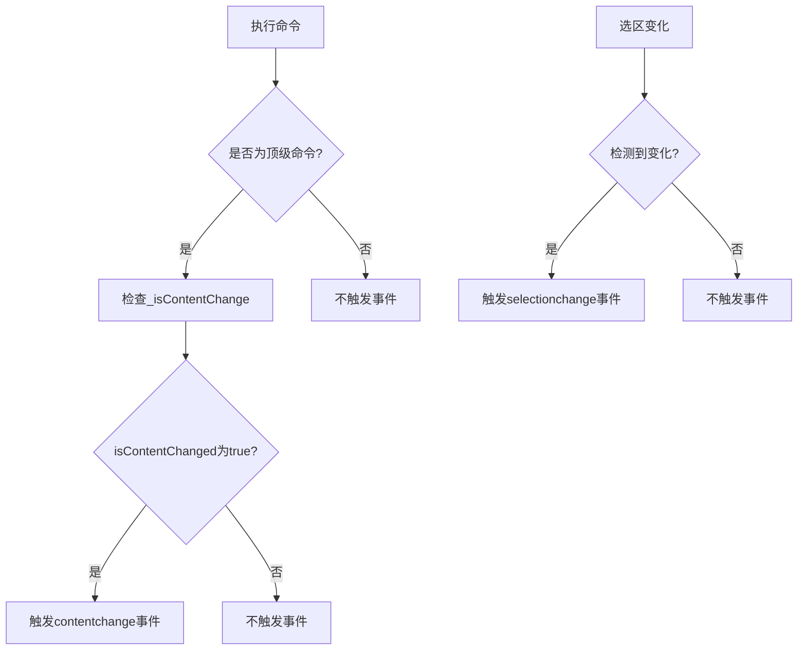
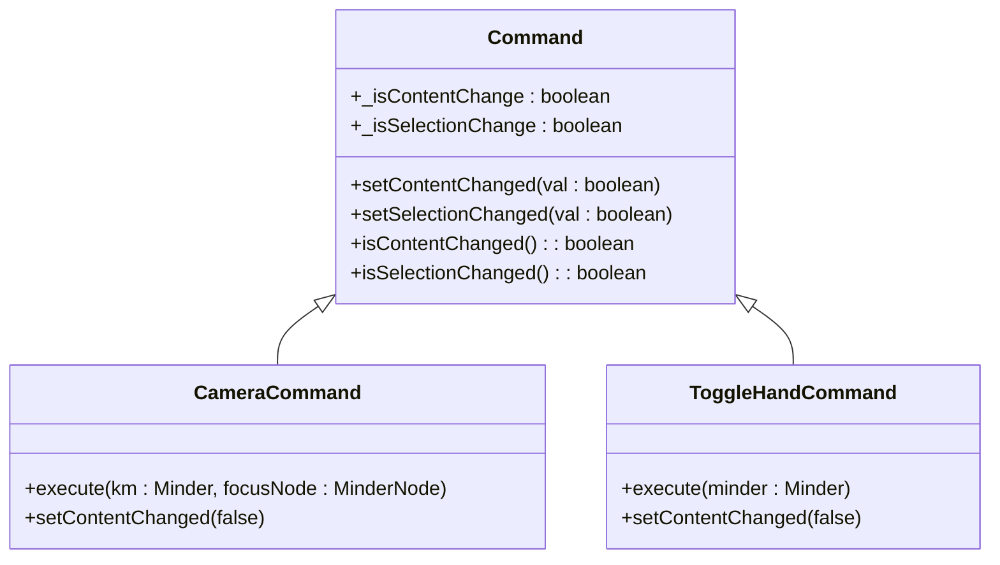

# 内容与选区变更跟踪

<cite>
**本文档引用文件**  
- [command.js](file://src/core/command.js)
- [select.js](file://src/core/select.js)
- [event.js](file://src/core/event.js)
- [view.js](file://src/module/view.js)
- [text.js](file://src/module/text.js)
- [node.js](file://src/module/node.js)
- [Architecture.md](file://doc/Architecture.md)
</cite>

## 目录
1. [变更跟踪机制概述](#变更跟踪机制概述)
2. [setContentChanged与setSelectionChanged方法解析](#setcontentchanged与setselectionchanged方法解析)
3. [_isContentChange与_isSelectionChange内部属性作用](#_iscontentchange与_isselectionchange内部属性作用)
4. [contentchange事件与选区更新触发机制](#contentchange事件与选区更新触发机制)
5. [CameraCommand等视图操作命令的变更标记管理](#cameracommand等视图操作命令的变更标记管理)
6. [变更跟踪在性能优化与用户体验中的应用](#变更跟踪在性能优化与用户体验中的应用)
7. [批量操作的变更标记管理策略](#批量操作的变更标记管理策略)

## 变更跟踪机制概述

KityMinder通过命令系统实现内容与选区的变更跟踪，利用`setContentChanged()`和`setSelectionChanged()`方法控制变更标记，从而决定是否触发`contentchange`事件和历史记录更新。该机制确保只有实际改变内容或选区的操作才会触发相关事件，避免不必要的性能开销。

**Section sources**
- [command.js](file://src/core/command.js#L1-L169)
- [Architecture.md](file://doc/Architecture.md#L424-L427)

## setContentChanged与setSelectionChanged方法解析

`setContentChanged()`和`setSelectionChanged()`是命令系统中的关键方法，用于标记命令执行后是否引起内容或选区的变化。`setContentChanged()`方法接收布尔值参数，设置`_isContentChange`内部属性，决定是否将命令视为内容变更；`setSelectionChanged()`方法设置`_isSelectionChange`属性，标记选区是否发生变化。

这些方法允许命令在执行后明确声明其对编辑器状态的影响，为事件系统和历史记录管理提供决策依据。

**Section sources**
- [command.js](file://src/core/command.js#L25-L39)

## _isContentChange与_isSelectionChange内部属性作用

`_isContentChange`和`_isSelectionChange`是命令类的内部属性，分别用于跟踪内容变更和选区变更状态。`_isContentChange`默认为`true`，表示大多数命令会改变内容；`_isSelectionChange`默认为`false`，因为多数命令不直接影响选区。

这两个属性在命令执行后被查询，决定是否触发相应的事件。例如，当`_isContentChange`为`true`时，系统会触发`contentchange`事件；当选区实际发生变化时，`renderChangedSelection()`方法会检测到变化并触发`selectionchange`事件。

**Section sources**
- [command.js](file://src/core/command.js#L17-L19)
- [select.js](file://src/core/select.js#L17-L39)

## contentchange事件与选区更新触发机制

`contentchange`事件在顶级命令执行后，通过检查`cmd.isContentChanged()`返回值来决定是否触发。如果返回`true`，则调用`this._firePharse(new MinderEvent('contentchange'))`触发事件。`selectionchange`事件则在`renderChangedSelection()`方法中，当检测到选区变化时触发。

事件触发遵循"顶级命令"原则，即在命令中调用其他命令不会重复触发事件，确保事件系统的稳定性和可预测性。

**Diagram sources**
- [command.js](file://src/core/command.js#L149-L151)
- [select.js](file://src/core/select.js#L33-L36)

**Section sources**
- [command.js](file://src/core/command.js#L149-L151)
- [select.js](file://src/core/select.js#L17-L39)
- [Architecture.md](file://doc/Architecture.md#L424-L427)

## CameraCommand等视图操作命令的变更标记管理

视图操作命令如`CameraCommand`、`ToggleHandCommand`等通过调用`setContentChanged(false)`明确声明不改变内容，避免触发不必要的`contentchange`事件和历史记录更新。例如，`CameraCommand`在执行后调用`this.setContentChanged(false)`，确保视野移动操作不会被记录为内容变更。

这种机制使得视图操作能够流畅执行，同时保持内容历史的纯净性，用户可以专注于实际的内容编辑操作。

**Diagram sources**
- [view.js](file://src/module/view.js#L215-L229)
- [view.js](file://src/module/view.js#L189-L199)

**Section sources**
- [view.js](file://src/module/view.js#L215-L229)
- [view.js](file://src/module/view.js#L189-L199)

## 变更跟踪在性能优化与用户体验中的应用

变更跟踪机制在性能优化和用户体验方面发挥重要作用。通过精确控制事件触发，避免了不必要的重渲染和事件处理，提升了编辑器响应速度。例如，键盘导航操作被标记为不改变内容，确保快速导航不会触发内容变更事件。

在用户体验方面，该机制保证了历史记录的合理性，用户撤销操作时只会回退实际的内容变更，而不会回退视图调整或选区变化，提供了更直观的撤销体验。

**Section sources**
- [keymap.js](file://src/core/keymap.js#L68-L76)
- [Architecture.md](file://doc/Architecture.md#L428)

## 批量操作的变更标记管理策略

对于批量操作，建议在操作开始前设置适当的变更标记，在操作完成后统一触发必要的事件。可以通过临时禁用某些事件监听器或使用事务性操作模式来优化性能。对于不改变内容的批量操作，应明确调用`setContentChanged(false)`，避免触发`contentchange`事件。

最佳实践是将相关操作组合为一个逻辑命令，在该命令中精确控制变更标记，确保既保持操作的原子性，又避免不必要的事件触发和历史记录条目。

**Section sources**
- [command.js](file://src/core/command.js#L25-L39)
- [Architecture.md](file://doc/Architecture.md#L424-L427)