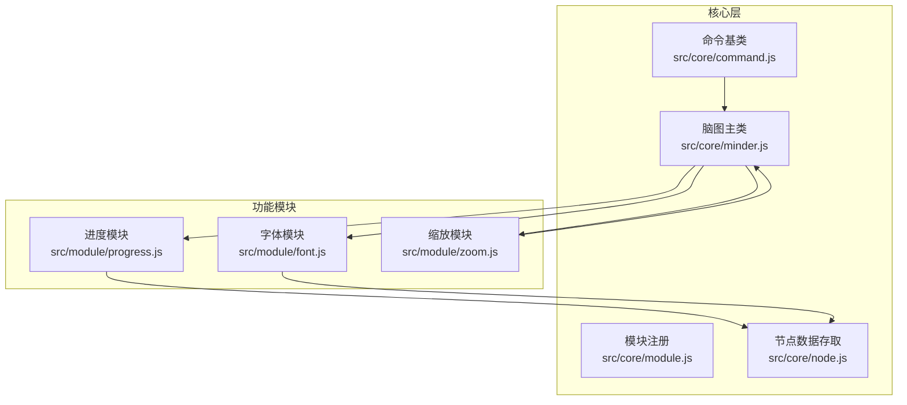
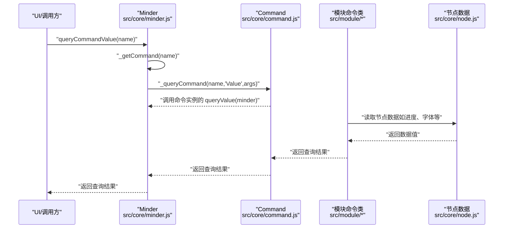
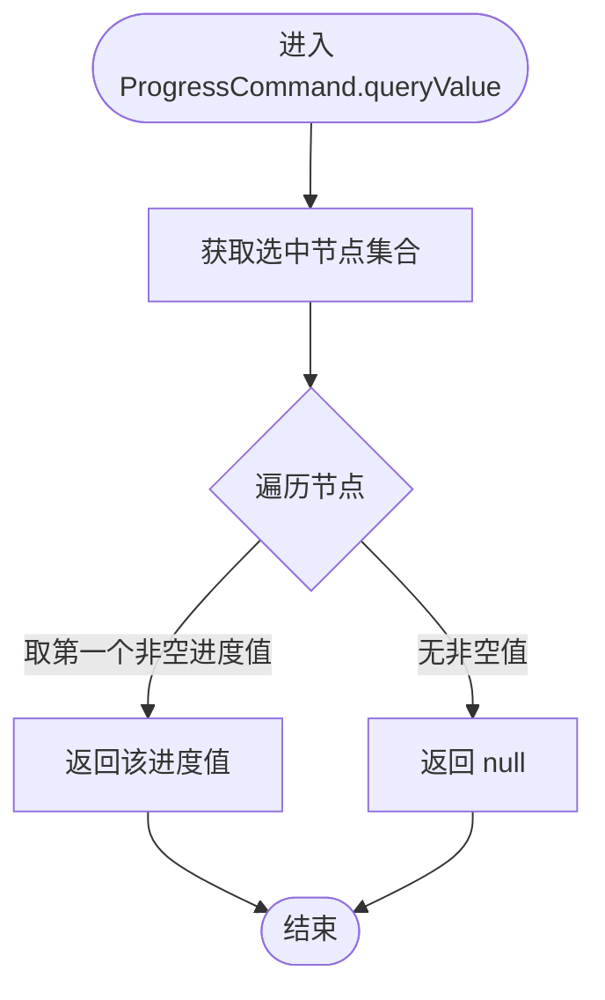
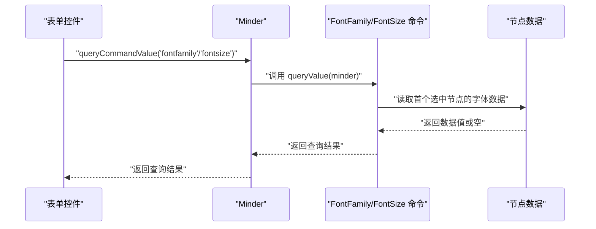
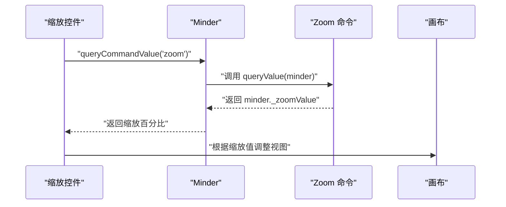
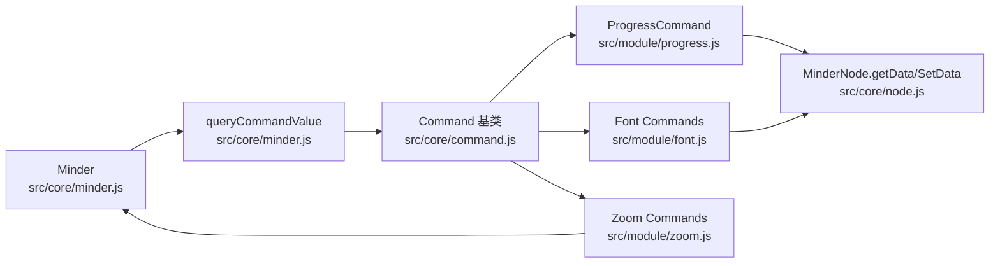

# 命令值查询机制

<cite>
**本文引用的文件**
- [src/core/command.js](file://src/core/command.js)
- [src/core/minder.js](file://src/core/minder.js)
- [src/core/module.js](file://src/core/module.js)
- [src/core/node.js](file://src/core/node.js)
- [src/module/progress.js](file://src/module/progress.js)
- [src/module/font.js](file://src/module/font.js)
- [src/module/zoom.js](file://src/module/zoom.js)
- [doc/Architecture.md](file://doc/Architecture.md)
</cite>

## 目录
1. [引言](#引言)
2. [项目结构](#项目结构)
3. [核心组件](#核心组件)
4. [架构总览](#架构总览)
5. [详细组件分析](#详细组件分析)
6. [依赖分析](#依赖分析)
7. [性能考虑](#性能考虑)
8. [故障排查指南](#故障排查指南)
9. [结论](#结论)
10. [附录：自定义命令值查询开发示例](#附录自定义命令值查询开发示例)

## 引言
本文件围绕命令值查询机制展开，系统性讲解 queryValue 方法的设计原理与实际应用，重点说明其在获取命令相关动态值（如进度百分比、字体大小、缩放比例等）中的作用，并结合 progress 模块的实现，分析如何通过 queryValue 返回节点的进度值以供 UI 显示。同时阐述 queryValue 与 queryState 的区别与协作关系，以及在数据绑定和状态同步中的应用场景，并提供自定义命令值查询的开发示例，包括异步值获取与缓存策略的实现思路。

## 项目结构
本项目采用模块化组织，命令值查询能力由核心层提供，各功能模块（如进度、字体、缩放等）通过注册命令类实现具体的 queryValue 逻辑。关键文件如下：
- 核心命令与查询：src/core/command.js
- 脑图主类与命令查询入口：src/core/minder.js
- 模块注册与生命周期：src/core/module.js
- 节点数据存取：src/core/node.js
- 功能模块示例：src/module/progress.js、src/module/font.js、src/module/zoom.js
- 架构文档：doc/Architecture.md

图表来源
- [src/core/command.js](file://src/core/command.js#L1-L169)
- [src/core/minder.js](file://src/core/minder.js#L1-L41)
- [src/core/module.js](file://src/core/module.js#L1-L44)
- [src/core/node.js](file://src/core/node.js#L1-L200)
- [src/module/progress.js](file://src/module/progress.js#L1-L160)
- [src/module/font.js](file://src/module/font.js#L1-L159)
- [src/module/zoom.js](file://src/module/zoom.js#L1-L181)

章节来源
- [src/core/command.js](file://src/core/command.js#L1-L169)
- [src/core/minder.js](file://src/core/minder.js#L1-L41)
- [src/core/module.js](file://src/core/module.js#L1-L44)
- [src/core/node.js](file://src/core/node.js#L1-L200)
- [src/module/progress.js](file://src/module/progress.js#L1-L160)
- [src/module/font.js](file://src/module/font.js#L1-L159)
- [src/module/zoom.js](file://src/module/zoom.js#L1-L181)
- [doc/Architecture.md](file://doc/Architecture.md#L198-L255)

## 核心组件
- 命令基类与查询接口
  - 命令基类提供 queryState 与 queryValue 两个查询接口，默认行为分别为返回“正常”和返回“零值”。子类可覆盖以实现业务查询逻辑。
  - 脑图主类提供统一的查询入口：queryCommandState 与 queryCommandValue，内部通过反射调用对应命令实例的 queryState/queryValue。
- 节点数据存取
  - 节点提供 getData/setData 接口用于读写节点数据，命令值查询通常从节点数据中读取或汇总。
- 模块注册与生命周期
  - 模块通过 register 注册，初始化时将命令类注入到脑图实例，形成命令名到命令类的映射，从而支持 queryCommandValue 的按名查询。

章节来源
- [src/core/command.js](file://src/core/command.js#L1-L169)
- [src/core/minder.js](file://src/core/minder.js#L1-L41)
- [src/core/module.js](file://src/core/module.js#L1-L44)
- [src/core/node.js](file://src/core/node.js#L1-L200)

## 架构总览
命令值查询的整体流程如下：
- UI 或其他组件调用脑图实例的 queryCommandValue(name)。
- 脑图根据命令名查找已注册的命令类，若存在则调用命令实例的 queryValue(minder)。
- 命令实例根据当前上下文（如选中节点集合）计算并返回值，供 UI 绑定或状态同步使用。

图表来源
- [src/core/minder.js](file://src/core/minder.js#L1-L41)
- [src/core/command.js](file://src/core/command.js#L58-L127)
- [src/core/node.js](file://src/core/node.js#L130-L145)
- [src/module/progress.js](file://src/module/progress.js#L103-L125)
- [src/module/font.js](file://src/module/font.js#L107-L156)
- [src/module/zoom.js](file://src/module/zoom.js#L80-L93)

## 详细组件分析

### 进度模块中的 queryValue 应用
- 命令职责
  - ProgressCommand 提供设置/清除节点进度数据的能力，并实现 queryValue 以返回当前选中节点的进度值，用于 UI 展示。
- 数据存储与读取
  - 进度值通过节点数据存储，命令在执行时写入节点数据，在 queryValue 中读取首个非空进度值。
- UI 渲染联动
  - ProgressRenderer 在 shouldRender 中检查节点是否存在进度数据，并在 update 中根据节点进度值更新图标显示。
- 关键路径
  - 命令执行：设置节点数据并触发布局更新。
  - 值查询：遍历选中节点，返回首个非空进度值。
  - 渲染条件：仅当节点存在进度数据时才渲染进度图标。

图表来源
- [src/module/progress.js](file://src/module/progress.js#L103-L125)

章节来源
- [src/module/progress.js](file://src/module/progress.js#L1-L160)
- [doc/Architecture.md](file://doc/Architecture.md#L256-L311)

### 字体模块中的 queryValue 应用
- 命令职责
  - FontFamily/FontSize 命令分别设置/查询选中节点的字体族与字号，并在 queryValue 中返回首个选中节点的对应值。
- 值返回策略
  - 若仅选中一个节点，返回该节点对应数据值；否则返回特定标记值，用于 UI 表单控件显示“混合”状态。
- 数据来源
  - 从节点数据中读取字体族与字号，若节点未设置则返回空值。

图表来源
- [src/module/font.js](file://src/module/font.js#L107-L156)
- [src/core/node.js](file://src/core/node.js#L130-L145)

章节来源
- [src/module/font.js](file://src/module/font.js#L1-L159)
- [src/core/node.js](file://src/core/node.js#L130-L145)

### 缩放模块中的 queryValue 应用
- 命令职责
  - Zoom 命令返回当前视图缩放比例（百分比），queryValue 直接返回脑图实例内部记录的缩放值。
- 值来源
  - 缩放值存储在脑图实例的内部状态中，命令执行时更新该值并在 UI 中反映。

图表来源
- [src/module/zoom.js](file://src/module/zoom.js#L80-L93)

章节来源
- [src/module/zoom.js](file://src/module/zoom.js#L1-L181)

### queryValue 与 queryState 的区别与协作
- 区别
  - queryState：返回命令的可用状态（如启用/禁用/激活），用于 UI 控件的可用性控制。
  - queryValue：返回命令的当前执行值，用于 UI 控件的值绑定与状态同步。
- 协作关系
  - queryState 决定控件是否可用；queryValue 决定控件当前值。
  - 两者共同保证 UI 与模型的一致性：控件可用时显示正确值，值变化时驱动命令执行，命令执行后再通过 queryValue 更新 UI。

章节来源
- [src/core/command.js](file://src/core/command.js#L41-L57)
- [src/core/minder.js](file://src/core/minder.js#L73-L127)
- [src/module/progress.js](file://src/module/progress.js#L122-L125)
- [src/module/font.js](file://src/module/font.js#L118-L156)
- [src/module/zoom.js](file://src/module/zoom.js#L80-L120)

### 数据绑定与状态同步的应用场景
- 表单控件绑定
  - 使用 queryCommandValue 获取当前值，设置表单控件的初始值；当控件值变化时，调用相应命令执行，再通过 queryCommandValue 同步 UI。
- 按钮状态控制
  - 使用 queryCommandState 判断按钮可用性；使用 queryValue 判断按钮是否处于“已激活”状态（例如进度模块中返回非空值时）。
- 渲染器联动
  - 渲染器根据节点数据与 queryValue 结果决定是否渲染与如何更新显示。

章节来源
- [src/core/minder.js](file://src/core/minder.js#L73-L127)
- [src/module/progress.js](file://src/module/progress.js#L132-L157)
- [src/module/font.js](file://src/module/font.js#L107-L156)

## 依赖分析
- 命令查询链路
  - Minder.queryCommandValue -> _queryCommand -> 命令实例.queryValue
  - 命令实例通常依赖节点数据（getData）与脑图状态（如缩放值）。
- 模块耦合
  - 各模块通过模块注册注入命令类，命令类之间相互独立，仅通过 Minder 的统一查询接口交互。
- 外部依赖
  - 命令类依赖 kity、utils、Minder、MinderNode 等核心模块提供的能力。

图表来源
- [src/core/minder.js](file://src/core/minder.js#L58-L127)
- [src/core/command.js](file://src/core/command.js#L1-L57)
- [src/module/progress.js](file://src/module/progress.js#L103-L125)
- [src/module/font.js](file://src/module/font.js#L107-L156)
- [src/module/zoom.js](file://src/module/zoom.js#L80-L120)
- [src/core/node.js](file://src/core/node.js#L130-L145)

章节来源
- [src/core/minder.js](file://src/core/minder.js#L58-L127)
- [src/core/command.js](file://src/core/command.js#L1-L57)
- [src/core/node.js](file://src/core/node.js#L130-L145)
- [src/module/progress.js](file://src/module/progress.js#L103-L125)
- [src/module/font.js](file://src/module/font.js#L107-L156)
- [src/module/zoom.js](file://src/module/zoom.js#L80-L120)

## 性能考虑
- 值查询复杂度
  - 进度模块的 queryValue 遍历选中节点集合，时间复杂度 O(n)，n 为选中节点数；通常选中节点数量较小，影响有限。
- 渲染优化
  - 渲染器仅在节点存在目标数据时渲染，避免不必要的绘制。
- 布局触发
  - 命令执行后可能触发布局更新，应避免频繁调用导致性能抖动，可通过批量操作或节流策略降低布局频率。

章节来源
- [src/module/progress.js](file://src/module/progress.js#L103-L125)
- [src/module/font.js](file://src/module/font.js#L110-L146)

## 故障排查指南
- 命令未注册
  - 现象：queryCommandValue 返回 undefined。
  - 排查：确认模块是否正确注册，命令名是否拼写一致。
- 无选中节点
  - 现象：字体类命令返回“混合”或空值。
  - 排查：确保至少有一个节点被选中，或在 UI 中对“混合”状态进行特殊处理。
- 值未更新
  - 现象：UI 未反映最新值。
  - 排查：确认命令执行后是否触发了必要的事件或布局更新；检查渲染器的 shouldRender/update 条件。
- 缩放值异常
  - 现象：queryCommandValue('zoom') 返回错误值。
  - 排查：确认命令执行路径是否正确更新 minder._zoomValue；检查鼠标滚轮事件处理是否触发了缩放命令。

章节来源
- [src/core/minder.js](file://src/core/minder.js#L73-L127)
- [src/module/font.js](file://src/module/font.js#L118-L156)
- [src/module/zoom.js](file://src/module/zoom.js#L163-L181)

## 结论
命令值查询机制通过统一的查询入口与命令类的职责划分，实现了 UI 与模型之间的高效解耦。queryValue 负责返回命令的当前执行值，queryState 负责返回命令的可用状态，二者协同保障了 UI 的正确性与一致性。在进度、字体、缩放等模块中，该机制得到了良好实践：通过节点数据存取与渲染器联动，实现了动态值的可视化呈现与状态同步。

## 附录：自定义命令值查询开发示例
以下为自定义命令值查询的开发步骤与建议，涵盖异步值获取与缓存策略的实现思路。

- 命令类设计
  - 继承命令基类，实现 execute 与 queryValue。
  - 在 queryValue 中读取节点数据或外部状态，返回当前值。
- 异步值获取
  - 若值来源于外部服务或异步计算，可在 queryValue 中返回占位值或 Promise，UI 侧监听值变化事件并更新。
- 缓存策略
  - 对于昂贵的计算或频繁查询，可在命令实例中缓存最近一次查询结果，并在数据变更时失效缓存。
- 与渲染器联动
  - 在渲染器中根据 queryValue 的返回值决定是否渲染与如何更新显示，确保 UI 与模型保持一致。

章节来源
- [src/core/command.js](file://src/core/command.js#L1-L57)
- [src/core/minder.js](file://src/core/minder.js#L73-L127)
- [src/core/node.js](file://src/core/node.js#L130-L145)
- [src/core/module.js](file://src/core/module.js#L1-L44)