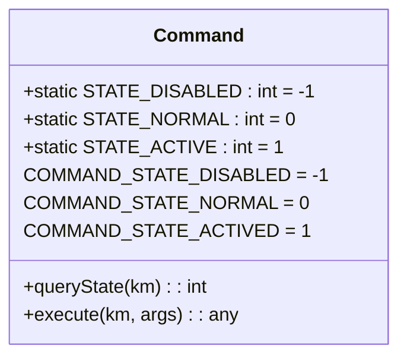
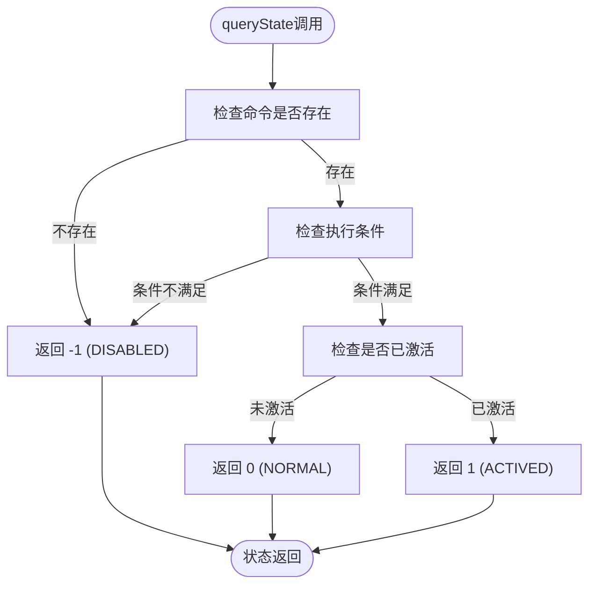
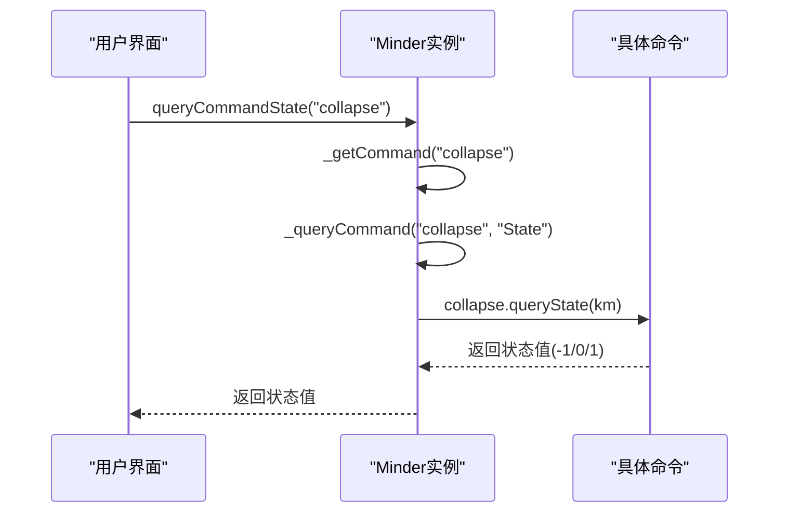
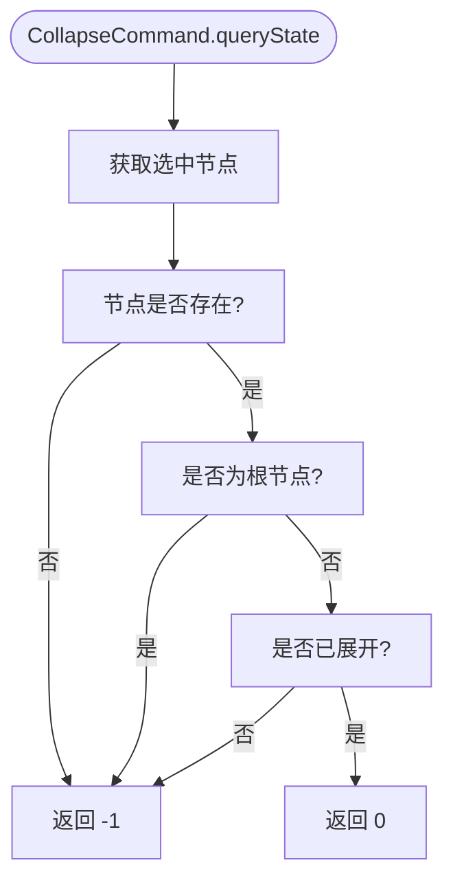
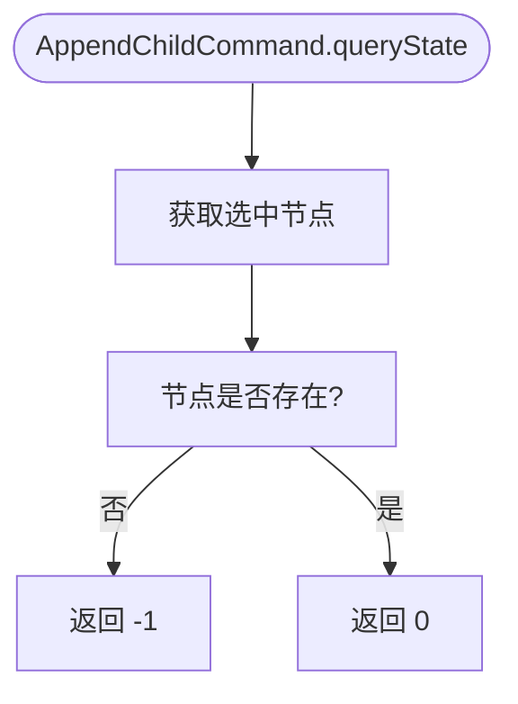
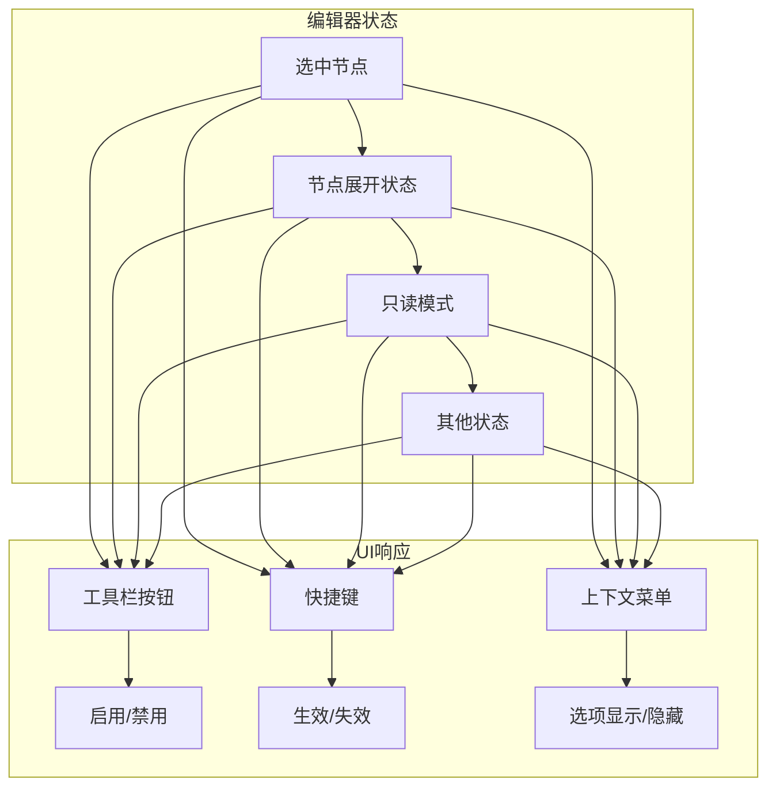

# 命令状态管理

<cite>
**本文档引用的文件**  
- [command.js](file://src/core/command.js)
- [expand.js](file://src/module/expand.js)
- [node.js](file://src/module/node.js)
- [status.js](file://src/core/status.js)
- [readonly.js](file://src/core/readonly.js)
- [module.js](file://src/core/module.js)
</cite>

## 目录
1. [引言](#引言)
2. [命令状态常量定义](#命令状态常量定义)
3. [queryState方法返回值详解](#querystate方法返回值详解)
4. [命令状态查询机制](#命令状态查询机制)
5. [实际命令案例分析](#实际命令案例分析)
6. [状态管理在UI控件中的应用](#状态管理在ui控件中的应用)
7. [最佳实践与常见错误规避](#最佳实践与常见错误规避)
8. [结论](#结论)

## 引言

命令状态管理是KityMinder核心功能的重要组成部分，它通过精确的状态判断机制确保用户界面与编辑器状态的同步。本系统通过`queryState`方法和三个核心状态常量（`COMMAND_STATE_DISABLED`、`COMMAND_STATE_NORMAL`、`COMMAND_STATE_ACTIVED`）实现对命令可用性的动态控制。这种机制不仅提升了用户体验，还确保了操作的合理性和安全性。

**Section sources**
- [command.js](file://src/core/command.js#L8-L10)
- [expand.js](file://src/module/expand.js#L1-L294)

## 命令状态常量定义

系统定义了三个关键的命令状态常量，用于表示命令的不同状态：

- **COMMAND_STATE_DISABLED (-1)**：表示命令不可用状态。当命令当前无法执行时返回此值，通常是因为缺少必要的执行条件（如未选中节点）。
- **COMMAND_STATE_NORMAL (0)**：表示命令可用状态。这是最常见的状态，表示命令可以正常执行。
- **COMMAND_STATE_ACTIVED (1)**：表示命令已激活状态。表示命令不仅可用，而且已经处于执行后的激活状态。

这些常量在`command.js`文件中定义，并通过`Command`类的静态属性暴露给整个系统，确保了状态值的一致性和可维护性。

**Diagram sources**
- [command.js](file://src/core/command.js#L8-L10)
- [command.js](file://src/core/command.js#L54-L56)

**Section sources**
- [command.js](file://src/core/command.js#L8-L10)
- [command.js](file://src/core/command.js#L54-L56)

## queryState方法返回值详解

`queryState`方法是命令状态管理的核心，它返回三个特定值来表示命令的当前状态：

- **-1（COMMAND_STATE_DISABLED）**：命令不可用。这可能是因为命令不存在，或者当前编辑器状态不满足执行条件。例如，当没有选中任何节点时，与节点操作相关的命令都会返回此状态。
- **0（COMMAND_STATE_NORMAL）**：命令可用。表示命令可以正常执行，这是最常见的情况。当用户界面需要启用某个功能按钮时，会检查对应命令是否返回此状态。
- **1（COMMAND_STATE_ACTIVED）**：命令已激活。表示命令不仅可用，而且已经处于执行后的激活状态。这对于切换类命令特别有用，可以反映当前的功能状态。

这些返回值为用户界面提供了清晰的状态指示，使得UI控件能够根据命令状态进行相应的启用/禁用或样式变化。

**Diagram sources**
- [command.js](file://src/core/command.js#L41-L43)
- [command.js](file://src/core/command.js#L83-L86)

**Section sources**
- [command.js](file://src/core/command.js#L41-L43)
- [command.js](file://src/core/command.js#L83-L86)

## 命令状态查询机制

命令状态查询通过`Minder`类的`queryCommandState`方法实现，该方法采用委托模式调用具体命令的`queryState`实现。查询机制的工作流程如下：

1. 通过`_getCommand`方法获取指定名称的命令实例
2. 调用命令实例的`queryState`方法获取状态
3. 返回查询结果

系统还支持只读模式下的状态管理，通过`readonly.js`文件中的机制，在只读状态下备份并替换`queryCommandState`方法，确保在不同编辑状态下命令状态的正确性。

**Diagram sources**
- [command.js](file://src/core/command.js#L59-L70)
- [command.js](file://src/core/command.js#L87-L89)
- [readonly.js](file://src/core/readonly.js#L49-L52)

**Section sources**
- [command.js](file://src/core/command.js#L59-L89)
- [readonly.js](file://src/core/readonly.js#L49-L56)

## 实际命令案例分析

### CollapseCommand分析

`CollapseCommand`用于收起当前选中节点的子树，其状态判断逻辑如下：

只有当存在选中节点、该节点不是根节点且处于展开状态时，`CollapseCommand`才返回`0`（可用状态）。

### AppendChildCommand分析

`AppendChildCommand`用于向选中节点添加子节点，其状态判断相对简单：

只要存在选中节点，该命令就可用，体现了典型的父子节点关系操作逻辑。

**Diagram sources**
- [expand.js](file://src/module/expand.js#L111-L127)
- [node.js](file://src/module/node.js#L19-L41)

**Section sources**
- [expand.js](file://src/module/expand.js#L111-L127)
- [node.js](file://src/module/node.js#L19-L41)

## 状态管理在UI控件中的应用

命令状态管理机制在用户界面中发挥着关键作用，主要体现在以下几个方面：

1. **控件启用/禁用**：根据`queryCommandState`的返回值动态控制工具栏按钮的启用状态，避免用户执行无效操作。
2. **视觉反馈**：通过不同的样式表现命令的激活状态，如高亮已激活的功能按钮。
3. **快捷键管理**：结合状态查询结果，决定快捷键是否生效，提升键盘操作的准确性。
4. **上下文菜单**：在右键菜单中根据当前状态动态显示可用的命令选项。

这种状态驱动的UI更新机制确保了用户界面始终反映编辑器的真实状态，大大提升了用户体验和操作效率。

**Diagram sources**
- [command.js](file://src/core/command.js#L87-L89)
- [expand.js](file://src/module/expand.js#L227-L242)

**Section sources**
- [command.js](file://src/core/command.js#L87-L89)
- [expand.js](file://src/module/expand.js#L227-L242)

## 最佳实践与常见错误规避

### 最佳实践

1. **明确状态条件**：在实现`queryState`方法时，清晰定义命令可用的条件。
2. **性能优化**：确保状态查询逻辑高效，避免复杂的计算影响UI响应速度。
3. **一致性**：保持同类命令的状态判断逻辑一致，降低用户学习成本。
4. **文档化**：在命令注释中明确说明状态返回条件，便于维护和扩展。

### 常见错误规避

1. **避免状态判断过于宽松**：不要让命令在不合适的条件下返回可用状态，这可能导致错误操作。
2. **处理边界情况**：特别注意根节点、空选择等边界情况的状态处理。
3. **及时更新状态**：在相关操作执行后，确保命令状态能够正确反映最新情况。
4. **考虑只读模式**：在只读状态下正确处理命令状态，避免用户误操作。

**Section sources**
- [command.js](file://src/core/command.js#L41-L43)
- [expand.js](file://src/module/expand.js#L79-L82)
- [node.js](file://src/module/node.js#L37-L40)

## 结论

命令状态管理系统通过精心设计的状态常量和查询机制，实现了对编辑器功能的精确控制。`-1`、`0`、`1`三个返回值清晰地表达了命令的不可用、可用和已激活状态，为用户界面提供了可靠的状态指示。通过`CollapseCommand`、`AppendChildCommand`等实际案例可以看出，状态判断逻辑紧密结合编辑器的实际状态（如节点选中情况、展开状态等），确保了操作的合理性和用户体验的流畅性。这一机制不仅实现了UI控件的智能启用/禁用，还为快捷键管理、上下文菜单等提供了基础支持，是KityMinder高效、易用的重要保障。