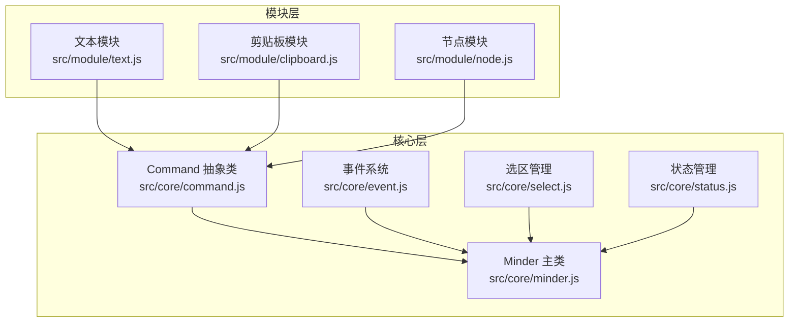
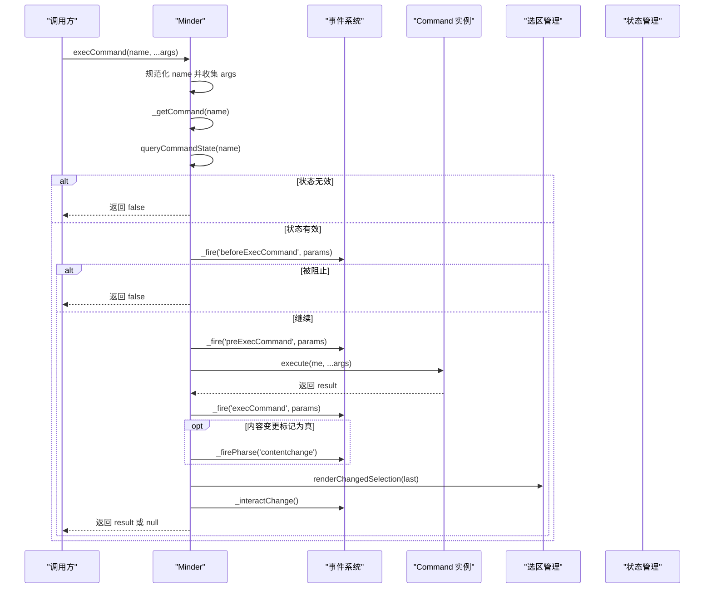
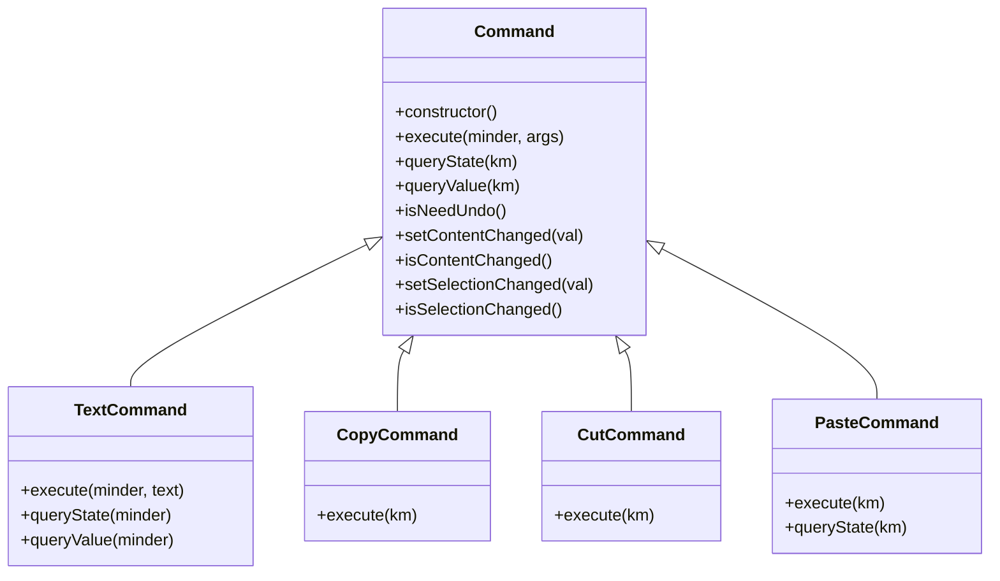
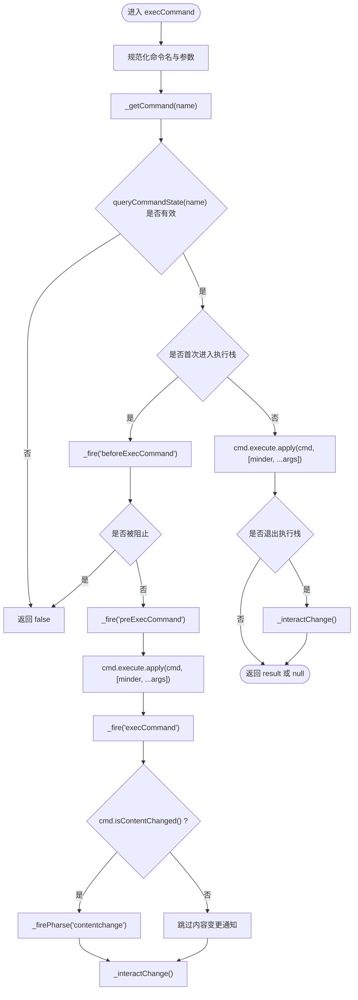
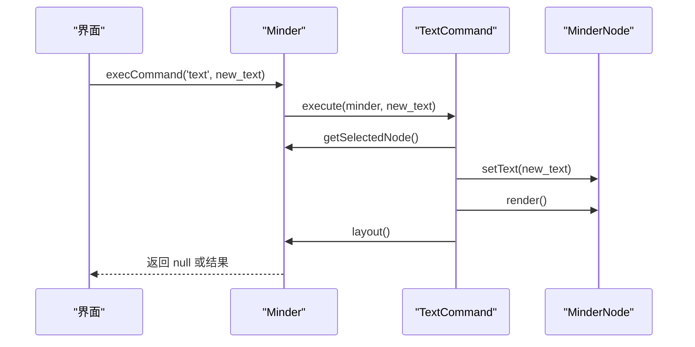
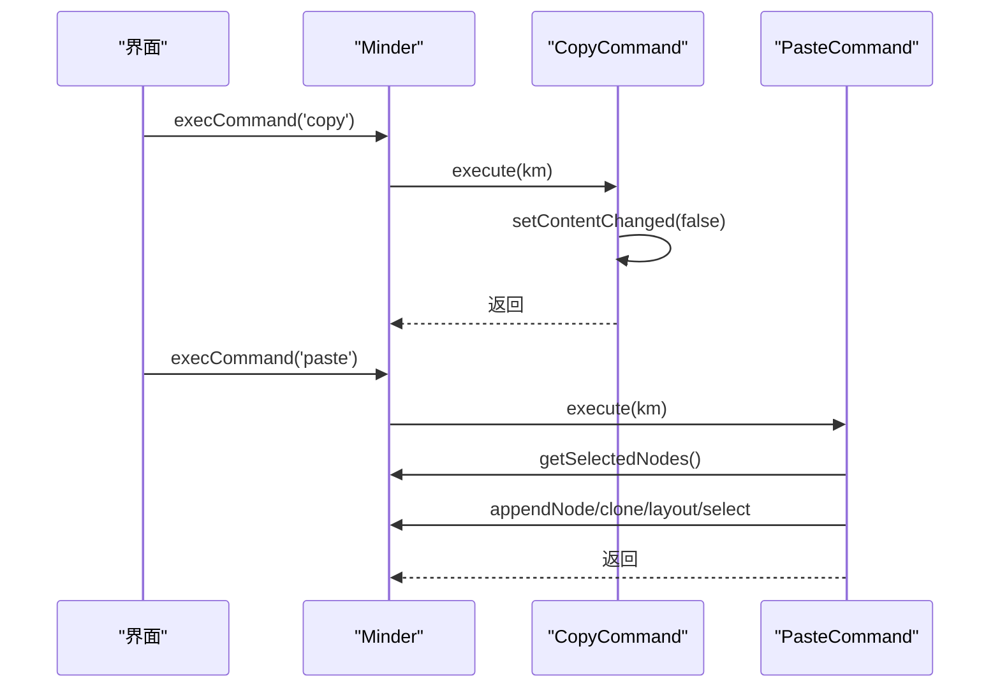
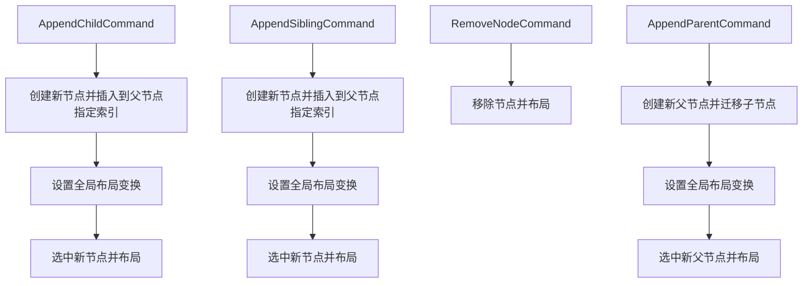
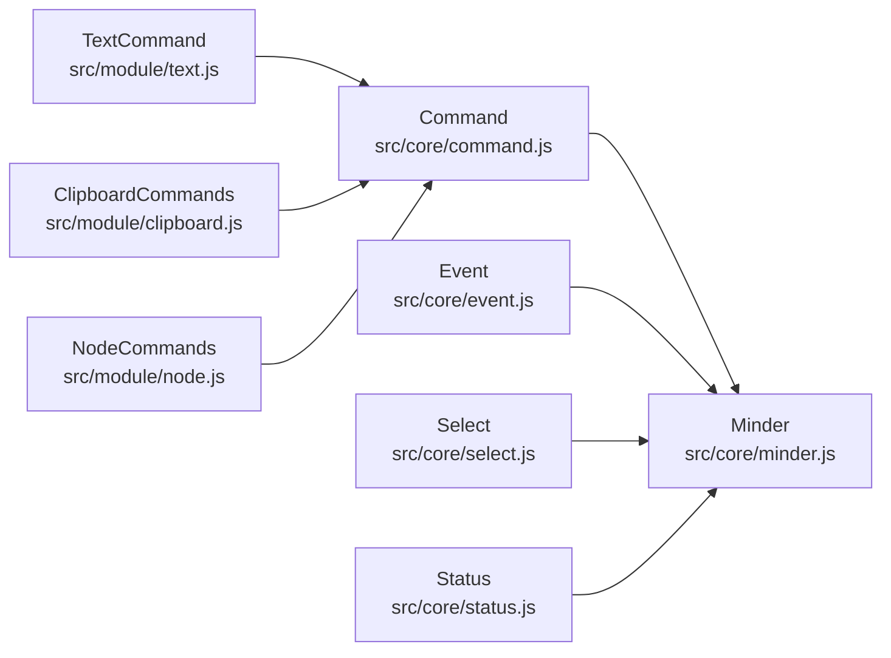

# 命令生命周期与执行机制

<cite>
**本文引用的文件**
- [src/core/command.js](file://src/core/command.js)
- [src/core/minder.js](file://src/core/minder.js)
- [src/core/event.js](file://src/core/event.js)
- [src/core/select.js](file://src/core/select.js)
- [src/core/status.js](file://src/core/status.js)
- [src/module/text.js](file://src/module/text.js)
- [src/module/clipboard.js](file://src/module/clipboard.js)
- [src/module/node.js](file://src/module/node.js)
- [doc/Architecture.md](file://doc/Architecture.md)
</cite>

## 目录
1. [引言](#引言)
2. [项目结构](#项目结构)
3. [核心组件](#核心组件)
4. [架构总览](#架构总览)
5. [详细组件分析](#详细组件分析)
6. [依赖关系分析](#依赖关系分析)
7. [性能考量](#性能考量)
8. [故障排查指南](#故障排查指南)
9. [结论](#结论)

## 引言
本文件围绕 Command 类的完整生命周期展开，系统梳理从创建、状态查询、执行到撤销的全过程，重点解析 Minder.execCommand 的执行流程、事件触发机制（beforeExecCommand、preExecCommand、execCommand）、命令返回值处理逻辑，以及如何通过 setContentChanged 和 setSelectionChanged 控制内容与选区变更标记。同时结合文本命令与剪贴板命令的实际示例，说明命令执行链路与异常处理策略。

## 项目结构
本仓库采用“核心层 + 模块层”的分层组织方式：
- 核心层（src/core）：提供基础能力，如命令抽象、事件系统、Minder 主类、选区管理、状态管理等。
- 模块层（src/module）：按功能拆分模块，每个模块注册命令、渲染器与快捷键等。
- 文档（doc）：包含架构说明与事件触发时机等文档。

图表来源
- [src/core/command.js](file://src/core/command.js#L1-L169)
- [src/core/minder.js](file://src/core/minder.js#L1-L41)
- [src/core/event.js](file://src/core/event.js#L1-L270)
- [src/core/select.js](file://src/core/select.js#L1-L79)
- [src/core/status.js](file://src/core/status.js#L1-L60)
- [src/module/text.js](file://src/module/text.js#L1-L289)
- [src/module/clipboard.js](file://src/module/clipboard.js#L1-L172)
- [src/module/node.js](file://src/module/node.js#L108-L150)

章节来源
- [src/core/command.js](file://src/core/command.js#L1-L169)
- [src/core/minder.js](file://src/core/minder.js#L1-L41)
- [src/core/event.js](file://src/core/event.js#L1-L270)
- [src/core/select.js](file://src/core/select.js#L1-L79)
- [src/core/status.js](file://src/core/status.js#L1-L60)
- [src/module/text.js](file://src/module/text.js#L1-L289)
- [src/module/clipboard.js](file://src/module/clipboard.js#L1-L172)
- [src/module/node.js](file://src/module/node.js#L108-L150)

## 核心组件
- Command 抽象类：定义命令的基本接口（execute/queryState/queryValue/isNeedUndo），并提供内容/选区变更标记控制方法。
- Minder.execCommand：统一的命令入口，负责参数预处理、状态校验、事件触发、命令执行与后续通知。
- 事件系统：提供 beforeExecCommand、preExecCommand、execCommand、contentchange、selectionchange、interactchange 等事件。
- 选区管理：维护当前选区，变更时触发 selectionchange 并联动交互事件。
- 状态管理：维护运行状态，用于事件回调过滤与调试输出。

章节来源
- [src/core/command.js](file://src/core/command.js#L1-L169)
- [src/core/minder.js](file://src/core/minder.js#L1-L41)
- [src/core/event.js](file://src/core/event.js#L1-L270)
- [src/core/select.js](file://src/core/select.js#L1-L79)
- [src/core/status.js](file://src/core/status.js#L1-L60)

## 架构总览
命令执行链路由 Minder.execCommand 统一调度，贯穿事件触发与变更通知，最终驱动模块命令完成业务操作。

图表来源
- [src/core/minder.js](file://src/core/minder.js#L1-L41)
- [src/core/command.js](file://src/core/command.js#L120-L169)
- [src/core/event.js](file://src/core/event.js#L162-L231)
- [src/core/select.js](file://src/core/select.js#L1-L79)

## 详细组件分析

### Command 抽象类与生命周期
- 创建阶段：构造函数初始化内容变更标记为真，选区变更标记为假。
- 状态查询：queryState 默认返回可用态；各模块命令可覆盖以实现动态状态判断。
- 值查询：queryValue 默认返回 0；用于返回命令当前值（如文本命令返回节点文本）。
- 执行阶段：execute 为抽象方法，必须由具体命令实现；可通过 setContentChanged/setSelectionChanged 控制变更标记。
- 撤销标记：isNeedUndo 默认返回真，用于历史栈管理（与撤销/重做机制配合）。

图表来源
- [src/core/command.js](file://src/core/command.js#L1-L169)
- [src/module/text.js](file://src/module/text.js#L245-L262)
- [src/module/clipboard.js](file://src/module/clipboard.js#L54-L123)

章节来源
- [src/core/command.js](file://src/core/command.js#L1-L169)
- [src/module/text.js](file://src/module/text.js#L245-L262)
- [src/module/clipboard.js](file://src/module/clipboard.js#L54-L123)

### Minder.execCommand 执行流程
- 参数处理：规范化命令名（小写），收集剩余参数。
- 命令获取与状态校验：通过内部命令表获取命令并调用 queryCommandState 校验有效性。
- 事件触发：
  - beforeExecCommand：可阻止后续执行。
  - preExecCommand：允许模块预处理。
  - execCommand：实际执行命令。
- 结果处理：返回命令返回值，若未定义则返回 null。
- 变更通知：
  - contentchange：当命令标记内容变更时触发。
  - selectionchange：由选区管理在渲染差异后触发。
  - interactchange：延迟触发，用于统一交互反馈。

图表来源
- [src/core/command.js](file://src/core/command.js#L120-L169)
- [src/core/event.js](file://src/core/event.js#L162-L231)
- [src/core/select.js](file://src/core/select.js#L1-L79)

章节来源
- [src/core/command.js](file://src/core/command.js#L120-L169)
- [src/core/event.js](file://src/core/event.js#L162-L231)
- [src/core/select.js](file://src/core/select.js#L1-L79)

### 事件触发机制详解
- beforeExecCommand：可阻止后续执行；适合做权限校验或前置检查。
- preExecCommand：允许模块预处理（如准备数据、计算布局）。
- execCommand：实际执行命令；模块在此阶段修改模型与视图。
- contentchange：在顶级命令结束后，若命令标记内容变更则触发。
- selectionchange：由选区管理在渲染差异后触发，用于更新 UI 与状态。
- interactchange：统一的交互反馈事件，用于刷新 UI、触发监听器等。

章节来源
- [src/core/command.js](file://src/core/command.js#L120-L169)
- [src/core/event.js](file://src/core/event.js#L162-L231)
- [src/core/select.js](file://src/core/select.js#L1-L79)
- [doc/Architecture.md](file://doc/Architecture.md#L414-L438)

### 内容与选区变更标记
- setContentChanged：控制是否触发 contentchange 事件。典型场景如复制命令不改变内容，应显式关闭。
- setSelectionChanged：当前实现存在逻辑错误，isSelectionChanged 返回的是内容变更标记而非自身标记。建议在自定义命令中直接使用 isContentChanged 判断或修正逻辑。
- 选区变更：选区管理在渲染差异后触发 selectionchange，并调用 _interactChange 进行统一交互反馈。

章节来源
- [src/core/command.js](file://src/core/command.js#L25-L39)
- [src/core/select.js](file://src/core/select.js#L1-L79)
- [src/core/event.js](file://src/core/event.js#L184-L192)

### 典型命令示例与调用链

#### 文本命令（TextCommand）
- 执行：设置当前选中节点文本，渲染并布局。
- 状态：仅在单选节点时可用。
- 值：返回当前节点文本。

图表来源
- [src/module/text.js](file://src/module/text.js#L245-L262)
- [src/core/command.js](file://src/core/command.js#L120-L169)

章节来源
- [src/module/text.js](file://src/module/text.js#L245-L262)

#### 剪贴板命令（Copy/Cut/Paste）
- Copy：复制祖先节点集合至剪贴板，显式关闭内容变更标记。
- Cut：复制祖先节点集合至剪贴板，删除原节点并布局。
- Paste：在当前选中节点下粘贴复制的节点树，重新选择新插入节点并布局。

图表来源
- [src/module/clipboard.js](file://src/module/clipboard.js#L54-L123)
- [src/core/command.js](file://src/core/command.js#L120-L169)

章节来源
- [src/module/clipboard.js](file://src/module/clipboard.js#L54-L123)

### 节点操作命令（AppendChildNode/AppendSiblingNode/RemoveNode/AppendParentNode）
- AppendChildCommand：在共同父节点下插入新子节点，选中新节点并布局。
- AppendSiblingCommand：在共同父节点下插入新兄弟节点，选中新节点并布局。
- RemoveNodeCommand：移除选中节点，布局调整。
- AppendParentCommand：提升为父节点，选中新父节点并布局。

图表来源
- [src/module/node.js](file://src/module/node.js#L108-L150)

章节来源
- [src/module/node.js](file://src/module/node.js#L108-L150)

## 依赖关系分析
- Command 依赖 Minder、MinderNode、MinderEvent，提供统一的命令接口。
- Minder 依赖 Command、Event、Select、Status，作为命令调度中心。
- 各模块命令依赖 Command 抽象类，实现具体业务逻辑。
- 事件系统贯穿命令执行前后，形成松耦合的通知机制。

图表来源
- [src/core/command.js](file://src/core/command.js#L1-L169)
- [src/core/minder.js](file://src/core/minder.js#L1-L41)
- [src/core/event.js](file://src/core/event.js#L1-L270)
- [src/core/select.js](file://src/core/select.js#L1-L79)
- [src/core/status.js](file://src/core/status.js#L1-L60)
- [src/module/text.js](file://src/module/text.js#L245-L262)
- [src/module/clipboard.js](file://src/module/clipboard.js#L54-L123)
- [src/module/node.js](file://src/module/node.js#L108-L150)

章节来源
- [src/core/command.js](file://src/core/command.js#L1-L169)
- [src/core/minder.js](file://src/core/minder.js#L1-L41)
- [src/core/event.js](file://src/core/event.js#L1-L270)
- [src/core/select.js](file://src/core/select.js#L1-L79)
- [src/core/status.js](file://src/core/status.js#L1-L60)
- [src/module/text.js](file://src/module/text.js#L245-L262)
- [src/module/clipboard.js](file://src/module/clipboard.js#L54-L123)
- [src/module/node.js](file://src/module/node.js#L108-L150)

## 性能考量
- 事件触发与交互反馈：_interactChange 使用定时器进行去抖，避免频繁交互事件导致的性能问题。
- 布局与渲染：命令执行后通常调用布局与渲染，应尽量合并多次操作，减少重复布局。
- 选区变更：选区差异计算后统一触发 selectionchange，避免逐节点渲染带来的开销。

章节来源
- [src/core/event.js](file://src/core/event.js#L184-L192)
- [src/core/select.js](file://src/core/select.js#L1-L79)

## 故障排查指南
- 命令未生效
  - 检查命令状态：确认 queryCommandState 返回有效值。
  - 检查事件拦截：beforeExecCommand 是否被阻止。
  - 检查参数传递：确保传入 minder 实例与必要参数。
- 内容变更未触发
  - 确认命令是否调用 setContentChanged(true)；复制命令应为 false。
- 选区变更未触发
  - 确认选区确实发生变化并调用 renderChangedSelection。
- 交互反馈缺失
  - 确认 _interactChange 是否被调用，或等待去抖时间结束。

章节来源
- [src/core/command.js](file://src/core/command.js#L120-L169)
- [src/core/event.js](file://src/core/event.js#L184-L192)
- [src/core/select.js](file://src/core/select.js#L1-L79)
- [doc/Architecture.md](file://doc/Architecture.md#L414-L438)

## 结论
Command 抽象类与 Minder.execCommand 构成了 KityMinder 的命令执行中枢。通过 beforeExecCommand、preExecCommand、execCommand 三段式事件，实现了强大的可扩展性与可控性。配合 setContentChanged 与 setSelectionChanged 的变更标记，能够精确控制 contentchange、selectionchange 与交互反馈事件的触发。模块命令（如文本、剪贴板、节点操作）均遵循同一执行链路，在保证一致性的同时提供了灵活的业务实现空间。