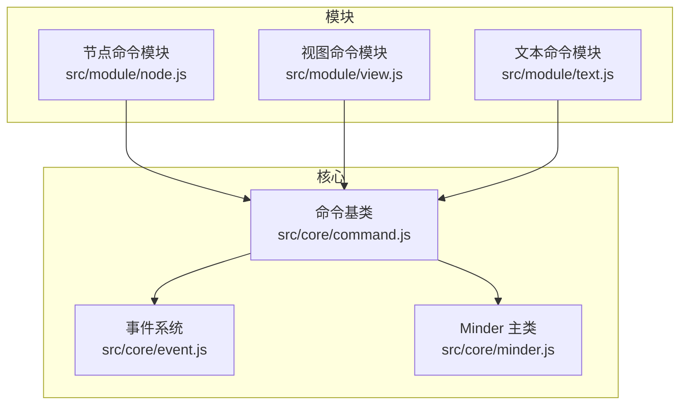
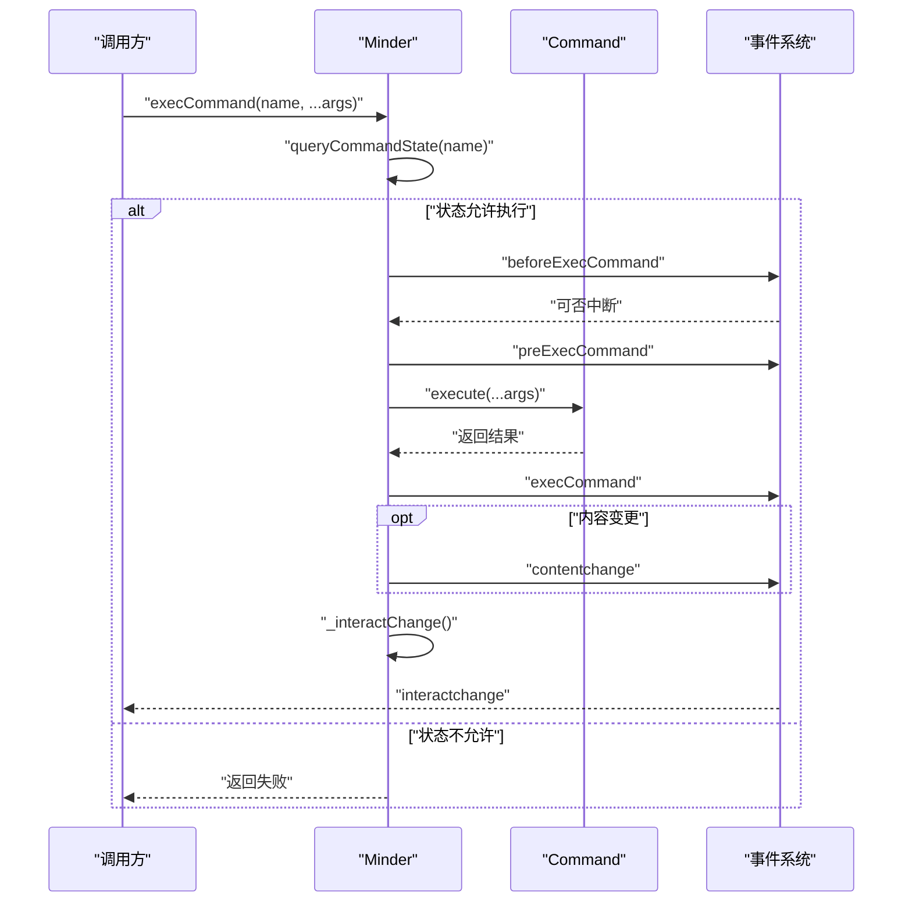
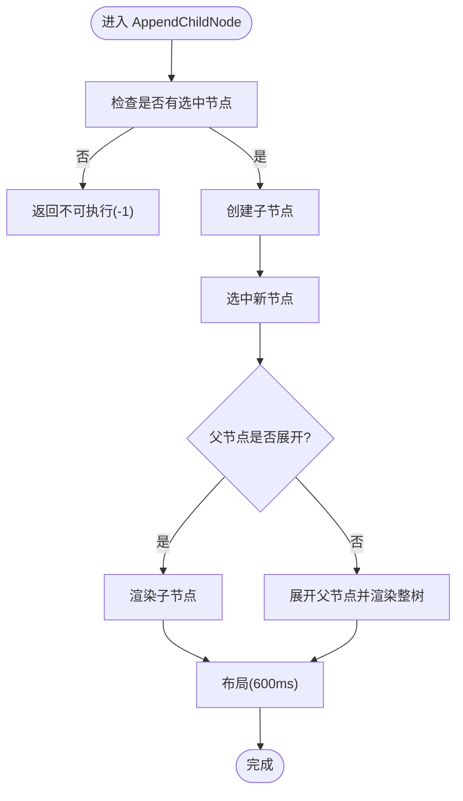
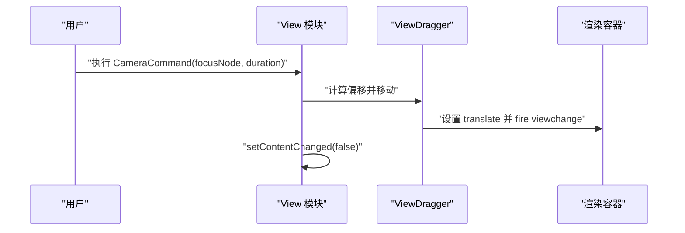
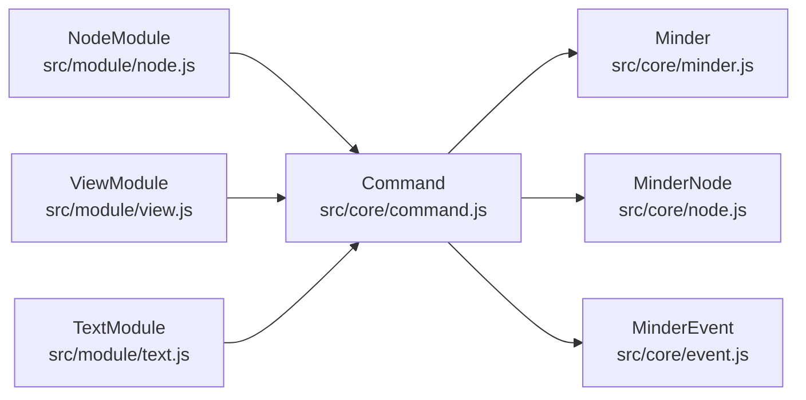

# 自定义命令开发

<cite>
**本文引用的文件**
- [Architecture.md](file://doc/Architecture.md)
- [command.js](file://src/core/command.js)
- [node.js](file://src/module/node.js)
- [view.js](file://src/module/view.js)
- [text.js](file://src/module/text.js)
- [event.js](file://src/core/event.js)
- [minder.js](file://src/core/minder.js)
</cite>

## 目录
1. [引言](#引言)
2. [项目结构](#项目结构)
3. [核心组件](#核心组件)
4. [架构总览](#架构总览)
5. [详细组件分析](#详细组件分析)
6. [依赖分析](#依赖分析)
7. [性能考量](#性能考量)
8. [故障排查指南](#故障排查指南)
9. [结论](#结论)
10. [附录](#附录)

## 引言
本篇文档面向有经验的开发者，系统讲解如何基于命令基类开发可撤销的操作命令。我们将围绕命令的执行与撤销、状态查询、值查询、内容与选区变更标记等关键能力，结合仓库中的真实实现，给出可复用的开发模式与最佳实践，并讨论命令执行链、嵌套命令与性能优化等高级话题。

## 项目结构
本项目采用模块化架构，命令系统位于核心层，模块层提供节点操作、视图控制、文本编辑等具体命令实现。命令的生命周期与事件流贯穿核心与模块，形成清晰的职责边界。

图表来源
- [command.js](file://src/core/command.js#L1-L169)
- [event.js](file://src/core/event.js#L1-L270)
- [node.js](file://src/module/node.js#L1-L150)
- [view.js](file://src/module/view.js#L1-L397)
- [text.js](file://src/module/text.js#L1-L289)

章节来源
- [Architecture.md](file://doc/Architecture.md#L140-L250)

## 核心组件
- 命令基类：定义命令的执行、撤销、状态查询、值查询与变更标记等通用能力。
- Minder：封装命令注册、查询、执行与事件分发，负责触发内容变更与交互变更事件。
- 模块：以模块形式注册命令，提供节点、视图、文本等具体命令实现。

章节来源
- [command.js](file://src/core/command.js#L1-L169)
- [minder.js](file://src/core/minder.js#L1-L41)

## 架构总览
命令系统遵循“模块注册命令 -> Minder 执行命令 -> 触发事件 -> 更新状态”的流程。命令的 queryState 与 queryValue 为 UI 与快捷键提供状态反馈；setContentChanged 与 setSelectionChanged 影响内容变更与选区变更事件的触发。

图表来源
- [command.js](file://src/core/command.js#L87-L166)
- [event.js](file://src/core/event.js#L162-L231)

章节来源
- [command.js](file://src/core/command.js#L87-L166)
- [event.js](file://src/core/event.js#L162-L231)

## 详细组件分析

### 命令基类与执行机制
- 继承关系：命令类继承自命令基类，必须实现 execute 方法；revert 可选。
- 状态查询：
  - queryState 返回 -1（不可执行）、0（可执行）、1（已执行）。默认返回 0。
  - queryCommandState 将 -1 视为不可执行，0/1 视为可执行。
- 值查询：queryValue 返回命令相关值（如进度百分比、当前文本等），默认返回 0。
- 变更标记：
  - setContentChanged(true/false) 控制是否触发 contentchange 事件。
  - setSelectionChanged(true/false) 用于标记选区变更，但当前实现中 isSelectionChanged 返回的是内容变更标志位，存在潜在不一致风险。
- 撤销能力：isNeedUndo 默认返回 true，用于控制是否纳入撤销链。

章节来源
- [command.js](file://src/core/command.js#L1-L169)

### 状态查询语义与应用场景
- -1：命令不可执行（如无选中节点、根节点等前置条件不满足）。
- 0：命令可执行（默认状态，UI 可启用，快捷键可触发）。
- 1：命令当前可用且已执行（用于 UI 状态反馈，如“已激活”）。

章节来源
- [command.js](file://src/core/command.js#L87-L106)
- [Architecture.md](file://doc/Architecture.md#L177-L196)

### 值查询的应用场景
- queryValue 用于向 UI 或快捷键提供当前命令的“值”，如：
  - 文本命令返回当前节点文本，用于输入框回显。
  - 进度命令返回进度百分比，用于进度条显示。

章节来源
- [text.js](file://src/module/text.js#L254-L262)
- [Architecture.md](file://doc/Architecture.md#L186-L189)

### 内容与选区变更标记
- setContentChanged(true/false)：决定是否触发 contentchange 事件，从而驱动 UI 与撤销栈管理。
- setSelectionChanged(true/false)：用于标记选区变更，但当前 isSelectionChanged 实现返回内容变更标志位，建议在自定义命令中谨慎使用，避免误判。

章节来源
- [command.js](file://src/core/command.js#L25-L39)

### 命令执行链与事件流
- Minder 在执行命令前后触发一系列事件，包括 beforeExecCommand、preExecCommand、execCommand，以及 contentchange 与 interactchange。
- 事件分发与拦截：事件系统支持阻止传播，确保命令执行前后的钩子可控。

章节来源
- [command.js](file://src/core/command.js#L128-L166)
- [event.js](file://src/core/event.js#L162-L231)

### 节点操作命令（节点增删改）
- 典型命令：
  - AppendChildNode：为选中节点添加子节点。
  - AppendSiblingNode：为选中节点添加兄弟节点。
  - RemoveNode：移除选中节点（支持多选，自动选择回退节点）。
  - AppendParentNode：为多个同父节点创建共同父节点。
- 状态查询：根据是否有选中节点、是否为根节点、是否同父等条件判断可执行性。
- 执行流程：创建/删除节点、更新选区、触发布局与渲染。

图表来源
- [node.js](file://src/module/node.js#L19-L36)
- [node.js](file://src/module/node.js#L43-L69)
- [node.js](file://src/module/node.js#L71-L100)
- [node.js](file://src/module/node.js#L102-L131)

章节来源
- [node.js](file://src/module/node.js#L1-L150)

### 视图控制命令（抓手、相机、平移）
- 典型命令：
  - ToggleHandCommand：切换抓手状态，拖动视野而非创建选区。
  - CameraCommand：将视野中心移动到指定节点，支持动画。
  - MoveCommand：按方向平移视野。
- 状态查询：ToggleHandCommand 根据当前状态返回 0/1。
- 执行要点：通过 ViewDragger 移动渲染容器，设置 setContentChanged(false) 以避免触发内容变更事件。

图表来源
- [view.js](file://src/module/view.js#L180-L231)
- [view.js](file://src/module/view.js#L233-L270)

章节来源
- [view.js](file://src/module/view.js#L1-L397)

### 文本编辑命令（单节点文本修改）
- 典型命令：TextCommand
  - 执行：设置节点文本、渲染、布局。
  - 状态：仅当仅选中一个节点时可执行。
  - 值：返回当前节点文本，可用于 UI 回显。
- 应用场景：输入框绑定 queryValue，实现双向同步。

章节来源
- [text.js](file://src/module/text.js#L245-L262)

### 命令定义结构与模块注册
- 命令类需继承命令基类，至少实现 execute；可选实现 revert、queryState、queryValue。
- 模块通过 Module.register 注册 commands 映射，Minder 通过命令名查找并执行。

章节来源
- [Architecture.md](file://doc/Architecture.md#L149-L200)
- [node.js](file://src/module/node.js#L133-L149)
- [view.js](file://src/module/view.js#L178-L197)
- [text.js](file://src/module/text.js#L278-L286)

## 依赖分析
- 命令基类依赖 Minder、MinderNode、MinderEvent，提供统一的执行与查询接口。
- Minder 依赖事件系统，负责命令执行前后的事件分发与交互变更调度。
- 模块命令依赖核心类与自身渲染器，实现业务逻辑与 UI 更新。

图表来源
- [command.js](file://src/core/command.js#L1-L169)
- [minder.js](file://src/core/minder.js#L1-L41)
- [node.js](file://src/module/node.js#L1-L150)
- [view.js](file://src/module/view.js#L1-L397)
- [text.js](file://src/module/text.js#L1-L289)

章节来源
- [command.js](file://src/core/command.js#L1-L169)
- [minder.js](file://src/core/minder.js#L1-L41)

## 性能考量
- 布局与渲染成本：节点增删改与布局计算通常耗时较高，建议在批量操作时合并布局调用，减少重复渲染。
- 事件稀释：交互变更事件通过定时器进行稀释，避免高频事件风暴。
- 动画时长：视图平移与相机定位支持动画时长参数，合理设置可平衡流畅度与性能。
- 变更标记：仅在必要时触发 contentchange，避免不必要的 UI 更新。

章节来源
- [node.js](file://src/module/node.js#L21-L36)
- [view.js](file://src/module/view.js#L245-L269)
- [event.js](file://src/core/event.js#L184-L192)

## 故障排查指南
- 命令未执行
  - 检查 queryState 是否返回 -1；若返回 1，确认是否期望“已执行”状态。
  - 确认命令名大小写与模块注册一致。
- 无法撤销
  - 若命令不需要撤销，isNeedUndo 返回 false；否则检查撤销链管理逻辑。
- 选区或内容未更新
  - 检查 setContentChanged 与 setSelectionChanged 的使用是否正确。
  - 注意 isSelectionChanged 当前实现返回内容变更标志位，可能导致误判。
- 事件未触发
  - 确认 beforeExecCommand/preExecCommand/execCommand 的事件监听是否正确绑定。
  - 检查事件是否被中途阻止传播。

章节来源
- [command.js](file://src/core/command.js#L25-L39)
- [command.js](file://src/core/command.js#L87-L166)
- [event.js](file://src/core/event.js#L162-L231)

## 结论
通过命令基类提供的统一接口与 Minder 的事件机制，开发者可以快速构建可撤销、可查询、可扩展的命令体系。在实际开发中，应重视状态查询与值查询的语义一致性，合理使用变更标记，避免不必要的事件与渲染开销，并在模块中规范注册命令，确保命令生命周期与 UI 行为一致。

## 附录
- 命令开发清单
  - 必填：execute(minder, ...args)
  - 可选：revert(minder)、queryState(minder)、queryValue(minder)
  - 变更标记：setContentChanged(bool)、setSelectionChanged(bool)
  - 模块注册：Module.register(..., { commands: { name: CommandClass } })

章节来源
- [Architecture.md](file://doc/Architecture.md#L149-L200)
- [command.js](file://src/core/command.js#L1-L169)