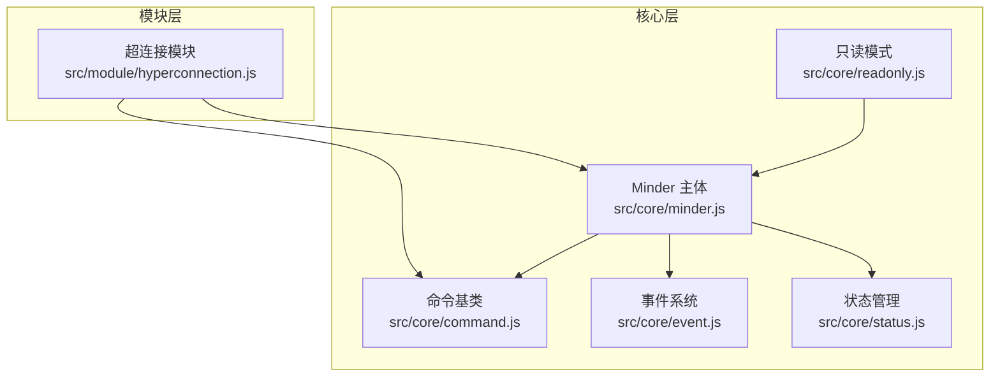
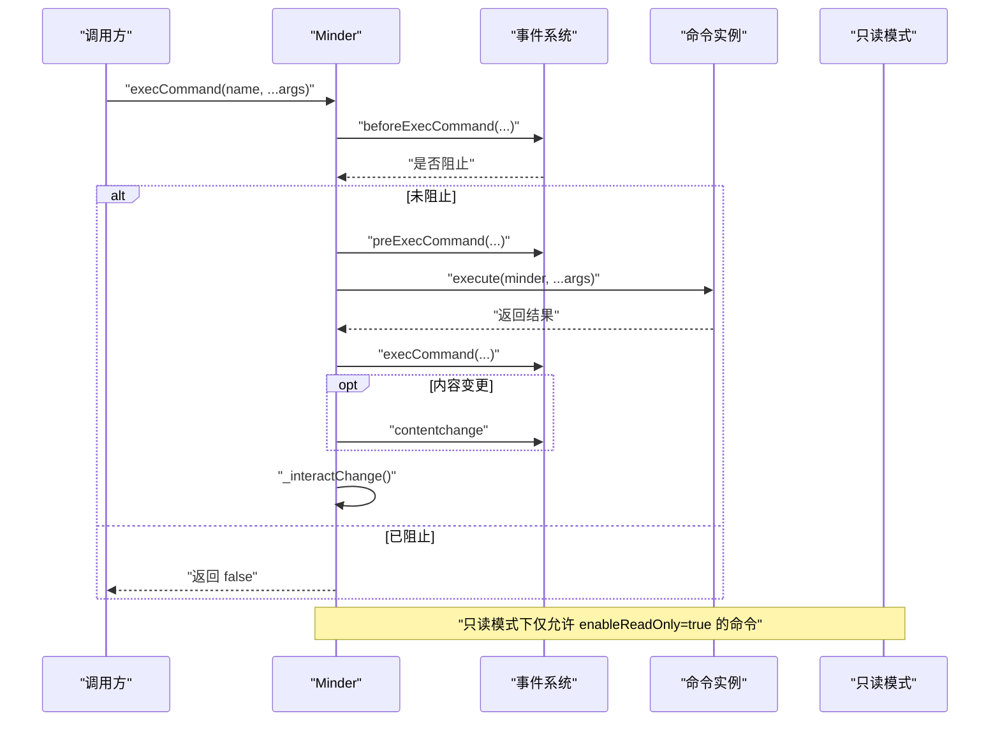
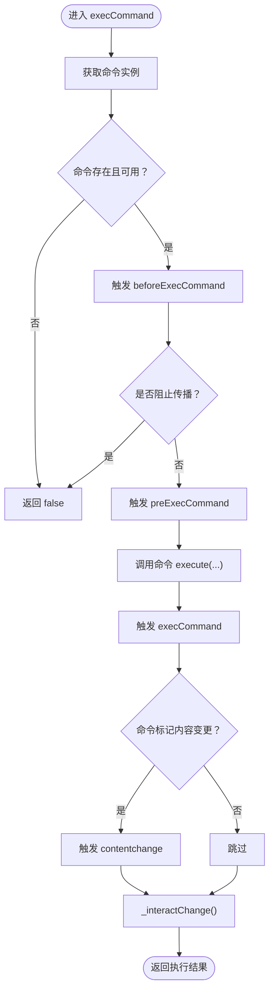
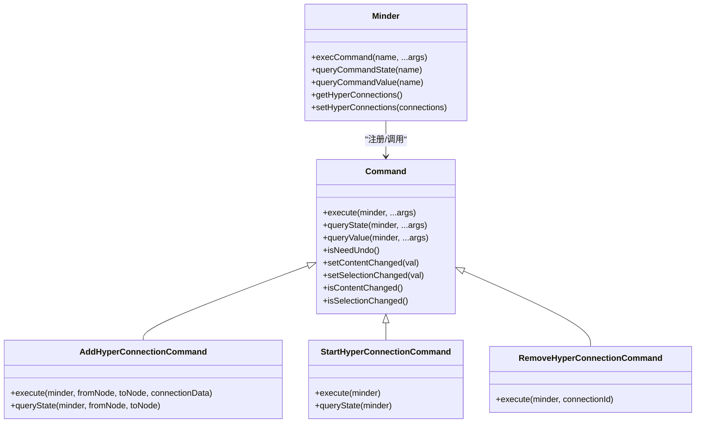
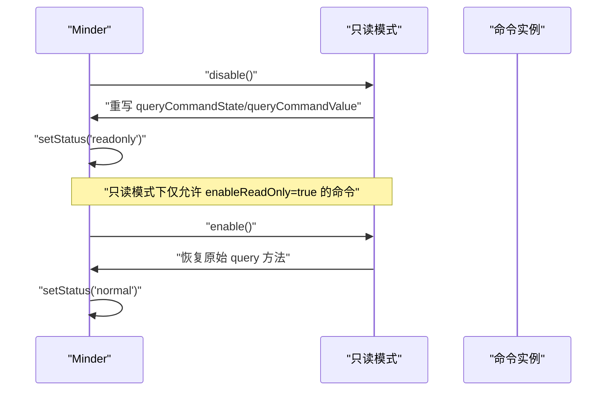
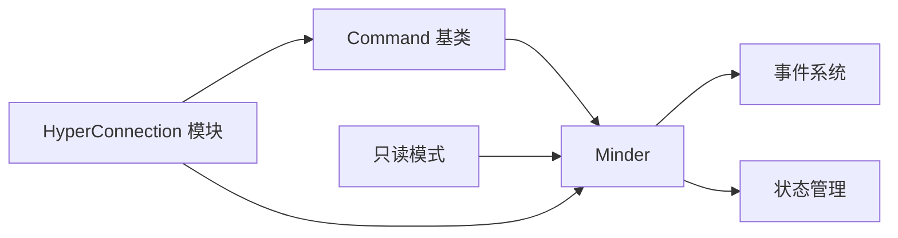

# 高级命令模式

<cite>
**本文引用的文件**
- [src/core/command.js](file://src/core/command.js)
- [src/core/readonly.js](file://src/core/readonly.js)
- [src/core/event.js](file://src/core/event.js)
- [src/core/status.js](file://src/core/status.js)
- [src/module/hyperconnection.js](file://src/module/hyperconnection.js)
- [src/core/minder.js](file://src/core/minder.js)
</cite>

## 目录
1. [简介](#简介)
2. [项目结构](#项目结构)
3. [核心组件](#核心组件)
4. [架构总览](#架构总览)
5. [详细组件分析](#详细组件分析)
6. [依赖关系分析](#依赖关系分析)
7. [性能考量](#性能考量)
8. [故障排查指南](#故障排查指南)
9. [结论](#结论)
10. [附录](#附录)

## 简介
本文件围绕命令系统进行深入解析，重点探讨以下高级应用模式：
- 参数化命令：以 AddHyperConnectionCommand 为例，展示如何设计支持多参数（fromNode、toNode、connectionData）的复杂命令。
- 复合命令与嵌套执行：如何通过命令组合、状态机与事件驱动实现“开始-拖拽-落点确认”的复合流程。
- 条件执行与只读模式控制：详解 enableReadOnly 属性在只读模式下对命令执行的限制机制。
- 撤销栈与 isNeedUndo：解释 isNeedUndo 属性在无需加入撤销栈的特殊操作中的应用。
- 事务与批量处理：在大型应用中如何组织命令执行，确保一致性与性能。
- 性能优化：在大规模节点与连线场景下的最佳实践。

## 项目结构
命令系统位于核心层，模块层通过注册命令扩展功能；只读模式与状态管理在核心层提供支持；事件系统贯穿命令生命周期。

图表来源
- [src/core/command.js](file://src/core/command.js#L1-L169)
- [src/core/readonly.js](file://src/core/readonly.js#L1-L63)
- [src/core/event.js](file://src/core/event.js#L1-L270)
- [src/core/status.js](file://src/core/status.js#L1-L60)
- [src/module/hyperconnection.js](file://src/module/hyperconnection.js#L1-L975)
- [src/core/minder.js](file://src/core/minder.js#L1-L41)

章节来源
- [src/core/command.js](file://src/core/command.js#L1-L169)
- [src/module/hyperconnection.js](file://src/module/hyperconnection.js#L1-L975)

## 核心组件
- 命令基类 Command：定义命令的执行接口、状态查询、值查询与撤销需求标记。
- Minder.execCommand：统一的命令入口，负责事件分发、状态校验与变更通知。
- 只读模式 readonly：通过劫持 queryCommandState/queryCommandValue 实现对命令的有条件放行。
- 事件系统：beforeExecCommand、preExecCommand、execCommand、contentchange 等事件贯穿命令生命周期。
- 状态管理：normal/readonly 状态切换，配合只读模式控制命令可用性。
- 超连接模块 HyperConnection：提供 Start/Add/Remove 三类命令，演示参数化与复合流程。

章节来源
- [src/core/command.js](file://src/core/command.js#L1-L169)
- [src/core/readonly.js](file://src/core/readonly.js#L1-L63)
- [src/core/event.js](file://src/core/event.js#L1-L270)
- [src/core/status.js](file://src/core/status.js#L1-L60)
- [src/module/hyperconnection.js](file://src/module/hyperconnection.js#L1-L975)

## 架构总览
命令系统采用“命令基类 + 模块注册 + 事件驱动 + 状态控制”的架构。命令在执行前会触发 before/pre/exec 事件链，并根据 isContentChanged 触发 contentchange 通知；只读模式通过 enableReadOnly 属性决定命令是否被允许执行。

图表来源
- [src/core/command.js](file://src/core/command.js#L118-L166)
- [src/core/event.js](file://src/core/event.js#L162-L182)
- [src/core/readonly.js](file://src/core/readonly.js#L23-L41)

## 详细组件分析

### 命令基类与执行流程
- 命令接口
  - execute(minder, ...args)：必须实现的执行逻辑。
  - queryState(minder, ...args)：返回命令可用性状态（-1 禁用，0 可用，1 已激活）。
  - queryValue(minder, ...args)：返回命令当前值。
  - isNeedUndo()：是否需要加入撤销栈，默认 true。
  - setContentChanged/setSelectionChanged/isContentChanged/isSelectionChanged：用于标记是否触发内容变更事件。
- Minder.execCommand
  - 参数透传至命令执行。
  - 先查询命令状态，再按顺序触发 before/pre/exec 事件。
  - 若命令标记内容变更，则触发 contentchange。
  - 最终调用 _interactChange 进行交互式更新。

图表来源
- [src/core/command.js](file://src/core/command.js#L118-L166)
- [src/core/event.js](file://src/core/event.js#L162-L182)

章节来源
- [src/core/command.js](file://src/core/command.js#L1-L169)

### 参数化命令：AddHyperConnectionCommand
- 设计要点
  - 多参数：fromNode、toNode、connectionData。
  - 参数校验：检查节点 ID 是否存在；避免重复连接（双向）。
  - 数据结构：connectionData 支持 text、type、color、strokeWidth、controlPoint1/2 等字段。
  - 执行结果：返回新建连接对象，便于后续联动（如选择、编辑）。
- 复合流程
  - StartHyperConnectionCommand：设置源节点、创建临时连线、进入 hyperconnection 状态。
  - AddHyperConnectionCommand：在拖拽落点时执行，完成连接创建与渲染。
  - RemoveHyperConnectionCommand：删除指定连接并同步渲染。

图表来源
- [src/core/command.js](file://src/core/command.js#L1-L169)
- [src/module/hyperconnection.js](file://src/module/hyperconnection.js#L600-L767)

章节来源
- [src/module/hyperconnection.js](file://src/module/hyperconnection.js#L600-L767)

### 条件执行与只读模式控制
- enableReadOnly 属性
  - 只读模式下，Minder.disable 劫持 queryCommandState/queryCommandValue，仅当命令实例声明 enableReadOnly 时才允许查询状态与值。
  - 该属性通常由允许在只读模式下运行的命令实现，例如只读查询、展示型命令。
- 状态流转
  - normal/readonly 状态切换受状态管理控制；readonly 下除非 force，否则无法回退到非只读状态。

图表来源
- [src/core/readonly.js](file://src/core/readonly.js#L23-L61)
- [src/core/status.js](file://src/core/status.js#L28-L47)

章节来源
- [src/core/readonly.js](file://src/core/readonly.js#L1-L63)
- [src/core/status.js](file://src/core/status.js#L1-L60)

### 撤销栈与 isNeedUndo
- 默认行为：isNeedUndo() 返回 true，表示命令应纳入撤销栈。
- 特殊场景：对于不需要记录到撤销历史的操作（如仅刷新视图、无持久化副作用），可在命令中覆盖 isNeedUndo(false)，从而避免占用撤销栈空间。
- 注意事项：若命令涉及内容变更（isContentChanged），仍会触发 contentchange 事件，但是否入栈由 isNeedUndo 决定。

章节来源
- [src/core/command.js](file://src/core/command.js#L41-L51)

### 复合命令与嵌套执行
- 复合命令示例：StartHyperConnection -> AddHyperConnection
  - StartHyperConnection：设置源节点、创建临时连线、进入 hyperconnection 状态。
  - AddHyperConnection：在拖拽落点时执行，创建连接并渲染。
- 嵌套执行：Minder.execCommand 内部维护 _hasEnterExecCommand 防止递归触发交互更新。
- 事务处理建议：
  - 将多个命令封装为一个复合命令，先执行前置校验，再批量提交，最后统一触发 contentchange。
  - 对于可能失败的批量操作，采用“先试后提交”策略，失败时回滚已执行的部分。

章节来源
- [src/module/hyperconnection.js](file://src/module/hyperconnection.js#L570-L671)
- [src/core/command.js](file://src/core/command.js#L118-L166)

## 依赖关系分析
- 命令基类与 Minder：命令通过 Minder.execCommand 统一入口执行，依赖事件系统与状态管理。
- 只读模式与命令：只读模式通过劫持查询方法，结合命令的 enableReadOnly 属性实现条件放行。
- 模块与命令：模块通过 Module.register 注册命令，HyperConnection 提供三类命令以支撑复杂交互。

图表来源
- [src/core/command.js](file://src/core/command.js#L1-L169)
- [src/core/readonly.js](file://src/core/readonly.js#L1-L63)
- [src/core/event.js](file://src/core/event.js#L1-L270)
- [src/core/status.js](file://src/core/status.js#L1-L60)
- [src/module/hyperconnection.js](file://src/module/hyperconnection.js#L769-L800)

章节来源
- [src/core/command.js](file://src/core/command.js#L1-L169)
- [src/core/readonly.js](file://src/core/readonly.js#L1-L63)
- [src/module/hyperconnection.js](file://src/module/hyperconnection.js#L769-L800)

## 性能考量
- 大规模节点/连线场景
  - 合理使用 isContentChanged：仅在真正改变数据时标记内容变更，减少 contentchange 事件风暴。
  - 批量更新：对频繁更新的场景（如拖拽控制点），采用节流/防抖策略，合并多次更新为一次渲染。
  - 渲染隔离：将超连接渲染置于独立容器中，避免与主节点渲染相互干扰。
- 事件与状态
  - 避免在事件回调中进行重型计算；必要时延迟执行或拆分为异步任务。
  - 使用状态机（如 hyperconnection 状态）隔离交互流程，降低全局状态污染。
- 撤销栈
  - 对高频操作（如鼠标移动）避免入栈，减少内存占用与回溯成本。
  - 对批量操作，尽量一次性提交，减少撤销条目数量。

[本节为通用性能建议，不直接分析具体文件]

## 故障排查指南
- 命令未执行
  - 检查命令状态：queryCommandState 返回 -1 表示不可用。
  - 检查只读模式：若处于只读且命令未声明 enableReadOnly，则会被拒绝。
- 执行后无变更
  - 确认命令是否标记内容变更（isContentChanged），否则不会触发 contentchange。
- 事件未触发
  - 确认 before/pre/exec/contentchange 等事件链是否被阻止传播。
- 复合流程异常
  - StartHyperConnection 未正确设置源节点或状态，导致 AddHyperConnection 无法定位目标。

章节来源
- [src/core/command.js](file://src/core/command.js#L118-L166)
- [src/core/readonly.js](file://src/core/readonly.js#L23-L41)
- [src/core/event.js](file://src/core/event.js#L162-L182)
- [src/module/hyperconnection.js](file://src/module/hyperconnection.js#L570-L671)

## 结论
- 命令系统通过统一入口、事件链与状态控制，提供了强大的扩展能力。
- 参数化命令与复合流程结合，能够优雅地表达复杂交互（如超连接的拖拽创建）。
- 只读模式通过 enableReadOnly 与查询劫持，实现了对命令执行的精细化控制。
- isNeedUndo 为特殊操作提供了灵活的撤销策略，配合批量与节流优化，可在大型应用中保持良好性能。

[本节为总结性内容，不直接分析具体文件]

## 附录
- 关键实现参考路径
  - 命令基类与执行流程：[src/core/command.js](file://src/core/command.js#L1-L169)
  - 只读模式与状态管理：[src/core/readonly.js](file://src/core/readonly.js#L1-L63)、[src/core/status.js](file://src/core/status.js#L1-L60)
  - 事件系统：[src/core/event.js](file://src/core/event.js#L1-L270)
  - 超连接模块（含参数化命令）：[src/module/hyperconnection.js](file://src/module/hyperconnection.js#L570-L767)
  - Minder 主体：[src/core/minder.js](file://src/core/minder.js#L1-L41)