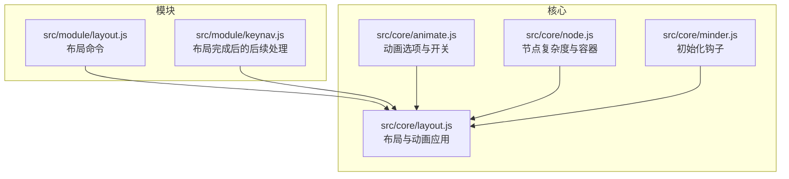
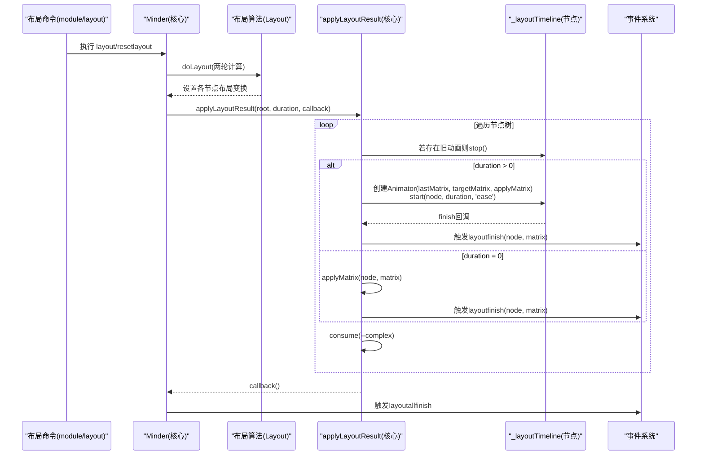
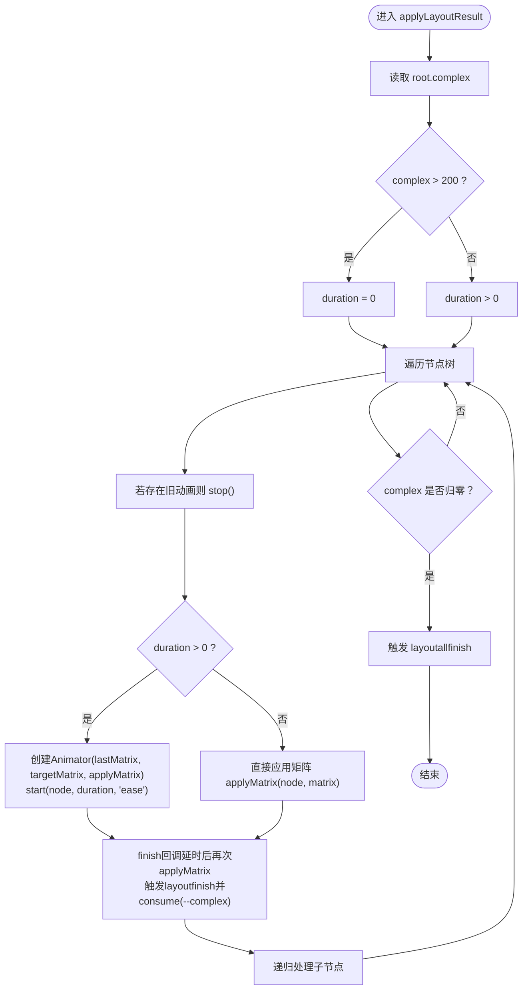
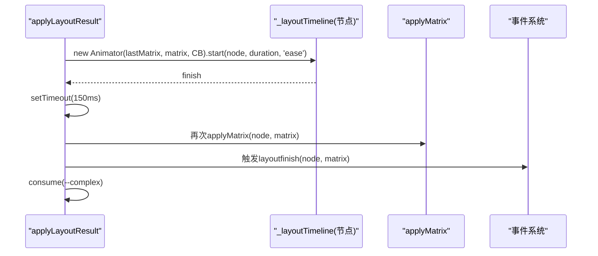
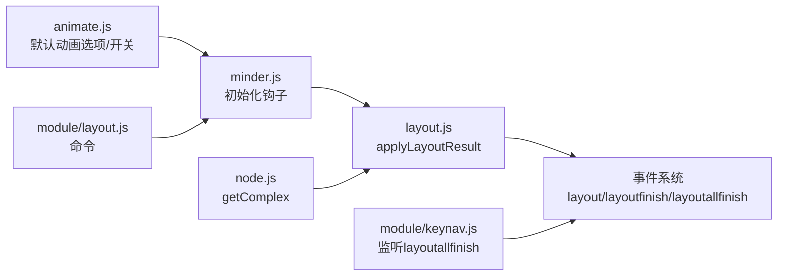

# 布局动画实现机制

<cite>
**本文引用的文件**
- [src/core/layout.js](file://src/core/layout.js)
- [src/core/animate.js](file://src/core/animate.js)
- [src/core/node.js](file://src/core/node.js)
- [src/module/layout.js](file://src/module/layout.js)
- [src/core/minder.js](file://src/core/minder.js)
- [src/module/keynav.js](file://src/module/keynav.js)
</cite>

## 目录
1. [引言](#引言)
2. [项目结构](#项目结构)
3. [核心组件](#核心组件)
4. [架构总览](#架构总览)
5. [详细组件分析](#详细组件分析)
6. [依赖关系分析](#依赖关系分析)
7. [性能考量](#性能考量)
8. [故障排查指南](#故障排查指南)
9. [结论](#结论)
10. [附录](#附录)

## 引言
本文件围绕布局动画机制展开，重点解释以下内容：
- applyLayoutResult 如何依据节点复杂度（complex）决定是否启用动画；当节点数超过阈值时自动关闭动画以保障性能。
- 动画时间线（Timeline）的创建与插值流程，从 lastMatrix 到目标 matrix 的过渡。
- 节点上 _layoutTimeline 的存储与 stop 方法调用时机，避免动画冲突。
- consume 计数器如何确保所有节点动画完成后才触发 layoutallfinish 事件。
- 自定义动画时长（layoutAnimationDuration）与缓动函数（ease）的配置方式。
- 性能优化建议与最佳实践。

## 项目结构
本仓库采用模块化组织，布局动画相关的关键文件集中在 core 与 module 层：
- 核心布局与动画：src/core/layout.js、src/core/animate.js、src/core/node.js
- 布局命令与模块：src/module/layout.js
- 初始化与事件：src/core/minder.js、src/module/keynav.js

图表来源
- [src/core/layout.js](file://src/core/layout.js#L391-L520)
- [src/core/animate.js](file://src/core/animate.js#L1-L43)
- [src/core/node.js](file://src/core/node.js#L98-L107)
- [src/module/layout.js](file://src/module/layout.js#L1-L92)
- [src/core/minder.js](file://src/core/minder.js#L1-L41)
- [src/module/keynav.js](file://src/module/keynav.js#L148-L171)

章节来源
- [src/core/layout.js](file://src/core/layout.js#L391-L520)
- [src/core/animate.js](file://src/core/animate.js#L1-L43)
- [src/core/node.js](file://src/core/node.js#L98-L107)
- [src/module/layout.js](file://src/module/layout.js#L1-L92)
- [src/core/minder.js](file://src/core/minder.js#L1-L41)
- [src/module/keynav.js](file://src/module/keynav.js#L148-L171)

## 核心组件
- 布局与动画应用（Minder.applyLayoutResult）：负责遍历节点树，计算目标矩阵，按需创建动画时间线，维护 consume 计数器，最终触发 layoutallfinish。
- 动画选项（Minder.animate）：提供默认动画选项与全局开关，支持按选项名禁用/启用动画。
- 节点复杂度（MinderNode.getComplex）：统计子树节点数量，作为是否启用动画的阈值判断依据。
- 布局命令（module/layout）：提供 layout 与 resetlayout 命令，驱动布局与刷新。
- 初始化钩子（Minder.registerInitHook）：在实例初始化时注册默认动画选项。

章节来源
- [src/core/layout.js](file://src/core/layout.js#L391-L520)
- [src/core/animate.js](file://src/core/animate.js#L1-L43)
- [src/core/node.js](file://src/core/node.js#L98-L107)
- [src/module/layout.js](file://src/module/layout.js#L1-L92)
- [src/core/minder.js](file://src/core/minder.js#L1-L41)

## 架构总览
下图展示从布局命令到动画应用与事件触发的整体流程。

图表来源
- [src/module/layout.js](file://src/module/layout.js#L1-L92)
- [src/core/layout.js](file://src/core/layout.js#L391-L520)
- [src/module/keynav.js](file://src/module/keynav.js#L148-L171)

## 详细组件分析

### applyLayoutResult：动画决策与执行
- 节点复杂度阈值：通过节点复杂度（子树节点总数）判断是否启用动画。当复杂度超过阈值时，将 duration 设为 0，从而跳过动画，直接应用目标矩阵。
- 目标矩阵计算：基于节点的局部布局变换与父矩阵合并，再叠加布局偏移，得到目标矩阵；并对平移分量进行取整，保证像素对齐。
- 动画冲突处理：若节点已有 _layoutTimeline，则先 stop 并置空，避免多个动画同时作用于同一节点。
- 动画创建与插值：当 duration > 0 时，使用 kity.Animator 以 ease 缓动函数从 lastMatrix 插值到目标 matrix；finish 回调中额外延时以确保渲染稳定后再触发 layoutfinish 与 consume。
- 同步场景下的事件顺序：当无动画时，applyLayoutResult 内部逻辑为同步，为保证外部监听能在 fire 之前注册，使用 setTimeout(0) 延迟触发 layoutallfinish。

图表来源
- [src/core/layout.js](file://src/core/layout.js#L444-L519)

章节来源
- [src/core/layout.js](file://src/core/layout.js#L444-L519)

### 动画时间线（Timeline）与插值
- 时间线创建：在节点上创建 kity.Animator，传入起始矩阵 lastMatrix、目标矩阵 matrix 以及每帧回调 applyMatrix。
- 缓动函数：统一使用 'ease' 缓动函数，使动画更自然流畅。
- 结束回调：finish 事件中，为避免低性能设备丢帧，额外延时一小段时间后再次 applyMatrix，确保最终状态一致，然后触发 layoutfinish 并减少 consume 计数。

图表来源
- [src/core/layout.js](file://src/core/layout.js#L486-L501)

章节来源
- [src/core/layout.js](file://src/core/layout.js#L486-L501)

### _layoutTimeline 的存储与 stop 时机
- 存储位置：每个节点在动画期间将 _layoutTimeline 保存在其自身对象上，便于后续停止或覆盖。
- 停止时机：在创建新动画前，若检测到节点已有 _layoutTimeline，则立即 stop 并清空，防止动画叠加导致状态混乱。
- 递归处理：对每个节点都执行上述检查与停止逻辑，确保整棵树的动画一致性。

章节来源
- [src/core/layout.js](file://src/core/layout.js#L480-L485)

### consume 计数器与 layoutallfinish 触发
- 计数器：在 applyLayoutResult 中定义 consume 函数，每次节点动画完成（无论是否动画）均减少一次计数。
- 完成条件：当计数器归零时，表示所有节点动画均已结束，触发 layoutallfinish。
- 同步场景延迟：当无动画时，内部为同步流程，为保证外部监听能提前注册，使用 setTimeout(0) 延迟触发 layoutallfinish。

章节来源
- [src/core/layout.js](file://src/core/layout.js#L448-L456)
- [src/core/layout.js](file://src/core/layout.js#L424-L433)

### 节点复杂度（complex）与阈值
- 复杂度计算：通过遍历子树统计节点数量，作为动画启用与否的阈值依据。
- 阈值策略：当复杂度超过阈值时，自动关闭动画，避免大规模节点同时动画带来的性能问题。

章节来源
- [src/core/node.js](file://src/core/node.js#L98-L107)
- [src/core/layout.js](file://src/core/layout.js#L448-L459)

### 动画时长与缓动函数配置
- 默认时长：layoutAnimationDuration 默认值由动画模块提供。
- 全局开关：enableAnimation 可整体禁用动画，此时会将所有动画相关选项临时置零。
- 自定义时长：可通过设置 layoutAnimationDuration 改变布局动画时长。
- 缓动函数：动画创建时统一使用 'ease' 缓动函数。

章节来源
- [src/core/animate.js](file://src/core/animate.js#L1-L43)
- [src/core/layout.js](file://src/core/layout.js#L391-L400)
- [src/core/layout.js](file://src/core/layout.js#L488-L490)

### 布局命令与刷新
- 布局命令：提供 layout 与 resetlayout 命令，分别用于设置布局与重置布局。
- 刷新流程：resetlayout 会重置布局偏移并触发布局刷新，随后触发 layoutallfinish 事件。

章节来源
- [src/module/layout.js](file://src/module/layout.js#L1-L92)

### 事件链路与后续处理
- layoutallfinish：在所有节点动画完成后触发，模块可在此事件上做进一步处理（如构建位置网络）。
- layoutfinish：每个节点动画完成后触发，携带 node 与 matrix 信息。

章节来源
- [src/core/layout.js](file://src/core/layout.js#L424-L433)
- [src/core/layout.js](file://src/core/layout.js#L464-L468)
- [src/core/layout.js](file://src/core/layout.js#L494-L498)
- [src/module/keynav.js](file://src/module/keynav.js#L148-L171)

## 依赖关系分析
- 布局模块依赖动画模块提供的默认选项与开关。
- Minder 在初始化阶段注册动画选项，默认启用动画；若用户关闭，则全局禁用。
- applyLayoutResult 依赖节点复杂度与节点矩阵容器，递归遍历并应用动画。
- 事件系统贯穿动画生命周期，从 layout 到 layoutfinish 再到 layoutallfinish。

图表来源
- [src/core/animate.js](file://src/core/animate.js#L1-L43)
- [src/core/minder.js](file://src/core/minder.js#L1-L41)
- [src/core/layout.js](file://src/core/layout.js#L391-L520)
- [src/core/node.js](file://src/core/node.js#L98-L107)
- [src/module/layout.js](file://src/module/layout.js#L1-L92)
- [src/module/keynav.js](file://src/module/keynav.js#L148-L171)

章节来源
- [src/core/animate.js](file://src/core/animate.js#L1-L43)
- [src/core/minder.js](file://src/core/minder.js#L1-L41)
- [src/core/layout.js](file://src/core/layout.js#L391-L520)
- [src/core/node.js](file://src/core/node.js#L98-L107)
- [src/module/layout.js](file://src/module/layout.js#L1-L92)
- [src/module/keynav.js](file://src/module/keynav.js#L148-L171)

## 性能考量
- 复杂度阈值：当节点数超过阈值时自动关闭动画，避免大规模节点同时动画造成卡顿。
- 像素对齐：对矩阵平移分量进行取整，减少浮点误差导致的渲染抖动。
- 延时补偿：finish 回调中延时一小段以确保渲染稳定，降低丢帧风险。
- 全局禁用：通过禁用动画可完全消除布局动画开销，适合大数据集或低端设备。
- 自定义时长：根据设备性能调整 layoutAnimationDuration，平衡观感与性能。

章节来源
- [src/core/layout.js](file://src/core/layout.js#L448-L459)
- [src/core/layout.js](file://src/core/layout.js#L477-L479)
- [src/core/layout.js](file://src/core/layout.js#L491-L500)
- [src/core/animate.js](file://src/core/animate.js#L1-L43)

## 故障排查指南
- 无动画但期望有动画：确认 enableAnimation 是否开启，以及 layoutAnimationDuration 是否大于 0。
- 动画冲突或状态异常：检查节点是否已存在 _layoutTimeline，确保在创建新动画前已 stop。
- 事件未触发：若无动画，layoutallfinish 通过 setTimeout(0) 延迟触发，确保监听在 fire 之前注册。
- 性能问题：增大复杂度阈值或关闭动画，或适当缩短动画时长。

章节来源
- [src/core/animate.js](file://src/core/animate.js#L1-L43)
- [src/core/layout.js](file://src/core/layout.js#L480-L485)
- [src/core/layout.js](file://src/core/layout.js#L424-L433)

## 结论
本机制通过“复杂度阈值 + 动画时间线 + 事件链路”的组合，在保证用户体验的同时兼顾性能。applyLayoutResult 在关键路径上实现了动画启停、插值与收敛，配合 consume 计数器确保整体完成信号的准确性。开发者可通过配置项灵活控制动画行为，并结合性能策略在不同场景下取得最佳体验。

## 附录
- 关键实现位置参考
  - applyLayoutResult 与动画创建：[src/core/layout.js](file://src/core/layout.js#L444-L519)
  - 节点复杂度计算：[src/core/node.js](file://src/core/node.js#L98-L107)
  - 动画选项与开关：[src/core/animate.js](file://src/core/animate.js#L1-L43)
  - 布局命令入口：[src/module/layout.js](file://src/module/layout.js#L1-L92)
  - 初始化钩子注册：[src/core/minder.js](file://src/core/minder.js#L1-L41)
  - layoutallfinish 后续处理：[src/module/keynav.js](file://src/module/keynav.js#L148-L171)