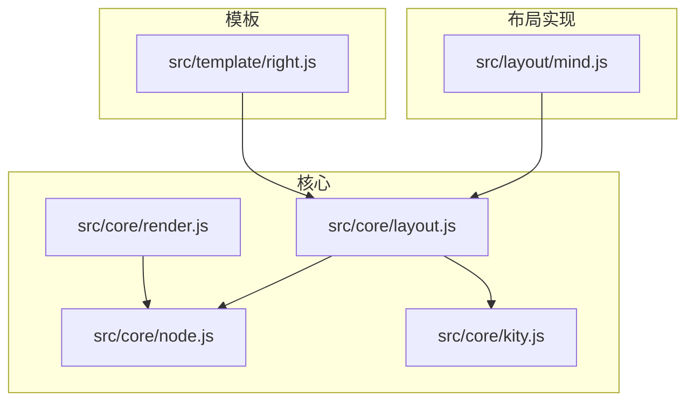
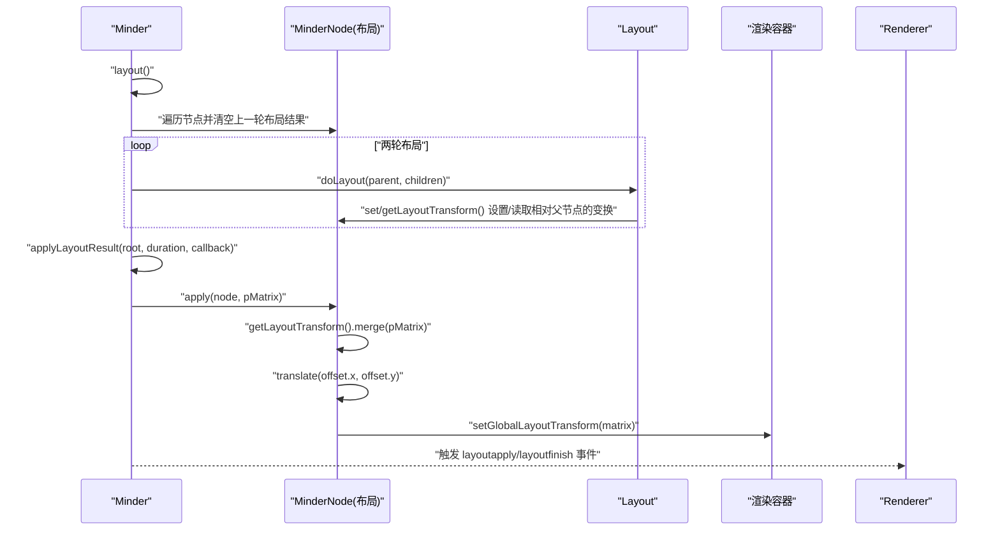
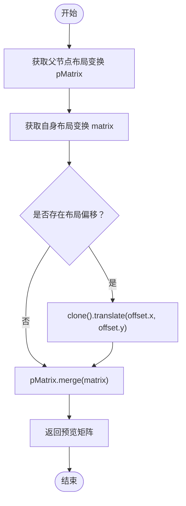
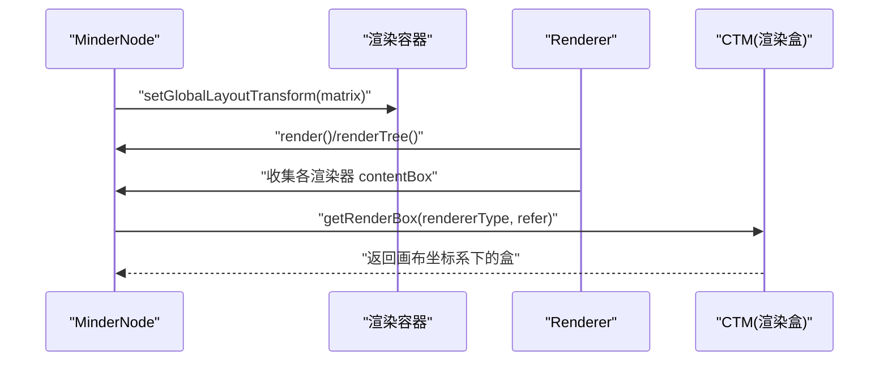
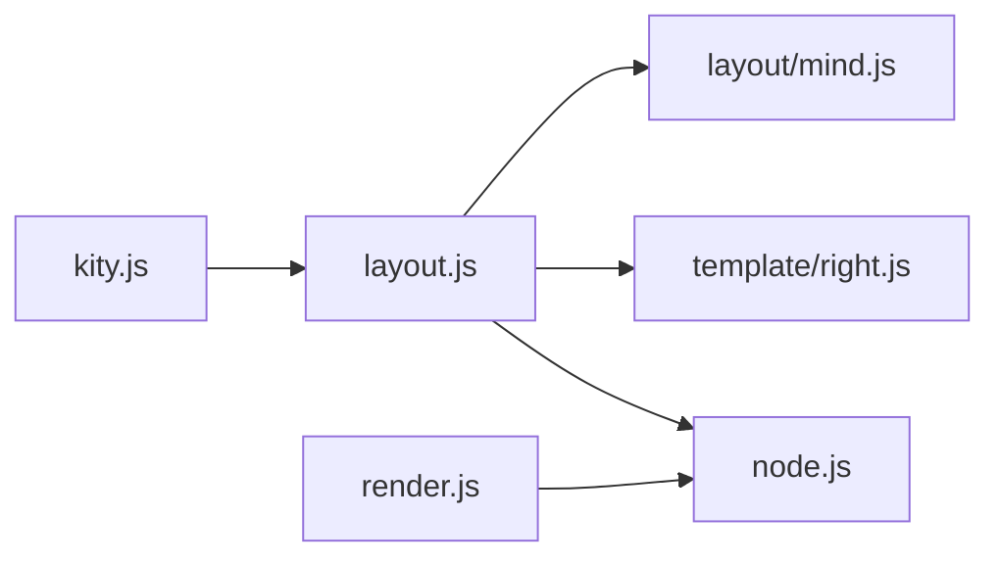

# 布局变换矩阵详解

<cite>
**本文引用的文件**
- [src/core/layout.js](file://src/core/layout.js)
- [src/core/node.js](file://src/core/node.js)
- [src/core/render.js](file://src/core/render.js)
- [src/core/kity.js](file://src/core/kity.js)
- [src/layout/mind.js](file://src/layout/mind.js)
- [src/template/right.js](file://src/template/right.js)
</cite>

## 目录
1. [引言](#引言)
2. [项目结构](#项目结构)
3. [核心组件](#核心组件)
4. [架构总览](#架构总览)
5. [详细组件分析](#详细组件分析)
6. [依赖关系分析](#依赖关系分析)
7. [性能考量](#性能考量)
8. [故障排查指南](#故障排查指南)
9. [结论](#结论)
10. [附录](#附录)

## 引言
本文件面向需要精确控制节点位置的高级开发者，深入解析 KityMinder 中“布局变换矩阵”的工作机制。重点阐明：
- setLayoutTransform 与 setGlobalLayoutTransform 的区别：前者设置节点相对于父节点的布局变换，用于布局计算阶段；后者设置节点相对于全局画布的最终变换，用于渲染阶段。
- 变换矩阵 kity.Matrix 在布局中的作用：平移、旋转、缩放等操作如何参与布局计算与渲染。
- 布局系统如何通过递归合并父节点的变换矩阵来计算全局位置。
- MinderNode 中 _matrix 与 _renderTransform 的存储与应用差异。
- 调试布局矩阵的技巧，例如通过 getGlobalLayoutTransformPreview 预览位置。

## 项目结构
围绕布局与变换矩阵的关键文件组织如下：
- 核心布局与节点：src/core/layout.js、src/core/node.js
- 渲染与内容盒：src/core/render.js
- Kity 引用：src/core/kity.js
- 布局实现示例：src/layout/mind.js
- 模板与布局策略：src/template/right.js

图表来源
- [src/core/layout.js](file://src/core/layout.js#L1-L524)
- [src/core/node.js](file://src/core/node.js#L1-L407)
- [src/core/render.js](file://src/core/render.js#L1-L261)
- [src/core/kity.js](file://src/core/kity.js#L1-L11)
- [src/layout/mind.js](file://src/layout/mind.js#L1-L62)
- [src/template/right.js](file://src/template/right.js#L1-L23)

章节来源
- [src/core/layout.js](file://src/core/layout.js#L1-L524)
- [src/core/node.js](file://src/core/node.js#L1-L407)
- [src/core/render.js](file://src/core/render.js#L1-L261)
- [src/core/kity.js](file://src/core/kity.js#L1-L11)
- [src/layout/mind.js](file://src/layout/mind.js#L1-L62)
- [src/template/right.js](file://src/template/right.js#L1-L23)

## 核心组件
- 布局系统（Layout）：定义布局算法接口与通用工具，负责节点子树布局区域计算、对齐、堆栈排列、移动等。
- 节点（MinderNode）：维护布局相关状态（_layoutTransform、_globalLayoutTransform）、布局偏移（layout_offset）、顶点与向量等，并提供布局变换的获取与预览能力。
- 渲染系统（Renderer/Minder）：负责节点渲染、内容盒（ContentBox）收集与合并，以及最终将全局布局矩阵应用到渲染容器。
- Kity 引用：统一导出 window.kity，供矩阵、动画、盒模型等底层能力使用。

章节来源
- [src/core/layout.js](file://src/core/layout.js#L1-L524)
- [src/core/node.js](file://src/core/node.js#L1-L407)
- [src/core/render.js](file://src/core/render.js#L1-L261)
- [src/core/kity.js](file://src/core/kity.js#L1-L11)

## 架构总览
下图展示了布局阶段与渲染阶段的矩阵传递路径，以及关键方法调用序列。

图表来源
- [src/core/layout.js](file://src/core/layout.js#L391-L520)
- [src/core/layout.js](file://src/core/layout.js#L237-L306)
- [src/core/layout.js](file://src/core/layout.js#L461-L518)

## 详细组件分析

### 布局系统（Layout）与变换矩阵工具
- doLayout 接口：具体布局算法需实现该方法，输入父节点与其子节点集合，输出每个子节点的相对父节点的布局变换（通常通过 setLayoutTransform 设置）。
- 对齐与堆栈：align、stack、move 等工具方法基于节点的布局变换矩阵与内容盒进行计算，支持按边对齐与沿轴堆叠。
- 区域计算：getBranchBox、getTreeBox 将节点内容盒经由布局变换矩阵映射到全局坐标系，从而得到布局区域。
- 布局执行流程：Minder.layout() 会清理上一轮布局结果，两轮递归布局后，调用 applyLayoutResult 将全局布局矩阵应用到渲染容器。

章节来源
- [src/core/layout.js](file://src/core/layout.js#L1-L168)
- [src/core/layout.js](file://src/core/layout.js#L391-L520)

### 节点布局状态与矩阵存储
- 相对父节点的布局变换：_layoutTransform（通过 getLayoutTransform/get/setLayoutTransform 访问），用于布局计算阶段。
- 全局布局变换预览：getGlobalLayoutTransformPreview 将父节点的布局变换与当前节点的布局变换合并，并考虑布局偏移，返回“第一轮布局后的全局位置”预览。
- 全局布局变换：getGlobalLayoutTransform 返回已应用到渲染容器的全局矩阵；若未设置，则回溯父节点的全局矩阵；根节点默认为单位矩阵。
- 布局偏移：通过 get/setLayoutOffset 为特定父布局类型设置偏移，影响最终全局位置。
- 顶点与向量：get/setVertexIn/Out、get/setLayoutVectorIn/Out 提供连接点与方向向量的布局空间表示。

图表来源
- [src/core/layout.js](file://src/core/layout.js#L249-L257)

章节来源
- [src/core/layout.js](file://src/core/layout.js#L237-L306)
- [src/core/layout.js](file://src/core/layout.js#L249-L257)

### 渲染阶段与 _renderTransform 的应用
- 渲染容器：MinderNode.getRenderContainer() 返回节点的渲染组容器，布局完成后通过 setGlobalLayoutTransform 将全局矩阵设置到该容器，从而驱动最终渲染。
- 内容盒与渲染盒：Renderer 在渲染过程中收集各段渲染器的 contentBox 并合并为节点的 _contentBox；getRenderBox 可基于渲染容器的 CTM 将内容盒映射到画布坐标系。
- 动画过渡：applyLayoutResult 支持动画时长 duration，使用 kity.Animator 在 lastMatrix 与新矩阵之间插值，逐节点更新 _globalLayoutTransform 并触发事件。

图表来源
- [src/core/layout.js](file://src/core/layout.js#L461-L518)
- [src/core/render.js](file://src/core/render.js#L165-L261)

章节来源
- [src/core/layout.js](file://src/core/layout.js#L461-L518)
- [src/core/render.js](file://src/core/render.js#L165-L261)

### kity.Matrix 在布局中的角色
- 平移、旋转、缩放：布局算法通过 kity.Matrix 的平移、旋转、缩放等操作构建相对父节点的变换；随后在应用阶段合并到父级矩阵。
- 合并与变换盒：getBranchBox/getTreeBox 使用 transformBox 将内容盒映射到全局坐标系，确保布局区域计算准确。
- CTM 获取：Renderer.getRenderBox 通过 kity.Matrix.getCTM 获取渲染容器的变换矩阵，将内容盒转换到画布坐标系。

章节来源
- [src/core/layout.js](file://src/core/layout.js#L121-L163)
- [src/core/render.js](file://src/core/render.js#L248-L257)
- [src/core/kity.js](file://src/core/kity.js#L1-L11)

### 布局实现示例：mind 布局
- mind 布局将兄弟节点分为左右两组，分别委托 left/right 布局实例处理，并设置节点的顶点与向量，用于连接线绘制与交互提示区域。

章节来源
- [src/layout/mind.js](file://src/layout/mind.js#L1-L62)

### 模板与布局策略
- 模板可声明节点的默认布局类型与连接方式，影响节点的布局选择与连线样式。

章节来源
- [src/template/right.js](file://src/template/right.js#L1-L23)

## 依赖关系分析
- MinderNode 依赖 Layout 与 Kity 的矩阵能力，提供布局状态与预览方法。
- Layout 依赖 MinderNode 与 Kity，负责布局算法与全局矩阵应用。
- Renderer 依赖 MinderNode 与 Kity，负责渲染盒计算与图形更新。
- kity.js 作为统一入口，提供矩阵、动画、盒模型等底层能力。

图表来源
- [src/core/kity.js](file://src/core/kity.js#L1-L11)
- [src/core/layout.js](file://src/core/layout.js#L1-L524)
- [src/core/node.js](file://src/core/node.js#L1-L407)
- [src/core/render.js](file://src/core/render.js#L1-L261)
- [src/template/right.js](file://src/template/right.js#L1-L23)
- [src/layout/mind.js](file://src/layout/mind.js#L1-L62)

## 性能考量
- 复杂度阈值：当节点复杂度超过阈值时，applyLayoutResult 会关闭动画，避免大量节点同时动画导致的性能问题。
- 精度与舍入：在应用阶段对矩阵的 e、f 分量进行四舍五入，减少浮点误差带来的视觉抖动。
- 事件与回调：布局过程通过事件通知外部监听者，注意在大批量节点场景下避免过度监听造成额外开销。

章节来源
- [src/core/layout.js](file://src/core/layout.js#L458-L518)

## 故障排查指南
- 预览全局位置：使用 getGlobalLayoutTransformPreview 快速检查节点在第一轮布局后的全局位置是否符合预期。
- 检查布局偏移：确认是否设置了针对特定父布局类型的布局偏移，偏移会影响最终全局位置。
- 核对父级矩阵：若子节点位置异常，检查父节点的布局变换是否正确设置，以及是否正确合并了父级矩阵。
- 渲染盒一致性：通过 getRenderBox 验证内容盒是否正确合并，以及 CTM 是否指向正确的参考坐标系。
- 动画卡顿：若节点过多导致动画卡顿，可适当增大复杂度阈值或关闭动画，观察性能改善情况。

章节来源
- [src/core/layout.js](file://src/core/layout.js#L249-L257)
- [src/core/layout.js](file://src/core/layout.js#L461-L518)
- [src/core/render.js](file://src/core/render.js#L248-L257)

## 结论
- setLayoutTransform 与 setGlobalLayoutTransform 的职责清晰：前者服务于布局计算阶段，后者服务于渲染阶段。
- kity.Matrix 在布局中承担核心角色，通过平移、旋转、缩放等操作构建与合并变换，最终将全局矩阵应用到渲染容器。
- 布局系统通过递归合并父节点矩阵与布局偏移，形成稳定的全局位置计算链路。
- 通过预览方法与事件机制，开发者可以高效调试与验证布局效果。

## 附录
- 关键方法路径参考
  - 相对布局变换：[getLayoutTransform](file://src/core/layout.js#L237-L242)、[setLayoutTransform](file://src/core/layout.js#L276-L282)
  - 全局布局预览：[getGlobalLayoutTransformPreview](file://src/core/layout.js#L249-L257)
  - 全局布局变换：[getGlobalLayoutTransform](file://src/core/layout.js#L263-L274)、[setGlobalLayoutTransform](file://src/core/layout.js#L284-L290)
  - 布局偏移：[getLayoutOffset](file://src/core/layout.js#L344-L353)、[setLayoutOffset](file://src/core/layout.js#L355-L364)
  - 布局执行与应用：[layout](file://src/core/layout.js#L391-L436)、[applyLayoutResult](file://src/core/layout.js#L444-L518)
  - 渲染盒与 CTM：[getRenderBox](file://src/core/render.js#L252-L257)
  - Kity 引用：[kity.js](file://src/core/kity.js#L1-L11)