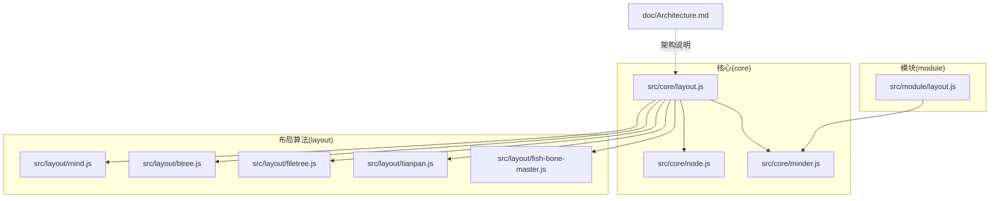
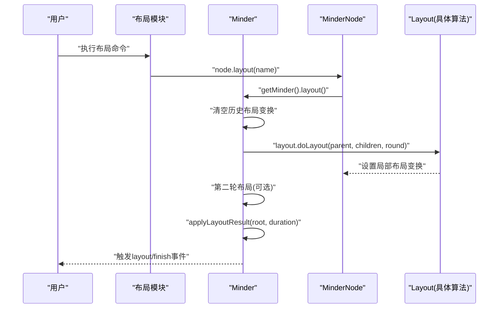
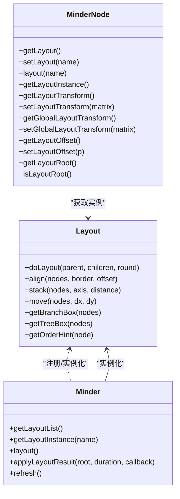
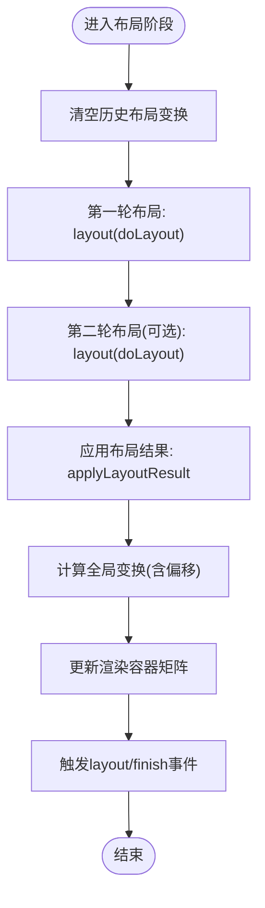
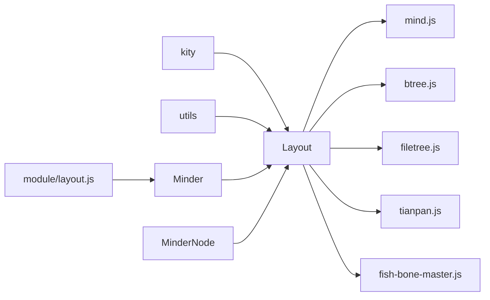

# 布局基类与继承机制

<cite>
**本文引用的文件**
- [src/core/layout.js](file://src/core/layout.js)
- [src/core/node.js](file://src/core/node.js)
- [src/core/minder.js](file://src/core/minder.js)
- [src/layout/mind.js](file://src/layout/mind.js)
- [src/layout/btree.js](file://src/layout/btree.js)
- [src/layout/filetree.js](file://src/layout/filetree.js)
- [src/layout/tianpan.js](file://src/layout/tianpan.js)
- [src/layout/fish-bone-master.js](file://src/layout/fish-bone-master.js)
- [src/module/layout.js](file://src/module/layout.js)
- [doc/Architecture.md](file://doc/Architecture.md)
</cite>

## 目录
1. [引言](#引言)
2. [项目结构](#项目结构)
3. [核心组件](#核心组件)
4. [架构总览](#架构总览)
5. [详细组件分析](#详细组件分析)
6. [依赖分析](#依赖分析)
7. [性能考量](#性能考量)
8. [故障排查指南](#故障排查指南)
9. [结论](#结论)

## 引言
本文件围绕 Layout 基类与其继承体系，系统阐述其作为抽象基类的角色、createClass 创建机制、register 注册机制如何将布局算法注入全局布局池、_defaultLayout 的默认布局逻辑、doLayout 抽象方法的设计意图与约束、以及 MinderNode 扩展中与布局相关的属性与方法（如 getLayout、setLayoutTransform、getGlobalLayoutTransform 等）。同时结合 Architecture.md 中的布局系统说明，解释布局系统的整体架构与数据流，帮助有经验的开发者快速掌握布局子系统的内部工作原理与扩展方式。

## 项目结构
- 核心布局基类位于 core 层，负责定义布局抽象接口、全局布局池管理、MinderNode 与 Minder 的布局扩展。
- 具体布局算法位于 layout 子目录，每个算法通过 Layout.register 注册到全局布局池。
- 模块层提供布局命令与上下文菜单集成，驱动用户操作触发布局刷新。
- Architecture.md 提供了布局系统在整体架构中的定位与实现概览。

图表来源
- [src/core/layout.js](file://src/core/layout.js#L1-L212)
- [src/layout/mind.js](file://src/layout/mind.js#L1-L62)
- [src/layout/btree.js](file://src/layout/btree.js#L1-L143)
- [src/layout/filetree.js](file://src/layout/filetree.js#L1-L89)
- [src/layout/tianpan.js](file://src/layout/tianpan.js#L1-L76)
- [src/layout/fish-bone-master.js](file://src/layout/fish-bone-master.js#L1-L68)
- [src/module/layout.js](file://src/module/layout.js#L1-L92)
- [doc/Architecture.md](file://doc/Architecture.md#L432-L520)

章节来源
- [doc/Architecture.md](file://doc/Architecture.md#L432-L520)

## 核心组件
- Layout 抽象基类：定义 doLayout 抽象接口、通用布局工具方法（align、stack、move、getBranchBox、getTreeBox、getOrderHint）、全局布局池注册与实例化能力。
- MinderNode 扩展：提供布局名称解析、布局实例获取、布局变换（局部/全局）、布局偏移、布局根判定等能力。
- Minder 扩展：提供布局调度（layout）、结果应用（applyLayoutResult）、刷新（refresh）等能力。
- 具体布局算法：通过 Layout.register 注册，实现 doLayout 与 getOrderHint，覆盖思维导图、二叉树、文件树、天盘、鱼骨图等场景。
- 布局模块：提供命令与快捷键，驱动用户操作触发布局刷新。

章节来源
- [src/core/layout.js](file://src/core/layout.js#L1-L212)
- [src/core/layout.js](file://src/core/layout.js#L212-L523)
- [src/core/node.js](file://src/core/node.js#L1-L407)
- [src/module/layout.js](file://src/module/layout.js#L1-L92)

## 架构总览
布局系统采用“抽象基类 + 全局布局池 + 具体算法实现”的分层架构：
- 抽象基类定义统一接口与通用工具，确保各算法实现的一致性与可组合性。
- 全局布局池通过 register 将算法名称与构造器绑定，Minder 提供 getLayoutList 与 getLayoutInstance 以按需实例化。
- MinderNode 在树节点上承载布局状态（布局名、局部变换、全局变换、偏移），并在布局阶段由具体算法填充。
- 布局流程分为两轮：先计算局部变换，再应用到全局并触发动画或同步更新，最后发出事件通知。

图表来源
- [src/module/layout.js](file://src/module/layout.js#L1-L92)
- [src/core/layout.js](file://src/core/layout.js#L391-L520)

## 详细组件分析

### Layout 抽象基类与全局布局池
- 抽象接口
  - doLayout(parent, children[, round])：子类必须实现的布局算法入口，输入父节点与其子节点集合，输出相对父节点的布局变换。未实现时抛出异常。
  - getOrderHint(node)：返回节点的顺序提示区域与路径，用于交互（如插入位置提示）。
- 工具方法
  - align(nodes, border, offset)：按指定边界对齐节点集合。
  - stack(nodes, axis, distance)：沿指定轴线堆叠节点，支持自定义间距策略。
  - move(nodes, dx, dy)：平移节点的局部变换矩阵。
  - getBranchBox(nodes)：计算节点集合的布局包围盒（考虑局部变换）。
  - getTreeBox(nodes)：递归计算子树布局包围盒（仅在展开且有子节点时合并子树盒）。
- 全局布局池
  - register(name, layout)：将布局类注册到全局池，首次注册的名称成为默认布局名（_defaultLayout）。
  - Minder.getLayoutList()：返回全局布局池。
  - Minder.getLayoutInstance(name)：按名称实例化布局类，不存在则抛错。

图表来源
- [src/core/layout.js](file://src/core/layout.js#L1-L212)
- [src/core/layout.js](file://src/core/layout.js#L176-L212)
- [src/core/layout.js](file://src/core/layout.js#L212-L523)

章节来源
- [src/core/layout.js](file://src/core/layout.js#L1-L212)
- [src/core/layout.js](file://src/core/layout.js#L176-L212)

### register 注册机制与 _defaultLayout 默认布局逻辑
- 注册机制
  - register(name, layout) 将布局类加入全局池，并在首次注册时记录默认布局名（_defaultLayout）。
  - Minder.getLayoutList() 返回全局布局池；Minder.getLayoutInstance(name) 实例化对应布局类。
- 默认布局逻辑
  - 若节点未显式设置布局名，根节点使用 _defaultLayout，非根节点继承父节点布局名。
  - 布局模块命令支持将布局名设置为 null 或 'inherit'，分别表示重置为继承或默认。

章节来源
- [src/core/layout.js](file://src/core/layout.js#L1-L212)
- [src/core/layout.js](file://src/core/layout.js#L212-L384)
- [src/module/layout.js](file://src/module/layout.js#L1-L92)

### doLayout 抽象方法的设计意图与约束
- 设计意图
  - 为子类提供统一的布局算法入口，保证不同布局算法在调用方式与数据结构上的兼容性。
  - 通过 round 参数支持多轮布局（如先计算相对位置，再进行微调）。
- 实现约束
  - 子类必须实现 doLayout，否则调用时抛出错误。
  - 子类通常通过 node.setLayoutTransform(matrix) 设置相对父节点的布局变换，并通过 node.setVertexIn/Out、setLayoutVectorIn/Out 等辅助方法描述连接点与方向，便于连线与交互。
  - 子类可复用 Layout 提供的 align、stack、move、getBranchBox、getTreeBox 等工具方法，减少重复计算。

章节来源
- [src/core/layout.js](file://src/core/layout.js#L1-L212)
- [src/layout/mind.js](file://src/layout/mind.js#L1-L62)
- [src/layout/btree.js](file://src/layout/btree.js#L1-L143)
- [src/layout/filetree.js](file://src/layout/filetree.js#L1-L89)
- [src/layout/tianpan.js](file://src/layout/tianpan.js#L1-L76)
- [src/layout/fish-bone-master.js](file://src/layout/fish-bone-master.js#L1-L68)

### MinderNode 扩展：布局相关属性与方法
- 布局名称解析
  - getLayout()：若节点自身未设置布局名，则根节点返回默认布局名，非根节点继承父节点布局名。
  - setLayout(name)：设置布局名，支持 'inherit' 表示重置为继承。
  - layout(name)：设置布局名并触发 Minder.layout()。
  - getLayoutInstance()：根据 getLayout() 获取布局实例。
- 布局变换
  - getLayoutTransform()/setLayoutTransform(matrix)：获取/设置节点相对于父节点的布局变换矩阵。
  - getGlobalLayoutTransform()/setGlobalLayoutTransform(matrix)：获取/设置节点相对于全局的布局变换矩阵；后者会同步更新渲染容器矩阵。
  - getLayoutPoint()/getLayoutBox()：基于全局变换计算节点的全局点与包围盒。
- 布局偏移
  - getLayoutOffset()/setLayoutOffset(p)/hasLayoutOffset()/resetLayoutOffset()：支持针对特定父布局的偏移存储与重置。
- 布局根判定
  - getLayoutRoot()/isLayoutRoot()：判断节点是否为布局根（自身显式设置布局名或为根节点）。

图表来源
- [src/core/layout.js](file://src/core/layout.js#L391-L520)

章节来源
- [src/core/layout.js](file://src/core/layout.js#L212-L523)
- [src/core/node.js](file://src/core/node.js#L1-L407)

### 具体布局算法示例与对比
- 思维导图布局（mind）
  - 将子节点分为左右两组，分别委托 left/right 布局算法计算，再设置父节点的出点与向量。
- 二叉树布局（btree）
  - 支持 left/right/top/bottom 四向，按轴线对齐与堆叠，计算父节点出点与子节点入点，结合边距与包围盒进行位移调整。
- 文件树布局（filetree）
  - 支持向上/向下两种方向，按缩进与堆叠规则计算子节点位置，结合父节点边距与子树包围盒进行位移。
- 天盘布局（tianpan）
  - 基于螺旋参数方程计算子节点位置，考虑子树包围盒以确定半径，逐个节点设置入点与向量并平移。
- 鱼骨图主骨架（fish-bone-master）
  - 将子节点按奇偶分组到上下两部分，分别沿 x 轴堆叠并对齐，计算左右两组的 y 方向偏移并平移。

章节来源
- [src/layout/mind.js](file://src/layout/mind.js#L1-L62)
- [src/layout/btree.js](file://src/layout/btree.js#L1-L143)
- [src/layout/filetree.js](file://src/layout/filetree.js#L1-L89)
- [src/layout/tianpan.js](file://src/layout/tianpan.js#L1-L76)
- [src/layout/fish-bone-master.js](file://src/layout/fish-bone-master.js#L1-L68)

## 依赖分析
- 组件耦合
  - Layout 依赖 kity、utils、Minder、MinderNode、MinderEvent、Command。
  - 具体布局算法依赖 Layout 基类与 kity。
  - MinderNode 与 Minder 通过扩展方式引入布局能力，彼此保持松耦合。
- 外部依赖
  - kity 提供图形与矩阵运算能力。
  - utils 提供扩展与克隆等工具。
- 循环依赖
  - 未发现循环依赖迹象：Layout -> Minder/MinderNode -> 具体算法；模块 -> Minder。

图表来源
- [src/core/layout.js](file://src/core/layout.js#L1-L212)
- [src/layout/mind.js](file://src/layout/mind.js#L1-L62)
- [src/layout/btree.js](file://src/layout/btree.js#L1-L143)
- [src/layout/filetree.js](file://src/layout/filetree.js#L1-L89)
- [src/layout/tianpan.js](file://src/layout/tianpan.js#L1-L76)
- [src/layout/fish-bone-master.js](file://src/layout/fish-bone-master.js#L1-L68)
- [src/module/layout.js](file://src/module/layout.js#L1-L92)

## 性能考量
- 复杂度阈值
  - 当子树复杂度超过阈值时，自动关闭布局动画，避免大规模节点更新导致卡顿。
- 动画优化
  - 使用 kity.Animator 进行矩阵插值，动画结束后补充一帧以缓解丢帧问题。
- 两轮布局
  - 第一轮计算相对位置，第二轮可进行微调，提升视觉一致性与交互体验。
- 包围盒计算
  - getTreeBox 仅在节点展开且存在子节点时递归合并子树盒，避免不必要的计算。

章节来源
- [src/core/layout.js](file://src/core/layout.js#L458-L520)

## 故障排查指南
- 常见问题
  - 未实现 doLayout：调用时抛出错误，需在子类中实现布局算法。
  - 布局名不存在：通过 Minder.getLayoutInstance(name) 时若名称未注册，会抛错。
  - 布局偏移冲突：多次设置同一父布局的偏移时，后设置覆盖前者；可通过 resetLayoutOffset 清除。
- 排查步骤
  - 确认布局算法已通过 Layout.register 注册。
  - 检查节点布局名解析链：根节点 -> 默认布局 -> 父节点继承。
  - 观察 applyLayoutResult 是否触发 layout/finish 事件，定位动画或同步更新阶段的问题。
  - 使用 getLayoutBox/getLayoutPoint 验证全局变换是否正确。

章节来源
- [src/core/layout.js](file://src/core/layout.js#L176-L212)
- [src/core/layout.js](file://src/core/layout.js#L212-L523)
- [src/module/layout.js](file://src/module/layout.js#L1-L92)

## 结论
Layout 抽象基类为布局系统提供了统一的接口与通用工具，配合全局布局池与 MinderNode 的布局状态管理，实现了可扩展、可组合、可动画的布局框架。通过 register 机制，开发者可以轻松注入新的布局算法；通过 doLayout 与 getOrderHint，算法实现既简洁又灵活。结合两轮布局与动画优化策略，系统在复杂场景下仍能保持良好的性能与交互体验。建议在扩展新布局时遵循基类约定，充分利用工具方法与事件机制，确保与整体布局管线无缝衔接。