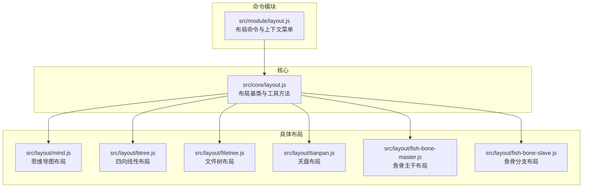
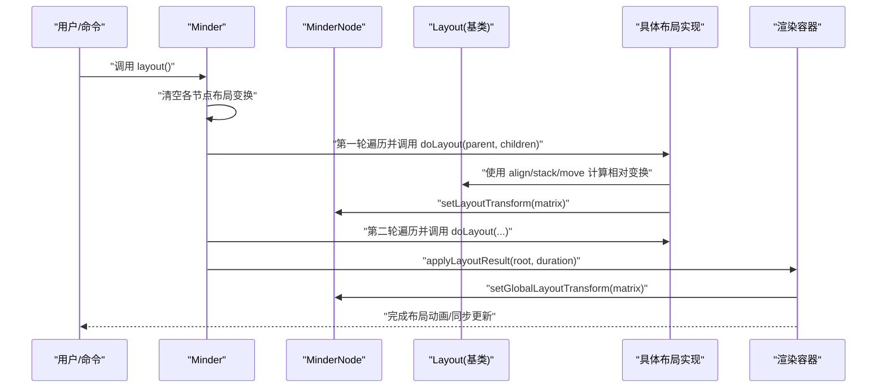
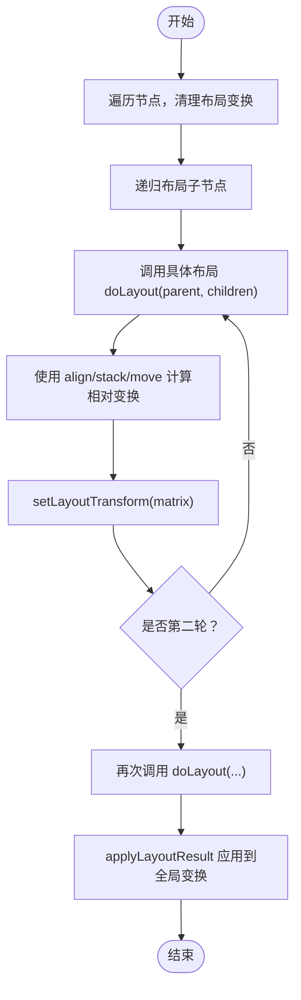
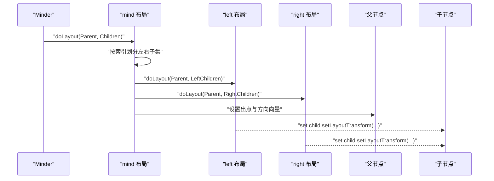
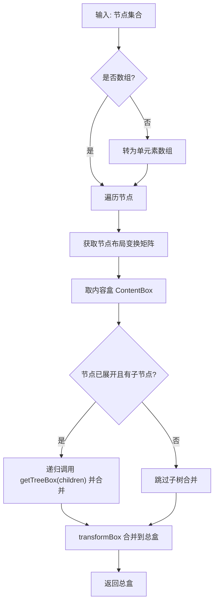
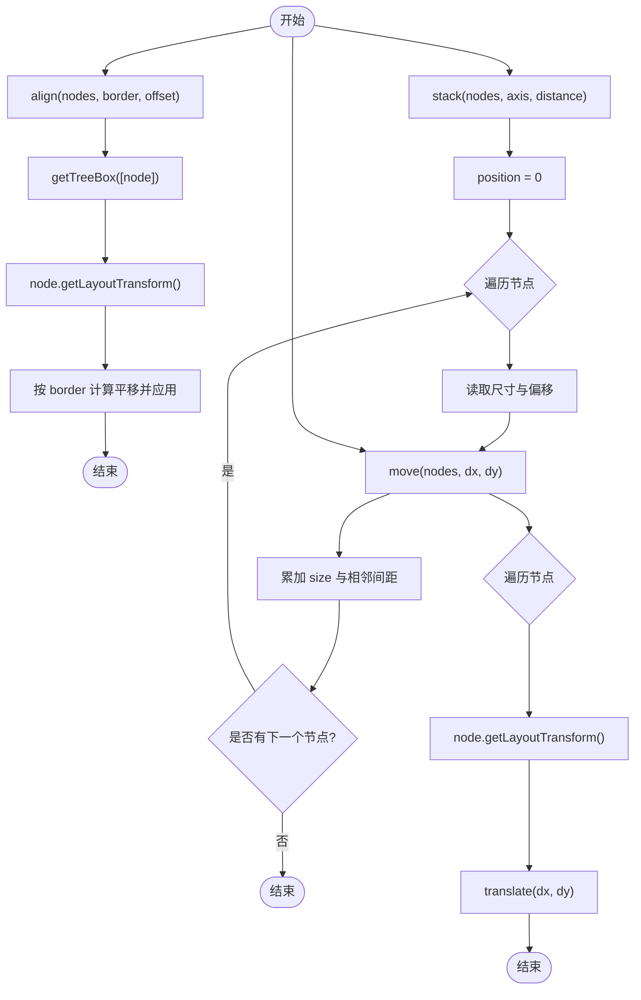
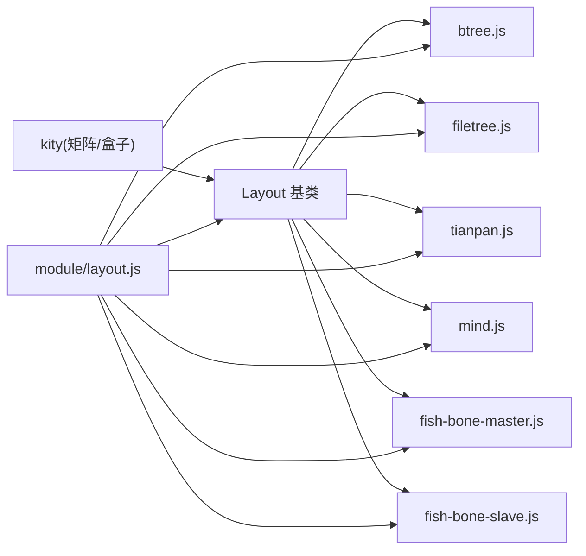

# 核心布局方法实现

<cite>
**本文引用的文件**
- [src/core/layout.js](file://src/core/layout.js)
- [src/layout/mind.js](file://src/layout/mind.js)
- [src/layout/btree.js](file://src/layout/btree.js)
- [src/layout/filetree.js](file://src/layout/filetree.js)
- [src/layout/tianpan.js](file://src/layout/tianpan.js)
- [src/layout/fish-bone-master.js](file://src/layout/fish-bone-master.js)
- [src/layout/fish-bone-slave.js](file://src/layout/fish-bone-slave.js)
- [src/module/layout.js](file://src/module/layout.js)
</cite>

## 目录
1. [引言](#引言)
2. [项目结构](#项目结构)
3. [核心组件](#核心组件)
4. [架构总览](#架构总览)
5. [详细组件分析](#详细组件分析)
6. [依赖关系分析](#依赖关系分析)
7. [性能考量](#性能考量)
8. [故障排查指南](#故障排查指南)
9. [结论](#结论)
10. [附录](#附录)

## 引言
本篇文档聚焦于核心布局系统，面向希望实现自定义布局的开发者。我们将深入解析 doLayout 方法的实现要点，涵盖：
- 如何遍历子节点并进行分组
- 如何计算相对变换矩阵并调用 setLayoutTransform
- 以 mind.js 中的思维导图布局为例，展示“左右分区 + 组合布局”的模式
- getTreeBox 与 getBranchBox 的差异与适用场景
- align 对齐、stack 堆叠、move 移动等辅助方法的内部实现与组合使用方式

## 项目结构
布局系统由“布局基类 + 具体布局实现 + 布局命令模块”构成：
- 基类与通用工具：src/core/layout.js
- 具体布局：src/layout/*.js（如 mind.js、btree.js、filetree.js、tianpan.js 等）
- 布局命令模块：src/module/layout.js

图表来源
- [src/core/layout.js](file://src/core/layout.js#L1-L120)
- [src/layout/mind.js](file://src/layout/mind.js#L1-L62)
- [src/layout/btree.js](file://src/layout/btree.js#L1-L143)
- [src/layout/filetree.js](file://src/layout/filetree.js#L1-L89)
- [src/layout/tianpan.js](file://src/layout/tianpan.js#L1-L76)
- [src/layout/fish-bone-master.js](file://src/layout/fish-bone-master.js#L1-L68)
- [src/layout/fish-bone-slave.js](file://src/layout/fish-bone-slave.js#L1-L72)
- [src/module/layout.js](file://src/module/layout.js#L1-L92)

章节来源
- [src/core/layout.js](file://src/core/layout.js#L1-L120)
- [src/layout/mind.js](file://src/layout/mind.js#L1-L62)
- [src/layout/btree.js](file://src/layout/btree.js#L1-L143)
- [src/layout/filetree.js](file://src/layout/filetree.js#L1-L89)
- [src/layout/tianpan.js](file://src/layout/tianpan.js#L1-L76)
- [src/layout/fish-bone-master.js](file://src/layout/fish-bone-master.js#L1-L68)
- [src/layout/fish-bone-slave.js](file://src/layout/fish-bone-slave.js#L1-L72)
- [src/module/layout.js](file://src/module/layout.js#L1-L92)

## 核心组件
- 布局基类与生命周期
  - doLayout 抽象方法：子类需实现，接收父节点与子节点数组，计算子节点的相对变换
  - 辅助方法：align 对齐、stack 堆叠、move 移动
  - 工具方法：getBranchBox（直接子节点区域）、getTreeBox（子树区域）
  - 变换存储：MinderNode.getLayoutTransform/setLayoutTransform；全局变换：getGlobalLayoutTransform/setGlobalLayoutTransform
  - 布局执行流程：Minder.layout 驱动两轮布局计算，再应用到渲染容器

- 布局注册与实例化
  - Layout.register 注册布局名与构造器
  - Minder.getLayoutInstance 按名称获取布局实例
  - MinderNode.getLayout/getLayoutInstance 选择节点使用的布局

- 布局命令模块
  - 提供设置布局、重置布局的命令，支持上下文菜单与快捷键

章节来源
- [src/core/layout.js](file://src/core/layout.js#L20-L168)
- [src/core/layout.js](file://src/core/layout.js#L196-L384)
- [src/core/layout.js](file://src/core/layout.js#L391-L520)
- [src/module/layout.js](file://src/module/layout.js#L1-L92)

## 架构总览
下面的序列图展示了从触发布局到最终渲染的关键流程，以及 doLayout 在其中的角色。

图表来源
- [src/core/layout.js](file://src/core/layout.js#L391-L520)
- [src/core/layout.js](file://src/core/layout.js#L20-L168)

## 详细组件分析

### doLayout 实现要点与控制流
- 输入参数
  - parent：当前处理的父节点
  - children：当前父节点的子节点数组
  - round：布局轮次（两轮），用于支持迭代式优化
- 关键步骤
  - 清理上一轮结果：遍历节点，重置布局变换
  - 递归布局：先对所有子节点进行布局，再对当前节点布局
  - 计算相对变换：通过 align/stack/move 等工具方法，结合 getTreeBox/getBranchBox 计算偏移
  - 应用结果：两轮完成后，统一应用到全局变换，并驱动动画或同步更新

图表来源
- [src/core/layout.js](file://src/core/layout.js#L391-L520)
- [src/core/layout.js](file://src/core/layout.js#L20-L168)

章节来源
- [src/core/layout.js](file://src/core/layout.js#L391-L520)

### 思维导图布局（mind.js）：左右分区与组合模式
- 分区策略
  - 将子节点按索引划分为左右两部分（右半部分优先）
  - 通过 Minder.getLayoutInstance('left') 与 Minder.getLayoutInstance('right') 获取左右布局实例
  - 分别对左右子集调用 doLayout，形成组合布局
- 输出与连接点
  - 设置父节点的出点与方向向量，便于连线绘制

图表来源
- [src/layout/mind.js](file://src/layout/mind.js#L1-L62)
- [src/layout/btree.js](file://src/layout/btree.js#L1-L143)

章节来源
- [src/layout/mind.js](file://src/layout/mind.js#L1-L62)

### getTreeBox 与 getBranchBox 的差异与场景
- getBranchBox
  - 仅考虑直接子节点的布局区域，不递归子树
  - 适合“仅关注当前层级直接子节点”的堆叠/对齐
- getTreeBox
  - 递归合并子树的布局区域，考虑展开状态
  - 适合“整体子树范围”的定位与调整（如文件树上下方向的偏移）

图表来源
- [src/core/layout.js](file://src/core/layout.js#L116-L163)

章节来源
- [src/core/layout.js](file://src/core/layout.js#L116-L163)

### 辅助方法：align、stack、move 的内部实现与使用模式
- align(nodes, border, offset)
  - 使用 getTreeBox 计算每个节点的边界框
  - 根据 border（left/right/top/bottom）计算平移量，修改节点的布局变换矩阵
  - 适用于对齐兄弟节点的某一侧
- stack(nodes, axis, distance)
  - 沿 x 或 y 轴累积位置，逐个节点根据尺寸与间距进行平移
  - distance 默认使用样式 margin（左右/上下），可自定义函数
  - 适用于沿轴向堆叠多个节点
- move(nodes, dx, dy)
  - 对每个节点的布局变换矩阵进行平移
  - 适用于一次性整体位移

图表来源
- [src/core/layout.js](file://src/core/layout.js#L41-L112)

章节来源
- [src/core/layout.js](file://src/core/layout.js#L41-L112)

### 典型布局实现模式与组合使用
- 四向线性布局（btree.js）
  - 为每个子节点设置入点/出点与方向向量
  - 使用 align 对齐到相反侧，使用 stack 沿垂直轴堆叠
  - 使用 getBranchBox 计算堆叠区域，再根据父节点内容盒与边距计算最终偏移
  - 最后使用 move 进行整体平移

- 文件树布局（filetree.js）
  - 对齐到父节点左侧，沿 y 轴堆叠
  - 根据 dir（上/下）决定 y 方向偏移，使用 getTreeBox 计算子树高度以确定起点

- 天盘布局（tianpan.js）
  - 为每个子节点计算螺旋坐标，使用 getTreeBox 获取子节点尺寸以确定半径
  - 使用 move 进行平移

- 鱼骨布局（fish-bone-master.js、fish-bone-slave.js）
  - 将子节点分为上下两部分，分别堆叠并使用 align 对齐
  - 在第二轮中根据父节点出点与子节点入点进行微调

章节来源
- [src/layout/btree.js](file://src/layout/btree.js#L78-L141)
- [src/layout/filetree.js](file://src/layout/filetree.js#L13-L52)
- [src/layout/tianpan.js](file://src/layout/tianpan.js#L17-L43)
- [src/layout/fish-bone-master.js](file://src/layout/fish-bone-master.js#L41-L67)
- [src/layout/fish-bone-slave.js](file://src/layout/fish-bone-slave.js#L44-L72)

## 依赖关系分析
- 布局基类依赖 kity 的矩阵与盒子类型，提供统一的变换与区域计算接口
- 具体布局实现依赖基类提供的工具方法与节点 API
- 命令模块通过 MinderNode.layout 与 Minder.layout 触发布局执行

图表来源
- [src/core/layout.js](file://src/core/layout.js#L1-L120)
- [src/layout/btree.js](file://src/layout/btree.js#L1-L143)
- [src/layout/filetree.js](file://src/layout/filetree.js#L1-L89)
- [src/layout/tianpan.js](file://src/layout/tianpan.js#L1-L76)
- [src/layout/mind.js](file://src/layout/mind.js#L1-L62)
- [src/layout/fish-bone-master.js](file://src/layout/fish-bone-master.js#L1-L68)
- [src/layout/fish-bone-slave.js](file://src/layout/fish-bone-slave.js#L1-L72)
- [src/module/layout.js](file://src/module/layout.js#L1-L92)

章节来源
- [src/core/layout.js](file://src/core/layout.js#L1-L120)
- [src/module/layout.js](file://src/module/layout.js#L1-L92)

## 性能考量
- 两轮布局：第一轮收集信息，第二轮进行精细调整，有助于稳定布局质量
- 复杂度阈值：当节点复杂度超过阈值时自动关闭动画，避免卡顿
- 动画优化：停止旧动画、使用时间轴插值、在动画结束后强制一帧确保视觉一致性
- 区域计算：getTreeBox 递归合并子树，注意在深层树中可能带来额外开销；必要时可缓存中间结果

章节来源
- [src/core/layout.js](file://src/core/layout.js#L438-L520)

## 故障排查指南
- 布局未生效
  - 检查是否正确调用 setLayoutTransform 并在第二轮进行必要的微调
  - 确认节点是否被收起导致子节点未参与布局
- 对齐异常
  - align 使用 getTreeBox，若子节点未设置布局变换，可能导致边界框不准确
  - 确保在调用 align 前已完成子节点的相对定位
- 堆叠间距不符合预期
  - stack 的默认间距来自样式 margin，若自定义布局请传入自定义 distance 函数
- 动画卡顿
  - 节点数量较多时会自动降级为无动画；可通过减少节点或优化布局算法缓解

章节来源
- [src/core/layout.js](file://src/core/layout.js#L41-L112)
- [src/core/layout.js](file://src/core/layout.js#L438-L520)

## 结论
- doLayout 是自定义布局的核心入口，应遵循“先子后父、两轮迭代、统一应用”的模式
- getTreeBox 与 getBranchBox 的选择取决于是否需要考虑子树范围
- align/stack/move 是强大的组合工具，建议在同一次 doLayout 中多次组合使用
- 通过 mind.js 的左右分区与组合布局模式，可快速构建复杂的分区式布局

## 附录
- 自定义布局最佳实践
  - 明确父节点的出点与方向向量，便于连线绘制
  - 先对齐，再堆叠，最后整体移动，保持逻辑清晰
  - 使用 getTreeBox 计算整体范围，使用 getBranchBox 计算直接子节点范围
  - 在第二轮中根据全局信息进行微调，提升稳定性