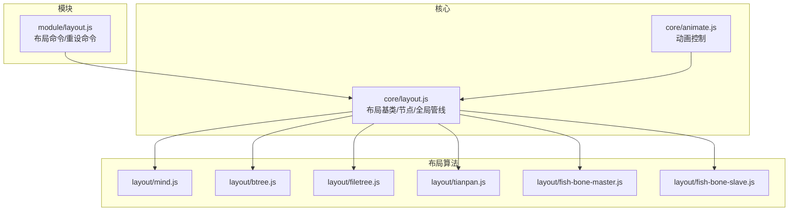
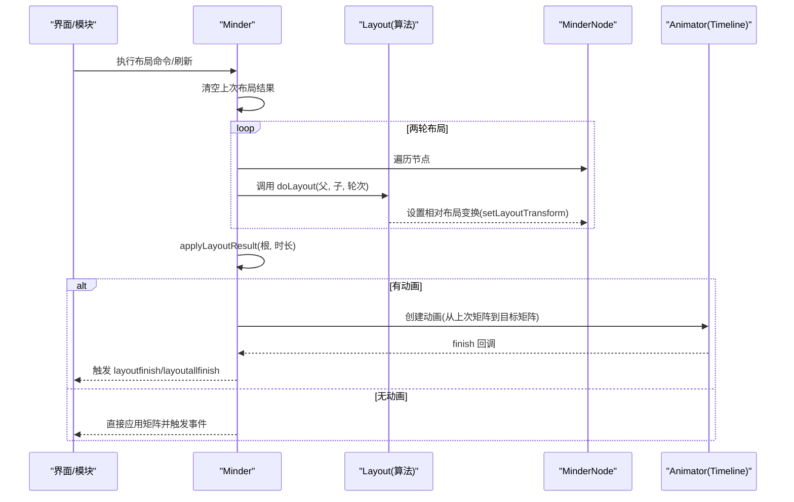
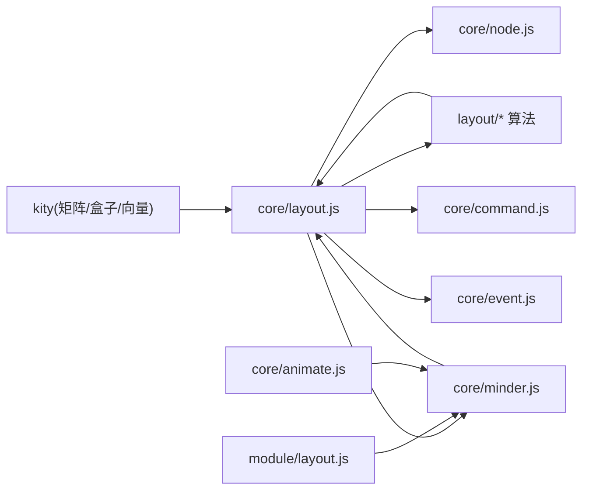

# 自定义布局开发

<cite>
**本文引用的文件**
- [Architecture.md](file://doc/Architecture.md)
- [layout.js](file://src/core/layout.js)
- [mind.js](file://src/layout/mind.js)
- [btree.js](file://src/layout/btree.js)
- [filetree.js](file://src/layout/filetree.js)
- [tianpan.js](file://src/layout/tianpan.js)
- [fish-bone-master.js](file://src/layout/fish-bone-master.js)
- [fish-bone-slave.js](file://src/layout/fish-bone-slave.js)
- [layout.js（模块）](file://src/module/layout.js)
- [animate.js](file://src/core/animate.js)
</cite>

## 目录
1. [引言](#引言)
2. [项目结构](#项目结构)
3. [核心组件](#核心组件)
4. [架构总览](#架构总览)
5. [详细组件分析](#详细组件分析)
6. [依赖分析](#依赖分析)
7. [性能考量](#性能考量)
8. [故障排查指南](#故障排查指南)
9. [结论](#结论)
10. [附录](#附录)

## 引言
本篇文档面向有经验的开发者，系统讲解如何基于 Layout 基类实现自定义布局算法。重点围绕 doLayout 抽象方法的实现、布局系统工具方法（align、stack、move、getBranchBox、getTreeBox）的使用与原理、布局变换矩阵（setLayoutTransform）与全局布局变换（setGlobalLayoutTransform）的区别与应用、以及布局动画的实现机制（Timeline）。同时提供从简单线性布局到复杂放射状布局的开发示例，并引用 Architecture.md 中的布局系统说明与现有布局算法（如 mind.js）作为实现参考。

## 项目结构
- 核心布局基类与节点/全局布局管线位于 core 目录，提供布局注册、实例化、两轮布局计算、动画应用等能力。
- 具体布局算法位于 layout 目录，包含 mind、btree、filetree、tianpan、鱼骨主干/分支等。
- 布局切换模块位于 module 目录，提供命令与快捷键入口。
- 动画控制位于 core 目录，统一管理布局动画时长与开关。

图表来源
- [layout.js](file://src/core/layout.js#L1-L120)
- [mind.js](file://src/layout/mind.js#L1-L62)
- [btree.js](file://src/layout/btree.js#L1-L143)
- [filetree.js](file://src/layout/filetree.js#L1-L89)
- [tianpan.js](file://src/layout/tianpan.js#L1-L76)
- [fish-bone-master.js](file://src/layout/fish-bone-master.js#L1-L68)
- [fish-bone-slave.js](file://src/layout/fish-bone-slave.js#L1-L72)
- [layout.js（模块）](file://src/module/layout.js#L1-L92)
- [animate.js](file://src/core/animate.js#L1-L43)

章节来源
- [Architecture.md](file://doc/Architecture.md#L446-L453)

## 核心组件
- 布局基类 Layout：定义 doLayout 抽象方法、对齐/堆叠/移动工具、分支/子树区域计算、布局变换矩阵与全局变换矩阵的读写、布局实例注册与获取。
- 节点布局支持：在 MinderNode 上提供 get/setLayoutTransform、get/setGlobalLayoutTransform、get/setLayoutOffset、getLayoutRoot/isLayoutRoot 等方法。
- 全局布局管线：Minder.layout() 两轮布局计算，随后通过 applyLayoutResult() 应用动画或同步更新。
- 现有布局算法：mind、btree、filetree、tianpan、鱼骨主干/分支等，均可作为自定义布局的参考实现。

章节来源
- [layout.js](file://src/core/layout.js#L1-L120)
- [layout.js](file://src/core/layout.js#L196-L384)
- [layout.js](file://src/core/layout.js#L391-L520)

## 架构总览
布局系统采用“基类 + 算法实现 + 模块接入 + 动画管线”的分层设计：
- 基类层：提供统一的 doLayout 接口、工具方法与节点/全局变换管理。
- 算法层：各布局算法实现 doLayout，使用工具方法完成节点相对变换计算。
- 模块层：提供命令入口，切换布局、重设布局。
- 动画层：统一控制布局动画时长与开关，两轮布局完成后应用动画或同步更新。

图表来源
- [layout.js](file://src/core/layout.js#L391-L520)
- [animate.js](file://src/core/animate.js#L1-L43)

## 详细组件分析

### 布局基类与工具方法
- doLayout 抽象方法：子类必须实现，输入父节点与其子节点集合，输出每个子节点相对于父节点的相对变换（通过 setLayoutTransform 设置）。
- 对齐 align(nodes, border, offset)：根据子树盒模型对齐到父节点的某个边界，内部使用 getTreeBox 计算子树范围。
- 堆叠 stack(nodes, axis, distance)：沿 x 或 y 轴堆叠节点，支持自定义间距函数，默认使用相邻节点的 margin 组合。
- 移动 move(nodes, dx, dy)：对节点的相对布局变换进行平移。
- 分支区域 getBranchBox(nodes)：合并多个节点的布局盒（考虑节点当前相对变换）。
- 子树区域 getTreeBox(nodes)：递归合并子树布局盒，仅在节点展开且存在子节点时继续递归。
- 布局变换矩阵：
  - 相对布局变换：setLayoutTransform(matrix)，记录节点相对于父节点的变换。
  - 全局布局变换：setGlobalLayoutTransform(matrix)，直接设置渲染容器的矩阵，用于动画应用与最终呈现。
- 两轮布局：Minder.layout() 会先计算第一轮，再计算第二轮，以便某些算法（如鱼骨从属）在第二轮修正位置。

章节来源
- [layout.js](file://src/core/layout.js#L37-L168)
- [layout.js](file://src/core/layout.js#L196-L384)
- [layout.js](file://src/core/layout.js#L391-L520)

### 节点布局支持与变换
- getLayoutTransform/setLayoutTransform：读取/设置节点的相对布局变换矩阵。
- getGlobalLayoutTransformPreview/getLayoutPointPreview：在未提交全局矩阵时预览全局布局变换与点位。
- getGlobalLayoutTransform/setGlobalLayoutTransform：获取/设置节点的全局布局变换矩阵（渲染容器矩阵）。
- getLayoutOffset/setLayoutOffset/resetLayoutOffset：为特定父布局设置局部偏移，影响最终全局矩阵。
- getLayoutRoot/isLayoutRoot：判断节点是否为某布局的根节点（自身布局设置或根节点）。

章节来源
- [layout.js](file://src/core/layout.js#L237-L384)

### 全局布局管线与动画
- Minder.layout()：清空上次布局结果，两轮遍历调用各节点的布局实例 doLayout，最后调用 applyLayoutResult。
- applyLayoutResult(root, duration, callback)：
  - 计算每节点的全局矩阵：合并父矩阵与子节点相对矩阵，再叠加 layout_offset。
  - 若开启动画且节点存在旧动画，先停止旧动画；否则直接应用矩阵。
  - 动画结束后触发 layoutfinish，所有节点完成后触发 layoutallfinish。
  - 节点复杂度超过阈值时自动关闭动画。

章节来源
- [layout.js](file://src/core/layout.js#L391-L520)
- [animate.js](file://src/core/animate.js#L1-L43)

### 现有布局算法参考

#### 思维导图布局（mind）
- 将子节点分为左右两组，分别委托 left/right 布局实例计算，然后设置父节点的出边顶点与向量，用于连线方向。
- getOrderHint 提供上下插入区域提示。

章节来源
- [mind.js](file://src/layout/mind.js#L1-L62)

#### 二叉树布局（btree）
- 支持 left/right/top/bottom 四向布局，根据方向确定轴向与方向系数。
- 为父节点设置出边顶点与向量，为每个子节点设置入边顶点与向量，使用 align + stack 完成相对定位，最后通过 move 平移到全局位置。
- getOrderHint 根据轴向给出上下区域提示。

章节来源
- [btree.js](file://src/layout/btree.js#L1-L143)

#### 文件树布局（filetree）
- 支持向上/向下两种方向，按 y 轴堆叠子节点，左对齐，父节点出边在左侧缩进位置，子节点入边在左侧。
- getOrderHint 提供上下区域提示。

章节来源
- [filetree.js](file://src/layout/filetree.js#L1-L89)

#### 天盘布局（tianpan）
- 将子节点按螺旋路径分布，使用极坐标计算位置，结合 getTreeBox 估算半径，逐个节点设置入边顶点与向量，并通过 move 平移至目标位置。

章节来源
- [tianpan.js](file://src/layout/tianpan.js#L1-L76)

#### 鱼骨图主干/分支（fish-bone-master、fish-bone-slave）
- 主干布局：将子节点分为上下两部分，分别沿 x 轴堆叠并对齐到父节点的上下边缘，计算 x/y 偏移后移动。
- 分支布局：根据父向量决定出边方向，按黄金分割点确定出边位置，沿 y 轴堆叠并左对齐；第二轮根据父出边与子入边的垂直差进行微调。

章节来源
- [fish-bone-master.js](file://src/layout/fish-bone-master.js#L1-L68)
- [fish-bone-slave.js](file://src/layout/fish-bone-slave.js#L1-L72)

### 布局动画实现机制（Timeline）
- 动画时长来自 Minder 选项，可通过 animate.js 控制启用/禁用动画与各类型动画时长。
- 在 applyLayoutResult 中，若 duration > 0，则创建 kity.Animator，从节点上次全局矩阵平滑过渡到目标矩阵；动画结束时触发 layoutfinish，并在所有节点完成后触发 layoutallfinish。
- 节点复杂度超过阈值时自动降级为同步更新，避免性能问题。

章节来源
- [animate.js](file://src/core/animate.js#L1-L43)
- [layout.js](file://src/core/layout.js#L444-L520)

## 依赖分析
- 布局基类依赖 kity 矩阵/盒子/向量与 Minder/MinderNode/Command/事件系统。
- 具体布局算法依赖 Layout 基类与 Minder.getLayoutInstance。
- 模块层依赖 Command 与 Minder 的布局命令接口。
- 动画层通过 Minder 选项与 Animator 集中控制。

图表来源
- [layout.js](file://src/core/layout.js#L1-L120)
- [mind.js](file://src/layout/mind.js#L1-L62)
- [btree.js](file://src/layout/btree.js#L1-L143)
- [filetree.js](file://src/layout/filetree.js#L1-L89)
- [tianpan.js](file://src/layout/tianpan.js#L1-L76)
- [fish-bone-master.js](file://src/layout/fish-bone-master.js#L1-L68)
- [fish-bone-slave.js](file://src/layout/fish-bone-slave.js#L1-L72)
- [layout.js（模块）](file://src/module/layout.js#L1-L92)
- [animate.js](file://src/core/animate.js#L1-L43)

## 性能考量
- 节点复杂度阈值：当子树复杂度超过阈值时，自动关闭布局动画，避免大图卡顿。
- 两轮布局：部分算法（如鱼骨从属）使用两轮布局，第二轮修正位置，提升视觉一致性。
- 局部偏移与相对变换：通过 layout_offset 与 setLayoutTransform 减少全局矩阵计算成本，提高动画效率。

章节来源
- [layout.js](file://src/core/layout.js#L458-L460)
- [fish-bone-slave.js](file://src/layout/fish-bone-slave.js#L62-L71)

## 故障排查指南
- doLayout 未实现：若子类未覆盖 doLayout，将抛出异常。请确保在自定义布局中实现该方法。
- 变换未生效：确认是否调用了 setLayoutTransform 设置相对变换，并在 applyLayoutResult 后通过 setGlobalLayoutTransform 应用到渲染容器。
- 动画不出现：检查 Minder 的动画选项与复杂度阈值；必要时通过 animate.js 关闭动画以定位问题。
- 位置错乱：核对 align/stack/move 的顺序与参数；注意 getTreeBox 与 getBranchBox 的盒模型来源（内容盒 vs 子树盒）。

章节来源
- [layout.js](file://src/core/layout.js#L37-L40)
- [layout.js](file://src/core/layout.js#L444-L520)
- [animate.js](file://src/core/animate.js#L1-L43)

## 结论
自定义布局开发的关键在于：
- 正确实现 doLayout：以父节点为中心，计算并设置每个子节点的相对变换。
- 熟练使用工具方法：align/stack/move 与 getBranchBox/getTreeBox 能显著简化定位逻辑。
- 明确相对变换与全局变换的区别：前者用于算法阶段，后者用于渲染与动画。
- 善用两轮布局与动画机制：在复杂算法中利用第二轮修正，在大图场景下合理关闭动画。
- 参考现有布局算法：mind、btree、filetree、tianpan、鱼骨主干/分支均提供了良好的实现范式。

## 附录

### 从简单线性布局到复杂放射状布局的开发步骤
- 简单线性布局（如 btree 的单向堆叠）：
  - 在 doLayout 中为每个子节点设置初始矩阵（通常为单位矩阵）。
  - 使用 stack 沿轴向堆叠，使用 align 进行边界对齐。
  - 使用 move 将整体平移到父节点的出边位置。
  - 参考：[btree.js](file://src/layout/btree.js#L82-L139)
- 复杂放射状布局（如 tianpan 的螺旋分布）：
  - 计算每个子节点的子树盒大小，估算半径。
  - 使用极坐标公式计算每个子节点的相对位置。
  - 为每个子节点设置入边顶点与向量，使用 move 平移。
  - 参考：[tianpan.js](file://src/layout/tianpan.js#L17-L43)

### 布局切换与重设
- 通过模块命令切换布局或重设布局，底层仍走 Minder.layout() 与 applyLayoutResult()。
- 参考：[layout.js（模块）](file://src/module/layout.js#L1-L92)