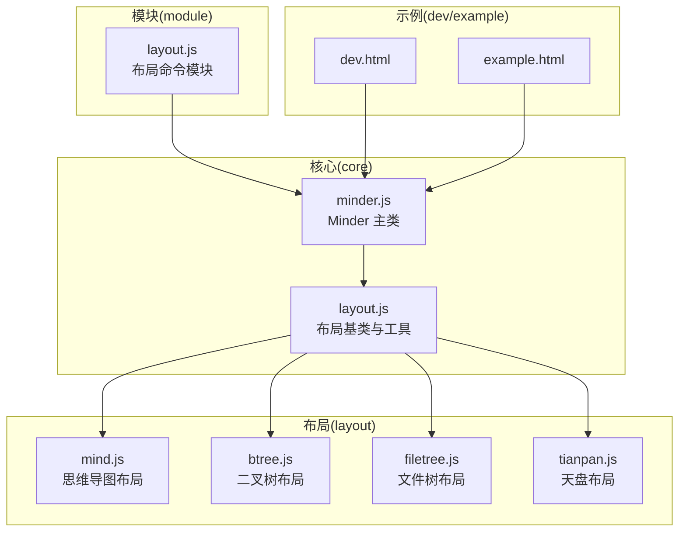
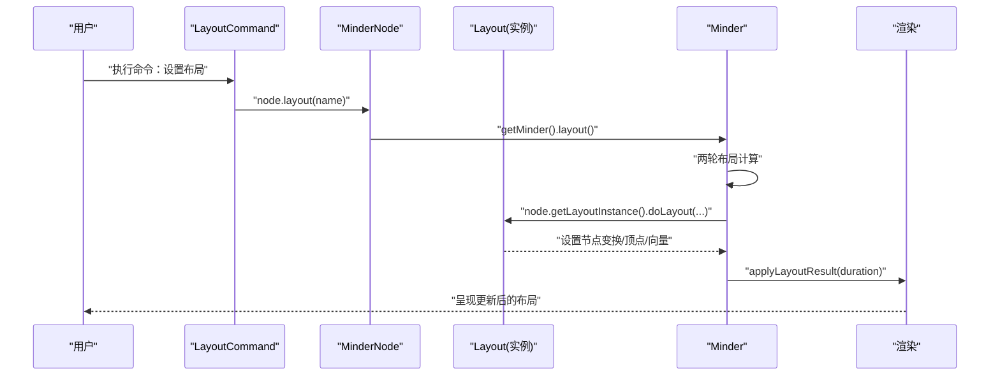
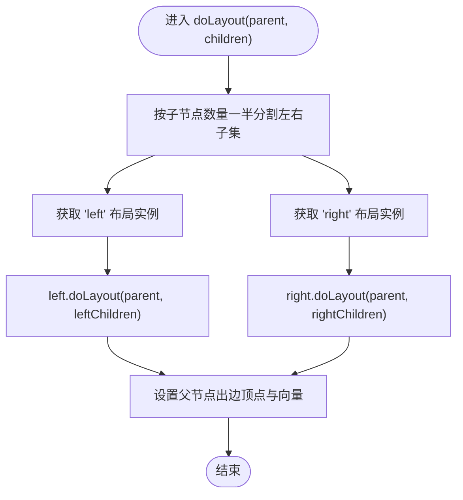
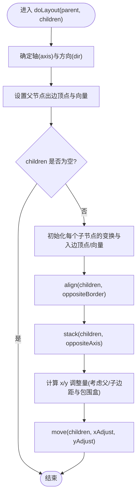
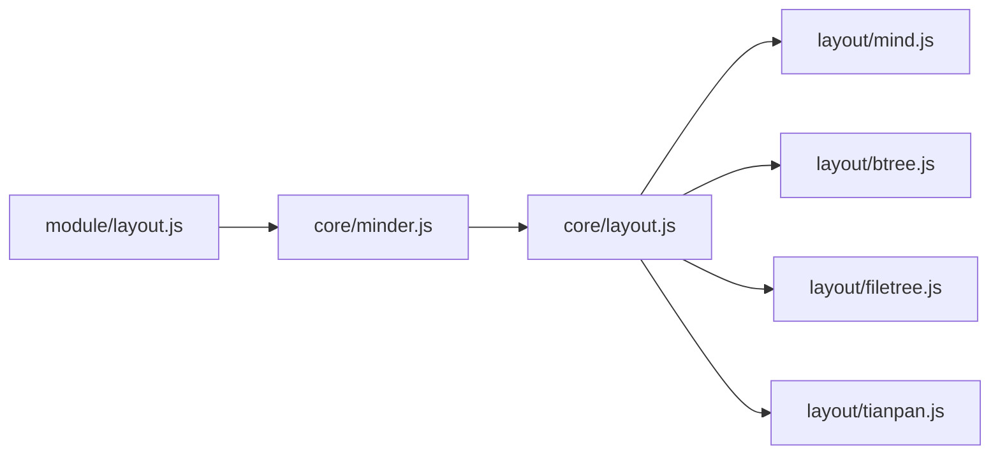

# 自定义布局开发示例

<cite>
**本文引用的文件**
- [Architecture.md](file://doc/Architecture.md)
- [layout.js](file://src/core/layout.js)
- [mind.js](file://src/layout/mind.js)
- [btree.js](file://src/layout/btree.js)
- [filetree.js](file://src/layout/filetree.js)
- [tianpan.js](file://src/layout/tianpan.js)
- [layout.js](file://src/module/layout.js)
- [minder.js](file://src/core/minder.js)
- [dev.html](file://dev.html)
- [example.html](file://example.html)
</cite>

## 目录
1. [引言](#引言)
2. [项目结构](#项目结构)
3. [核心组件](#核心组件)
4. [架构总览](#架构总览)
5. [详细组件分析](#详细组件分析)
6. [依赖分析](#依赖分析)
7. [性能考虑](#性能考虑)
8. [故障排查指南](#故障排查指南)
9. [结论](#结论)
10. [附录](#附录)

## 引言
本文件面向希望快速上手的开发者，提供一系列自定义布局的实践示例，帮助你从零开始实现新的布局算法。我们将以 mind.js 展示如何继承 Layout 基类并注册为 'mind' 布局，重点解析其左右分支的递归布局策略；以 btree.js 演示二叉树布局的对称排布算法；并给出从零开始创建一个简单线性布局（LinearLayout）的完整步骤，展示如何重写 doLayout 方法并使用 stack 工具方法；最后提供一个放射状布局（RadialLayout）的高级示例，展示如何使用三角函数计算节点的环形位置。所有示例均引用 Architecture.md 中的设计原则，并说明如何通过 Minder 实例的 layout() 方法应用新布局。

## 项目结构
KityMinder 的布局体系采用模块化设计，核心布局基类位于 core 层，具体布局算法位于 layout 层，模块层提供命令入口，Minder 负责统一调度与渲染。

图表来源
- [layout.js](file://src/core/layout.js#L1-L120)
- [mind.js](file://src/layout/mind.js#L1-L62)
- [btree.js](file://src/layout/btree.js#L1-L143)
- [filetree.js](file://src/layout/filetree.js#L1-L89)
- [tianpan.js](file://src/layout/tianpan.js#L1-L76)
- [layout.js](file://src/module/layout.js#L1-L92)
- [minder.js](file://src/core/minder.js#L1-L41)
- [dev.html](file://dev.html#L1-L200)
- [example.html](file://example.html#L1-L66)

章节来源
- [Architecture.md](file://doc/Architecture.md#L434-L520)

## 核心组件
- 布局基类 Layout：定义抽象 doLayout 接口、对齐与堆叠工具方法、节点布局变换与顶点/向量设置、布局实例管理与节点布局能力扩展。
- Minder：提供 layout() 统一调度，两轮布局计算与动画应用，刷新与事件分发。
- 布局模块 LayoutModule：提供命令入口，设置/重置节点布局。
- 具体布局：mind、btree、filetree、tianpan 等，均通过 Layout.register(name, Class) 注册。

章节来源
- [layout.js](file://src/core/layout.js#L1-L120)
- [layout.js](file://src/core/layout.js#L170-L236)
- [layout.js](file://src/core/layout.js#L389-L520)
- [layout.js](file://src/module/layout.js#L1-L92)

## 架构总览
下图展示了从用户触发到布局生效的关键流程，包括命令入口、节点布局设置、Minder 布局调度与渲染应用。

图表来源
- [layout.js](file://src/module/layout.js#L1-L92)
- [layout.js](file://src/core/layout.js#L222-L236)
- [layout.js](file://src/core/layout.js#L391-L520)

## 详细组件分析

### 思维导图布局（mind.js）：左右分支递归策略
mind 布局将兄弟节点按索引平分到左右两侧，分别递归调用 'left'/'right' 布局，再设置父节点的出边顶点与向量，形成左右对称的思维导图效果。

要点：
- 分割策略：根据子节点数量的一半划分左右子集。
- 递归布局：通过 Minder.getLayoutInstance('left'|'right') 获取实例并调用 doLayout。
- 出边设置：设置父节点的出边顶点与向量，保证连线从中心出发。

图表来源
- [mind.js](file://src/layout/mind.js#L1-L62)

章节来源
- [mind.js](file://src/layout/mind.js#L1-L62)

### 二叉树布局（btree.js）：对称排布与堆叠
btree 布局支持四个方向（left/right/top/bottom），通过轴向与方向向量确定父子连接方向，使用 align 与 stack 将子节点沿相反轴对齐并在主轴上堆叠，最后根据父/子边距与包围盒进行整体位移。

要点：
- 方向枚举：['left','right','top','bottom']，内部根据轴与方向计算顶点与向量。
- 对齐与堆叠：align(children, oppositeBorder) 与 stack(children, oppositeAxis)。
- 包围盒与位移：getBranchBox(children) 计算子树包围盒，结合父/子边距进行精确对齐。

图表来源
- [btree.js](file://src/layout/btree.js#L1-L143)

章节来源
- [btree.js](file://src/layout/btree.js#L1-L143)

### 线性布局（LinearLayout）：从零开始的完整示例
目标：实现一个简单的水平线性布局，将子节点沿 X 轴依次堆叠，并设置父节点出边与向量。

步骤指引（不直接粘贴代码，仅提供路径与要点）：
1. 定义布局类并继承 Layout 基类，使用 Layout.register('linear', Class) 注册。
2. 在 doLayout 中：
   - 获取父节点内容盒与子节点集合。
   - 为每个子节点设置初始变换（清空矩阵）。
   - 设置子节点入边顶点与向量（指向父节点）。
   - 使用 this.stack(children, 'x') 沿 X 轴堆叠。
   - 使用 this.move(children, dx, 0) 进行整体水平位移。
3. 可选：实现 getOrderHint 提供插入顺序提示区域。
4. 应用：通过 MinderNode.layout('linear') 或命令模块设置布局，随后调用 Minder.layout() 生效。

参考实现位置（路径）：
- [layout.js](file://src/core/layout.js#L1-L120) 基类与工具方法
- [layout.js](file://src/core/layout.js#L170-L236) 注册与节点布局能力
- [layout.js](file://src/module/layout.js#L1-L92) 布局命令模块
- [minder.js](file://src/core/minder.js#L1-L41) Minder 主类

章节来源
- [layout.js](file://src/core/layout.js#L1-L120)
- [layout.js](file://src/core/layout.js#L170-L236)
- [layout.js](file://src/module/layout.js#L1-L92)
- [minder.js](file://src/core/minder.js#L1-L41)

### 放射状布局（RadialLayout）：三角函数环形排布
目标：实现一个放射状布局，将子节点均匀分布在以父节点为中心的环上，使用三角函数计算节点位置。

步骤指引（不直接粘贴代码，仅提供路径与要点）：
1. 定义布局类并继承 Layout 基类，使用 Layout.register('radial', Class) 注册。
2. 在 doLayout 中：
   - 计算平均角度增量 delta_theta，确保节点均匀分布。
   - 为每个子节点设置入边向量与顶点（指向父节点中心）。
   - 使用 this.getTreeBox(child) 计算子树包围盒，动态调整半径 r，避免重叠。
   - 使用三角函数计算 x = r*cos(theta)，y = r*sin(theta) 并移动节点。
3. 可选：根据节点层级或权重微调半径与角度。
4. 应用：通过 MinderNode.layout('radial') 或命令模块设置布局，随后调用 Minder.layout() 生效。

参考实现位置（路径）：
- [layout.js](file://src/core/layout.js#L1-L120) 基类与工具方法
- [tianpan.js](file://src/layout/tianpan.js#L1-L76) 可参考环形/螺旋式位置计算思路
- [layout.js](file://src/module/layout.js#L1-L92) 布局命令模块
- [minder.js](file://src/core/minder.js#L1-L41) Minder 主类

章节来源
- [layout.js](file://src/core/layout.js#L1-L120)
- [tianpan.js](file://src/layout/tianpan.js#L1-L76)
- [layout.js](file://src/module/layout.js#L1-L92)
- [minder.js](file://src/core/minder.js#L1-L41)

### 其他布局示例参考
- 文件树布局（filetree.js）：按上下方向堆叠，使用 align('left') 与 stack('y')，适合层级缩进风格。
- 天盘布局（tianpan.js）：螺旋式环形分布，适合环状结构展示。

章节来源
- [filetree.js](file://src/layout/filetree.js#L1-L89)
- [tianpan.js](file://src/layout/tianpan.js#L1-L76)

## 依赖分析
- 布局基类与工具：layout.js 提供 doLayout 抽象、align/stack/move/getBranchBox/getTreeBox 等通用工具，以及布局实例管理与节点布局能力扩展。
- 布局注册与使用：各布局通过 Layout.register(name, Class) 注册，Minder.getLayoutInstance(name) 获取实例，MinderNode.getLayoutInstance() 获取当前节点布局实例。
- 命令入口：LayoutModule 提供 layout/resetlayout 命令，通过 node.layout(name) 设置布局并触发 Minder.layout()。
- Minder 调度：Minder.layout() 两轮遍历计算，applyLayoutResult() 应用矩阵并处理动画与事件。

图表来源
- [layout.js](file://src/core/layout.js#L1-L120)
- [mind.js](file://src/layout/mind.js#L1-L62)
- [btree.js](file://src/layout/btree.js#L1-L143)
- [filetree.js](file://src/layout/filetree.js#L1-L89)
- [tianpan.js](file://src/layout/tianpan.js#L1-L76)
- [layout.js](file://src/module/layout.js#L1-L92)
- [minder.js](file://src/core/minder.js#L1-L41)

章节来源
- [layout.js](file://src/core/layout.js#L1-L120)
- [layout.js](file://src/core/layout.js#L170-L236)
- [layout.js](file://src/core/layout.js#L389-L520)
- [layout.js](file://src/module/layout.js#L1-L92)

## 性能考虑
- 大规模树优化：当节点复杂度超过阈值时，Minder.applyLayoutResult() 会关闭动画以提升性能。
- 两轮布局：Minder.layout() 采用两轮计算，先计算再应用，有助于稳定布局结果与动画过渡。
- 工具方法复用：优先使用 align/stack/move 等工具方法，减少重复计算与矩阵操作。

章节来源
- [layout.js](file://src/core/layout.js#L458-L520)

## 故障排查指南
- 布局未生效：
  - 确认已通过 node.layout(name) 或命令模块设置布局名称。
  - 确认已调用 Minder.layout() 触发布局计算与渲染。
- 布局名称不存在：
  - 使用 Minder.getLayoutList() 检查可用布局列表。
- 布局异常或重叠：
  - 检查 doLayout 中是否正确设置子节点入边顶点/向量与父节点出边顶点/向量。
  - 使用 align/stack/move 等工具方法进行对齐与堆叠，避免手工矩阵累积错误。
- 动画卡顿：
  - 节点数较多时，系统会自动关闭动画；如需强制动画，可在调用 layout() 时传入动画时长。

章节来源
- [layout.js](file://src/core/layout.js#L170-L236)
- [layout.js](file://src/core/layout.js#L389-L520)
- [layout.js](file://src/module/layout.js#L1-L92)

## 结论
通过继承 Layout 基类并注册布局名称，开发者可以快速实现自定义布局算法。mind.js 展示了左右分支递归策略，btree.js 展示了对称排布与堆叠技巧，而从零开始实现 LinearLayout 与 RadialLayout 则体现了工具方法与数学计算在布局中的关键作用。结合 Minder 的统一调度与命令模块，你可以轻松地在项目中集成并应用新的布局方案。

## 附录
- 如何应用新布局：
  - 在布局文件中注册布局名称并实现 doLayout。
  - 通过命令模块或 node.layout(name) 设置布局名称。
  - 调用 Minder.layout() 触发布局计算与渲染。
- 示例页面：
  - dev.html 与 example.html 展示了如何创建 Minder 实例并加载数据，可在此基础上添加布局切换逻辑。

章节来源
- [layout.js](file://src/module/layout.js#L1-L92)
- [layout.js](file://src/core/layout.js#L222-L236)
- [layout.js](file://src/core/layout.js#L391-L520)
- [dev.html](file://dev.html#L1-L200)
- [example.html](file://example.html#L1-L66)