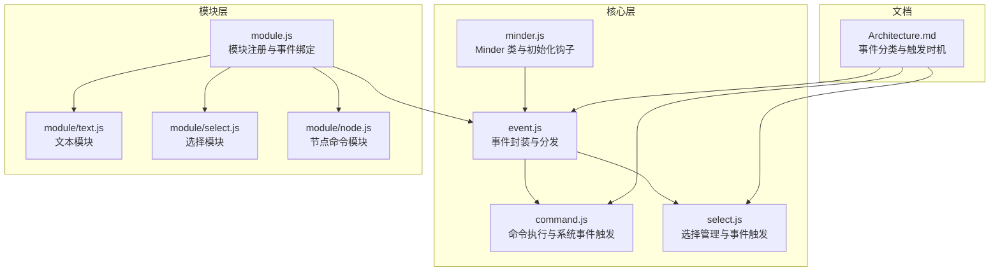
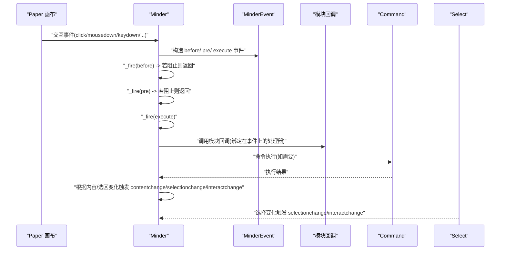
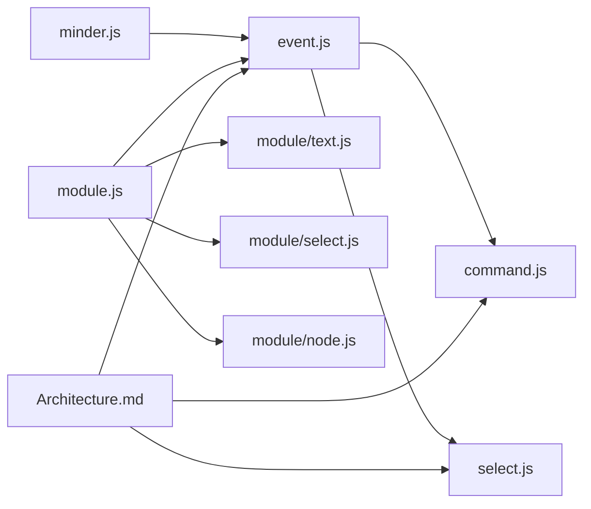

# 事件系统集成

<cite>
**本文引用的文件**
- [event.js](file://src/core/event.js)
- [module.js](file://src/core/module.js)
- [minder.js](file://src/core/minder.js)
- [command.js](file://src/core/command.js)
- [select.js](file://src/core/select.js)
- [Architecture.md](file://doc/Architecture.md)
- [text.js](file://src/module/text.js)
- [select-module.js](file://src/module/select.js)
- [node.js](file://src/module/node.js)
</cite>

## 目录
1. [引言](#引言)
2. [项目结构](#项目结构)
3. [核心组件](#核心组件)
4. [架构总览](#架构总览)
5. [详细组件分析](#详细组件分析)
6. [依赖分析](#依赖分析)
7. [性能考量](#性能考量)
8. [故障排查指南](#故障排查指南)
9. [结论](#结论)
10. [附录](#附录)

## 引言
本篇文档围绕模块中事件处理机制进行深度解析，面向中高级开发者。重点阐述如何在模块定义中通过 events 字段监听交互事件（如 click、keydown）与系统事件（如 beforecommand、contentchange），解释事件回调函数的执行上下文（this 指向 Minder 实例）与事件对象 e 的结构与使用方法。结合 Architecture.md 中的事件分类与触发时机说明，深入分析模块事件绑定在 _initModules 中的实现原理，并提供监听节点点击事件并触发自定义行为的示例路径，以及监听命令执行前后事件实现功能拦截的高级用法。最后覆盖事件绑定性能、作用域管理与事件冒泡处理等实际问题。

## 项目结构
事件系统位于核心层，模块层负责注册与绑定，命令层负责触发系统事件，选择层负责触发 selectionchange 与 interactchange，架构文档定义了事件分类与触发时机。

图表来源
- [event.js](file://src/core/event.js#L133-L266)
- [module.js](file://src/core/module.js#L18-L118)
- [minder.js](file://src/core/minder.js#L13-L39)
- [command.js](file://src/core/command.js#L118-L166)
- [select.js](file://src/core/select.js#L14-L40)
- [Architecture.md](file://doc/Architecture.md#L378-L431)

章节来源
- [event.js](file://src/core/event.js#L133-L266)
- [module.js](file://src/core/module.js#L18-L118)
- [minder.js](file://src/core/minder.js#L13-L39)
- [command.js](file://src/core/command.js#L118-L166)
- [select.js](file://src/core/select.js#L14-L40)
- [Architecture.md](file://doc/Architecture.md#L378-L431)

## 核心组件
- MinderEvent：事件封装类，统一交互事件与系统事件的参数形态，提供坐标获取、命中节点查询、阻止传播与默认行为等能力。
- Minder：事件总线与生命周期管理，负责事件绑定、分发、状态与回调队列管理。
- Module：模块注册与生命周期，负责在模块初始化阶段将 events 映射为 on(type, handler) 绑定。
- Command：命令执行流程，负责在命令执行前后触发 beforeExecCommand、preExecCommand、execCommand 等系统事件，并根据内容/选区变化触发 contentchange、selectionchange 与 interactchange。
- Select：选择管理，负责在选区变化时触发 selectionchange 与 interactchange。
- Architecture.md：定义事件分类、接口与触发时机，是理解事件语义的关键文档。

章节来源
- [event.js](file://src/core/event.js#L10-L127)
- [event.js](file://src/core/event.js#L133-L266)
- [module.js](file://src/core/module.js#L18-L118)
- [command.js](file://src/core/command.js#L118-L166)
- [select.js](file://src/core/select.js#L14-L40)
- [Architecture.md](file://doc/Architecture.md#L378-L431)

## 架构总览
事件系统采用“事件封装 + 生命周期钩子 + 模块绑定 + 命令触发”的分层设计。Minder 初始化时注册事件绑定，捕获底层交互事件后，构造 before/pre/execute 三阶段事件，模块通过 events 字段订阅。命令执行时触发系统事件，选择管理在选区变化时触发 selectionchange 与 interactchange。

图表来源
- [event.js](file://src/core/event.js#L144-L182)
- [module.js](file://src/core/module.js#L90-L95)
- [command.js](file://src/core/command.js#L118-L166)
- [select.js](file://src/core/select.js#L33-L40)

## 详细组件分析

### 事件对象 MinderEvent 结构与使用
- 结构要点
  - type：事件类型（如 click、keydown、beforeclick、preclick、contentchange 等）
  - kityEvent/originEvent：分别指向底层 Kity 事件与原生 DOM 事件
  - minder：事件产生的 Minder 实例（由 Minder._fire 注入）
  - 坐标与命中节点：getPosition(refer)、getTargetNode()
  - 传播控制：shouldStopPropagation、shouldStopPropagationImmediately、stopPropagation、stopPropagationImmediately
  - 默认行为：preventDefault
  - 辅助判断：isRightMB、getKeyCode
- 使用场景
  - 交互事件：通过 getPosition 获取坐标，getTargetNode 获取命中节点，isRightMB 判断右键，getKeyCode 获取按键码
  - 系统事件：在回调中读取 e.minder 获取 Minder 实例，结合业务逻辑进行拦截或扩展

章节来源
- [event.js](file://src/core/event.js#L10-L127)
- [event.js](file://src/core/event.js#L194-L230)

### Minder 事件绑定与分发
- 初始化与绑定
  - Minder.registerInitHook 注册初始化钩子，在构造时调用 _initEvents
  - _bindEvents 绑定画布与窗口事件，统一委托到 _firePharse
- 分发流程
  - _firePharse 将原生事件转换为 before/ pre/ execute 三阶段事件，支持 DOMMouseScroll -> mousewheel 的兼容
  - _fire 根据事件类型与状态拼接回调队列，逐个调用回调，支持立即停止与普通停止
  - dispatchKeyEvent 专门派发键盘事件
- 事件接口
  - on/off/fire：对外暴露事件订阅、取消与触发

章节来源
- [minder.js](file://src/core/minder.js#L13-L39)
- [event.js](file://src/core/event.js#L133-L182)
- [event.js](file://src/core/event.js#L194-L266)

### 模块事件绑定在 _initModules 中的实现原理
- 流程
  - _initModules 遍历模块池，调用模块工厂或直接使用模块对象
  - 将模块的 defaultOptions、init、commands、events、renderers、commandShortcutKeys 等整合
  - 对 events 字段，遍历 type 并通过 me.on(type, handler) 将模块回调绑定到 Minder 实例
- 关键点
  - 回调中的 this 指向 Minder 实例
  - 支持空格分隔的多事件名批量绑定
  - 事件名统一转小写，确保大小写无关

章节来源
- [module.js](file://src/core/module.js#L18-L118)
- [module.js](file://src/core/module.js#L90-L95)

### Architecture.md 中事件分类与触发时机
- 事件分类
  - 交互事件：click、dblclick、mousedown、mousemove、mouseup、keydown、keyup、keypress、touchstart、touchend、touchmove
  - Command 事件：beforecommand、precommand、aftercommand
  - 系统事件：selectionchange、contentchange、interactchange
  - 模块事件：模块自行触发与上述不同名的事件
- 触发时机
  - command 事件仅在顶级命令执行时触发
  - contentchange 在顶级命令后检测内容变化触发
  - selectionchange 在顶级命令后检测选区变化触发
  - interactchange 在所有交互后触发，且进行稀释；手动触发时不稀释

章节来源
- [Architecture.md](file://doc/Architecture.md#L378-L431)

### 监听节点点击事件并触发自定义行为
- 实现思路
  - 在模块 events 中监听 click 或 mousedown
  - 在回调中通过 e.getTargetNode() 获取命中节点
  - 通过 e.getPosition() 获取坐标，结合 minder 实例进行业务处理
- 示例路径
  - 选择模块对 mousedown 的处理：[选择模块事件处理](file://src/module/select.js#L119-L181)
  - 文本模块对渲染器的使用：[文本模块渲染器](file://src/module/text.js#L129-L236)

章节来源
- [select-module.js](file://src/module/select.js#L119-L181)
- [text.js](file://src/module/text.js#L129-L236)

### 监听命令执行前后事件实现功能拦截
- 适用场景
  - 拦截命令执行、记录日志、权限校验、二次确认、埋点上报
- 实现要点
  - 在模块 events 中监听 beforeExecCommand、preExecCommand、execCommand
  - 在回调中读取 e.commandName、e.commandArgs，决定是否调用 e.stopPropagation 或 e.preventDefault
  - 注意：命令事件仅在顶级命令执行时触发
- 示例路径
  - 命令执行流程与系统事件触发：[命令执行与事件触发](file://src/core/command.js#L118-L166)

章节来源
- [command.js](file://src/core/command.js#L118-L166)

### 作用域管理与事件冒泡处理
- 作用域
  - 模块回调中的 this 指向 Minder 实例，便于直接调用 minder 的公开接口
  - 事件对象 e.minder 指向 Minder 实例，便于跨模块共享上下文
- 冒泡与阻止
  - 通过 e.stopPropagation 与 e.stopPropagationImmediately 控制传播
  - before/ pre 阶段若返回真值，可阻止后续阶段继续执行
- 性能建议
  - 避免在高频事件（如 mousemove、touchmove）中执行重计算
  - 使用状态位或节流策略减少重复触发
  - 仅在必要时调用 e.preventDefault，避免影响默认行为

章节来源
- [event.js](file://src/core/event.js#L194-L230)
- [event.js](file://src/core/event.js#L162-L182)

## 依赖分析
事件系统各组件之间的依赖关系如下：

图表来源
- [minder.js](file://src/core/minder.js#L13-L39)
- [event.js](file://src/core/event.js#L133-L266)
- [command.js](file://src/core/command.js#L118-L166)
- [select.js](file://src/core/select.js#L14-L40)
- [module.js](file://src/core/module.js#L18-L118)
- [text.js](file://src/module/text.js#L278-L286)
- [select-module.js](file://src/module/select.js#L111-L183)
- [node.js](file://src/module/node.js#L133-L149)
- [Architecture.md](file://doc/Architecture.md#L378-L431)

章节来源
- [minder.js](file://src/core/minder.js#L13-L39)
- [event.js](file://src/core/event.js#L133-L266)
- [command.js](file://src/core/command.js#L118-L166)
- [select.js](file://src/core/select.js#L14-L40)
- [module.js](file://src/core/module.js#L18-L118)
- [text.js](file://src/module/text.js#L278-L286)
- [select-module.js](file://src/module/select.js#L111-L183)
- [node.js](file://src/module/node.js#L133-L149)
- [Architecture.md](file://doc/Architecture.md#L378-L431)

## 性能考量
- 事件绑定性能
  - 在 _initModules 中批量绑定，避免在运行时动态绑定带来的开销
  - 使用模块 events 字段集中声明，减少重复绑定
- 事件处理性能
  - 高频事件（mousemove、touchmove）中避免重计算，必要时使用节流/去抖
  - 仅在需要时调用 e.preventDefault，避免阻断默认行为导致额外开销
- 传播控制
  - 合理使用 stopPropagation 与 stopPropagationImmediately，避免不必要的回调执行
- 选择与交互事件
  - selectionchange 与 interactchange 会进行稀释，避免频繁触发导致性能问题

[本节为通用性能指导，不直接分析具体文件]

## 故障排查指南
- 回调未触发
  - 检查模块 events 是否正确注册，事件名是否与模块绑定一致
  - 确认事件名大小写无关，但需保证与模块中声明一致
- this 指向异常
  - 模块回调中的 this 指向 Minder 实例，若使用箭头函数或错误绑定，可能导致 this 指向丢失
- 事件被提前阻止
  - before/ pre 阶段若返回真值，会阻止后续阶段执行；检查回调中是否误用 e.stopPropagation
- 坐标与命中节点异常
  - 确保在需要坐标的事件中使用 getPosition，命中节点使用 getTargetNode
- 命令拦截无效
  - 确认监听的是 beforeExecCommand、preExecCommand、execCommand，且仅在顶级命令执行时生效
- 选区变化未触发
  - selectionchange 仅在顶级命令后检测选区变化触发；确保通过命令或选择 API 修改选区

章节来源
- [module.js](file://src/core/module.js#L90-L95)
- [event.js](file://src/core/event.js#L194-L230)
- [command.js](file://src/core/command.js#L118-L166)
- [select.js](file://src/core/select.js#L33-L40)

## 结论
KityMinder 的事件系统通过 MinderEvent 统一封装，Minder 负责事件绑定与分发，模块通过 events 字段实现声明式订阅，命令层负责触发系统事件，选择层负责触发选区与交互事件。该设计清晰地分离了交互事件、系统事件与模块事件，既保证了灵活性，又提供了强大的拦截与扩展能力。开发者应充分利用回调中的 this 指向与事件对象 e 的能力，结合 Architecture.md 的事件分类与触发时机，构建高性能、可维护的事件处理逻辑。

[本节为总结性内容，不直接分析具体文件]

## 附录
- 事件分类与接口（摘自 Architecture.md）
  - 交互事件：click、dblclick、mousedown、mousemove、mouseup、keydown、keyup、keypress、touchstart、touchend、touchmove
  - Command 事件：beforecommand、precommand、aftercommand
  - 系统事件：selectionchange、contentchange、interactchange
  - 模块事件：模块自行触发与上述不同名的事件
- 事件触发时机（摘自 Architecture.md）
  - command 事件仅在顶级命令执行时触发
  - contentchange 在顶级命令后检测内容变化触发
  - selectionchange 在顶级命令后检测选区变化触发
  - interactchange 在所有交互后触发，且进行稀释；手动触发时不稀释

章节来源
- [Architecture.md](file://doc/Architecture.md#L378-L431)