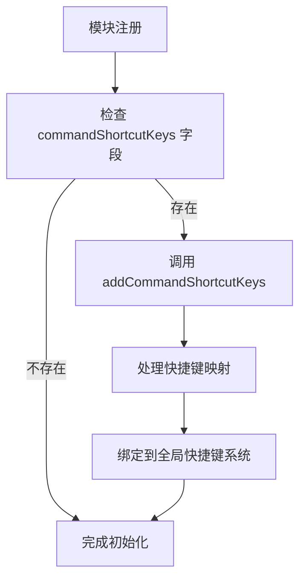
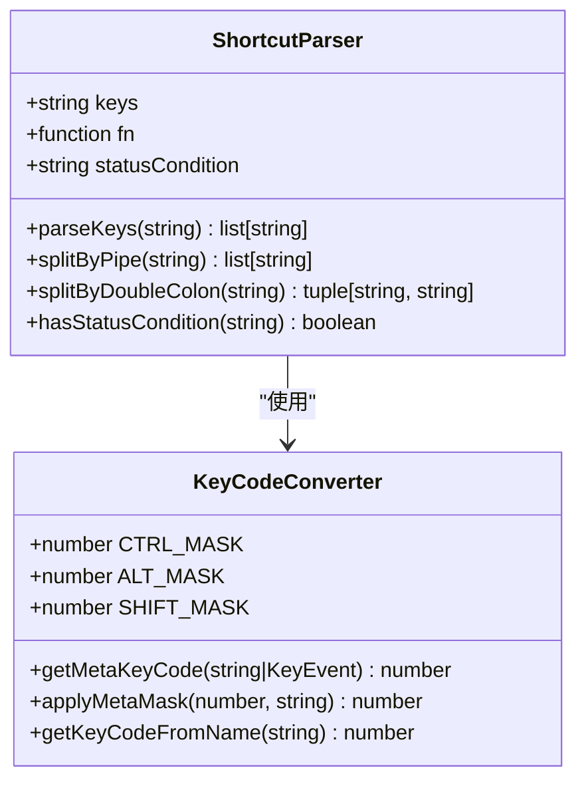
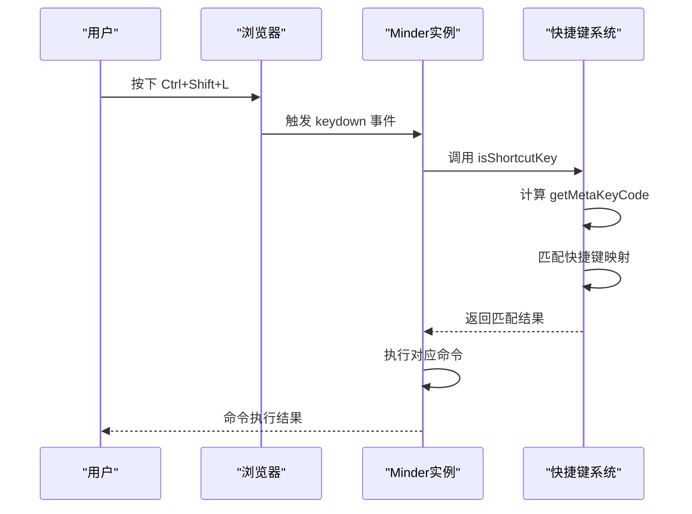
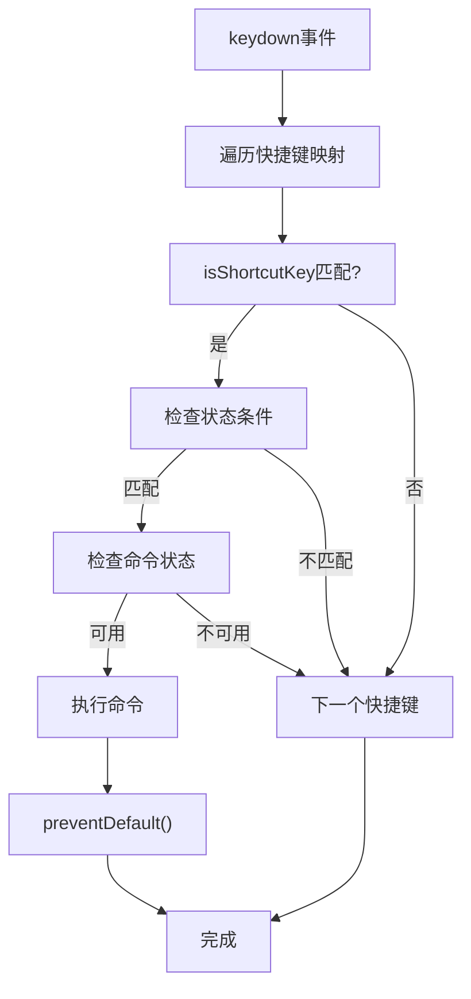
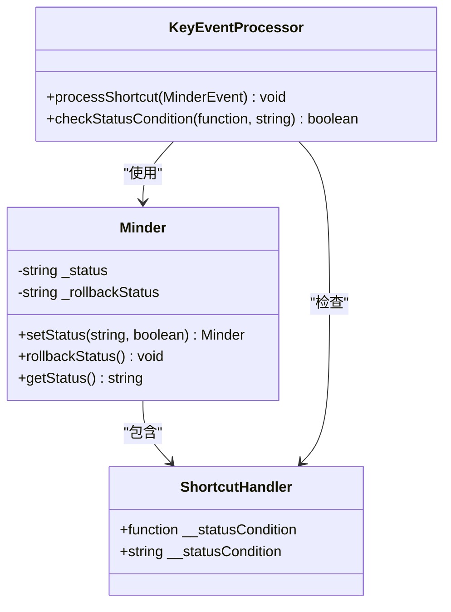
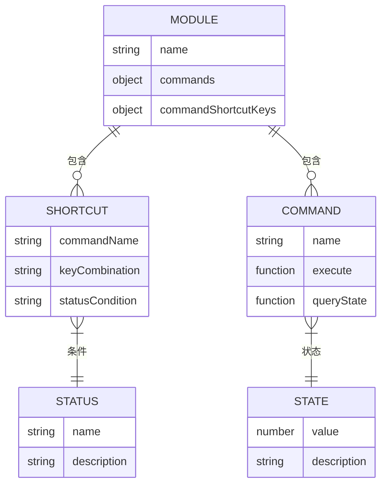

# 快捷键绑定

<cite>
**本文档引用的文件**
- [module.js](file://src/core/module.js)
- [shortcut.js](file://src/core/shortcut.js)
- [keymap.js](file://src/core/keymap.js)
- [command.js](file://src/core/command.js)
- [status.js](file://src/core/status.js)
- [node.js](file://src/module/node.js)
- [clipboard.js](file://src/module/clipboard.js)
- [layout.js](file://src/module/layout.js)
- [zoom.js](file://src/module/zoom.js)
</cite>

## 目录
1. [简介](#简介)
2. [快捷键配置基础](#快捷键配置基础)
3. [快捷键格式规范](#快捷键格式规范)
4. [全局快捷键系统集成](#全局快捷键系统集成)
5. [优先级处理与冲突解决](#优先级处理与冲突解决)
6. [状态感知的快捷键](#状态感知的快捷键)
7. [实际应用示例](#实际应用示例)
8. [可访问性与国际化](#可访问性与国际化)
9. [浏览器默认快捷键协调](#浏览器默认快捷键协调)
10. [最佳实践](#最佳实践)

## 简介
本文档详细介绍了在kityminder-core项目中如何通过`commandShortcutKeys`字段为自定义命令绑定键盘快捷键。文档面向中高级开发者，深入探讨了快捷键配置的格式规范、与全局快捷键系统的集成方式、优先级处理机制以及状态感知功能。通过分析核心代码实现和具体模块示例，为开发者提供全面的快捷键配置指导。

## 快捷键配置基础

在kityminder-core中，模块可以通过`commandShortcutKeys`字段为自定义命令绑定键盘快捷键。当模块注册时，系统会自动处理这些快捷键配置，并将其与相应的命令关联。

模块定义中的`commandShortcutKeys`字段是一个对象，其键为命令名称，值为快捷键组合。系统在初始化模块时会调用`addCommandShortcutKeys`方法来注册这些快捷键。



**图源**
- [module.js](file://src/core/module.js#L113-L116)
- [shortcut.js](file://src/core/shortcut.js#L111-L138)

**节源**
- [module.js](file://src/core/module.js#L113-L116)
- [shortcut.js](file://src/core/shortcut.js#L111-L138)

## 快捷键格式规范

快捷键配置采用字符串格式，支持多种组合方式和特殊语法。系统通过`getMetaKeyCode`函数将字符串表示的快捷键转换为内部的键码表示。

### 基本格式
快捷键字符串由键名组成，使用"+"连接修饰键和主键。支持的修饰键包括：
- `ctrl` 或 `cmd`：控制键
- `alt`：选项键
- `shift`：上档键

### 多重绑定
使用"|"分隔符可以为同一命令配置多个快捷键组合，提供灵活性和用户偏好选择。

### 状态条件
使用"::"分隔符可以指定快捷键的激活状态条件，实现基于应用状态的动态快捷键启用/禁用。



**图源**
- [shortcut.js](file://src/core/shortcut.js#L22-L61)
- [keymap.js](file://src/core/keymap.js#L2-L128)

**节源**
- [shortcut.js](file://src/core/shortcut.js#L22-L61)
- [keymap.js](file://src/core/keymap.js#L2-L128)

## 全局快捷键系统集成

快捷键系统通过事件监听机制与核心应用集成。系统在初始化时注册`keydown`事件监听器，当按键事件发生时，遍历所有注册的快捷键进行匹配。

### 集成流程
1. 模块注册时检查`commandShortcutKeys`字段
2. 调用`addCommandShortcutKeys`方法处理快捷键映射
3. 通过`addShortcut`方法将快捷键绑定到全局系统
4. 在`keydown`事件中进行快捷键匹配和执行

### 事件处理
系统通过`MinderEvent`的`isShortcutKey`方法判断按键事件是否匹配快捷键组合。该方法使用`getMetaKeyCode`函数进行键码比较。



**图源**
- [shortcut.js](file://src/core/shortcut.js#L84-L93)
- [shortcut.js](file://src/core/shortcut.js#L63-L68)

**节源**
- [shortcut.js](file://src/core/shortcut.js#L84-L93)
- [shortcut.js](file://src/core/shortcut.js#L63-L68)

## 优先级处理与冲突解决

快捷键系统通过精确的匹配算法和状态条件机制处理优先级和冲突问题。系统不采用传统的优先级数值，而是通过状态条件和命令可用性来决定快捷键的激活状态。

### 冲突解决机制
1. **状态条件过滤**：只有当当前状态匹配快捷键的状态条件时，快捷键才可能被激活
2. **命令状态检查**：在执行命令前，系统会检查`queryCommandState`返回值，只有状态为0或1时才执行
3. **事件阻止**：一旦匹配到快捷键并执行相应操作，系统会调用`preventDefault`阻止事件继续传播

### 优先级策略
系统通过以下方式实现逻辑上的优先级：
- 状态特定的快捷键优先于通用快捷键
- 命令可用性检查确保只有在适当上下文中的快捷键才有效
- 事件处理顺序确保快捷键在其他处理之前被检查



**图源**
- [shortcut.js](file://src/core/shortcut.js#L87-L91)
- [command.js](file://src/core/command.js#L87-L89)

**节源**
- [shortcut.js](file://src/core/shortcut.js#L87-L91)
- [command.js](file://src/core/command.js#L87-L89)

## 状态感知的快捷键

系统支持基于应用状态的动态快捷键启用/禁用。通过在快捷键配置中使用"::"分隔符指定状态条件，可以实现快捷键的上下文敏感行为。

### 状态管理
核心应用通过`status.js`模块管理应用状态，主要状态包括：
- `normal`：正常状态
- `readonly`：只读状态
- 其他自定义状态

### 动态启用/禁用
快捷键函数通过`__statusCondition`属性存储其激活状态条件。在事件处理时，系统会检查当前状态是否匹配该条件，从而决定是否执行快捷键。

### 实际应用
这种机制允许开发者创建仅在特定状态下有效的快捷键，提高用户体验和操作安全性。



**图源**
- [status.js](file://src/core/status.js#L21-L58)
- [shortcut.js](file://src/core/shortcut.js#L89-L108)

**节源**
- [status.js](file://src/core/status.js#L21-L58)
- [shortcut.js](file://src/core/shortcut.js#L89-L108)

## 实际应用示例

通过分析具体模块的实现，我们可以看到快捷键配置的实际应用方式。

### 节点模块示例
节点模块为常用操作配置了直观的快捷键：

```javascript
'commandShortcutKeys': {
    'appendsiblingnode': 'normal::Enter',
    'appendchildnode': 'normal::Insert|Tab',
    'appendparentnode': 'normal::Shift+Tab|normal::Shift+Insert',
    'removenode': 'normal::Del|Backspace'
}
```

这些配置实现了：
- Enter键添加兄弟节点
- Insert或Tab键添加子节点
- Shift+Tab或Shift+Insert添加父节点
- Del或Backspace删除节点

### 剪贴板模块示例
剪贴板模块实现了标准的复制、剪切、粘贴快捷键：

```javascript
'commandShortcutKeys': {
    'copy': 'normal::ctrl+c',
    'cut': 'normal::ctrl+x',
    'paste': 'normal::ctrl+v'
}
```

### 缩放模块示例
缩放模块配置了常用的缩放快捷键：

```javascript
'commandShortcutKeys': {
    'zoomin': 'ctrl+=',
    'zoomout': 'ctrl+-'
}
```



**图源**
- [node.js](file://src/module/node.js#L142-L147)
- [clipboard.js](file://src/module/clipboard.js#L163-L167)
- [layout.js](file://src/module/layout.js#L87-L89)

**节源**
- [node.js](file://src/module/node.js#L142-L147)
- [clipboard.js](file://src/module/clipboard.js#L163-L167)
- [layout.js](file://src/module/layout.js#L87-L89)

## 可访问性与国际化

快捷键系统在设计时考虑了可访问性和国际化需求，确保不同用户群体都能有效使用。

### 可访问性设计
- 提供多种快捷键组合，适应不同用户习惯
- 支持状态感知，避免在不适当上下文中激活快捷键
- 通过命令状态检查确保操作的安全性

### 国际化支持
虽然当前实现主要基于英文键名，但系统架构支持国际化扩展：
- 键名映射表可以扩展以支持不同语言环境
- 快捷键配置与用户界面文本分离，便于本地化
- 状态名称可以本地化以适应不同语言用户

### 用户自定义
系统架构允许通过配置扩展或修改快捷键，为高级用户提供个性化设置能力。

## 浏览器默认快捷键协调

系统通过事件阻止机制与浏览器默认快捷键协调，确保应用快捷键不会与浏览器关键功能冲突。

### 冲突避免策略
1. **选择非关键组合**：优先使用Ctrl+Shift等较少被浏览器占用的组合
2. **条件性阻止**：仅在匹配到应用快捷键时才调用`preventDefault`
3. **状态隔离**：在只读等特殊状态下可能禁用某些快捷键

### 特殊处理
对于可能与浏览器关键功能冲突的快捷键（如Ctrl+T新建标签页），系统建议避免使用或提供明确的用户提示。

## 最佳实践

基于对代码库的分析，以下是配置快捷键的最佳实践：

### 命名约定
- 使用小写命令名称确保一致性
- 为相关命令使用一致的命名模式
- 在文档中明确说明快捷键功能

### 组合选择
- 优先使用行业标准快捷键（如Ctrl+C复制）
- 避免与浏览器关键功能冲突的组合
- 考虑键盘位置，选择易于操作的组合

### 状态管理
- 合理使用状态条件，避免过度限制
- 确保状态名称清晰明确
- 在状态转换时提供视觉反馈

### 用户体验
- 提供快捷键文档和提示
- 支持多种快捷键组合以适应不同用户
- 考虑残障用户的特殊需求

通过遵循这些最佳实践，开发者可以创建高效、易用且用户友好的快捷键系统。