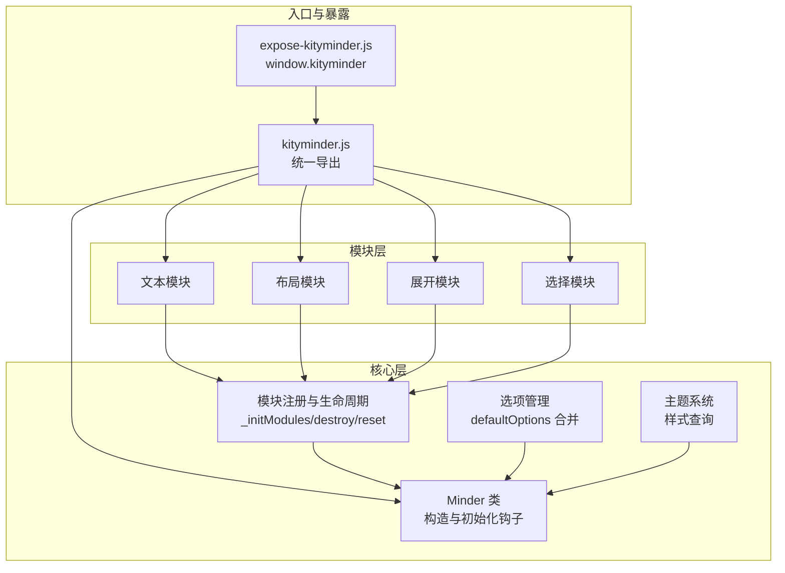
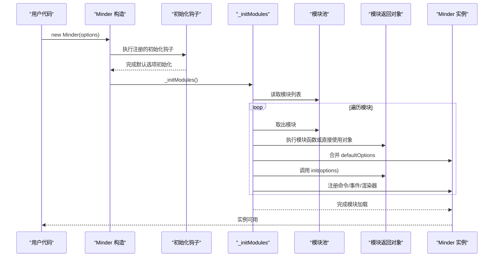
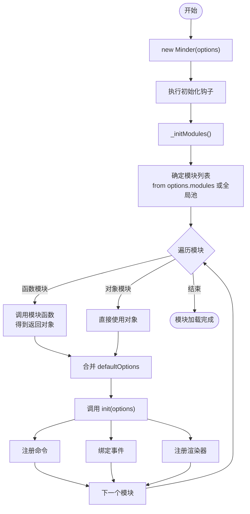
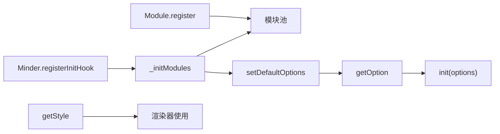

# 模块定义与注册

<cite>
**本文引用的文件**
- [src/core/module.js](file://src/core/module.js)
- [src/core/minder.js](file://src/core/minder.js)
- [src/core/option.js](file://src/core/option.js)
- [src/core/theme.js](file://src/core/theme.js)
- [src/kityminder.js](file://src/kityminder.js)
- [src/expose-kityminder.js](file://src/expose-kityminder.js)
- [doc/Architecture.md](file://doc/Architecture.md)
- [src/module/text.js](file://src/module/text.js)
- [src/module/layout.js](file://src/module/layout.js)
- [src/module/expand.js](file://src/module/expand.js)
- [src/module/select.js](file://src/module/select.js)
</cite>

## 目录
1. [引言](#引言)
2. [项目结构](#项目结构)
3. [核心组件](#核心组件)
4. [架构总览](#架构总览)
5. [详细组件分析](#详细组件分析)
6. [依赖分析](#依赖分析)
7. [性能考量](#性能考量)
8. [故障排查指南](#故障排查指南)
9. [结论](#结论)
10. [附录](#附录)

## 引言
本篇文档围绕 KityMinder 的模块定义与注册机制，系统阐述如何通过 KityMinder.registerModule()/Module.register() 定义功能模块，详解模块返回对象的结构规范、init 初始化方法的执行时机与参数传递、destroy 资源回收机制以及 reset 重置逻辑的实现。同时深入剖析模块配置项 defaultOptions 的合并策略及其在模块生命周期中的作用，并结合 Architecture.md 中的模块定义示例，给出从零创建一个基础模块的完整流程与最佳实践，涵盖模块注册后在 Minder 实例化过程中的加载流程、模块命名冲突、依赖顺序管理及配置项覆盖等常见问题的解决方案。

## 项目结构
KityMinder 的模块系统位于核心层与模块层，核心层负责模块注册、生命周期钩子与实例化流程，模块层提供具体功能模块（如文本、布局、展开、选择等）。入口文件统一导出核心类与模块，暴露全局命名空间以便外部使用。

图表来源
- [src/kityminder.js](file://src/kityminder.js#L1-L107)
- [src/expose-kityminder.js](file://src/expose-kityminder.js#L1-L3)
- [src/core/module.js](file://src/core/module.js#L1-L151)
- [src/core/minder.js](file://src/core/minder.js#L1-L41)
- [src/core/option.js](file://src/core/option.js#L1-L34)
- [src/core/theme.js](file://src/core/theme.js#L1-L128)
- [src/module/text.js](file://src/module/text.js#L1-L289)
- [src/module/layout.js](file://src/module/layout.js#L1-L92)
- [src/module/expand.js](file://src/module/expand.js#L1-L294)
- [src/module/select.js](file://src/module/select.js#L1-L184)

章节来源
- [src/kityminder.js](file://src/kityminder.js#L1-L107)
- [src/expose-kityminder.js](file://src/expose-kityminder.js#L1-L3)

## 核心组件
- 模块注册与生命周期
  - 模块注册：通过 Module.register(name, module) 将模块登记到全局模块池。
  - 生命周期钩子：Minder.registerInitHook 注册初始化钩子，在 Minder 构造时依次执行，触发 _initModules 加载模块。
  - 模块加载：_initModules 从 this._options.modules 或全局模块池中选择模块，执行模块返回对象，注入 defaultOptions、init、commands、events、renderers、commandShortcutKeys 等。
  - 资源回收：destroy 遍历模块，调用每个模块的 destroy；reset 遍历模块，调用每个模块的 reset。
- 选项与配置合并
  - Minder.registerInitHook 注册默认选项初始化。
  - Option 模块提供 setDefaultOptions、getOption、setOption，defaultOptions 与用户选项合并，优先级为用户选项覆盖默认选项。
- 主题系统
  - Theme 模块提供主题注册与样式查询，模块可通过 Minder.getStyle 获取样式值，用于渲染器与交互行为。

章节来源
- [src/core/module.js](file://src/core/module.js#L1-L151)
- [src/core/minder.js](file://src/core/minder.js#L1-L41)
- [src/core/option.js](file://src/core/option.js#L1-L34)
- [src/core/theme.js](file://src/core/theme.js#L1-L128)

## 架构总览
模块系统的关键流程如下：Minder 构造时执行初始化钩子，随后调用 _initModules；_initModules 从模块池中取出模块，执行模块返回对象，将 defaultOptions 合并到 Minder 的默认选项中，调用 init，绑定命令、事件与渲染器，最后将模块实例缓存到 this._modules。销毁与重置时分别调用对应模块的 destroy/reset。

图表来源
- [src/core/minder.js](file://src/core/minder.js#L1-L41)
- [src/core/module.js](file://src/core/module.js#L1-L151)
- [src/core/option.js](file://src/core/option.js#L1-L34)

## 详细组件分析

### 模块返回对象结构规范
模块返回对象支持以下字段：
- defaultOptions：模块提供的默认配置项，将在模块加载时合并到 Minder 的默认选项中。
- init(options)：模块初始化入口，this 指向 Minder 实例，options 为最终配置（用户选项覆盖默认选项后的结果）。
- commands：命令字典，键为命令名（小写），值为命令类构造函数，实例化后注册到 Minder 的命令池。
- events：事件字典，键为事件名，值为回调函数，this 指向 Minder 实例。
- renderers：渲染器字典，键为渲染器类型（如 center/outside），值为渲染器类或数组，注册到 Minder 的渲染器类表。
- commandShortcutKeys：命令快捷键映射，键为命令名，值为快捷键字符串，注册到 Minder 的快捷键系统。
- destroy()：模块资源回收入口，this 指向 Minder 实例。
- reset()：模块重置入口，this 指向 Minder 实例。

章节来源
- [doc/Architecture.md](file://doc/Architecture.md#L198-L255)
- [src/core/module.js](file://src/core/module.js#L1-L151)

### init 初始化方法的执行时机与参数传递
- 执行时机：在 Minder 构造完成后，初始化钩子执行时，调用 _initModules，随后对每个模块调用其 init。
- 参数传递：init 接收的 options 是最终配置，即用户传入的 options 与模块 defaultOptions 合并后的结果。这使得模块可以在 init 中读取最终生效的配置。

章节来源
- [src/core/minder.js](file://src/core/minder.js#L1-L41)
- [src/core/module.js](file://src/core/module.js#L1-L151)
- [src/core/option.js](file://src/core/option.js#L1-L34)

### destroy 资源回收机制
- 触发时机：调用 Minder.destroy() 时，内部会重置事件、清空画布，然后遍历 this._modules，对存在 destroy 的模块逐个调用。
- 注意事项：模块自身负责回收其持有的事件、DOM、定时器等资源；Minder 会自动回收事件与树节点，模块无需重复清理。

章节来源
- [src/core/module.js](file://src/core/module.js#L120-L138)

### reset 重置逻辑的实现
- 触发时机：调用 Minder.reset() 时，内部会清空画布，然后遍历 this._modules，对存在 reset 的模块逐个调用。
- 适用场景：模块需要在不销毁 Minder 实例的情况下恢复到初始状态，如清理临时状态、重置 UI 控件等。

章节来源
- [src/core/module.js](file://src/core/module.js#L140-L149)

### defaultOptions 的合并策略与生命周期作用
- 合并策略：模块返回对象中的 defaultOptions 会在模块加载时调用 Minder.setDefaultOptions 合并到 Minder 的默认选项中。最终实例化时，用户传入的 options 会覆盖默认选项，形成最终 options 传入 init。
- 生命周期作用：defaultOptions 为模块提供可配置的默认值，避免硬编码；init 可据此决定行为；destroy/reset 可据此清理或复位状态。

章节来源
- [src/core/module.js](file://src/core/module.js#L49-L51)
- [src/core/option.js](file://src/core/option.js#L1-L34)

### 从零创建一个基础模块的完整流程
以下流程基于 Architecture.md 的模块定义示例，结合实际代码实现，指导你从零创建一个基础模块：

步骤一：定义模块返回对象
- 在模块文件中，使用 Module.register('YourModule', function(){ return { ... } }) 或 KityMinder.registerModule('YourModule', function(){ return { ... } }) 定义模块。
- 在返回对象中提供 defaultOptions、init、commands、events、renderers、commandShortcutKeys、destroy、reset 等字段（按需提供）。

步骤二：注册命令与事件
- 在 commands 中注册命令类，键名为命令名（小写），值为命令类构造函数。
- 在 events 中注册事件回调，键为事件名，值为回调函数。
- 在 renderers 中注册渲染器类，键为渲染器类型，值为渲染器类或数组。

步骤三：在 init 中使用最终配置
- 在 init 中读取 options，根据配置初始化模块状态、绑定事件或注册快捷键。

步骤四：在 destroy/reset 中清理状态
- 在 destroy 中释放模块持有的资源（事件、DOM、定时器等）。
- 在 reset 中清理临时状态，恢复到初始态。

步骤五：确保模块被加载
- 若模块为独立文件，确保在入口文件中 require 对应模块文件，使其被加载到模块池。
- 若模块为动态注册，确保在 Minder 实例化之前完成注册。

章节来源
- [doc/Architecture.md](file://doc/Architecture.md#L198-L255)
- [src/kityminder.js](file://src/kityminder.js#L1-L107)
- [src/module/text.js](file://src/module/text.js#L1-L289)
- [src/module/layout.js](file://src/module/layout.js#L1-L92)
- [src/module/expand.js](file://src/module/expand.js#L1-L294)
- [src/module/select.js](file://src/module/select.js#L1-L184)

### 模块注册后在 Minder 实例化过程中的加载流程
- Minder 构造：new Minder(options)。
- 初始化钩子：执行 Minder.registerInitHook 注册的钩子，完成默认选项初始化。
- 模块加载：执行 _initModules，从 this._options.modules 或全局模块池中选择模块。
- 模块处理：对每个模块，执行模块函数或直接使用对象，合并 defaultOptions，调用 init，注册命令、事件与渲染器。
- 完成：模块加载完毕，实例可用。

图表来源
- [src/core/minder.js](file://src/core/minder.js#L1-L41)
- [src/core/module.js](file://src/core/module.js#L1-L151)
- [src/core/option.js](file://src/core/option.js#L1-L34)

## 依赖分析
- 模块注册与生命周期
  - Module.register 将模块登记到全局池，_initModules 从池中取出模块并处理。
  - Minder.registerInitHook 保证 _initModules 在 Minder 构造后执行。
- 选项与配置
  - Option 模块提供 setDefaultOptions/getOption/setOption，defaultOptions 与用户选项合并，最终传入 init。
- 主题与样式
  - Theme 模块提供主题注册与样式查询，模块可通过 Minder.getStyle 获取样式值，用于渲染器与交互行为。
- 入口与暴露
  - kityminder.js 统一导出核心类与模块，expose-kityminder.js 将 window.kityminder 暴露为全局变量。

图表来源
- [src/core/module.js](file://src/core/module.js#L1-L151)
- [src/core/minder.js](file://src/core/minder.js#L1-L41)
- [src/core/option.js](file://src/core/option.js#L1-L34)
- [src/core/theme.js](file://src/core/theme.js#L1-L128)

章节来源
- [src/core/module.js](file://src/core/module.js#L1-L151)
- [src/core/minder.js](file://src/core/minder.js#L1-L41)
- [src/core/option.js](file://src/core/option.js#L1-L34)
- [src/core/theme.js](file://src/core/theme.js#L1-L128)
- [src/kityminder.js](file://src/kityminder.js#L1-L107)
- [src/expose-kityminder.js](file://src/expose-kityminder.js#L1-L3)

## 性能考量
- 模块数量与加载顺序：模块越多，初始化耗时越长。建议仅加载必要的模块，或通过 options.modules 精确控制加载集合。
- 渲染器与事件：过多的渲染器与事件绑定会增加渲染与事件处理成本。合理拆分模块，避免在单一模块中注册大量渲染器与事件。
- defaultOptions 合并：defaultOptions 合并发生在模块加载阶段，尽量保持简洁，避免深层嵌套导致的合并开销。
- destroy/reset：在高频重置场景下，确保模块的 reset 能快速清理状态，减少重绘与布局计算。

## 故障排查指南
- 模块未生效
  - 检查模块是否被正确注册到模块池（Module.register 或 KityMinder.registerModule）。
  - 确认模块文件已被入口文件 require，或在实例化前完成注册。
  - 确认 options.modules 中包含该模块名，或未显式限制模块集合。
- init 未执行
  - 检查 Minder 构造是否完成初始化钩子执行。
  - 确认模块返回对象中存在 init 函数。
- defaultOptions 未生效
  - 检查模块返回对象中是否存在 defaultOptions。
  - 确认用户传入的 options 未覆盖相关键值。
- destroy/reset 未清理
  - 确认模块实现了 destroy/reset，并在其中释放资源。
  - 确认 Minder.destroy/reset 被调用。
- 事件冲突
  - 检查模块事件命名是否与已有事件冲突。
  - 使用唯一事件名或在模块内部统一前缀。
- 快捷键冲突
  - 检查 commandShortcutKeys 是否与其他模块冲突。
  - 使用不同的快捷键组合或在模块内部统一前缀。

章节来源
- [src/core/module.js](file://src/core/module.js#L1-L151)
- [src/core/minder.js](file://src/core/minder.js#L1-L41)
- [src/core/option.js](file://src/core/option.js#L1-L34)

## 结论
KityMinder 的模块系统通过模块池、初始化钩子与生命周期管理，实现了模块的灵活注册与加载。模块返回对象提供了标准化的结构规范，defaultOptions 的合并策略确保了配置的可扩展性与可控性。通过 init、destroy、reset 的生命周期钩子，模块能够正确地初始化、回收与重置。结合 Architecture.md 的示例与实际模块实现，开发者可以高效地创建、管理和维护功能模块，并在实例化过程中无缝加载。

## 附录
- 模块定义示例参考：Architecture.md 中的 Module 定义示例。
- 典型模块实现参考：
  - 文本模块：提供命令、渲染器与样式钩子。
  - 布局模块：提供布局与重设布局命令，绑定快捷键。
  - 展开模块：扩展节点状态与渲染器，提供展开/收起命令与事件。
  - 选择模块：提供框选与多选逻辑，绑定鼠标与键盘事件。

章节来源
- [doc/Architecture.md](file://doc/Architecture.md#L198-L255)
- [src/module/text.js](file://src/module/text.js#L1-L289)
- [src/module/layout.js](file://src/module/layout.js#L1-L92)
- [src/module/expand.js](file://src/module/expand.js#L1-L294)
- [src/module/select.js](file://src/module/select.js#L1-L184)